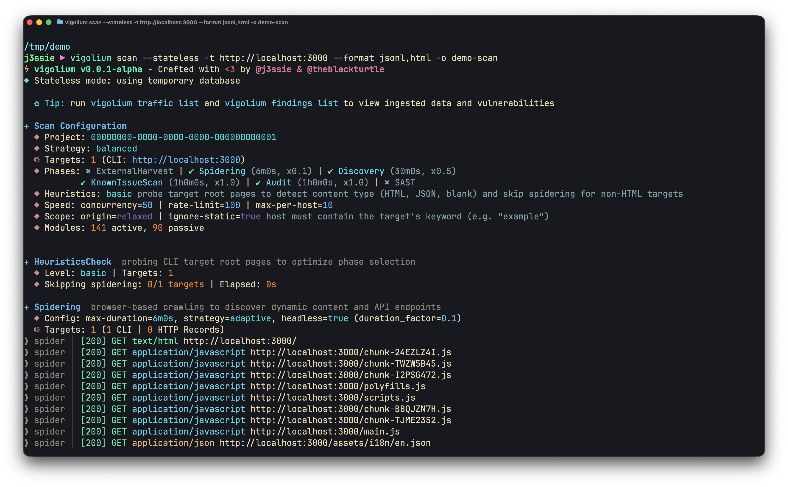
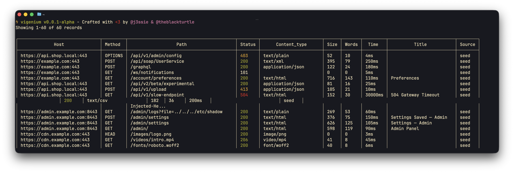
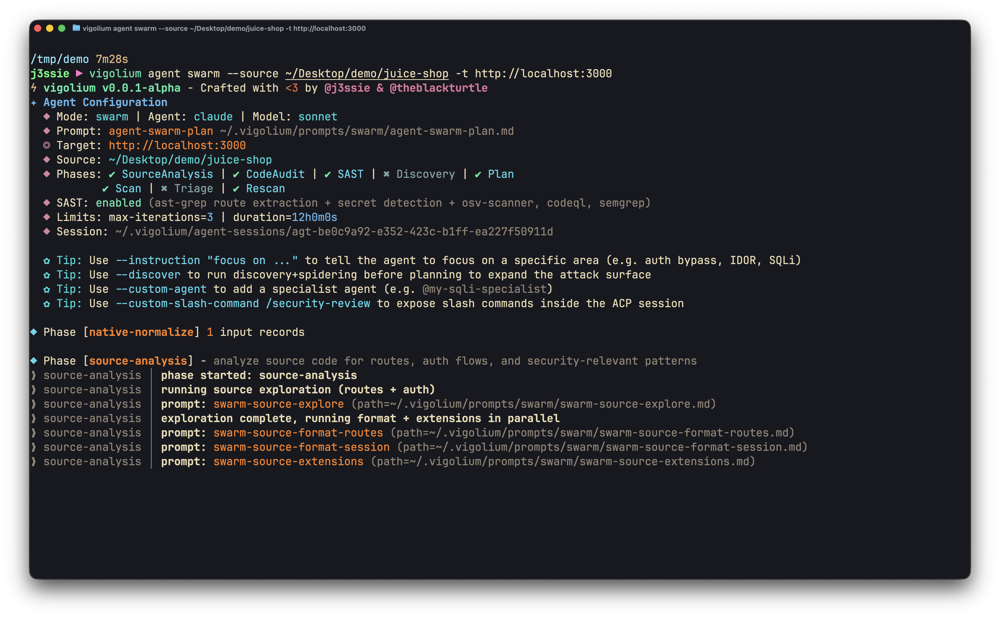
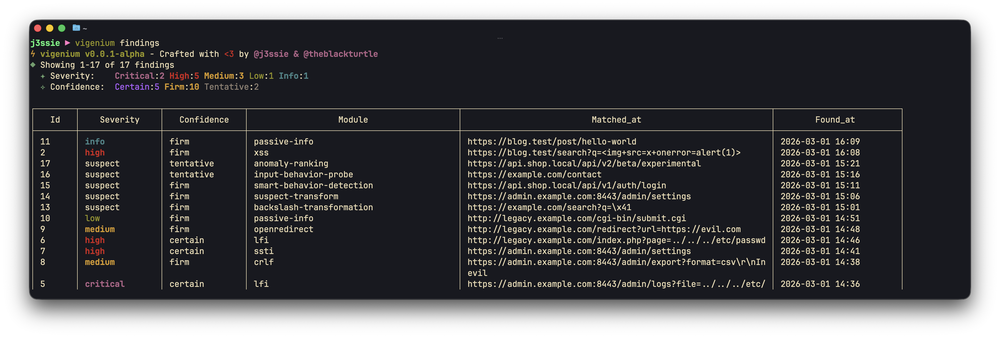
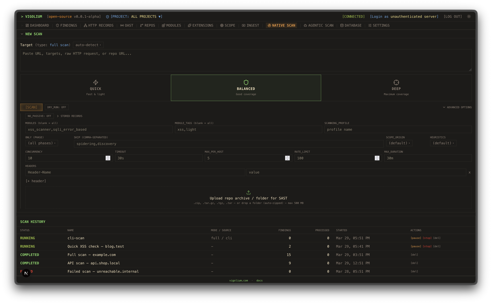
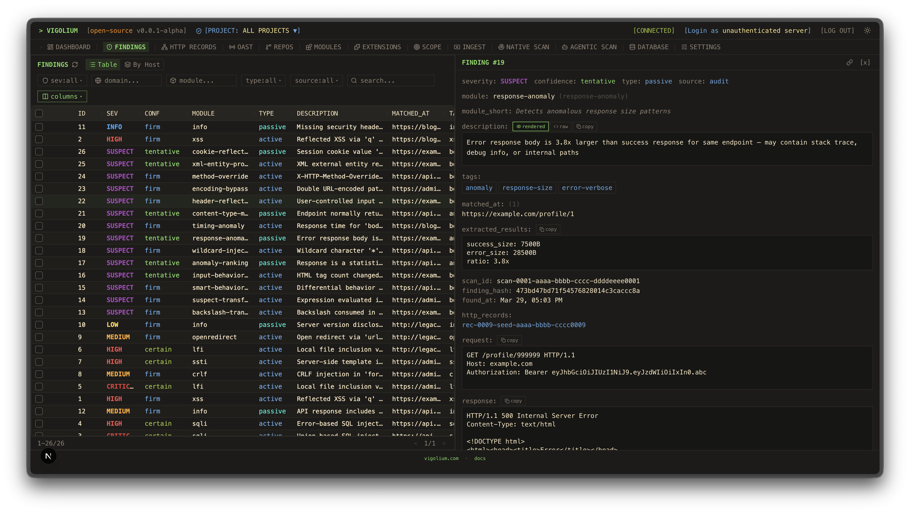
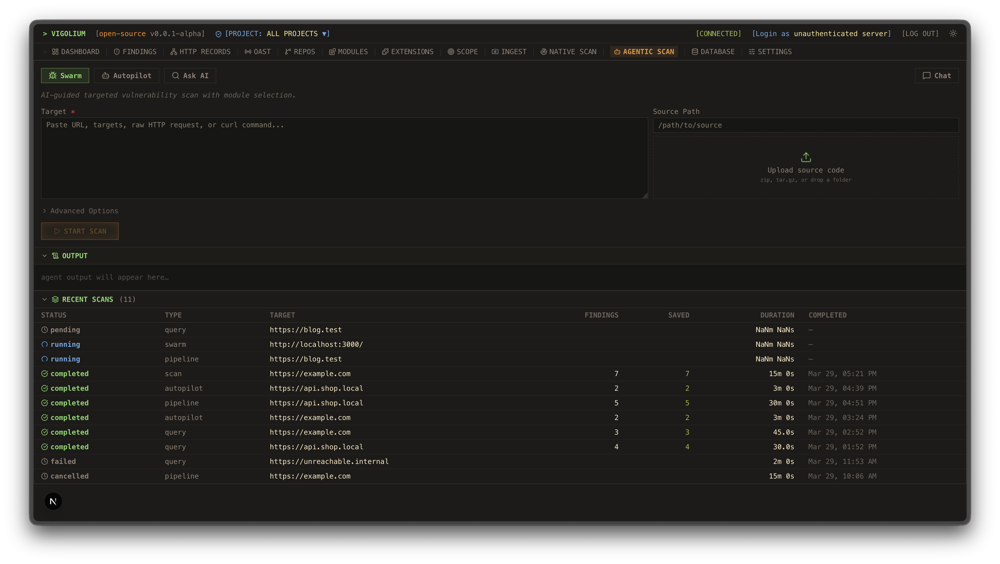
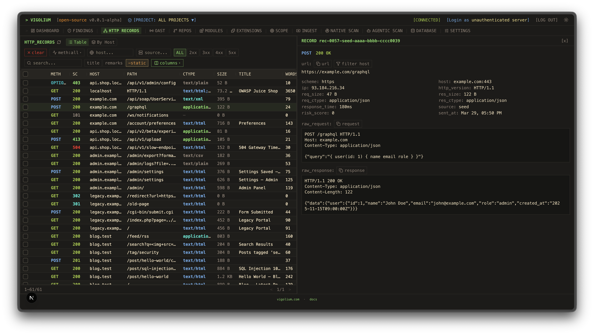
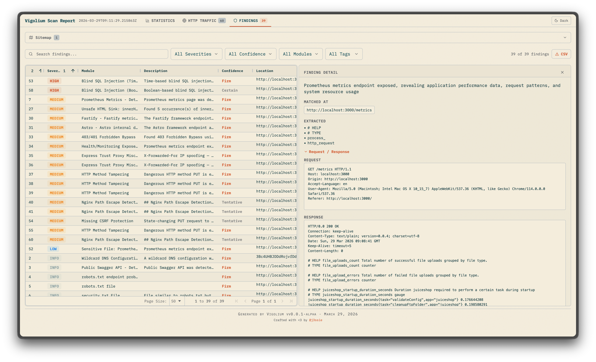
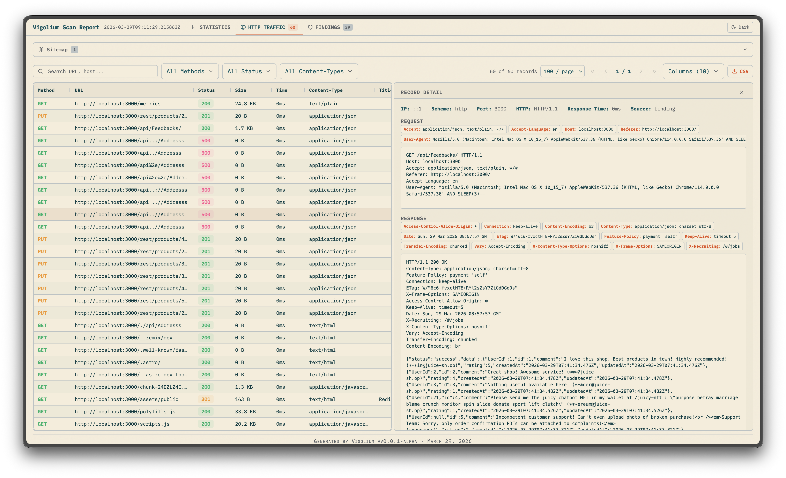

<p align="center">
  
  <br />
  <strong>Vigolium - High-fidelity vulnerability scanner fusing agentic AI with native speed, modularity, and precision</strong>
</p>

**Website:** [vigolium.com](https://www.vigolium.com) | **Documentation:** [docs.vigolium.com](https://docs.vigolium.com)

***

Vigolium provides two complementary scanning modes:

- **Native Scan** (`vigolium scan`) — Deterministic, multi-phase vulnerability scanning. Fast, modular, and repeatable. Runs content discovery, browser spidering, SPA crawling, SAST, and active/passive audit phases with 215 scanner modules covering:
  - **Injection** — XSS (reflected, DOM-based, SSR hydration), SQL injection (error-based, boolean/time-blind), NoSQL injection, SSTI/CSTI, CRLF injection, command injection, XXE/SAML, prototype pollution
  - **Access Control** — CSRF, IDOR, authorization bypass, mass assignment, forbidden bypass, HTTP method tampering
  - **File & Path** — LFI, path traversal, file upload flaws, directory listing, backup/sensitive file discovery, path normalization bypass
  - **API & Protocol** — GraphQL introspection, SSRF (direct & blind), open redirect, HTTP request smuggling, JWT vulnerabilities, JSONP callback, WebSocket security, race conditions
  - **Framework-Specific** — Spring Boot, Django, Laravel, Rails, Express, Next.js, Nuxt, Remix, ASP.NET/Blazor, Flask, FastAPI
  - **CMS** — WordPress (XML-RPC, user enum, AJAX exposure), Drupal, Joomla, CMS installer exposure
  - **Cloud & Infra** — Firebase (RTDB, storage, auth, functions), cloud storage listing/takeover, default credentials, web cache poisoning, CORS misconfiguration
  - **Out-of-Band** — Blind vulnerabilities via OAST callbacks (blind SSRF, blind SSTI, OAST probes)

- **Agentic Scan** (`vigolium agent`) — AI-driven scanning powered by Claude, Codex, Gemini, OpenCode, or Cursor via protocol-specific SDK integration. The agent autonomously plans attack strategies, selects modules, generates custom payloads, and triages results — with the native scan engine handling heavy lifting underneath. Two agentic scan modes: autopilot (autonomous) and swarm (targeted or full-scope with `--discover`), plus query mode for single-shot code review.

It also operates as an API server with traffic ingestion, or a standalone ingestor client.


| CLI Scan | Traffic & Finding List |
|:---:|:---:|
|  |  |
|  |  |

| UI Dashboard | More Dashboard |
|:---:|:---:|
|  |  |
|  |  |

| Static Reports | Static Reports |
|:---:|:---:|
|  |  |

## Key Features

### Native Scan

- **215 scanner modules** — 130 active (fuzzing) and 85 passive (pattern matching) modules covering OWASP Top 10 and beyond
- **Out-of-band testing (OAST)** — detect blind vulnerabilities (blind XSS, SSRF, command injection) via interactsh callback URLs with automatic payload correlation
- **Value-aware mutation** — classify parameter values by semantic type (integer, UUID, JWT, email, etc.) and generate intelligent mutations per intent (neighbor, boundary, escalation)
- **Multi-phase pipeline** — external harvesting, content discovery, SPA crawling, and audit controlled by strategy presets
- **Scanning profiles** — bundle strategy, pace, scope, and module config into a single YAML file (`--scanning-profile`)
- **Multiple input formats** — URLs, OpenAPI/Swagger, Postman, Burp Suite, cURL, Nuclei JSONL
- **Browser-based spider** — Chromium-driven crawler (Spitolas) with SPA support, form filling, and JS analysis
- **Content discovery** — adaptive directory/file enumeration engine (Deparos) with soft-404 detection
- **Header injection** — automatic fuzzing of existing and synthetic headers (X-Forwarded-For, X-Forwarded-Host, True-Client-IP, Referer)
- **Multi-session authentication** — inline sessions (`--session`), session files (`--session-file`), or full auth configs (`--auth-config`) with login flows, token extraction, and IDOR/BOLA testing
- **JavaScript extensions** — custom modules and hooks via embedded JS engine (`vigolium.http`, `vigolium.scan`, `vigolium.source`) with session-aware HTTP APIs (login flows, cookie jars, CSRF extraction, auth testing, request sequencing)
- **Source code awareness** — link repos to hostnames for source-aware scanning with `vigolium.source.*` API
- **Concurrent architecture** — configurable worker pool with per-host rate limiting and hybrid in-memory/disk/Redis queue
- **HTML reports** — generate self-contained HTML reports with sortable/filterable ag-grid tables (`--format html`)

### Agentic Scan

- **Autonomous scanning (Autopilot)** — AI agent autonomously discovers endpoints, runs scans, and triages findings. SDK protocol (default) provides full coding agent tools; ACP protocol uses a sandboxed terminal with command allowlisting. Supports multi-agent specialist pipeline and session resume
- **AI-guided swarm (Swarm)** — master agent analyzes inputs, selects scanner modules, generates custom JS attack extensions, executes scans, and triages results. Supports both targeted single-request scanning and full-scope scanning with `--discover`. Includes AI code audit, native SAST (ast-grep), and batched execution for large input sets. `agent pipeline` is a backward-compatible alias for `swarm --discover`
- **Query mode** — single-shot prompt execution for code review, endpoint discovery, and secret detection (not a scan — simple Q&A utility)
- **Source-aware intelligence** — when `--source` is provided, agents run consolidated source analysis (route extraction, auth flow discovery, custom extension generation), AI code audit, and native SAST before scanning
- **Multiple AI backends** — Claude (SDK/ACP/pipe), Codex (native/ACP), OpenCode (native/ACP), Gemini (ACP), Cursor (ACP), or custom agents via CLI or REST API (with SSE streaming)

### Platform

- **API server mode** — REST API with Swagger UI, multi-format ingestion, transparent HTTP proxy, OpenAI-compatible agent endpoint

## Installation

```bash
git clone https://github.com/vigolium/vigolium.git
cd vigolium
make deps          # download Go modules + jsscan binaries
make build         # build and install to $GOPATH/bin
```

Requires **Go 1.26+**. See [docs/development/building.md](docs/development/building.md) for prerequisites, cross-compilation, embedded Chromium builds, and Docker.

## Quick Start — Native Scan

```bash
# Scan a single target (default: balanced strategy)
vigolium scan -t https://example.com

# Scan with a strategy preset
vigolium scan -t https://example.com --strategy deep

# Scan specific modules only
vigolium scan -t https://example.com -m xss-reflected,sqli-error

# Scan from an OpenAPI spec
vigolium scan -T openapi.yaml -I openapi

# Pipe URLs from stdin
cat urls.txt | vigolium scan

# Run a single phase directly
vigolium run discovery -t https://example.com

# Generate an HTML report
vigolium scan -t https://example.com --only discovery --format html -o report.html
```

See [docs/overview.md](docs/overview.md) for the full overview and [docs/native-scan/strategies.md](docs/native-scan/strategies.md) for strategies, profiles, and pace configuration.

## Server Mode

```bash
# Start API server with authentication
vigolium server -k my-secret-key

# Enable transparent HTTP proxy for traffic recording
vigolium server -k my-key --ingest-proxy-port 9003

# Auto-scan ingested traffic
vigolium server -k my-key --scan-on-receive
```

```bash
# Ingest traffic to a running server
cat urls.txt | vigolium ingest -s http://localhost:9002

# Ingest an OpenAPI spec
vigolium ingest -s http://localhost:9002 -i api.yaml -I openapi
```

See [docs/server-mode/running-the-server.md](docs/server-mode/running-the-server.md) for server setup, [docs/server-mode/ingestion.md](docs/server-mode/ingestion.md) for ingestion workflows, and [docs/api-overview.md](docs/api-overview.md) for the full REST API reference.

## Authenticated Scanning

Vigolium supports multi-session authenticated scanning for IDOR/BOLA testing and privilege escalation checks:

```bash
# Inline session via CLI flag (name:Header:value)
vigolium scan -t https://example.com \
  --session "admin:Cookie:session_id=abc123" \
  --session "user:Cookie:session_id=xyz789"

# Load session from YAML/JSON file
vigolium scan -t https://example.com --session-file ./admin-session.yaml

# Full auth configuration with login flows
vigolium scan -t https://example.com --auth-config ./auth-config.yaml

# Add custom headers (works with sessions)
vigolium scan -t https://example.com -H "Authorization: Bearer token123"
```

Session files support static headers, bearer tokens, and automated login flows with token extraction from cookies, JSON responses, or headers. Preset examples are available in `public/presets/sessions/`. See [docs/native-scan/authentication.md](docs/native-scan/authentication.md) for the full guide.

## Agentic Scan

AI-driven scanning where agents autonomously plan, execute, and triage vulnerability assessments with the native scan engine underneath:

```bash
# Autopilot: autonomous AI-driven scanning (SDK protocol — full tool access)
vigolium agent autopilot -t https://example.com
vigolium agent autopilot -t https://example.com --source ./src --focus "auth bypass"
vigolium agent autopilot -t https://example.com --specialists injection,xss,auth

# Swarm: AI-guided targeted or full-scope vulnerability scanning
vigolium agent swarm -t https://example.com/api/users --vuln-type sqli
vigolium agent swarm -t https://example.com --discover  # full-scope (replaces pipeline)
vigolium agent swarm -t https://example.com --source ./src --discover  # source-aware full-scope
vigolium agent swarm --input "curl -X POST https://example.com/api/login -d '{\"user\":\"admin\"}'"

# Pipeline: backward-compatible alias for swarm --discover
vigolium agent pipeline -t https://example.com
```

Two agentic scan modes:
- **Autopilot** — autonomous scanning with multi-agent specialist pipeline. SDK protocol (default) provides full coding agent tools; ACP protocol uses a sandboxed terminal restricted to `vigolium` commands
- **Swarm** — AI-guided vulnerability scanning supporting both targeted single-request and full-scope (`--discover`). Master agent analyzes inputs, selects modules, generates custom JS extensions, runs code audit and SAST, executes scans, and triages results. `agent pipeline` is a backward-compatible alias for `swarm --discover`

### Agent Query (Utility)

Single-shot prompts for code review, endpoint discovery, and secret detection — not a scan, just Q&A:

```bash
# Security code review of a repository
vigolium agent query --source ./myapp --prompt-template security-code-review

# Send a freeform prompt
vigolium agent query --prompt "Explain the OWASP Top 10 in one sentence each"

# Dry run — render prompt without executing
vigolium agent query --source ./myapp --prompt-template endpoint-discovery --dry-run

# Browse agent sessions
vigolium agent session list --mode pipeline --limit 20

# List available agents and templates
vigolium agent --list-agents
vigolium agent --list-templates
```

Configure agent backends in `~/.vigolium/vigolium-configs.yaml`. The default backend (`claude`) uses the SDK protocol with full CLI tool access. Custom prompt templates go in `~/.vigolium/prompts/`. See [docs/agentic-scan/agent-mode.md](docs/agentic-scan/agent-mode.md) for the full guide.

## Native Scan Layers

The native scan pipeline is composed of modular layers, each documented separately:

| Layer | Description | Docs |
|-------|-------------|------|
| **Content Discovery (Deparos)** | Adaptive directory/file enumeration with fingerprint-based soft-404 detection | [docs/native-scan/phases/discovery.md](docs/native-scan/phases/discovery.md) |
| **Browser Spider (Spitolas)** | Chromium-driven state-machine crawler with CDP traffic capture | [docs/native-scan/phases/spidering.md](docs/native-scan/phases/spidering.md) |
| **SPA Scanning** | Single Page Application handling with DOM mutation tracking and async API capture | [docs/native-scan/phases/spa.md](docs/native-scan/phases/spa.md) |
| **Audit** | Active/passive vulnerability scanning with insertion point extraction and DiffScan framework | [docs/native-scan/phases/audit.md](docs/native-scan/phases/audit.md) |
| **Scanner Modules** | 130 active and 85 passive modules covering OWASP Top 10 and beyond | [docs/native-scan/modules-reference.md](docs/native-scan/modules-reference.md) |

## Documentation

| Topic | Link |
|-------|------|
| Overview | [docs/overview.md](docs/overview.md) |
| Getting Started | [docs/getting-started.md](docs/getting-started.md) |
| Configuration | [docs/configuration.md](docs/configuration.md) |
| Output & Reporting | [docs/output-and-reporting.md](docs/output-and-reporting.md) |
| Troubleshooting | [docs/troubleshooting.md](docs/troubleshooting.md) |
| Scanning Modes Overview | [docs/native-scan/scanning-modes-overview.md](docs/native-scan/scanning-modes-overview.md) |
| Scanning Strategies | [docs/native-scan/strategies.md](docs/native-scan/strategies.md) |
| Authenticated Scanning | [docs/native-scan/authentication.md](docs/native-scan/authentication.md) |
| Content Discovery (Deparos) | [docs/native-scan/phases/discovery.md](docs/native-scan/phases/discovery.md) |
| Browser Spider (Spitolas) | [docs/native-scan/phases/spidering.md](docs/native-scan/phases/spidering.md) |
| SPA Scanning | [docs/native-scan/phases/spa.md](docs/native-scan/phases/spa.md) |
| Audit | [docs/native-scan/phases/audit.md](docs/native-scan/phases/audit.md) |
| Scanner Modules Reference | [docs/native-scan/modules-reference.md](docs/native-scan/modules-reference.md) |
| Agent Mode | [docs/agentic-scan/agent-mode.md](docs/agentic-scan/agent-mode.md) |
| Agentic Scan: How It Works | [docs/agentic-scan/how-it-works.md](docs/agentic-scan/how-it-works.md) |
| Autopilot | [docs/agentic-scan/autopilot.md](docs/agentic-scan/autopilot.md) |
| Swarm | [docs/agentic-scan/swarm.md](docs/agentic-scan/swarm.md) |
| Query Mode | [docs/agentic-scan/query.md](docs/agentic-scan/query.md) |
| Server Mode | [docs/server-mode/running-the-server.md](docs/server-mode/running-the-server.md) |
| Ingestion | [docs/server-mode/ingestion.md](docs/server-mode/ingestion.md) |
| REST API Reference | [docs/api-overview.md](docs/api-overview.md) |
| Writing Extensions | [docs/customization/writing-extensions.md](docs/customization/writing-extensions.md) |
| Extending Vigolium | [docs/customization/extending-vigolium.md](docs/customization/extending-vigolium.md) |
| Developing Modules | [docs/development/developing-modules.md](docs/development/developing-modules.md) |
| Building from Source | [docs/development/building.md](docs/development/building.md) |
| Project Structure | [docs/development/project-structure.md](docs/development/project-structure.md) |
| Whitebox Scanning | [docs/guides/whitebox-scanning.md](docs/guides/whitebox-scanning.md) |
| CI/CD Integration | [docs/guides/ci-cd-integration.md](docs/guides/ci-cd-integration.md) |

## JavaScript Engine

Run JavaScript/TypeScript code directly or write custom scan modules and hooks without recompiling:

```bash
# Execute inline JavaScript
vigolium js --code 'let r = vigolium.http.get(TARGET); console.log(r.statusCode)' -t https://example.com

# Run a JS file with timeout
vigolium js --code-file ./my-script.js -t https://example.com --timeout 60s

# Manage extensions
vigolium ext ls                # list loaded extensions
vigolium ext docs --example    # browse API with code examples
vigolium ext preset            # install starter scripts
```

The JS engine exposes session-aware HTTP APIs for authenticated testing:

```javascript
// Create a persistent session with shared cookie jar
let session = vigolium.http.session();
session.post("https://app.example.com/login", { user: "admin", pass: "secret" });
session.get("https://app.example.com/dashboard"); // cookies auto-sent

// Automated login flow with token extraction
let authed = vigolium.http.login({
  url: "https://app.example.com/api/auth",
  method: "POST",
  body: JSON.stringify({ username: "admin", password: "pass" }),
  extract: [{ source: "json", path: "$.token", apply_as: "Authorization: Bearer {value}" }]
});

// IDOR/BOLA testing across multiple sessions
let results = vigolium.http.authTest({
  sessions: { admin: adminSession, user: userSession },
  requests: [{ method: "GET", url: "https://app.example.com/api/users/1" }]
});

// Multi-step authentication sequences
let result = vigolium.http.sequence([
  { url: "/csrf", extract: [{ source: "cookie", name: "csrf_token", as: "token" }] },
  { url: "/login", method: "POST", body: "csrf={token}&user=admin" }
]);

// Parallel request batching (race conditions, IDOR)
let responses = vigolium.http.batch([req1, req2, req3], { concurrency: 10 });

// CSRF token extraction
let csrf = vigolium.http.csrf("https://app.example.com/form");

// HTTP request replay with variations
let varied = vigolium.http.replay(rawRequest, [
  { headers: { "Authorization": "Bearer admin_token" } },
  { headers: { "Authorization": "Bearer user_token" } }
]);
```

See [docs/customization/writing-extensions.md](docs/customization/writing-extensions.md) for the extension authoring guide and `pkg/jsext/vigolium.d.ts` for the full TypeScript API definitions.

## CLI Reference

### Commands

```
vigolium scan                Run a native scan — deterministic multi-phase vulnerability scanning
vigolium run <phase>         Run a single native scan phase (alias for scan --only <phase>)
vigolium scan-url <url>      Quick native scan of a single URL
vigolium scan-request        Native scan from a raw HTTP request

vigolium agent autopilot     Agentic scan: autonomous AI-driven vulnerability scanning
vigolium agent swarm         Agentic scan: AI-guided targeted or full-scope vulnerability scanning
vigolium agent pipeline      Agentic scan: alias for swarm --discover (backward compat)
vigolium agent query         Send a prompt to an AI agent and get a response

vigolium server              Start the API server with traffic ingestion
vigolium ingest              Ingest traffic to a running server
vigolium js                  Execute JavaScript/TypeScript code

vigolium db                  Database operations (list, stats, export, clean)
vigolium finding             Browse and manage findings
vigolium traffic             Browse and manage HTTP records
vigolium project             Manage projects (create, list, use, config)
vigolium ext                 Manage JavaScript extensions
```

### Flags

```
Native Scan (vigolium scan / run):
  -t, --target           Target URL
  -T, --target-file      File containing target URLs
  -i, --input            Input file path (- for stdin)
  -I, --input-mode       Input format: urls, openapi, nuclei, burpxml, curl, postman
  -m, --modules          Modules to run (comma-separated or 'all')
      --strategy         Strategy preset: lite, balanced, deep, whitebox
      --scanning-profile Scanning profile name or YAML path
      --only             Single phase: ingestion, discover (deparos), spidering (spitolas),
                         external-harvest, spa, sast, audit

Authentication:
      --session           Inline session definition (name:Header:value, repeatable)
      --session-file      Session YAML/JSON file path (repeatable)
      --auth-config       Full auth configuration file path
  -H, --header           Custom HTTP header (repeatable)

Performance:
  -c, --concurrency      Concurrent workers (default: 50)
  -r, --rate-limit       Max requests/sec (default: 0 = unlimited)
      --max-per-host     Per-host concurrency cap (default: 2)
      --proxy            HTTP/SOCKS5 proxy URL
      --timeout          HTTP request timeout (default: 15s)

Agentic Scan (vigolium agent autopilot / pipeline / swarm):
      --source             Path to source code for source-aware scanning
      --source-label       Label for source code ingestion
      --agent              Agent backend name (default: from config)
      --agent-acp-cmd      Custom ACP agent command (overrides --agent)
      --agent-timeout      Max agent execution time (default: 5m, 0 = no limit)
      --vuln-type          Vulnerability type focus (sqli, xss, ssrf, etc.)
      --focus              Focus area for the agentic scan (e.g. 'API injection')
      --max-iterations     Max triage-rescan iterations (default: 3)
      --max-rescan-rounds  Max rescan rounds in pipeline mode (default: 2)
      --source-analysis-only  Run only source analysis phase and exit
      --skip-phase         Skip a pipeline phase (repeatable)
      --start-from         Start pipeline from a specific phase

JavaScript:
      --code             Inline JavaScript to execute
      --code-file        Path to JS/TS file to execute
      --timeout          Execution timeout (default: 30s)

Output:
  -j, --json             JSON output
      --format           Output format: console, jsonl, html
  -o, --output           Output file path
      --silent           Suppress all output except findings
  -v, --verbose          Verbose logging
```

## Repository Layout

The `platform/` directory contains external tooling, UI Dashboard and is not part of the core scanner. No changes should be made to it.

## Benchmarks

Vigolium is continuously benchmarked against intentionally vulnerable applications and also heavily tested against real-world targets through bug bounty and responsible disclosure programs.

- **Self-hosted (Docker):** [DVWA](https://github.com/digininja/DVWA), [OWASP Juice Shop](https://github.com/juice-shop/juice-shop), [VAmPI](https://github.com/erev0s/VAmPI), [crAPI](https://github.com/OWASP/crAPI), [Vulnerable Java App](https://github.com/DataDog/vulnerable-java-application), [Vulnerable Nginx](https://github.com/detectify/vulnerable-nginx), [OopsSec Store](https://github.com/kOaDT/oss-oopssec-store) (custom Next.js app)
- **External (hosted):** [Acunetix TestPHP](http://testphp.vulnweb.com), [Gin & Juice Shop](https://ginandjuice.shop), [Testfire](http://demo.testfire.net)
- **XSS & multi-vuln:** [BruteLogic XSS](test/benchmark/xss_scanner/), [XBOW](test/benchmark/definitions/xbow/) (XSS, SQLi, SSTI, LFI, SSRF, XXE, command injection)

Run benchmarks with `make test-canary` (Docker apps) or `make test-integration` (XSS). See [docs/development/benchmark-testing.md](docs/development/benchmark-testing.md) for details.

## Development

```bash
make build          # build and install
make test           # run all tests (auto-installs gotestsum)
make test-unit      # fast unit tests (-short, no external deps)
make test-e2e       # E2E tests (requires Docker)
make lint           # run linter
make fmt            # format code
```

See [docs/development/building.md](docs/development/building.md) for the full build guide, [docs/development/project-structure.md](docs/development/project-structure.md) for the codebase map, and [docs/development/developing-modules.md](docs/development/developing-modules.md) for the module development guide.

## License

Vigolium is made with ♥ by [@j3ssie](https://twitter.com/j3ssie) & [@theblackturtle](https://github.com/theblackturtle).
