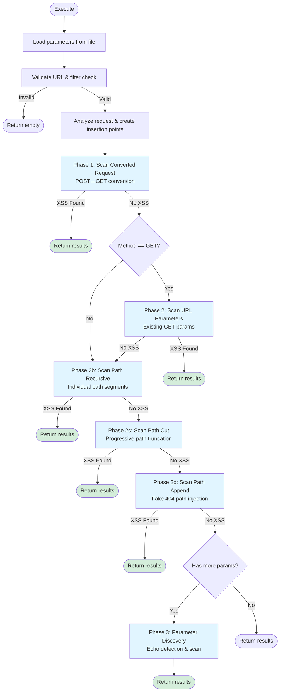

# XSS Scanner

Burp Suite inspired reflected XSS scanner with multiple attack vectors.

## Scanner Coverage

### Phase 1: POST→GET Conversion
Converts non-GET requests (POST/PUT/PATCH) to GET and scans the converted parameters.

**Covered scenarios:**
- Form data parameters moved to URL query string
- Mixed requests with existing URL params + body params
- Content-Type transformation handling

**Test cases:**
- Basic POST to GET conversion with form data
- POST with existing URL params + body params
- PUT/PATCH request conversion
- Multiple body parameters
- Special characters and encoding preservation
- Empty body handling

### Phase 2: URL Parameter Scanning
Scans existing URL parameters in GET requests.

**Covered scenarios:**
- Direct URL parameter injection
- Parameter deduplication via request hash manager
- Skip list filtering (ASP.NET ViewState, etc.)

**Test cases:**
- Standard URL parameter scanning
- Parameter value preservation
- Insertion point creation and validation

### Phase 2b: Path Recursive Injection
Tests each path segment individually using recursive injection.

**Covered scenarios:**
- Individual segment testing: `/p1/p2/p3` → test `p1`, `p2`, `p3` separately
- Path parameter extraction via `httpmsg.ParsePathParameters()`
- Nested path segment injection

**Test cases:**
- Simple paths: `/api/v1/users`
- Single segment: `/api`
- Paths with trailing slashes
- Paths with special characters
- Multi-level nesting

### Phase 2c: Path Cut Injection
Progressively cuts path segments from the end, testing each variant.

**Covered scenarios:**
- Progressive truncation: `/p1/p2/p3` → `/p1/p2/PLACEHOLDER`, `/p1/PLACEHOLDER`, `/PLACEHOLDER`
- Query string preservation during path manipulation
- PLACEHOLDER parameter injection

**Test cases:**
- Three segment path: `/api/v1/users` → 3 variants
- Four segment path: `/api/v1/users/123` → 4 variants
- Path with query string preservation
- POST requests with path injection
- Single/two segment paths (minimum requirement)

### Phase 2d: Path Append Injection
Appends fake 404 path segment to test error page reflections.

**Covered scenarios:**
- Root path append: `/` → `/thisdoesnotexisted404`
- Path extension: `/api/v1` → `/api/v1/thisdoesnotexisted404`
- Multi-segment append: `/api/p1/b1` → `/api/p1/b1/thisdoesnotexisted404`
- Query preservation: `/api?id=123` → `/api/thisdoesnotexisted404?id=123`
- Error page XSS detection via non-existent path

**Test cases:**
- Root path handling
- Single segment extension
- Multi-segment path append
- Query string preservation
- POST/PUT requests with path append
- Trailing slash normalization
- Complex paths with multiple query parameters

### Phase 3: Parameter Discovery
Discovers new parameters via echo detection and tests them.

**Covered scenarios:**
- Echo-based parameter discovery (reflection testing)
- Chunk-based parameter testing (configurable batch size)
- Dynamic insertion point creation for discovered params
- HTML/XML content filtering

**Test cases:**
- Parameter reflection detection in response body
- Chunk processing (default: 32 params per batch)
- Limit enforcement (max 10 discovered params)
- Content-Type validation (HTML/XML only)
- URL parameter map operations

## Scanner Flow

## Test Infrastructure

### Request Transformation Tests
- POST to GET conversion with parameter migration
- Parameter addition (`AppendURLParameter`)
- Parameter map operations (`Get/SetURLParametersMap`)
- Payload injection verification
- Header preservation
- Edge cases: empty, malformed, unicode, long values, duplicates

### Path Injection Tests
- Path/query string splitting
- Path segment extraction
- Cut variant generation
- Edge cases: single segment, malformed, root paths
- Integration with httpmsg APIs

### Payload Injection Tests
- Insertion point properties validation
- BuildRequest functionality
- Payload offset calculation
- Cross-parameter isolation
- URL encoding handling for URL params

### Edge Case Coverage
- Empty/malformed requests
- Very long parameter values (10k+ chars)
- Unicode characters
- Duplicate parameter names
- Special characters and encoding
