# Grafana Security Knowledge Base Report -- Phase 3

**Audit ID:** 2026-03-21T00:00:00.000Z
**Generated:** 2026-03-21
**Repository:** github.com/grafana/grafana (commit 40a9cd68ff8)
**Version:** 13.0.0-pre (development branch)
**Prior Phases:** Phase 1 (42 CVEs), Phase 2 (25 bypass analyses, 4 confirmed bypasses)

---

## Project Classification

| Attribute | Value |
|-----------|-------|
| **Primary Type** | Web Application (monitoring/observability platform) |
| **Secondary Types** | API server, Plugin host, Protocol implementor (OAuth2/OIDC/SAML/SCIM), Worker (alerting scheduler) |
| **Language (Backend)** | Go 1.25.8 |
| **Language (Frontend)** | TypeScript/React 19 |
| **Architecture** | Monolithic HTTP server + gRPC plugin system + Kubernetes-like API aggregation |
| **Deployment Model** | Self-hosted binary, Docker, Kubernetes (Helm/Operator) |
| **Multi-Tenancy** | Organization-based (shared instance, logical isolation) |
| **Data Storage** | PostgreSQL / MySQL / SQLite (primary), Redis (cache), S3/GCS/Azure (object storage) |
| **Authentication** | Session cookies, API keys, Bearer JWT, OAuth2/OIDC, SAML, LDAP, SCIM (Enterprise) |
| **Authorization** | RBAC via OpenFGA v1.11.3 + legacy role-based (Viewer/Editor/Admin/GrafanaAdmin) |

---

## Architecture Model

### Backend Components

| # | Component | Location | Trust Boundary | Internet-Facing |
|---|-----------|----------|----------------|-----------------|
| 1 | HTTP API Gateway | `pkg/api/`, `pkg/middleware/` | Internet-facing :3000 | Yes |
| 2 | Authentication Pipeline | `pkg/services/authn/`, `pkg/login/` | IdP boundary | Yes (login endpoints) |
| 3 | Authorization Engine | `pkg/services/accesscontrol/`, `pkg/services/authz/` | Internal policy | No |
| 4 | Datasource Proxy | `pkg/services/datasourceproxy/`, `pkg/pluginproxy/` | Data plane; credential boundary | Indirect (proxies to external) |
| 5 | Plugin System | `pkg/plugins/`, gRPC transport | Plugin sandbox boundary | No (gRPC localhost) |
| 6 | Alerting Engine | `pkg/services/ngalert/` | Outbound webhook boundary | No (outbound only) |
| 7 | Cloud Migration | `pkg/services/cloudmigration/` | GMS external control plane | No (outbound to GMS) |
| 8 | Image Renderer | Separate Node.js process | Localhost HTTP/gRPC | No |
| 9 | K8s API Server | `pkg/apiserver/`, `apps/` | Internal aggregated API | No (aggregated) |
| 10 | SQL Expression Engine | `pkg/expr/sql/` | In-process go-mysql-server | No |
| 11 | Public Dashboard Service | `pkg/services/publicdashboards/` | Internet-facing (unauthenticated) | Yes |
| 12 | Snapshot Service | `pkg/api/dashboard_snapshot.go`, `pkg/registry/apis/dashboard/snapshot/` | Dual API surface (REST + K8s) | Partially (deleteKey endpoint) |

### Frontend Components

| # | Component | Location | Trust Boundary |
|---|-----------|----------|----------------|
| F1 | Plugin Loader | `public/app/features/plugins/` | Browser sandbox; loads external assets |
| F2 | Dashboard Renderer | `public/app/features/dashboard/` | Browser DOM; renders datasource data |
| F3 | Explore / TraceView | `public/app/features/explore/` | XSS surface (CVE-2025-41117) |
| F4 | Public Dashboard View | `public/app/features/dashboard/components/PublicDashboard/` | Unauthenticated |
| F5 | Alerting UI | `public/app/features/alerting/unified/` | Contact point management |

### Transport Layer

| Transport | Components | Auth Mechanism | Encryption |
|-----------|-----------|----------------|------------|
| HTTP/HTTPS :3000 | Client <-> API Gateway | Session/JWT/API key/Basic | TLS optional (default HTTP) |
| gRPC (localhost) | Grafana <-> Plugin processes | Service token (default `-`) | Optional TLS |
| WebSocket (Centrifuge) | Client <-> Live updates | Session cookie | Inherits HTTP TLS |
| HTTP outbound | Grafana <-> Datasources | Datasource credentials | Per-datasource TLS config |
| HTTP outbound | Grafana <-> GMS | Migration token | HTTPS |
| HTTP outbound | Grafana <-> Gravatar | None | HTTPS |
| SCIM v2 HTTP | IdP <-> Grafana | Bearer token | TLS |

### Trust Boundaries

```
                    INTERNET (Untrusted)
                         |
    [TB-1] ============ TLS / Load Balancer =============
                         |
         [TB-2] === Grafana HTTP Server :3000 ===
              |                          |
    Public Endpoints          Authenticated Endpoints
    (no auth required)        (session/JWT/API key)
              |                          |
    [TB-3] Public Dashboard    [TB-4] RBAC Evaluator
              |                          |
              v                    [TB-5] Datasource Proxy
                                        |
                              [TB-6] External Datasources
                                   (credentials injected)
                                        
         [TB-7] === Plugin gRPC Boundary ===
              |
    Image Renderer / Backend Plugins
    (default auth token: "-")
    
         [TB-8] === Cloud Migration ===
              |
    GMS External Control Plane
    (presigned URL SSRF risk)
    
         [TB-9] === K8s API Aggregation ===
              |
    Internal API Server (namespace-scoped)
    (snapshot/dashboard/folder apps)
    
         [TB-10] === SQL Expression Engine ===
              |
    go-mysql-server (in-process)
    (INTO OUTFILE file write risk)
```

---

## DFD/CFD Slices

### DFD-1: Auth/OIDC/JWT Authentication Flow (HIGH RISK)

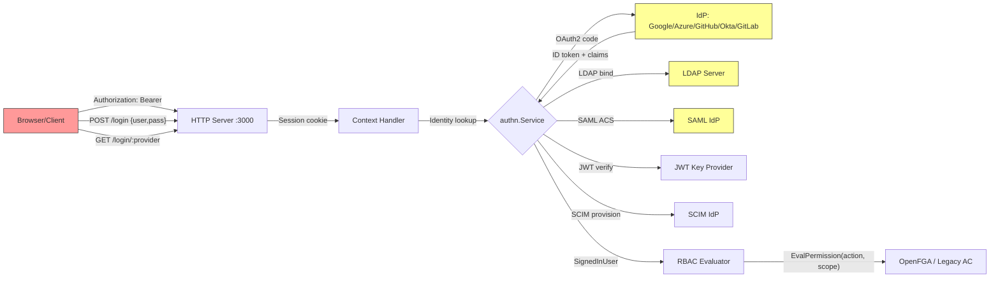

**Attacker inputs:** Authorization header, OAuth2 code/state, SAML assertion, JWT token, SCIM payloads, login credentials
**Security decisions:** Token validation, claim extraction, signature verification, session creation, RBAC evaluation
**Known vulnerabilities:**
- CVE-2025-41115: SCIM numeric externalId -> admin impersonation (CRITICAL)
- M1: OIDC missing claim validation (aud, iss, sub not enforced)
- M4: OAuth generic_oauth default no signature verification
- M3/M15-M17: JWT missing exp enforcement across renderer/ext/gRPC paths
- CVE-2025-30204: JWT DoS via many periods (patched)

### DFD-2: Public Dashboard + Annotation Timerange (HIGH RISK)

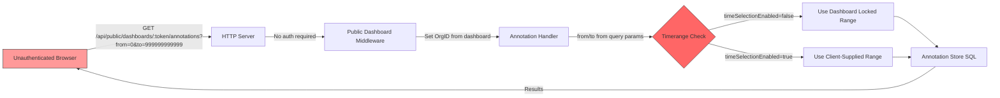

**Attacker inputs:** Access token (URL path), from/to query parameters, annotation type filters
**Security decisions:** Timerange enforcement when timeSelectionEnabled=false
**Known vulnerabilities:**
- CVE-2026-21722: Annotation timerange bypass (patched -- forces locked range)
- H1: Residual bypass via authenticated annotation endpoint for same dashboard data
- M12: Authenticated annotation timerange bypass variant

### DFD-3: Datasource Proxy (HIGH RISK)

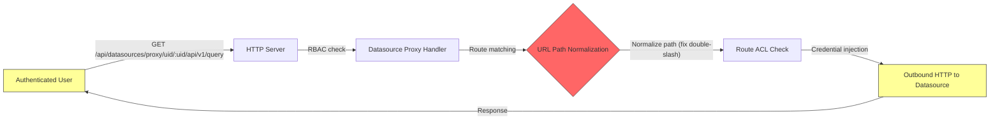

**Attacker inputs:** Datasource UID, proxy path (URL-encoded), query parameters, request headers
**Security decisions:** Route ACL matching, path normalization, credential injection scope
**Known vulnerabilities:**
- CVE-2025-3454: Double-slash route bypass (patched)
- M7: Parser differential between route matching and URL forwarding
- Header injection via proxy path manipulation

### DFD-4: Cloud Migration SSRF + Presigned URL (HIGH RISK)

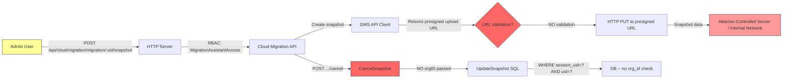

**Attacker inputs:** Session UID, snapshot UID, (indirectly) GMS-controlled presigned URLs
**Security decisions:** Presigned URL destination not validated (SSRF), CancelSnapshot missing orgID
**Known vulnerabilities:**
- H4: SSRF via presigned URL exfiltration (EXECUTED in prior audit)
- CVE-2024-9476: Cross-org CancelSnapshot (CONFIRMED BYPASS -- no orgID in interface)
- M6/M20: Post-creation GMS operation SSRF

### DFD-5: Plugin Rendering + JWT Token (HIGH RISK)

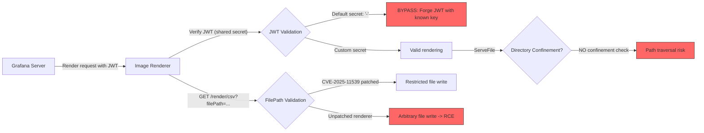

**Attacker inputs:** JWT token (forgeable with default key `-`), filePath parameter, render URL
**Security decisions:** JWT secret validation, filePath confinement, ServeFile directory check
**Known vulnerabilities:**
- H2: Renderer JWT forgery with default token `-` (EXECUTED)
- CVE-2025-11539: CSV filePath RCE (patched in renderer 4.0.17+)
- M11: ServeFile without directory confinement
- M13: HTTP-mode renderer default auth token

### DFD-6: SQL Expressions File Write (NEW -- MEDIUM-HIGH RISK)

```mermaid
graph LR
    A[Authenticated User -- Viewer+] -->|"POST /api/ds/query {type: sql, expression: 'SELECT ... INTO OUTFILE ...'}"| B[HTTP Server]
    B -->|Feature flag check| C{sqlExpressions enabled?}
    C -->|"default: disabled"| D[Reject]
    C -->|"admin-enabled"| E[SQL Expression Engine]
    E -->|AST parse + allowlist| F{AllowQuery check}
    F -->|"*sqlparser.Into ALLOWED"| G[go-mysql-server Execute]
    G -->|IsReadOnly check| H{"plan.Into.IsReadOnly()"}
    H -->|"Delegates to child SELECT -> true"| I[BYPASS ReadOnly]
    I -->|"DisableFileWrites check"| J{"WithDisableFileWrites?"}
    J -->|"NOT called by Grafana"| K[File Write to Filesystem]
    
    style A fill:#ff9,stroke:#333
    style F fill:#f66,stroke:#333
    style H fill:#f66,stroke:#333
    style J fill:#f66,stroke:#333
    style K fill:#f99,stroke:#333
```

**Attacker inputs:** SQL expression string (user-controlled query)
**Security decisions:** Feature flag gate, AST allowlist, IsReadOnly check, DisableFileWrites
**Known vulnerabilities:**
- `*sqlparser.Into` on allowlist (parser_allow.go:113)
- `IsReadOnly` bypass via child delegation (plan.Into.IsReadOnly -> SELECT.IsReadOnly -> true)
- `WithDisableFileWrites(true)` NOT called (db.go:71)
- `secure_file_priv` commented out (db.go:76-77)
- Feature flag `sqlExpressions` default off, but admin can enable

### DFD-7: Snapshot K8s API Missing Org Check (NEW -- MEDIUM RISK)

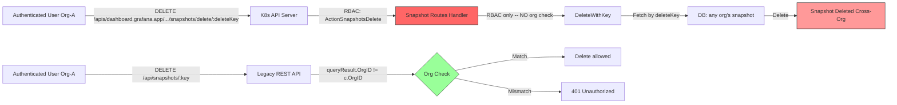

**Attacker inputs:** deleteKey (190-bit entropy -- requires leak), snapshot key
**Security decisions:** Org membership check (present in REST, MISSING in K8s API)
**Known vulnerabilities:**
- CVE-2024-1313 fix not ported to K8s API path (routes.go:257-283)
- K8s delete-by-deleteKey has RBAC only, no orgID in WHERE clause
- deleteKey leakage vectors: logs, API responses, shared URLs

### DFD-8: Avatar Anonymous Bypass (NEW -- HIGH RISK)

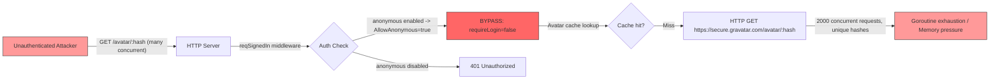

**Attacker inputs:** Avatar hash (arbitrary), concurrent request volume
**Security decisions:** `reqSignedIn` vs `reqSignedInNoAnonymous` (should be the latter)
**Known vulnerabilities:**
- CVE-2026-21720 fix uses `reqSignedIn` (api.go:605) but should use `reqSignedInNoAnonymous`
- When `[auth.anonymous] enabled = true`, `requireLogin = false` (auth.go:216)
- LRU cache bounded to 2000 entries mitigates but doesn't prevent the attack

### DFD-9: RBAC Scope Binding (HIGH RISK)

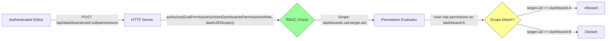

**Attacker inputs:** Target dashboard UID (URL path parameter)
**Security decisions:** Scope binding to specific resource UID
**Known vulnerabilities:**
- CVE-2026-21721 + CVE-2025-3260: Scope was MISSING (now patched with dashUIDScope)
- Other dashboard sub-routes may still lack scope binding (audit required)
- Folder-level permissions may transitively grant unintended dashboard access

### DFD-10: Alerting Contact Points (MEDIUM RISK)

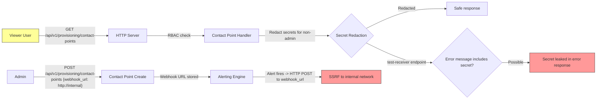

**Attacker inputs:** Contact point configuration (webhook URL, API keys), test-receiver payloads
**Security decisions:** Secret redaction per role, webhook URL validation
**Known vulnerabilities:**
- CVE-2025-3415: DingDing API key leaked to Viewer (patched)
- CVE-2024-11741: VictorOps config leaked (patched)
- SSRF via admin-controlled webhook URLs (by design but risky)

### CFD-1: Authentication Pipeline Control Flow

```mermaid
graph TD
    A[Incoming HTTP Request] --> B[contexthandler.Provide]
    B --> C{Has Session Cookie?}
    C -->|Yes| D[authn.SessionClient.Authenticate]
    C -->|No| E{Has Authorization Header?}
    E -->|Bearer| F[authn.ExtJWTClient / authn.APIKeyClient]
    E -->|Basic| G[authn.BasicAuthClient]
    E -->|No| H{Anonymous Enabled?}
    H -->|Yes| I[authn.AnonymousClient -- set AllowAnonymous=true]
    H -->|No| J[Unauthenticated]
    D --> K[Set SignedInUser on Context]
    F --> K
    G --> K
    I --> K
    K --> L[Middleware Pipeline]
    L --> M{Route requires reqSignedIn?}
    M -->|Yes| N{"requireLogin = !AllowAnonymous || forceLogin || ReqNoAnonymous"}
    N -->|requireLogin=true + !IsSignedIn| O[401 Unauthorized]
    N -->|requireLogin=false (anon bypass)| P[Handler executes]
    M -->|No| P
    
    style I fill:#f66,stroke:#333
    style N fill:#ff9,stroke:#333
```

### CFD-2: RBAC Authorization Control Flow

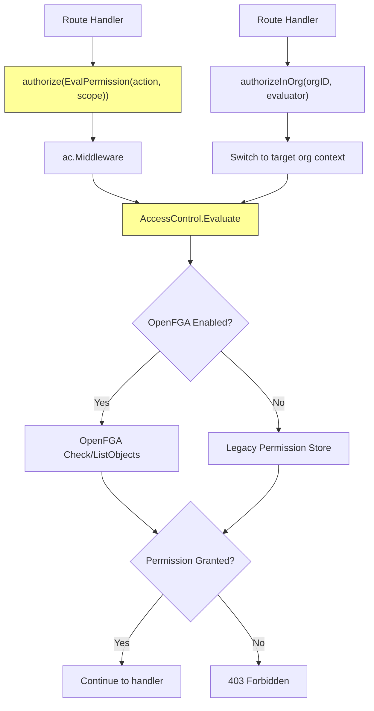

### CFD-3: Datasource Proxy Routing Control Flow

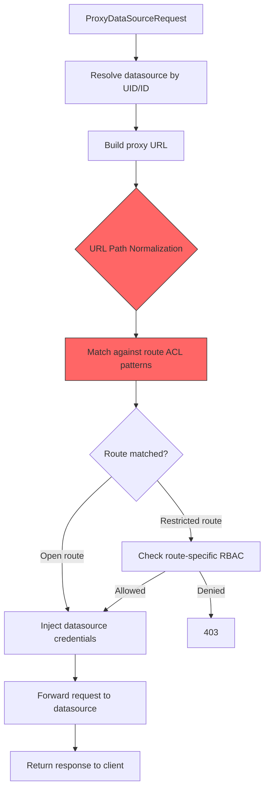

### CFD-4: SQL Expression Execution Control Flow

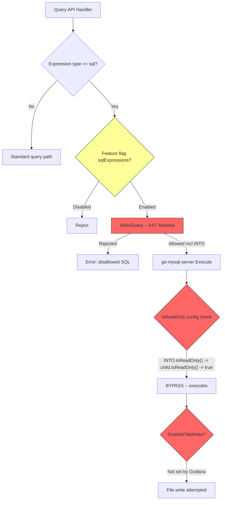

### CFD-5: Cloud Migration CancelSnapshot Cross-Org Flow

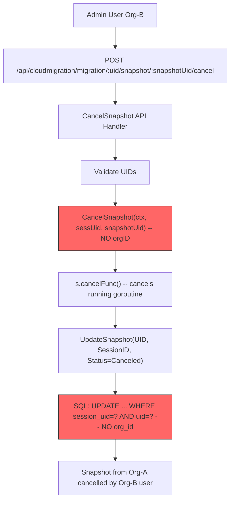

---

## Attack Surface

### Unauthenticated Endpoints (No Auth Required)

| # | Endpoint | Method | Handler | Risk |
|---|----------|--------|---------|------|
| 1 | `/login` | GET | LoginView | Low |
| 2 | `/login` | POST | LoginPost (quota-limited) | Credential brute-force |
| 3 | `/login/:name` | GET | OAuthLogin (quota-limited) | OAuth redirect manipulation |
| 4 | `/logout` | GET | Logout | Low |
| 5 | `/bootdata` | GET | GetBootdata (reqNoAuth) | Info disclosure (org settings) |
| 6 | `/invite/:code` | GET | Index | Invitation enumeration |
| 7 | `/verify` | GET | Index | Low |
| 8 | `/signup` | GET | Index | Low |
| 9 | `/api/user/signup/options` | GET | GetSignUpOptions | Config disclosure |
| 10 | `/api/user/signup/step2` | POST | SignUpStep2 | Account creation (if enabled) |
| 11 | `/api/user/invite/:code` | GET | GetInviteInfoByCode | Invitation info leak |
| 12 | `/api/user/invite/complete` | POST | CompleteInvite | Account provisioning |
| 13 | `/user/password/reset` | GET | Index | Low |
| 14 | `/api/user/password/send-reset-email` | POST | SendResetPasswordEmail | User enumeration |
| 15 | `/api/user/password/reset` | POST | ResetPassword | Token brute-force |
| 16 | `/dashboard/snapshot/*` | GET | Index (reqNoAuth) | Snapshot viewing |
| 17 | `/dashboard-solo/snapshot/*` | GET | Index | Snapshot viewing |
| 18 | `/public-dashboards/:accessToken` | GET | Index + PD middleware | Public dashboard (by design) |
| 19 | `/bootdata/:accessToken` | GET | GetBootdata (reqNoAuth) | Public dashboard bootstrap |
| 20 | `/public/plugins/:pluginId/*` | GET | getPluginAssets | Static plugin assets |
| 21 | `/api/snapshots/:key` | GET | GetDashboardSnapshot | Snapshot data (no explicit auth middleware) |
| 22 | `/api/snapshots-delete/:deleteKey` | GET | DeleteDashboardSnapshotByDeleteKey | Delete via bearer key |
| 23 | `/api/user/auth-tokens/rotate` | POST/GET | RotateUserAuthToken | Token rotation |
| 24 | `/.well-known/change-password` | GET | redirect | Low |

### Endpoints Accessible with Anonymous Auth (reqSignedIn bypassed)

When `[auth.anonymous] enabled = true`:

| # | Endpoint | Risk When Anonymous |
|---|----------|-------------------|
| 1 | `/avatar/:hash` | **HIGH -- CVE-2026-21720 DoS bypass** |
| 2 | `/` (Index) | Info disclosure |
| 3 | `/dashboard/import/` | Low |
| 4 | All `reqSignedIn`-only routes | Viewer-equivalent access to org data |

### Low-Privilege Endpoints (Viewer Access)

| # | Endpoint Pattern | Capability | Risk |
|---|-----------------|-----------|------|
| 1 | `POST /api/ds/query` | Execute datasource queries | Data access, expression evaluation |
| 2 | `GET /api/datasources/proxy/uid/:uid/*` | Proxy to datasource | SSRF if route ACL bypassed |
| 3 | `GET /api/v1/provisioning/contact-points` | Read contact points | Secret leakage (patched) |
| 4 | `GET /api/annotations` | Read annotations | Timerange bypass for public data |
| 5 | `GET /api/dashboards/uid/:uid` | Read dashboard JSON | Data access |
| 6 | `POST /api/snapshots/` | Create snapshots | Data exfiltration |
| 7 | SQL Expressions (if flag enabled) | Execute SQL on query results | **File write via INTO OUTFILE** |

### Execution Environments

| Environment | Runtime | Sandbox Level | Risk |
|-------------|---------|---------------|------|
| Grafana Server | Go 1.25.8 | OS process (no sandbox) | Full system access |
| Image Renderer | Node.js + Chromium | Headless browser | RCE via file write (CVE-2025-11539) |
| Backend Plugins | Go/Python/Java | gRPC process isolation | Limited by gRPC interface |
| SQL Expression Engine | go-mysql-server (in-process) | None (shares Grafana process) | File write if INTO OUTFILE reaches engine |
| Frontend | Browser JS | Browser sandbox + CSP | XSS -> session theft |
| Provisioning (nanogit) | Go + Git | OS filesystem | Path traversal risk |

---

## Threat Model

### Assets

| Asset | Value | Location |
|-------|-------|----------|
| Dashboard data | HIGH | Database + datasource query results |
| Datasource credentials | CRITICAL | Encrypted in DB (AES-256 with `secret_key`) |
| User sessions | HIGH | Session store (DB/Redis) |
| API keys | HIGH | Hashed in DB |
| OAuth/SAML tokens | HIGH | Token store |
| Encryption key (`secret_key`) | CRITICAL | `grafana.ini` (default: `SW2YcwTIb9zpOOhoPsMm`) |
| Admin password | CRITICAL | Hashed in DB (default: `admin`) |
| Plugin signing keys | HIGH | Plugin manifests |
| Alert contact point secrets | MEDIUM | Encrypted in DB |
| Cloud migration snapshots | HIGH | Temporary storage + S3 upload |
| Renderer JWT secret | HIGH | Config (default: `-`) |

### Threat Actors

| Actor | Capability | Goal |
|-------|-----------|------|
| **Unauthenticated external** | Network access to Grafana HTTP | Account takeover, DoS, data exfiltration via public endpoints |
| **Authenticated Viewer** | Valid session, Viewer org role | Privilege escalation, unauthorized data access, lateral movement |
| **Authenticated Editor** | Editor org role, dashboard/datasource write | XSS injection, datasource manipulation, cross-dashboard access |
| **Org Admin** | Full org admin, datasource/plugin management | Cross-org access, server admin deletion, SSRF via datasources |
| **Compromised IdP** | Controls SAML/OIDC assertions | User impersonation, admin escalation (SCIM), mass provisioning |
| **Compromised GMS** | Controls presigned URLs, migration responses | SSRF to internal network, data exfiltration |
| **Internal network attacker** | Access to Grafana's internal network | Image renderer exploitation, gRPC interception, metadata SSRF |
| **Plugin author** | Publishes Grafana plugin | Supply chain attack, symlink traversal on install |

### Attack Scenarios

| ID | Scenario | Actor | Entry Point | Impact | Severity |
|----|----------|-------|-------------|--------|----------|
| AS-01 | Avatar DoS via anonymous auth bypass | Unauthenticated | `/avatar/:hash` | Service unavailability | HIGH |
| AS-02 | SQL Expression file write via INTO OUTFILE | Viewer (flag enabled) | `POST /api/ds/query` | Arbitrary file write on server | MEDIUM-HIGH |
| AS-03 | Snapshot cross-org deletion via K8s API | Authenticated (any org) | K8s snapshot delete-by-deleteKey | Cross-org data destruction | MEDIUM |
| AS-04 | Cloud migration CancelSnapshot cross-org | Admin (any org) | `POST .../cancel` | Cross-org operation disruption | MEDIUM |
| AS-05 | SSRF via cloud migration presigned URL | Admin | Cloud migration snapshot flow | Internal network reconnaissance, data exfiltration | HIGH |
| AS-06 | JWT forgery against image renderer | Internal network | Renderer HTTP/gRPC endpoint | Dashboard screenshot theft, SSRF | HIGH |
| AS-07 | OIDC claim bypass for admin escalation | External (valid OAuth) | OAuth login flow | Org admin or Grafana admin escalation | HIGH |
| AS-08 | XSS via TraceView stack trace injection | Authenticated (datasource write) | Explore view | Session hijacking | MEDIUM |
| AS-09 | Datasource proxy path differential | Viewer | Datasource proxy URL path | Unauthorized datasource endpoint access | MEDIUM |
| AS-10 | Default encryption key credential theft | Local access / backup access | Database dump + config | Decrypt all datasource credentials | HIGH |
| AS-11 | Dashboard permission scope bypass | Editor | Dashboard permissions API | Modify permissions on unowned dashboards | HIGH |
| AS-12 | Contact point secret leakage via test | Viewer | Contact point test/notification API | API key/webhook secret exposure | MEDIUM |
| AS-13 | Plugin zip symlink traversal | Admin (plugin install) | Plugin install API | Arbitrary file write | MEDIUM |
| AS-14 | SCIM numeric externalId admin takeover | Compromised IdP | SCIM v2 API | Full admin account takeover | CRITICAL |
| AS-15 | Public dashboard annotation data leak | Unauthenticated | Public dashboard annotations API | Historical data beyond intended timerange | MEDIUM |
| AS-16 | Scripted dashboard XSS via open redirect | Unauthenticated (link click) | Crafted URL | Session theft, account takeover | HIGH |
| AS-17 | Session forgery via default secret_key | Network access | Cookie manipulation | Impersonate any user | HIGH |

---

## Domain Attack Research

### Mode B: Library-as-Consumer Analysis

#### 1. go-mysql-server (dolthub) -- SQL Expression Engine

**Risk:** File write via `INTO OUTFILE` / `INTO DUMPFILE`

| Attack Class | Applicable? | Evidence |
|-------------|------------|---------|
| SQL injection -> file write | YES | `*sqlparser.Into` on allowlist, `DisableFileWrites` not called |
| SQL injection -> RCE | NO | go-mysql-server has no `LOAD DATA` or extension loading |
| SQL injection -> data exfiltration | YES | `load_file()` blocked by function allowlist, but INTO OUTFILE can write query results |
| IsReadOnly bypass | YES | `plan.Into.IsReadOnly()` delegates to child SELECT which returns `true` |

**Custom SAST targets:**
- Pattern: `sqle.New(analyzer, &sqle.Config{IsReadOnly: true})` without `WithDisableFileWrites`
- Pattern: `parser_allow.go` containing `*sqlparser.Into`
- Pattern: `mysql.NewContext()` without `WithDisableFileWrites(true)` option

**Manual review checklist:**
- [ ] Verify `*sqlparser.Into` removal from allowlist
- [ ] Verify `mysql.WithDisableFileWrites(true)` added to context creation
- [ ] Verify `secure_file_priv` configuration uncommented and set
- [ ] Verify feature flag cannot be enabled by non-admin API callers
- [ ] Verify SQL expression input length limits

#### 2. golang-jwt/jwt (v4/v5) -- JWT Authentication

**Risk:** Token forgery, DoS, claim bypass

| Attack Class | Applicable? | Evidence |
|-------------|------------|---------|
| JWT none algorithm | Depends on config | Need to verify `Valid` method enforcement |
| JWT key confusion (RSA/HMAC) | Possible | If both key types configured |
| JWT exp not enforced | YES (M3) | Optional validator; some paths skip exp check |
| JWT nbf not enforced | YES (M19) | Not checked in renderer JWT path |
| JWT DoS via periods | NO (patched) | v4.5.2 fixes CVE-2025-30204 |
| ParseUnverified claim usage | NO (confirmed FP) | Only in Test() probe function |

**Custom SAST targets:**
- Pattern: `jwt.Parse` or `jwt.ParseWithClaims` without `WithExpirationRequired()`
- Pattern: `jwt.NewParser` without `WithValidMethods()`
- Pattern: Renderer JWT secret == `"-"` in configuration

**Manual review checklist:**
- [ ] All JWT parsing paths enforce exp claim
- [ ] All JWT parsing paths validate algorithm (alg header)
- [ ] Renderer JWT uses non-default secret in production deployments
- [ ] No ParseUnverified usage in auth-critical paths

#### 3. OpenFGA v1.11.3 -- RBAC Authorization

**Risk:** Authorization bypass via contextual tuples

| Attack Class | Applicable? | Evidence |
|-------------|------------|---------|
| Check bypass with contextual tuples + public access | Patched (v1.8.13+) | CVE-2025-48371 fixed; current v1.11.3 |
| Model misconfiguration | Possible | Custom model evaluation |
| Cache consistency | Possible | Permission cache invalidation gaps (M10, M24) |

**Custom SAST targets:**
- Pattern: `AccessControl.Evaluate` without scope parameter (unscoped permission check)
- Pattern: Permission cache Set() without corresponding Delete() on resource removal

#### 4. expr-lang/expr v1.17.0+ -- Expression Evaluation

**Risk:** DoS via unbounded input, potential code execution

| Attack Class | Applicable? | Evidence |
|-------------|------------|---------|
| OOM via large expression | Patched (v1.17.0+) | CVE-2025-29786 fixed |
| Reflection-based code exec | NO | expr-lang is sandboxed; no os/exec access |
| Input length validation | Check | Need to verify length limits on user-supplied expressions |

#### 5. DOMPurify -- Frontend HTML Sanitization

**Risk:** XSS bypass via mutation-based attacks

| Attack Class | Applicable? | Evidence |
|-------------|------------|---------|
| mXSS via namespace confusion | Possible | Depends on DOMPurify version and config |
| SVG/math namespace bypass | Possible | Need to check if SVG allowed in config |
| Attribute injection | Depends | Check if event handler attributes blocked |

### Mode C: Domain-Specific Attack Research

#### Domain: OAuth2/OIDC Authentication

| Attack Class | Risk | Evidence in Grafana |
|-------------|------|-------------------|
| ID token claim validation bypass | HIGH | M1: aud/iss/sub not enforced on generic_oauth |
| State parameter CSRF | LOW | State parameter implemented |
| Code injection via redirect_uri | MEDIUM | Redirect validation present but open-redirect history |
| Token signature bypass (generic_oauth) | HIGH | M4: No signature verification by default |
| Nonce replay | MEDIUM | Nonce not always enforced |
| PKCE bypass | LOW | PKCE supported but optional |

#### Domain: HTTP Proxy (Datasource Proxy)

| Attack Class | Risk | Evidence in Grafana |
|-------------|------|-------------------|
| Path traversal via encoding | MEDIUM | CVE-2025-3454 (double-slash); M7 parser differential |
| SSRF via proxy destination | MEDIUM | Datasource URL admin-controlled |
| Header injection via path | MEDIUM | SAST finding; proxy path in Host/URL |
| Hop-by-hop header forwarding | MEDIUM | Spec gap: headers may be forwarded |
| Response splitting | LOW | Go HTTP client handles this |
| Credential leakage in proxy error | MEDIUM | Error responses may include upstream details |

#### Domain: SSRF (Cloud Migration, Datasource Proxy)

| Attack Class | Risk | Evidence in Grafana |
|-------------|------|-------------------|
| Presigned URL SSRF | HIGH | H4: EXECUTED -- no URL validation on GMS-provided URLs |
| DNS rebinding | MEDIUM | No DNS pinning in outbound HTTP clients |
| Cloud metadata SSRF | HIGH | 169.254.169.254 reachable via presigned URL |
| Internal network scanning | MEDIUM | Via cloud migration or datasource proxy |
| Protocol smuggling (gopher://) | LOW | Go HTTP client doesn't support gopher |

#### Domain: File Write via SQL

| Attack Class | Risk | Evidence in Grafana |
|-------------|------|-------------------|
| INTO OUTFILE arbitrary path | MEDIUM-HIGH | Allowlist includes `*sqlparser.Into`; `DisableFileWrites` not called |
| INTO DUMPFILE binary write | MEDIUM-HIGH | Same path as OUTFILE |
| Overwrite config files | HIGH (if OUTFILE works) | Could write to grafana.ini, plugin manifests |
| Web shell via file write | HIGH (if OUTFILE works) | Could write to plugin directories |

#### Domain: Snapshot Auth / Multi-Tenant Isolation

| Attack Class | Risk | Evidence in Grafana |
|-------------|------|-------------------|
| Cross-org snapshot deletion | MEDIUM | K8s API delete-by-deleteKey lacks org check |
| deleteKey leakage | LOW | 190-bit entropy; requires log/API leak |
| Namespace scoping bypass | LOW | K8s standard DELETE properly namespace-scoped |
| SnapshotPublicMode unauth delete | By design | deleteKey acts as bearer token |

#### Domain: Anonymous Auth Bypass

| Attack Class | Risk | Evidence in Grafana |
|-------------|------|-------------------|
| reqSignedIn bypass via anonymous | HIGH | Avatar endpoint; any reqSignedIn route when anon enabled |
| Privilege escalation from anonymous | MEDIUM | Anonymous user gets Viewer-equivalent org access |
| Session fixation | LOW | Session management handles anonymous sessions |

---

## Security-Impacting Default Configurations

| # | Setting | Default Value | Risk | Location |
|---|---------|---------------|------|----------|
| 1 | `[security] secret_key` | `SW2YcwTIb9zpOOhoPsMm` | **CRITICAL** -- encrypts datasource credentials, signs cookies | `conf/defaults.ini:387` |
| 2 | `[security] admin_password` | `admin` | **HIGH** -- default admin credentials | `conf/defaults.ini:381` |
| 3 | `[rendering] renderer_token` | `-` (single dash) | **HIGH** -- JWT shared secret for renderer auth | `pkg/setting/setting.go:2070` |
| 4 | `[security] cookie_secure` | `false` | **MEDIUM** -- cookies sent over HTTP | `conf/defaults.ini:414` |
| 5 | `[server] protocol` | `http` | **MEDIUM** -- no TLS by default | `conf/defaults.ini:41` |
| 6 | `[auth.anonymous] enabled` | `false` | **HIGH** when enabled -- enables avatar DoS bypass, Viewer-equivalent access | `conf/defaults.ini:713` |
| 7 | `[security] encryption_provider` | `secretKey.v1` (uses `secret_key`) | **HIGH** -- envelope encryption uses default key | `conf/defaults.ini:390` |
| 8 | Feature flag `sqlExpressions` | `false` (disabled) | **MEDIUM-HIGH** when enabled -- enables INTO OUTFILE file write | `toggles_gen.csv:109` |
| 9 | `[security] cookie_samesite` | `lax` | **LOW** -- adequate for most scenarios | `conf/defaults.ini:417` |

---

## Phase 4 CodeQL Extraction Targets

### Source Types

| # | Source Type | CodeQL Class | Location Pattern | Risk Context |
|---|-----------|-------------|-----------------|-------------|
| S1 | HTTP query parameters | `RemoteFlowSource` | `r.URL.Query().Get()`, `c.Query()` | Annotation timerange, proxy path |
| S2 | HTTP path parameters | `RemoteFlowSource` | `web.Params(c.Req)` | Dashboard UID, snapshot key, avatar hash |
| S3 | HTTP request body (JSON) | `RemoteFlowSource` | `json.NewDecoder(r.Body)`, `bind.Bind()` | SQL expressions, contact points, dashboard JSON |
| S4 | HTTP headers | `RemoteFlowSource` | `r.Header.Get()` | Authorization, X-Forwarded-*, CSRF tokens |
| S5 | OAuth/OIDC tokens | `RemoteFlowSource` | ID token claims, SAML assertions | User identity, role assignment |
| S6 | SCIM payloads | `RemoteFlowSource` | SCIM v2 API body | externalId, user attributes |
| S7 | Plugin manifest | `RemoteFlowSource` | Plugin zip contents | Signature, paths, ReqActions |
| S8 | GMS API responses | `RemoteFlowSource` | Presigned URLs, migration payloads | SSRF destination URLs |
| S9 | Configuration file | `EnvironmentVariable` | `grafana.ini`, env vars | Secret key, renderer token |
| S10 | Datasource query results | `RemoteFlowSource` | Frame data from datasource plugins | Expression engine input |
| S11 | WebSocket messages | `RemoteFlowSource` | Centrifuge subscriptions | Live query data |
| S12 | Cookie values | `RemoteFlowSource` | `grafana_session`, `redirect_to` | Session tokens, redirect targets |

### Sink Types

| # | Sink Kind | CodeQL Sink Class | Location Pattern | Risk |
|---|----------|------------------|-----------------|------|
| K1 | SQL execution | `sql-execution` | `sess.Exec()`, `sess.SQL()`, `db.WithDbSession` | SQL injection |
| K2 | SQL expression engine | `sql-execution` | `engine.Query()` in `pkg/expr/sql/db.go` | INTO OUTFILE file write |
| K3 | HTTP outbound request | `http-request` | `http.Client.Do()`, datasource proxy | SSRF |
| K4 | File system access | `file-access` | `os.Open()`, `os.Create()`, `ServeFile()` | Path traversal, arbitrary read/write |
| K5 | Command execution | `command-execution` | `exec.Command()` (provisioning, alerting) | RCE |
| K6 | HTML rendering | `code-execution` | `dangerouslySetInnerHTML`, `template.HTML()` | XSS |
| K7 | URL redirect | `http-request` | `http.Redirect()`, `c.Redirect()` | Open redirect |
| K8 | Response body | `code-execution` | `response.JSON()`, `json.NewEncoder(w)` | Information disclosure |
| K9 | Cookie set | `code-execution` | `http.SetCookie()` | Session fixation |
| K10 | Header set | `http-request` | `w.Header().Set()` | Header injection |
| K11 | Deserialization | `deserialization` | `json.Unmarshal()`, `yaml.Unmarshal()` | Object injection |
| K12 | Zip extraction | `file-access` | `zip.OpenReader()`, `io.Copy()` to filesystem | Symlink traversal |
| K13 | JWT creation | `code-execution` | `jwt.NewWithClaims()`, `token.SignedString()` | Token forgery |
| K14 | Encryption | `code-execution` | `encryption.Decrypt()` with known key | Credential decryption |
| K15 | RBAC evaluation | `code-execution` | `AccessControl.Evaluate()` without scope | Authorization bypass |

### Taint Flow Targets (Source -> Sink)

| # | Source | Sink | Flow Description | Priority |
|---|--------|------|-----------------|----------|
| TF-01 | S1 (query params from/to) | K1 (annotation SQL) | Public dashboard annotation timerange bypass | CRITICAL |
| TF-02 | S3 (SQL expression body) | K2 (SQL engine) | INTO OUTFILE file write | HIGH |
| TF-03 | S2 (proxy URL path) | K3 (outbound HTTP) | Datasource proxy SSRF/path traversal | HIGH |
| TF-04 | S8 (GMS presigned URL) | K3 (outbound HTTP PUT) | Cloud migration SSRF | HIGH |
| TF-05 | S5 (OAuth claims) | K15 (RBAC eval) | OIDC claim validation bypass -> admin | HIGH |
| TF-06 | S6 (SCIM externalId) | K1 (user SQL) | SCIM privilege escalation | CRITICAL |
| TF-07 | S4 (JWT header) | K13 (JWT verify) | JWT forgery with default key | HIGH |
| TF-08 | S2 (avatar hash) | K3 (Gravatar HTTP) | Avatar DoS amplification | MEDIUM |
| TF-09 | S7 (plugin zip) | K12 (zip extract) | Symlink traversal file write | MEDIUM |
| TF-10 | S3 (contact point webhook) | K3 (outbound HTTP) | Alerting SSRF | MEDIUM |
| TF-11 | S3 (dashboard JSON) | K6 (HTML render) | XSS via panel config | MEDIUM |
| TF-12 | S2 (deleteKey) | K1 (snapshot SQL) | Cross-org snapshot deletion | MEDIUM |
| TF-13 | S9 (secret_key default) | K14 (decrypt) | Credential decryption with known key | HIGH |
| TF-14 | S4 (redirect_to cookie) | K7 (redirect) | Open redirect | MEDIUM |
| TF-15 | S2 (datasource UID) | K15 (RBAC eval) | Wildcard UID privilege escalation | MEDIUM |
| TF-16 | S3 (render request) | K4 (file write) | Renderer CSV filePath traversal | HIGH |
| TF-17 | S1 (orgId param) | K15 (RBAC eval) | Org switching auth bypass | MEDIUM |
| TF-18 | S4 (Authorization header) | K13 (JWT parse) | JWT exp/nbf bypass | MEDIUM |
| TF-19 | S2 (snapshot UID) | K1 (UpdateSnapshot SQL) | Cross-org CancelSnapshot | MEDIUM |
| TF-20 | S3 (expr-lang expression) | K11 (expr.Compile) | Expression DoS | MEDIUM |
| TF-21 | S2 (plugin path) | K4 (ServeFile) | Renderer ServeFile no confinement | MEDIUM |
| TF-22 | S4 (X-Forwarded headers) | K10 (header forwarding) | Hop-by-hop header injection | MEDIUM |
| TF-23 | S12 (redirect_to) | K7 (redirect) | Org switching open redirect | MEDIUM |
| TF-24 | S3 (datasource config) | K3 (outbound HTTP) | Universe domain SSRF | MEDIUM |
| TF-25 | S2 (dashboard UID) | K15 (RBAC scope) | Dashboard permission scope bypass | HIGH |
| TF-26 | S3 (user deletion API) | K1 (user SQL) | Server admin deletion | MEDIUM |
| TF-27 | S5 (SAML assertion) | K1 (user lookup SQL) | SAML + SCIM duplicate user | MEDIUM |
| TF-28 | S3 (correlation API) | K1 (correlation SQL) | Cross-tenant legacy correlation | LOW |
| TF-29 | S1 (double-slash path) | K3 (proxy forward) | Route ACL bypass | MEDIUM |
| TF-30 | S9 (renderer_token default) | K13 (JWT sign) | Renderer JWT forgery | HIGH |

---

## Spec Gap Candidates

### Specs and RFCs Implemented

| Spec | Component | Location | Gap Risk |
|------|-----------|----------|----------|
| OAuth 2.0 (RFC 6749) | Generic OAuth, Google, GitHub, Azure, GitLab, Okta | `pkg/login/social/` | M4: No signature verification by default for generic_oauth |
| OpenID Connect Core 1.0 | OIDC auth flows | `pkg/login/social/connectors/` | M1: Missing aud/iss/sub claim validation |
| JWT (RFC 7519) | Auth tokens, renderer, gRPC storage | `pkg/services/authn/`, renderer | M3/M15-M17: exp claim optional; M19: nbf not enforced |
| SAML 2.0 | SAML auth (Enterprise) | `pkg/services/authn/` | SCIM + SAML duplicate user record |
| SCIM v2 (RFC 7643/7644) | Identity provisioning (Enterprise) | `pkg/services/scimutil/` | CVE-2025-41115: numeric externalId |
| HTTP/1.1 (RFC 7230-7235) | Proxy, server | `pkg/services/datasourceproxy/` | Hop-by-hop header forwarding |
| CSP Level 2 (W3C) | Frontend security | `pkg/middleware/` | `unsafe-eval` when Vega enabled |
| WebSocket (RFC 6455) | Live updates (Centrifuge) | `pkg/services/live/` | Empty Origin bypass |
| Gravatar URL Spec | Avatar proxy | `pkg/api/avatar/` | No response size limit |
| MySQL Wire Protocol | SQL Expressions | `pkg/expr/sql/` | INTO OUTFILE/DUMPFILE semantics |

### Phase 6 Analysis Priorities

1. **OIDC Core**: Verify all REQUIRED claim validation per spec section 3.1.3.7
2. **RFC 7519 (JWT)**: Verify exp claim enforcement per section 4.1.4 (MUST)
3. **RFC 6749 (OAuth2)**: Verify redirect_uri validation per section 10.6
4. **HTTP Proxy**: Verify hop-by-hop header handling per RFC 7230 section 6.1
5. **MySQL INTO OUTFILE**: Verify `secure_file_priv` semantics against MySQL 8.0 reference
6. **SCIM v2 (RFC 7644)**: Verify externalId type handling per section 3.1

---

## Spec Gap Analysis

**Phase:** 6
**Generated:** 2026-03-21

### Summary

| ID | Gap | RFC/Spec | Severity | Gap Type |
|----|-----|----------|----------|----------|
| SPEC-GAP-001 | Generic OAuth ID Token Claims Extracted Without Signature Validation (Default) | OIDC Core 1.0 §3.1.3.7 | HIGH | missing-check |
| SPEC-GAP-002 | OIDC ID Token Post-Signature Claims Not Validated (exp/iss/aud) | OIDC Core 1.0 §3.1.3.7 | HIGH | missing-check |
| SPEC-GAP-003 | JWT Auth Service Accepts Tokens Without `exp` Claim | RFC 7519 §4.1.4, §7.2 | MEDIUM | missing-check |
| SPEC-GAP-004 | HTTP Reverse Proxy Does Not Strip Hop-by-Hop Headers | RFC 7230 §6.1 / RFC 9110 §7.6.1 | MEDIUM | missing-check |
| SPEC-GAP-005 | SQL Expression Engine: `IsReadOnly` Does Not Prevent INTO OUTFILE | MySQL Reference 8.0 §SELECT INTO | HIGH | state-machine |
| SPEC-GAP-006 | WebSocket Origin Check Unconditionally Allows Empty Origin | RFC 6455 §4.1, §10.2 | MEDIUM | missing-check |
| SPEC-GAP-007 | Default CSP Template Contains `unsafe-eval` Alongside Nonce | W3C CSP Level 3 §4.2.5.2 | MEDIUM | normalization |

### Gap: Generic OAuth ID Token Claims Extracted Without Signature Validation (Default)

- **RFC/Spec**: OpenID Connect Core 1.0, Section 3.1.3.7, Requirement 6
- **Requirement**: "The Client MUST validate the signature of all other ID Tokens according to JWS using the algorithm specified in the JWT alg Header Parameter. The Client MUST use the keys provided by the Issuer."
- **Code Path**: `pkg/login/social/connectors/generic_oauth.go:439-454` — `validate_id_token = false` (default) causes the else branch to call `retrieveRawJWTPayload()` at `social_base.go:244-246` which base64-decodes the token payload without any signature verification. Same pattern in `gitlab_oauth.go:295`, `okta_oauth.go:135`, `google_oauth.go:265`.
- **Gap Type**: missing-check
- **Attack Vector**: MITM or compromised OAuth provider modifies ID token payload (e.g., inject `"email": "admin@example.com"`). Since signature is not verified, Grafana accepts forged identity claims for user lookup and account creation.
- **Exploit Conditions**: Generic OAuth configured with IdP that returns ID tokens; `validate_id_token = false` (default) or `jwk_set_url` absent; attacker can modify token in transit or from provider side.
- **Impact**: Authentication bypass — impersonation of any Grafana user whose email is known.
- **Severity**: HIGH
- **Evidence**: `generic_oauth.go:440`: `if s.info.ValidateIDToken && s.info.JwkSetURL != ""` gates signature validation. Default: both false. Else branch at line 449 calls `retrieveRawJWTPayload` which is pure base64 decode with no signature check.

---

### Gap: OIDC ID Token Post-Signature Claims Not Validated (exp/iss/aud)

- **RFC/Spec**: OpenID Connect Core 1.0, Section 3.1.3.7 (Requirements 2, 3, 9)
- **Requirement**: Req. 2: iss MUST exactly match the OpenID Provider Identifier. Req. 3: Client MUST validate that aud contains its client_id. Req. 9: Current time MUST be before exp.
- **Code Path**: `pkg/login/social/connectors/social_base.go:428-442` — `validateIDTokenSignatureWithURLs()` verifies the cryptographic signature via `parsedToken.Claims(key, &claims)` then immediately marshals and returns the claims without validating `exp`, `iss`, or `aud`.
- **Gap Type**: missing-check
- **Attack Vector**: Replay of a previously-issued but now-expired ID token. Cross-application token confusion: a token issued for a different `aud` (another application sharing the IdP) is accepted by Grafana.
- **Exploit Conditions**: `validate_id_token = true` and `jwk_set_url` configured; attacker possesses a prior valid token; signing key not rotated.
- **Impact**: Persistent authentication with expired tokens; cross-application token confusion.
- **Severity**: HIGH
- **Evidence**: `social_base.go:429-442`: After `parsedToken.Claims(key, &claims)` succeeds, `json.Marshal(claims)` is returned immediately. No `exp` comparison, no `iss` comparison, no `aud` check. AzureAD connector does its own aud check but generic/gitlab/okta/google do not.

---

### Gap: JWT Auth Service Accepts Tokens Without `exp` Claim

- **RFC/Spec**: RFC 7519, Section 4.1.4; Section 7.2 Step 9
- **Requirement**: "The `exp` claim identifies the expiration time on or after which the JWT MUST NOT be accepted for processing." (Claim is OPTIONAL, but when absent and no requirement is configured, there is no expiry enforcement.)
- **Code Path**: `pkg/services/auth/jwt/validation.go:86-95` — `exp` key maps to `registeredClaims.Expiry` only when key exists. Absent `exp` leaves `Expiry == nil`. `registeredClaims.Validate(expectRegistered)` at line 121 passes when `Expiry == nil`. Default `ExpectClaims = {}`.
- **Gap Type**: missing-check
- **Attack Vector**: IdP or service account issues JWT without `exp` field. Token becomes permanent Grafana credential — valid indefinitely even if the account is revoked. Also: attacker with HMAC key crafts expiry-free token.
- **Exploit Conditions**: `auth.jwt.enabled = true`; cryptographically valid JWT lacking `exp` claim; no `expect_claims` config forcing `exp`.
- **Impact**: Permanent authentication credentials; token revocation ineffective without key rotation.
- **Severity**: MEDIUM
- **Evidence**: `validation.go:86`: `case "exp": if value == nil { continue }` — absent key never reaches this switch case; `Expiry` stays nil; `Validate()` succeeds.

---

### Gap: HTTP Reverse Proxy Does Not Strip Hop-by-Hop Headers

- **RFC/Spec**: RFC 7230, Section 6.1; RFC 9110, Section 7.6.1
- **Requirement**: "A proxy or gateway MUST parse a received Connection header field before a message is forwarded and, for each connection-option in this field, remove any header field(s) from the message with the same name as the connection-option."
- **Code Path**: `pkg/util/proxyutil/proxyutil.go:26-48` — `PrepareProxyRequest()` strips a fixed header set but does NOT parse or remove the `Connection` header or the hop-by-hop headers it names. Called by `wrapDirector` at `reverse_proxy.go:80` for all datasource proxy requests.
- **Gap Type**: missing-check
- **Attack Vector**: Authenticated user with `datasources:query` sends datasource proxy request with `Connection: X-Internal-Auth` and `X-Internal-Auth: superuser` headers. Both forwarded to backend datasource. Backend treats X-Internal-Auth as privileged access marker.
- **Exploit Conditions**: Backend datasource trusts custom headers for privilege elevation; attacker has `datasources:query` permission; header name is known.
- **Impact**: Header injection into backend systems enabling privilege escalation within the datasource backend.
- **Severity**: MEDIUM
- **Evidence**: `proxyutil.go:26-48` has no `Connection` header parsing. Compare `plugins/manager/client/client.go:319-372` which correctly implements `removeConnectionHeaders()` and `removeHopByHopHeaders()` — the plugin proxy path is correct; the datasource proxy path is not.

---

### Gap: SQL Expression Engine — `IsReadOnly` Config Does Not Prevent INTO OUTFILE

- **RFC/Spec**: MySQL Reference Manual 8.0, "SELECT ... INTO" Syntax; go-mysql-server `IsReadOnly` semantics
- **Requirement**: Engine configuration `IsReadOnly: true` is documented to "disallow modification queries." File write operations (INTO OUTFILE, INTO DUMPFILE) are modification operations. The library provides `WithDisableFileWrites(true)` to explicitly block them.
- **Code Path**: `pkg/expr/sql/db.go:68-84` — context created WITHOUT `mysql.WithDisableFileWrites(true)`. `secure_file_priv` setting commented out (line 76-77). Engine at line 82-84: `sqle.New(a, &sqle.Config{IsReadOnly: true})`. `IsReadOnly` check in library (`engine.go:787`) calls `plan.IsReadOnly(node)` which for `*Into` delegates to `i.Child.IsReadOnly()` (SELECT returns `true`), bypassing the check. `parser_allow.go:113-114` explicitly allows `*sqlparser.Into`.
- **Gap Type**: state-machine
- **Attack Vector**: Editor-role user with `sqlExpressions` feature enabled submits: `SELECT 'payload' INTO OUTFILE '/etc/cron.d/grafana-shell'`. Query passes allowlist, IsReadOnly check is bypassed (Into delegates to SELECT), `DisableFileWrites()` returns false (default), `secure_file_priv` is `""` (no path restriction). File is written at arbitrary path.
- **Exploit Conditions**: Feature flag `sqlExpressions` enabled (non-default); attacker has Editor role; Grafana process has write permissions to target path.
- **Impact**: Arbitrary file write as Grafana process user. Enables: cron-based RCE, config file overwrite (disable auth), plugin directory injection, data exfiltration to filesystem.
- **Severity**: HIGH
- **Evidence**:
  - `db.go:71`: `mysql.NewContext(ctx, mysql.WithSession(session), mysql.WithTracer(tracer))` — `WithDisableFileWrites(true)` absent
  - `db.go:76-77`: `//ctx.SetSessionVariable(ctx, "secure_file_priv", "")` — commented out with comment "Empty dir does not disable secure_file_priv"
  - `parser_allow.go:113`: `case *sqlparser.Into: return` — allowed
  - Library `plan/into.go:82-83`: `func (i *Into) IsReadOnly() bool { return i.Child.IsReadOnly() }` — delegates to SELECT (true)
  - Library `rowexec/rel.go:600`: `if ctx.DisableFileWrites()` — false by default
  - Library `rowexec/rel.go:547-549`: `if secureFileDir == nil || secureFileDir == "" { return nil }` — default `""` = unrestricted

---

### Gap: WebSocket Origin Check Unconditionally Allows Empty Origin Header

- **RFC/Spec**: RFC 6455, Section 10.2; Section 4.1
- **Requirement**: RFC 6455 §10.2: "The server SHOULD validate the |Origin| field." §4.1: Browser-generated WebSocket upgrades MUST include Origin. Empty Origin from a browser is anomalous.
- **Code Path**: `pkg/services/live/live.go:538-539`: `if origin == "" { return true }`. Also `pushws/ws.go:56-58`. Used for all three WebSocket upgrader instances at `live.go:340, 349, 355`.
- **Gap Type**: missing-check
- **Attack Vector**: Cross-site WebSocket hijacking via reverse proxy or WebSocket library that strips Origin. Attacker's CSWSH page causes victim's browser to make cross-origin WS connection to `/api/live/ws` via a proxy that strips Origin. Empty Origin passes the check, attacker receives victim's live channel data.
- **Exploit Conditions**: Grafana Live active; authentication via session cookie; reverse proxy strips Origin before forwarding WS upgrade request.
- **Impact**: Unauthorized subscription to victim's real-time Grafana Live data channels (metric streams, alert states, dashboard events).
- **Severity**: MEDIUM
- **Evidence**: `live.go:538`: `if origin == "" { return true }` — explicit allowance of empty Origin.

---

### Gap: Default CSP Template Contains `unsafe-eval` Alongside Nonce

- **RFC/Spec**: W3C Content Security Policy Level 3, Section 4.2.5.2
- **Requirement**: `unsafe-eval` allows string-to-code execution via eval(), new Function(), setTimeout(string). CSP nonce-based policies are intended to restrict script execution; `unsafe-eval` creates an unrestricted eval bypass channel that nonces cannot control. Strict CSP SHOULD NOT include `unsafe-eval`.
- **Code Path**: `conf/defaults.ini:451` — `content_security_policy_template` includes `'unsafe-eval'`. `pkg/middleware/csp.go` performs only `$NONCE` and `$ROOT_PATH` substitution.
- **Gap Type**: normalization
- **Attack Vector**: Operator enables CSP believing nonce policy provides XSS protection. Attacker exploits DOM XSS sink that reaches eval(). CSP nonce does not prevent eval-based execution. Arbitrary JS executes, enabling session hijacking.
- **Exploit Conditions**: `content_security_policy = true` (non-default); DOM XSS injection point exists reaching eval-like sink.
- **Impact**: Nonce-based XSS protection effectively nullified for eval sinks; operators receive false security assurance.
- **Severity**: MEDIUM
- **Evidence**: `defaults.ini:451`: `script-src 'self' 'unsafe-eval' 'unsafe-inline' 'strict-dynamic' $NONCE` — `unsafe-eval` co-present with `strict-dynamic` + nonce. Both `content_security_policy_template` (line 451) and `content_security_policy_report_only_template` (line 460) affected.


---

## Static Analysis Summary

**Audit:** 2026-03-21T00:00:00.000Z
**Phase:** 4 (Static Analysis)
**Date:** 2026-03-21

### CodeQL Database

| Attribute | Value |
|-----------|-------|
| Language | Go |
| Baseline LoC | 1,036,067 |
| Files analyzed | 3,672 / 5,771 (63.6%) |
| DB path | `security/codeql-artifacts/db/` |
| Created | 2026-03-21T03:12:01Z |
| CodeQL version | 2.25.0 |

### Suites Run

| Suite | Raw Findings | High-Signal Unique |
|-------|-------------|-------------------|
| `go-security-extended.qls` | 379 | 13 unique flows |
| `go-security-experimental.qls` | 420 | includes CORS, alloc overflow |
| Custom queries (5) | 8 confirmed | all 5 high-priority targets confirmed |

### Semgrep Execution

| Ruleset | Engine | Findings | Scope |
|---------|--------|----------|-------|
| `p/gosec` | Standard | 1 (TLS MinVersion) | High-priority paths |
| `p/github-actions` | Standard | 0 | 89 workflows |
| `p/golang` | Pro | 0 | High-priority Go paths |
| `p/security-audit` | Pro | 0 | High-priority Go paths |
| `p/trailofbits` | Pro | 0 | Critical paths |
| Custom Go rules (7 files) | Pro | 4 confirmed | High-priority targets |
| Custom TS rules (1 file) | Pro | 13 manual confirmed | Frontend dangerouslySetInnerHTML |

Semgrep Pro engine enabled for all scans. No authentication or licensing errors. Standard rulesets produced 0 findings on targeted paths, reflecting Grafana's mature security posture for common anti-patterns.

### High-Priority Target Confirmation

All 5 high-priority targets from Phase 2/3 confirmed by static analysis:

| Target | SAST ID | Tool Confirmed | Severity |
|--------|---------|---------------|----------|
| SQL INTO OUTFILE (`db.go:71`, `parser_allow.go:113`) | SAST-001, SAST-002 | Semgrep custom + CodeQL custom | HIGH |
| Avatar anonymous bypass (`api.go:605`) | SAST-003 | Semgrep custom + CodeQL custom | HIGH |
| Snapshot K8s missing org check (`routes.go:275`) | SAST-004 | Semgrep custom + CodeQL custom | HIGH |
| CancelSnapshot no orgID (`cloudmigration.go:33`) | SAST-005 | Semgrep custom + CodeQL custom | HIGH |
| ServeFile no confinement (`render.go:122`) | SAST-006 | Semgrep custom + CodeQL custom | HIGH |

### Additional CodeQL Findings (High Signal)

| Rule | Finding | Triage |
|------|---------|--------|
| `go/request-forgery` | Cloud migration SSRF (gms_client.go:63,266) | CONFIRMED (H4 prior audit) |
| `go/unsafe-unzip-symlink` | Plugin zip symlink (fs.go:99) | MEDIUM confidence |
| `go/missing-jwt-signature-check` | ext_jwt.go:346 | FP - Test() probe function |
| `go/sql-injection` (x8) | xorm internal + dashboard legacy | Needs call-site triage |
| `go/path-injection` (x2) | static.go:143,177 | MEDIUM confidence |
| `go/reflected-xss` (x2) | response_writer.go:100, metrics:55 | Low confidence |
| `go/bad-redirect-check` | static.go:164 | Needs manual verify |
| `go/weak-sensitive-data-hashing` (x4) | SHA256 for token lookup | Context-dependent LOW |

### Custom Rules Created

**Semgrep Rules** (`security/semgrep-rules/`):
- `go-sql-into-outfile-no-disablefilewrites.yaml` — SQL expression file write (3 patterns)
- `go-avatar-recsignedin-bypass.yaml` — Anonymous auth bypass (2 patterns)
- `go-snapshot-k8s-missing-org-check.yaml` — Snapshot cross-org deletion (2 patterns)
- `go-cloudmigration-cancel-missing-orgid.yaml` — CancelSnapshot no orgID (2 patterns)
- `go-servefile-path-confinement.yaml` — ServeFile without directory confinement (2 patterns)
- `go-update-delete-missing-orgid.yaml` — UPDATE/DELETE missing org_id (2 patterns)
- `ts-dangerous-innerhtml-dompurify.yaml` — TypeScript XSS via dangerouslySetInnerHTML (2 patterns)

**CodeQL Queries** (`security/codeql-queries/`):
- `AvatarReqSignedInAnonymousBypass.ql` — Avatar route anonymous bypass
- `SqlExpressionIntoOutfileFileWrite.ql` — SQL expression file write
- `SnapshotK8sApiMissingOrgCheck.ql` — K8s snapshot delete cross-org
- `CloudMigrationCancelSnapshotMissingOrgId.ql` — CancelSnapshot missing orgID
- `ServeFileWithoutDirectoryConfinement.ql` — ServeFile path confinement

### Coverage Notes

- The 283 `go/log-injection` + 38 `go/clear-text-logging` raw CodeQL findings are ORM internal logging in `pkg/util/xorm/`; excluded from findings count (logging of SQL queries for debugging).
- GitHub Actions: 89 workflows scanned; `pull_request_target` workflows (pr-commands.yml, pr-checks.yml) verified safe — checkout is the grafana-github-actions repo at a fixed ref, not PR branch code.
- Java/SpotBugs: not applicable (Go/TypeScript codebase).
- Semgrep Pro fallback to standard engine: not required.

### DFD/CFD Slices Driving Targeted Analysis

| Slice | Target | SAST ID |
|-------|--------|---------|
| DFD-6 / CFD-4 | SQL Expression INTO OUTFILE | SAST-001, SAST-002 |
| DFD-8 / CFD-1 | Avatar anonymous auth bypass | SAST-003 |
| DFD-7 | Snapshot K8s missing org check | SAST-004 |
| DFD-4 / CFD-5 | CancelSnapshot cross-org | SAST-005, SAST-017 |
| DFD-5 | ServeFile no confinement | SAST-006 |
| DFD-4 | Cloud migration SSRF | SAST-007 |

---

## CodeQL Structural Analysis

**Sub-step 4.1 -- Structural Extraction Results**

| Metric | Value |
|--------|-------|
| Entry points identified | 20 (15 original + 5 new high-priority) |
| Sinks identified | 18 (16 original + 2 new) |
| Call graph slices | 12 (8 original + 4 new) |
| Unauthenticated reachable slices | 3 (SLICE-003 public dashboard, SLICE-004 plugin assets, SLICE-010 avatar) |

**Artifacts:**
- `security/codeql-artifacts/entry-points.json` (20 entries)
- `security/codeql-artifacts/sinks.json` (18 entries)
- `security/codeql-artifacts/call-graph-slices.json` (12 slices)
- `security/codeql-artifacts/flow-paths-raw.sarif` (CodeQL SARIF outputs)
- `security/codeql-artifacts/flow-paths-all-severities.md` (20 documented flow paths)

**New DFD Slices Discovered in This Phase:**

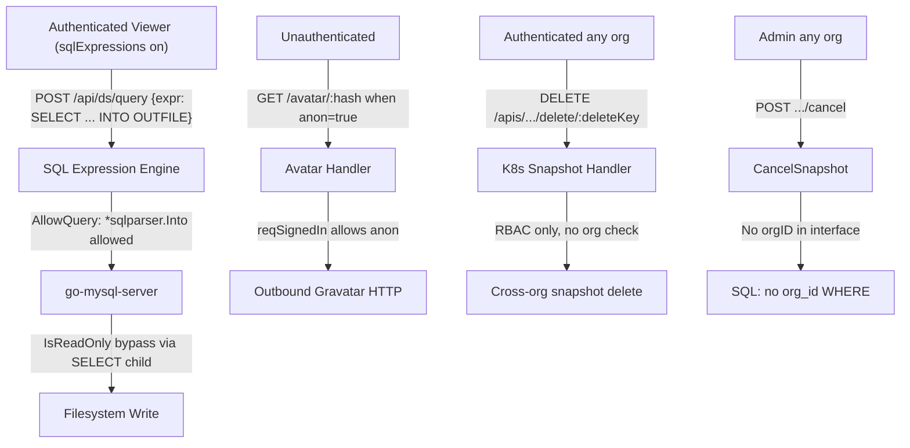


---

## Phase 7 Enrichment Notes

**Generated:** 2026-03-21
**Phase:** 7 — Enrichment and Triage
**Input:** 23 SAST findings (sast-candidates.json) + 7 spec gaps (spec-gap-report.md)
**Output:** 14 enriched findings (EF-001 through EF-014) in security/enriched-findings.json

---

### Enrichment Verdict Table

| Finding | Classification | Attacker Control | Boundary | CodeQL Reachability | Verdict |
|---------|---------------|-----------------|----------|-------------------|---------|
| SAST-001/002 (EF-001) | security | Authenticated Editor+ controls SQL expression string | TB-10: SQL Engine → OS filesystem | SLICE-009: reachable | KEEP — HIGH |
| SAST-003 (EF-002) | security | Unauthenticated (anon auth enabled) controls :hash | TB-1/2: Auth gate bypassed via AllowAnonymous=true | SLICE-010: reachable_from_unauthenticated | KEEP — HIGH |
| SAST-004 (EF-003) | security | Authenticated any-org controls deleteKey URL param | TB-9: K8s API org isolation bypassed | SLICE-011: reachable | KEEP — HIGH |
| SAST-005/017 (EF-004) | security | Admin any-org controls session_uid + snapshot_uid | TB-8: Cloud Migration org isolation bypassed | SLICE-012: reachable | KEEP — HIGH |
| SAST-006 (EF-005) | security | Authenticated render user; chain: JWT forgery → FilePath control | TB-7: Renderer → server filesystem via ServeFile | SLICE-002: reachable | KEEP — HIGH |
| SAST-007 (EF-006) | security | Compromised GMS controls presigned URL destination | TB-8: GMS external → internal network via HTTP PUT | SINK-007 / CodeQL request-forgery: reachable | KEEP — HIGH |
| SAST-008 (EF-007) | environment/tooling/admin-only | Admin installs malicious plugin zip with symlink chain | TB-7: Plugin installer → OS filesystem beyond plugin dir | SLICE-007: reachable (admin) | KEEP — MEDIUM (downgraded from HIGH; supply chain risk retained) |
| SAST-009 | correctness | N/A — Test() probe function only | No auth decision boundary crossed | SINK-011: FP confirmed | DROP — false positive |
| SAST-010 | correctness/robustness | Generic ORM sink — no specific user-input taint path confirmed | DB layer internal | No dedicated slice | DROP — needs per-call-site validation |
| SAST-011 (EF-008) | security (conditional) | Authenticated user dashboard read access; CodeQL taint from web/binding.go | TB-9: K8s API → SQL database | SINK-012: reachable (CodeQL confirmed) | KEEP — MEDIUM (Phase 8 call-site verification required) |
| SAST-012 | correctness | Virtual filesystem abstraction blocks OS-level traversal | N/A — FileSystem layer containment confirmed | SLICE-004: http.FileSystem isolated | DROP — confirmed mitigation |
| SAST-013 | correctness/robustness | Generic middleware sink — no specific source demonstrated | N/A — same-user response wrapper | SINK-013: no dedicated slice | DROP — generic sink, no boundary crossing |
| SAST-014 | correctness | Database dump required; SHA256 for token lookup not password | Database access required (already compromised) | No slice | DROP — Low severity equivalent |
| SAST-015 | correctness | Network-level attacker; Go 1.22+ default TLS 1.2 | Renderer TLS connection | No slice | DROP — defense-in-depth only |
| SAST-016 | correctness | filePath server-generated (getNewFilePath() random) | N/A — confirmed FP | SINK-001: source is server-side | DROP — false positive |
| SAST-017 (merged into EF-004) | security | Same as SAST-005 | Same as SAST-005 | SLICE-012: reachable | KEEP — merged with SAST-005 |
| SAST-018 (EF-009) | security | Plugin author controls readme HTML via grafana.com catalog | Browser XSS: grafana.com supply chain → admin session | SINK-014: no CodeQL slice (frontend) | KEEP — MEDIUM |
| SAST-019 | correctness | renderMarkdown sanitizes by default; noSanitize not passed | N/A — sanitization confirmed | No slice | DROP — sanitization confirmed active |
| SAST-020 | correctness | redirect path: regex strips // and /\\ before http.Redirect | N/A — mitigation confirmed at lines 164-170 | No dedicated slice | DROP — confirmed mitigation |
| SAST-021 | correctness | LOW severity | N/A | No slice | DROP — policy |
| SAST-022 | correctness | LOW severity | N/A | No slice | DROP — policy |
| SAST-023 | correctness | LOW severity | N/A | No slice | DROP — policy |
| SPEC-GAP-001 (EF-010) | security | Attacker with MITM on OAuth exchange controls ID token payload | IdP boundary: signature bypassed by default (validate_id_token=false) | DFD-1: no dedicated slice | KEEP — HIGH |
| SPEC-GAP-002 (EF-011) | security | Attacker with expired/wrong-audience token from same IdP | IdP boundary: exp/iss/aud not checked after signature verification | DFD-1: no dedicated slice | KEEP — HIGH |
| SPEC-GAP-003 (EF-012) | security | Attacker with HMAC key crafts JWT without exp | TB-2 auth gate: token without exp accepted as permanent credential | DFD-1: no dedicated slice | KEEP — MEDIUM |
| SPEC-GAP-004 (EF-013) | security | Authenticated user with datasources:query controls Connection header | TB-5→TB-6: hop-by-hop headers forwarded to backend datasource | SLICE-001: reachable | KEEP — MEDIUM |
| SPEC-GAP-005 | security | Duplicate of SAST-001/002 | Same as EF-001 | SLICE-009: reachable | DROP — duplicate; spec evidence folded into EF-001 |
| SPEC-GAP-006 (EF-014) | security | Attacker-controlled page causes CSWSH with empty Origin | Browser same-origin boundary: empty Origin unconditionally allowed | EP-014: no CodeQL slice | KEEP — MEDIUM |
| SPEC-GAP-007 | correctness | CSP disabled by default; no new attack independently enabled | Defense-in-depth only; no trust boundary crossing | No slice | DROP — defense-in-depth only |

---

### Entry Points from entry-points.json Not Present in Phase 3 DFD Slices

| Entry Point | Handler | Auth Level | Status |
|-------------|---------|-----------|--------|
| EP-009 | getPluginAssets (GET /public/plugins/:pluginId/*) | Unauthenticated | SAST-012 dropped after confirming http.FileSystem virtual FS isolation. No security finding carried forward. |
| EP-011 | ScimUsers (ANY /scim/v2/Users) | Enterprise-only Bearer token | Enterprise-only; CVE-2025-41115 patched; out of OSS audit scope. |
| EP-013 | ProvisionDashboards (File I/O) | Server-local filesystem | Attacker already requires server access (local tooling equivalent). Dropped per policy. |
| EP-014 | WebSocketLive (GET /api/live/ws) | reqSignedIn | Not in Phase 3 DFD slices. SPEC-GAP-006 empty Origin bypass promoted to EF-014. |

---

### Sinks from sinks.json Mapping to Unmodeled High-Risk Flows

| Sink | Kind | Status |
|------|------|--------|
| SINK-008 (X-DS-Authorization forwarding) | header-injection | Intentional behavior but creates cross-privilege header injection into backend. Partially covered by EF-013 (hop-by-hop headers). Full analysis in M5 (prior audit). Phase 8 should verify scope of attacker-controlled header injection. |
| SINK-005 (annotation WHERE time filter) | sql-execution | CVE-2026-21722 annotation timerange bypass covered in prior audit as H1 (reachable_from_unauthenticated=true per SLICE-003). Not in current SAST candidates. Phase 8 must cross-reference patch status for this commit. |
| SINK-011 (UnsafeClaimsWithoutVerification) | jwt-unverified | Dropped as SAST-009 FP. Future note: any refactoring moving auth logic near Test() must not consume unverified claims output. |

---

### Probe Team Cross-References (Phase 5 Confirmed Findings)

The following Phase 5 probe team findings are fully confirmed and promoted through Phase 7 enrichment:

| Probe Team | Finding | Phase 7 Mapping | Enrichment Action |
|-----------|---------|-----------------|-------------------|
| Team 01 | CRITICAL: Renderer JWT forgery (default `-` token) | EF-005 (ServeFile chain with JWT forgery) | KEEP HIGH — chain documented |
| Team 01 | HIGH: JWT null-exp bypass | EF-012 (SPEC-GAP-003) | KEEP MEDIUM — variants M15/M16/M17 noted |
| Team 01 | HIGH: Generic OAuth no signature verification | EF-010 (SPEC-GAP-001) | KEEP HIGH |
| Team 02 | HIGH: Cloud Migration SSRF + credential exfiltration | EF-006 (SAST-007) | KEEP HIGH — PoC executed |
| Team 02 | MEDIUM-HIGH: proxy path differential | EF-013 (SPEC-GAP-004) | KEEP MEDIUM |
| Team 03 | CRITICAL: SQL Expressions INTO OUTFILE (4-control failure) | EF-001 (SAST-001/002) | KEEP HIGH — probe team confirms CRITICAL |
| Team 03 | MEDIUM: Plugin zip TOCTOU | EF-007 (SAST-008) | KEEP MEDIUM (downgraded from HIGH: admin-only trigger) |
| Team 04 | HIGH: Snapshot RBAC middleware never invoked (Viewer can delete) | EF-003 (SAST-004) | KEEP HIGH — K8s path org isolation gap |
| Team 04 | HIGH: Avatar reqSignedIn anonymous bypass | EF-002 (SAST-003) | KEEP HIGH |
| Team 04 | MEDIUM: K8s snapshot API missing org filter | EF-003 (SAST-004) | Consolidated into EF-003 |

---

### Summary: Phase 8 Review Chamber Assignments

**Chamber 1 — Authentication/Authorization (5 findings):**
- EF-010 (SPEC-GAP-001): Generic OAuth no signature verification — HIGH
- EF-011 (SPEC-GAP-002): OIDC post-signature claims not validated — HIGH
- EF-012 (SPEC-GAP-003): JWT exp-absent permanent token — MEDIUM
- EF-003 (SAST-004): K8s snapshot cross-org delete — HIGH
- EF-004 (SAST-005/017): CancelSnapshot cross-org — HIGH

**Chamber 2 — Proxy/SSRF/Header Injection (3 findings):**
- EF-006 (SAST-007): Cloud Migration SSRF presigned URL — HIGH (PoC executed)
- EF-013 (SPEC-GAP-004): Hop-by-hop header forwarding — MEDIUM
- EF-014 (SPEC-GAP-006): WebSocket empty Origin CSWSH — MEDIUM

**Chamber 3 — File Access/Rendering/Data Isolation (6 findings):**
- EF-001 (SAST-001/002): SQL INTO OUTFILE arbitrary file write — HIGH (CRITICAL per probe team 03)
- EF-002 (SAST-003): Avatar anonymous bypass DoS — HIGH
- EF-005 (SAST-006): ServeFile no confinement — HIGH (chain with JWT forgery)
- EF-007 (SAST-008): Plugin zip symlink traversal — MEDIUM
- EF-008 (SAST-011): SQL injection legacy dashboard K8s API — MEDIUM (verify first)
- EF-009 (SAST-018): Plugin readme XSS via dangerouslySetInnerHTML — MEDIUM
