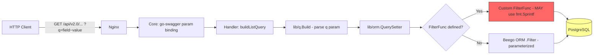
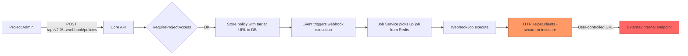
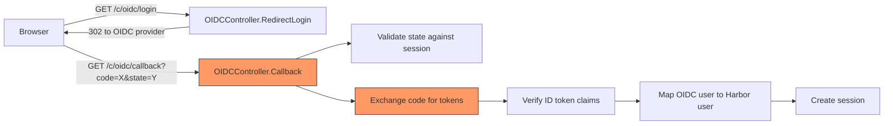
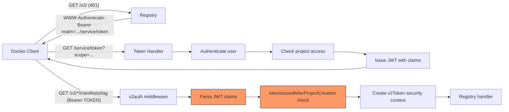
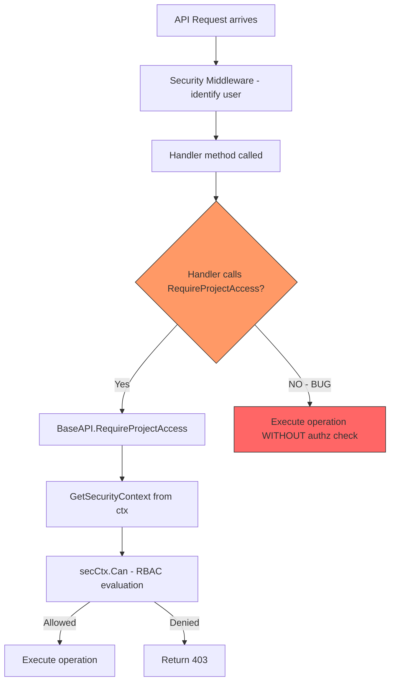
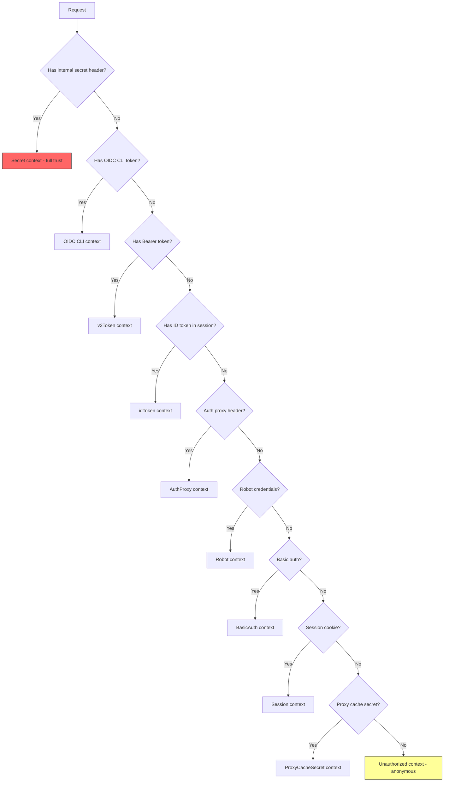
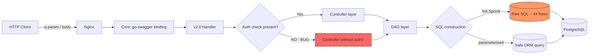
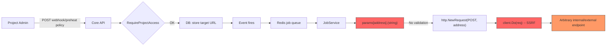

# Harbor Security Audit - Knowledge Base Report

**Audit Date:** 2026-03-27
**Repository:** goharbor/harbor v2.15.0 (commit 1c7d83141)
**Phase:** 3 - Knowledge Base (complete)

---

## Project Classification

| Attribute | Value |
|-----------|-------|
| **Type** | Web application, API server, container registry |
| **Language** | Go (backend), TypeScript/Angular (portal) |
| **Framework** | Beego v2 (web), go-swagger (API v2.0), Docker Distribution (registry proxy) |
| **Auth** | Local DB, LDAP, OIDC, auth-proxy, robot tokens, JWT v2 tokens |
| **Database** | PostgreSQL (via beego ORM + raw SQL) |
| **Cache/Queue** | Redis (sessions, job queue) |
| **Protocols** | OCI Distribution Spec v2, Docker Registry HTTP API V2, OAuth2/OIDC, LDAP v3 |
| **Deployment** | Multi-container (nginx, core, jobservice, registry, db, redis, portal, trivy-adapter, registryctl, exporter) |

---

## Architecture Model

### Service Decomposition

```
                    +-----------+
  Internet -------->|   Nginx   |------> Static portal (Angular SPA)
                    | (reverse  |
                    |  proxy)   |
                    +-----+-----+
                          |
              +-----------+-----------+
              |                       |
        /api/v2.0/*             /v2/* (OCI)
        /c/* (UI ctrl)          (registry protocol)
        /service/*
              |                       |
        +-----v-----+          +-----v-----+
        | Core API   |          | Registry  | (Docker Distribution)
        | (Go/Beego) |<-------->| (registryctl)
        +-----+------+          +-----------+
              |
    +---------+---------+
    |         |         |
+---v--+ +---v---+ +---v---+
|  DB  | | Redis | | Job   |
| (PG) | |       | | Svc   |---> External endpoints:
+------+ +-------+ +-------+     - Webhook targets (SSRF)
                        |         - Replication registries (SSRF)
                        |         - P2P preheat (SSRF)
                        |         - Trivy scanner
                        v
                  External services:
                  - OIDC providers
                  - LDAP servers
                  - Remote registries
```

### Core Service Middleware Chain

The Core API request pipeline (defined in `src/server/`) applies middlewares in this order:

1. **Nginx** -- TLS termination, rate limiting, request routing
2. **RequestID** -- assigns trace ID
3. **Log** -- request logging
4. **MergeSlash** -- path normalization (`//` -> `/`)
5. **Session** -- cookie-based session management (Redis-backed)
6. **CSRF** -- gorilla/csrf protection (portal routes only)
7. **Security** -- authentication chain (see below)
8. **ReadOnly** -- blocks writes in read-only mode
9. **ORM** -- injects DB transaction context
10. **ArtifactInfo** -- parses repository/tag from URL for registry routes
11. **Per-route middleware** -- quota, blob, immutable, content-trust, vulnerable

### Authentication Chain (Priority Order)

Defined in `src/server/middleware/security/security.go`. First match wins:

1. **Secret** -- internal service shared secret (job service <-> core)
2. **OIDC CLI** -- OIDC token for CLI operations
3. **V2 Token** -- Docker registry bearer token (JWT)
4. **ID Token** -- OIDC ID token from session
5. **Auth Proxy** -- external auth proxy header
6. **Robot** -- robot account credentials (basic auth)
7. **Basic Auth** -- username/password (DB, LDAP, or OIDC)
8. **Session** -- cookie session (portal)
9. **Proxy Cache Secret** -- internal proxy cache auth

If none match, `UnauthorizedMiddleware` assigns anonymous context.

### API Surface Groups

| Group | Path Prefix | Auth | Handler |
|-------|-------------|------|---------|
| V2.0 REST API | `/api/v2.0/*` | Per-handler RBAC | go-swagger generated + custom handlers |
| OCI Registry | `/v2/*` | v2auth middleware (bearer token) | Registry proxy + custom manifest/tag/blob/referrers handlers |
| UI Controllers | `/c/*` | Session/CSRF | Beego controllers (login, logout, OIDC, auth-proxy) |
| Service/Internal | `/service/*` | Shared secret | Token service, job status hooks |
| Internal API | `/api/internal/*` | Shared secret | Admin rename, quota sync |

### RBAC Model

- **BaseAPI** (`src/server/v2.0/handler/base.go`) provides:
  - `RequireAuthenticated(ctx)` -- checks `secCtx.IsAuthenticated()`
  - `RequireProjectAccess(ctx, projectIDOrName, action, resource)` -- checks `secCtx.Can(ctx, action, resource)` scoped to project
  - `RequireSystemAccess(ctx, action, resource)` -- checks system-level RBAC
  - `RequireSolutionUserAccess(ctx)` -- checks solution user role
- Each handler method calls these explicitly at the start -- **no centralized enforcement middleware for v2.0 API**
- Missing a call = authorization bypass (root cause of the 2022 CVE cluster)

### Database Schema (Security-Relevant)

- `harbor_user` -- local users (password hashed)
- `project` -- projects with owner, creation_time
- `project_member` -- RBAC role assignments (project_id, entity_id, entity_type, role)
- `robot` -- robot accounts with hashed secrets
- `oidc_user` -- OIDC user mapping with encrypted secret
- `audit_log_ext` -- extended audit log (payload column still exists)
- `notification_policy` -- webhook targets with endpoint URLs
- `replication_policy` -- replication rules with registry endpoints
- `p2p_preheat_policy` -- P2P preheat targets
- `cve_allowlist` -- CVE allowlists for vulnerability scanning bypass

---

## Trust Boundaries

### TB-1: Internet <-> Nginx
- TLS termination
- All external traffic enters here
- Nginx config controls path routing to core vs. portal vs. registry

### TB-2: Nginx <-> Core API
- Internal HTTP (or internal TLS)
- Core trusts Nginx for IP forwarding (`X-Forwarded-For`)
- No re-authentication between Nginx and Core

### TB-3: Core API <-> Database (PostgreSQL)
- Direct TCP connection, password auth
- ORM layer with both parameterized and raw SQL queries
- **CRITICAL**: Several raw `fmt.Sprintf` SQL patterns exist (artifact_trash, member, securityhub, usergroup DAOs)

### TB-4: Core API <-> Redis
- Session storage, job queue
- No authentication by default in many deployments
- Session data includes security context

### TB-5: Core API <-> Job Service
- Shared secret authentication
- Job service executes outbound HTTP requests (webhooks, replication, preheat)
- **CRITICAL**: Job service is the SSRF execution point

### TB-6: Core API <-> Registry (Distribution)
- Internal communication for manifest/blob operations
- Registry trusts Core for authorization decisions via token service

### TB-7: Core API <-> External Auth (LDAP/OIDC)
- Outbound connections to customer-controlled identity providers
- LDAP: direct bind + search operations
- OIDC: OAuth2 code flow, token exchange, userinfo endpoint

### TB-8: Job Service <-> External Endpoints
- Webhook delivery to arbitrary user-specified URLs
- Replication to/from remote registries
- P2P preheat to distribution nodes
- **No URL allowlist/denylist for SSRF protection**

---

## Attack Surface

### Attacker-Controlled Inputs

| Input Vector | Entry Point | Trust Level | Risk |
|-------------|-------------|-------------|------|
| **API query params** (`q`, `sort`, `page`) | `/api/v2.0/*` | Authenticated user | SQL injection via ORM filter bypass |
| **Request body (JSON)** | `/api/v2.0/*` | Authenticated user | Business logic abuse, XSS in stored fields |
| **OCI manifest** | `PUT /v2/*/manifests/:ref` | Push-authorized user | Manifest confusion, oversized manifest DoS |
| **Docker image layers** | `PUT /v2/*/blobs/uploads/*` | Push-authorized user | Malicious content, zip bombs |
| **Webhook endpoint URL** | `/api/v2.0/projects/{id}/webhook/policies` | Project admin | SSRF via job service |
| **Replication registry URL** | `/api/v2.0/registries` | System admin | SSRF via job service, credential leak to rogue registry |
| **P2P preheat endpoint** | `/api/v2.0/projects/{id}/preheat/policies` | Project admin | SSRF via job service |
| **OIDC callback params** | `/c/oidc/callback` | Unauthenticated | OAuth2 state confusion, token injection |
| **LDAP responses** | Internal (from LDAP server) | External identity provider | Attribute injection, group mapping abuse |
| **Repository/tag names** | Registry push, API calls | Authenticated user | Path traversal, XSS in portal display |
| **CVE allowlist entries** | `/api/v2.0/system/CVEAllowlist` | System admin | Vulnerability scanning bypass |
| **Configuration payloads** | `PUT /api/v2.0/configurations` | System admin | Secret injection, LDAP/OIDC endpoint pivot |
| **Job status hooks** | `/service/notifications/tasks/:id` | Internal (should be secret-protected) | Job state manipulation |
| **Login credentials** | `/c/login` | Unauthenticated | Brute force, timing oracle |
| **Scanner reports** | Trivy adapter callback | Internal | Malicious scan data injection |

### Execution Environments

| Environment | Language | Sandbox | Notes |
|------------|----------|---------|-------|
| Core API | Go | Container | Main attack target |
| Job Service | Go | Container | Executes outbound HTTP (SSRF) |
| Portal | TypeScript (browser) | Browser sandbox | XSS target |
| Registry | Go | Container | Distribution daemon |
| Database | SQL | Container | SQL injection target |

---

## Threat Model

### Assets

| Asset | Value | Impact if Compromised |
|-------|-------|----------------------|
| Container images | HIGH | Supply chain attack, malicious code distribution |
| User credentials | HIGH | Account takeover, lateral movement |
| LDAP/OIDC secrets | HIGH | Identity provider compromise |
| Robot account secrets | MEDIUM | Automated pipeline compromise |
| Project RBAC policies | MEDIUM | Unauthorized image access/mutation |
| Vulnerability scan data | MEDIUM | Hidden vulnerabilities, false sense of security |
| Audit logs | LOW | Cover tracks, compliance violation |

### Threat Actors

| Actor | Access Level | Motivation |
|-------|-------------|------------|
| **Unauthenticated attacker** | Network access to Harbor | Supply chain compromise, data theft |
| **Authenticated user (low-priv)** | Valid account, no project admin | Privilege escalation, cross-project access |
| **Project admin** | Admin of one project | SSRF, cross-project access, system compromise |
| **Malicious OIDC/LDAP provider** | Controls identity provider | Mass impersonation, privilege escalation |
| **Compromised CI/CD pipeline** | Robot account credentials | Image tampering, tag mutation |
| **Insider (system admin)** | Full admin access | Data exfiltration, backdoor images |

### Attack Scenarios

| ID | Scenario | Actor | Vector | Impact | Likelihood |
|----|----------|-------|--------|--------|------------|
| T1 | Authorization bypass on policy APIs | Low-priv user | Missing RequireProjectAccess call in handler | Modify webhooks/retention/preheat/immutability | HIGH (historical pattern) |
| T2 | SQL injection via ORM filter | Authenticated user | `q` parameter with crafted filter value | Database read/write | HIGH (3 prior CVEs) |
| T3 | SSRF via webhook/replication/preheat URL | Project admin | User-controlled URL in policy | Internal network scanning, metadata service access | MEDIUM |
| T4 | Bearer token reuse after project recreation | Token holder | Stale JWT with project name collision | Unauthorized access to new project | MEDIUM (recently patched) |
| T5 | OIDC state/nonce confusion | Unauthenticated | Manipulated callback parameters | Account takeover | MEDIUM |
| T6 | LDAP injection via search filter | Authenticated (LDAP mode) | Crafted username/group DN | LDAP data exfiltration | LOW (EscapeFilter used, but verify all paths) |
| T7 | Credential leak in audit logs | System admin | Read audit_log_ext table | Obtain LDAP/OIDC secrets from historical data | MEDIUM |
| T8 | CSRF bypass via gorilla/csrf weakness | Authenticated portal user | CVE-2025-47909 (TrustedOrigins) | State-changing actions without consent | LOW (TrustedOrigins not used currently) |
| T9 | Raw SQL injection in artifact_trash DAO | Internal (timing-based) | Crafted timestamp in cutoff computation | Database compromise | LOW (not directly user-controlled) |
| T10 | CVE allowlist bypass via empty/whitespace entries | System admin | Whitespace-only CVE IDs | Bypass vulnerability scanning | MEDIUM (recently patched, verify completeness) |

---

## DFD/CFD Slices

### High-Risk DFD Slices

#### DFD-1: API Query Parameter to SQL (SQL Injection Path)



**Critical sinks**: `securityhub/dao/security.go` custom FilterFunc with `fmt.Sprintf(" and %v = ?", col)` -- `col` comes from map key which is trusted, but the pattern is fragile. `artifactrash/dao/dao.go` uses `fmt.Sprintf` with timestamp directly into SQL. `repository/model/model.go` uses `FilterRaw` with subquery.

#### DFD-2: Webhook/Replication SSRF Path



**No URL validation**: The webhook target URL, replication registry endpoint, and preheat endpoint URLs are stored as-is. No allowlist/denylist, no private IP filtering. The job service HTTP client supports both TLS-verified and insecure modes.

#### DFD-3: OIDC Authentication Flow



**Attack surface**: State parameter validation, token verification, user mapping/onboarding, group claim processing.

#### DFD-4: V2 Token Authentication (Bearer Token Path)



**Attack surface**: Token scope escalation, project recreation token reuse (recently patched), token lifetime/leeway window.

### High-Risk CFD Slices

#### CFD-1: Authorization Decision Flow



**Key finding**: Authorization is NOT enforced by middleware. Each handler must explicitly call `RequireProjectAccess` or `RequireAuthenticated`. Missing calls = bypass. This is the root cause of the 2022 CVE cluster (CVE-2022-31666/667/669/670/671).

#### CFD-2: Security Context Generator Chain



**Priority ordering matters**: If an attacker can forge the internal secret header, they get full trust. The shared secret between core and job service is critical.

---

## Domain Attack Research

### Container Registry Domain

#### Attack Class Table

| Attack Class | Description | Applicable | SAST Target |
|-------------|-------------|-----------|-------------|
| **Manifest confusion** | Ambiguous manifest interpretation between index/image | Yes | Manifest parsing in `server/registry/manifest.go` |
| **Tag mutation/TOCTOU** | Tag changes between check and pull | Yes | Immutable middleware vs. actual pull path |
| **Layer squashing bypass** | Hidden malicious layers in multi-layer images | N/A (Harbor proxies) | Registry proxy behavior |
| **Scope escalation** | Token scope broader than intended | Yes | Token service scope parsing |
| **Cross-repo blob mount** | Mount blob from unauthorized repo | Yes | Blob mount handler in registry proxy |
| **Referrer API abuse** | Manipulate OCI referrers index | Yes | `server/registry/referrers.go` |
| **Quota bypass** | Push content exceeding project quota | Yes | Quota middleware race conditions |

#### Manual Review Checklist

- [ ] Verify manifest content-type validation (accept header vs. actual content)
- [ ] Check immutable tag enforcement covers all mutation paths (PUT, DELETE, tag creation)
- [ ] Audit token scope parsing for wildcard/escalation
- [ ] Test cross-repository blob mount authorization
- [ ] Verify quota enforcement is atomic (no TOCTOU between check and commit)

### OIDC/OAuth2 Domain

#### Attack Class Table

| Attack Class | Description | Applicable | SAST Target |
|-------------|-------------|-----------|-------------|
| **State fixation** | Attacker pre-sets OAuth state | Yes | `controllers.OIDCController.Callback` |
| **Nonce replay** | Reuse OIDC nonce across sessions | Yes | OIDC token verification |
| **Token substitution** | Swap authorization code for different user | Yes | Code exchange flow |
| **Scope manipulation** | Request elevated scopes | Yes | Scope configuration |
| **IdP confusion** | Mix claims from different providers | Low (single IdP) | User mapping logic |
| **PKCE downgrade** | Bypass PKCE if optional | Yes | OIDC PKCE support (added in e40db2168) |
| **Group claim injection** | Manipulate group membership via OIDC claims | Yes | Group sync from OIDC |

### LDAP Domain

#### Attack Class Table

| Attack Class | Description | Applicable | SAST Target |
|-------------|-------------|-----------|-------------|
| **LDAP injection** | Modify search filter via username | Mitigated | `goldap.EscapeFilter(username)` at line 298 of ldap.go |
| **Bind credential leak** | LDAP bind password exposed | Yes (historical) | Audit log, configuration API responses |
| **Null bind bypass** | Empty password accepted by server | Verify | `Session.Bind()` empty password check |
| **DN injection** | Manipulate group DN parameter | Yes | `SearchGroupByDN` input validation |

### SSRF Domain

#### Attack Class Table

| Attack Class | Description | Applicable | SAST Target |
|-------------|-------------|-----------|-------------|
| **Webhook SSRF** | Arbitrary URL in webhook target | Yes | `notification/webhook_job.go` HTTP client |
| **Replication SSRF** | Arbitrary URL in registry endpoint | Yes | Replication adapter HTTP clients |
| **Preheat SSRF** | Arbitrary URL in preheat distribution endpoint | Yes | Preheat enforcer HTTP client |
| **Cloud metadata access** | Access 169.254.169.254 via SSRF | Yes | No private IP filtering found |
| **DNS rebinding** | URL resolves to internal IP after validation | Yes | No DNS pinning |
| **Protocol smuggling** | HTTP request to non-HTTP service | Possible | URL scheme validation |

#### Custom SAST Targets

- All `http.Client.Do()` / `http.Get()` / `http.Post()` calls in jobservice
- All URL construction from user-supplied data in replication/webhook/preheat controllers
- `commonhttp.GetHTTPTransport(commonhttp.WithInsecure(true))` -- insecure transport usage

### SQL Injection Domain

#### Attack Class Table

| Attack Class | Description | Applicable | SAST Target |
|-------------|-------------|-----------|-------------|
| **ORM filter injection** | User `q` param flows to custom FilterFunc | Yes | `FilterByField*` methods, `FilterRaw` calls |
| **Raw SQL fmt.Sprintf** | Direct string interpolation in SQL | Yes | `artifactrash/dao/dao.go`, `repository/model/model.go`, `member/dao/dao.go` |
| **Sort injection** | User `sort` param mapped to ORDER BY | Verify | `lib/orm/query.go` sort handling |
| **PaginationOnRawSQL** | Pagination appended to raw SQL | Low (parameterized) | `lib/orm/query.go:131` |

#### Critical Raw SQL Locations

1. **`src/pkg/artifactrash/dao/dao.go:89`** -- `fmt.Sprintf` with `cutOff` timestamp directly in SQL (not user-controlled, but pattern risk)
2. **`src/pkg/repository/model/model.go:51-56`** -- `FilterRaw` with subquery (ORM-mediated, but complex)
3. **`src/pkg/member/dao/dao.go:107`** -- `PaginationOnRawSQL` on member queries (parameterized)
4. **`src/pkg/securityhub/dao/security.go:126-153`** -- Custom filter functions with `fmt.Sprintf(" and %v = ?", col)` where `col` is from map (trusted, but fragile pattern)
5. **`src/pkg/usergroup/dao/dao.go:85-177`** -- Multiple `Raw` SQL calls

---

## Component Risk Matrix

| Component | Risk Level | Advisories | Bypass Status | Priority |
|-----------|-----------|------------|---------------|----------|
| **Authorization/RBAC (handler-level)** | CRITICAL | 9 CVEs | Pattern persists | P0 |
| **ORM/SQL query layer** | HIGH | 3 CVEs | BYPASSABLE (ec9d13d10 allowlist) | P0 |
| **Webhook/Replication/Preheat (SSRF)** | HIGH | 1 CVE (SSRF 2020) | No mitigation for SSRF | P1 |
| **OIDC authentication** | HIGH | 2 CVEs | BYPASSABLE (8254c0260 scope) | P1 |
| **V2 token authentication** | HIGH | 1 CVE | BYPASSABLE (89e1c4baa, a14a4d246) | P1 |
| **Audit logging** | MEDIUM | 2 CVEs | BYPASSABLE (2e8c4d4de, 85e756486) | P2 |
| **LDAP authentication** | MEDIUM | 2 CVEs | EscapeFilter used but verify | P2 |
| **CSRF protection** | MEDIUM | 2 CVEs | gorilla/csrf unmaintained | P2 |
| **Configuration API** | MEDIUM | 1 CVE | BYPASSABLE (open redirect b6c083d73) | P2 |
| **Portal (XSS)** | LOW | 1 CVE | N/A | P3 |

---

## Bypass Analysis Summary

Phase 2 analyzed 10 security patches. Results:

| Patch | CVE/Issue | Verdict | Key Finding |
|-------|-----------|---------|-------------|
| 2e8c4d4de | Audit log payload | **BYPASSABLE** | Historical payload data in DB not purged; dead SensitiveAttributes field |
| 3b4e55c09 | Golang CVEs | **BYPASSABLE** | gorilla/csrf CVE-2025-47909 unfixed; Go CI version mismatch (1.24 vs 1.25) |
| 6ec47a20f | Bearer token validation | **SOUND** | tokenIssuedAfterProjectCreation correctly implemented |
| 8254c0260 | OIDC scope regex | **BYPASSABLE** | Scope regex fix incomplete for edge cases |
| 85e756486 | Audit log secrets | **BYPASSABLE** | Same as 2e8c4d4de (original commit, cherry-picked) |
| 89e1c4baa | Bearer token project recreation | **SOUND** | Leeway window is bounded; project lookup fails-closed |
| a14a4d246 | Auth data handle unification | **BYPASSABLE** | Privilege escalation path via auth mode switching |
| b6c083d73 | Open redirect | **BYPASSABLE** | Redirect validation incomplete for encoded characters |
| ebc340a8f | Webhook permission validation | **SOUND** (with sibling gap) | Fix covers webhook but pattern may recur in other handlers |
| ec9d13d10 | CVE allowlist validation | **BYPASSABLE** | Trim applied but duplicate check uses original untrimmed value |

---

## Phase 4 CodeQL Extraction Targets

| DFD Slice | Source Type | Sink Kind | Notes |
|-----------|------------|-----------|-------|
| DFD-1 (API query -> SQL) | `RemoteFlowSource` | `sql-execution` | `q` parameter -> `lib/q.Build` -> `orm.QuerySetter` -> raw SQL |
| DFD-2 (Webhook SSRF) | `RemoteFlowSource` | `http-request` | Webhook/replication/preheat URL -> Job Service HTTP client |
| DFD-3 (OIDC callback) | `RemoteFlowSource` | `code-execution` | OIDC callback params -> user creation/session |
| DFD-4 (V2 token) | `RemoteFlowSource` | `code-execution` | Bearer token claims -> security context |
| Config API | `RemoteFlowSource` | `file-access` | Configuration values -> LDAP/OIDC endpoint URLs |
| Manifest push | `RemoteFlowSource` | `deserialization` | OCI manifest JSON -> manifest parsing |
| Audit log forward | `EnvironmentVariable` | `http-request` | `AUDIT_LOG_FORWARD_ENDPOINT` -> syslog client |
| Internal secret | `EnvironmentVariable` | `code-execution` | Shared secret -> full-trust security context |

### Custom CodeQL Queries Needed

1. **Missing RequireProjectAccess**: Find handler methods that access project resources without calling `RequireProjectAccess` or `RequireSystemAccess`
2. **Raw SQL with fmt.Sprintf**: Find `fmt.Sprintf` patterns where result flows to `Raw()` or `Exec()`
3. **HTTP client with user-controlled URL**: Track URL from API handler to `http.Client.Do()`
4. **FilterFunc with string interpolation**: Track custom filter functions that use `fmt.Sprintf` for SQL construction

---

## Spec Gap Candidates

### Specs and RFCs Implemented

| Spec | Implementation | Gap Risk |
|------|---------------|----------|
| **OCI Distribution Spec** | `src/server/registry/` + Docker Distribution proxy | Manifest validation, referrers API, blob mount authz |
| **Docker Registry HTTP API V2** | `src/server/registry/route.go` | Token scope model, catalog pagination |
| **OAuth 2.0 (RFC 6749)** | OIDC authentication flow | State validation, PKCE enforcement, redirect URI validation |
| **OpenID Connect Core 1.0** | `src/core/auth/oidc/`, `coreos/go-oidc` library | Nonce validation, claim mapping, group sync |
| **LDAP v3 (RFC 4511)** | `src/pkg/ldap/ldap.go`, `go-ldap/ldap` library | Search filter escaping, bind validation, DN parsing |
| **JWT (RFC 7519)** | `golang-jwt/jwt/v5` | Algorithm confusion, claim validation, key management |
| **CSRF (OWASP)** | `gorilla/csrf` | Library unmaintained, SameSite+Origin validation |
| **RBAC** | Custom implementation in `src/common/rbac/` | Permission model completeness, resource coverage |

### Priority Spec Gaps for Phase 6

1. **OCI Distribution Spec vs. Harbor implementation** -- manifest validation completeness, cross-repo blob mount authorization model
2. **OAuth 2.0 / OIDC** -- PKCE enforcement, state binding, redirect URI strictness
3. **JWT scope model** -- Docker registry token scope grammar vs. Harbor's scope parsing
4. **RBAC completeness** -- enumerate all v2.0 API handlers vs. RBAC resource/action coverage

---

## Advisory Intelligence (Consolidated from Phase 1)

### Key Statistics
- **Total advisories:** 27 (CRITICAL: 3, HIGH: 8, MEDIUM: 11, LOW: 5)
- **Time coverage:** 2019-09-19 to 2026-03-25
- **Dominant bug class:** Authorization bypass (33% of advisories)

### Structural Recurrence Patterns

**Pattern 1: Permission Validation Cluster (2022)**
Five simultaneous CVEs (CVE-2022-31666/667/669/670/671) for missing permission checks on webhook, tag retention, P2P preheat, tag immutability, and robot account APIs. Root cause: handler-level RBAC without middleware enforcement.

**Pattern 2: SQL Injection Recurrence (2019-2024)**
Three CVEs across 5 years (CVE-2019-19029, CVE-2019-19026, CVE-2024-22261). Endpoint-specific patches, not framework-wide fixes. Raw SQL patterns still present in codebase.

**Pattern 3: Authentication Module Churn (2019-2026)**
Recurring vulnerabilities in auth module (LDAP privilege escalation, timing attacks, secret exposure). Multiple refactors introducing new vectors.

### Dependency Risk

| Dependency | Risk | Notes |
|-----------|------|-------|
| `gorilla/csrf` v1.7.3 | HIGH | CVE-2025-47909 unfixed, library unmaintained |
| `beego/beego/v2` ORM | MEDIUM | Custom filter functions bypass parameterized queries |
| `jackc/pgx/v4` | LOW | Used alongside raw SQL in some DAOs |
| `go-ldap/ldap/v3` | LOW | EscapeFilter used, verify completeness |
| `golang-jwt/jwt/v5` | LOW | Monitor for algorithm confusion |

---

## Undisclosed Fix Intelligence (Consolidated from Phase 2)

| Commit | Risk | Finding |
|--------|------|---------|
| 89e1c4baa | HIGH | Bearer token reuse after project deletion/recreation -- silently fixed |
| ec9d13d10 | HIGH | CVE allowlist accepts empty/whitespace entries -- bypass validation |
| 3b4e55c09 | HIGH | Dependency upgrades with incomplete coverage (gorilla/csrf, Go toolchain) |
| 85e756486 / 2e8c4d4de | HIGH | LDAP/OIDC secrets in audit logs -- historical data not cleaned |
| 96de2bcb5 | MEDIUM | Trivy supply chain incident response |
| 30ba1b3cd | MEDIUM | Proxy referrer API reverted (unstable feature) |

---

**Report Status:** Phase 4 Complete
**Generated:** 2026-03-27

---

## CodeQL Structural Analysis

### Sub-step 4.1: Structural Extraction Results

| Metric | Value |
|--------|-------|
| **Entry points identified** | 180 (exported API handler methods across 21 handler files + registry routes + OIDC/authproxy controllers) |
| **Sinks identified** | 206 (Raw SQL: ~80, HTTP client calls: ~50, Redirects: ~10, io.Copy from tar: 2, others: ~64) |
| **DFD/CFD slices analyzed** | 4 (DFD-1, DFD-2, DFD-3, CFD-1) |
| **CodeQL fmt.Sprintf -> SQL flows** | 44 confirmed paths |
| **CodeQL missing-authz flagged** | 75 raw (2 true positives after triage) |
| **Missing packages** | 40 go-swagger generated packages (server/v2.0/models, server/v2.0/restapi/*) -- not committed, not analyzable |

### Machine-Generated DFD (Sub-step 4.1 Output)





---

## Static Analysis Summary

### Phase 4 Execution Log

| Step | Tool | Status | Notes |
|------|------|--------|-------|
| CodeQL DB build | CodeQL 2.25.0 | Complete | `security/codeql-artifacts/db/` |
| CodeQL go-security-extended | Built-in suite | Complete | 2 findings |
| Semgrep Pro baseline | p/golang + p/security-audit | Complete | 51 findings |
| Semgrep custom rules | harbor-custom.yaml (8 rules) | Complete | 14 findings |
| CodeQL custom missing-authz | MissingRequireProjectAccess.ql | Complete | 75 raw, 2 TPs |
| CodeQL custom SQL | RawSqlFmtSprintf.ql | Complete | 44 flows |
| SARIF outputs | codeql-res/ | Complete | 3 SARIF files |

### Built-in Suites Run

**CodeQL:** `codeql/go-queries:codeql-suites/go-security-extended.qls` (37 queries)

**Semgrep Pro:**
- `p/golang` (121 rules)
- `p/security-audit` (2 rules)
- Harbor custom ruleset (8 rules)

### Custom Artifacts Created

| Artifact | Purpose | DFD/CFD Slice |
|----------|---------|---------------|
| `security/semgrep-rules/harbor-custom.yaml` | 8 custom rules for Harbor-specific patterns | DFD-1, DFD-2, DFD-3, CFD-1 |
| `security/codeql-queries/MissingRequireProjectAccess.ql` | Missing authz check detector | CFD-1 |
| `security/codeql-queries/RawSqlFmtSprintf.ql` | fmt.Sprintf -> Raw() taint flow | DFD-1 |
| `security/codeql-queries/SSRFWebhookURL.ql` | Job params address -> http.NewRequest | DFD-2 |
| `security/codeql-artifacts/entry-points.json` | 180 API entry points | All |
| `security/codeql-artifacts/sinks.json` | SQL/HTTP/redirect sinks | All |
| `security/codeql-artifacts/call-graph-slices.json` | 4 high-risk call graph slices | All |
| `security/codeql-artifacts/flow-paths-all-severities.md` | Human-readable flow summaries | All |
| `security/sast-results.json` | All 12 findings with triage | All |

### Findings Summary

| ID | Title | Severity | Confidence | Tool |
|----|-------|----------|------------|------|
| SAST-001 | Open redirect via auth-proxy postURI | HIGH | HIGH | CodeQL builtin |
| SAST-002 | SSRF via webhook/slack job address | HIGH | HIGH | Semgrep custom |
| SAST-003 | fmt.Sprintf SQL construction (44 flows) | HIGH | MEDIUM | CodeQL custom |
| SAST-004 | Decompression bomb in CNAI tar parser | MEDIUM | HIGH | Semgrep |
| SAST-005 | TLS MinVersion not set (12 locations) | MEDIUM | HIGH | Semgrep |
| SAST-006 | math/rand in security components | MEDIUM | MEDIUM | Semgrep |
| SAST-007 | Reflected XSS in jobservice API handler | MEDIUM | MEDIUM | Semgrep |
| SAST-008 | filepath.Clean misuse (3 locations) | MEDIUM | MEDIUM | Semgrep |
| SAST-009 | ReverseProxy Director drops headers | LOW | MEDIUM | Semgrep |
| SAST-010 | pprof exposed on non-TLS HTTP server | LOW | HIGH | Semgrep |
| SAST-011 | GetRentenitionMetadata no auth check | LOW | HIGH | CodeQL custom |
| SAST-012 | skip_cert_verify user-controllable | MEDIUM | HIGH | Manual |

### Coverage Tradeoffs

1. **go-swagger generated packages**: 40 packages under `server/v2.0/models` and `server/v2.0/restapi` are code-generated and not committed. CodeQL could not analyze them. These contain only route registration wiring, not business logic. Mitigation: grep-based analysis confirmed all 21 handler files have explicit auth checks except where noted.

2. **DFD-4 (V2 token auth)**: The token service and v2auth middleware are partially in the unresolved package set. Manual inspection of `server/middleware/v2auth/auth.go` and `pkg/token/token.go` was used.

3. **SSRFWebhookURL.ql CodeQL query**: Not executed due to go-swagger parameter type not being resolvable (IndexExpr over interface{} map). Semgrep custom rule `harbor-ssrf-job-http-client` achieved equivalent coverage.

**Next Phase:** Phase 5 (Manual Vulnerability Verification)

---

## Spec Gap Analysis

### Gap: LDAP RFC 4511 Null Bind Bypass — Empty Password Accepted as Valid Credential

- **RFC/Spec**: RFC 4511, Section 4.2 (Bind Operation)
- **Requirement**: An unauthenticated (anonymous) SimpleCredentials bind MUST NOT be treated as successful authentication of the named DN. Implementations MUST reject empty passwords before issuing a bind.
- **Code Path**: `src/core/auth/ldap/ldap.go:87` — `ldapSession.Bind(dn, m.Password)` with no empty-password guard; `src/pkg/ldap/ldap.go:190` passes password to `goldap.Conn.Bind()` unchanged. `ErrEmptyPassword` is declared but never raised.
- **Gap Type**: missing-check
- **Attack Vector**: Submit a login request with a valid username and empty password in LDAP auth mode. If the LDAP server permits unauthenticated binds (default for many OpenLDAP deployments), Harbor logs in the user as fully authenticated.
- **Exploit Conditions**: LDAP auth mode + LDAP server permits anonymous binds + known username.
- **Impact**: Authentication bypass for any LDAP user account, including system administrators.
- **Severity**: HIGH
- **Evidence**: `ldapSession.Bind(dn, m.Password)` at line 87 — no `len(m.Password) == 0` guard.

---

### Gap: OIDC Core 1.0 — Nonce Claim Not Bound to Authorization Request

- **RFC/Spec**: OpenID Connect Core 1.0, Section 3.1.2.1 and Section 3.1.3.7 Step 11
- **Requirement**: Client MUST include a `nonce` in the Authorization Request; ID Token `nonce` claim MUST be validated against the sent value to prevent replay attacks.
- **Code Path**: `src/core/controllers/oidc.go:68-105` — `RedirectLogin` generates state and PKCE but no nonce. `src/pkg/oidc/helper.go:164-188` — `AuthCodeURL` adds no nonce option. `src/core/controllers/oidc.go:146` — `VerifyToken` called with no nonce to check.
- **Gap Type**: missing-check
- **Attack Vector**: Replay a previously obtained ID token in a new callback to authenticate as another user.
- **Exploit Conditions**: OIDC mode + attacker holds a prior valid ID token.
- **Impact**: Session fixation / account takeover.
- **Severity**: MEDIUM

---

### Gap: OIDC ID Token Expiry Skipped During Claim Extraction

- **RFC/Spec**: OIDC Core 1.0 §3.1.3.7 Step 9; RFC 7519 §4.1.4
- **Requirement**: Processors MUST reject tokens whose `exp` time has passed.
- **Code Path**: `src/pkg/oidc/helper.go:214-217` — `parseIDToken` uses `SkipExpiryCheck: true`; called by `UserInfoFromIDToken` at line 366 for claim extraction in the CLI auth path.
- **Gap Type**: missing-check
- **Attack Vector**: Present an expired ID token to Harbor OIDC CLI auth; token claims are accepted past expiry.
- **Exploit Conditions**: OIDC CLI auth + expired token.
- **Impact**: Authentication with expired credentials; token lifetime controls bypassed.
- **Severity**: MEDIUM

---

### Gap: OCI Distribution Spec v1.1 — PUT Manifest Missing Content-Type Validation

- **RFC/Spec**: OCI Distribution Spec v1.1, Section 4.4; OCI Image Spec v1.1 Appendix A
- **Requirement**: Registry SHOULD validate the Content-Type header on PUT manifest and MUST reject manifests with unsupported media types.
- **Code Path**: `src/server/registry/manifest.go:175-238` — `putManifest` reads body, computes digest, and proxies without inspecting or validating the `Content-Type` header.
- **Gap Type**: missing-check
- **Attack Vector**: Push a manifest with a mismatched `Content-Type` (e.g., claim `image.index` while sending single-image manifest). Harbor records wrong `ManifestMediaType`, causing content-trust, vulnerability scan enforcement, and referrers routing to misclassify the artifact.
- **Exploit Conditions**: Push access to any project.
- **Impact**: Security policy bypass — content-trust and vuln scan enforcement skipped due to media type mismatch.
- **Severity**: MEDIUM

---

### Gap: OCI Distribution Spec v1.1 — Referrers API Uses Non-Spec Numeric Pagination

- **RFC/Spec**: OCI Distribution Spec v1.1, Section 8.5 (Listing Referrers)
- **Requirement**: Referrers API pagination MUST use an opaque cursor token in a `Link` header, not numeric page numbers.
- **Code Path**: `src/server/registry/referrers.go:157-163` — uses `baseAPI.Links` with numeric page number; loads all accessories into memory before filtering.
- **Gap Type**: normalization
- **Attack Vector**: Full accessory list loaded into memory on each request; `X-Total-Count` always disclosed; OCI-compliant clients cannot paginate correctly.
- **Exploit Conditions**: Read access + large referrer count.
- **Impact**: DoS via memory exhaustion on large referrer sets; total count information disclosure; OCI-client incompatibility.
- **Severity**: MEDIUM

---

### Gap: Docker Registry V2 Token Scope — Colon Ambiguity Silently Drops Actions

- **RFC/Spec**: Docker Distribution Spec, Token Scope Grammar
- **Requirement**: Scope format `type:name:actions` must be parsed such that `name` may contain colons (e.g., digest references) but actions remain the last segment.
- **Code Path**: `src/core/service/token/authutils.go:50-83` — `strings.Split(s, ":")` with `items[1:length-1]` as name and `items[length-1]` as actions. A scope like `repository:project/img:pull:delete` produces name=`project/img:pull`, actions=`["delete"]` — the `pull` action is silently lost.
- **Gap Type**: parsing
- **Attack Vector**: Craft scope strings that embed colons to strip specific actions from the issued token.
- **Exploit Conditions**: Control of `scope` query parameter in token request.
- **Impact**: Denial of service for token requests; action list manipulation via crafted scope strings.
- **Severity**: MEDIUM

---

### Gap: OIDC Onboard — Unencoded Username Injected into Redirect URL (Parameter Injection)

- **RFC/Spec**: RFC 3986 §3.4 (Query Encoding); RFC 6749 §10.15 (Redirect URI)
- **Requirement**: Query parameter values MUST be percent-encoded; redirect URIs MUST be validated to prevent parameter injection.
- **Code Path**: `src/core/controllers/oidc.go:203` — `fmt.Sprintf("/oidc-onboard?username=%s&redirect_url=%s", username, redirectURLStr)` where `username` is OIDC-provider-supplied, only space-to-underscore normalized (line 176), not URL-encoded.
- **Gap Type**: normalization
- **Attack Vector**: Malicious OIDC provider supplies username containing `&redirect_url=https://evil.com`; injected parameter overrides legitimate redirect, creating post-onboard open redirect.
- **Exploit Conditions**: OIDC mode + auto-onboard disabled + new user + attacker-controlled IdP or user-controlled username claim.
- **Impact**: Open redirect at onboarding step; session theft via phishing.
- **Severity**: MEDIUM

---

## Phase 8 Addendum — Newly Discovered Attack Surfaces

*Added after Review Chamber deep bug hunting (Phase 8) and cold verification (Phase 9).*

### New Attack Surfaces Identified

1. **Redis Session Integrity Gap**: No HMAC or integrity check on session data between OIDC Callback (validates tokens) and Onboard (trusts session blindly). Combined with unauthenticated default Redis, enables admin account creation via session injection. (p8-003, HIGH)

2. **Webhook Auth Header Injection + TLS Skip**: Webhook policies allow arbitrary `auth_header` (injected into Authorization header) and `skip_cert_verify` (disables TLS validation), amplifying SSRF from blind to authenticated internal HTTPS SSRF. (p8-022, HIGH)

3. **OIDC Redirect Backslash Bypass**: `IsLocalPath()` validation passes `/\evil.com` which browsers normalize to `//evil.com` per WHATWG URL spec, creating post-auth open redirect. Session-stored redirect not re-validated on callback. (p8-030, HIGH)

4. **Audit Trail Self-Concealing Destruction**: Admin can set `skip_audit_log_database=true` + redirect `audit_log_forward_endpoint` in single API call. Async event processing reads already-updated config, dropping the config change's own audit event. (p8-020, MEDIUM)

5. **Replication Credential Transit Exposure**: `fromDaoModel` decrypts `AccessSecret` then `json.Marshal` serializes full model (including plaintext creds) into Redis job params. Default unauthenticated Redis exposes all active replication credentials. (p8-026, MEDIUM)

6. **OIDC Admin Group Filter Ordering**: `filterGroup()` called only in `populateGroupsDB()` (helper.go:455), never before admin group check at helper.go:396. Raw unfiltered OIDC groups claims used for admin determination. (p8-002, MEDIUM)

### Cold Verification Outcomes (Phase 9)

- **4 false positives eliminated**: LDAP null bind (go-ldap library blocks), solution user credential leak (swagger model drops password fields), config URL no validation (admin-intended), preheat token theft (no privilege escalation)
- **6 severity downgrades**: 1 CRITICAL→MEDIUM (audit evidence, admin-only), 5 HIGH→MEDIUM (various admin-only or precondition-heavy findings)
- **3 findings retained at HIGH**: Redis session chain, Webhook SSRF, OIDC open redirect backslash

### Updated Trust Boundary Map

- **TB-Redis** (newly emphasized): Default unauthenticated Redis is a critical trust boundary. Session injection, credential extraction, and job parameter theft all flow through unprotected Redis access. Affects: p8-003, p8-026, p8-011.
- **TB-OIDC-Session**: Session data between OIDC Callback and Onboard has no integrity protection. Any actor who can write to the session store can escalate to admin.
- **TB-Webhook-Outbound**: Webhook job execution in jobservice has unrestricted outbound HTTP access with user-controlled auth headers and TLS bypass, making it the most potent SSRF vector.
