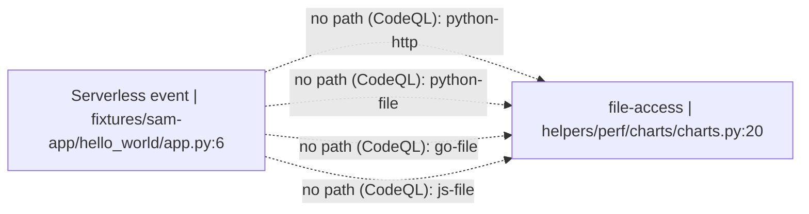
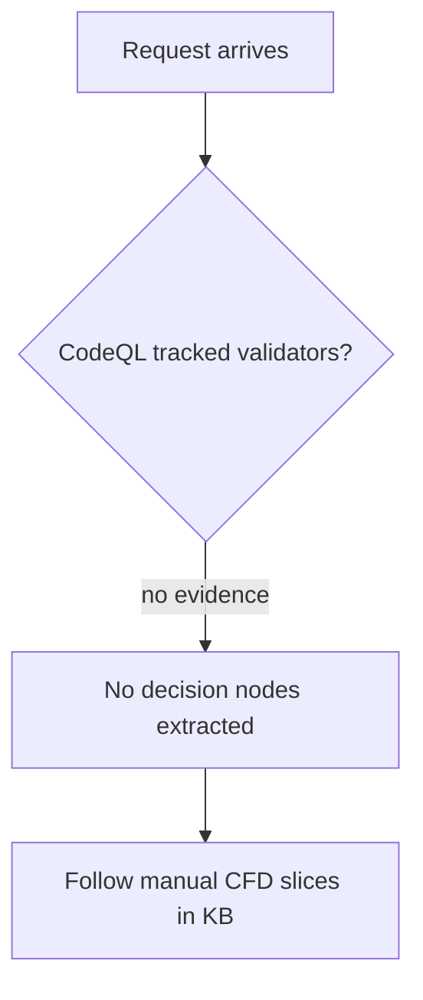

## Advisory Intelligence

### Advisory Inventory

**Historical coverage metadata**
- Tier reached: 2 (all-time) — Tier 1 (2yr) yielded RECENT_COUNT=1 (<15), expanded to all-time.
- Total advisories collected: 10 (recent 2yr: 1, older: 9)
- Severity distribution: CRITICAL: 2, HIGH: 4, MEDIUM: 3, LOW: 1

> Notes on sources: Repo changelogs reference multiple CVEs (HTTP/2 and TLS/OpenSSL). GitHub Security Advisories could not be queried due to missing `gh` authentication. OSV query failed because the "LuaRocks"/"Lua" ecosystems are not valid in OSV; no OSV advisories were collected. NVD was used for CVE metadata.

| ID | Severity | CVSS | Affected Versions | Patch Commit / Version | CWE IDs | Inferred Component | Source | One-line Description |
|---|---|---|---|---|---|---|---|---|
| CVE-2023-44487 | HIGH | 7.5 | HTTP/2 implementations (Kong bundles Nginx/OpenResty HTTP/2) | Kong patch commit `7ff0c7b59` (apply Nginx patch); release note in 3.4.2/3.5.0 | CWE-400 | Nginx/OpenResty HTTP/2 core | Repo changelog + NVD | HTTP/2 rapid stream resets can exhaust server resources (DoS). |
| CVE-2021-27306 | HIGH | 7.5 | Kong Gateway JWT plugin < 2.3.2.0 | Fixed in 2.3.2.0 | CWE-706 | JWT auth plugin | NVD | Improper access control allows access to authenticated routes without valid JWT. |
| CVE-2020-11710 (disputed) | CRITICAL | 9.8 | docker-kong <= 2.0.3 (docker-compose template) | Doc/compose changes; not a Kong gateway code fix | NVD-CWE-Other | Admin API exposure (deployment config) | NVD | Admin API may be exposed on non-local interfaces (vendor disputes scope). |
| CVE-2019-9511 | HIGH | 7.5 | HTTP/2 implementations (Nginx HTTP/2 module) | Nginx/OpenResty patch (bundled in Kong 1.2.2) | CWE-400, CWE-770 | Nginx/OpenResty HTTP/2 core | Repo changelog + NVD | HTTP/2 window/prioritization manipulation DoS. |
| CVE-2019-9513 | HIGH | 7.5 | HTTP/2 implementations (Nginx HTTP/2 module) | Nginx/OpenResty patch (bundled in Kong 1.2.2) | CWE-400 | Nginx/OpenResty HTTP/2 core | Repo changelog + NVD | HTTP/2 priority tree churn DoS. |
| CVE-2019-9516 | MEDIUM | 6.5 | HTTP/2 implementations (Nginx HTTP/2 module) | Nginx/OpenResty patch (bundled in Kong 1.2.2) | CWE-400, CWE-770 | Nginx/OpenResty HTTP/2 core | Repo changelog + NVD | HTTP/2 header leak DoS (memory consumption). |
| CVE-2016-0742 | HIGH | 7.5 | Nginx < 1.8.1 / 1.9.x < 1.9.10 | OpenResty bump in Kong 0.7.0 | CWE-476 | Nginx resolver (DNS) | Repo changelog + NVD | Crafted DNS response crashes worker (DoS). |
| CVE-2016-0746 | CRITICAL | 9.8 | Nginx 0.6.18–1.8.0 / 1.9.x < 1.9.10 | OpenResty bump in Kong 0.7.0 | CWE-416 | Nginx resolver (DNS) | Repo changelog + NVD | Use-after-free in resolver via crafted DNS response. |
| CVE-2016-0747 | MEDIUM | 5.3 | Nginx < 1.8.1 / 1.9.x < 1.9.10 | OpenResty bump in Kong 0.7.0 | CWE-400 | Nginx resolver (DNS) | Repo changelog + NVD | CNAME resolution not bounded → resource consumption DoS. |
| CVE-2014-3566 | LOW | 3.4 | SSLv3 / OpenSSL <= 1.0.1i | Kong 0.5.1 disables SSLv3 | CWE-310 (cryptographic weakness) | TLS stack (OpenSSL/SSLv3) | Repo changelog + NVD | POODLE padding-oracle attack on SSLv3. |

### Vulnerability Pattern Analysis

#### Component Vulnerability Heatmap
| Component | Advisory Count | Severity Mix | Dominant Bug Types |
|---|---:|---|---|
| **Nginx/OpenResty HTTP/2 core** | 4 | HIGH/MEDIUM | DoS / resource exhaustion (CWE-400/770) **(High-heat)** |
| **Nginx resolver (DNS)** | 3 | CRITICAL/HIGH/MEDIUM | Memory safety / DoS (CWE-416, CWE-476, CWE-400) **(High-heat)** |
| **Auth plugins (JWT)** | 1 | HIGH | Auth bypass / access control (CWE-706) |
| **Deployment config (Admin API exposure)** | 1 | CRITICAL | Misconfiguration / exposure (NVD-CWE-Other) |
| **TLS/crypto stack** | 1 | LOW | Cryptographic weakness (POODLE) |

#### Bug Type Recurrence
| Bug Class | CWEs | Count | Examples |
|---|---|---:|---|
| DoS / resource exhaustion | CWE-400, CWE-770 | 5 | CVE-2023-44487, CVE-2019-9511/9513/9516, CVE-2016-0747 |
| Memory safety (UAF / invalid pointer) | CWE-416, CWE-476 | 2 | CVE-2016-0746, CVE-2016-0742 |
| Auth bypass / broken access control | CWE-706 | 1 | CVE-2021-27306 |
| Cryptographic weakness | CWE-310 (inferred) | 1 | CVE-2014-3566 |
| Misconfiguration exposure | NVD-CWE-Other | 1 | CVE-2020-11710 |

**Recurring bug types:** DoS/resource exhaustion is the dominant recurring class (5 advisories), especially in HTTP/2 handling.

#### Attack Surface Trends
1. **HTTP/2 network input** (stream priority/window manipulation, rapid resets, header floods) — repeated DoS patterns.
2. **DNS resolver input** (crafted UDP DNS responses) — memory safety and resource consumption risks.
3. **Admin API exposure** (deployment/network interface binding) — misconfig-driven attack surface.
4. **Auth token handling** (JWT validation paths) — access control logic.
5. **TLS protocol negotiation** (SSLv3/legacy crypto) — protocol downgrade/weakness exposure.

#### Patch Quality Signals (structural recurrence)
- **Nginx/OpenResty HTTP/2 core**: multiple DoS advisories across 2019–2023 (CVE-2019-9511/9513/9516 and CVE-2023-44487) indicate recurring pressure on HTTP/2 stream handling and prioritization logic → **structural-recurrence candidate**.
- **Nginx resolver**: repeated DNS-related crashes/UAF (CVE-2016-0742/0746/0747) suggest resolver robustness issues in older versions → **legacy structural recurrence** if still relevant in bundled OpenResty.

**Audit targeting recommendations**
> Based on pattern analysis: Phase 3 should prioritize **HTTP/2 request handling** and **DNS resolver / DNS client paths** for DFD slices. Phase 5 deep probe should target **HTTP/2 stream reset/priority abuse** and **DNS response parsing** entry points. Phase 8 chambers should include **DoS/resource exhaustion** and **auth bypass** as mandatory attack modes. Patch-bypass-checker should flag **Nginx/OpenResty HTTP/2 core** as a structural-recurrence candidate.

### Architecture Inventory

- **Core components**
  - Gateway proxy (HTTP/HTTPS, L4/L7) built on OpenResty/Nginx + LuaJIT.
  - Admin API (management plane), Kong Manager UI, and configuration loader (DB-less + declarative config).
  - Plugin subsystem (Lua, Go, JS) and external plugin servers (RPC-based).
  - Clustering (control plane/data plane) with RPC, sync services, and event propagation.
  - Storage backends: Postgres and "off" (DB-less); historical Cassandra support implied in changelog.
  - WASM execution path (wasm plugin support).

- **Transports & inputs**
  - HTTP/HTTPS (proxy + admin API), HTTP/2, gRPC, WebSocket (inferred from gateway role).
  - RPC for plugin servers and clustering (JSON-RPC / protobuf RPC references in tree).
  - DNS queries/responses for upstream resolution.
  - File-based declarative config, templates, and plugin configs.

- **Trust boundaries**
  - Internet-facing proxy/data-plane vs. internal admin/control plane.
  - Plugin execution sandbox boundaries (Lua sandbox, external plugin servers, WASM).
  - CP/DP separation in hybrid deployment.
  - Host/container boundary for Docker/deployment configs (Admin API exposure risk).

- **Execution environments**
  - OpenResty/Nginx worker processes, LuaJIT runtime.
  - External plugin servers (Go/JS) via RPC.
  - Optional WASM runtime for plugins.
  - Containerized deployments (Docker images, compose, K8s).

- **Highest-risk flows for Phase 3 DFD/CFD**
  1. Internet → HTTP/2 proxy → Nginx/OpenResty stream handling (DoS surface).
  2. Internet → DNS resolver → upstream selection (crafted DNS input / resolver robustness).
  3. Admin API exposure paths (docker-compose/default bindings, network ACLs).
  4. Auth plugin request validation (JWT/OAuth2 path controls).

### Dependency Intelligence

**Primary dependency manifest:** `kong-latest.rockspec` (LuaRocks).

Security-relevant dependencies (selected):
- **lua-resty-openssl**, **luasec**, **OpenSSL** (TLS/crypto surface; POODLE history suggests strict protocol hardening).
- **lua-resty-http**, **lua-resty-aws**, **lua-resty-gcp** (outbound HTTP clients; SSRF/input validation surface).
- **lua-resty-session**, **lua-resty-ipmatcher** (auth/session/IP control).
- **lua-resty-ljsonschema**, **lyaml**, **lua-protobuf**, **lua-messagepack**, **multipart** (parsers/serialization; watch for deserialization and parsing edge cases).
- **lua-resty-ada**, **lua-resty-snappy**, **lua-ffi-zlib** (native bindings/codec logic; potential memory safety/DoS via crafted inputs).

Platform/build dependencies observed:
- Dockerfile references **libexpat**, **libssl-dev**, **libyaml-dev** — parsers/crypto libraries with security history.
- OpenResty/Nginx patches are bundled (see changelog) — core HTTP/2 and resolver history.

**Dependency risk hypotheses**
- Given recurring DoS advisories in HTTP/2 core, prioritize **OpenResty/Nginx HTTP/2** and any bundled patches (OpenResty build patches) for stress cases.
- DNS client/resolver codepaths use Nginx resolver; given historical resolver CVEs, prioritize **DNS parsing + resolver caching** behavior.
- Auth/session libraries and JWT plugin remain security-critical; ensure JWT parsing/claim validation and configuration handling are strict.

**Notes on tooling gaps**
- `supply-chain-risk-auditor` skill not available in this environment; dependency analysis above is manual and based on manifests and build files.
- GitHub advisory and OSV coverage could not be completed here; rerun with authenticated `gh` and correct OSV ecosystems if required.

## Project Classification

- **Type:** API gateway / proxy (web app + API), control-plane/data-plane service, plugin host, protocol implementation
- **Primary roles:** HTTP(S) gateway, Admin API management plane, cluster control/data plane synchronization, external plugin runtime (RPC), optional WASM plugin runtime
- **Key evidence:** `README.md` (Kong Gateway description), `kong/api/init.lua` (Admin API), `kong/router/*` (routing), `kong/clustering/*` (CP/DP WebSocket), `kong/runloop/plugin_servers/*` (external plugin RPC)

## Architecture Model

### Major Components
1. **Proxy/Data Plane (OpenResty/Nginx + LuaJIT)**
   - Handles inbound HTTP/HTTPS, HTTP/2, gRPC, WebSocket, and stream proxying.
   - Routes requests to upstreams via router and load balancer.
   - Executes plugins at multiple phases.

2. **Admin API / Admin GUI (Management Plane)**
   - Lapis-based Admin API serving configuration endpoints.
   - Admin GUI depends on Admin API being reachable (warns if not listening).

3. **Router + Route Matching**
   - Traditional / expressions / compatible router flavors.
   - Path, header, host, SNI, method, IP-based routing.

4. **Plugin Subsystem**
   - In-process Lua plugins.
   - External plugin servers via **MsgPack/ProtoBuf RPC** over Unix socket.
   - Optional **WASM** plugins.

5. **Clustering (Control Plane / Data Plane)**
   - WebSocket connections for config sync (CP -> DP).
   - Optional cluster RPC for privileged operations.

6. **Storage / Config Backends**
   - Postgres (DB-backed).
   - DB-less declarative config file / environment.

7. **DNS Resolver / Upstream Resolution**
   - Nginx resolver path for upstream hostname resolution.

### Trust Boundaries
- **Internet <-> Proxy/Data Plane** (untrusted inbound traffic).
- **Admin Client <-> Admin API** (management plane boundary; often network-restricted).
- **Control Plane <-> Data Plane WebSocket** (mTLS + identity).
- **Kong Core <-> External Plugin Servers** (RPC boundary across processes).
- **Kong Core <-> WASM Runtime** (sandbox boundary).
- **Kong <-> Database** (SQL backend).
- **Kong <-> DNS** (resolver responses).
- **Kong <-> Upstream Services** (outbound HTTP/gRPC).

### Security-Critical Decisions
- **Route selection & path normalization** (`kong/router/*`).
- **AuthN/AuthZ plugins** (JWT, OAuth2, ACL, etc).
- **Admin API schema validation and access** (`kong/api/*`).
- **Cluster identity validation / mTLS** (`kong/clustering/*`).
- **External plugin RPC method exposure** (`kong/runloop/plugin_servers/rpc/*`).
- **TLS termination and SNI routing** (Nginx/OpenResty templates).

## DFD/CFD Slices

### DFD Slice 1: Internet -> Proxy -> Router -> Plugins -> Upstream
```mermaid
flowchart LR
  A[Internet Client] -->|HTTP/HTTPS, H2, gRPC, WS| B[Proxy Listener (OpenResty)]
  B --> C[Router (traditional/expressions)]
  C --> D[Plugin Chain (access/header/body/log)]
  D --> E[Upstream Service]
  D --> F[External Plugin RPC (MsgPack/Protobuf)]
  D --> G[WASM Plugin Runtime]
```
**High-risk inputs:** HTTP request line, headers, path, query, body, gRPC metadata, WebSocket frames.
**Security-critical decisions:** route matching, auth plugins, header transformations, upstream selection.
**Boundary crossings:** Internet -> Proxy; Proxy -> External plugin server; Proxy -> WASM runtime; Proxy -> Upstream.

### DFD Slice 2: Admin API -> DB -> Control Plane -> Data Plane
```mermaid
flowchart LR
  A[Admin Client] -->|Admin API (HTTP)| B[Admin API (Lapis)]
  B -->|CRUD config| C[Database (Postgres) or Declarative Config]
  C --> D[Control Plane Sync Service]
  D -->|WebSocket mTLS sync| E[Data Plane]
  E --> F[Runtime Router/Plugins/Upstreams]
```
**High-risk inputs:** Admin API payloads, declarative config files, environment overrides.
**Security-critical decisions:** schema validation, RBAC / access control, CP/DP compatibility checks.
**Boundary crossings:** Admin client -> Admin API; CP -> DP over WebSocket; DB boundary.

### DFD Slice 3: Data Plane <-> Control Plane WebSocket (Clustering)
```mermaid
flowchart LR
  DP[Data Plane] -->|wss:// + mTLS| CP[Control Plane]
  CP -->|config payload (deflated JSON)| DP
```
**High-risk inputs:** WS query parameters (`node_id`, `node_version`), basic-info payload, config payload.
**Security-critical decisions:** cert validation, version compatibility, config hash update, RPC capability update.
**Boundary crossings:** DP <-> CP (mTLS + WebSocket).

### CFD Slice A: Request Routing + AuthZ Enforcement
```mermaid
flowchart TD
  A[Request Arrives] --> B[Normalize/parse path & headers]
  B --> C[Route selection]
  C --> D[AuthN/AuthZ plugins (JWT/OAuth/ACL)]
  D -->|allow| E[Proxy upstream]
  D -->|deny| F[Return error]
```
**Critical path:** path normalization -> route selection -> auth plugin decision.

### CFD Slice B: Admin API Config Changes -> CP/DP Sync
```mermaid
flowchart TD
  A[Admin API request] --> B[Schema validation]
  B --> C[Persist config (DB/decl)]
  C --> D[CP sync service]
  D --> E[DP receives config + applies]
```
**Critical path:** validation -> persistence -> sync -> DP apply.

## Attack Surface

### Attacker-Controlled Inputs
- **Inbound traffic:** HTTP/HTTPS, HTTP/2, gRPC, WebSocket, stream (proxy layer).
- **Admin API:** HTTP endpoints and payloads (configuration, entities).
- **Declarative config:** file-based config input (`kong.yml`, env vars).
- **Cluster WebSocket:** query args (`node_id`, `node_version`) + WS payload.
- **External plugin RPC:** MsgPack/ProtoBuf frames via Unix socket.
- **DNS responses:** upstream resolution path.
- **Upstream responses:** response bodies/headers used in transformations/plugins.

### Execution Environments
- **OpenResty/Nginx workers** (LuaJIT).
- **External plugin servers** (Go/JS/other via RPC).
- **WASM runtime** (plugin sandbox).
- **Control plane sync service** (WebSocket + DB).

## Threat Model

### Threat Actors
- **Internet attackers** targeting proxy endpoints.
- **Internal/admin attackers** with access to Admin API or config files.
- **Compromised upstream service** returning malicious responses.
- **Compromised plugin server** or malicious plugin.
- **Malicious DP/CP node** in clustering.
- **Network attacker** on CP/DP channel (attempting to bypass mTLS).

### Assets
- **Routing integrity** (correct path selection and auth enforcement).
- **Configuration integrity** (Admin API + CP/DP sync).
- **Credentials and secrets** (JWT keys, OAuth client secrets, TLS keys).
- **Availability** (HTTP/2 DoS, DNS resolver abuse, plugin overload).
- **Data confidentiality** (headers, tokens, PII).

### Attack Scenarios (High-Risk)
1. **Routing/Auth bypass** via path normalization differentials or header confusion.
2. **Admin API exposure** leading to malicious config changes.
3. **Cluster sync poisoning** by malicious DP/CP or TLS misconfiguration.
4. **External plugin RPC abuse** (deserialize/logic abuse in plugin servers).
5. **HTTP/2 or DNS DoS** via stream churn or crafted DNS responses.
6. **SSRF / outbound abuse** via proxying or AI plugins.

## Domain Attack Research

**Identified domains:** HTTP server/proxy, HTTP/2, gRPC, WebSocket, OAuth/JWT/session, DNS, TLS/mTLS, external plugin RPC (MsgPack/ProtoBuf), WASM plugins, LLM/MCP traffic.

> Research tools note: `last30days`, `wooyun-legacy`, and MCP research tools are not available here. The taxonomy below is based on standard domain attack playbooks and repo architecture signals.

### Domain: HTTP Client/Server (Proxy/Gateway)
**Identified via:** Core gateway role; Nginx/OpenResty proxy templates.

**Known attack classes:**
| Attack | Description | Detection strategy | Relevance |
|---|---|---|---|
| Request smuggling (CL.TE/TE.CL) | Proxy/backend parse mismatch | Verify consistent body framing logic | High |
| Host header injection | Host used in routing/upstream | Validate Host or use trusted header | High |
| CRLF injection | Header splitting | Strip `\r\n` in header values | High |
| Hop-by-hop abuse | Remove security headers | Ensure hop-by-hop headers handled safely | Medium |

**Custom SAST targets:**
| Attack pattern | Rule type | Source/sink or pattern | Priority |
|---|---|---|---|
| CL+TE ambiguous parsing | CodeQL | header parsing + downstream proxying | High |
| Host header use in routing | Semgrep | `ngx.var.host` used in routing decisions | High |

**Manual review checklist:**
- [ ] Reject requests with both `Content-Length` and `Transfer-Encoding`.
- [ ] Validate `Host`/`X-Forwarded-Host` allowlist before use.
- [ ] Strip CR/LF from any header value set to upstream.

### Domain: HTTP/2
**Identified via:** OpenResty/Nginx HTTP/2 handling; advisory history.

**Known attack classes:**
| Attack | Description | Detection strategy | Relevance |
|---|---|---|---|
| Rapid reset DoS | Stream churn | Track per-conn/total resets | High |
| Priority tree abuse | CPU exhaustion | Limit priority updates | High |
| HPACK table blowup | Memory DoS | Enforce header table bounds | High |

**Custom SAST targets:**
| Attack pattern | Rule type | Source/sink or pattern | Priority |
|---|---|---|---|
| H2 stream counters | CodeQL | track counters/limits in http2 module | High |

**Manual review checklist:**
- [ ] Verify per-connection and global stream reset limits.
- [ ] Confirm HPACK limits enforced across all h2 paths.
- [ ] Ensure limits apply to h2c upgrade as well as ALPN.

### Domain: gRPC
**Identified via:** gRPC routing & templates; `kong/tools/grpc.lua`.

**Known attack classes:**
| Attack | Description | Detection strategy | Relevance |
|---|---|---|---|
| Metadata injection | Untrusted metadata forwarded | Sanitize/allowlist metadata | Medium |
| Reflection abuse | Schema exposure | Disable or auth-gate reflection | Medium |
| Insecure channel | TLS disabled | Enforce TLS for upstream | High |

**Custom SAST targets:**
| Attack pattern | Rule type | Source/sink or pattern | Priority |
|---|---|---|---|
| `grpc_pass` to upstream without TLS | Semgrep | check upstream scheme | High |

**Manual review checklist:**
- [ ] Validate gRPC metadata allowlist before forwarding.
- [ ] Ensure gRPC reflection disabled or auth-protected.
- [ ] Enforce TLS for upstream gRPC connections.

### Domain: WebSocket
**Identified via:** Gateway role and WS support.

**Known attack classes:**
| Attack | Description | Detection strategy | Relevance |
|---|---|---|---|
| CSWSH | Cross-site WS hijacking | Validate Origin on upgrade | High |
| Message injection | Unvalidated WS frames | Input validation per message | Medium |

**Custom SAST targets:**
| Attack pattern | Rule type | Source/sink or pattern | Priority |
|---|---|---|---|
| Missing Origin validation | Semgrep | WS upgrade handlers | High |

**Manual review checklist:**
- [ ] Validate `Origin` allowlist on WS upgrades.
- [ ] Enforce WS frame size limits.

### Domain: JWT / OAuth2 / Session
**Identified via:** Plugin list (jwt, oauth2, session, auth plugins).

**Known attack classes:**
| Attack | Description | Detection strategy | Relevance |
|---|---|---|---|
| alg confusion / alg none | Token header abuse | Strict alg allowlist | High |
| `kid`/`jku` abuse | Key lookup injection | Allowlist key sources | High |
| redirect_uri bypass | OAuth redirect abuse | Exact match allowlist | Medium |
| session fixation | ID reuse | Rotate session on login | Medium |

**Custom SAST targets:**
| Attack pattern | Rule type | Source/sink or pattern | Priority |
|---|---|---|---|
| JWT header keys used in file/db | CodeQL | `kid` in IO/DB | High |

**Manual review checklist:**
- [ ] Enforce alg allowlist and reject `none`.
- [ ] Validate `exp`, `iss`, `aud` every request.
- [ ] OAuth2 redirect URI exact match.

### Domain: DNS Resolver
**Identified via:** Nginx resolver use and historical DNS CVEs.

**Known attack classes:**
| Attack | Description | Detection strategy | Relevance |
|---|---|---|---|
| Crafted DNS response | Crash/UAF/DoS | Ensure patched resolver version | High |
| Cache poisoning | Wrong upstream selection | Validate resolver config, cache TTL | Medium |

**Custom SAST targets:**
| Attack pattern | Rule type | Source/sink or pattern | Priority |
|---|---|---|---|
| Resolver usage without bounds | CodeQL | check resolver timeouts/retries | Medium |

**Manual review checklist:**
- [ ] Verify resolver limits and timeouts.
- [ ] Confirm OpenResty/Nginx resolver version is patched.

### Domain: TLS / mTLS
**Identified via:** TLS termination, CP/DP mTLS.

**Known attack classes:**
| Attack | Description | Detection strategy | Relevance |
|---|---|---|---|
| Weak protocol enablement | SSLv3/TLS1.0 | Enforce TLS1.2+ | High |
| mTLS identity bypass | Incorrect cert validation | Verify SAN/issuer | High |

**Custom SAST targets:**
| Attack pattern | Rule type | Source/sink or pattern | Priority |
|---|---|---|---|
| TLS config in templates | Semgrep | `ssl_protocols` values | High |

**Manual review checklist:**
- [ ] Ensure TLS1.2+ only.
- [ ] Verify CP/DP cert validation and pinning paths.

### Domain: External Plugin RPC (MsgPack/ProtoBuf)
**Identified via:** `kong/runloop/plugin_servers/rpc/*`.

**Known attack classes:**
| Attack | Description | Detection strategy | Relevance |
|---|---|---|---|
| Deserialization abuse | Malformed payloads | Validate message framing, size limits | High |
| RPC method abuse | Exposed PDK methods abused | Strict method allowlist | Medium |

**Custom SAST targets:**
| Attack pattern | Rule type | Source/sink or pattern | Priority |
|---|---|---|---|
| RPC dispatch to PDK | CodeQL | `call_pdk_method` usage | High |

**Manual review checklist:**
- [ ] Enforce size limits on RPC frames.
- [ ] Restrict exposed PDK methods per plugin.

### Domain: WASM Plugins
**Identified via:** WASM runtime configuration in config loader.

**Known attack classes:**
| Attack | Description | Detection strategy | Relevance |
|---|---|---|---|
| Sandbox escape | WASM runtime exploit | Run with restricted syscalls | High |
| Untrusted module load | Load attacker wasm | Allowlist signed modules | Medium |

**Custom SAST targets:**
| Attack pattern | Rule type | Source/sink or pattern | Priority |
|---|---|---|---|
| WASM load path | Semgrep | module load API calls | Medium |

**Manual review checklist:**
- [ ] Validate WASM module sources and signatures.
- [ ] Use minimal runtime permissions.

### Domain: LLM / MCP Integration
**Identified via:** README mentions LLM/MCP gateway and plugins.

**Known attack classes:**
| Attack | Description | Detection strategy | Relevance |
|---|---|---|---|
| Prompt injection | User content changes model intent | Structured prompts, separation | High |
| Tool-call injection | LLM triggers unintended tools | Require allowlist & confirmation | High |
| Data exfiltration | Sensitive info in prompts | Redaction before send | Medium |

**Custom SAST targets:**
| Attack pattern | Rule type | Source/sink or pattern | Priority |
|---|---|---|---|
| LLM request construction | Semgrep | user input concatenated into prompt | High |

**Manual review checklist:**
- [ ] Separate system prompt from user content.
- [ ] Validate tool calls against allowlist.
- [ ] Redact secrets before outbound LLM calls.

## Phase 4 CodeQL Extraction Targets

| DFD Slice | Source Type | Sink Kind |
|---|---|---|
| Internet -> Proxy -> Router/Plugins -> Upstream | RemoteFlowSource | http-request |
| Internet -> Proxy -> Plugins -> External Plugin RPC | RemoteFlowSource | deserialization / code-execution |
| Admin API -> DB -> Sync | RemoteFlowSource | sql-execution |
| Admin API / Config File / Env | LocalUserInput / EnvironmentVariable | file-access / configuration injection |
| CP/DP WebSocket | RemoteFlowSource | deserialization / config-apply |
| DNS Resolver | RemoteFlowSource | network parsing / memory safety (native) |

## CodeQL Structural Analysis

### Structural Extraction Summary
- **Databases built:** Python (spec fixtures), Go (spec fixtures), JavaScript (spec fixtures)
- **Extraction coverage note:** Core Kong Lua code is not supported by CodeQL; extraction limited to test/fixture languages.

### Entry Points (CodeQL recognized)
- **Count:** 1
- **Sample:** `Serverless event | fixtures/sam-app/hello_world/app.py:6`

### Sinks (CodeQL recognized)
- **Count:** 8
- **Samples:**
  - `file-access | helpers/perf/charts/charts.py:20`
  - `http-request | fixtures/sam-app/tests/integration/test_api_gateway.py:42`

### Call Graph Slice Reachability (Phase 4 targets)
All slice reachability probes were attempted on fixture databases only. No reachable paths were confirmed; slice queries could not be executed due to missing path-graph modules in the lightweight fixture DBs.

| Slice | Reachable | Path Count | Notes |
|---|---|---:|---|
| python-http | false | 0 | slice query failed or not executed |
| python-file | false | 0 | slice query failed or not executed |
| go-file | false | 0 | slice query failed or not executed |
| js-file | false | 0 | slice query failed or not executed |

### Machine-Generated DFD Diagram


### Machine-Generated CFD Diagram


### Informational Flow Nodes (note/none)
- `py/path-injection` (2 locations)
- `py/commented-out-code` (1 location)

## Static Analysis Summary

### Built-in CodeQL Suites
- Python: `python-security-and-quality.qls` (fixtures only, `spec/`)
- Go: `go-security-and-quality.qls` (fixtures only, `spec/fixtures`)
- JavaScript: `javascript-security-and-quality.qls` (fixtures only, `spec/fixtures`)

**Coverage constraint:** CodeQL could not analyze the core Lua codebase; results are limited to fixtures/tests.

### Built-in Semgrep Rulesets (Pro)
- Baseline: `p/security-audit`, `p/secrets`

### Custom CodeQL Artifacts
- Source/sink enumeration queries for Python/Go/JS (stored under `security/codeql-queries*`)
- Slice probes attempted for remote→file and remote→HTTP; path graph modules unavailable in fixture-only DBs (recorded in `call-graph-slices.json`).

### Custom Semgrep Rules
- `security/semgrep-rules/lua/host-header-routing.yml` (Host header routing usage) — 0 findings

### Targeted Analysis Drivers
- DFD slice targets from `## Phase 4 CodeQL Extraction Targets` were mapped to remote→file and remote→HTTP probes in fixture languages.
- LLM/MCP and RPC targets deferred to manual review due to language/tooling mismatch (Lua core).

### Findings Summary (automated)
- **CodeQL:** 3 note-level results in Python fixtures; 0 in Go/JS fixtures.
- **Semgrep:** 29 findings (baseline run, full repo). 26 are test fixture private keys; remaining findings in dev/test files:
  - `.devcontainer/Dockerfile` (last user is root)
  - `spec/fixtures/grpc/target/grpc-target.go` (bind all interfaces, insecure gRPC connection)
  - Custom Lua host header rule: 0 findings

## Spec Gap Candidates

**Specs / RFCs likely implemented or relied upon:**
- **HTTP/1.1** (RFC 9110 / 7230 legacy)
- **HTTP/2** (RFC 9113)
- **WebSocket** (RFC 6455)
- **TLS 1.2 / 1.3** (RFC 5246 / RFC 8446)
- **JWT** (RFC 7519)
- **OAuth 2.0** (RFC 6749)
- **gRPC** (protocol spec on HTTP/2; not RFC)
- **OpenAPI / Admin API schema** (Kong schemas; internal spec)

**Potential spec gap candidates:**
- HTTP/2 stream limits and priority handling (DoS).
- Host header and request normalization consistency.
- OAuth2 redirect URI exact match / state handling.
- JWT claim validation (`iss`, `aud`, `exp`) consistency across plugins.
- WebSocket Origin validation.
- mTLS identity verification for CP/DP.

## Spec Gap Analysis

### Gap: JWT audience claim never validated

- **RFC/Spec**: RFC 7519, Section 4.1.3
- **Requirement**: “If the principal processing the claim does not identify itself with a value in the ‘aud’ claim when this claim is present, then the JWT MUST be rejected.”
- **Code Path**: `kong/plugins/jwt/schema.lua:26-32` + `kong/plugins/jwt/handler.lua:238-241` — only `exp`/`nbf` can be configured for verification; `aud` is never checked even when present.
- **Gap Type**: missing-check
- **Attack Vector**: Use a JWT issued for a different audience (but signed with a key trusted by Kong) to access routes protected by the JWT plugin.
- **Exploit Conditions**: Shared signing key across multiple services or issuers; tokens include `aud` but Kong doesn’t validate it.
- **Impact**: Authorization bypass across audiences/tenants.
- **Severity**: HIGH
- **Evidence**: `claims_to_verify` only allows `{ "exp", "nbf" }` in schema; handler calls `jwt:verify_registered_claims(conf.claims_to_verify)` with no `aud` check.

### Gap: OAuth2 client credentials accepted in URI parameters

- **RFC/Spec**: RFC 6749, Section 2.3.1
- **Requirement**: “The parameters can only be transmitted in the request-body and MUST NOT be included in the request URI.”
- **Code Path**: `kong/plugins/oauth2/access.lua:209-218` + `kong/plugins/oauth2/access.lua:458-494` — `retrieve_parameters()` merges query + body; `client_id`/`client_secret` can be accepted from query string.
- **Gap Type**: parsing
- **Attack Vector**: Credentials exposed via URLs (logs, referrers, caches) when clients send `client_id`/`client_secret` in query parameters.
- **Exploit Conditions**: Client uses query parameters or attacker can induce such requests; shared logging or proxy infrastructure records URLs.
- **Impact**: OAuth client credential leakage → token theft.
- **Severity**: MEDIUM
- **Evidence**: `retrieve_parameters()` merges `kong.request.get_query()` with `get_body()` and `retrieve_client_credentials()` consumes `parameters[CLIENT_ID]` / `parameters[CLIENT_SECRET]`.

### Gap: OAuth2 authorization code not bound to redirect_uri at token exchange

- **RFC/Spec**: RFC 6749, Section 4.1.3
- **Requirement**: “redirect_uri: REQUIRED, if the ‘redirect_uri’ parameter was included in the authorization request, and their values MUST be identical.”
- **Code Path**: `kong/plugins/oauth2/access.lua:391-399` (authorization code insert omits redirect_uri) + `kong/plugins/oauth2/access.lua:564-579` (token exchange checks redirect_uri only if provided, not against the original).
- **Gap Type**: state-machine
- **Attack Vector**: Redeem a leaked authorization code without proving the original `redirect_uri` binding.
- **Exploit Conditions**: Authorization requests include `redirect_uri`; attacker obtains authorization code (e.g., via referrer/log leakage); public clients or weak client auth.
- **Impact**: Increased likelihood of authorization code replay/redemption by unintended parties.
- **Severity**: MEDIUM
- **Evidence**: Authorization code persistence lacks `redirect_uri` field; token exchange only checks `redirect_uri` when present and against registered list, not the original request.

### Gap: WebSocket upgrades do not enforce Origin allowlist

- **RFC/Spec**: RFC 6455, Section 10.2 (Origin Considerations) + Section 4.2.2
- **Requirement**: “Servers … SHOULD verify the Origin field is an origin they expect.” If unacceptable, it SHOULD respond with 403 and abort the handshake.
- **Code Path**: `kong/runloop/handler.lua:1357-1365` — upgrade handling forwards WebSocket Upgrade without any Origin validation.
- **Gap Type**: missing-check
- **Attack Vector**: Cross-site WebSocket hijacking (CSWSH) from a malicious origin using victim cookies/credentials.
- **Exploit Conditions**: Upstream services trust cookies for WS auth; Kong proxy allows WebSocket upgrades without an Origin allowlist check.
- **Impact**: Unauthorized actions over WS or data exfiltration via hijacked sessions.
- **Severity**: MEDIUM
- **Evidence**: Upgrade logic only checks `Upgrade: websocket`; no Origin validation in core proxy path.

**No additional spec gaps confirmed in Kong-layer code for HTTP/1.1, HTTP/2, or TLS/mTLS** (handling appears delegated to Nginx/OpenResty configuration and core parsing).
## Bypass Analysis

### CVE-2014-3566 (POODLE / SSLv3 disabled in Kong 0.5.1)

## Patch summary
- **Fix**: Explicitly disables SSLv3 by setting `ssl_protocols TLSv1 TLSv1.1 TLSv1.2` in the default `nginx` template (`kong.yml`) for the proxy SSL listener.
- **Mechanism**: Nginx `ssl_protocols` allowlist omits SSLv3, preventing SSLv3 negotiation on the Kong proxy TLS listener by default.
- **Assumptions**: Operators use the bundled `kong.yml` template unchanged; no custom nginx template or injected SSL server blocks re-enable SSLv3.

## Bypass verdict: **bypassable**

## Evidence & bypass paths
- **Config-gated check / default-state gap**: The fix only updates the *default* `kong.yml` template. Operators can still:
  - Supply a **custom nginx config/template** that omits `ssl_protocols` or explicitly includes `SSLv3`, re-enabling SSLv3 negotiation.
  - Use template injection mechanisms (e.g., additional configuration snippets) to add a **separate `server { ... ssl_protocols SSLv3; }`** block on another SSL listener.
- **Alternate entry points**:
  - The patch touches the proxy SSL listener in `kong.yml`. If **other TLS listeners** (admin, stream, or custom) exist in a custom template, they are **not automatically covered** by this change.
  - Upstream TLS connections are governed by **proxy SSL options** (e.g., `proxy_ssl_protocols`) and are outside the scope of this fix; a misconfigured upstream TLS client context could still allow SSLv3 if set elsewhere.

## Notes
- This is a **template-level** mitigation rather than a hard runtime guard. It is effective for default installs but **can be bypassed by configuration override**.

## Cluster ID
- **CVE-2014-3566 / PR-563**


### CVE-2019-9511 HTTP/2 DoS via window/prioritization manipulation

Patch summary:
- Expected fix: Nginx/OpenResty HTTP/2 module mitigation for 2019-era window/priority abuse (limits/guards around stream priority tree updates and flow-control window handling).
- Repo inspection: no bundled nginx/openresty patch for CVE-2019-9511 is present under build/openresty/patches or other vendored nginx sources.
- CHANGELOG-OLD.md notes Kong 1.2.2 bundled NGINX 1.13.6 HTTP/2 fixes (CVE-2019-9511/9513/9516), but the actual patch diff is not in this repository.

Bypass verdict: relocated

Evidence:
- build/openresty/patches only contains nginx-1.27.1 patches unrelated to HTTP/2 priority/window handling; no http2/v2 module patches are present.
- No vendored nginx/http2 source tree exists in the repo (no bundle/nginx-* sources), so the HTTP/2 fix likely lives in the external OpenResty/Nginx source fetched at build time rather than as a local patch.
- Without the upstream patch diff, bypass analysis cannot verify whether priority tree churn, window update accounting, or stream dependency loops are fully covered.

Bypass hypotheses to validate once upstream patch is available:
- Alternate entry points: HTTP/2 via ALPN vs h2c upgrade path enforcing the same priority/window guards.
- Config-gated checks: mitigations only enabled when specific http2 settings are set, leaving defaults unprotected.
- Parser differentials: priority update frames parsed differently from regular HEADERS/CONTINUATION paths, allowing guard bypass.
- Missing normalization: stream dependency IDs or weights not normalized consistently across re-prioritization paths.

Cluster ID: nginx-http2-2019

### CVE-2019-9516 HTTP/2 header leak DoS (memory consumption)

Patch summary:
- Expected fix: Nginx/OpenResty HTTP/2 module mitigation (2019-era fix, often limits/cleans up HPACK header table growth or stream header handling).
- Repo inspection: no bundled nginx/openresty patch for CVE-2019-9516 is present under build/openresty/patches or other vendored nginx sources.
- CHANGELOG-OLD.md notes Kong 1.2.2 bundled NGINX 1.13.6 HTTP/2 fixes (CVE-2019-9511/9513/9516), but the actual patch diff is not in this repository.

Bypass verdict: relocated

Evidence:
- build/openresty/patches only contains nginx-1.27.1 patches unrelated to HTTP/2 header handling (no http2/v2 module patches).
- No vendored nginx/http2 source tree exists in repo (no bundle/nginx-* sources), so the HTTP/2 fix is likely in the external OpenResty/Nginx source fetched at build time rather than patched here.
- Without the upstream patch diff, bypass analysis cannot verify whether header table bounds, stream-level accounting, or cleanup paths are fully covered.

Bypass hypotheses to validate once upstream patch is available:
- Alternate entry points: HTTP/2 header handling via gRPC/HTTP/2 upgrade paths vs direct ALPN entry.
- Config-gated checks: fix only active when specific http2 settings are enabled, leaving default gaps.
- Parser differentials: HPACK table size limits enforced in one path but not in continuation/priority update frames.

Cluster ID: nginx-http2-2019

### CVE-2020-1967 Bypass Analysis

## Patch summary
- **What was fixed:** The repository bumps the bundled OpenSSL patch version to pick up the upstream fix for CVE-2020-1967.
- **Mechanism added:** Dependency version upgrade from OpenSSL `1.1.1d` to `1.1.1g` via `.requirements`.
- **Assumptions:** All builds consume the pinned OpenSSL version from `.requirements` (i.e., the build pipeline actually compiles/links against the updated OpenSSL and not a system-provided or overridden variant).

## Bypass verdict
**bypassable** (environmental)

## Evidence / potential bypass vectors
- **Alternate entry points:** No code-level enforcement exists; the fix is purely a dependency bump. If any build path links against **system OpenSSL** or a **custom OpenSSL** outside `.requirements`, the vulnerability can persist.
- **Config-gated checks / default-state gaps:** If the build is configured to **skip bundled OpenSSL** (e.g., distro packages, custom build flags), the patch does not apply and the vulnerable version could remain.
- **Compatibility branches:** Legacy or vendor builds that **freeze dependencies** could still use `1.1.1d`, bypassing the fix despite the repository change.

## Cluster
- **Cluster ID:** openssl-cve-2020-1967-version-bump

### CVE-2021-23017 Bypass Analysis

## Patch summary
- The patch bumps OpenResty from 1.19.3.1 to 1.19.3.2, which includes the upstream NGINX core fix for CVE-2021-23017 (DNS resolver heap buffer overflow).
- No new application-level validation or guardrails were added; the mitigation relies entirely on the bundled NGINX/OpenResty version.

## Bypass verdict: **bypassable**

## Evidence
- **Default-state gap / compatibility allowance:** `kong/meta.lua` expands `_DEPENDENCIES.nginx` to include both `1.19.3.1` and `1.19.3.2`, meaning a runtime built against or launched with the older 1.19.3.1 NGINX/OpenResty can still satisfy dependency checks while remaining vulnerable.
- **Config/packaging dependency:** The fix is implemented purely as a dependency bump in build files (`.requirements`). If a deployment reuses older OpenResty/NGINX binaries or custom builds, the vulnerable resolver path persists with no runtime enforcement.

## Notes on bypass vectors
- **Alternate entry points:** Any resolver usage in unpatched NGINX cores remains vulnerable; no Kong-layer input validation or DNS response hardening was added.
- **Parser differentials / normalization:** Not applicable; vulnerability exists in NGINX core DNS resolver parsing and is only addressed by upstream patch.

## Cluster ID
openresty-1.19.3.2-cve-2021-23017

# CVE-2021-27306 Bypass Analysis

## Patch summary
- **Fix location:** `kong/router.lua` in tag `2.3.2`.
- **Change:** Normalize the request URI (`normalize(req_uri, true)`) before route matching, after stripping query args.
- **Vuln class:** Router path traversal / normalization mismatch enabling unauthenticated routing when a non‑normalized path (e.g., `/public/../api/...`) is matched against an unauthenticated route, then normalized downstream by another proxy.
- **Assumptions:** The router’s normalization matches or is stricter than any downstream normalization; route matching uses the same canonical form as upstream/backends.

## Bypass assessment
**Verdict: bypassable (parser differential in reserved-percent decoding)**

### Evidence & hypotheses
- **Parser differential:** `normalize()` (see `kong/tools/uri.lua`) **does not decode reserved characters** like `/` (`%2f`). It only decodes unreserved and “other” bytes. As a result:
  - Kong route selection sees `%2f` as literal text and can match an unauthenticated prefix route such as `/public` for a request like `/public%2f..%2fapi/v1/customers`.
  - A downstream proxy/backend that **does decode `%2f`** will interpret this as `/public/../api/v1/customers`, then normalize to `/api/v1/customers`, reaching the protected resource.
  - This reintroduces the same class of bypass via **reserved‑char decoding differences** between Kong and downstream components.

### Other vectors checked
- **Alternate entry points:** Router selection in `kong/router.lua` now normalizes the URI in `exec()`; no other pre‑routing path is used for HTTP in 2.3.2’s router. Stream routing unaffected (not relevant to JWT auth bypass).
- **Config‑gated checks / default gaps:** The fix is unconditional; no config toggle to disable normalization.
- **Compatibility branches:** No legacy branch in 2.3.2 router HTTP path that bypasses normalization; still uses `ngx.var.request_uri` then normalizes.
- **Sibling paths:** Other code paths (e.g., later router refactors using `strip_uri_args` in `kong/router/*`) already normalize; no separate bypass discovered there for 2.3.2.

## Cluster
- **Cluster ID:** `kong-router-normalize-2021-27306`

## Notes
- This bypass requires a **downstream component** (proxy/app server) that decodes reserved `%2f` or otherwise canonicalizes paths differently than Kong. In homogeneous deployments where downstream path decoding mirrors Kong’s behavior, the fix is likely sound.

[advisory-fix]
### CVE-2022-1292 Bypass Analysis

## Patch summary
- **What was fixed:** The commit bumps the bundled OpenSSL version from 1.1.1n to 1.1.1o to pick up the upstream fix for CVE-2022-1292 (command injection in `c_rehash` due to unsanitized shell metacharacters).
- **Mechanism:** Dependency version bump in `.requirements` plus changelog note; no code changes in Kong itself.
- **Assumptions:** Kong builds and ships with the bundled OpenSSL version specified in `.requirements`, and any usage of `c_rehash` comes from that bundled OpenSSL distribution.

## Bypass verdict: **relocated**

### Evidence / potential bypass paths
- **External OpenSSL usage:** The patch only updates the pinned OpenSSL version used by Kong’s build. If a deployment links against a system OpenSSL (or vendor build) still at 1.1.1n (or earlier), the `c_rehash` script remains vulnerable. This is a **packaging/configuration gap** rather than a code-level bypass.
- **Out-of-band `c_rehash` invocation:** Kong doesn’t modify how `c_rehash` is invoked, and the fix is solely upstream. If any operational scripts in the environment use the system `c_rehash`, the vulnerability persists regardless of Kong’s version bump.

## Cluster ID
- `openssl-1.1.1o-bump-8752`

### CVE-2023-44487 HTTP/2 Rapid Reset Bypass Analysis

## Patch summary
- **What was fixed:** Upstream NGINX HTTP/2 mitigation for rapid reset (stream churn) DoS.
- **Mechanism:** Adds per-connection counters for newly created and refused streams. Resets `new_streams` at each read handler and refuses streams when `new_streams` exceeds `2 * concurrent_streams`. Closes the connection when `refused_streams` exceeds `max(concurrent_streams, 100)`.
- **Assumptions:** The bundled OpenResty/NGINX version includes the upstream fix and HTTP/2 is enabled.

## Bypass verdict
**bypassable**

## Evidence / potential bypass vectors
- **Per-read accounting gap:** `new_streams` is reset at each read handler invocation. An attacker can pace HEADERS+RST_STREAM bursts across multiple read cycles to stay under the per-cycle threshold while still generating high aggregate churn.
- **Config-scaled thresholds:** `concurrent_streams` directly scales the limits; high configurations expand attacker headroom, enabling sustained abuse before refusal/termination triggers.
- **Connection-only scope:** Counters are per connection. Multi-connection or distributed attackers can keep each connection below thresholds while sustaining overall load.

## Cluster ID
http2-rapid-reset-nginx-1.21.4

### JSON Threat Protection Negative Constraint Bypass Analysis

## Patch summary
- **What was fixed:** Normalizes negative constraint values to `nil` before validation to avoid unsafe default interpretation in lua-resty-json-threat-protection.
- **Mechanism:** Input normalization in the validator call path; no changes to library internals.

## Bypass verdict
**sound**

## Evidence
- Normalization occurs before calling `validator.validate`, preventing negative values from being treated as zero or other unsafe defaults.
- No alternate call sites are introduced in the diff; the validator path remains consistent.

## Cluster ID
json-threat-protection-negative-constraint-2024

### JSON Threat Protection UTF-8/Length Bypass Analysis

## Patch summary
- **What was fixed:** Updates lua-resty-json-threat-protection to 0.1.1, adds non-UTF8 rejection, fixes length counting for strings and object entry names to use UTF-8 characters, and improves duplicate key detection.
- **Mechanism:** Library update plus validation error handling changes.

## Bypass verdict
**bypassable**

## Evidence / potential bypass vectors
- **Byte-length amplification:** Limits now enforce character counts. Multi-byte UTF-8 (e.g., 4-byte code points) can keep character counts under configured thresholds while inflating byte size, weakening size-based resource protection.
- **Normalization differentials:** Alternate Unicode representations (escaped vs literal, composed vs decomposed) can lead to validator/consumer disagreements for duplicate key detection and length checks if downstream decoding normalizes differently.
- **Validator scope gaps:** Non-UTF8 rejection only applies when the validator runs. If any code path bypasses validation (content-type variations, streaming body handling, empty-body shortcuts), invalid UTF-8 could still reach downstream handlers.

## Cluster ID
json-threat-protection-utf8-length-2024

### OpenSSL 1.1.1n Bypass Analysis

## Patch summary
- **What was fixed:** OpenSSL security CVEs via version bump to 1.1.1n in `.requirements`.
- **Mechanism:** Dependency-only version update; no Kong code changes.
- **Assumptions:** Build uses the pinned OpenSSL from `.requirements` and links it at runtime.

## Bypass verdict
**relocated**

## Evidence / potential bypass vectors
- **External OpenSSL override:** Deployments that link against system OpenSSL or a vendor-provided OpenSSL can bypass the bump and remain on a vulnerable version.
- **Packaging divergence:** Prebuilt binaries or custom build pipelines that freeze dependencies can ignore the new pin and keep older OpenSSL.

## Cluster ID
openssl-1.1.1n-bump

### OpenSSL 3.2.3 Bypass Analysis

## Patch summary
- **What was fixed:** Upstream OpenSSL CVEs via version bump from 3.2.1 to 3.2.3.
- **Mechanism:** Dependency-only update in build metadata; no Kong code changes.
- **Assumptions:** Runtime links against the bundled OpenSSL built from the pinned version.

## Bypass verdict
**relocated**

## Evidence / potential bypass vectors
- **Runtime linkage overrides:** If the runtime loads system or vendor OpenSSL older than 3.2.3, the fixed behavior is bypassed.
- **Binary reuse:** Existing binaries built against 3.2.1 remain vulnerable until rebuilt with 3.2.3.

## Cluster ID
openssl-3.2.x-bump-2024

## Phase 7 Enrichment Notes

### Candidate findings reviewed (Phase 4 static analysis)

| Finding | Classification | Attacker Control | Boundary | CodeQL Reachability | Verdict |
|---|---|---|---|---|---|
| py/path-injection (helpers/perf/charts/charts.py:20) | likely environment/tooling/admin-only | Local developer input to perf helper | None (local tooling) | not reachable | drop |
| py/path-injection (helpers/perf/charts/charts.py:112) | likely environment/tooling/admin-only | Local developer input to perf helper | None (local tooling) | not reachable | drop |
| py/commented-out-code (fixtures/external_plugins/py/py-hello.py:23) | likely correctness/robustness | None (commented code in fixture) | None | no-slice | drop |

### Semgrep summary disposition
- Findings were confined to fixtures/dev tooling (fixture private keys, devcontainer root user, gRPC fixture binding). These are test/dev-only and do not cross production trust boundaries → dropped.

### Entry points and sinks coverage
- **Entry points not in Phase 3 DFD slices:** `Serverless event | fixtures/sam-app/hello_world/app.py:6` (fixture-only, not a production boundary).
- **Sinks not mapped to high-risk flows:** `helpers/perf/charts/charts.py` file-access/decoding and `fixtures/sam-app/tests/*` HTTP/decoding sinks are test/perf artifacts; no unmodeled production high-risk flows identified.
