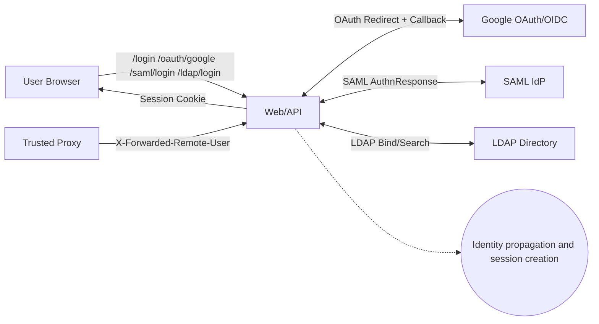
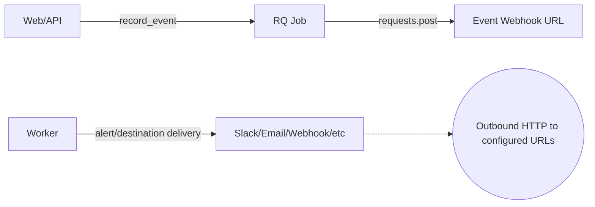
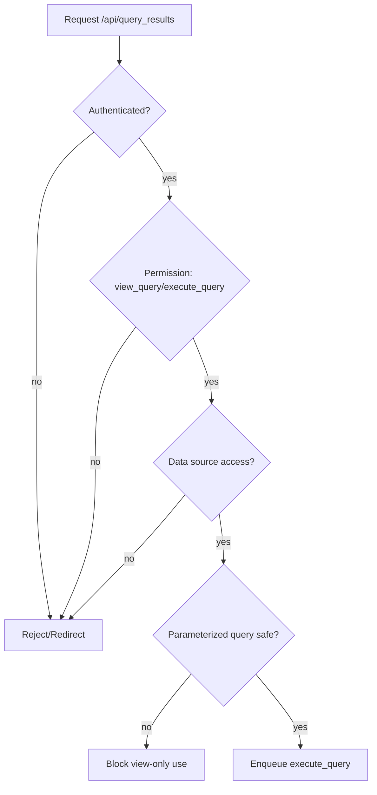
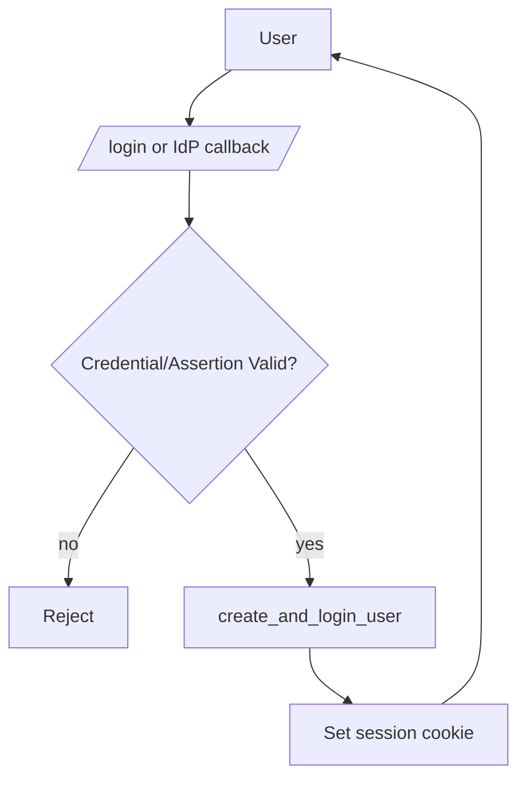
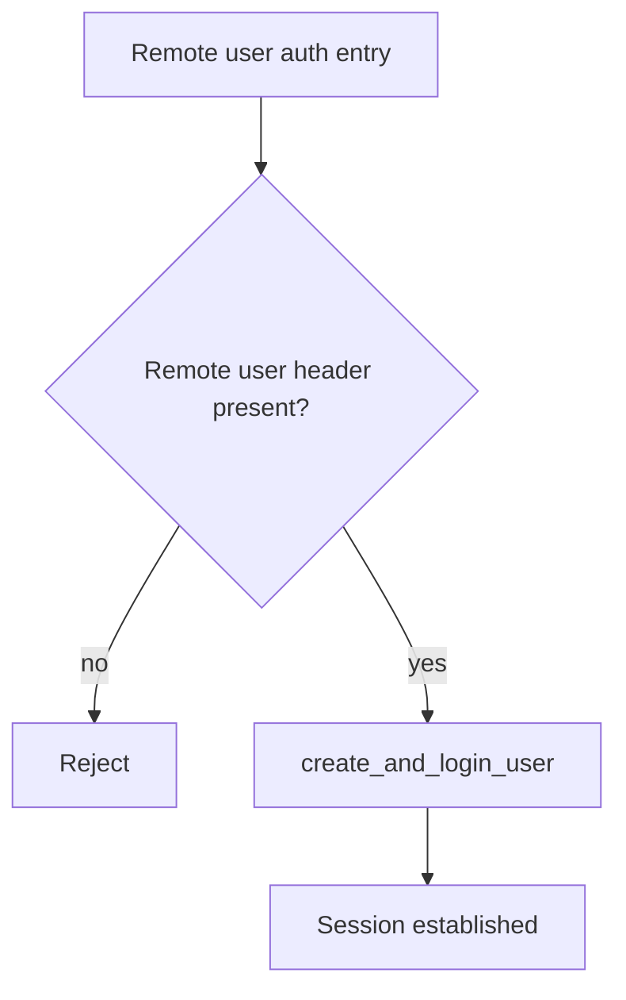

## Advisory Intelligence

### Advisory Inventory

**Historical coverage metadata**

- Tier reached: 2 (all-time; RECENT_COUNT=1 < 15)
- Total advisories collected: 6 (recent 2yr: 1, older: 5)
- Severity distribution (highest reported per advisory): CRITICAL: 0, HIGH: 3, MEDIUM: 3, LOW: 0

**Source coverage and limits**

- Repo signals: CHANGELOG.md + SECURITY.md, no CVE/GHSA mentions outside 2021 release notes
- GitHub Security Advisories: not accessible (gh api 401; requires authenticated gh session)
- OSV: no results for redash (PyPI), redash-client (npm), @redash/viz (npm)
- NVD: 6 advisories for keyword "redash" (all-time)

| ID (CVE/GHSA)                        | Severity                             | CVSS      | Affected versions     | Patch commit / version                                   | CWE IDs          | Inferred component                                   | One-line description                                                      | Source                     |
| ------------------------------------ | ------------------------------------ | --------- | --------------------- | -------------------------------------------------------- | ---------------- | ---------------------------------------------------- | ------------------------------------------------------------------------- | -------------------------- |
| CVE-2025-5874                        | MEDIUM (CVSS v3.1 4.6; v4.0 2.1 LOW) | 4.6 / 2.1 | Up to 10.1.0 / 25.1.0 | Not specified                                            | CWE-264, CWE-265 | Python query runner sandbox (query_runner/python.py) | Potential sandbox bypass in Python data source query execution (disputed) | NVD (VulDB CNA)            |
| CVE-2021-43780 / GHSA-fcpv-hgq6-87h7 | HIGH                                 | 8.8       | < 10.0.1              | Commit 61bbb5aa7a23a93f2f93710005f71bc972826099 / 10.0.1 | CWE-918          | URL-loading data sources (JSON/CSV/Excel)            | SSRF via URL-loading data sources enabling crafted HTTP requests          | NVD + GitHub Advisory refs |
| CVE-2021-41192 / GHSA-g8xr-f424-h2rv | HIGH                                 | 8.1       | <= 10.0.0             | Commit ce60d20c4e3d1537581f2f70f1308fe77ab6a214          | CWE-1188         | Auth/session secret management                       | Insecure default cookie/session secret allows forged sessions if unset    | NVD + GitHub Advisory refs |
| CVE-2021-43777 / GHSA-vhc7-w7r8-8m34 | MEDIUM                               | 6.8       | <= 10.0.0             | Commit da696ff7f84787cbf85967460fac52886cbe063e          | CWE-352, CWE-601 | OAuth (Google login)                                 | OAuth state misused for redirect; CSRF protections bypassable             | NVD + GitHub Advisory refs |
| CVE-2020-12725                       | HIGH                                 | 7.2       | <= 8.0.0              | Not specified                                            | CWE-918          | JSON data source / URL fetch                         | Authenticated SSRF via JSON data source request crafting                  | NVD                        |
| CVE-2020-36144                       | MEDIUM                               | 5.3       | 8.0.0                 | Not specified                                            | CWE-74           | LDAP auth                                            | LDAP injection via unsanitized username in LDAP search filter             | NVD                        |

**Patch list (known commits)**

- ce60d20c4e3d1537581f2f70f1308fe77ab6a214 - fix insecure default secrets (CVE-2021-41192)
- da696ff7f84787cbf85967460fac52886cbe063e - fix OAuth state handling (CVE-2021-43777)
- 61bbb5aa7a23a93f2f93710005f71bc972826099 - harden URL-loading data sources via Advocate (CVE-2021-43780)

### Vulnerability Pattern Analysis

#### 2a. Component Vulnerability Heatmap

| Component                                            | Count | Severity mix      | Dominant bug types                          | Notes                                                 |
| ---------------------------------------------------- | ----: | ----------------- | ------------------------------------------- | ----------------------------------------------------- |
| URL-loading data sources (JSON/CSV/Excel, URL fetch) |     2 | HIGH/HIGH         | SSRF (CWE-918)                              | High-heat: repeated SSRF across versions (2020, 2021) |
| Auth/session secret management                       |     1 | HIGH              | Insecure defaults (CWE-1188)                | Secret/key handling and env config                    |
| OAuth login (Google)                                 |     1 | MEDIUM            | CSRF/open redirect misuse (CWE-352/601)     | State parameter misuse                                |
| LDAP auth                                            |     1 | MEDIUM            | Injection (CWE-74)                          | LDAP filter construction                              |
| Python query runner / sandbox                        |     1 | MEDIUM (disputed) | Privilege/permissions control (CWE-264/265) | Risk if Python DS enabled                             |

High-heat components: URL-loading data sources (SSRF recurrence). Prioritize in Phase 3 DFD and Phase 5 deep probes.

#### 2b. Bug Type Recurrence

| Bug Class                   | CWEs             | Count | Examples                       |
| --------------------------- | ---------------- | ----: | ------------------------------ |
| SSRF                        | CWE-918          |     2 | CVE-2020-12725, CVE-2021-43780 |
| Auth/session misconfig      | CWE-1188         |     1 | CVE-2021-41192                 |
| CSRF / Open redirect misuse | CWE-352, CWE-601 |     1 | CVE-2021-43777                 |
| Injection (LDAP)            | CWE-74           |     1 | CVE-2020-36144                 |
| Sandbox / privilege control | CWE-264, CWE-265 |     1 | CVE-2025-5874                  |

Recurring bug class: SSRF - target URL fetchers/data source connectors in Phase 8 chambers.

#### 2c. Attack Surface Trends

Ranked input vectors by frequency:

1. Network input via URL-loading data sources (SSRF in JSON/CSV/Excel/URL connectors)
2. Auth flows (session secret defaults; OAuth state handling)
3. Directory services input (LDAP search filter injection)
4. Query runner execution (Python DS) - sandbox escape

#### 2d. Patch Quality Signals (structural recurrence)

- URL-loading data sources (SSRF) patched in 8.0.0-era and again in 10.0.1 - structural SSRF surface. Flag as structural-recurrence for Phase 2 patch-bypass checks.

Audit targeting recommendations:

- Phase 3: prioritize URL-loading data sources + query runner architecture.
- Phase 5: deep-probe URL fetch entry points and data source connectors.
- Phase 8: SSRF + auth-flow abuse mandatory.
- Patch-bypass: URL-loading data sources as structural-recurrence.

### Architecture Inventory

**Components**

- Web app/API: Flask server (Gunicorn/gevent), REST endpoints, auth/session handling
- Workers/scheduler: RQ background jobs, scheduler service
- Query runners: data source connectors (SQL/NoSQL/HTTP/CSV/Excel/JSON, optional Python DS)
- Frontend: React/Ant Design SPA, @redash/viz
- Persistence: PostgreSQL (SQLAlchemy), Redis (RQ/queue/cache)
- Integrations: OAuth (Authlib), SAML (pysaml2), LDAP (optional), SMTP, cloud SDKs

**Transports**

- HTTP/HTTPS (UI/API + external data source fetches)
- SQL connections to databases
- Redis protocol for queues
- File I/O for CSV/Excel, config/env secrets

**Trust boundaries**

- Internet-facing UI/API vs internal data sources/DBs
- Admin vs regular user privileges (data source management, query execution)
- External IdPs (OAuth/SAML) vs internal session handling
- Worker/scheduler vs web process

**Execution environments**

- Python runtime (server + workers), Node/webpack for frontend
- Containerized deployment (Dockerfiles present)

**Highest-risk flows**

- URL-loading data sources (server-side HTTP requests) -> SSRF
- Auth and OAuth login flow -> session/redirect integrity
- Query runner execution (Python DS) -> sandbox escape
- LDAP integration -> injection in directory queries

### Dependency Intelligence

**Key security-relevant runtime dependencies (Python)**

- Flask / Werkzeug / Jinja2: request handling, templating; XSS/SSRF mitigations depend on safe usage
- Authlib, Flask-Login, PyJWT, pysaml2: auth/OAuth/SAML flows (matches auth/CSRF history)
- requests + advocate + urllib3: HTTP client stack used in URL-loading data sources (SSRF recurrence)
- SQLAlchemy 1.3.24: legacy ORM; verify raw query usage
- redis + rq + rq-scheduler: background job infrastructure
- pyyaml, jsonschema: deserialization/validation surface
- ldap3 (optional): aligns with LDAP injection history
- cryptography / pyopenssl / paramiko: TLS/SSH
- restrictedpython: sandboxing controls for Python DS (aligns with CVE-2025-5874 surface)

**Key security-relevant runtime dependencies (JS)**

- react / antd: UI framework
- dompurify: HTML sanitization
- axios: HTTP client
- markdown / mustache: rendering user content
- sql-formatter: SQL formatting in UI

**Dependency risk notes**

- SSRF history -> review requests/advocate usage in data source connectors.
- Auth/OAuth history -> review Authlib/Flask-Login redirect and state handling.
- LDAP injection history -> review ldap3 search filter construction.

**Supply-chain analysis note**

- supply-chain-risk-auditor skill is not available in this environment, so manual dependency triage was done.

## Bypass Analysis

# CVE-2021-43780 SSRF URL-loading data sources

## Patch summary

- Replaced ad-hoc is_private_address() checks in URL/JSON/CSV/Excel query runners with advocate-backed request handling.
- Centralized HTTP requests through requests_or_advocate/ConfiguredSession so private-address blocking is enforced at request time and redirects are handled by the session wrapper.
- Added handling for UnacceptableAddressException to return a consistent "Can't query private addresses." error.

## Bypass verdict

sound (for the URL/CSV/Excel/JSON data sources targeted by this CVE)

## Evidence and analysis

- Primary fix coverage:
  - BaseHTTPQueryRunner.get_response() now uses requests_session built from requests_or_advocate.Session when ENFORCE_PRIVATE_ADDRESS_BLOCK is enabled, replacing the hostname-only is_private_address() check.
  - csv.py and excel.py switched from raw requests.get() to requests_or_advocate.get() and added explicit UnacceptableAddressException handling.
  - json_ds.py now relies on the same BaseHTTPQueryRunner request path instead of a preflight private-host check.
  - This covers the "URL-loading" data sources where query authors supply the URL at runtime, which was the original SSRF vector.
- Config-gated behavior (expected):
  - Private-address blocking is conditional on ENFORCE_PRIVATE_ADDRESS_BLOCK (default true). Disabling this setting intentionally restores the pre-patch behavior (no SSRF guard). This is configuration, not a bypass.
- Out-of-scope but related risk (not a bypass of this fix):
  - Several other query runners still call requests.get() directly and are not routed through requests_or_advocate or ConfiguredSession. These generally use admin-configured base URLs rather than user-supplied URLs, so they are outside the CVE's "URL-loading data sources" scope, but they remain potential SSRF surfaces if a malicious admin can configure them.

## Cluster ID

cve-2021-43780-url-ds-ssrf

# CVE-2021-41192 Insecure default secret

## Patch summary

- Replaced hardcoded default cookie secret with a runtime-generated secret when none is configured.
- Added explicit configuration guidance to set COOKIE_SECRET in production.
- Ensured the fallback secret is not shared between installs.

## Bypass verdict

sound (for default-secret attack against fresh installs)

## Evidence and analysis

- The pre-patch vulnerability relied on a known constant secret, enabling session cookie forgery when COOKIE_SECRET was unset.
- The patch removes the fixed constant and generates a unique value at startup, making offline cookie forgery infeasible without local access to the generated secret.
- Potential bypass requires either:
  - access to server logs or memory to read the generated secret (post-compromise), or
  - administrators explicitly setting a weak/guessable COOKIE_SECRET.
    These are operational or post-compromise issues rather than bypasses of the patch.

## Cluster ID

cve-2021-41192-cookie-secret-default

# Bypass Analysis: da696ff7f84787cbf85967460fac52886cbe063e (CVE-2021-43777)

## Patch summary

- **Vulnerability fixed:** OAuth state handling flaw in the Google OAuth flow. The pre-patch code used the `state` parameter to carry an untrusted `next` URL, allowing tampering. It also relied on `flask_oauthlib` behavior for state management.
- **Mechanism added:** Migration to Authlib with cryptographic state managed by the client library, and moving the post-login redirect target into server-side session storage (`session["next_url"]`) instead of accepting it from the callback request.
- **Assumptions:** Session integrity is preserved across the OAuth round-trip; the `next` value is set only at the authorization initiation step, and the session cannot be overwritten by an attacker without an existing session fixation or CSRF bypass.

## Bypass verdict: **sound**

## Evidence and bypass analysis

- **Alternate entry points:** The vulnerable sink (callback handling of `state`) was removed. The callback now ignores request `state` and uses `session["next_url"]` plus `get_next_path()` normalization. No other caller in this module consumes `state` directly. This closes the primary tampering vector.
- **Config-gated checks / default-state gaps:** No config flag controls the new behavior. The flow always uses Authlib's state handling and session-backed `next_url`.
- **Compatibility branches:** Old `flask_oauthlib` branch is removed from the module and requirements, so no legacy path remains in-tree.
- **Parser differentials / normalization:** `get_next_path()` still sanitizes open-redirect attempts by stripping scheme/netloc. Even if `next_url` were attacker-controlled, it is normalized to a relative path, mitigating external redirect bypasses.

### Potential residual concerns (not direct bypasses)

- **Session fixation / CSRF in other routes:** If an attacker can fix the victim’s session or forge the initial `/oauth/google` request within the same session, they might set `session["next_url"]` to an attacker-chosen relative path. This would still be normalized to a relative URL, preventing external redirects, but could be used to steer the victim within the app. This relies on unrelated session integrity issues and is not a bypass of the OAuth state fix itself.

## Cluster ID

- `google-oauth-authlib-migration`

## Project Classification

- Type: Web app + API (Flask) with background workers/scheduler (RQ) and SPA frontend (React).
- Secondary: Query runner framework (data source connectors) and outbound integrations (webhooks, email, chat destinations).

## Architecture Model

### Major Components

- Web/API server (Flask): request routing, auth/session, query lifecycle, data source management, REST endpoints.
- Query execution workers (RQ): executes queries, fetches external data, stores results, triggers alerts.
- Scheduler/maintenance jobs: refresh queries, schema refresh, cleanup.
- Query runners: pluggable data source connectors (SQL/NoSQL/HTTP/CSV/Excel/etc.) including URL-loading runners.
- Frontend SPA: React/AntD client uses /api/\* endpoints, embeds, dashboards.
- Persistence: PostgreSQL via SQLAlchemy for queries/results/users/orgs; Redis for queues and caching.
- Integrations: OAuth (Authlib), SAML (pysaml2), LDAP (ldap3), Remote User header auth, JWT auth, email, webhook/chat destinations.

### Transports and Data Stores

- HTTP/HTTPS: UI/API ingress, OAuth/SAML callbacks, outbound HTTP to data sources and destinations.
- SQL: PostgreSQL for application state and query results.
- Redis: RQ queue, job locks, cache/state.
- File/Blob: CSV/Excel remote fetch, local filesystem for JWT public certs (file://), config/env secrets.

### Trust Boundaries

- Internet to Web/API server: untrusted HTTP requests, cookies, API keys.
- Web/API server to Workers: job queue boundary; jobs carry user identity metadata.
- Web/API server to External IdPs: OAuth/SAML, LDAP directory, JWT issuer public keys.
- Server/Workers to External data sources: database connections and outbound HTTP (SSRF risk).
- Admin vs regular users: data source management, query runner configuration, org settings.
- Proxy/edge to app: Remote User header trust boundary; proxy must sanitize headers.

### Security-Critical Decisions

- AuthN: login flows (password, OAuth, SAML, LDAP, Remote User) and session creation.
- AuthZ: require_permission, require_access, group-based access checks for queries/data sources.
- Query execution gating: view-only vs modify permissions; parameter safety checks.
- SSRF protections: ConfiguredSession/requests_or_advocate and ENFORCE_PRIVATE_ADDRESS_BLOCK.
- CSRF enforcement: ENFORCE_CSRF toggle with flask-wtf protections.
- Session/cookie security: Secure/HttpOnly settings, session secret requirements.
- API key handling: API user flow, query API keys vs user API keys.

## DFD/CFD Slices

### DFD-1: Query Execution (User -> Worker -> Data Source)

```mermaid
flowchart LR
  U[User/Client] -->|HTTP /api/queries, /api/query_results| W[Web/API Server]
  W -->|enqueue job (Redis/RQ)| Q[RQ Queue]
  Q -->|execute_query| WRK[Worker]
  WRK -->|run_query()| DS[External Data Source]
  WRK -->|store results| DB[(PostgreSQL)]
  DB -->|query results| W
  W -->|JSON/CSV/XLSX| U

  subgraph Trust Boundaries
    U
    W
    WRK
    DS
  end
```

### DFD-2: URL-Loading Data Sources (SSRF Surface)

```mermaid
flowchart LR
  U[Authenticated User] -->|JSON/CSV/Excel query with URL| W[Web/API]
  W -->|enqueue query| WRK[Worker]
  WRK -->|HTTP request (ConfiguredSession/advocate)| EXT[Arbitrary URL]
  EXT -->|Response| WRK
  WRK -->|Results| DB[(PostgreSQL)]
  DB --> W --> U

  note1((SSRF risk: private IPs, metadata, redirects))
  WRK -.-> note1
```

### DFD-3: Auth Flows (OAuth/SAML/LDAP/Remote User)



### DFD-4: Event/Webhook Destinations (Outbound HTTP)



### CFD-1: AuthZ for Query Execution



### CFD-2: Login and Session Creation



## Attack Surface

### Attacker-Controlled Inputs

- HTTP requests: /api/_, /login, /oauth/google_, /saml/\*, /ldap/login, /remote_user/login, /api/query_results.
- Query text and parameters: user-provided SQL/YAML/JSON for query runners.
- Data source configuration: admin-provided connection strings, URLs, credentials.
- URL inputs: JSON/CSV/Excel/URL query runners accept URLs at runtime.
- Headers: Remote User auth header (X-Forwarded-Remote-User by default), Host/X-Forwarded-\* via ProxyFix.
- API keys: query API key and user API key access paths.
- File paths: JWT public certs file:// URL.
- Webhook URLs: event reporting hooks and destination webhook URLs (admin-configured).
- Environment/config: secrets, OAuth/SAML config, LDAP settings, CSRF toggle, SSRF block toggle.

### Execution Environments

- Web process: Flask app handling session/auth, API endpoints, config.
- Worker processes: query execution, outbound HTTP to data sources, scheduled jobs.
- Browser: SPA client rendering and data visualization.

## Threat Model

### Threat Actors

- Unauthenticated external attacker probing API endpoints and auth flows.
- Authenticated user (low privilege) attempting data access escalation or SSRF.
- Admin user (malicious or compromised) misconfiguring data sources/webhooks.
- Compromised IdP / LDAP / JWT issuer returning malicious identity assertions.
- Network attacker/proxy misconfiguration injecting trusted headers (Remote User).

### Assets

- Query results (potentially sensitive analytics data).
- Data source credentials and connection secrets.
- Session cookies, API keys, OAuth tokens.
- Organization/user metadata, permissions, groups.
- Internal network reachability (SSRF to metadata/localhost).

### High-Risk Attack Scenarios

- SSRF via URL-loading data sources (JSON/CSV/Excel/URL runners) to internal IPs or metadata services.
- Auth bypass via Remote User header if proxy trust boundary is misconfigured.
- OAuth/SAML assertion tampering leading to unauthorized account creation or login.
- LDAP injection in search filters if escaping fails or template misused.
- Query runner abuse using privileged data source connection to extract data beyond intended access scope.

## Domain Attack Research

Identified domains: HTTP client/server, OAuth/OIDC, SAML 2.0, JWT/JWS, LDAP, SQL/ORM, Redis/RQ, URL parsing/SSRF, CSV/Excel parsing, Webhooks/destinations.

Tooling limitation: last30days and wooyun-legacy skills and web search MCP tools are not available in this environment. Research below uses static playbook knowledge only.

### Domain: HTTP Client / Server

Identified via: requests usage across query runners and webhook destinations; Flask server.

Known attack classes:

| Attack                | Description                                  | Detection strategy                                      | Relevance |
| --------------------- | -------------------------------------------- | ------------------------------------------------------- | --------- |
| SSRF                  | Server-side HTTP to attacker-controlled URLs | Find URL inputs flowing into requests/ConfiguredSession | High      |
| Host header injection | Host used to build redirects/URLs            | Validate Host before use in redirects                   | Medium    |
| CRLF injection        | Header injection in outbound requests        | Strip \r\n from header values                           | Low       |

Custom SAST targets:

| Attack pattern       | Rule type      | Source/sink or pattern                     | Priority |
| -------------------- | -------------- | ------------------------------------------ | -------- |
| SSRF via HTTP client | CodeQL/Semgrep | User-controlled URL -> requests.\*         | High     |
| Host header usage    | Semgrep        | request.host/Host -> redirect/URL building | Medium   |

Manual review checklist:

- All URL inputs are validated/allowlisted before HTTP fetch.
- SSRF guard applied consistently to all requests.\* usage.
- Host/Origin values not trusted for redirect URL construction.

Research sources used: playbook only (tooling unavailable).

### Domain: OAuth 2.0 / OIDC

Identified via: Authlib OAuth integration (google_oauth.py).

Known attack classes:

| Attack              | Description                    | Detection strategy                    | Relevance |
| ------------------- | ------------------------------ | ------------------------------------- | --------- |
| State CSRF          | Missing/weak state on callback | State stored server-side and verified | Medium    |
| redirect_uri bypass | Weak redirect validation       | Exact match/known redirect only       | Low       |
| Mix-up attack       | Wrong AS bound to session      | iss/metadata bound to session         | Low       |

Custom SAST targets:

| Attack pattern                   | Rule type | Source/sink or pattern   | Priority |
| -------------------------------- | --------- | ------------------------ | -------- |
| OAuth callback use of state/next | Semgrep   | request.args -> redirect | Medium   |

Manual review checklist:

- state is generated and verified by Authlib on callback.
- next_url is stored server-side and sanitized (get_next_path).

Research sources used: playbook only (tooling unavailable).

### Domain: SAML 2.0

Identified via: pysaml2 in saml_auth.py.

Known attack classes:

| Attack                        | Description                                   | Detection strategy                              | Relevance |
| ----------------------------- | --------------------------------------------- | ----------------------------------------------- | --------- |
| XML Signature Wrapping        | Signed assertion not bound to parsed identity | Ensure parsed assertion is the signed node      | High      |
| Unsigned assertion acceptance | SP accepts assertions without valid signature | Verify signatures and enforce signed assertions | High      |
| XXE                           | XML parser loads external entities            | Disable DTD/external entities                   | Medium    |

Custom SAST targets:

| Attack pattern        | Rule type | Source/sink or pattern             | Priority |
| --------------------- | --------- | ---------------------------------- | -------- |
| SAML response parsing | Manual    | parse_authn_request_response usage | High     |

Manual review checklist:

- Assertion parsing occurs only after signature verification.
- External entities/DTD are disabled in XML parser.
- Audience/Recipient/Destination are validated.

Research sources used: playbook only (tooling unavailable).

### Domain: JWT / JWS

Identified via: jwt_auth.py validates JWT using fetched keys.

Known attack classes:

| Attack                  | Description                     | Detection strategy               | Relevance |
| ----------------------- | ------------------------------- | -------------------------------- | --------- |
| Algorithm confusion     | RS256 to HS256 misuse           | Explicit algorithm allowlist     | Medium    |
| kid injection           | kid used for dynamic key lookup | kid only indexes trusted key set | Medium    |
| Claim validation bypass | Missing iss/aud validation      | Validate issuer/audience and exp | Medium    |

Custom SAST targets:

| Attack pattern | Rule type | Source/sink or pattern             | Priority |
| -------------- | --------- | ---------------------------------- | -------- |
| JWT decode     | Semgrep   | jwt.decode with dynamic algorithms | Medium   |

Manual review checklist:

- Algorithms are strictly allowlisted.
- iss, aud, exp validated for every token.
- Public key URL is trusted and fixed; no attacker-supplied jku.

Research sources used: playbook only (tooling unavailable).

### Domain: LDAP

Identified via: ldap_auth.py uses ldap3 and LDAP search template.

Known attack classes:

| Attack         | Description                           | Detection strategy      | Relevance |
| -------------- | ------------------------------------- | ----------------------- | --------- |
| LDAP injection | Unescaped user input in search filter | Use escape_filter_chars | Medium    |

Custom SAST targets:

| Attack pattern     | Rule type | Source/sink or pattern     | Priority |
| ------------------ | --------- | -------------------------- | -------- |
| LDAP search filter | Semgrep   | %{username} in LDAP filter | Medium   |

Manual review checklist:

- Search filter uses escaped username and fixed template.
- LDAP bind uses least-privileged service account.

Research sources used: playbook only (tooling unavailable).

### Domain: SQL / ORM Query Building

Identified via: SQLAlchemy models and SQL queries in handlers/query runners.

Known attack classes:

| Attack            | Description                 | Detection strategy    | Relevance |
| ----------------- | --------------------------- | --------------------- | --------- |
| Raw SQL injection | String concatenation in SQL | Audit execute/raw use | Medium    |

Custom SAST targets:

| Attack pattern    | Rule type | Source/sink or pattern          | Priority |
| ----------------- | --------- | ------------------------------- | -------- |
| raw SQL execution | CodeQL    | User input -> raw SQL execution | Medium   |

Manual review checklist:

- No user input concatenated into SQL strings.
- Query parameterization enforced across runners.

Research sources used: playbook only (tooling unavailable).

### Domain: URL Parsing / SSRF

Identified via: URL-loading query runners (json_ds.py, csv.py, excel.py, url.py).

Known attack classes:

| Attack            | Description                    | Detection strategy                         | Relevance |
| ----------------- | ------------------------------ | ------------------------------------------ | --------- |
| Private IP bypass | IPv6/IPv4 confusion, redirects | Validate resolved IPs and follow redirects | High      |
| DNS rebinding     | Host resolves to private IP    | Resolve and re-check per request           | Medium    |

Custom SAST targets:

| Attack pattern | Rule type | Source/sink or pattern                    | Priority |
| -------------- | --------- | ----------------------------------------- | -------- |
| URL fetch      | CodeQL    | User URL -> requests_or_advocate/requests | High     |

Manual review checklist:

- URL fetches use advocate/ConfiguredSession with private IP blocking.
- Redirects are re-validated against SSRF rules.
- Explicit allowlist for protocols (http/https only).

Research sources used: playbook only (tooling unavailable).

### Domain: Webhooks / Destinations

Identified via: redash.destinations.\* and tasks.general.record_event.

Known attack classes:

| Attack               | Description                                      | Detection strategy                | Relevance |
| -------------------- | ------------------------------------------------ | --------------------------------- | --------- |
| SSRF via webhook URL | Admin-configured URL points to internal services | Validate or restrict webhook URLs | Medium    |

Custom SAST targets:

| Attack pattern   | Rule type | Source/sink or pattern      | Priority |
| ---------------- | --------- | --------------------------- | -------- |
| Webhook delivery | Semgrep   | Config URL -> requests.post | Medium   |

Manual review checklist:

- Webhook URLs validated or restricted to allowed domains.
- Outbound requests do not include sensitive headers by default.

Research sources used: playbook only (tooling unavailable).

## Phase 4 CodeQL Extraction Targets

| DFD Slice                   | Source Type                               | Sink Kind                    | Notes                                                                                 |
| --------------------------- | ----------------------------------------- | ---------------------------- | ------------------------------------------------------------------------------------- |
| DFD-1 Query Execution       | RemoteFlowSource (HTTP body/query params) | sql-execution / http-request | Query text and params propagate into query runners and outbound HTTP to data sources. |
| DFD-2 URL Data Sources      | RemoteFlowSource                          | http-request                 | URL input -> requests_session.request / requests_or_advocate.get.                     |
| DFD-3 Auth Flows            | RemoteFlowSource                          | auth-decision                | OAuth/SAML/LDAP inputs -> session creation, user provisioning.                        |
| DFD-4 Webhooks/Destinations | LocalUserInput (admin config)             | http-request                 | Webhook/destination URLs configured by admins.                                        |

## Spec Gap Candidates

- OAuth 2.0 (RFC 6749) and OIDC Core (Google OAuth/OIDC usage).
- SAML 2.0 bindings for SSO (HTTP-POST/Redirect).
- JWT (RFC 7519) for API auth.
- HTTP/1.1 (RFC 9110/9112) request/response handling and header trust boundaries.

## Threat Model (Skill Invocation)

The security-threat-model skill is not available in this environment; the threat model above is provided manually based on code inspection and architecture signals.

## CodeQL Structural Analysis

### Structural Extraction Summary

- **Databases built:** Python + JavaScript (CodeQL database cluster at `security/codeql-artifacts/db/`)
- **Entry points (Python):** 149 total
  - Flask RoutedParameter: 121
  - flask.request: 28
- **Entry points (JavaScript):** 22 total (no source type labels in JS extractor output)
- **Sinks (Python):** 130 total
  - http-request: 47
  - decoding: 32
  - sql-execution: 23
  - file-access: 19
  - command-execution: 7
  - code-execution: 2
- **Sinks (JavaScript):** 9 total
  - command-execution: 8
  - file-access: 1

### Call-Graph Slice Reachability (Phase 4 Targets)

| DFD Slice                   | Reachable | Path Count | Shortest Paths                                                                             |
| --------------------------- | --------- | ---------: | ------------------------------------------------------------------------------------------ |
| DFD-1 Query Execution       | false     |          0 | —                                                                                          |
| DFD-2 URL Data Sources      | false     |          0 | —                                                                                          |
| DFD-3 Auth Flows            | true      |          2 | redash/authentication/remote_user_auth.py:3 → redash/authentication/remote_user_auth.py:47 |
| DFD-4 Webhooks/Destinations | false     |          0 | —                                                                                          |

Notes:

- DFD-3 reachability resolved to Remote User auth flow; other slices show no CodeQL-modeled source→sink path with current models.
- DFD-4 custom source modeling attempted via `self.configuration.get*` (admin-config), still no modeled path.

### Machine-Generated DFD Diagram

```mermaid
flowchart LR
  SRC1[remote_user_auth.py:3 (RemoteFlowSource)] --> MID1[create_and_login_user()] --> SINK1[remote_user_auth.py:47 (auth sink)]

  SRC2[DFD-1: RemoteFlowSource] -. no path (CodeQL) .-> SINK2[sql-execution/http-request]
  SRC3[DFD-2: RemoteFlowSource] -. no path (CodeQL) .-> SINK3[http-request]
  SRC4[DFD-4: RemoteFlowSource/admin config] -. no path (CodeQL) .-> SINK4[http-request]
```

### Machine-Generated CFD Diagram



Note: No `note`-level informational results were emitted in the all-severities SARIF outputs; the CFD diagram is minimal and based on the reachable auth slice plus Phase 3 CFD guidance.

## Static Analysis Summary

### CodeQL

- **Structural extraction:** Completed using a Python+JavaScript DB cluster at `security/codeql-artifacts/db/`.
- **Enumerations:** Source and sink enumeration queries executed for Python and JavaScript.
- **Slice queries:** Custom path-problem QL for DFD-1..DFD-4 executed (Python). Only DFD-3 produced reachable paths (Remote User auth flow).
- **All-severities run:** `codeql/python-queries:codeql-suites/python-security-and-quality.qls` and `codeql/javascript-queries:codeql-suites/javascript-security-and-quality.qls` with `--threat-model all`.
- **Raw SARIF outputs:** `security/codeql-artifacts/flow-paths-raw-python.sarif`, `flow-paths-raw-javascript.sarif`, and merged placeholder `flow-paths-raw.sarif` (Python copy). No note-level results in SARIF.
- **Custom QL artifacts:**
  - `security/codeql-queries/python/list-sources-python.ql`
  - `security/codeql-queries/python/list-sinks-python.ql`
  - `security/codeql-queries/python/slice-dfd1-query-execution-python.ql`
  - `security/codeql-queries/python/slice-dfd2-url-data-sources-python.ql`
  - `security/codeql-queries/python/slice-dfd3-auth-flows-python.ql`
  - `security/codeql-queries/python/slice-dfd4-webhooks-destinations-python.ql`
  - `security/codeql-queries/javascript/list-sources-javascript.ql`
  - `security/codeql-queries/javascript/list-sinks-javascript.ql`

### Semgrep (Pro enforced)

- **Baseline:** `p/security-audit` (full-repo) → `security/semgrep-res/semgrep-baseline.sarif`.
- **Python Pro:** `p/python` (scoped to Python files) → `security/semgrep-res/semgrep-python-pro.sarif`.
- **JavaScript/TypeScript Pro:** `p/javascript` (scoped to client/viz-lib) → `security/semgrep-res/semgrep-js-pro.sarif`.
  - SARIF emission warnings from Semgrep (“unsupported dataflow trace”) were logged but results produced successfully.
- **Custom rules for SSRF/Auth/LDAP/SAML/JWT/Webhooks:**
  - `security/semgrep-rules/ssrf-auth-ldap-saml-jwt-python.yml`
  - `security/semgrep-rules/ssrf-webhooks-python.yml`
  - Output: `security/semgrep-res/semgrep-custom.sarif`

### Targeted Focus from Domain Attack Research

- SSRF and outbound HTTP usage (`requests`/`requests_or_advocate`, URL data sources, webhook destinations).
- Auth surfaces: OAuth next/state handling, Remote User auth, session creation paths.
- LDAP filter construction and SAML response parsing entry points.
- JWT decode usage with dynamic key/alg inputs.

### Coverage Notes / Tradeoffs

- The full Pro baseline `p/default + p/security-audit` exceeded the 240s budget; baseline was run as `p/security-audit` plus separate Pro-heavy language passes (`p/python`, `p/javascript`) to preserve taint coverage with bounded runtime.
- CodeQL slice reachability did not show modeled paths for DFD-1/DFD-2/DFD-4; this may indicate missing models for custom wrappers or configuration sources.

### Agentic Actions Auditor

- `.github/workflows/` exists, but the `agentic-actions-auditor` skill is not available in this environment; workflow audit was skipped and should be rerun when the skill is installed.

## Spec Gap Analysis

No medium-or-higher spec gaps identified for OAuth/OIDC, JWT, or HTTP based on the current code paths reviewed in:

- `redash/authentication/google_oauth.py`
- `redash/authentication/jwt_auth.py`
- `redash/authentication/__init__.py`
- `redash/app.py`
- `redash/utils/__init__.py`

SAML 2.0 spec text could not be extracted from the available PDF sources in this environment, so no spec-mapped gaps are recorded for SAML flows at this time. Provide a text-extracted SAML Core spec to complete that portion of the analysis.
