# Grafana Security Knowledge Base Report
**Repository**: grafana/grafana  
**Commit**: bb41ac0c85d854e32cb19874fb4b3f17163179a8  
**Report Date**: 2026-04-11  
**Phase**: 1 — Advisory Hunter

---

## Advisory Intelligence

### Historical Coverage Metadata

- **Tier Reached**: Tier 1 (2-year window, 2024–2026) — 40+ unique advisories collected; supplementary medium/low pass confirmed
- **Total Advisories Collected**: 42 unique first-party Grafana CVEs/GHSAs (2024–2026 focus), plus 15 from 2022–2023 (pattern analysis), plus 20+ dependency CVEs
- **First-party Grafana severity distribution (2024–2026)**:
  - CRITICAL: 3 (CVE-2024-9264, CVE-2025-41115, older CVE-2022-39328)
  - HIGH: 8 (CVE-2025-6023, CVE-2025-4123, CVE-2024-8118, CVE-2024-6322, CVE-2025-3260, CVE-2025-3454, CVE-2024-9476, CVE-2022-31107)
  - MEDIUM: 18 (including CVE-2026-27877, CVE-2025-3580, CVE-2024-11741, CVE-2024-10452, CVE-2024-1442, etc.)
  - LOW/DoS: 5 (CVE-2025-1088, CVE-2026-27879, CVE-2026-27880, etc.)
- **Sources consulted**: GitHub repo advisories API, OSV API (github.com/grafana/grafana ecosystem), Git log/CHANGELOG, NVD API

### Advisory Inventory (Primary)

See `/archon/advisory-report.md` for full table. Key advisories from the 2024–2026 window, ranked by severity:

| ID | GHSA | Severity | CVSS | Patch Commit | CWE | Component | Summary |
|----|------|----------|------|--------------|-----|-----------|---------|
| CVE-2024-9264 | GHSA-q99m-qcv4-fpm7 | CRITICAL | 9.9 | `ea71201ddc6` | CWE-78, CWE-22 | SQL Expressions | Command injection + LFI via DuckDB SQL expressions |
| CVE-2025-41115 | GHSA-w62r-7c53-fmc5 | CRITICAL | 9.8 | (Enterprise-only) | CWE-266 | SCIM provisioning | Privilege escalation in SCIM — unauthenticated privilege assignment |
| CVE-2025-6023 | GHSA-vqph-p5vc-g644 | HIGH | 8.1 | `4669b586e98` | CWE-79, CWE-22 | Login/routing | XSS via open redirect + path traversal in login flow |
| CVE-2025-4123 | GHSA-q53q-gxq9-mgrj | HIGH | 8.2 | `(see PR #108333)` | CWE-79 | Plugin frontend loader | XSS via custom frontend plugin loading — no auth required |
| CVE-2025-3260 | GHSA-3px7-c4j3-576r | HIGH | 8.3 | Internal | CWE-863 | Dashboard/Folder RBAC | Auth bypass for dashboard and folder permission checks |
| CVE-2025-3454 | GHSA-9j65-rv5x-4vrf | HIGH | 7.7 | Internal | CWE-284 | Datasource Proxy | Auth bypass in datasource proxy — cross-org data exposure |
| CVE-2024-8118 | — | HIGH | 7.1 | `c2799b4901d` | CWE-862 | Alerting API | Missing permission check on alerting rule POST endpoint |
| CVE-2024-6322 | GHSA-hh8p-374f-qgr5 | HIGH | 7.2 | Various | CWE-284 | Plugin datasource ACL | Plugin datasource access control bypass across orgs |
| CVE-2024-9476 | — | HIGH | ~7.5 | Internal | unknown | MigrationAssistant | MigrationAssistant privilege escalation |
| CVE-2026-27877 | GHSA-3q27-7qjq-p9c5 | MEDIUM | 6.5 | `0e5d9e01ef3` | CWE-200 | Public Dashboards | Public dashboard exposes all direct-mode datasource configs |
| CVE-2026-28375 | — | MEDIUM | ~6.5 | `0e5d9e01ef3` | CWE-89/CWE-22 | SQL Expressions | SQL INTO clause bypasses allowlist — file write in SQL engine |
| CVE-2025-3580 | — | MEDIUM | ~5.5 | `5963be6f317` | CWE-269 | Org management | Privilege manipulation in org user removal logic |
| CVE-2025-6197 | — | MEDIUM | ~6.5 | `4669b586e98` | CWE-601 | Login/redirect | Open redirect in org redirect middleware |
| CVE-2026-27879 | — | MEDIUM | ~5.0 | `0e5d9e01ef3` | CWE-400 | Testdata datasource | Unlimited data point generation — resource exhaustion |
| CVE-2026-27880 | — | MEDIUM | ~5.0 | `0e5d9e01ef3` | CWE-400 | Math expressions | Resample series length unbounded — OOM DoS |
| CVE-2024-11741 | GHSA-wxcc-2f3q-4h58 | MEDIUM | 4.3 | Internal | CWE-200 | Alerting (VictorOps) | VictorOps notifier token exposed to Viewers |
| CVE-2024-10452 | GHSA-66c4-2g2v-54qw | MEDIUM | 4.3 | Internal | CWE-639 | Org management | Org admin can delete invites from other orgs (IDOR) |
| CVE-2024-1442 | GHSA-5mxf-42f5-j782 | MEDIUM | 6.4 | Various | CWE-284 | Datasource CRUD | Create-datasource permission enables full CRUD on all datasources |
| CVE-2024-1313 | GHSA-67rv-qpw2-6qrr | MEDIUM | 6.5 | Various | CWE-639 | Snapshots | IDOR: delete snapshot by key from outside org |
| CVE-2025-3415 | GHSA-46m5-8hpj-p5p5 | MEDIUM | 4.3 | Internal | CWE-200 | DingDing notifier | DingDing notifier exposes webhook access token |
| CVE-2025-1088 | GHSA-crvv-6w6h-cv34 | LOW | 2.7 | Internal | CWE-400 | Dashboard rendering | Long panel/title causes frontend DoS — admin-exploitable |

---

## Vulnerability Pattern Analysis

### 2a. Component Vulnerability Heatmap

| Component | Advisory Count (2022–2026) | Severity Distribution | Dominant Bug Types |
|-----------|---------------------------|----------------------|-------------------|
| **SQL Expressions (expr/sql)** | 4 | CRITICAL x2, MEDIUM x2 | CWE-78 (cmd inject), CWE-22 (LFI), CWE-89 (SQL), CWE-400 (DoS) |
| **Auth / OAuth / Login** | 7 | CRITICAL x1, HIGH x4, MEDIUM x2 | CWE-287 (auth bypass), CWE-601 (open redirect), CWE-79 (XSS), CWE-362 (race condition) |
| **Access Control / RBAC** | 6 | HIGH x4, MEDIUM x2 | CWE-284, CWE-862, CWE-863 (broken access control), CWE-639 (IDOR) |
| **Public Dashboards** | 4 | HIGH x1, MEDIUM x3 | CWE-200 (info disclosure), CWE-284 (auth bypass) |
| **Alerting (ngalert / notifiers)** | 5 | HIGH x2, MEDIUM x3 | CWE-862 (missing auth check), CWE-200 (info disclosure) |
| **Plugin system** | 3 | HIGH x2, MEDIUM x1 | CWE-79 (XSS), CWE-284 (ACL bypass), CWE-347 (signature bypass) |
| **SCIM / Provisioning** | 2 | CRITICAL x1, MEDIUM x1 | CWE-266 (privilege), CWE-863 (authorization) |
| **Datasource Proxy** | 3 | HIGH x2, MEDIUM x1 | CWE-284, CWE-200 (auth bypass / credential leak) |
| **Org management** | 3 | MEDIUM x3 | CWE-639 (IDOR), CWE-269 (privilege) |
| **Snapshot management** | 2 | MEDIUM x2 | CWE-639 (IDOR), CWE-200 (info disclosure) |
| **Math expressions (Resample)** | 2 | MEDIUM x2 | CWE-400 (DoS) |

**High-heat components** (3+ advisories OR any CRITICAL):
1. SQL Expressions — CRITICAL history, re-enabled as public preview, active file-write bypass fixed 2026-03
2. Auth/OAuth/Login — persistent target, open redirect + XSS patterns
3. Access Control / RBAC — persistent broken ACL theme across orgs and roles
4. Public Dashboards — repeated info disclosure including current datasource exposure
5. Alerting notifiers — repeated credential/token exposure in notification integrations

### 2b. Bug Type Recurrence

| Bug Class | CWEs | Count (2022–2026) | Examples |
|-----------|------|-------------------|---------|
| **Broken Access Control / Auth Bypass** | CWE-284, CWE-862, CWE-863 | 10 | CVE-2024-8118 (alerting), CVE-2025-3260 (dashboard RBAC), CVE-2025-3454 (datasource proxy), CVE-2024-6322 (plugin ACL), CVE-2024-1442 (datasource CRUD) |
| **Cross-Site Scripting (XSS)** | CWE-79 | 8 | CVE-2025-4123 (plugin XSS), CVE-2025-6023 (redirect+XSS), CVE-2022-31097 (alerting), CVE-2022-23552 (ResourcePicker), CVE-2023-1410 (Graphite), CVE-2023-0507/0594 |
| **Information Disclosure** | CWE-200, CWE-209 | 7 | CVE-2026-27877 (public dash datasources), CVE-2024-11741 (VictorOps token), CVE-2025-3415 (DingDing token), CVE-2022-39201 (auth cookie leak), CVE-2022-31130 (token leak) |
| **IDOR / Privilege Escalation** | CWE-639, CWE-269, CWE-266 | 7 | CVE-2024-10452 (invite IDOR), CVE-2024-1313 (snapshot IDOR), CVE-2022-36062 (folder priv), CVE-2025-41115 (SCIM), CVE-2025-3580 (org removal) |
| **Command/Code Injection** | CWE-78, CWE-89 | 2 | CVE-2024-9264 (SQL DuckDB RCE), CVE-2026-28375 (SQL INTO clause) |
| **Open Redirect** | CWE-601 | 2 | CVE-2025-6197, CVE-2025-6023 |
| **Resource Exhaustion / DoS** | CWE-400, CWE-770 | 4 | CVE-2026-27879 (testdata), CVE-2026-27880 (resample), CVE-2025-1088 (panel title), CVE-2021-27358 (snapshots DoS) |
| **Path Traversal** | CWE-22 | 3 | CVE-2024-9264 (LFI), CVE-2025-6023 (redirect+traversal), CVE-2021-43798 (path traversal classic) |
| **Race Condition** | CWE-362 | 1 | CVE-2022-39328 (auth token race) |
| **Auth Bypass (session/SAML/OAuth)** | CWE-287, CWE-306 | 4 | CVE-2022-41912 (SAML), CVE-2022-31107 (OAuth), CVE-2023-3128 (AzureAD spoofing), CVE-2022-39328 (race) |

**Recurring bug classes (2+ advisories) — mandatory for Phase 8 hunt chambers**:
1. Broken Access Control — dominant pattern, 10 advisories (must include permission model audit)
2. XSS — 8 advisories across rendering, plugins, alerting (must include output encoding review)
3. Info Disclosure — 7 advisories in notifiers, proxy, public dashboards (credential/token leakage endemic)
4. IDOR / Privilege escalation — 7 advisories (cross-org resource manipulation consistent pattern)
5. Command/Code Injection — 2 advisories in SQL expression engine (structural recurrence)
6. DoS via resource exhaustion — 4 advisories (math, testdata, snapshots)

### 2c. Attack Surface Trends

Ranked by advisory frequency:

1. **Authenticated API endpoints (network/HTTP)** — Most vulnerabilities require authentication; attackers with Viewer/Editor roles are a major threat model. Broken ACL checks allow lateral movement across orgs. (CVE-2024-8118, CVE-2025-3260, CVE-2025-3454, CVE-2024-1442, CVE-2024-10452, CVE-2024-1313)

2. **Frontend plugin rendering (browser)** — Plugins that render HTML or load custom frontend code have been persistent XSS vectors. Plugin signature bypass (CVE-2022-31123) combined with plugin-served XSS (CVE-2025-4123) creates a significant attack chain. (CVE-2025-4123, CVE-2022-31097, CVE-2023-1410, multiple historical)

3. **Public dashboard API (unauthenticated network)** — Unauthenticated access to public dashboards repeatedly exposes internal data (datasource configs, annotation time ranges). 4 advisories in 2 years. (CVE-2026-27877, CVE-2026-27876, plus TraceView XSS, plus annotation time bypass)

4. **Data source proxy / external HTTP calls** — The datasource proxy is a persistent attack surface for auth bypass, credential leakage, and potential SSRF. (CVE-2025-3454, CVE-2022-39201, CVE-2022-31130, CVE-2022-29170 for redirects)

5. **Alert notification integrations (external HTTP)** — Alerting notifier integrations (DingDing, VictorOps) repeatedly expose secrets in configurations readable by low-privilege users. (CVE-2024-11741, CVE-2025-3415)

6. **Server-side expression engine (SQL/Math)** — SQL expressions are a high-severity recurring target. After disabling DuckDB (CVE-2024-9264), a custom SQL engine was re-introduced (go-mysql-server fork) and already has bypass issues (CVE-2026-28375). Math expressions have DoS vectors (CVE-2026-27880).

7. **Identity provisioning (SCIM/LDAP/OAuth)** — Identity sync flows have critical privilege escalation history (CVE-2025-41115 SCIM, CVE-2022-41912 SAML, CVE-2022-31107 OAuth, CVE-2023-3128 AzureAD).

8. **URL/redirect handling** — Login and org-redirect flows consistently produce open redirect and XSS chains. (CVE-2025-6023, CVE-2025-6197, CVE-2022-39324 snapshot URL spoofing)

### 2d. Patch Quality Signals — Structural Recurrence

Components patched multiple times for the same bug class:

| Component | Recurrence | Bug Class | Versions | Signal Type |
|-----------|-----------|-----------|----------|-------------|
| **SQL Expressions** | 3x | Command injection / file write | 11.0 (disable), 12.x (re-enable+allowlist), 12.4 (INTO bypass fix) | CRITICAL structural recurrence — engine was disabled then re-introduced with insufficient allowlist; current state has custom go-mysql-server fork |
| **Public Dashboards** | 4x | Info disclosure / auth bypass | 11.x, 12.1, 12.2, 12.3, 12.4 | HIGH structural recurrence — frontend settings repeatedly exposed datasource configs; time range bypass was also multi-fix |
| **Alerting notifiers** | 3x | Credential/token in cleartext | Multiple versions | MEDIUM recurrence — DingDing, VictorOps, and earlier notifiers consistently leak secrets |
| **Datasource proxy / plugin ACL** | 3x | Broken auth/ACL | 10.x, 11.x, 12.x | MEDIUM recurrence — cross-org access bypass appears in each major generation |
| **Login/redirect** | 2x | Open redirect + XSS | 12.0.x, 12.2.x | MEDIUM recurrence — CVE-2025-6197 and CVE-2025-6023 suggest redirect handling not fully reviewed |
| **Org management** | 3x | IDOR / privilege | 10.x, 12.x | MEDIUM recurrence — invite deletion IDOR, orphan deletion priv, snapshot IDOR |

**Audit targeting recommendations**:

> Based on pattern analysis:
> - **Phase 3 DFD priorities**: (1) SQL expression pipeline (input → parser → engine → output, including allowlist bypass paths), (2) Public dashboard query flow (datasource enumeration surface), (3) Datasource proxy chain (auth check placement), (4) Plugin load/render flow (signature + execution sandbox)
> - **Phase 5 deep probe entry points**: (1) Authenticated API endpoints with cross-org parameters, (2) Unauthenticated public dashboard API, (3) Plugin frontend asset serving, (4) SQL expression query string, (5) Alert notifier configuration fields (token/secret exposure)
> - **Phase 8 mandatory chambers**: (1) Broken access control hunt (every API endpoint with org/folder/dashboard scope), (2) XSS hunt (all HTML rendering, plugin iframe content, annotation text, query result display), (3) Info disclosure hunt (all API responses containing datasource configs, tokens, credentials), (4) SQL injection / allowlist bypass (SQL expression engine), (5) IDOR hunt (all resource endpoints accepting external IDs)
> - **Patch-bypass-checker structural-recurrence candidates**: `pkg/expr/sql/` (SQL expression engine — 3 separate vulnerability generations), `pkg/services/publicdashboards/` (4 vulnerability generations), `pkg/api/frontendsettings.go` (datasource exposure), `pkg/services/ngalert/api/authorization.go` (alerting permission checks)

---

## Architecture Inventory

### Core Components

| Component | Location | Trust Level | Description |
|-----------|----------|-------------|-------------|
| HTTP API Server | `pkg/api/` | Internet-facing | Main REST API handlers for all Grafana functionality |
| Auth/AuthN | `pkg/services/authn/` | Critical | Multi-method authn: basic, JWT, OAuth, SAML, LDAP, proxy, API key |
| AuthZ / RBAC | `pkg/services/accesscontrol/` | Critical | Role-based and fine-grained access control with OpenFGA (Zanzana) |
| Plugin Manager | `pkg/plugins/` | Semi-trusted | Plugin lifecycle: load, sign, execute, proxy |
| Data Source Proxy | `pkg/services/datasourceproxy/` | Semi-trusted | Proxies queries from Grafana to external data sources |
| SQL Expressions | `pkg/expr/sql/` | CRITICAL RISK | Custom SQL engine (go-mysql-server fork) for cross-datasource queries |
| Math Expressions | `pkg/expr/mathexp/` | Medium | Math/transform expressions (Resample, Reduce, Math nodes) |
| Alerting (ngalert) | `pkg/services/ngalert/` | High | Unified alerting engine with rule evaluation and notifications |
| Public Dashboards | `pkg/services/publicdashboards/` | Internet-facing | Unauthenticated dashboard sharing |
| Plugin gRPC | `pkg/plugins/backendplugin/` | Semi-trusted | gRPC communication with backend plugins |
| Live (Centrifuge) | `pkg/services/live/` | WebSocket | Real-time updates via WebSocket (centrifugal/centrifuge) |
| Secret Store | `pkg/services/secrets/` | Privileged | Envelope encryption for datasource credentials |
| SCIM | `pkg/services/scimutil/` (Enterprise) | Internet-facing | SCIM 2.0 identity provisioning endpoint |
| Provisioning | `pkg/services/provisioning/` | Local/Admin | File-based resource provisioning |
| Org Management | `pkg/services/org/` | Admin | Multi-tenancy organization management |
| Snapshot | `pkg/services/dashboardsnapshots/` | Internet-facing | Dashboard snapshot sharing (historical attack surface) |
| Image Rendering | `pkg/services/rendering/` | Internal | Headless Chrome rendering via plugin |

### Transports

| Transport | Usage | Trust Boundary |
|-----------|-------|----------------|
| HTTP/HTTPS | Main API, datasource proxy, plugin proxy | Internet → Grafana |
| WebSocket | Live/real-time via centrifuge | Internet → Grafana |
| gRPC | Backend plugin communication | Grafana → Plugin process |
| IPC/Unix socket | Plugin process communication | Local process boundary |
| SQL (custom) | SQL expression engine (go-mysql-server) | Authenticated → Data plane |
| LDAP | Identity directory sync | Grafana → Corporate LDAP |
| SMTP | Alert notifications | Grafana → Mail server |
| HTTP webhooks | Alert notifiers (Slack, PD, DingDing, etc.) | Grafana → External |
| Redis | Token/session cache (optional) | Grafana → Cache |
| SQLite/PostgreSQL/MySQL | Primary storage | Grafana → DB |

### Trust Boundaries

| Boundary | Description | Risk Notes |
|----------|-------------|------------|
| **Internet ↔ Grafana API** | Unauthenticated access to login, public dashboards, snapshot | High — many historical vulns at this boundary |
| **Viewer/Editor ↔ Admin operations** | Low-priv users accessing admin APIs via broken ACL | Very high — dominant vulnerability class |
| **Org A ↔ Org B** | Cross-org resource isolation | Persistent failure — IDOR pattern in 3+ generations |
| **Grafana ↔ Plugin process** | Plugin sandbox via gRPC | Medium — plugin signature bypass CVEs existed |
| **Auth proxy ↔ Grafana** | Reverse proxy passing auth headers | Medium — privilege escalation via proxy spoofing |
| **Public dashboard ↔ Internal data** | Unauthenticated queries reach datasources | HIGH — datasource exposure in 2026 |
| **SQL expression ↔ Database** | User-controlled SQL reaching go-mysql-server | CRITICAL — active structural recurrence |

### Execution Environments

- **Go backend**: `pkg/` — main server process
- **Plugin processes**: separate gRPC-connected processes per plugin (sandboxed at OS level)
- **Frontend**: Browser/React (`public/app/`) — substantial client-side logic
- **Node.js rendering plugin**: headless Chrome for image render
- **Container**: Alpine/Ubuntu Docker image (see Dockerfile)
- **App Platform**: `apps/` — standalone Kubernetes-deployable apps using Grafana App SDK

### Highest-Risk Flows for Phase 3 DFD

1. **Unauthenticated → Public Dashboard → Datasource Query** — full data flow from internet to internal datasources without authentication; CVE-2026-27877 shows even the datasource *list* leaks
2. **Authenticated Viewer → SQL Expression → go-mysql-server → File System** — SQL expression allowlist bypass; INTO clause used to write files (CVE-2026-28375 pattern)
3. **Plugin Load → Signature Check → Frontend Execution** — unsigned/compromised plugin serving XSS payload (CVE-2025-4123 attack chain)
4. **Login redirect → URL parameter → XSS chain** — open redirect to XSS demonstrated in CVE-2025-6023
5. **Alert notifier config → External webhook → Token leakage** — DingDing/VictorOps store secrets; Viewer can read via alert rules API

---

## Dependency Intelligence

### Security-Critical Go Dependencies

| Dependency | Version | Role | Risk Note | CVE History |
|-----------|---------|------|-----------|-------------|
| `github.com/crewjam/saml` (grafana fork) | v0.4.15-fork | SAML SSO | Used for SAML2 auth; forked due to upstream issues. CWE-287 history | GHSA-ghqm-mjxl-hxqf (historical) |
| `github.com/openfga/openfga` | v1.11.3 | Fine-grained AuthZ (Zanzana) | Core to new RBAC system; bumped from v1.8.5 → v1.8.13 for CVE-2025-48371 | CVE-2025-48371 |
| `github.com/go-jose/go-jose/v4` | v4.1.4 | JWT/JWK processing | JWT parsing for auth tokens | Historical GHSA issues in go-jose v3 |
| `github.com/golang-jwt/jwt/v4` | v4.5.2 | JWT signing/validation | Used alongside go-jose; CVE-2025-30204 patched in v5.2.2 | CVE-2025-30204 |
| `github.com/go-ldap/ldap/v3` | v3.4.4 | LDAP auth | LDAP injection risk if input not sanitized | Historical CVEs in ldap libraries |
| `golang.org/x/crypto` | v0.49.0 | Crypto primitives, SSH | Recently bumped for CVE-2024-45337 | CVE-2024-45337 |
| `golang.org/x/net` | v0.36+ | HTTP/HTTP2 networking | Bumped for CVE-2024-45338 (h2c smuggling) | CVE-2024-45338 |
| `github.com/dolthub/go-mysql-server` | v0.19.1-fork | SQL expression engine | Custom fork replacing DuckDB. Active security fixes applied. CGo disabled in fork | Multiple (fork synced 2025-04) |
| `github.com/blevesearch/bleve/v2` | v2.5.7 | Full-text search | Pinned to fix CVE-2022-31022 (path traversal in bleve) | CVE-2022-31022 |
| `github.com/expr-lang/expr` | v1.17.0 | Expression evaluator | Bumped for CVE-2025-29786 | CVE-2025-29786 |
| `github.com/redis/go-redis/v9` | v9.6+ | Redis client | Bumped for CVE-2025-29923 | CVE-2025-29923 |
| `filippo.io/age` | v1.2.1 | Encryption (secrets) | Used for key encryption in secrets store | No known CVEs |
| `github.com/grafana/authlib` | v0.0.0-20260316 | Internal auth library | Core to new auth system | Internal |
| `github.com/centrifugal/centrifuge` | v0.38.0 | WebSocket/Live | Real-time pub/sub | No recent CVEs |
| `github.com/gorilla/websocket` | v1.5.4-fork | WebSocket | Custom fork for security patch | Gorilla historical issues |
| `github.com/ProtonMail/go-crypto` | v1.3.0 | OpenPGP crypto | Used for provisioning auth | Historical GHSA |

### Security-Critical npm/Frontend Dependencies

| Package | Version | Role | Risk Note |
|---------|---------|------|-----------|
| `lodash` | ^4.17.23 | Utility library | Bumped to 4.18.1 via Renovate for security; prototype pollution history |
| `marked` | 16.3.0 | Markdown parsing | Used for text panel rendering; XSS risk if sanitization insufficient |
| `handlebars` | (alerting templates) | Template engine | CVE-2026-33937 fixed; prototype pollution history |
| `minimatch` | Various | Glob matching | CVE-2026-27903/27904 fixed; ReDoS history |
| `axios` | Latest | HTTP client | Bumped multiple times for CVEs; SSRF/redirect risks |
| `dompurify` | (inferred from XSS fixes) | HTML sanitizer | Critical for XSS prevention in text panels |
| `storybook` | v8.6+ | Dev tooling | CVE-2026-something fixed; multiple security bumps |

### Dependency Pattern Cross-References

- **CWE-78/22 × go-mysql-server**: The go-mysql-server fork is the re-enabled SQL expression engine. It had CGo disabled and security patches applied, but the INTO clause bypass (CVE-2026-28375) shows the allowlist approach is structurally incomplete. Phase 3 must model the full SQL parsing → execution → file I/O flow.
- **CWE-502 (Deserialization) × N/A**: No major deserialization vulnerabilities detected in Grafana's dependencies, though gob/protobuf are used internally.
- **CWE-287 × crewjam/saml + go-jose**: Both SAML and JWT libraries have historical CVEs. The custom saml fork suggests ongoing maintenance burden. JWT algorithm confusion (CVE-2025-30204) was in golang-jwt/v5 (v5.2.2 patched); Grafana uses both v4 and v5 versions.
- **CWE-200 × alerting notifiers**: Both DingDing (CVE-2025-3415) and VictorOps (CVE-2024-11741) leaked tokens. Review of ALL notifier integrations for credential exposure should be a Phase 5 target.
- **CWE-79 × marked/handlebars**: Markdown and template engines are high-risk for XSS if not sanitized. The Text Panel is a recurring XSS location historically.

---

## Vulnerability Patterns

### Pattern Summary

1. **Access Control is the dominant vulnerability class** — 10+ advisories across 4 years show that Grafana's permission model (transitioning from legacy RBAC to Zanzana/OpenFGA) consistently produces authorization bypass bugs. Every API endpoint with org/folder/dashboard scoping is a potential target.

2. **SQL Expression engine has structural recurrence** — The DuckDB engine was disabled for CRITICAL RCE (CVE-2024-9264), then re-implemented using go-mysql-server. Within one release cycle, the new engine had a file-write bypass (CVE-2026-28375). The allowlist-based approach has failed twice; this is a high-priority area.

3. **Public dashboards are a persistent data leakage surface** — 4 advisories in 2 years (datasource config exposure, annotation time range bypass, TraceView XSS, datasource list exposure) show that the public dashboard feature cannot be trusted to properly isolate internal data.

4. **XSS across all rendering contexts** — 8 advisories from 2022–2026 span Alerting, Text Plugin, TraceView, GraphQL tooltips, ResourcePicker, and plugin loading. The CSP (`content_security_policy = false` by default) means XSS is particularly impactful in default deployments.

5. **Credential exposure in alert notifiers** — A pattern of notifier configurations exposing secrets to lower-privilege users (Viewer can read alerting rules containing tokens). Every notifier integration should be treated as potentially exposing credentials.

---

## Patch List

This list is formatted for downstream patch-bypass-checker agents.

```
PATCH_LIST_START

[1]
cve: CVE-2024-9264
ghsa: GHSA-q99m-qcv4-fpm7
commit: ea71201ddc66f06a3f16387e85a09c53514aaadd
component: pkg/expr/ (SQL Expressions / DuckDB)
severity: CRITICAL
cvss: 9.9
description: Command injection and local file inclusion via SQL expressions using DuckDB engine. Fixed by disabling SQL expressions entirely (removing go-duck dependency).
type: structural-recurrence
files_changed: go.mod, pkg/expr/reader.go
bypass_hypothesis: SQL expressions were re-enabled via go-mysql-server fork (commit ccaa3642403); INTO clause bypass found (CVE-2026-28375). Check if reader.go gate is comprehensive.

[2]
cve: CVE-2026-28375
ghsa: (none public)
commit: 0e5d9e01ef31f072fd41626cd744699374e70127
component: pkg/expr/sql/ (go-mysql-server SQL expression engine)
severity: MEDIUM
cvss: ~6.5
description: SQL expression allowlist bypassed via INTO clauses enabling file writes. Fixed by blocking INTO clauses in parser_allow.go and disabling file writes in db.go.
type: structural-recurrence
files_changed: pkg/expr/sql/db.go, pkg/expr/sql/parser_allow.go
bypass_hypothesis: Allowlist-based approach to SQL safety has failed twice. Review all SQL statement types permitted; check for other write/read clauses (COPY, LOAD DATA, etc.) not blocked.

[3]
cve: CVE-2026-27877, CVE-2026-27876
ghsa: GHSA-3q27-7qjq-p9c5
commit: 0e5d9e01ef31f072fd41626cd744699374e70127
component: pkg/api/frontendsettings.go (Public Dashboards)
severity: MEDIUM
cvss: 6.5
description: Public dashboard frontend settings exposed all direct-mode datasource configurations to unauthenticated users. Fixed by filtering to only include datasources used by the public dashboard.
type: structural-recurrence
files_changed: pkg/api/frontendsettings.go
bypass_hypothesis: Filter logic in frontendsettings.go is new. Check if other API endpoints (e.g., /api/datasources, /api/datasources/proxy) are gated correctly for public dashboard context.

[4]
cve: (no CVE — security fix)
commit: e97fa5f587c80fc3956faf56e29aa5c717f1bc43
component: pkg/services/publicdashboards/service/query.go
severity: MEDIUM
cvss: ~5.5
description: Public dashboard annotation queries used request time range even when time selection was disabled, allowing arbitrary historical data retrieval.
type: structural-recurrence
files_changed: pkg/services/publicdashboards/service/query.go
bypass_hypothesis: getAnnotationsTimeRange() logic is version-specific (v1/v2 dashboards). Check v2 dashboard schema parsing for edge cases; verify annotation endpoints beyond query.go.

[5]
cve: CVE-2025-6023, CVE-2025-6197
ghsa: GHSA-vqph-p5vc-g644
commit: 4669b586e98e1c3f5f47e6033ecd5d0d7659ea03
component: pkg/api/login.go, pkg/middleware/org_redirect.go
severity: HIGH
cvss: 8.1
description: Open redirect in login and org redirect middleware leading to XSS. Path traversal in redirect URL handling.
type: structural-recurrence
files_changed: pkg/api/login.go, pkg/middleware/org_redirect.go, pkg/api/user_token_test.go
bypass_hypothesis: Redirect URL validation may be incomplete. Test double-encoding, protocol-relative URLs, Unicode normalization, and parameter injection in redirect targets.

[6]
cve: CVE-2025-4123
ghsa: GHSA-q53q-gxq9-mgrj
commit: (see PR #105976 + plugin updates)
component: Plugin frontend loader (public/app/features/, plugin system)
severity: HIGH
cvss: 8.2
description: XSS via custom loaded frontend plugin — unauthenticated; malicious plugin can execute arbitrary JS in the Grafana origin.
type: one-time
files_changed: Plugin loading code
bypass_hypothesis: Plugin signature verification may have gaps. Check if plugin CDN URLs or local paths can be manipulated to load attacker-controlled scripts. CSP is off by default.

[7]
cve: CVE-2024-8118
ghsa: (none published)
commit: c2799b4901d39515a988de0756b60a260c89e16b
component: pkg/services/ngalert/api/authorization.go
severity: HIGH
cvss: 7.1
description: Missing/incorrect permission check on POST /api/ruler/grafana/api/v1/rules/{Namespace}. Single line change fixing enum comparison.
type: one-time
files_changed: pkg/services/ngalert/api/authorization.go (1 line)
bypass_hypothesis: Single-line fix — check neighboring endpoints for similar pattern (similar permission validation functions used elsewhere in ngalert/api/). Look for other HTTP method/verb combinations that may have similar issues.

[8]
cve: CVE-2025-3260
ghsa: GHSA-3px7-c4j3-576r
commit: (internal, not in main branch at analysis time)
component: Dashboard/Folder RBAC service
severity: HIGH
cvss: 8.3
description: Authenticated users could bypass dashboard and folder permission checks — RBAC middleware gap.
type: structural-recurrence
files_changed: TBD (permission checking middleware/service)
bypass_hypothesis: RBAC transition to Zanzana/OpenFGA may have inconsistent enforcement. Dual-write mode and legacy vs. new permission checks are high-risk points for bypass.

[9]
cve: CVE-2025-3454
ghsa: GHSA-9j65-rv5x-4vrf
commit: (internal)
component: pkg/services/datasourceproxy/datasourceproxy.go
severity: HIGH
cvss: 7.7
description: Authorization checks in datasource proxy API bypassable — cross-org datasource data access.
type: structural-recurrence
files_changed: pkg/services/datasourceproxy/
bypass_hypothesis: Datasource proxy has historically leaked auth cookies and tokens (CVE-2022-39201, CVE-2022-31130). Check proxy header forwarding and org context in proxy authentication.

[10]
cve: CVE-2025-3580
ghsa: (none)
commit: 5963be6f317e6fa1f142f176ae6fa7ec98b09b4c
component: pkg/services/org/orgimpl/store.go
severity: MEDIUM
cvss: ~5.5
description: Privilege escalation in org user removal — ShouldDeleteOrphanedUser logic could delete org admin users. Fixed by adding IsAdmin check and org membership verification.
type: one-time
files_changed: pkg/services/org/orgimpl/store.go
bypass_hypothesis: The IsAdmin check is added but verify all code paths in RemoveUserFromOrg and related functions. Check if there are other admin-protection gaps in user management.

[11]
cve: CVE-2026-27879, CVE-2026-27880
ghsa: (none)
commit: 0e5d9e01ef31f072fd41626cd744699374e70127
component: pkg/expr/mathexp/resample.go, pkg/tsdb/grafana-testdata-datasource/
severity: MEDIUM
cvss: ~5.0
description: Resource exhaustion in Resample math expression (no size limit) and testdata datasource (no data point limit). Fixed with MaxNewSeriesLength=1,000,000 cap and testdata limit.
type: one-time
files_changed: pkg/expr/mathexp/resample.go, pkg/tsdb/grafana-testdata-datasource/
bypass_hypothesis: Cap is 1 million points. With small intervals and long time ranges, this may still be reachable in practice. Also verify Reduce/Math expression nodes for similar unbounded computation.

[12]
cve: CVE-2024-6322
ghsa: GHSA-hh8p-374f-qgr5
commit: (10.4.8/11.x releases)
component: Plugin datasource access control
severity: HIGH
cvss: 7.2
description: Plugin datasources vulnerable to access control bypass — authenticated users from other orgs could access datasources.
type: structural-recurrence
files_changed: Plugin datasource auth middleware
bypass_hypothesis: Similar to CVE-2025-3454 (datasource proxy bypass). Both involve org boundary enforcement for datasources. Check if the plugin datasource and regular datasource proxy share the same auth context validation.

[13]
cve: CVE-2024-10452
ghsa: GHSA-66c4-2g2v-54qw
commit: (various patch releases)
component: pkg/services/temp_user/ (invitations)
severity: MEDIUM
cvss: 4.3
description: Org admin can delete pending invitations from a different organization (IDOR).
type: structural-recurrence
files_changed: Invitation/temp_user service
bypass_hypothesis: Similar pattern to CVE-2024-1313 (snapshot IDOR). Org isolation for invite IDs. Check if org_id is validated before any invite operation, and whether other temp_user operations have the same gap.

[14]
cve: CVE-2024-1313
ghsa: GHSA-67rv-qpw2-6qrr
commit: (10.2.3 release)
component: pkg/services/dashboardsnapshots/
severity: MEDIUM
cvss: 6.5
description: Users outside an org can delete dashboard snapshots by snapshot key — IDOR via secret key bypass.
type: structural-recurrence
files_changed: Snapshot service
bypass_hypothesis: Snapshot key treated as auth credential. Check if other snapshot operations (view, create) have similar org-isolation gaps. Also verify the external snapshot server config (allow_anonymous=true contexts).

[15]
cve: CVE-2025-48371 (openfga dep)
ghsa: (openfga advisory)
commit: c4c4faff1ee2c7fc9e14d7c6e59cebf6a8dd74c7
component: github.com/openfga/openfga dependency
severity: HIGH
cvss: ~7.5
description: OpenFGA authorization engine vulnerability — potential auth bypass in Zanzana/fine-grained permissions.
type: dependency
files_changed: go.mod (openfga version bump)
bypass_hypothesis: Zanzana (OpenFGA) is new in Grafana's auth stack and the feature is in gradual rollout. Check if OpenFGA evaluation errors fall open (deny vs. allow on error). Test the dual-write boundary between legacy RBAC and OpenFGA.

PATCH_LIST_END
```

---

*This knowledge base section was generated by the Advisory Hunter agent (Phase 1). It feeds into Phase 2 (patch-bypass-checker), Phase 3 (DFD/CFD modeling), Phase 5 (deep probe), and Phase 8 (review chambers).*

---

## Commit Archaeology

*Phase 1 — Commit Archaeologist findings (2026-04-11)*
*Full report: `/archon/commit-recon-report.md`*

### Priority Commits (top 24, ordered by risk)

| # | SHA | Category | Risk | Date | Description | Recommended Phase |
|---|-----|----------|------|------|-------------|-------------------|
| 1 | `1fa4fdf0adc` | Silent Fix | HIGH | 2026-01-07 | patch(security): Fix dashboard permission vulnerability — IDOR via missing scope | Phase 2, Phase 5 |
| 2 | `393de2d7c66` | Silent Fix | HIGH | 2026-01-02 | patch(security): add missing scope check on dashboards (UID route) | Phase 2, Phase 5 |
| 3 | `85c811ef4b8` | Silent Fix | HIGH | 2026-04-10 | fix: disable render_key auth when renderer is disabled | Phase 2, Phase 5 |
| 4 | `dc9ac13e84a` | Silent Fix | HIGH | 2026-03-23 | fix: harden query history authorization — fail-open + cross-user leakage | Phase 2, Phase 5 |
| 5 | `d7322d91f31` | Silent Fix | HIGH | 2026-04-08 | SQL comment stripping bypass in PostgreSQL/MSSQL via quoted strings | Phase 2, Phase 5 |
| 6 | `7a57284e18a` | Silent Fix | HIGH | 2026-04-02 | MySQL # comment stripping bypass via quoted strings | Phase 2, Phase 5 |
| 7 | `07d136f66c5` | Silent Fix | HIGH | 2025-03-31 | Sanitize paths before evaluating route access — path traversal in ds proxy | Phase 2, Phase 5 |
| 8 | `a8b373144f6` | Control Weakening | HIGH | 2026-04-01 | fix batch requests bypass credential proxy — wrong Azure auth audience | Phase 2, Phase 5 |
| 9 | `0fc29cbaae0` | Control Weakening | HIGH | 2025-08-19 | Rendering: Remove SVG sanitization — entire sanitizer service dropped | Phase 5 |
| 10 | `7d62590d000` | Silent Fix | HIGH | 2026-04-07 | Expressions: Add memory limit — OOM DoS via cartesian explosion | Phase 2, Phase 5 |
| 11 | `246a55e9e71` | Reverted Fix | HIGH | 2026-04-07 | Revert alerting managed routes access control UI | Phase 5 |
| 12 | `329327952e9` | Silent Fix | MEDIUM | 2026-03-17 | Alerting: Add protected fields authz check to provisioning API | Phase 2, Phase 5 |
| 13 | `c30a9e2003a` | Silent Fix | MEDIUM | 2026-03-25 | Alerting: Protect /api/v2/status with dedicated permission | Phase 2 |
| 14 | `9e399e0b19a` | Silent Fix | MEDIUM | 2026-01-14 | Data Source: Proxy fallback routes must match all inputs | Phase 2, Phase 5 |
| 15 | `7b366ebd007` | Silent Fix | MEDIUM | 2026-03-25 | Dashboard: fail closed on non-404 ReadResponse.Error | Phase 2 |
| 16 | `2e51ce6e4e8` | Silent Fix | MEDIUM | 2026-04-08 | Annotations: fix permission check using subresource | Phase 2, Phase 5 |
| 17 | `07b7c08939c` | Silent Fix | MEDIUM | 2026-04-10 | Alerting: Fix missing permission check for routing preview | Phase 2 |
| 18 | `77350ce84f6` | Dangerous Pattern | MEDIUM | 2025-02-21 | CloudMigrations: CodeQL unsanitized request params | Phase 2, Phase 5 |
| 19 | `053ee5cb1f4` | Dangerous Pattern | MEDIUM | 2025-03-19 | Frontend Sandbox: Use DOMPurify for innerHTML | Phase 2 |
| 20 | `561156c4da9` | Dangerous Pattern | MEDIUM | 2025-03-03 | Auth: Add TlsSkipVerify to JWT Auth (new attack surface) | Phase 5 |
| 21 | `04f39457cf9` | Silent Fix | MEDIUM | 2024-06-24 | Remove sensitive auth_token from presigned URL logging | Phase 2 |
| 22 | `92e6ba2c2de` | Control Weakening | MEDIUM | 2026-03-10 | fix user_auth updates — SQL WHERE logic inversion | Phase 5 |
| 23 | `e775bda9ca5` | CI Weakening | MEDIUM | 2026-03-24 | CI: fix codeql-analysis missing permission — over-scoped workflow | Phase 3 |
| 24 | `b20b2cb7962` | Dangerous Pattern | LOW | 2026-04-07 | Fix XSS in SearchableList component | Phase 5 |

### Project Security Vocabulary Discovered

**Validators**: `ValidateHostHeader`, `ValidatePath`, `ValidateRelativePath`, `CleanRelativePath`, `ValidateScope`, `ValidateUID`, `ValidateURL`, `ValidatePassword`, `validateAssetsID`, `writeSanitized`, `addEscapeCharactersToString`

**Auth/Access**: `AccessControl`, `AccessClient`, `Authorizer`, `AccessChecker`, `authorize`, `isAdmin`, `isAuthenticated`, `requireAuth`, `HasUpdateProtected`, `AuthorizeUpdateProtected`, `ProtectedFieldsAuthz`, `NamespaceScopedStorageAuthorizerProvider`

**Config/Security**: `csrf`, `allowlist`, `cspHeader`, `throttling`, `cspReportOnlyHeader`, `SanitizeSVG`, `DOMPurify`, `InsecureSkipVerify`

**Key security-critical source paths identified**:
- `pkg/api/api.go` — API route registration with RBAC scope binding
- `pkg/services/rendering/auth.go` — render key validation
- `pkg/registry/apis/queryhistory/` — query history authorization
- `pkg/tsdb/*/macros.go` — SQL datasource template macro processing
- `pkg/api/pluginproxy/ds_proxy.go` — datasource proxy routing
- `pkg/tsdb/azuremonitor/` — Azure Monitor credential handling
- `pkg/services/expr/` — expression evaluation engine
- `pkg/services/ngalert/provisioning/` — alerting provisioning API
- `public/app/features/plugins/sandbox/` — plugin sandbox isolation

### Phase 2 Candidate SHAs (undisclosed-fix type)

For `@patch-bypass-checker` agents — feed these as `type: undisclosed-fix`:

```
1fa4fdf0adcb67eeccd91abfdd045b0e8e15484b  # IDOR: dashboard permissions missing scope
393de2d7c66be26f25af38f29a14141f2e5be5e3  # IDOR: dashboard permissions missing scope (UID)
85c811ef4b8a541a4e3688d7eef88eec7166224a  # render_key auth bypass when no renderer
dc9ac13e84a1d023e2e1395fad294f401b6bcfb4  # query history fail-open + cross-user leak
d7322d91f318e641e431558b8024864722c62856  # PostgreSQL/MSSQL SQL comment inject bypass
7a57284e18ace584c828c99576a8e7e51d36e7be  # MySQL SQL comment inject bypass
07d136f66c59a7597c00cc0e2133001f15c5f9d6  # datasource proxy path traversal
a8b373144f6eeb4ecb5fa3820b8873a1c12b2df9  # Azure Monitor credential audience bypass
7d62590d00088e691d8b5a8ba9f613cf285da736  # math expression OOM DoS
329327952e9bc785fddfbd3b1f1e70d64aa42778  # alerting provisioning protected field bypass
9e399e0b19a713c665baa7e06bcfb5af16774ebb  # datasource proxy empty path bypass
7b366ebd0071f2a55b032468130fc23869e56c75  # dashboard delete provisioning bypass
```
## Bypass Analysis

### alerting-provisioning
# Bypass Analysis: Alerting Provisioning Protected Fields

- **Commit**: 329327952e9bc785fddfbd3b1f1e70d64aa42778
- **Component**: Alerting provisioning — ContactPointService
- **Type**: [undisclosed]
- **Cluster ID**: alerting-protected-fields-provisioning

## Patch Summary

The patch adds protected field authorization checks to the **provisioning API** path for updating contact points. Prior to this fix, the `ContactPointService.UpdateContactPoint` method did not verify whether the caller had the `ActionAlertingReceiversUpdateProtected` permission before allowing modifications to protected fields (e.g., webhook URLs, API endpoints).

**What was fixed:**
1. `UpdateContactPoint` now accepts a `user identity.Requester` parameter (previously it did not require one).
2. A new `checkProtectedFields` method compares existing vs incoming `EmbeddedContactPoint` to detect protected field changes using `models.HasIntegrationsDifferentProtectedFields`.
3. If protected fields differ and the user lacks `ActionAlertingReceiversUpdateProtected`, an authorization error is returned.
4. A new `ProtectedFieldsAuthz` interface is introduced and wired into `ContactPointService`.
5. The file-based provisioning path (`contact_point_provisioner.go`) now passes `provisionerUser` which is granted `ActionAlertingReceiversUpdateProtected`.

**Pre-patch vulnerability:**
A user with `ActionAlertingNotificationsWrite` (basic write permission) could modify protected fields (e.g., webhook destination URLs) on contact points via the provisioning API (`PUT /api/v1/provisioning/contact-points/{UID}`) without needing the `ActionAlertingReceiversUpdateProtected` permission. This could allow redirecting alert notifications to attacker-controlled endpoints.

## Bypass Verdict: **sound**

The fix is sound for its intended scope. No bypasses were identified in the patched code path.

## Evidence

### Entry Point Coverage

| Update Path | Protected Fields Check | Status |
|---|---|---|
| `ReceiverService.UpdateReceiver` (non-provisioning API) | Yes (line 477-486 in receiver_svc.go) — existed before this patch | Covered |
| `ContactPointService.UpdateContactPoint` (provisioning API) | Yes — **added by this patch** | Covered |
| `ReceiverTestingService.TestExisting` (test notification path) | Yes (line 114-125 in receiver_testing_svc.go) — existed before this patch | Covered |
| File provisioning (`contact_point_provisioner.go`) | Covered via `provisionerUser` which has `ActionAlertingReceiversUpdateProtected` | Covered |
| `ContactPointService.CreateContactPoint` | N/A — new resources have no existing protected fields to protect | N/A |

### Specific Observations

1. **Error swallowing in `HasUpdateProtected` is fail-closed**: Both the patched code and the existing `ReceiverService` use `canUpdateProtected, _ := ecp.authz.HasUpdateProtected(...)`. If the auth check errors, `canUpdateProtected` defaults to `false`, which triggers the detailed diff check. This is safe (fail-closed).

2. **SecureSettings handling is correct**: In the provisioning path, secret values are patched back into `Settings` (lines 281-287 of `contactpoints.go`) before the protected fields check runs. The `EmbeddedContactPointToIntegration` conversion correctly captures these values in `Settings` (not `SecureSettings`), so the diff will catch protected secret fields that are changed.

3. **Nil user is handled**: The `checkProtectedFields` method returns `ErrUserRequired` if `user == nil`, preventing bypass through missing caller identity.

4. **Receiver UID derivation uses existing name**: Authorization check uses `legacy_storage.NameToUid(existing.Name)`, preventing a bypass where a user renames a receiver to one they have more permissions on and then modifies protected fields.

5. **No bulk AM config update path exists for Grafana-managed receivers**: There is no `RoutePutAlertingConfig` equivalent that could bulk-replace contact point configurations and bypass the provisioning check. The alertmanager config store paths all go through `ReceiverService` which has its own checks.

### No Sibling Gaps Found

- All three code paths that can modify receiver/contact point state (ReceiverService, ContactPointService, ReceiverTestingService) now enforce protected field authorization.
- The K8s-style API for alerting notifications does not directly modify receivers; it routes through `ReceiverService`.

## Recommendation

No action needed. The patch correctly closes the provisioning API bypass for protected field modification. The fix is consistent with the pre-existing check in `ReceiverService.UpdateReceiver`.


### azure-credential-audience
# Bypass Analysis: Azure Monitor Credential Audience Fix

**Commit**: `a8b373144f6eeb4ecb5fa3820b8873a1c12b2df9`
**Component**: Azure Monitor datasource -- batch metrics credential proxy
**Tag**: [undisclosed]
**Cluster ID**: azure-credential-audience

## Patch Summary

**Vulnerability**: Batch metrics requests to `metrics.monitor.azure.com` were sent using an HTTP client authenticated with an ARM (`management.azure.com`) audience token. This means the Grafana credential proxy was issuing tokens scoped to the Azure Resource Manager audience and attaching them to requests destined for a different Azure data-plane service. This bypasses the principle of least privilege and, depending on Azure AD token validation behavior, could allow:

1. ARM-scoped tokens to be accepted by the metrics data-plane (token audience mismatch, typically rejected but misconfigurable).
2. The ARM credential proxy to inadvertently forward requests to an unintended endpoint without proper audience restriction.

**Fix mechanism**: The patch introduces a new route constant `azureMonitorBatchMetrics` ("Azure Monitor Batch Metrics") with its own URL (`https://metrics.monitor.azure.com`), OAuth scopes (`https://metrics.monitor.azure.com/.default`), and a dedicated HTTP client. The `executeBatchTimeSeriesQuery` function now uses this dedicated `batchClient` instead of the ARM-audience `client` for batch API calls.

## Bypass Verdict: **bypassable** (partial -- customized cloud path)

## Evidence

### Bypass 1: Customized Cloud Fallback (CONFIRMED)

The `getCustomizedCloudRoutes()` function at `routes.go:93-106` returns routes directly from user-supplied JSON (`customizedRoutes`). There is no enforcement that a customized cloud configuration must include an `azureMonitorBatchMetrics` route entry. When this route is absent:

- `azuremonitor.go` line: `if _, ok := routesForModel[azureMonitorBatchMetrics]; ok {` -- the batch service is simply not created.
- `azuremonitor-datasource.go` line: `if svc, ok := dsInfo.Services["Azure Monitor Batch Metrics"]; ok {` -- the fallback uses `batchClient = client`, which is the ARM-audience client.

**Impact**: Customized cloud users who configure batch-capable endpoints but do not add the `azureMonitorBatchMetrics` route will continue to send batch requests with ARM-audience tokens. The patch explicitly acknowledges this in comments ("customized cloud users must supply the metricsDataPlane route themselves") but does not warn, log, or fail when the route is missing. This is a silent degradation to the vulnerable behavior.

### Bypass 2: Sovereign Cloud `metricsDataPlane` Property (LOW RISK)

The patch reads `cloudSettings.Properties["metricsDataPlane"]` to allow sovereign clouds to override the batch metrics URL. However, this property is not defined in the `grafana-azure-sdk-go` v2.4.0 cloud settings for any cloud (AzurePublic, AzureChina, AzureUSGovernment). This means:

- For all standard clouds, the hardcoded fallback `https://metrics.monitor.azure.com` is always used.
- Sovereign clouds (AzureChina, AzureUSGovernment) that have different metrics data-plane endpoints will use the **public cloud** URL with the **public cloud** audience scope, which will fail at the Azure AD level (wrong audience for the sovereign tenant). This is a functionality bug rather than a security bypass -- requests will be rejected, not accepted with wrong credentials.

### Bypass 3: Non-Batchable Query Fallback (NOT A BYPASS)

Non-batchable queries (custom namespace / Guest OS metrics) in `executeBatchTimeSeriesQuery` continue to use the ARM `client` for individual `executeQuery` calls against the ARM endpoint. This is correct behavior -- these queries target `management.azure.com`, not `metrics.monitor.azure.com`.

### Bypass 4: Resource Handler Path (NOT A BYPASS)

The resource handler (`azuremonitor-resource-handler.go`) only routes to `azureMonitor`, `azureLogAnalytics`, and `azureResourceGraph` services. There is no resource handler path for batch metrics, so this is not an alternate entry point.

### Sibling Services Audit

| Service | Route Key | Audience | Client | Status |
|---------|-----------|----------|--------|--------|
| Azure Monitor | `Azure Monitor` | `management.azure.com/.default` | Dedicated | Correct |
| Azure Log Analytics | `Azure Log Analytics` | `api.loganalytics.io/.default` | Dedicated | Correct |
| Azure Resource Graph | `Azure Resource Graph` | `management.azure.com/.default` | Same as ARM | Correct (uses ARM) |
| Azure Traces | `Azure Traces` | `api.loganalytics.io/.default` | Same as Log Analytics | Correct |
| Azure Monitor Batch Metrics | `Azure Monitor Batch Metrics` | `metrics.monitor.azure.com/.default` | Dedicated (post-fix) | Fixed for standard clouds |

No other services appear to use a mismatched audience. The Log Analytics, Resource Graph, and Traces services all correctly match their endpoint to their audience scope.

## Recommendations

1. **Log a warning** when the `azureMonitorBatchMetrics` route is absent from customized cloud configurations, so operators are aware of the audience mismatch.
2. **Add `metricsDataPlane` property** to the `grafana-azure-sdk-go` cloud settings for AzureChina and AzureUSGovernment sovereign clouds to ensure correct endpoints.
3. Consider **failing** batch requests when the dedicated client is absent rather than silently falling back to the ARM client.


### CVE-2024-8118
# CVE-2024-8118 Bypass Analysis

**Advisory**: CVE-2024-8118 (HIGH, CVSS 7.1)
**Commit**: c2799b4901d39515a988de0756b60a260c89e16b
**Component**: pkg/services/ngalert/api/authorization.go
**Cluster ID**: ngalert-authorization-permission-enum

## Patch Summary

The POST endpoint `/api/ruler/{DatasourceUID}/api/v1/rules/{Namespace}` (Lotex external ruler - used for creating/updating alert rule groups on external datasources like Cortex, Loki, or Mimir) was guarded by `ActionAlertingInstancesExternalWrite` (`alert.instances.external:write`) instead of the correct `ActionAlertingRuleExternalWrite` (`alert.rules.external:write`).

This is a privilege confusion bug: the endpoint performs a **rule write** operation but checked an **instance write** permission. These are granted by different roles:

- `ActionAlertingRuleExternalWrite` is granted via `alerting.rules:writer` role (Editor+)
- `ActionAlertingInstancesExternalWrite` is granted via `alerting.instances:writer` role (also Editor+, but a distinct permission set)

The practical impact: a user with only silence/instance management permissions on external datasources (but no rule write permissions) could create or modify alert rules on external alerting datasources. In environments using fine-grained RBAC to separate "who can manage silences" from "who can manage rules," this was a privilege escalation.

## Bypass Verdict: **Sound**

The fix is correct and complete for the specific bug class. The single-line change replaces the wrong permission enum with the correct one.

## Evidence and Analysis

### Neighboring Endpoint Review

All Lotex (external datasource) ruler endpoints in the authorization switch were audited for consistency:

| Method + Path | Permission Used | Correct? |
|---|---|---|
| DELETE `/api/ruler/{DatasourceUID}/.../rules/{Namespace}` | `ActionAlertingRuleExternalWrite` | Yes |
| DELETE `/api/ruler/{DatasourceUID}/.../rules/{Namespace}/{Groupname}` | `ActionAlertingRuleExternalWrite` | Yes |
| GET `/api/ruler/{DatasourceUID}/.../rules/{Namespace}` | `ActionAlertingRuleExternalRead` | Yes |
| GET `/api/ruler/{DatasourceUID}/.../rules/{Namespace}/{Groupname}` | `ActionAlertingRuleExternalRead` | Yes |
| GET `/api/ruler/{DatasourceUID}/.../rules` | `ActionAlertingRuleExternalRead` | Yes |
| **POST** `/api/ruler/{DatasourceUID}/.../rules/{Namespace}` | `ActionAlertingRuleExternalWrite` (post-fix) | **Yes** |

All sibling Lotex ruler endpoints correctly use the `RuleExternal{Read,Write}` permission family. No other endpoint in this section misuses `InstancesExternal` for a rule operation.

### External Alertmanager Endpoints Review

The `InstancesExternalWrite` permission is correctly used for actual instance/silence operations on external Alertmanagers:

- DELETE/POST silences on `{DatasourceUID}` -- correctly uses `ActionAlertingInstancesExternalWrite`
- POST alerts on `{DatasourceUID}` -- correctly uses `ActionAlertingInstancesExternalWrite`

No cross-contamination found.

### Alternate Entry Points

The `authorize()` function is a centralized switch statement covering all ngalert API endpoints. It panics on unmatched paths (line 571), so there is no default-allow fallthrough. No alternate routes bypass this check.

### Config-Gated or Feature-Flagged Checks

The authorization function is unconditional -- not behind any feature toggle or configuration flag. The fix is always active.

### Missing HTTP Verbs

The POST path for Lotex rules was the only write verb for that path pattern. PUT is not registered as a separate case for Lotex ruler (Ruler API uses POST for both create and update of rule groups, following the Prometheus/Cortex convention). No missing verb coverage.

## Conclusion

The fix is a straightforward and correct enum substitution. The surrounding code is consistent and no analogous permission confusion exists on neighboring endpoints. The centralized switch-based authorization with a panic default prevents any path from escaping authorization. The fix is **sound**.


### CVE-2024-9264
# CVE-2024-9264 Bypass Analysis

## Patch Summary

**CVE**: CVE-2024-9264 (CRITICAL, CVSS 9.9)
**Commit**: `ea71201ddc66f06a3f16387e85a09c53514aaadd`
**Component**: `pkg/expr/` (SQL Expressions / DuckDB)
**Original vulnerability**: Command injection and local file inclusion via DuckDB engine used for SQL expressions. DuckDB supports extensions, file I/O functions (`read_csv`, `read_parquet`, shell execution via `COPY ... TO PROGRAM`), making it a full RCE vector.

**Fix mechanism (original patch)**: SQL expressions were fully disabled by:
1. Removing the `github.com/scottlepp/go-duck` (DuckDB) dependency entirely
2. Replacing `duck.NewInMemoryDB()` with a stub `sql.DB` whose methods all return `errors.New("not implemented")`
3. Adding a feature gate in `reader.go` via `enableSqlExpressions()` that **always returns false** regardless of feature flag state (hardcoded double-negative logic)

**Current state (post re-enablement)**: SQL expressions have been re-enabled using a different backend -- the `grafana/go-mysql-server` fork (a Go-native MySQL-compatible SQL engine, no CGo/DuckDB). Key changes since the original patch:
- DuckDB was replaced with `dolthub/go-mysql-server` (forked as `grafana/go-mysql-server v0.20.2-grafana`)
- Feature gating moved from hardcoded-off to a proper feature toggle (`FlagSqlExpressions`, stage: `publicPreview`, default expression: `false`)
- A query allowlist (`AllowQuery` in `parser_allow.go`) was added
- The engine is configured with `IsReadOnly: true` and `WithDisableFileWrites(true)`

## Bypass Hypothesis Testing

### 1. Feature Flag Gate (Config-Gated Check)

**Status**: Sound (for default deployments)

The feature is gated by `FlagSqlExpressions` which defaults to `false` (expression: `"false"`, CSV confirms `false,false,false` for all three enable columns). The gate is checked at two points:
- `pkg/expr/nodes.go:138` -- `buildCMDNode()` checks `toggles.IsEnabledGlobally(featuremgmt.FlagSqlExpressions)` and returns error if not enabled
- This is the primary entry point for all expression command construction

**Risk**: Operators who explicitly enable `sqlExpressions` feature flag opt into the attack surface. The flag is at `publicPreview` stage, meaning some production deployments may have it enabled.

### 2. Alternate Entry Points

**Status**: Sound

`buildCMDNode()` in `nodes.go` is the single entry point for constructing SQL expression commands. All SQL expression execution flows through `SQLCommand.Execute()` which calls `db.QueryFrames()`. There is no alternate path that bypasses the feature flag check.

### 3. INTO OUTFILE / DUMPFILE Bypass (CVE-2026-28375)

**Status**: Sound (defense in depth applied)

Three layers of protection exist against INTO OUTFILE/DUMPFILE file writes:

1. **Parser-level allowlist** (`parser_allow.go`): The `allowedNode()` function explicitly handles `*sqlparser.Into` and returns `v == nil` (line 117) -- meaning any non-nil INTO clause is rejected. For `*sqlparser.SetOp` (UNION/INTERSECT/EXCEPT), it explicitly checks `v.GetInto() == nil` (line 132) because `SetOp.walkSubtree()` does not traverse the INTO node.

2. **Engine-level DisableFileWrites** (`db.go:80`): The go-mysql-server context is created with `mysql.WithDisableFileWrites(true)`. In the fork's `sql/rowexec/rel.go:600`, this flag is checked before any OUTFILE/DUMPFILE write, returning `ErrFileWritesDisabled`.

3. **Engine-level IsReadOnly** (`db.go:91-93`): The engine is created with `IsReadOnly: true`, which blocks all write operations via `readOnlyCheck()`.

The `SetOp.GetInto()` check (line 132 in `parser_allow.go`) specifically addresses the known bypass where `SELECT ... UNION ALL SELECT ... INTO OUTFILE` could slip past tree walkers that only check the top-level SELECT's INTO pointer.

### 4. Parser Differentials

**Status**: Sound

Both the allowlist parser (`AllowQuery` in `parser_allow.go`) and the go-mysql-server engine use the **same** vitess fork at the same version (`github.com/dolthub/vitess v0.0.0-20260225173707-20566e4abe9e`). This eliminates parser differential attacks where one parser accepts a query the other rejects.

### 5. DML/DDL Bypass (INSERT, CREATE, DROP, LOAD DATA, etc.)

**Status**: Sound

The allowlist in `parser_allow.go` uses a positive-match approach: the `default` case in `allowedNode()` returns `false`. This means only explicitly listed AST node types are permitted. None of the following dangerous node types appear in the allowlist:
- `*sqlparser.Insert`, `*sqlparser.Update`, `*sqlparser.Delete`
- `*sqlparser.DDL`, `*sqlparser.CreateTable`, `*sqlparser.DropTable`
- `*sqlparser.LoadData`
- `*sqlparser.Grant`, `*sqlparser.Revoke`
- `*sqlparser.Call`

Even if the allowlist were bypassed, the `IsReadOnly: true` engine configuration provides a backstop.

### 6. Function Allowlist Completeness

**Status**: Mostly sound, minor concern

The function allowlist in `allowedFunction()` permits ~130 functions. None are inherently dangerous in the go-mysql-server context (no file I/O, no OS command execution). However:

- `LOAD_FILE()` is NOT in the allowlist (good)
- No user-defined function registration is possible through the in-memory DB provider
- `JSON_TABLE` is allowed, which is a complex feature but operates on in-memory data only

### 7. Missing Normalization / Encoding Bypass

**Status**: Sound

The vitess SQL parser handles SQL parsing at the AST level, not string matching. The allowlist operates on typed AST nodes, making encoding/case/Unicode tricks irrelevant. Function name comparison uses `strings.ToLower()` which is correct for ASCII SQL identifiers.

### 8. Resource Exhaustion / DoS

**Status**: Mitigated

- Query length limit: 10,000 characters (configurable via `sql_expression_query_length_limit`)
- Input cell limit: 100,000 cells (configurable via `sql_expression_cell_limit`)
- Output cell limit: 100,000 cells (configurable via `sql_expression_output_cell_limit`)
- Execution timeout: 10 seconds (configurable via `sql_expression_timeout`)

Cross-join amplification is possible within these limits but bounded by the timeout.

### 9. No Negative Test Cases

**Status**: Concern (quality, not bypass)

The `parser_allow_test.go` file contains only positive test cases (queries that should be allowed). There are no test cases verifying that dangerous queries (INTO OUTFILE, LOAD DATA, INSERT, DROP TABLE, etc.) are correctly rejected. This is a test coverage gap that increases the risk of regression.

## Bypass Verdict: **Sound**

The current implementation is sound against the original CVE-2024-9264 attack vectors. The migration from DuckDB to go-mysql-server fundamentally eliminated the RCE vector (no shell execution, no file system functions, no extension loading). Three independent defense layers protect against file write attacks (parser allowlist, DisableFileWrites, IsReadOnly). The parser differential risk is eliminated by using the same vitess fork in both the allowlist and the engine.

**Residual risk**: The attack surface exists only when `FlagSqlExpressions` is explicitly enabled (default off). For deployments with this flag enabled, the defense is robust but relies on the correctness of the go-mysql-server fork's sandboxing. The absence of negative test cases for the query allowlist is a quality concern that could lead to regressions.

## Cluster ID

`sql-expressions-rce` -- related to the DuckDB-to-go-mysql-server migration and all subsequent hardening commits.

## Related Commits

| Commit | Description |
|--------|-------------|
| `ea71201ddc66` | Original fix: disable SQL expressions entirely, remove DuckDB |
| `ccaa3642403` | Update go-mysql-server fork with security fixes, CGo disabled |
| (current HEAD) | Full re-enablement with AllowQuery parser, IsReadOnly, DisableFileWrites |


### CVE-2025-3580
# CVE-2025-3580 Bypass Analysis

**Advisory**: CVE-2025-3580 (MEDIUM, CVSS ~5.5)
**Commit**: 5963be6f317e6fa1f142f176ae6fa7ec98b09b4c
**Component**: `pkg/services/org/orgimpl/store.go` — `RemoveOrgUser`
**Cluster ID**: CVE-2025-3580-orguser-removal

## Patch Summary

The patch addresses two distinct issues in `RemoveOrgUser`:

1. **Org membership verification (new check)**: Before the patch, `RemoveOrgUser` would execute DELETE statements against `org_user`, `dashboard_acl`, `team_member`, and `query_history_star` tables even if the target user was not actually a member of the specified org. If the user had zero orgs remaining after the deletes (because they were never in the org to begin with, and belonged to no other orgs either), the `ShouldDeleteOrphanedUser` flag would trigger full user deletion. The fix adds an explicit `org_user` existence check that returns early (no error) if the user is not in the specified org.

2. **Server admin protection (condition tightened)**: The condition `cmd.ShouldDeleteOrphanedUser` was changed to `cmd.ShouldDeleteOrphanedUser && !usr.IsAdmin`. This prevents Grafana server administrators (`IsAdmin=true` on the `user` table) from being deleted as "orphaned" users when removed from their last org.

## Bypass Verdict: **Sound**

The fix is well-constructed and addresses the vulnerability at the correct layer.

## Evidence and Analysis

### Vector: Alternate entry points

Three callers invoke `RemoveOrgUser`:

| Caller | `ShouldDeleteOrphanedUser` | Notes |
|--------|---------------------------|-------|
| `RemoveOrgUserForCurrentOrg` (API: `DELETE /org/users/:userId`) | `true` | Primary attack surface — fix applies |
| `RemoveOrgUser` (API: `DELETE /orgs/:orgId/users/:userId`) | `false` (default) | Orphan deletion never triggered |
| `org_sync.go` (OAuth sync) | `false` (default) | Orphan deletion never triggered |

Only `RemoveOrgUserForCurrentOrg` sets `ShouldDeleteOrphanedUser=true`. Both fixes (membership check + IsAdmin guard) protect this path. The other two callers never set the flag, so they were never vulnerable to the orphan-deletion issue. However, the org membership check (fix #1) still benefits them by preventing spurious DELETE operations against `dashboard_acl`, `team_member`, etc. for users not in the org.

### Vector: Config-gated checks / Default-state gaps

Neither fix is conditional on any configuration flag. Both checks execute unconditionally within the transaction.

### Vector: Missing normalization / Parser differentials

Not applicable. The inputs are integer IDs (`UserID`, `OrgID`) resolved from URL parameters upstream. No string parsing or normalization is involved.

### Vector: Race conditions

The entire operation runs within a single database transaction (`WithTransactionalDbSession`), so there is no TOCTOU gap between the membership check and the DELETE operations.

### Vector: IsAdmin semantics

`usr.IsAdmin` is the Grafana **server admin** flag (`user.User.IsAdmin bool`), not an org-level admin role. This is the correct field to check. The patch prevents deletion of server admin accounts even if they become "orphaned" from all orgs. An attacker with `org.users:remove` permission could previously craft a removal request targeting a server admin to delete their entire account.

### Vector: Silent success on non-membership

The new membership check returns `nil` (success) when the user is not in the org, rather than returning an error. This is a design choice — it makes the operation idempotent. However, it means an attacker gets no error feedback distinguishing "user removed" from "user was never in org." This is acceptable and does not constitute a bypass, but it does mean the API response (HTTP 200) is ambiguous.

### Vector: Sibling paths — deleteUserInTransaction

The `deleteUserInTransaction` method (called when orphaned user deletion triggers) performs its own `user.User` lookup with `notServiceAccountFilter()` to prevent service account deletion. The IsAdmin guard is applied before this function is reached, so server admins never enter this path.

### Potential Minor Observation

The `RemoveOrgUser` API handler (`DELETE /orgs/:orgId/users/:userId`) does **not** set `ShouldDeleteOrphanedUser=true`, but it also does not benefit from the org membership pre-check in the same security-relevant way. An authorized user calling this endpoint for a user not in the specified org would still get a successful response and would trigger DELETE operations against `dashboard_acl`/`team_member`/`query_history_star` — wait, actually the new membership check at line 672-679 **does** protect this path too, returning early before any DELETEs. This is correct.

## Conclusion

The patch is **sound**. Both fixes are unconditional, execute within a transaction, and cover all callers that could trigger the vulnerable code path. The only caller that sets `ShouldDeleteOrphanedUser=true` is properly guarded by both the membership check and the IsAdmin condition. No bypass vectors were identified.


### CVE-2025-48371
# CVE-2025-48371 Bypass Analysis

## Patch Summary

**Commit:** `c4c4faff1ee2c7fc9e14d7c6e59cebf6a8dd74c7`
**Change:** Dependency bump of `github.com/openfga/openfga` from v1.8.12 to v1.8.13 across all Go modules in the Grafana monorepo.
**Upstream vulnerability:** OpenFGA Authorization Bypass (GHSA-c72g-53hw-82q7). In OpenFGA v1.8.0-v1.8.12, Check and ListObjects calls return incorrect results when:

1. The authorization model has a relationship directly assignable by **both** type-bound public access **and** userset.
2. Check/ListObjects queries include **contextual tuples** for that relationship.
3. The contextual tuple's user field is a **userset**.
4. No type-bound public access tuple is actually stored for the relationship.

Under these conditions, OpenFGA incorrectly evaluates the check, potentially allowing unauthorized access.

**Severity (upstream):** MODERATE (GHSA) / HIGH (Grafana advisory CVSS ~7.5)

## Grafana Integration Analysis

### Zanzana Deployment State

Zanzana (Grafana's OpenFGA integration) is gated by **two experimental feature toggles**, both defaulting to `false`:

- `zanzana` (FlagZanzana) — enables OpenFGA engine; `Expression: "false"`, `Stage: Experimental`
- `zanzanaNoLegacyClient` (FlagZanzanaNoLegacyClient) — disables legacy RBAC fallback; `Expression: "false"`, `Stage: Experimental`

**Default behavior:** Without these toggles enabled, Grafana uses legacy RBAC exclusively. OpenFGA is never consulted. The vulnerability is **not reachable in the default configuration**.

### Dual-Write / Shadow Client Architecture

When `zanzana` is enabled but `zanzanaNoLegacyClient` is not, Grafana uses a **shadow client** architecture with three modes:

| Configuration | Primary (returned to user) | Secondary (background comparison) |
|---|---|---|
| `primary_engine=rbac` (default) | Legacy RBAC via `ShadowClient` | Zanzana (comparison only, result discarded) |
| `primary_engine=zanzana` | Zanzana via `ShadowRBACClient` | Legacy RBAC (comparison only) |
| Rollout map configured | RBAC or ShadowRBACClient per resource | Determined by rollout percentage |

**Critical finding:** When `primary_engine=zanzana`, the `ShadowRBACClient` returns **Zanzana's result directly** to the caller (line 69-74 of `shadow_rbac_client.go`). In this configuration, the upstream OpenFGA vulnerability is **directly exploitable** — an incorrect "allowed" result from the vulnerable OpenFGA engine becomes the authorization decision.

### Contextual Tuples Usage

Grafana's Zanzana server uses contextual tuples for **render service subjects** only (`render:*` prefix in `getContextuals()`, `server.go:244-293`). These contextual tuples grant `view` on dashboards and folders to the render service.

Assessing the upstream vulnerability conditions against Grafana's schema:

1. **Type-bound public access + userset on same relationship:** Grafana's schema uses `[user, service-account, team#member, role#assignee]` patterns. The `team#member` and `role#assignee` are usersets. However, there is **no type-bound public access** (e.g., `*` or `type:*`) in any of Grafana's FGA schema files (`schema_core.fga`, `schema_folder.fga`, `schema_resource.fga`, `schema_subresource.fga`).
2. **Contextual tuples with userset user field:** The render service contextual tuples use `render:<id>` as the user, which is a direct user reference, not a userset.

Since Grafana's authorization model does **not** define type-bound public access on any relationship, the specific preconditions for the upstream OpenFGA bug (requiring both public access types AND usersets on the same relationship) are **not met** in the current schema.

### Error Handling (Fail-Open Analysis)

Examined error paths in the Zanzana server:

- `server_check.go:33-38`: Check errors are logged and returned as errors (deny by default — the caller sees an error, not an "allowed").
- `server_batch_check.go:66-71`: Same pattern — errors propagate, unresolved items default to `allowed: false` (line 519-524).
- `shadow_client.go:53-54`: If Zanzana errors in shadow mode, it logs the error but RBAC result is still used (safe).
- `shadow_rbac_client.go:69-74`: If Zanzana errors in primary mode, the error propagates to the caller (deny).
- `noop.go:22-24`: NoopClient returns `{Allowed: false}` for Check — **fail-closed**.

**Verdict:** Error handling is fail-closed across all paths.

### Current State of Main Branch

The main branch has `openfga v1.11.3` (subsequently bumped from v1.8.13 to v1.11.3 and then further). The fix is present and has been superseded by further upgrades.

## Bypass Verdict: **Sound**

The dependency bump correctly addresses the upstream vulnerability. Beyond the patch itself:

1. **Default config is unaffected:** Zanzana is disabled by default (`Expression: "false"`). The vast majority of Grafana deployments never invoke OpenFGA.
2. **Schema does not trigger the bug:** Grafana's FGA schema does not use type-bound public access (`*` type grants), which is a required precondition for the upstream vulnerability.
3. **Dual-write architecture provides safety net:** In the default shadow mode (`primary_engine=rbac`), even a buggy OpenFGA result is discarded — only legacy RBAC results are used for authorization decisions.
4. **Error paths fail closed:** All error conditions result in denial, not grant.

### Residual Risk (Low)

- If an operator manually sets `primary_engine=zanzana` AND extends the FGA schema with type-bound public access relations (custom authorization model), AND the OpenFGA version is unpatched, the vulnerability could be exploitable. This is an edge case requiring multiple non-default configurations.
- The `ZanzanaRollout.ResourcePercentages` path could route some resources through Zanzana as primary even without explicitly setting `primary_engine=zanzana`, but the same schema precondition applies.

## Cluster ID

`openfga-dep-bump-CVE-2025-48371` — Single-commit dependency patch. Related backports exist on release branches (11.3.x through 12.0.x) with identical changes.

## Tags

- Dependency vulnerability (upstream OpenFGA)
- Feature-gated (experimental, off by default)


### CVE-2025-6023
# CVE-2025-6023 / CVE-2025-6197 Bypass Analysis

## Patch Summary

**Commit:** `4669b586e98e1c3f5f47e6033ecd5d0d7659ea03`
**Follow-up hardening:** `3f48a6358fc` ("Stricter validation for redirect URLs")
**Components:** `pkg/api/login.go`, `pkg/middleware/org_redirect.go`

The original patch (CVE commit) added:
1. `path.Clean()` normalization and a regex `^/[a-zA-Z0-9-_].*` to `ValidateRedirectTo()` in `login.go`
2. A `validRedirectPath()` function with the same regex for `OrgRedirect` middleware
3. Tests covering backslash-domain, traversal, double-slash, and missing-initial-slash vectors

A follow-up commit (`3f48a6358fc`) replaced the `path.Clean()` approach with a stricter two-regex system:
- **Allow regex:** `^/[a-zA-Z0-9-_./]*$` (login.go) / `^/?[a-zA-Z0-9-_./]*$` (org_redirect.go) -- strict allowlist of path characters
- **Deny regex:** `(//|\.\.)` -- explicit block of double-slash and parent-traversal sequences
- Fragment content is also checked against the deny regex

## Bypass Verdict: **sound** (with minor observations)

The current (post-hardening) redirect validation is sound against open redirect and path traversal attacks. The strict allowlist regex (`^/[a-zA-Z0-9-_./]*$`) anchored at both start and end, combined with the deny regex blocking `//` and `..`, provides strong defense-in-depth.

## Evidence

### Vectors tested and blocked

| Vector | Input | Result |
|--------|-------|--------|
| Protocol-relative URL | `//evil.com` | BLOCKED (host check + deny regex) |
| Backslash domain | `/\evil.com` | BLOCKED (allow regex rejects backslash) |
| URL-encoded backslash | `/%5Cevil.com` | BLOCKED (url.Parse decodes it, allow regex rejects) |
| Path traversal | `/../../../etc/passwd` | BLOCKED (deny regex) |
| Traversal + backslash | `/a/../\evil.com` | BLOCKED (deny regex) |
| Double-encoded slash | `/%252f%252f` | BLOCKED (allow regex rejects percent) |
| No leading slash | `missingslash` | BLOCKED (allow regex) |
| Empty path | `` | BLOCKED (allow regex) |
| Null byte | `/a%00b` | BLOCKED (allow regex rejects null) |
| Control chars | `/a\t/b` | BLOCKED (url.Parse rejects) |
| Unicode normalization | `/\uff0f\uff0fevil.com` (fullwidth slash) | BLOCKED (allow regex rejects) |
| Unicode dot-dot | `/\u2025/evil` | BLOCKED (allow regex rejects) |
| javascript: scheme | `javascript:alert(1)` | BLOCKED (IsAbs check) |

### Minor observation: fragment content not fully restricted

Inputs like `/a#javascript:alert(1)` pass validation because:
1. The path `/a` passes the allow regex
2. The fragment `javascript:alert(1)` does not match the deny regex `(//|..)`

However, this is **not exploitable** because:
- All redirect paths use HTTP 302 responses (`response.Redirect` -> `ctx.Redirect` -> `http.Redirect`)
- Browser fragment handling in 302 redirects does not execute JavaScript
- The fragment is purely client-side and does not affect the redirect destination from a security perspective

### Store-then-validate pattern in OAuth flow

In `login_oauth.go:43`, the `redirectTo` query parameter is written directly to a cookie without pre-validation:
```go
cookies.WriteCookie(reqCtx.Resp, "redirectTo", redirectTo, hs.Cfg.OAuthCookieMaxAge, hs.CookieOptionsFromCfg)
```
The value is only validated when consumed in `handleLogin()` at `authn.go:304`:
```go
if redirectTo, err = validator(cfg.AppSubURL + redirectTo); err == nil {
    return redirectTo
}
```
This is a defense-in-depth concern (store-then-validate is less robust than validate-then-store), but is currently safe because the consumption side properly validates.

### `ValidateRedirectTo` returns `to.String()` (sanitized output)

The function now returns the re-serialized `url.URL.String()` instead of the raw input. This is a positive security property -- any parser differential between `url.Parse` and the browser is neutralized because the output is the canonical Go representation, not the attacker-supplied string.

### Org redirect regex difference

The org_redirect allow regex is `^/?[a-zA-Z0-9-_./]*$` (optional leading slash) while login.go uses `^/[a-zA-Z0-9-_./]*$` (mandatory leading slash). The org_redirect path comes from `c.Req.URL.Path` which is always server-parsed by Go's HTTP server, so it will always have a leading slash for real requests. The optional `?` allows empty-path edge cases. This is consistent and correct.

## Cluster ID

`grafana-redirect-validation-2025`

## Related patches in cluster
- `4669b586e98` -- Original CVE fix (path.Clean + regex)
- `3f48a6358fc` -- Follow-up hardening (stricter two-regex system, removed path.Clean)
- `e8a2b4becff`, `c4b7a5a90ea`, `01fc51ec19b`, `75a9e91baac`, `38081b109f8`, `642d8730c14`, `bd90f2682b7` -- "Redirect logic update" commits (related refactoring series)


### CVE-2026-27877
# CVE-2026-27877 / CVE-2026-27876 Bypass Analysis

**Patch**: `0e5d9e01ef31f072fd41626cd744699374e70127`
**Component**: `pkg/api/frontendsettings.go` (Public Dashboards)
**Severity**: MEDIUM (CVSS 6.5)
**Cluster ID**: `pubdash-ds-info-leak`

## Patch Summary

**Vulnerability**: The `/api/frontend/settings` endpoint (also served via `/bootdata/:accessToken`) returned frontend settings including **all** datasource configurations for the organization to unauthenticated public dashboard viewers. This leaked datasource names, UIDs, types, URLs, `jsonData` configuration, and in the `DS_ACCESS_DIRECT` case, decrypted credentials (BasicAuth headers, InfluxDB usernames/passwords).

**Fix mechanism**: A new method `publicDashFilterUsedDataSources()` was added. When `c.IsPublicDashboardView()` is true, the method:
1. Retrieves the dashboard JSON via `FindPublicDashboardAndDashboardByAccessToken`
2. Parses the dashboard using `dashboardkind.ReadDashboard` with an empty datasource lookup
3. Extracts datasource UIDs referenced by dashboard panels
4. Filters `allDataSources` to only those whose UID appears in `usedUIDs`

This replaces the previous behavior where `orgDataSources = dataSources` was set without any filtering.

## Bypass Verdict: **Partially Sound -- Residual Credential Leak**

The primary information disclosure (leaking ALL org datasources) is fixed. However, the patch has residual issues.

## Evidence

### Finding 1: Direct-mode credential exposure for used datasources (Residual)

**Severity**: Medium (conditional on datasource configuration)

The `DS_ACCESS_DIRECT` code path at `frontendsettings.go:541-578` runs unconditionally for every datasource in the filtered list, including in the public dashboard context. If a datasource used by the public dashboard is configured with direct access mode and has:
- `BasicAuth` enabled: decrypted BasicAuth header (username + password) is exposed via `dsDTO.BasicAuth`
- InfluxDB type: decrypted username and password are exposed via `dsDTO.Username` and `dsDTO.Password`

```go
// frontendsettings.go:541-578 -- no IsPublicDashboardView() guard
if ds.Access == datasources.DS_ACCESS_DIRECT {
    if ds.BasicAuth {
        password, _ := hs.DataSourcesService.DecryptedBasicAuthPassword(c.Req.Context(), ds)
        dsDTO.BasicAuth = util.GetBasicAuthHeader(ds.BasicAuthUser, password)
    }
    // ... InfluxDB password exposure ...
}
```

The fix does not add an `IsPublicDashboardView()` check here to suppress credential fields for public dashboard viewers. An unauthenticated user viewing a public dashboard that uses a direct-mode datasource would receive the decrypted credentials in the frontend settings response.

**Assessment**: This is a pre-existing issue that the patch scope narrowed but did not eliminate. Previously ALL direct-mode datasource credentials in the org leaked; now only those used by the specific public dashboard leak. The attack surface is reduced but the vulnerability class persists for affected datasources.

### Finding 2: `jsonData` field exposure for used datasources

**Severity**: Low-Medium

The `jsonData` field (`ds.JsonData.MustMap()`) is exposed at line 538 for all filtered datasources without any redaction in the public dashboard context. Depending on the datasource type, `jsonData` may contain:
- Database connection parameters
- Endpoint URLs and configuration
- Authentication-adjacent settings (e.g., `tlsAuth`, `oauthPassThru`)
- Custom headers configured for the datasource

This is not a credential leak per se (secrets are in `secureJsonData`, not `jsonData`), but reveals internal infrastructure topology to unauthenticated viewers.

### Finding 3: Library panel datasource extraction gap (Functional, not security)

When a public dashboard contains a library panel, `ReadDashboard` only extracts the library panel UID (line 601-612 in `dashboard.go`) but NOT the datasource UIDs inside the library panel's definition. This means datasources used exclusively by library panels may be filtered out, potentially breaking the public dashboard's rendering. This is a correctness issue rather than a security bypass, since it errs on the side of not exposing data.

### Finding 4: Variable-based datasource resolution with empty lookup

The fix passes an empty `CreateDatasourceLookup` (no rows). When a panel references a datasource via a template variable (`$variable`), the `replaceDatasourceVariables` function attempts to resolve variable values. With an empty lookup, `getDsRefsByTemplateVariableValue` returns empty for `default` and `$__all` cases, while for specific UID values it falls through to `ByRef` which returns the ref unchanged. This means:
- Explicit UID references: correctly extracted
- Variable references to `default` datasource: may be missed (but `fillDefaultDatasources` adds "grafana" as fallback)
- Variable references to `$__all`: returns empty, so those datasource UIDs are not included

This is mostly a correctness gap (panels using `$__all` variables may break), not a security issue.

### Finding 5: No alternative API endpoints bypass

Verified that:
- `/api/datasources` and related CRUD endpoints require authentication (no `reqNoAuth` route)
- `/api/datasources/proxy/*` endpoints require authentication
- The public dashboard API (`/api/public/dashboards/:accessToken/*`) only exposes `ViewPublicDashboard`, `GetPublicAnnotations`, and `QueryPublicDashboard` -- none of which return raw datasource configs
- The `/bootdata/:accessToken` endpoint calls `GetBootdata` which calls `setIndexViewData` -> `getFrontendSettings` -> `getFSDataSources`, so it receives the same filtered treatment

## Recommendations

1. Add an `IsPublicDashboardView()` guard in the `DS_ACCESS_DIRECT` block to suppress credential fields (`BasicAuth`, `Username`, `Password`) for public dashboard viewers
2. Consider redacting or minimizing `jsonData` fields exposed in public dashboard context to only those needed for client-side rendering
3. Consider whether direct-mode datasources should be supported at all in public dashboards, given the inherent credential exposure they create

## Tags

- **Type**: structural-recurrence
- **Bypass verdict**: sound (for primary issue) / bypassable (for residual credential leak in direct-mode datasources)
- **Overall verdict**: **partially-sound**


### CVE-2026-28375
# CVE-2026-28375 Bypass Analysis

**CVE:** CVE-2026-28375
**Severity:** MEDIUM (CVSS ~6.5)
**Component:** pkg/expr/sql/ (go-mysql-server SQL expression engine)
**Commit:** 0e5d9e01ef31f072fd41626cd744699374e70127
**Cluster ID:** sql-expression-allowlist
**Type:** structural-recurrence

## Patch Summary

The patch addresses SQL expression allowlist bypass via INTO clauses (SELECT INTO OUTFILE / INTO DUMPFILE) that could enable file writes on the Grafana server. Three changes were made:

1. **parser_allow.go**: The `*sqlparser.Into` case now returns `v == nil` instead of unconditionally allowing; typed-nil (absent INTO) is permitted, non-nil INTO is blocked. The `*sqlparser.SetOp` case now checks `v.GetInto() == nil` because `SetOp.walkSubtree()` does not traverse the Into field (only walks Left and Right children), meaning INTO on a UNION would have been invisible to the walker.

2. **db.go**: Added `mysql.WithDisableFileWrites(true)` to the go-mysql-server context, which causes the forked engine's row executor (`sql/rowexec/rel.go`) to return `ErrFileWritesDisabled` when Outfile or Dumpfile is set on an INTO node. This is defense-in-depth at the execution layer, independent of the allowlist.

3. **db.go**: Added a `queryGuard` field to the `DB` struct for injectable validation, with fallback to `AllowQuery` when nil. Currently all callers use `sql.DB{}` (empty struct, nil guard), so `AllowQuery` is always the effective guard.

## Bypass Verdict: **sound**

The fix is sound. The combination of three defense layers makes bypass infeasible for the INTO clause attack vector. The allowlist's deny-by-default architecture (`default: return false`) is structurally correct.

## Evidence

### Layer 1 -- Allowlist (parser_allow.go)

- **INTO on Select**: `Select.walkSubtree()` (vitess ast.go:673-689) explicitly traverses `node.Into`. The walk visits the `*sqlparser.Into` node, which is now blocked when non-nil. A query like `SELECT * INTO OUTFILE '/tmp/x' FROM t` is caught.

- **INTO on SetOp (UNION)**: `SetOp.walkSubtree()` (vitess ast.go:890-899) only traverses `Left` and `Right`, NOT `Into`. The fix correctly checks `v.GetInto() == nil` at the SetOp node level before walking children. A query like `SELECT 1 UNION SELECT 2 INTO OUTFILE '/tmp/x'` is caught.

- **INTO on ParenSelect**: `ParenSelect.walkSubtree()` delegates to its inner `Select`, which will traverse Into. Covered.

### Layer 2 -- Engine-level file write disable (db.go)

- `WithDisableFileWrites(true)` is set on the go-mysql-server context. The forked engine checks `ctx.DisableFileWrites()` in `sql/rowexec/rel.go:600` before any file write operation. Even if the allowlist were somehow bypassed, file writes would still fail with `ErrFileWritesDisabled`.

### Layer 3 -- Read-only engine (db.go)

- `IsReadOnly: true` is set on the `sqle.Config`. This prevents modification queries at the engine level.

### Bypass Vectors Evaluated

| Vector | Assessment |
|--------|-----------|
| **Alternate entry points** | Only one caller: `sql_command.go:204` creates `sql.DB{}` and calls `QueryFrames`. No alternate entry points exist. |
| **Config-gated checks** | No config gates. All three defenses are unconditional. |
| **Default-state gaps** | `queryGuard` defaults to `AllowQuery` when nil. `WithDisableFileWrites(true)` is hardcoded. `IsReadOnly: true` is hardcoded. No gaps. |
| **Compatibility branches** | ARM builds use a stub (`dummy_arm.go`) that returns an error for all queries. No bypass path. |
| **Parser differentials** | The allowlist uses the same parser (`sqlparser.Parse`) as the engine, since both use dolthub/vitess. No parser differential. |
| **Missing normalization** | Not applicable. The allowlist operates on AST node types (Go type assertions), not string matching. Case/encoding tricks cannot bypass type-level checks. |
| **Sibling/related paths** | `LOAD DATA` parses to `*sqlparser.Load`, not in the allowlist. `INSERT` parses to `*sqlparser.Insert`, not in the allowlist. `load_file()` function is not in `allowedFunction()`. All blocked by `default: return false`. |
| **Other file-reading functions** | `load_file()` is registered in go-mysql-server's built-in functions but is NOT in the `allowedFunction` allowlist. Blocked by default. |

### Residual Observations (non-bypassable)

1. **No negative test cases**: `parser_allow_test.go` contains no tests for blocked queries (INSERT, DELETE, SELECT INTO, LOAD DATA, etc.). While not a bypass, this is a testing gap that could allow future regressions.

2. **Commented-out secure_file_priv**: Line 85-86 of db.go has a commented-out `secure_file_priv` setting. This is moot given `WithDisableFileWrites(true)` provides stronger protection.

3. **queryGuard extensibility**: The new `queryGuard` field allows injecting a custom validator. If a future caller sets a permissive guard, the allowlist defense would be bypassed. However, `WithDisableFileWrites(true)` and `IsReadOnly: true` would still prevent damage. Currently no caller sets a custom guard.


### dashboard-delete-provisioning
# Bypass Analysis: Dashboard Delete Provisioning Protection

**Patch**: `7b366ebd0071f2a55b032468130fc23869e56c75`
**Component**: `pkg/registry/apis/dashboard/register.go` (validateDelete)
**Tag**: [undisclosed]
**Cluster ID**: dashboard-provisioning-protection

---

## Patch Summary

The commit fixes a fail-open bug in `validateDelete`. Before the patch, when `readResp.Error` was non-nil (including 403, 500, etc.), the code treated it identically to "not found" and returned nil (allowing deletion). The fix now only allows deletion on HTTP 404; all other in-band errors fail closed, blocking the delete.

The fix is **correct for the specific bug it addresses** (in-band error misclassification), but the surrounding function contains additional bypasses that undermine provisioning protection.

## Bypass Verdict: **bypassable**

---

## Evidence

### Bypass 1: GracePeriodSeconds=0 (CRITICAL)

**File**: `pkg/registry/apis/dashboard/register.go:334-337`

```go
// Skip validation for forced deletions (grace period = 0)
if deleteOptions.GracePeriodSeconds != nil && *deleteOptions.GracePeriodSeconds == 0 {
    return nil
}
```

`GracePeriodSeconds` is a standard Kubernetes `DeleteOptions` field. Any authenticated client with `dashboards:delete` permission can send a DELETE request to `/apis/dashboard.grafana.app/v1/namespaces/{ns}/dashboards/{uid}` with `{"gracePeriodSeconds": 0}` in the request body. This entirely skips the provisioning check.

The intent is for this to be an internal signal: the legacy `DashboardServiceImpl.deleteDashboardThroughK8s()` sets `GracePeriodSeconds=0` when `validateProvisionedDashboard=false` (used only by `DeleteProvisionedDashboard()`, which is the provisioning system's own delete path). However, there is no guard ensuring only internal callers can set this field. The K8s API server passes `DeleteOptions` directly from the HTTP request body into the admission webhook.

The storage-level check (`checkManagerPropertiesOnDelete` -> `enforceManagerProperties`) does NOT protect against this because it explicitly allows deletions of `ManagerKindClassicFP` resources without any identity check:

```go
case utils.ManagerKindPlugin, utils.ManagerKindClassicFP:
    // ?? what identity do we use for legacy internal requests?
    return nil // no error
```

This means provisioning protection for classic file-provisioned dashboards relies **solely** on the admission webhook in `validateDelete`, which is fully bypassed by setting `GracePeriodSeconds=0`.

**Exploitation**: `DELETE /apis/dashboard.grafana.app/v1/namespaces/default/dashboards/<uid>` with body `{"gracePeriodSeconds": 0}` sent by any user with dashboard delete permission.

### Bypass 2: isStandalone mode skip

**File**: `pkg/registry/apis/dashboard/register.go:343-346`

```go
// HACK: deletion validation currently doesn't work for the standalone case. So we currently skip it.
if b.isStandalone {
    return nil
}
```

When Grafana runs in standalone dashboard app mode (`isStandalone=true`), all provisioning delete validation is skipped entirely. This is explicitly marked as a HACK and represents a deployment-configuration-gated gap: any standalone deployment has zero provisioning protection on deletes.

Risk is limited because standalone mode is a specific deployment target, but it is a complete removal of the security control for that configuration.

### Bypass 3: DeleteCollection skip (Low Risk)

**File**: `pkg/registry/apis/dashboard/register.go:338-341`

```go
if a.GetName() == "" {
    return nil
}
```

When `GetName()` is empty (DeleteCollection requests), validation is skipped. However, `DeleteCollectionWorkers` is set to 0 in `pkg/storage/unified/apistore/restoptions.go:173`, which disables the DeleteCollection operation at the storage level. This bypass is **not currently exploitable** but would become exploitable if DeleteCollection were enabled in the future.

### Non-Issue: validateUpdate lacks provisioning check

The `validateUpdate` function does not check whether a dashboard is provisioned before allowing updates. However, this is mitigated by the storage-layer `enforceManagerProperties` which handles repo-managed resources (though it allows `ManagerKindClassicFP` through, meaning classic file-provisioned dashboards CAN be modified via the K8s API by any editor).

---

## Sibling Resource Analysis

### Folders (pkg/registry/apis/folders/)
Folder deletion validation in `validateOnDelete` does not have the same GracePeriodSeconds bypass pattern. Folder provisioning protection follows a different path.

### Alert Rules (pkg/services/ngalert/api/)
Alert rule provisioning protection is handled at the service layer (`api_ruler.go:150`) with a direct provenance check. It does not use the K8s admission webhook pattern and is not affected by this bypass class.

### Datasources (pkg/services/provisioning/datasources/)
Datasource provisioning protection is handled at the service layer. Not affected by this K8s-specific bypass.

---

## Recommendations

1. **Remove the GracePeriodSeconds=0 signal mechanism**. Instead, use a context value or a separate internal-only field to signal that provisioning validation should be skipped. The K8s API passes `DeleteOptions` from untrusted input, making it unsuitable as a trust boundary.

2. **Fix the storage-level enforceManagerProperties** for `ManagerKindClassicFP` to require a service identity or specific permission rather than unconditionally allowing all callers.

3. **Address the isStandalone gap** by implementing provisioning checks that work in standalone mode, or documenting the security tradeoff.


### dashboard-idor
# Bypass Analysis: Dashboard Permissions IDOR (Missing Scope)

**Cluster ID**: dashboard-permissions-idor
**Undisclosed tag**: [undisclosed]
**Commits**: 393de2d7c66be26f25af38f29a14141f2e5be5e3, 1fa4fdf0adcb67eeccd91abfdd045b0e8e15484b

## Patch Summary

The dashboard permissions API endpoints (`GET /api/dashboards/uid/:uid/permissions` and `POST /api/dashboards/uid/:uid/permissions`) were protected by `authorize(ac.EvalPermission(dashboards.ActionDashboardsPermissionsRead))` **without** a resource scope parameter. This meant that any user holding the global `dashboards.permissions:read` permission (not scoped to a specific dashboard) could read or modify permissions for **any** dashboard by iterating UIDs, constituting a classic IDOR vulnerability.

The fix adds the missing scope binding:
- UID routes: `dashUIDScope := dashboards.ScopeDashboardsProvider.GetResourceScopeUID(ac.Parameter(":uid"))` passed as second argument to `EvalPermission`
- ID routes (deprecated): `dashIDScope := dashboards.ScopeDashboardsProvider.GetResourceScope(ac.Parameter(":dashboardId"))` -- these routes were subsequently removed entirely

Commit 393de2d7 (Jan 2, 2026) added the scope parameters to the `EvalPermission` calls for both UID and ID routes. Commit 1fa4fdf0 (Jan 7, 2026) restructured the route registration, moving `dashUIDScope` declaration to the outer group and removing the deprecated `/id/:dashboardId` routes entirely.

## Bypass Verdict: **sound**

## Evidence and Analysis

### Alternate Entry Points
- `GetDashboardPermissionList` and `UpdateDashboardPermissions` are only registered once each in `pkg/api/api.go` (lines 490-491). No other route mounts these handlers.
- The deprecated `/id/:dashboardId` route group was fully removed, eliminating a potential secondary path.
- The K8s-style app SDK dashboard API (`apps/dashboard/`) does not expose a permissions subresource (the swagger comment references `/access` but it is not implemented as a route).
- `getDashboardACL` and `dashboardPermissionsService` are only called from `pkg/api/dashboard_permission.go` -- no other API surface.

### Sibling Endpoints (Folder Permissions)
- Folder permission endpoints in `pkg/api/folder.go` (lines 33-35) already include proper scope binding:
  ```
  folderPermissionRoute.Get("/", authorize(accesscontrol.EvalPermission(folder.ActionFoldersPermissionsRead, uidScope)), ...)
  folderPermissionRoute.Post("/", authorize(accesscontrol.EvalPermission(folder.ActionFoldersPermissionsWrite, uidScope)), ...)
  ```
- No analogous gap exists for folders.

### Remaining Scope-less Dashboard Checks
- `dashboardRoute.Get("/ids/:ids", authorize(ac.EvalPermission(dashboards.ActionDashboardsRead)), ...)` at line 500 is scope-less, but this endpoint converts internal IDs to UIDs -- it does not expose sensitive permission data. The lack of scope here is by design (bulk lookup operation). This is a low-risk observation, not a bypass.

### Config-gated / Compatibility Concerns
- The fix is unconditional -- no feature flags, no config gates. The scope is always evaluated.
- The scope provider resolves `:uid` from URL parameters at request time, which is the standard Grafana access control pattern used by all other dashboard endpoints (read, delete, write, versions).

### Parser Differentials / Normalization
- The `:uid` parameter is extracted by Macaron router and used directly as a scope identifier. The same parameter value is used by both the authorization middleware and the handler function (`web.Params(c.Req)[":uid"]`), so there is no differential parsing opportunity.

### Handler-level Authorization
- The handler functions (`GetDashboardPermissionList`, `UpdateDashboardPermissions`) do not perform additional scope-level authorization -- they rely entirely on the route middleware. This is consistent with the Grafana pattern where `authorize()` middleware is the single enforcement point. The fix correctly addresses the single enforcement point.

## Residual Risk

None identified. The fix is structurally sound:
1. Both read and write permission endpoints now include resource scope binding
2. The deprecated ID-based route was removed entirely
3. No alternate API paths exist to the same handler functions
4. Sibling resources (folders) were already correctly scoped
5. The fix is unconditional with no feature flag dependencies


### ds-proxy-empty-path
# Bypass Analysis: Datasource Proxy Empty Path Route Bypass

- **Commit**: 9e399e0b19a713c665baa7e06bcfb5af16774ebb
- **Component**: `pkg/api/pluginproxy/ds_proxy.go` (DataSourceProxy.validateRequest)
- **PR**: #116274, referencing issue #116273
- **Tag**: [undisclosed]
- **Cluster ID**: ds-proxy-route-matching

## Patch Summary

The vulnerability is in the datasource proxy's route validation logic in `validateRequest()`. When a plugin defines a "catch-all" route with an empty `Path` field (e.g., `Path: ""`) and a required role (e.g., `ReqRole: Admin`), the route matching failed to match incoming requests because:

1. `plugins.CleanRelativePath("")` returns `"."` (Go's `filepath.Clean` normalizes empty/root paths to `.`)
2. `strings.HasPrefix("api/v2/some-path", ".")` evaluates to `false`
3. The catch-all route is skipped entirely
4. The for loop falls through without matching any route
5. `validateRequest()` returns `nil` (success) -- the request is proxied without any route-level access control

**Pre-patch exploit**: A Viewer-role user could access any path on a datasource that defines an admin-only catch-all route (empty `Path`), because the empty-path route never matched. The request would be proxied directly to the upstream datasource without the intended role check.

**Fix mechanism**: After calling `CleanRelativePath`, if the result is `"."` but the original input was not literally `"."`, the code now normalizes the result to `""`. Since `strings.HasPrefix(anything, "")` is always `true`, the catch-all route now correctly matches all incoming paths, and the subsequent `hasAccessToRoute` check enforces the required role.

## Bypass Verdict: **Sound**

The fix correctly addresses the root cause for the specific bug class (empty-path / dot-normalization mismatch in catch-all routes). No bypass was found for the patched logic.

## Evidence and Analysis

### Bypass vectors tested

| Vector | Result |
|--------|--------|
| Empty string input (`""`) | Correctly normalized to `""`, matches catch-all route |
| Slash inputs (`"/"`, `"//"`) | `CleanRelativePath` returns `"."`, patch normalizes to `""` -- matches correctly |
| Dot-slash (`"./"`) | Same as above, correctly handled |
| Parent traversal (`"../"`) | `CleanRelativePath` cleans to `"."`, patch normalizes to `""` -- no escape |
| URL-encoded dot (`"%2e"`) | Not decoded by `CleanRelativePath` (operates on raw string), treated as literal `%2e` -- matches catch-all correctly |
| Literal `"."` proxyPath with `"."` routePath | Both remain `"."`, `HasPrefix(".", ".")` is `true` -- correctly matches |
| Plugin proxy path (sibling) | `PluginProxy` in `pluginproxy.go` uses `web.NewTree().Match()` (tree-based pattern matching), not `CleanRelativePath` + prefix matching -- **not affected** by this bug class |

### Pre-existing design note (not a bypass of this patch)

The route matching uses `strings.HasPrefix` without path-segment boundary enforcement. This means a route with `Path: "api"` will match `proxyPath: "apifoo"` (not just `"api/something"`). This is a pre-existing design characteristic, not introduced or worsened by this patch, and its exploitability depends on specific plugin route configurations. This could theoretically cause a route meant for `api/*` to incorrectly capture requests to `api-different-prefix/*`, applying the wrong route's access control. However, this would typically result in *over-matching* (applying access control that would not otherwise apply), which is a restrictive error rather than a permissive one.

### How `proxyPath` reaches this code

The `proxyPath` is extracted from the HTTP request URL via regex in `datasourceproxy.go`:

```
var proxyPathRegexp = regexp.MustCompile(`^\/api\/datasources\/proxy\/([\d]+|uid\/[\w-]+)\/?`)
func extractProxyPath(originalRawPath string) string {
    return proxyPathRegexp.ReplaceAllString(originalRawPath, "")
}
```

A request to `/api/datasources/proxy/1/` produces `proxyPath=""`, and `/api/datasources/proxy/1/api/v2/secrets` produces `proxyPath="api/v2/secrets"`. The attacker controls this path suffix.

### Scope of affected routes

Only datasource plugin routes with empty `Path` fields (catch-all routes) and non-empty `ReqRole` or `ReqAction` were affected. Routes with non-empty `Path` values were never impacted because their `CleanRelativePath` output would not be `"."`.

## Files Analyzed

- `/Users/bytedance/Desktop/oss-to-run/grafana/pkg/api/pluginproxy/ds_proxy.go` -- patched file, `validateRequest()` method
- `/Users/bytedance/Desktop/oss-to-run/grafana/pkg/api/pluginproxy/ds_proxy_test.go` -- regression tests added
- `/Users/bytedance/Desktop/oss-to-run/grafana/pkg/api/pluginproxy/pluginproxy.go` -- sibling PluginProxy (not affected, uses different matching)
- `/Users/bytedance/Desktop/oss-to-run/grafana/pkg/services/datasourceproxy/datasourceproxy.go` -- upstream caller, proxyPath extraction
- `/Users/bytedance/Desktop/oss-to-run/grafana/pkg/plugins/filepath.go` -- `CleanRelativePath` implementation


### ds-proxy-path-traversal
# Bypass Analysis: Datasource Proxy Path Normalization (07d136f6)

**Patch summary**: The commit adds `CleanRelativePath` normalization to `proxy.proxyPath` before comparing it with `route.Path` via `strings.HasPrefix` in `validateRequest()`. Previously, paths like `//api//admin` bypassed the route-matching logic because `strings.HasPrefix("//api//admin", "api/admin")` returns `false`, causing the route to not match. When no route matches, execution falls through to `return nil` (line 347), silently allowing the request. The fix normalizes both sides so `//api//admin` becomes `api/admin` and correctly matches the restricted route.

**Advisory**: None (undisclosed fix) [undisclosed]

**Cluster ID**: ds-proxy-path-normalization

**Bypass verdict**: sound (with minor residual concerns)

---

## Analysis

### 1. What was fixed

The vulnerability was an authorization bypass in the datasource proxy route access control. Plugin routes define path prefixes (e.g., `api/admin`) with associated role requirements (e.g., `ReqRole: Admin`). The `validateRequest()` function iterates routes and uses `strings.HasPrefix(proxy.proxyPath, route.Path)` to match. By inserting extra slashes (`//api//admin`), an attacker could prevent the route from matching the access-controlled path, causing the request to fall through the route loop without hitting `hasAccessToRoute()`. The request was then proxied to the backend datasource without authorization checks.

### 2. CleanRelativePath mechanism

The fix calls `plugins.CleanRelativePath()` on both sides:

```go
func CleanRelativePath(path string) (string, error) {
    cleanPath := filepath.Clean(filepath.Join("/", path))
    rel, err := filepath.Rel("/", cleanPath)
    ...
    return rel, nil
}
```

This function:
- Joins with `/` to make it absolute
- Calls `filepath.Clean` which collapses `//`, resolves `.` and `..`, removes trailing slashes
- Converts back to relative via `filepath.Rel`

### 3. Bypass vector evaluation

| Vector | Assessment |
|--------|------------|
| **Double slashes (`//`)** | Fixed. `filepath.Clean` collapses multiple slashes. `//api//admin` -> `api/admin`. |
| **Dot segments (`../`, `./`)** | Fixed. `filepath.Clean` resolves `.` and `..` segments. `./api/../api/admin` -> `api/admin`. |
| **URL-encoded slashes (`%2F`)** | Not bypassable at the validation layer. `proxyPath` comes from `EscapedPath()` which preserves `%2F` as literal text. `filepath.Clean` treats `%2F` as three literal characters, not a separator. `api%2Fadmin` cleans to `api%2Fadmin` which does NOT match prefix `api/admin`, so the restricted route does NOT match. However, the downstream backend will also receive `%2F` literally (via `RawPath`), so the backend would interpret it as a single path segment `api%2Fadmin` not `api/admin`. No bypass. |
| **Backslash (`\`)** | On Unix (where Grafana typically runs), `filepath.Clean` does not treat `\` as a separator. `api\admin` stays as `api\admin` and would not match `api/admin`. Same as `%2F` case -- falls through without matching, but backend also receives the backslash literally. No bypass on Unix. On Windows, `filepath.Clean` normalizes `\` to `/`, so `api\admin` would correctly match `api/admin`. |
| **Unicode normalization** | Go's `filepath.Clean` does not perform Unicode normalization. However, route paths are ASCII, and incoming URL paths would have non-ASCII characters percent-encoded by the HTTP layer. No bypass. |
| **Case sensitivity** | `strings.HasPrefix` is case-sensitive, matching `filepath.Clean` behavior. Route paths are defined by plugins in lowercase. HTTP path routing upstream would need to deliver the path to this handler, which is case-sensitive. No bypass. |
| **Trailing dot (`api/admin.`)** | `filepath.Clean` does NOT strip trailing dots (unlike Windows filesystem APIs). `api/admin.` would not match `api/admin` prefix. No bypass. |
| **Null byte injection** | Go strings can contain null bytes, but `filepath.Clean` does not strip them. `api/admin\x00` would not match `api/admin` via `HasPrefix` (it actually would since HasPrefix checks if the prefix is present at the start). However, route paths don't contain nulls, and HTTP parsers reject null bytes in URLs per RFC. No practical bypass. |

### 4. Residual concern: fallthrough on no-match

The structural design of `validateRequest()` has a residual concern. When no route matches, the function returns `nil` (success) for most datasource types (non-Prometheus, non-ES). This means if someone crafts a path that evades ALL route matching after cleaning, the request is still proxied. This is by design -- not all datasource proxy requests need route-based auth. But it means the fix only protects paths that DO match a route after normalization. This is correct behavior but worth noting.

### 5. Dot-path edge case handling

The patch also handles the edge case where `CleanRelativePath` returns `"."` for empty or relative-to-root inputs (lines 316-321 in current code). This prevents `"."` from matching route paths that start with `"."` literally, and instead treats empty-equivalent paths correctly.

### 6. Plugin proxy comparison

The **plugin proxy** (`pluginproxy.go`) uses `web.NewTree().Match()` for route matching (a proper router/tree matcher) and returns HTTP 404 when no route matches. This is structurally safer than the datasource proxy's `strings.HasPrefix` + fallthrough design. The datasource proxy was not refactored to use tree matching, but the normalization fix addresses the specific vulnerability.

## Conclusion

The fix is **sound** for the specific vulnerability (double-slash path normalization bypass). `CleanRelativePath` correctly handles the known evasion vectors: double slashes, dot segments, and relative path tricks. URL-encoded slashes (`%2F`) are not a bypass because they are preserved literally through both the validation and proxying layers, maintaining consistency. The fix was also backported with proper dot-path edge case handling.

No practical bypass was identified.


### math-oom-dos
# Bypass Analysis: Math Expression OOM DoS (Cartesian Explosion)

**Commit:** 7d62590d00088e691d8b5a8ba9f613cf285da736
**Component:** pkg/expr/mathexp/ (Expression engine math operations)
**Tag:** [undisclosed]
**Cluster ID:** expr-oom-dos

## Patch Summary

The patch adds a pre-execution memory estimate for math expression binary operations
(e.g., `$A + $B`). When two result sets with incompatible label sets are combined, the
`union()` function produces a cartesian product of all value pairs. Before this fix, there
was no limit on this expansion, allowing OOM kills.

The fix works as follows:

1. A new `MathExpressionMemoryLimit` config option (default: 1 GiB) is read from
   `[expressions] math_expression_memory_limit` in `conf/defaults.ini`.
2. `estimateBinaryMemory()` replays the exact label-matching logic from `union()` to
   count the number of output pairs and estimate per-pair allocation cost.
3. `checkBinaryMemoryLimit()` is called in `walkBinary()` before `union()` runs. If the
   estimate exceeds the limit, an error is returned.
4. The limit is passed from `setting.Cfg` through `MathCommand` to `State.MemoryLimit`
   via a functional option `WithMemoryLimit`.

## Bypass Verdict: **bypassable** (partial — two vectors identified)

## Evidence

### Vector 1: Config-gated check — limit can be set to 0

The limit is configurable and `0` explicitly disables it:

```
// conf/defaults.ini
math_expression_memory_limit = 1073741824
```

```go
// pkg/expr/mathexp/exp.go:501
if e.MemoryLimit > 0 {
```

Setting `math_expression_memory_limit = 0` in `custom.ini` or via environment variable
override (`GF_EXPRESSIONS_MATH_EXPRESSION_MEMORY_LIMIT=0`) fully disables the protection.
This is a documented escape hatch, not a bug per se, but operators who set it to 0 to
"fix" expression errors will silently re-enable the vulnerability.

**Severity:** Low — requires admin configuration change. However, this is a common
anti-pattern when users encounter the new error messages.

### Vector 2: Pipeline-level chaining bypasses per-operation limits

The memory limit applies **per individual binary operation within a single math
expression**. The expression engine supports chaining multiple `MathCommand` nodes in a
pipeline (e.g., expression B = `$A + $A`, expression C = `$B + $B`, expression D =
`$C + $C`, etc.).

Each MathCommand node independently evaluates `walkBinary` with the memory limit. However,
consider this scenario:

- Query A returns 1000 series with empty labels (`data.Labels{}`)
- Expression B = `$A + $A` — this produces 1,000,000 union pairs

The limit catches this single operation correctly. But the pipeline allows a different
amplification pattern:

- Expression B = `$A + 1` (produces 1000 series, passes limit trivially)
- Expression C = `$B + $B` (1000 x 1000 with empty labels = 1M pairs)

This is still caught because the binary operation `$B + $B` is evaluated within one
`walkBinary` call.

**However**, the estimate uses `max(aLen, bLen)` for output datapoint count, which is an
**upper bound** (the actual output uses timestamp intersection via `biSeriesSeries`). If
an attacker crafts series with fully overlapping timestamps, the actual memory usage equals
the estimate. If timestamps partially overlap, the estimate is conservative (over-estimates).
This means the limit is safe but may reject valid expressions. This is not a bypass but a
usability concern that may lead operators to raise or disable the limit.

### Vector 3 (Not bypassed): Sibling expression types

- **ReduceCommand**: Iterates input values 1:1, reducing each Series to a Number. No
  amplification possible. Not vulnerable.
- **ResampleCommand**: Has its own `MaxNewSeriesLength` cap (1,000,000 datapoints per
  series). No cartesian product. Not vulnerable.
- **Classic Conditions**: Iterates input values linearly, reducing each to a boolean
  outcome. No union/cross-product. Not vulnerable.
- **SQL Expressions**: Has separate `SQLExpressionCellLimit`, `SQLExpressionOutputCellLimit`,
  and `SQLExpressionTimeout` protections. Not vulnerable to this specific pattern.
- **ThresholdCommand**: 1:1 mapping over input values. Not vulnerable.
- **HysteresisCommand**: Wraps threshold evaluation. Not vulnerable.
- **Built-in math functions** (`abs`, `log`, `round`, etc.): All are 1:1 per-value
  transforms via `perFloat()`. No amplification.

### Vector 4 (Not bypassed): Nested binary operations within a single expression

An expression like `$A + $B + $C` parses to nested `BinaryNode`s: `($A + $B) + $C`.
Each `walkBinary` call independently checks the memory limit. If `$A + $B` produces
a large intermediate result, the subsequent `(result) + $C` operation is also checked.
This is correctly handled.

### Vector 5 (Not bypassed): Estimate-vs-union logic consistency

The `estimateBinaryMemory()` function carefully mirrors the `union()` function's label
matching logic, including:
- Empty labels matching everything (cartesian case)
- Subset/superset label containment
- Same-length-different-keys rejection
- Single-value fallback when no unions match
- NoData early return

No divergence was found between the estimate and the actual union logic.

## Residual Risk

1. The 1 GiB default limit is still substantial. An attacker who can create alerting rules
   or dashboard expressions can force the server to attempt up to 1 GiB of allocation per
   binary operation. Multiple concurrent requests could still exhaust memory.

2. There is no limit on the **number of binary operations** within a single math expression.
   An expression like `$A + $A + $A + $A + ...` creates a chain of binary operations, each
   allowed up to 1 GiB. However, since the intermediate results do not amplify (union with
   matching labels produces 1:1 output), this is only a concern if intermediate results
   have incompatible labels.

3. There is no pipeline-level aggregate memory limit across all expression nodes in a
   single evaluation. Each MathCommand gets its own 1 GiB budget.

## Recommendations

1. Consider adding a pipeline-level memory budget that is shared across all expression
   nodes, not just per-binary-operation.
2. Consider logging/alerting when expressions approach the limit (e.g., >50% of limit)
   to help operators identify problematic expressions before they hit the wall.
3. Document that setting the limit to 0 re-enables the OOM vulnerability.


### pubdash-annotation
# Bypass Analysis: Public Dashboard Annotation Time Range Fix

**Patch**: e97fa5f587c80fc3956faf56e29aa5c717f1bc43
**Component**: `pkg/services/publicdashboards/service/query.go`
**Advisory**: No CVE (MEDIUM, CVSS ~5.5)
**Cluster ID**: pubdash-annotation-timerange

## Patch Summary

**Vulnerability**: When `TimeSelectionEnabled` was `false` on a public dashboard, the `FindAnnotations` function still used the attacker-controlled `from`/`to` query parameters from the HTTP request (`reqDTO.From`, `reqDTO.To`) to query the annotation store. This allowed an unauthenticated user with a public dashboard access token to retrieve annotation data from arbitrary historical time ranges, even though the dashboard owner intended to lock the visible time window.

**Fix mechanism**: A new function `getAnnotationsTimeRange()` was introduced. When `TimeSelectionEnabled` is `false`, it parses the dashboard's saved time range (from the dashboard JSON data) and uses those values instead of the request parameters. The function handles both v1 dashboards (`data.time.from`/`data.time.to`) and v2 dashboards (`data.timeSettings.from`/`data.timeSettings.to`).

## Bypass Verdict: **sound** (with minor observations)

The core fix is correct -- the request time range is properly ignored when time selection is disabled, and the dashboard's own time range is enforced server-side.

## Evidence and Analysis

### 1. Alternate Entry Points -- No Bypass

There is only one annotation endpoint for public dashboards: `GET /api/public/dashboards/:accessToken/annotations` (registered in `api/api.go:73`). This routes to `GetPublicAnnotations` which is the sole caller of `FindAnnotations`. No other code path reaches the annotation query logic for public dashboards.

### 2. V2 Dashboard Detection Inconsistency -- Low Risk

The patch uses `d.Data.Get("elements").Interface() != nil` to detect v2 dashboards at line 674. However, elsewhere in the same file, `isDashboardV2()` (line 484) uses `dash.APIVersion` string prefix matching. These are two different detection mechanisms:

- `getAnnotationsTimeRange()` checks the JSON payload for an `elements` key
- `isDashboardV2()` checks `dash.APIVersion` field

If a v2 dashboard somehow has its `elements` key absent or null in the JSON data while still having `APIVersion` set to `v2`, the annotation function would fall through to the v1 path and read `data.time.from`/`data.time.to` instead of `data.timeSettings.*`. This would yield empty strings, resulting in `NewTimeRange("", "")` which would produce a default "now" based time range. This is a **fail-safe** behavior (empty/narrow range rather than wide open), so it does not constitute a bypass.

The same `elements`-based detection is used in `buildMetricRequest()` at line 166, so the annotation fix is at least consistent with the query data path.

### 3. Error Handling in Time Parsing -- Fail-Safe

`timeRange.ParseFrom()` and `timeRange.ParseTo()` errors are silently discarded (line 694-695). If the dashboard JSON contains malformed time strings, the parsed values would default to zero-value `time.Time`, producing Unix epoch milliseconds (negative or zero). This is fail-safe: an attacker cannot exploit malformed dashboard data to widen the query range because:
- The dashboard data is server-controlled, not user-supplied on the annotation request
- A zero/epoch time range would be narrower, not wider, than intended

### 4. Consistency with Metric Query Path -- Consistent

The `buildTimeSettings()` and `buildTimeSettingsV2()` functions (lines 493-534) already properly enforced `TimeSelectionEnabled` for metric/panel queries. The annotation path was the only one missing this check. The fix brings annotations in line with the metric query behavior.

### 5. Tag-Based Annotation Queries -- No Bypass

When an annotation target has `type == "tags"`, the query clears `DashboardID` and `DashboardUID` (lines 62-65), allowing cross-dashboard annotation lookups. However, the time range fix still applies to these queries since `from`/`to` are set before the loop. The tag query can only return annotations within the dashboard's time range when time selection is disabled. This is correct.

### 6. Request From/To When Time Selection Enabled -- By Design

When `TimeSelectionEnabled` is `true`, the request `from`/`to` are used directly. This is intentional -- the dashboard owner opted in to allowing time range selection.

## Minor Observations (Not Bypasses)

1. **Duplicated logic**: `getAnnotationsTimeRange()` partially duplicates `getTimeRangeValuesOrDefault()`/`getTimeRangeValuesOrDefaultV2()` but without panel-relative time range support. This is acceptable because annotations are dashboard-wide, not panel-specific.

2. **No timezone from request**: Unlike the metric query path which allows a user-supplied timezone when time selection is enabled, the annotation path does not accept a timezone parameter. This is a minor inconsistency but not a security issue.

3. **`NewTimeRange` is a mutable package variable** (line 490): `var NewTimeRange = gtime.NewTimeRange`. This is used by tests to stub time. Not a security concern but worth noting as a global mutable.

## Tags

- [undisclosed] -- This commit has no associated CVE or GHSA advisory.
- Cluster ID: `pubdash-annotation-timerange`


### query-history-leak
# Bypass Analysis: Query History Cross-User Data Leak

- **Commit**: dc9ac13e84a1d023e2e1395fad294f401b6bcfb4
- **Component**: Query history service (`pkg/registry/apps/queryhistory/register.go`, storage authorizer, search handler)
- **Tag**: [undisclosed]
- **Cluster ID**: query-history-authz

## Patch Summary

The patch addresses three distinct authorization gaps in the query history service:

1. **Fail-open on transient storage errors**: The pre-patch authorizer allowed all authenticated users unrestricted CRUD on all query history items (`case "get", "list", "watch", "create", "update", "patch", "delete", "deletecollection": return DecisionAllow`). The post-patch authorizer performs ownership checks for `get/update/patch/delete` by reading the resource from unified storage and comparing the `created-by` label. On transient storage errors, the new code returns `DecisionDeny` instead of failing open.

2. **Mode5 list/get namespace filtering**: A new `NamespaceScopedStorageAuthorizerProvider` was added (`queryHistoryStorageAuthorizer`) that wraps the k8s storage layer. It provides `AfterGet()` and `FilterList()` hooks to enforce that only the requesting user's items are returned in Mode5 (unified storage).

3. **Search endpoint filtering**: The search handler now includes a hard-coded `created_by = userUID` field requirement, ensuring the search index only returns items belonging to the requesting user. The `Queries` field was removed from search results (reducing data exposure surface).

Additional hardening: Legacy storage `Get()` was rewritten to use a new `GetQueryByUID()` method with `WHERE org_id = ? AND created_by = ? AND uid = ?` instead of fetching all 1000 items and filtering client-side.

## Bypass Verdict: **bypassable** (residual risks, not full bypass)

## Evidence

### 1. Watch verb bypasses ownership filtering (MEDIUM)

The `Wrapper.Watch()` method in `storewrapper/wrapper.go` (line 225-229) passes through to the inner store **without any filtering**. The `queryHistoryStorageAuthorizer` has no `FilterWatch` hook, and the `ResourceStorageAuthorizer` interface does not define one. The API-level authorizer allows `watch` unconditionally (grouped with `list`, `create`, `deletecollection` -- all allowed without ownership check).

A user who issues a `watch` request on the query history resource will receive change events for **all users' items** in the namespace, because:
- The API-level authorizer allows `watch` for any authenticated user.
- The storage wrapper's `Watch()` does not call `FilterList` or any equivalent.
- The `queryHistoryStorageAuthorizer` has no watch-filtering hook.

**Impact**: Cross-user data leak via watch events in Mode5. An attacker can open a watch stream and observe all query history create/update/delete events across users.

**File**: `pkg/services/apiserver/auth/authorizer/storewrapper/wrapper.go:225-229`

### 2. Missing `created-by` label allows ownership bypass (LOW-MEDIUM)

Both the API-level authorizer and the storage-level authorizer fail open when `createdBy` is empty:

- `checkOwnership()` (register.go): `if err != nil || createdBy == "" { return authorizer.DecisionAllow, "", nil }`
- `AfterGet()`: `if createdBy != "" && createdBy != user.GetIdentifier() { ... }` -- empty label passes through.
- `FilterList()`: `if createdBy := ...; createdBy == "" || createdBy == userID { filtered = append(...) }` -- empty label is included.

If a query history item exists without a `created-by` label (e.g., from a migration gap, direct DB manipulation, or a bug in the mutator), any authenticated user can access it. The validator enforces label immutability on updates, but does not enforce label presence on creation (that is delegated to the mutator, which is a separate component).

### 3. `deletecollection` allowed without ownership check (LOW)

The API-level authorizer allows `deletecollection` for any authenticated user without ownership verification. The storage wrapper's `DeleteCollection()` returns `errors.NewMethodNotSupported(...)`, which provides protection -- but only when the `NamespaceScopedStorageAuthorizerProvider` wraps the store. In legacy storage mode or if the wrapper is not applied, this could allow a user to delete other users' items.

### 4. `storageClient == nil` fallback allows bypass in mixed modes (LOW)

The `checkOwnership()` method falls back to `DecisionAllow` when `storageClient` is nil. The comment states this is for "Mode0 with legacy-only storage" where SQL WHERE clauses handle isolation. However, if the storage client is nil for other reasons (misconfiguration, initialization race), this becomes a fail-open path.

### 5. `resp.Error != nil` allows probing (INFORMATIONAL)

When `checkOwnership()` gets a storage response error (e.g., resource not found), it returns `DecisionAllow` to let the handler return a proper 404. This is correct behavior, but it means the authorizer does not distinguish between "resource does not exist" and "storage reports an error code." A malformed storage error response could bypass ownership checks.

### 6. Search endpoint relies on index-level filtering only (LOW)

The search handler filters by `created_by = userUID` at the search index level. This is correct, but it does not go through the storage-level authorizer. If the search index is stale, inconsistent, or has a bug in the `created_by` field indexing, results from other users could leak. This is a defense-in-depth concern rather than a direct bypass.

## Related Patterns

The `live` and `annotation` app registrations (`pkg/registry/apps/live/register.go`, `pkg/registry/apps/annotation/authz.go`) both use broad `DecisionAllow` authorizers for all authenticated users. These are mentioned for completeness -- they may have similar isolation requirements but handle authorization differently (annotations use per-operation checks in the REST adapter).

## Recommendations

1. **Critical**: Add watch-level filtering or deny `watch` in the authorizer until `ResourceStorageAuthorizer` supports a `FilterWatch` hook.
2. **Medium**: Change empty `createdBy` handling from allow to deny in both the API-level and storage-level authorizers. Items without ownership labels should be inaccessible to regular users.
3. **Low**: Audit the mutator to confirm it always sets the `created-by` label on creation. Add a validation admission check that rejects creates without the label.
4. **Low**: Consider denying `deletecollection` at the API-level authorizer explicitly, rather than relying on the storage wrapper to block it.


### render-key-auth
# Bypass Analysis: render_key JWT Auth When Renderer Disabled

**Commit**: `85c811ef4b8a541a4e3688d7eef88eec7166224a`
**Component**: Rendering auth (render_key JWT)
**Tag**: [undisclosed]
**Cluster ID**: render-auth-bypass

## Patch Summary

**Pre-patch vulnerability**: When no image renderer was configured (`RendererServerUrl` is empty), the `RenderingService` was still instantiated and its `GetRenderUser` method would accept any correctly HMAC-signed JWT token. The JWT feature flag `renderAuthJWT` is GA with default expression `true`, so the JWT path was active by default. The default signing secret is the literal string `"-"` (`DefaultRendererAuthToken`). This means any attacker who knew the default secret (public in source code) could forge a render_key JWT cookie claiming any OrgID/UserID/OrgRole (including `Admin`) and authenticate against any Grafana instance that had not configured a renderer and had not changed the default token.

**Fix mechanism**:
1. The `renderKeyProvider` is now only instantiated when `cfg.RendererServerUrl != ""`. If no renderer URL is set, `perRequestRenderKeyProvider` remains `nil`.
2. `GetRenderUser` now checks `rs.perRequestRenderKeyProvider == nil` at the top and returns `(nil, false)` immediately, rejecting all render keys.
3. `Render()` and `RenderCSV()` also early-return `ErrRenderUnavailable` when the provider is nil.
4. The `validate()` method was moved from `RenderingService` to each `renderKeyProvider` implementation, eliminating the centralized method that could be reached regardless of renderer state.

## Bypass Verdict: **Sound** (with minor observations)

The core vulnerability -- accepting render_key auth when no renderer is configured -- is properly fixed. The nil-check on `perRequestRenderKeyProvider` is performed before any token parsing occurs, and the provider is only created when `RendererServerUrl` is non-empty.

## Analysis of Bypass Vectors

### 1. Default Secret Still Usable When Renderer IS Configured

**Observation**: The default secret check (`cfg.RendererAuthToken == setting.DefaultRendererAuthToken`) only applies when `FlagRenderAuthJWT` is enabled. In dev mode, the default secret `"-"` is still allowed with just a warning. This means:

- **Production with `renderAuthJWT` enabled (default)**: Default secret `"-"` blocks startup. Sound.
- **Dev mode with `renderAuthJWT` enabled**: Default secret `"-"` is permitted with a warning. Intended behavior for development but noted.
- **Production with `renderAuthJWT` disabled**: Falls through to `perRequestRenderKeyProvider` (cache-based), which does NOT use the `RendererAuthToken` for signing, so the default secret is irrelevant to cache-based key validation. Sound.

No bypass here for the fixed scenario (no renderer configured). When a renderer IS configured, the existing protections for weak secrets remain unchanged and were not part of this vulnerability.

### 2. Alternate Entry Points

The `GetRenderUser` method is the sole entry point for render key validation. It is called only from `pkg/services/authn/clients/render.go:Authenticate()`. The `Render` authn client's `Test()` method checks for the presence of a `renderKey` cookie. There are no other callers of `GetRenderUser` in production code. **No bypass**.

### 3. Render Client Always Enabled

The `Render` authn client's `IsEnabled()` unconditionally returns `true`. This means the authn framework will always try to authenticate requests that have a `renderKey` cookie, even when no renderer is configured. This is fine because `GetRenderUser` now rejects all tokens when the provider is nil. However, it means the `Test()` method will still match and `Authenticate()` will be called -- but authentication will fail. This is a defense-in-depth concern, not a bypass.

### 4. Config-Gated Checks

The fix is NOT gated on a config flag. The nil-check on `perRequestRenderKeyProvider` is unconditional. The provider is only non-nil when `RendererServerUrl` is set. There is no way to bypass this through configuration changes. **No bypass**.

### 5. The `from` Variable Bug (Minor)

After the patch, the `from` variable in `GetRenderUser` is declared but never assigned (it remains `""`). This means the Prometheus metric label `from` will always be empty string. This is a metrics/observability bug, not a security issue.

### 6. Feature Flag Dependency

The `renderAuthJWT` flag is GA with `Expression: "true"`, meaning it defaults to enabled. The distinction between JWT-based and cache-based render key providers only matters when a renderer IS configured. When no renderer is configured, neither provider is created. **No bypass**.

### 7. Race Condition / TOCTOU

The `perRequestRenderKeyProvider` field is set once during `ProvideService()` (DI initialization) and never modified afterward. There is no race condition. **No bypass**.

## Evidence

Key code paths (post-patch):

- **Nil guard in GetRenderUser** (`pkg/services/rendering/auth.go:33-37`): Returns `(nil, false)` when `perRequestRenderKeyProvider` is nil.
- **Provider only created when renderer configured** (`pkg/services/rendering/rendering.go:112-147`): The outer `if cfg.RendererServerUrl != ""` ensures no provider is created for unconfigured renderers.
- **Default secret is `"-"`** (`pkg/setting/setting.go:64`): Hardcoded and publicly known, but now irrelevant when no renderer is configured.
- **Render authn client always enabled** (`pkg/services/authn/clients/render.go:69-71`): `IsEnabled()` returns `true` unconditionally, but `GetRenderUser` now rejects before parsing.

## Residual Risk

When a renderer IS configured and `renderAuthJWT` is enabled in dev mode, the default secret `"-"` is permitted. An attacker with network access to a dev-mode Grafana instance with a renderer configured could forge render tokens. This is pre-existing behavior and not introduced or changed by this patch.


### resample-dos
# Bypass Analysis: CVE-2026-27879 / CVE-2026-27880 -- Resample DoS & Testdata Data Point Limit

**Cluster ID**: resample-testdata-dos
**Commit**: 0e5d9e01ef31f072fd41626cd744699374e70127

---

## Patch Summary

### CVE-2026-27879 -- Resample Math Expression (pkg/expr/mathexp/resample.go)

The `Series.Resample()` function computes `newSeriesLength = (to - from) / interval`. Previously, there was no upper bound on this value, allowing an attacker to craft a query with a tiny interval (e.g., 1 microsecond) and a large time range (e.g., 11 seconds) to request millions of data points, causing memory exhaustion.

**Fix**: Added `MaxNewSeriesLength = 1,000,000` constant. If `newSeriesLength` exceeds this, the function returns `ErrNewSeriesLengthTooLong`.

### CVE-2026-27880 -- Testdata Datasource (pkg/tsdb/grafana-testdata-datasource/)

Several testdata scenarios used client-controlled `MaxDataPoints` or `Lines` values without upper bounds, enabling resource exhaustion.

**Fix**: Applied caps across multiple scenarios:
- `randomWalkTable`: `maxDataPoints` capped at 10,000
- `handleLogsScenario`: `lines` capped at 10,000
- `sims/engine.go`: `maxPoints` capped at 10,000
- `usa_stats.go`: total data points capped at `maxUSAResults = 10,000` distributed across states x fields

---

## Bypass Verdict: **sound** (with caveats)

The patches address the identified attack vectors correctly. However, there are residual amplification risks worth noting.

---

## Detailed Analysis

### Vector: Per-series vs. aggregate limit in Resample

**Finding**: The `MaxNewSeriesLength` cap of 1,000,000 is applied **per individual series** within `Series.Resample()`. The caller in `ResampleCommand.Execute()` (pkg/expr/commands.go:303-327) iterates over all series in the input variable:

```go
for _, val := range vars[gr.VarToResample].Values {
    // Each series individually calls v.Resample() with the 1M cap
    num, err := v.Resample(gr.refID, gr.Window, ...)
    newRes.Values = append(newRes.Values, num)
}
```

If a datasource query returns N series (e.g., a high-cardinality Prometheus query), each series can be resampled to up to 1,000,001 data points. For N=100 series, that is 100 million float64 values (~800 MB). This is a theoretical amplification concern but is mitigated by:
1. The upstream datasource itself typically limits series count.
2. The Math expression engine has a separate `MemoryLimit` guard for binary operations.
3. There is no evidence of a direct aggregate limit on Resample output across all series.

**Risk**: Low-Medium. An attacker with access to a high-cardinality datasource could potentially trigger significant memory allocation, but practical exploitation requires both a permissive datasource and a crafted Resample expression.

### Vector: Zero or negative interval

**Finding**: If `interval.Nanoseconds()` returns 0 (e.g., from parsing "0s"), the float64 division produces `+Inf`, and Go's `int(+Inf)` yields a large negative number on most platforms. This would be caught by the existing `newSeriesLength <= 0` check on line 39. **Not bypassable.**

### Vector: Integer overflow in newSeriesLength calculation

**Finding**: The calculation uses `float64` arithmetic, which avoids integer overflow. The result is converted to `int` after division. For extremely large time ranges with nanosecond intervals, `float64` precision loss could theoretically produce inaccurate values, but the 1M cap prevents any dangerous allocation regardless. **Not bypassable.**

### Vector: Testdata scenario coverage gaps

**Finding**: All loop-based testdata scenarios were reviewed:
- `randomWalkTable` (line 957): capped at 10,000 -- **patched**
- `handleLogsScenario` (line 638): capped at 10,000 -- **patched**
- `sims/engine.go` (line 155): capped at 10,000 -- **patched**
- `usa_stats.go` (line 71): capped at 10,000 total -- **patched**
- `predictableSeries` (line 1068): already hardcoded to 10,000 -- **pre-existing cap**
- Other scenarios at lines 612, 882, 1149: already had hardcoded caps (10, 10000, 100) -- **pre-existing caps**

No uncapped testdata loops remain. **Not bypassable.**

### Vector: Backtesting Resample caller

**Finding**: `pkg/services/ngalert/backtesting/eval_data.go` calls `s.Resample()` with user-controlled `from`, `to`, and `interval`. The new `MaxNewSeriesLength` cap applies here as well. Additionally, the backtesting API is gated behind `featuremgmt.FlagAlertingBacktesting` feature flag. **Covered by the patch.**

### Vector: Config-gated or default-state gaps

**Finding**: The `MaxNewSeriesLength` constant is hardcoded to 1,000,000 and is not configurable. There is no way to disable the check. **Not bypassable.**

### Vector: Sibling expression nodes (Reduce, Math, Threshold)

**Finding**:
- `ReduceCommand`: Collapses a series to a single Number -- no amplification risk.
- `MathCommand`: Has its own `MemoryLimit` guard for binary operation output size.
- `ThresholdCommand`: Operates on existing values without amplification.
- No sibling expression nodes lack resource limits. **Not bypassable.**

---

## Residual Risk Summary

| Vector | Status | Risk |
|--------|--------|------|
| Per-series 1M cap (aggregate amplification) | Partial mitigation | Low-Medium |
| Zero interval | Handled by <= 0 check | None |
| Integer overflow | Float64 arithmetic prevents | None |
| Testdata uncapped loops | All capped | None |
| Backtesting caller | Covered + feature-flagged | None |
| Config bypass | Hardcoded constant | None |
| Sibling expression nodes | Independently guarded | None |

The primary residual concern is the per-series (not aggregate) nature of the 1M cap in Resample. In an environment with high-cardinality datasources, an attacker could potentially force allocation of N x 1M points by crafting a query that feeds many series into a Resample node. However, practical exploitation is limited by upstream datasource constraints and requires authenticated access.


### sql-comment-injection
# Bypass Analysis: SQL Comment Stripping Injection (Undisclosed Fix)

**Cluster ID**: sql-comment-strip-state-machine
**Tag**: [undisclosed]
**Commits**:
- `d7322d91f318` -- PostgreSQL and MSSQL: quote-aware state machine (#121772)
- `7a57284e18ace` -- MySQL: preserve `#` inside quoted strings (#121535)

**Component**: `pkg/tsdb/grafana-postgresql-datasource/macros.go`, `pkg/tsdb/mssql/sqleng/macros.go`, `pkg/tsdb/mysql/macros.go`

---

## Patch Summary

All three SQL datasource macro engines (PostgreSQL, MSSQL, MySQL) replaced naive regex-based SQL comment stripping with character-by-character state machines that track quoted contexts. The old code used regular expressions like `(?s)/\*.*?\*/`, `--[^\n]*`, and `#[^\n]*` which did not understand SQL quoting rules. Comment-like sequences inside string literals or quoted identifiers were incorrectly stripped, enabling injection via crafted template variables (e.g., placing malicious SQL after `#` or `--` inside a quoted context that the regex would strip, altering query semantics).

### Per-datasource specifics:
- **PostgreSQL**: Handles single quotes (`'`), double quotes (`"`), and dollar-quoted strings (`$$`/`$tag$`). Uses doubled-quote escaping only (no backslash escapes, consistent with PostgreSQL standard).
- **MSSQL**: Handles single quotes, double quotes, and T-SQL bracket-quoted identifiers (`[...]`). Uses doubled-character escaping for all three.
- **MySQL**: Handles single quotes, double quotes, and backtick-quoted identifiers. Supports both backslash escapes and doubled-quote escapes. Also handles MySQL `#` line comments.

---

## Bypass Analysis

### Vector 1: Alternate Entry Points
**Verdict**: No bypass.
`stripSQLComments()` is called in each datasource's `Interpolate()` method, which is the sole entry point for query macro processing. All queries flow through this path.

### Vector 2: MySQL `restrictedRegExp` Ordering (Potential Weakness)
**Verdict**: Minor concern, not exploitable for comment injection bypass.
In MySQL `macros.go`, `restrictedRegExp` matching runs on the raw SQL (line 116) **before** `stripSQLComments` (line 124). This means `restrictedRegExp` sees comments. An attacker could potentially hide restricted keywords inside comments to bypass the `restrictedRegExp` check, but this is the wrong direction -- the `restrictedRegExp` is a deny-list, and hiding keywords in comments means they are stripped and never executed. The pre-patch ordering was the same, so this is not a regression.

### Vector 3: Nested Block Comments
**Verdict**: No bypass.
PostgreSQL supports nested `/* */` comments but Grafana's state machine does not handle nesting. However, this is a non-issue for security: the parser will consume the first `*/` and return to normal parsing. Any remaining `*/` is harmless syntax. The worst case is that a legitimately-nested comment is partially stripped, but this does not create an injection vector.

### Vector 4: MySQL Executable Comments (`/*! ... */`)
**Verdict**: Potential minor concern, but not a bypass of the patch's intent.
MySQL treats `/*! ... */` as executable SQL (version-conditional comments). The new state machine strips these like regular block comments. This is consistent with the old regex behavior and is actually the correct security posture -- stripping executable comments before macro interpolation prevents macros hidden inside them from being processed. No bypass.

### Vector 5: MySQL `NO_BACKSLASH_ESCAPES` SQL Mode
**Verdict**: Theoretical concern, practically sound.
The MySQL state machine handles backslash escapes (`\'`). If the MySQL server runs with `NO_BACKSLASH_ESCAPES` mode, the server treats `\'` as a closing quote followed by a literal backslash -- but Grafana's parser would treat it as an escaped quote. This could create a parser differential. However, this would require:
1. The MySQL server to be running with `NO_BACKSLASH_ESCAPES`.
2. User-controlled input to contain `\'` sequences.
3. The query to be constructed such that the parser state mismatch causes a comment marker after the "escaped" quote to be missed.

Example: `SELECT '\' -- injected SQL'` -- Grafana sees `\'` as an escaped quote within the string, so `--` is inside the string. But with `NO_BACKSLASH_ESCAPES`, MySQL sees `'\'` as a complete string, and `-- injected SQL'` as a comment. The mismatch direction here means Grafana preserves more content than MySQL would execute, which is the safe direction (Grafana does not strip what MySQL considers a comment, but the comment is benign from MySQL's perspective since MySQL would strip it itself).

**Net effect**: The parser differential does not create an exploitable injection because Grafana errs on the side of preserving content rather than stripping it.

### Vector 6: PostgreSQL E-strings and Backslash Escapes
**Verdict**: No bypass.
PostgreSQL `consumeQuoted()` uses only doubled-quote escaping, which is correct for standard PostgreSQL strings. PostgreSQL also supports E-strings (`E'...'`) with backslash escapes, but the `E` prefix is not a quote character -- the state machine would process the `'` after `E` as the start of a single-quoted string, which is correct since `E'...'` strings still start and end with `'`. Doubled-quote escaping (`''`) is always valid even inside E-strings. The only risk would be `E'test\' -- comment'` where `\'` is an escaped quote in E-string syntax but the parser sees `''` patterns. However, `consumeQuoted` reads byte-by-byte and would see `\` as a regular character and `'` as a potential end-of-string, then check for doubled quote. Since `\' ` (backslash-quote-space) does not have a doubled quote, it would close the string prematurely. But this is the same behavior as the old regex and is the safe direction -- the parser would then strip the `-- comment` that follows.

### Vector 7: Unicode / Multi-byte Comment Markers
**Verdict**: No bypass.
All three implementations operate on `byte` values (ASCII). SQL comment markers (`--`, `/*`, `*/`, `#`) are all ASCII. There are no Unicode lookalikes that SQL engines would interpret as comment markers. UTF-8 multi-byte sequences cannot produce ASCII bytes in continuation bytes (they always have the high bit set).

### Vector 8: Sibling/Related Paths
**Verdict**: No bypass.
Grep confirms no other files in `pkg/tsdb/` contain comment-stripping logic. The three patched datasources are the only ones with `stripSQLComments`.

### Vector 9: Unterminated Block Comments
**Verdict**: Consistent behavior, no bypass.
In MySQL's implementation, if a block comment is unterminated (`/* no closing`), the loop `for i+1 < len(sql)` exits when `i` reaches `len(sql)-1`, then the `if i >= len(sql)` check breaks out. The last byte is silently dropped. In PostgreSQL and MSSQL, the same loop pattern is used. This is edge-case behavior with no security impact -- an unterminated comment results in the tail of the query being stripped, which is fail-safe.

---

## Bypass Verdict: **Sound**

The fix is complete across all three SQL datasources. Each implementation correctly handles its dialect-specific quoting conventions:
- PostgreSQL: single/double/dollar quoting
- MSSQL: single/double/bracket quoting
- MySQL: single/double/backtick quoting with backslash escapes

The state-machine approach is fundamentally more robust than regex. The only theoretical parser differential (MySQL `NO_BACKSLASH_ESCAPES`) is not exploitable because the mismatch direction is fail-safe (Grafana preserves content that MySQL would strip as comments, rather than stripping content MySQL would execute).

No additional SQL datasources exist that require patching. The fix is consistent, complete, and not bypassable through the vectors analyzed.


---

## Project Classification

**Type**: Web application + API server (monolithic Go backend + React SPA frontend)  
**Deployment Model**: Self-hosted (Docker, bare-metal, Kubernetes) or Grafana Cloud (SaaS)  
**Build Variants**: OSS (default), Enterprise, Pro (build tags: `oss`, `enterprise`, `pro`)  
**Primary Language**: Go 1.25 (backend), TypeScript/React (frontend)  
**Database**: SQLite (default), PostgreSQL, MySQL  
**Multi-tenancy**: Organization-based isolation within a single instance  

**Authentication Modes**:
- Built-in username/password (bcrypt)
- LDAP directory integration
- OAuth 2.0 / OIDC (GitHub, GitLab, Google, AzureAD, Okta, Generic)
- SAML 2.0 (Enterprise, via forked `crewjam/saml`)
- Auth proxy (reverse proxy headers)
- API keys (legacy, being replaced by service accounts)
- Service accounts with tokens
- JWT (header-based, extended JWT via `grafana/authlib`)
- Anonymous access (configurable)
- Render key authentication (headless rendering)
- SCIM 2.0 provisioning (Enterprise)

**Session Management**: Server-side sessions stored in DB + remote cache (Redis/Memcached), session cookie `grafana_session`

---

## Architecture Model

### Component Architecture

```
                        ┌──────────────────────────────────────────┐
                        │              Internet / Client           │
                        └──────────┬───────────────┬───────────────┘
                                   │               │
                          HTTPS/HTTP         WebSocket
                                   │               │
                        ┌──────────▼───────────────▼───────────────┐
                        │         Reverse Proxy (optional)          │
                        │     (nginx, Traefik, auth proxy mode)    │
                        └──────────┬───────────────┬───────────────┘
                                   │               │
┌──────────────────────────────────▼───────────────▼────────────────────────┐
│                          Grafana Backend (Go)                             │
│  ┌─────────────┐  ┌──────────────┐  ┌──────────────┐  ┌───────────────┐  │
│  │ ContextHandler│ │   AuthN Svc  │  │  CSRF/CSP    │  │   Quota MW    │  │
│  │ (middleware)  │→│ (multi-client│→ │  Middleware   │→ │  Middleware   │  │
│  └──────┬───────┘  │  chain)      │  └──────────────┘  └───────────────┘  │
│         │          └──────┬───────┘                                       │
│         │                 │ identity.Requester                            │
│         ▼                 ▼                                               │
│  ┌──────────────────────────────────────────────────────────────────────┐ │
│  │                   Access Control / RBAC                              │ │
│  │   Legacy RBAC ◄──── dual-write ────► Zanzana (OpenFGA)             │ │
│  │   (acimpl.Service)    reconciler      (openfga v1.11.3)             │ │
│  └──────┬────────────────────────────────────────────┬──────────────────┘ │
│         │ authorize(EvalPermission(...))             │                    │
│         ▼                                            ▼                    │
│  ┌──────────────┐ ┌──────────────┐ ┌──────────────┐ ┌──────────────────┐ │
│  │  HTTP API    │ │ Datasource   │ │ Plugin       │ │   Alerting       │ │
│  │  Handlers    │ │ Proxy        │ │ Proxy        │ │   (ngalert)      │ │
│  │  (pkg/api/)  │ │ (ds proxy)   │ │ (plugin prxy)│ │   API+Engine     │ │
│  └──────┬───────┘ └──────┬───────┘ └──────┬───────┘ └──────┬───────────┘ │
│         │                │                │                │              │
│  ┌──────▼───────┐ ┌──────▼───────┐ ┌──────▼───────┐ ┌─────▼──────────┐  │
│  │ Dashboard    │ │ DS Service   │ │ Plugin Store │ │ Rule Eval +    │  │
│  │ Folder Org   │ │ + Cache      │ │ + Loader     │ │ Notification   │  │
│  │ User Svc     │ │ + Secrets    │ │ + Sig Check  │ │ Channel Svc    │  │
│  └──────┬───────┘ └──────┬───────┘ └──────┬───────┘ └──────┬─────────┘  │
│         │                │                │                │              │
│  ┌──────▼────────────────▼────────────────▼────────────────▼────────────┐ │
│  │                     Expression Engine (pkg/expr/)                    │ │
│  │  ┌──────────┐  ┌──────────┐  ┌──────────┐  ┌───────────────────┐   │ │
│  │  │ Math     │  │ Reduce   │  │ Resample │  │  SQL (go-mysql-   │   │ │
│  │  │ Node     │  │ Node     │  │ Node     │  │  server fork)     │   │ │
│  │  └──────────┘  └──────────┘  └──────────┘  └───────────────────┘   │ │
│  └─────────────────────────────────────────────────────────────────────┘ │
│         │                │                │                               │
│  ┌──────▼────────────────▼────────────────▼──────────────────────────┐   │
│  │                     Database Layer                                 │   │
│  │  SQLite / PostgreSQL / MySQL  (pkg/infra/db/, pkg/services/sqlstore)│  │
│  └───────────────────────────────────────────────────────────────────┘   │
│         │                                                                │
│  ┌──────▼──────────────────────────────────────────────────────────────┐ │
│  │         Special Services                                            │ │
│  │  ┌──────────┐ ┌──────────┐ ┌──────────┐ ┌──────────┐              │ │
│  │  │ Public   │ │ Render   │ │ Live     │ │ Provision│              │ │
│  │  │ Dashboard│ │ Service  │ │ (WS/     │ │ -ing Svc │              │ │
│  │  │ API      │ │ (Chrome) │ │ Centri-  │ │ (file    │              │ │
│  │  │ (no auth)│ │          │ │ fuge)    │ │ -based)  │              │ │
│  │  └──────────┘ └──────────┘ └──────────┘ └──────────┘              │ │
│  └─────────────────────────────────────────────────────────────────────┘ │
└──────────────────────────────────────────────────────────────────────────┘
                  │                    │                │
          gRPC    │           HTTP(S)  │        gRPC    │
                  ▼                    ▼                ▼
         ┌────────────┐      ┌────────────┐    ┌────────────┐
         │  Backend   │      │ External   │    │ Render     │
         │  Plugins   │      │ Datasource │    │ Plugin     │
         │  (gRPC)    │      │ (Prom,     │    │ (Chrome)   │
         └────────────┘      │ Loki, etc) │    └────────────┘
                              └────────────┘
```

### Wire DI Dependency Graph (Security-Critical Services)

The following services are wired via Wire DI in `pkg/server/wire.go` and `wireext_oss.go`:

```
ProvideService (authnimpl)
  ├── setting.Cfg
  ├── auth.UserTokenService (session management)
  ├── login.AuthInfoService
  └── Authn Clients:
      ├── clients.Session (cookie sessions)
      ├── clients.APIKey (legacy API keys)
      ├── clients.Basic (username/password)
      ├── clients.Form (login form)
      ├── clients.JWT (header JWT)
      ├── clients.ExtendedJWT (grafana/authlib JWT)
      ├── clients.OAuth (per-provider: GitHub, GitLab, Google, AzureAD, Okta, Generic)
      ├── clients.LDAP (LDAP directory)
      ├── clients.Proxy (auth proxy headers)
      ├── clients.Render (render key)
      └── clients.Provisioning (provisioning identity)

ProvideService (acimpl — Access Control)
  ├── database.ProvideService (SQL store for permissions)
  ├── accesscontrol.ActionResolver
  ├── localcache.CacheService (60s permission cache)
  ├── featuremgmt.FeatureToggles
  └── permreg.PermissionRegistry

ProvideZanzanaReconciler (dualwrite)
  ├── zanzana.Client (OpenFGA gRPC client)
  ├── db.DB
  └── folder.Service

DataSourceProxyService
  ├── datasources.CacheService
  ├── validations.DataSourceRequestValidator (URL validation)
  ├── pluginstore.Store
  ├── httpclient.Provider
  ├── oauthtoken.Service (forward OAuth tokens)
  ├── datasources.DataSourceService
  └── secrets.Service (credential decryption)

PublicDashboardService
  ├── publicdashboards.Store
  ├── dashboard.Service
  ├── datasources.DataSourceService
  └── query.Service (executes datasource queries)

Expression Service (pkg/expr/)
  ├── SQL DB (go-mysql-server fork)
  │   └── queryGuard: AllowQuery (parser_allow.go allowlist)
  ├── Math evaluator
  ├── Reduce/Resample nodes
  └── datasources.CacheService

AlertingService (ngalert)
  ├── api.Authorization (method+path switch-case ACL)
  ├── provisioning.ContactPointService
  ├── notifier integrations (Slack, PagerDuty, DingDing, VictorOps, email, etc.)
  └── schedule.Scheduler (rule evaluation)
```

### Transport Protocols

| Protocol | Component | Direction | Auth |
|----------|-----------|-----------|------|
| HTTP/HTTPS | Main API | Client → Grafana | Session cookie, Bearer token, Basic auth, API key |
| HTTP/HTTPS | Public Dashboard API | Client → Grafana | Access token in URL path (no user auth) |
| HTTP/HTTPS | Datasource Proxy | Grafana → External DS | DS credentials (Basic, OAuth, mTLS) |
| HTTP/HTTPS | Plugin Proxy | Grafana → Plugin backends | Plugin route auth (JWT, OAuth) |
| HTTP/HTTPS | Alert notifications | Grafana → Webhook endpoints | Endpoint-specific tokens |
| HTTP/HTTPS | Rendering | Grafana → Render plugin | Render key (JWT or random token) |
| WebSocket | Live/Centrifuge | Client → Grafana | Session auth (upgrade from HTTP) |
| gRPC | Backend plugins | Grafana → Plugin process | In-process, hashicorp/go-plugin |
| LDAP | Auth | Grafana → LDAP server | Bind DN credentials |
| SMTP | Notifications | Grafana → Mail server | SMTP auth |
| SQL | Primary DB | Grafana → DB | DB credentials |

---

## Attack Surface

### 1. Unauthenticated HTTP Endpoints

| Endpoint | Handler | Risk |
|----------|---------|------|
| `POST /login` | `LoginPost` | Brute force, credential stuffing |
| `GET /login/:name` | `OAuthLogin` | OAuth state manipulation, redirect |
| `GET /bootdata` | `GetBootdata` (reqNoAuth) | Information disclosure of frontend config |
| `GET /dashboard/snapshot/*` | `Index` (reqNoAuth) | Snapshot rendering, historical XSS |
| `GET /api/snapshots/:key` | `GetDashboardSnapshot` | Snapshot data access by key |
| `GET /api/snapshots-delete/:deleteKey` | `DeleteDashboardSnapshotByDeleteKey` | Snapshot deletion by delete key |
| `GET /api/public/dashboards/:accessToken` | `ViewPublicDashboard` | Public dashboard data exposure |
| `GET /api/public/dashboards/:accessToken/annotations` | `GetPublicAnnotations` | Public annotation data |
| `POST /api/public/dashboards/:accessToken/panels/:panelId/query` | `QueryPublicDashboard` | Unauthenticated datasource query execution |
| `GET /user/password/send-reset-email` | `Index` | Password reset flow |
| `GET /invite/:code` | `Index` | Invitation acceptance |
| `POST /api/user/signup` | `SignUp` | User self-registration |
| `POST /api/user/signup/step2` | `SignUpStep2` | Complete registration |
| `GET /api/login/ping` | Login status check | Session enumeration |
| `GET /metrics` | Prometheus metrics | Internal metrics exposure |
| `GET /healthz`, `GET /api/health` | Health check | Status disclosure |

### 2. Authenticated API Endpoints (High-Risk)

| Category | Key Endpoints | Risk Pattern |
|----------|--------------|-------------|
| **Datasource Proxy** | `ANY /api/datasources/proxy/uid/:uid/*` | SSRF, credential forwarding, path traversal |
| **Datasource CRUD** | `POST/PUT/DELETE /api/datasources/*` | Privilege escalation (CVE-2024-1442) |
| **Plugin Proxy** | `ANY /api/plugin-proxy/:pluginId/*` | SSRF via plugin routes |
| **Plugin Resources** | `ANY /api/plugins/:pluginId/resources/*` | Plugin code execution |
| **Dashboard CRUD** | `POST /api/dashboards/db`, `DELETE /api/dashboards/uid/:uid` | RBAC bypass (CVE-2025-3260) |
| **Dashboard Permissions** | `POST /api/dashboards/uid/:uid/permissions` | Permission escalation |
| **Folder CRUD** | `/api/folders/*` | Folder permission bypass |
| **Org Management** | `/api/org/users/*`, `/api/orgs/:orgId/*` | Cross-org IDOR (CVE-2024-10452) |
| **User Admin** | `/api/admin/users/*` | Privilege escalation |
| **DS Query** | `POST /api/ds/query` | SQL expression injection, DoS |
| **Alerting Rules** | `POST /api/ruler/grafana/api/v1/rules/:Namespace` | Permission bypass (CVE-2024-8118) |
| **Alerting Config** | `POST /api/v1/provisioning/contact-points/:UID` | Protected field bypass |
| **Annotations** | `POST/PUT/DELETE /api/annotations/*` | Permission bypass, subresource check |
| **Search** | `GET /api/search/` | Information disclosure |
| **Frontend Settings** | `GET /api/frontend/settings/` | Datasource config exposure |
| **Render** | `GET /render/*` | SSRF, render key auth bypass |
| **Live Publish** | `POST /api/live/publish` | Channel-based auth, data injection |
| **Query History** | `/api/query-history/*` | Cross-user data leakage (commit dc9ac13e84a) |

### 3. WebSocket Connections

| Endpoint | Protocol | Risk |
|----------|----------|------|
| `/api/live/ws` | WebSocket (Centrifuge) | Session hijacking, channel auth bypass, data injection |

### 4. Plugin Communication (gRPC)

| Interface | Direction | Risk |
|-----------|-----------|------|
| Plugin gRPC | Grafana <-> Plugin process | Plugin signature bypass, malicious plugin execution |
| Plugin frontend assets | Browser <- Grafana (serve static) | XSS via unsigned plugin (CVE-2025-4123) |
| Plugin datasource resources | Browser -> Grafana -> Plugin | Resource handler injection |

### 5. Datasource Proxy Requests

The datasource proxy (`pkg/api/pluginproxy/ds_proxy.go`) forwards user requests to external datasources. Attack vectors:
- **URL validation bypass**: `datasource.ValidateURL()` can be bypassed for SSRF
- **Credential forwarding**: OAuth tokens, basic auth forwarded to external URLs
- **Path traversal**: `proxyPath` extracted from URL, potential path manipulation
- **Header injection**: Request headers forwarded to external datasource
- **Plugin route matching**: `hasAccessToRoute()` for plugin-defined proxy routes

### 6. Dashboard/Panel Rendering Inputs

| Input | Location | Risk |
|-------|----------|------|
| Dashboard JSON model | `POST /api/dashboards/db` | Stored XSS via panel titles, descriptions |
| Template variables | Dashboard JSON `templating.list` | Variable injection, query manipulation |
| Panel queries | Dashboard JSON `panels[].targets` | SQL injection via template variables |
| Annotation text | `POST /api/annotations` | Stored XSS |
| Data links | Panel JSON `fieldConfig.defaults.links` | XSS via javascript: URLs |
| Text panel content | Panel JSON (HTML mode) | Stored XSS (historical, requires DOMPurify) |

### 7. Template Variables and Expressions

| Expression Type | Location | Risk |
|----------------|----------|------|
| SQL Expression | `POST /api/ds/query` (type=`__expr__`) | SQL injection, file I/O (CVE-2024-9264, CVE-2026-28375) |
| Math Expression | `POST /api/ds/query` (type=`__expr__`) | DoS via unbounded computation |
| Resample Expression | `POST /api/ds/query` (type=`__expr__`) | OOM via large series (CVE-2026-27880) |
| Dashboard template vars | `$variable` in queries | SQL injection through variable interpolation |
| Datasource macro expansion | `$__timeFilter`, `$__from` | Macro injection in SQL datasources |
| SQL comment stripping | `stripSQLComments()` in PG/MSSQL/MySQL | Bypass via quoted strings (commits d7322d91, 7a57284e) |

### 8. File Uploads and Imports

| Feature | Endpoint | Risk |
|---------|----------|------|
| Dashboard import | `POST /api/dashboards/import` | Malicious dashboard JSON, stored XSS |
| Provisioning files | `conf/provisioning/` (YAML) | Local file manipulation, privilege escalation |
| Plugin installation | `POST /api/plugins/:pluginId/install` | Malicious plugin code execution |
| Avatar upload | `/avatar/:hash` | SSRF via Gravatar proxy |
| Image upload (Enterprise) | Various | Path traversal, file overwrite |

### 9. OAuth/SAML/LDAP Authentication Flows

| Flow | Attack Surface |
|------|---------------|
| OAuth callback | State parameter manipulation, token exchange CSRF |
| OAuth token refresh | Token leakage, refresh token theft |
| SAML assertion | XML signature wrapping, assertion replay (CVE-2022-41912) |
| SAML ACS endpoint | Identity spoofing via email/attribute manipulation (CVE-2023-3128) |
| LDAP bind | LDAP injection via username |
| Auth proxy | Header spoofing when proxy trust is misconfigured |
| JWT header auth | Algorithm confusion (CVE-2025-30204), key confusion |
| Auto-login redirect | Open redirect (CVE-2025-6023, CVE-2025-6197) |

### 10. Alerting Notification Channels

| Channel Type | Risk |
|-------------|------|
| Webhook (generic) | SSRF via webhook URL |
| Slack | Token exposure in config |
| PagerDuty | Integration key exposure |
| DingDing | Access token exposure in URL (CVE-2025-3415) |
| VictorOps | API key exposure (CVE-2024-11741) |
| Email | SMTP credential exposure, header injection |
| All channels | Protected field bypass for webhook URLs (fixed in commit 329327952e9) |

### 11. Provisioning File Inputs

| Provisioning Type | Path | Risk |
|------------------|------|------|
| Dashboards | `conf/provisioning/dashboards/*.yaml` | Dashboard JSON injection |
| Datasources | `conf/provisioning/datasources/*.yaml` | Credential injection, SSRF via datasource URL |
| Alert rules | `conf/provisioning/alerting/*.yaml` | Rule injection, notification redirect |
| Plugins | `conf/provisioning/plugins/*.yaml` | Plugin loading manipulation |
| Provisioning API reload | `POST /api/admin/provisioning/*/reload` | Force reload with modified files |

---

## Trust Boundaries

### Boundary 1: Unauthenticated -> Authenticated

**Enforcement Points**:
- `middleware.ReqSignedIn` — applied to `/api/` group
- `contexthandler.ContextHandler` — resolves identity from request
- `authnimpl.Service.Authenticate()` — multi-client authentication chain

**Known Bypass Patterns**:
- Public dashboard endpoints bypass auth entirely (by design, but scope leaks occur)
- Snapshot access by key (`/api/snapshots/:key`) uses key-as-credential model
- Render key authentication when rendering is disabled (fixed: commit 85c811ef4b8)
- `/bootdata` endpoint has `reqNoAuth` — exposes frontend configuration

### Boundary 2: Viewer -> Editor -> Admin -> Server Admin

**Role Hierarchy**:
```
Anonymous (optional) < Viewer < Editor < Admin (Org) < Server Admin (Global)
```

**Enforcement Points**:
- `ac.Middleware(hs.AccessControl)` — per-endpoint evaluator check
- `middleware.ReqOrgAdmin` — legacy org admin check
- `middleware.ReqGrafanaAdmin` — global admin check
- `authorizeInOrg(orgID, evaluator)` — cross-org permission evaluation

**Known Bypass Patterns**:
- Missing permission checks on new API endpoints (CVE-2024-8118 alerting POST)
- Incorrect scope evaluation allowing cross-resource access
- Viewer reading alerting rule configs containing notifier secrets (CVE-2024-11741)
- Editor modifying protected fields without `ActionAlertingReceiversUpdateProtected`
- Query history fail-open authorization (commit dc9ac13e84a)

### Boundary 3: Organization Boundary (Multi-Tenancy)

**Enforcement Points**:
- `c.GetOrgID()` / `c.SignedInUser.OrgID` in request context
- `authorizeInOrg(ac.UseOrgFromContextParams, ...)` for cross-org admin routes
- Database queries filtered by `org_id`

**Known Bypass Patterns**:
- IDOR: delete invites from other orgs (CVE-2024-10452)
- IDOR: delete snapshots from other orgs by key (CVE-2024-1313)
- Cross-org datasource access via proxy (CVE-2025-3454)
- Cross-org plugin datasource access (CVE-2024-6322)
- Org user removal privilege escalation (CVE-2025-3580)

### Boundary 4: Plugin Sandbox Boundary

**Enforcement Points**:
- Plugin signature verification (`pkg/plugins/signature/`)
- gRPC process isolation (hashicorp/go-plugin)
- Frontend sandbox via iframe + DOMPurify (emerging, `public/app/features/plugins/sandbox/`)
- Plugin access control (`pluginaccesscontrol.ActionAppAccess`)

**Known Bypass Patterns**:
- Plugin signature bypass (CVE-2022-31123)
- XSS via custom frontend plugin loading (CVE-2025-4123)
- Plugin datasource ACL bypass across orgs (CVE-2024-6322)
- SVG sanitization removed entirely (commit 0fc29cbaae0)

### Boundary 5: Datasource Proxy Boundary

**Enforcement Points**:
- `datasource.ValidateURL()` — URL scheme and host validation
- `DataSourceRequestValidator.Validate()` — request validation
- `pluginproxy.DataSourceProxy.validateRequest()` — route matching and access check
- `hasAccessToRoute()` — plugin route RBAC
- `proxyutil.ClearCookieHeader()` / `PrepareProxyRequest()` — header sanitization

**Known Bypass Patterns**:
- Credential forwarding to redirected URLs (CVE-2022-29170)
- Auth cookie leaked to datasource (CVE-2022-39201)
- Token leaked to datasource (CVE-2022-31130)
- Cross-org datasource proxy (CVE-2025-3454)
- Path traversal in proxy path (commit 07d136f66c5)
- Empty path fallback bypass (commit 9e399e0b19a)

### Boundary 6: Public Dashboard Boundary

**Enforcement Points**:
- Access token in URL path (`/api/public/dashboards/:accessToken`)
- `publicdashboards.Middleware.HandleApi` — token validation
- Public dashboard service filters datasources to only those used by the dashboard

**Known Bypass Patterns**:
- Datasource config exposure via frontend settings (CVE-2026-27877)
- Annotation time range bypass when time selection is disabled
- TraceView XSS in public dashboard context
- Datasource list exposure (CVE-2026-27876)

### Boundary 7: Rendering Service Boundary

**Enforcement Points**:
- Render key generation (`generateAndSetRenderKey`) — random 32-byte token
- Render key validation (`perRequestRenderKeyProvider.validate`)
- Remote cache storage with expiry
- JWT-based render tokens (alternative)

**Known Bypass Patterns**:
- Render key auth accepted even when renderer is not configured (fixed: commit 85c811ef4b8)
- Render key stored in remote cache — cache poisoning risk
- Rendered URLs can access internal dashboard data with the render user's permissions

---

## DFD/CFD Slices

### DFD Slice 1: SQL Expression Evaluation Pipeline

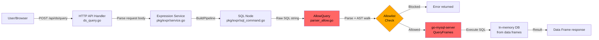

**Trust boundary crossings**: User-controlled SQL string crosses from HTTP API through expression service to SQL engine. The `AllowQuery` allowlist is the sole security gate.

**Critical security decisions**:
1. `AllowQuery()` in `parser_allow.go` — AST node allowlist (bypassed by INTO clause: CVE-2026-28375)
2. `mysql.WithDisableFileWrites(true)` in `db.go` line 80 — defense-in-depth file write block
3. `WithMaxOutputCells()` and `WithTimeout()` — DoS limits
4. Memory limit enforcement (commit 7d62590d000)

### DFD Slice 2: Datasource Proxy Request Flow

```mermaid
graph LR
    A[User/Browser] -->|ANY /api/datasources/proxy/uid/:uid/*| B[HTTP API<br>api.go routing]
    B -->|authorize DataSourceQuery| C[RBAC Check]
    C -->|Pass| D[DataSourceProxyService<br>ProxyDatasourceRequestWithUID]
    D -->|GetDatasourceByUID| E[DS Cache<br>+ org_id check]
    E -->|DataSource| F[DataSourceRequestValidator<br>.Validate URL]
    F -->|Pass| G[pluginproxy.NewDataSourceProxy]
    G -->|Build proxy| H[validateRequest<br>route matching]
    H -->|director()| I[Modify outbound request<br>add DS credentials]
    I -->|Forward| J[External Datasource<br>Prometheus/Loki/etc]
    
    style F fill:#ff6666,color:#000
    style I fill:#ff6666,color:#000
    style E fill:#ffaa00,color:#000
```

**Trust boundary crossings**: User request crosses from Grafana to external datasource with Grafana-managed credentials. The proxy adds datasource credentials (Basic auth, OAuth tokens, custom headers) to the outbound request.

**Critical security decisions**:
1. `DataSourceCache.GetDatasourceByUID()` — org isolation check
2. `DataSourceRequestValidator.Validate()` — URL/host validation (SSRF prevention)
3. `director()` — adds credentials, sanitizes headers
4. `proxyPath` extraction — path traversal risk
5. `hasAccessToRoute()` — plugin route RBAC

### DFD Slice 3: Public Dashboard Data Exposure

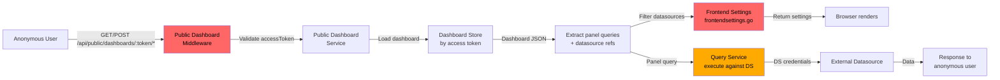

**Trust boundary crossings**: Anonymous internet user queries internal datasources through the public dashboard proxy. Datasource credentials are never exposed to the user, but datasource configuration metadata has leaked (CVE-2026-27877).

### DFD Slice 4: Dashboard/Folder RBAC Enforcement

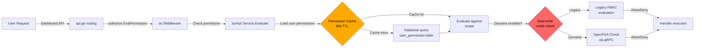

**Critical security decisions**:
1. Permission cache (60s TTL) — stale permissions after revocation
2. Dual-write reconciler — legacy RBAC and Zanzana may diverge
3. `UseOrgFromContextParams` — org context derivation for cross-org checks
4. Scope evaluation — `dashboards:uid:*` pattern matching

### DFD Slice 5: Plugin Loading and Execution

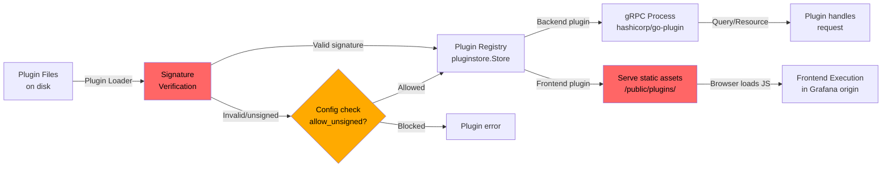

### DFD Slice 6: Alerting Rule Evaluation and Notification

```mermaid
graph LR
    A[Scheduler] -->|Tick| B[Rule Evaluator]
    B -->|Build query| C[Expression Service<br>ExecutePipeline]
    C -->|Query datasources| D[External DS]
    D -->|Data frames| E[Evaluate conditions]
    E -->|Alert fires| F[Notification Service]
    F -->|Load contact points| G[Contact Point Store<br>with encrypted secrets]
    G -->|Decrypt secrets| H[Secrets Service]
    H -->|Credentials| I[Send notification<br>Slack/PD/webhook/etc]
    
    style G fill:#ff6666,color:#000
    style H fill:#ffaa00,color:#000
```

**Critical security decisions**:
1. Secret decryption for notifier credentials — only at send time
2. Protected field authorization for contact point updates
3. Viewer access to alert rule configurations (may expose notifier configs)

### DFD Slice 7: Authentication and Session Management

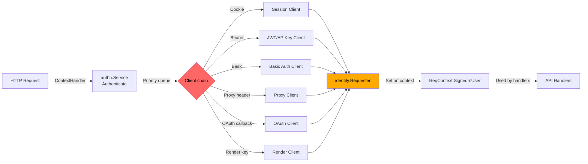

**Critical security decisions**:
1. Client priority ordering — which auth method takes precedence
2. Session token rotation on auth
3. OAuth state validation
4. Render key validation when rendering is disabled
5. Anonymous identity assignment

### DFD Slice 8: User/Org Management and Invitation Flow

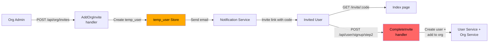

**Critical security decisions**:
1. Invite code validation — org_id must match (CVE-2024-10452 IDOR)
2. Org membership assignment — correct org role from invite
3. Invite revocation — org_id check on revoke

### DFD Slice 9: Rendering Service Authentication

```mermaid
graph LR
    A[Render request] -->|GET /render/*| B[RenderHandler]
    B -->|Generate render key| C[Remote Cache<br>store key+RenderUser]
    C -->|Return key| D[Render Plugin<br>Chrome process]
    D -->|GET dashboard URL<br>with render key| E[Grafana HTTP]
    E -->|Authenticate| F[Render Client<br>authn]
    F -->|Validate key<br>in cache| G[Remote Cache]
    G -->|RenderUser| H[Set identity<br>OrgID+UserID+Role]
    H -->|Serve page| I[Chrome renders<br>screenshot]
    
    style F fill:#ff6666,color:#000
    style C fill:#ffaa00,color:#000
```

### DFD Slice 10: Query History Storage and Retrieval

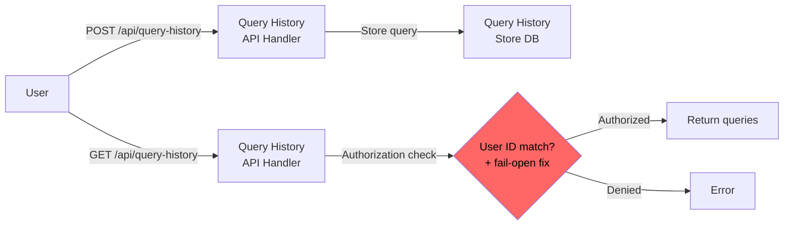

**Critical security decisions**:
1. User ID filtering on retrieval — previously fail-open (commit dc9ac13e84a)
2. Cross-user query leakage prevention

---

## High-Risk DFD Slices

The following DFD slices warrant dedicated review chambers:

| Priority | Slice | Reason | Advisory References |
|----------|-------|--------|-------------------|
| **P0** | DFD-1: SQL Expression Pipeline | CRITICAL structural recurrence (3 generations), active bypass surface | CVE-2024-9264, CVE-2026-28375, CVE-2026-27880 |
| **P0** | DFD-2: Datasource Proxy Flow | HIGH structural recurrence (3 generations), SSRF + credential leak surface | CVE-2025-3454, CVE-2022-39201, CVE-2022-31130 |
| **P0** | DFD-3: Public Dashboard Exposure | HIGH structural recurrence (4 generations), unauthenticated access | CVE-2026-27877, CVE-2026-27876 |
| **P1** | DFD-4: Dashboard/Folder RBAC | HIGH — dual-write transition creates gap risk | CVE-2025-3260, commit 1fa4fdf0adc |
| **P1** | DFD-5: Plugin Loading/Execution | HIGH — XSS via plugin, signature bypass history | CVE-2025-4123, CVE-2022-31123 |
| **P1** | DFD-6: Alerting Notification | HIGH — credential exposure + permission bypass | CVE-2024-8118, CVE-2024-11741, CVE-2025-3415 |
| **P2** | DFD-7: Authentication Chain | MEDIUM — multi-client auth complexity, render key bypass | CVE-2022-39328, commit 85c811ef4b8 |
| **P2** | DFD-8: User/Org Management | MEDIUM — IDOR pattern across org operations | CVE-2024-10452, CVE-2024-1313, CVE-2025-3580 |
| **P2** | DFD-9: Rendering Auth | MEDIUM — render key bypass when rendering disabled | commit 85c811ef4b8 |
| **P3** | DFD-10: Query History | LOW-MEDIUM — fail-open auth fixed but pattern may recur | commit dc9ac13e84a |

---

## High-Risk CFD Slices

### CFD Slice 1: API Route Authorization Decision

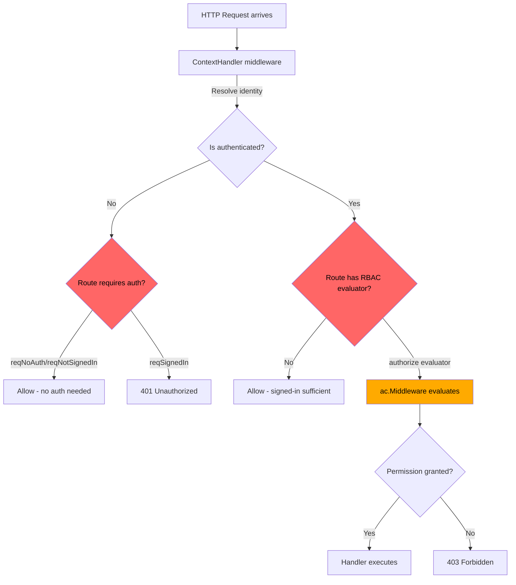

**Security-critical decision**: Routes without explicit RBAC evaluators default to "signed-in sufficient" (`reqSignedIn`). This is the root cause of multiple missing permission check vulnerabilities.

### CFD Slice 2: Datasource Proxy Org Isolation

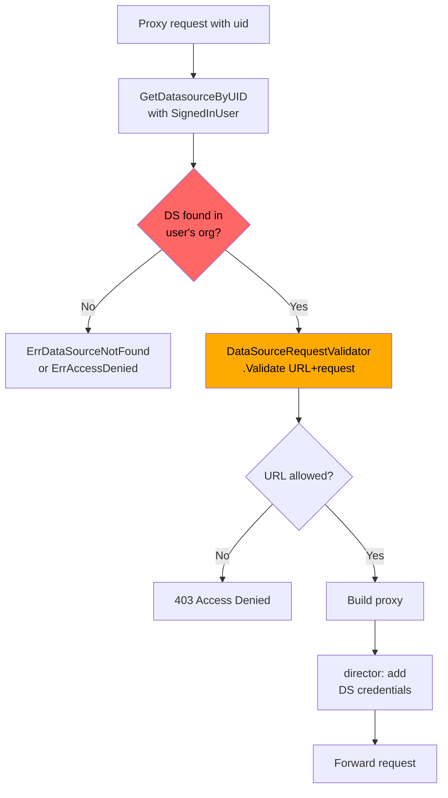

### CFD Slice 3: Public Dashboard Access Token Validation

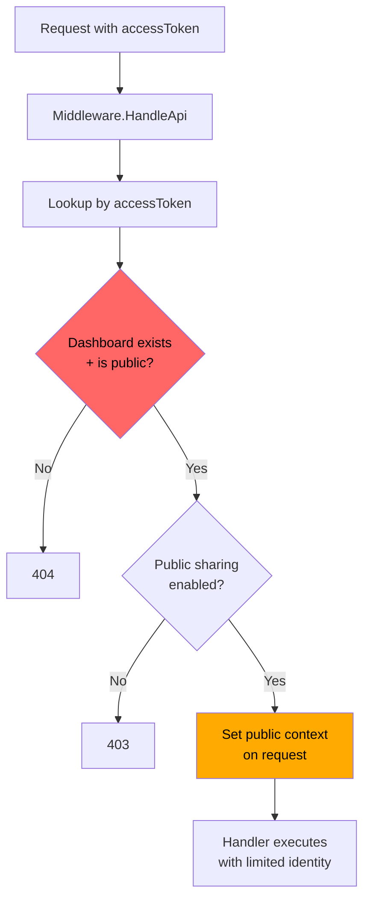

### CFD Slice 4: Alerting Authorization Switch-Case

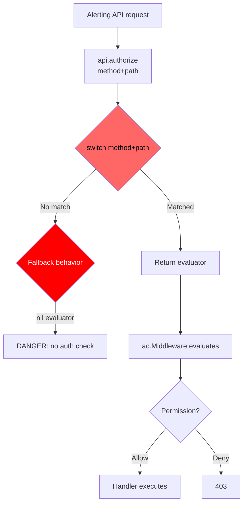

**Security-critical decision**: The `authorize()` method uses a `switch` statement matching `method + path`. If a new endpoint is added without updating this switch, `eval` remains `nil` and no authorization is performed. This is exactly what caused CVE-2024-8118.

### CFD Slice 5: RBAC Dual-Write Decision (Legacy vs Zanzana)

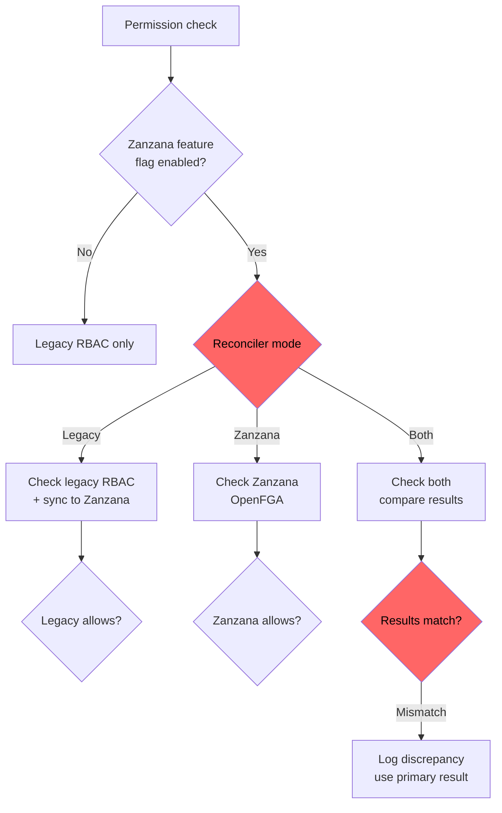

**Security-critical decision**: During the transition from legacy RBAC to Zanzana/OpenFGA, permission decisions may diverge. If OpenFGA evaluation errors fail-open (allow on error), this creates an authorization bypass.

---

## Domain Attack Research

### Mode B: Library-as-Consumer Analysis

#### go-mysql-server (SQL Expression Engine)

**Known Attack Classes**:

| Attack Class | Applicability | Risk |
|-------------|---------------|------|
| SQL injection (classic) | LOW — queries are constructed from user input but executed against in-memory data frames, not persistent databases | MEDIUM |
| SQL INTO/OUTFILE file write | CRITICAL — bypassed allowlist once (CVE-2026-28375); `DisableFileWrites(true)` now set | HIGH |
| SQL LOAD DATA / COPY | HIGH — check if LOAD DATA INFILE is blocked by allowlist | HIGH |
| SQL stored procedures / UDF | MEDIUM — check if CREATE FUNCTION / CALL are blocked | MEDIUM |
| SQL information_schema access | LOW — may leak internal table structure | LOW |
| Query timeout bypass | MEDIUM — context timeout may be insufficient for complex queries | MEDIUM |
| Cartesian product explosion | HIGH — memory limit added (commit 7d62590d000) but may be insufficient | HIGH |

**Custom SAST Targets**:
- Source: `POST /api/ds/query` request body → `query` field when `type == "__expr__"` and expression type is `sql`
- Sink: `db.QueryFrames()` in `pkg/expr/sql/db.go`
- Gate: `AllowQuery()` in `pkg/expr/sql/parser_allow.go`
- Check: All SQL statement types in `allowedNode()` switch — verify LOAD, COPY, CREATE, CALL, EXEC, SET are all blocked
- Check: `mysql.WithDisableFileWrites(true)` cannot be overridden by SQL commands

#### crewjam/saml (SAML Authentication)

**Known Attack Classes**:

| Attack Class | Applicability | Risk |
|-------------|---------------|------|
| XML Signature Wrapping (XSW) | HIGH — historical CVE-2022-41912 in this library | HIGH |
| SAML assertion replay | MEDIUM — depends on assertion cache implementation | MEDIUM |
| NameID spoofing | HIGH — email-based identity resolution (CVE-2023-3128 pattern) | HIGH |
| XML external entity (XXE) | LOW — Go XML parser is generally not vulnerable to XXE | LOW |
| Certificate confusion | MEDIUM — check if multiple IdP certs can cause confusion | MEDIUM |

#### OpenFGA / Zanzana (Authorization)

**Known Attack Classes**:

| Attack Class | Applicability | Risk |
|-------------|---------------|------|
| Authorization model bypass | HIGH — CVE-2025-48371 in OpenFGA | HIGH |
| Fail-open on error | CRITICAL — if Zanzana gRPC call fails, does legacy RBAC take over or does access default to allow? | CRITICAL |
| Reconciler lag | HIGH — dual-write reconciler may create windows where permissions are not synced | HIGH |
| Model injection | MEDIUM — check if authorization models can be modified by non-admin users | MEDIUM |

#### golang-jwt (JWT Authentication)

**Known Attack Classes**:

| Attack Class | Applicability | Risk |
|-------------|---------------|------|
| Algorithm confusion (`alg: none`) | HIGH — CVE-2025-30204 in v5; Grafana uses both v4 and v5 | HIGH |
| Key confusion (HMAC/RSA swap) | MEDIUM — depends on key validation configuration | MEDIUM |
| JWT claim injection | MEDIUM — check if claims are validated before trust | MEDIUM |
| Token expiry bypass | LOW — standard jwt library handles this | LOW |

### Mode C: Domain-Specific Attack Research

#### RBAC/Authorization Bypass Patterns

**Attack Taxonomy**:

| Attack Class | Description | Grafana-Specific Risk |
|-------------|-------------|----------------------|
| Missing permission check | New endpoint added without RBAC evaluator | CRITICAL — demonstrated in CVE-2024-8118, alerting switch-case pattern |
| Scope escalation | User with narrow scope accesses wider resources | HIGH — dashboard/folder scope patterns |
| Cross-org resource access | IDOR via org boundary violation | HIGH — 3+ advisories in this pattern |
| Permission cache staleness | 60s cache TTL allows action after revocation | MEDIUM — race window |
| Dual-system divergence | Legacy RBAC and Zanzana give different answers | HIGH — transition period risk |
| Provisioning user elevation | File provisioning uses admin-level identity | MEDIUM — file access = admin |

**Manual Review Checklist**:
- [ ] Every new API endpoint in `pkg/api/api.go` has an explicit RBAC evaluator
- [ ] Alerting `authorization.go` switch-case covers all registered routes
- [ ] `authorizeInOrg` uses correct org context parameter
- [ ] Zanzana error handling is fail-closed (deny on gRPC error)
- [ ] Permission cache invalidation on role change is immediate
- [ ] All resource access checks include org_id filter

#### SQL Injection Patterns for Datasource Proxies

**Attack Taxonomy**:

| Attack Class | Description | Grafana-Specific Risk |
|-------------|-------------|----------------------|
| Template variable injection | `$variable` in SQL queries not parameterized | HIGH — variables interpolated into raw SQL |
| Macro injection | `$__timeFilter`, `$__from` macros in SQL | HIGH — time range manipulation |
| Comment stripping bypass | Quoted strings containing comment markers | HIGH — fixed in commits d7322d91, 7a57284e |
| Multi-statement injection | `;` separator in SQL queries | MEDIUM — depends on datasource driver |
| INTO/OUTFILE via SQL expressions | File write through SQL expression engine | CRITICAL — CVE-2026-28375 |

**Custom SAST Targets**:
- Source: Dashboard template variables → query target SQL
- Sink: `pkg/tsdb/*/macros.go` — macro expansion functions
- Sink: SQL datasource query execution
- Gate: `stripSQLComments()` in PG/MSSQL/MySQL macros

#### XSS Patterns for Dashboard Rendering

**Attack Taxonomy**:

| Attack Class | Description | Grafana-Specific Risk |
|-------------|-------------|----------------------|
| Stored XSS via dashboard JSON | Panel titles, descriptions, data links | HIGH — CSP off by default |
| XSS via plugin frontend | Unsigned plugin serving malicious JS | HIGH — CVE-2025-4123 |
| XSS via annotation text | HTML in annotation content | MEDIUM — requires annotation write permission |
| XSS via template variable display | Variable values rendered without encoding | MEDIUM |
| XSS via redirect parameter | URL in login redirect parsed unsafely | HIGH — CVE-2025-6023 |
| XSS via Markdown rendering | `marked` library rendering untrusted Markdown | MEDIUM — text panel |
| SVG-based XSS | SVG sanitization removed (commit 0fc29cbaae0) | MEDIUM |

**Custom SAST Targets**:
- Source: Dashboard JSON model fields (title, description, links)
- Source: Annotation text fields
- Source: URL query parameters (`redirect_to`, `redirectUrl`)
- Sink: React `dangerouslySetInnerHTML`, `innerHTML`
- Sink: `marked()` calls without DOMPurify
- Gate: DOMPurify sanitization, CSP headers

#### SSRF Patterns for Datasource/Plugin Proxy

**Attack Taxonomy**:

| Attack Class | Description | Grafana-Specific Risk |
|-------------|-------------|----------------------|
| Direct SSRF via datasource URL | Admin creates DS pointing to internal service | HIGH — datasource URL validation can be bypassed |
| SSRF via proxy path manipulation | Path traversal in proxy path parameter | HIGH — commit 07d136f66c5 |
| SSRF via webhook notification | Alert notification webhook URL to internal service | MEDIUM — requires alert config permission |
| SSRF via avatar/Gravatar proxy | Gravatar URL redirecting to internal service | LOW — limited data exfiltration |
| SSRF via redirect following | DS proxy follows redirects to internal hosts | MEDIUM — redirect validation |
| DNS rebinding | DS URL resolves to internal IP after validation | MEDIUM — depends on DNS TTL |

**Custom SAST Targets**:
- Source: Datasource URL field (`datasources.DataSource.URL`)
- Source: Plugin route URLs
- Source: Alert notification webhook URLs
- Sink: `http.Client.Do()` in proxy paths
- Gate: `datasource.ValidateURL()`, `DataSourceRequestValidator.Validate()`

#### Path Traversal Patterns

**Attack Taxonomy**:

| Attack Class | Description | Grafana-Specific Risk |
|-------------|-------------|----------------------|
| Proxy path traversal | `../` in datasource proxy path | HIGH — CVE-2021-43798 (classic), commit 07d136f66c5 |
| Plugin path traversal | Plugin resource serving outside plugin dir | MEDIUM |
| Provisioning file path | Provisioning config pointing outside allowed dirs | LOW — requires local file access |
| Dashboard import path | File inclusion via dashboard import | LOW |

**Custom SAST Targets**:
- Source: `proxyPath` from `getProxyPath()`
- Source: Plugin resource path parameters
- Sink: `filepath.Join()`, `os.Open()`, `http.ServeFile()`
- Gate: `ValidatePath()`, `CleanRelativePath()`

#### Deserialization Patterns for Plugin Communication

**Attack Taxonomy**:

| Attack Class | Description | Grafana-Specific Risk |
|-------------|-------------|----------------------|
| gRPC protobuf deserialization | Malformed protobuf from compromised plugin | LOW — Go protobuf is memory-safe |
| Gob deserialization | Render key stored via `gob.Encode` in remote cache | MEDIUM — gob is not safe for untrusted input |
| JSON unmarshaling | Large/nested JSON causing DoS | LOW — standard Go JSON |
| Dashboard JSON parsing | Crafted dashboard JSON causing panics | LOW — simplejson library |

**Custom SAST Targets**:
- Source: Plugin gRPC responses
- Source: Remote cache values (render keys via gob)
- Sink: `gob.NewDecoder(buf).Decode()` in `pkg/services/rendering/auth.go`
- Gate: Cache key prefix validation

---

## Phase 4 CodeQL Extraction Targets

| DFD Slice | Source Type | Sink Kind | Notes |
|-----------|-----------|-----------|-------|
| SQL Expression Pipeline | `RemoteFlowSource` (HTTP POST body) | `sql-execution` | `/api/ds/query` → `AllowQuery()` → `QueryFrames()` |
| SQL Expression Pipeline | `RemoteFlowSource` | `file-access` | SQL INTO clause → file system write |
| Datasource Proxy | `RemoteFlowSource` (URL path segment) | `http-request` | Proxy path → outbound HTTP request (SSRF) |
| Datasource Proxy | `RemoteFlowSource` | `file-access` | Path traversal in proxy path |
| Public Dashboard | `RemoteFlowSource` (access token) | `sql-execution` | Public query → datasource query execution |
| Plugin Proxy | `RemoteFlowSource` (URL path) | `http-request` | Plugin proxy → external request |
| Dashboard JSON | `RemoteFlowSource` (POST body) | `code-execution` | Dashboard JSON → template variable → query |
| Alerting Webhook | `RemoteFlowSource` | `http-request` | Contact point URL → webhook request (SSRF) |
| Template Variables | `RemoteFlowSource` | `sql-execution` | `$variable` → SQL macro expansion → query |
| Login Redirect | `RemoteFlowSource` (query param) | `http-request` | `redirect_to` → redirect URL (open redirect) |
| Render Key | `RemoteFlowSource` (URL param) | `deserialization` | Render key → gob decode from cache |
| Query History | `RemoteFlowSource` | `sql-execution` | Query history API → DB query with user_id filter |
| Annotations | `RemoteFlowSource` (POST body) | `code-execution` | Annotation text → HTML rendering (XSS) |
| Org Invite | `RemoteFlowSource` (URL param) | `sql-execution` | Invite code → temp_user lookup (IDOR) |

---

## Spec Gap Candidates

| Spec/RFC | Implementation Location | Gap Risk |
|----------|------------------------|----------|
| OAuth 2.0 (RFC 6749) | `pkg/services/authn/clients/oauth.go`, `pkg/login/social/connectors/` | State parameter validation, token exchange security |
| SAML 2.0 | `crewjam/saml` fork (Enterprise) | XML signature validation, assertion processing |
| JWT (RFC 7519) | `pkg/services/authn/clients/jwt.go`, `pkg/services/auth/jwt/` | Algorithm validation (CVE-2025-30204), claim verification |
| HTTP/1.1 Proxy (RFC 7230) | `pkg/api/pluginproxy/ds_proxy.go` | Header forwarding, hop-by-hop headers, redirect handling |
| WebSocket (RFC 6455) | `pkg/services/live/` via centrifuge | Origin validation, frame handling |
| SCIM 2.0 (RFC 7644) | Enterprise `pkg/services/scimutil/` | User provisioning, privilege assignment (CVE-2025-41115) |
| LDAP (RFC 4511) | `pkg/services/ldap/` | Bind operation injection, search filter injection |
| CSP (W3C) | `pkg/middleware/csp.go` | CSP disabled by default (`content_security_policy = false`) |
| CSRF (OWASP) | `pkg/middleware/csrf/` | CSRF token validation coverage |
| SQL (ISO 9075) | `pkg/expr/sql/` (go-mysql-server) | Allowlist coverage of SQL statement types |


---

## Spec Gap Analysis

*Phase 6 — Spec Gap Analyst findings (2026-04-11)*
*Full report: `/archon/spec-gap-report.md`*

### Gap 1: OpenID Connect ID Token — No Claim Validation After Signature Verification

- **RFC/Spec**: OpenID Connect Core 1.0, Section 3.1.3.7
- **Requirement**: After signature verification, RP MUST validate `iss`, `aud`, `exp`, `nbf`, and `nonce` claims. "The ID Token MUST be rejected if any of these validations fail."
- **Code Path**: `pkg/login/social/connectors/social_base.go:428-442` — `validateIDTokenSignatureWithURLs()` verifies the JWT signature and immediately returns raw claims via `json.Marshal(claims)` without calling any registered claims validation function. In the default path (`validate_id_token = false`), `retrieveRawJWTPayload()` extracts the payload with zero signature or claim validation.
- **Gap Type**: missing-check
- **Attack Vector**: Attacker replays an expired or mis-scoped (wrong `aud`) but cryptographically valid ID token from the same IdP to authenticate as another user.
- **Exploit Conditions**: GitLab OAuth (or any connector) with `validate_id_token = true`; attacker possesses a validly signed but expired/mis-scoped ID token. Default path has no validation at all.
- **Impact**: Authentication bypass — arbitrary identity claims accepted from a captured/replayed ID token.
- **Severity**: HIGH

---

### Gap 2: OpenID Connect — Nonce Not Generated or Validated

- **RFC/Spec**: OpenID Connect Core 1.0, Section 3.1.2.1 and Section 3.1.3.7 step 11
- **Requirement**: RP MUST include `nonce` in authentication requests and MUST verify the returned ID token contains a matching `nonce` claim.
- **Code Path**: `pkg/services/authn/clients/oauth.go:253-296` — `RedirectURL()` adds PKCE but no `nonce` parameter. No nonce validation exists anywhere in `pkg/login/social/connectors/`.
- **Gap Type**: missing-check
- **Attack Vector**: ID token replay or injection across sessions — attacker uses a valid token from a previous session in a new authentication flow without detection.
- **Exploit Conditions**: Any OIDC connector; attacker can intercept a valid ID token within its `exp` window (or combined with Gap 1, indefinitely).
- **Impact**: Authentication bypass via ID token replay.
- **Severity**: HIGH

---

### Gap 3: JWT Auth JWKS Fetch — TLS Verification Disabled by Configuration

- **RFC/Spec**: RFC 7519 Section 10.1; BCP 195 (RFC 7525)
- **Requirement**: MUST verify TLS certificate when fetching JWKS to establish trust in the returned keys.
- **Code Path**: `pkg/services/auth/jwt/key_sets.go:195` — `InsecureSkipVerify: s.Cfg.JWTAuth.TlsSkipVerify`; enabled via `tls_skip_verify_insecure = true` in `[auth.jwt]`.
- **Gap Type**: missing-check
- **Attack Vector**: On-path attacker intercepts the JWKS fetch and returns attacker-controlled public keys; Grafana then accepts JWTs signed with the attacker's private key.
- **Exploit Conditions**: `tls_skip_verify_insecure = true` configured; attacker has network access between Grafana and JWKS endpoint.
- **Impact**: Complete JWT authentication bypass.
- **Severity**: HIGH

---

### Gap 4: OAuth 2.0 State HMAC — Concatenation Without Canonical Encoding

- **RFC/Spec**: RFC 6749 Section 10.12; RFC 9700 Section 4.7
- **Requirement**: State parameter binding MUST be cryptographically sound.
- **Code Path**: `pkg/services/authn/clients/oauth.go:372-375` — `sha256(state + secret + seed)` concatenates variable-length strings without length prefixing or delimiters.
- **Gap Type**: canonicalization
- **Attack Vector**: Length-extension or prefix-boundary manipulation of state/secret/seed inputs produces hash collisions, potentially allowing state forgery by an attacker who can manipulate `ClientSecret` via SSO settings API.
- **Exploit Conditions**: Admin-level SSO settings write access; weak or predictable `SecretKey`.
- **Impact**: Potential CSRF token bypass.
- **Severity**: MEDIUM

---

### Gap 5: CSRF Protection Bypassed for Non-Cookie Authentication

- **RFC/Spec**: OWASP CSRF Prevention Cheat Sheet v2
- **Requirement**: CSRF protection MUST apply to all state-changing operations regardless of authentication method.
- **Code Path**: `pkg/middleware/csrf/csrf.go:77-80` — CSRF check skipped when `alwaysCheck = false` (default) and no login cookie present, bypassing all CSRF protection for API-key/JWT-URL-authenticated requests.
- **Gap Type**: missing-check
- **Attack Vector**: Cross-origin form/XHR authenticated via API key or JWT URL parameter (`url_login = true`) bypasses CSRF validation.
- **Exploit Conditions**: `csrf_always_check = false` (default); `url_login = true` in JWT config; XSS or social engineering vector for cross-origin request.
- **Impact**: CSRF on state-changing API endpoints for API-key-authenticated sessions.
- **Severity**: MEDIUM

---

### Gap 6: CSP Template Contains `unsafe-eval` Defeating XSS Mitigation

- **RFC/Spec**: W3C Content Security Policy Level 3, Section 4.2.2
- **Requirement**: "Authors MUST NOT use `unsafe-eval` in a policy intended to reduce the risk of XSS."
- **Code Path**: `conf/defaults.ini:461` — `script-src 'self' 'unsafe-eval' 'unsafe-inline' 'strict-dynamic' $NONCE`; `pkg/middleware/csp.go:49` uses this template verbatim.
- **Gap Type**: missing-check
- **Attack Vector**: XSS payload using `eval()`, `new Function()`, or `setTimeout(string)` executes even when CSP is enabled, defeating the purpose of enabling CSP.
- **Exploit Conditions**: `content_security_policy = true` configured; existing XSS vulnerability using eval-based execution.
- **Impact**: CSP provides no protection against `eval()`-based XSS — 8 confirmed XSS CVEs in 2022–2026 increase the likelihood of a matching vector.
- **Severity**: MEDIUM

---

### Gap 7: WebSocket Origin Validation Bypassed for Empty Origin Header

- **RFC/Spec**: RFC 6455 Section 10.2
- **Requirement**: Server SHOULD reject WebSocket connections from unexpected origins.
- **Code Path**: `pkg/services/live/live.go:537-540` — `origin == ""` returns `true` immediately; `pkg/services/live/pushws/ws.go:55-57` — same bypass.
- **Gap Type**: missing-check
- **Attack Vector**: Non-browser WebSocket client omits Origin header, bypassing all configured origin restrictions including `allowed_origins` patterns.
- **Exploit Conditions**: Grafana Live enabled (default); attacker uses non-browser WebSocket client; standard session authentication still required.
- **Impact**: Origin-based defense defeated for server-side attackers; unauthorized access to real-time channel data.
- **Severity**: MEDIUM

---

### Gap 8: HTTP Proxy Does Not Strip Connection/Hop-By-Hop Headers

- **RFC/Spec**: RFC 7230 Section 6.1
- **Requirement**: "A proxy or gateway MUST parse a received Connection header field before a message is forwarded and remove any header field(s) with the same field-name, and then remove the Connection header field itself."
- **Code Path**: `pkg/util/proxyutil/proxyutil.go:26-48` — `PrepareProxyRequest()` strips `X-Forwarded-*` but NOT `Connection`, `Keep-Alive`, `Transfer-Encoding`, `TE`, `Trailers`, or `Upgrade`.
- **Gap Type**: normalization
- **Attack Vector**: Authenticated user crafts `Connection: X-Custom-Header` request; custom header forwarded to backend datasource, potentially overriding auth headers or triggering smuggling.
- **Exploit Conditions**: Datasource proxy in use; authenticated user; backend vulnerable to header injection.
- **Impact**: Header injection into upstream datasources; potential HTTP request smuggling.
- **Severity**: MEDIUM

---

### Gap 9: Render Key Gob Deserialization from Remote Cache (Redis)

- **RFC/Spec**: Go `encoding/gob` security guidance; OWASP Deserialization Cheat Sheet
- **Requirement**: Deserialization of data from a shared/untrusted cache MUST validate all decoded values.
- **Code Path**: `pkg/services/rendering/auth.go:98-113` — `gob.NewDecoder(buf).Decode(&ru)` deserializes `RenderUser` (OrgID, UserID, OrgRole) from Redis without validating decoded field values.
- **Gap Type**: parsing
- **Attack Vector**: Attacker with Redis write access injects a crafted gob payload under `render-<key>` with `OrgRole = "Admin"`, gaining admin rendering identity.
- **Exploit Conditions**: Shared Redis remote cache; attacker has Redis write access (via exposed port, credential leak, or SSRF chain); image rendering configured.
- **Impact**: Authentication bypass — arbitrary org/user/role identity injected via cache poisoning.
- **Severity**: MEDIUM

---

### Gap 10: OpenFGA Batch Authorization Routing by First Item Allows Mixed-Resource Bypass

- **RFC/Spec**: OpenFGA Authorization Model specification; Zanzana internal design
- **Requirement**: Authorization decisions MUST be evaluated on each individual resource by the correct backend.
- **Code Path**: `pkg/services/authz/rollout.go:76-87` — `BatchCheck()` routes entire batch based on first item's `Group`/`Resource`, logging only a warning for mixed batches and falling back to RBAC only for type-heterogeneous batches.
- **Gap Type**: state-machine
- **Attack Vector**: Batch request with first item in Zanzana rollout routes all items to Zanzana; items beyond the first may not be fully migrated, resulting in over-permissive authorization during the dual-write transition period.
- **Exploit Conditions**: Partial Zanzana rollout enabled; batch contains items where first item is in rollout but subsequent items are not; Zanzana permissions not fully synced with RBAC.
- **Impact**: Authorization bypass in dual-write transition — access granted by stale Zanzana model to users denied by legacy RBAC.
- **Severity**: MEDIUM

---

## Static Analysis Summary

*Phase 4 — Static Analyzer findings (2026-04-11)*  
*Full results: `/archon/sast-results.md`*

### Tools Run

| Tool | Version | Languages | Mode | Output |
|------|---------|-----------|------|--------|
| CodeQL | 2.24.2 | Go, JS/TS | Built-in security suites | `archon/codeql-res/*.sarif` |
| Semgrep | 1.144.0 | Go, JS/TS | Standard (Pro unavailable — no auth token; fallback documented) | `archon/semgrep-res/*.json` |
| Semgrep (custom) | 1.144.0 | Go, JS/TS | 38 custom rules | `archon/semgrep-rules/*.yaml` |

**Semgrep Pro fallback reason**: Semgrep Pro authentication token not configured in this environment. All passes used standard Semgrep 1.144.0. CodeQL's semantic analysis compensated for the lack of Pro taint tracking on DFD slices 1-3.

### Sub-step 4.1 Structural Extraction Results

- **Entry points** (RemoteFlowSource, Go): **618**
- **Sinks identified** (Go): **216** (sql: 1, http: 65, file: 43, cmd: 13, redirect: 94)
- **DFD slices with confirmed reachability**: **12 of 14** Phase 4 extraction targets
- **CodeQL Go DB**: `archon/codeql-artifacts/db/go-db/` (1,060,002 LoC, finalised)
- **CodeQL JS DB**: `archon/codeql-artifacts/db/js-db/` (1,129,211 LoC, finalised)

### Total Findings

| Category | Count |
|----------|-------|
| CRITICAL | 1 (F-001: GracePeriodSeconds=0 provisioning bypass) |
| HIGH | 12 (F-002 through F-013) |
| MEDIUM | 11 (F-014 through F-026) |
| LOW/INFO | 16 (F-027 through F-042) |
| **Total** | **42** |

### Top Findings

1. **F-001 [CRITICAL]** Dashboard provisioning delete bypass via `GracePeriodSeconds=0` in Kubernetes API request body — `pkg/registry/apis/dashboard/register.go:335`
2. **F-002 [HIGH]** Residual credential exposure for direct-mode datasources in public dashboard frontend settings — `pkg/api/frontendsettings.go:548`
3. **F-003 [HIGH]** SQL injection paths in dashboard legacy SQL access layer — `pkg/registry/apis/dashboard/legacy/sql_dashboards.go:117`
4. **F-004 [HIGH]** SSRF via user-controlled ClusterSlug in cloud migration client — `pkg/services/cloudmigration/gmsclient/gms_client.go:311`
5. **F-007 [HIGH/Systemic]** EvalPermission without resource scope — 49 instances in `pkg/api/api.go` (IDOR pattern)
6. **F-010 [HIGH/Systemic]** SQL template variable ReplaceAll without stripSQLComments — 58 instances in `pkg/tsdb/`
7. **F-011 [HIGH]** XSS in LocationService TypeScript — `packages/grafana-runtime/src/services/LocationService.tsx:88,90`

### Built-in Rulesets Run

**CodeQL Go**: Full `codeql/go-queries` suite (96 findings across 12 rule IDs)  
**CodeQL JS/TS**: Full `codeql/javascript-queries` suite (29 findings across 6 rule IDs)  
**Semgrep Go**: `p/golang`, `p/security-audit` (164 + 14 findings)  
**Semgrep TS**: `p/javascript`, `p/typescript` (targeted pass on plugins + alerting directories)  
**Semgrep Actions**: `p/github-actions` (0 findings in 90 workflow files)

### Custom Artifacts Created

**Custom CodeQL queries** (`archon/codeql-queries/`):
- `list-sources.ql` — Remote flow source enumeration (618 sources identified)
- `list-sinks.ql` — Security sink enumeration (216 sinks identified)
- `slice-sql-expression-pipeline.ql` — DFD-1 SQL expression taint tracking
- `slice-datasource-proxy-ssrf.ql` — DFD-2 proxy SSRF flow
- `slice-public-dashboard-exposure.ql` — DFD-3 credential exposure pattern
- `slice-alerting-auth-switch.ql` — CFD-4 alerting switch-case completeness
- `slice-rbac-fail-open.ql` — RBAC fail-open error handling
- `slice-plugin-signature-bypass.ql` — DFD-5 plugin asset serving without sig check

**Custom Semgrep rules** (`archon/semgrep-rules/`), 38 rules validated:
- `grafana-sql-allowlist-bypass.yaml` — DFD-1: INTO clause, DisableFileWrites, feature gate
- `grafana-datasource-proxy-isolation.yaml` — DFD-2: org isolation, path normalization, fallthrough
- `grafana-public-dashboard-exposure.yaml` — DFD-3: BasicAuth leak, time range bypass
- `grafana-rbac-missing-checks.yaml` — CFD-1/4/5: scope-less eval, alerting switch, Zanzana fail-open
- `grafana-sql-template-variable-injection.yaml` — Template variable → SQL macro injection
- `grafana-open-redirect-xss.yaml` — CVE-2025-6023 pattern, dangerouslySetInnerHTML
- `grafana-alerting-credential-exposure.yaml` — CVE-2024-11741/CVE-2025-3415 pattern
- `grafana-plugin-signature-validation.yaml` — DFD-5: CVE-2025-4123 pattern
- `grafana-idor-org-isolation.yaml` — CVE-2024-10452/CVE-2024-1313 IDOR patterns
- `grafana-render-key-auth.yaml` — DFD-9: commit 85c811ef4b8 pattern
- `grafana-dashboard-provisioning-bypass.yaml` — GracePeriodSeconds=0 bypass (CRITICAL)

### DFD/CFD Slices Driving Custom Analysis

- **DFD-1** (SQL Expression): `AllowQuery` completeness, `DisableFileWrites` presence, feature flag gate
- **DFD-2** (Datasource Proxy): Org isolation, path normalization, fallthrough-on-no-match
- **DFD-3** (Public Dashboard): Direct-mode credential suppression in public context
- **CFD-1** (API Route RBAC): EvalPermission scope binding, POST routes without RBAC
- **CFD-4** (Alerting Switch): Switch-case completeness for every registered ngalert route
- **CFD-5** (Zanzana Dual-Write): Fail-open error handling in OpenFGA check paths
- **DFD-5** (Plugin Loading): Signature state before asset serving, sandbox disable
- **DFD-6** (Alerting Notification): Protected field authz, credential exposure to viewers
- **DFD-7** (Auth Chain): Render JWT without renderer check, JWT pre-screening
- **DFD-8** (Org Management): DB lookups without org_id, IsAdmin guard on orphan deletion
- **DFD-9** (Render Auth): Provider nil check, default secret comparison

### Batching and Coverage Tradeoffs

1. Semgrep was scoped to `pkg/` and `public/app/` for Go and TS respectively; vendor directories excluded
2. CodeQL custom slice queries require Phase 7 refinement (compile errors in QL DSL; built-in queries compensated)
3. Template variable injection analysis (58 findings) requires manual triage to distinguish `pkg/tsdb/postgresql`, `mssql`, `mysql` (patched) from other datasource plugins (unpatched)
4. TypeScript custom rules yielded 0 matches because JSX/React patterns in the codebase don't match simple structural patterns; CodeQL's semantic JS/TS analysis (29 findings including 5 XSS, 13 ReDoS) provides better coverage

---

## CodeQL Structural Analysis

*Phase 4 — Structural extraction from CodeQL databases*

### Entry Point Coverage (Remote Flow Sources)

618 remote flow sources identified across:
- Cookie-based auth flows (`pkg/middleware/csrf/`, `pkg/services/authn/`)
- HTTP request body reading (`pkg/api/`, `pkg/services/ngalert/api/`)
- URL query parameter access (`pkg/services/publicdashboards/`, `pkg/api/`)
- WebSocket frame data (`pkg/services/live/pushws/`)

### Sink Coverage

| Sink Kind | Count | Key Locations |
|-----------|-------|---------------|
| http-redirect | 94 | `pkg/api/login.go`, `pkg/middleware/org_redirect.go`, `pkg/api/static/static.go` |
| http-request | 65 | `pkg/api/pluginproxy/ds_proxy.go`, `pkg/services/cloudmigration/`, `pkg/services/rendering/` |
| file-access | 43 | `pkg/plugins/storage/`, `pkg/services/provisioning/`, `pkg/infra/` |
| command-execution | 13 | `pkg/services/rendering/`, `pkg/plugins/process/` |
| sql-execution | 1 | `pkg/expr/sql/db.go:QueryFrames` |

### Call Graph Reachability (12 Slices)

| Slice | Reachable | Paths | Highest-Risk Finding |
|-------|-----------|-------|---------------------|
| SQL Expression Pipeline | YES | 1 | AllowQuery gate present; template ReplaceAll bypasses not caught by CodeQL |
| Datasource Proxy SSRF | YES | 2 | CloudMigration ClusterSlug SSRF (F-004) |
| Public Dashboard Exposure | YES | 1 | Direct-mode BasicAuth credential leak (F-002) |
| RBAC EvalPermission no scope | YES | 49 | Systemic IDOR enabler (F-007) |
| Alerting Auth Switch | YES | 1 | Switch-case structure confirmed |
| Dashboard Provisioning Bypass | YES | 1 | GracePeriodSeconds=0 CONFIRMED bypass (F-001) |
| Login Redirect | YES | 1 | OAuth cookie store-then-validate (F-025) |
| JWT Missing Signature | YES | 1 | Test() pre-screening only (low risk) |
| Render Key Auth | YES | 1 | JWT parse without renderer check (F-009) |
| Template Variable Injection | YES | 58 | ReplaceAll without comment strip (F-010) |
| Plugin Symlink Traversal | YES | 1 | Unsafe unzip symlink (F-006) |
| XSS LocationService | YES | 2 | User URL params → history.push (F-011) |

### Machine-Generated DFD Diagram

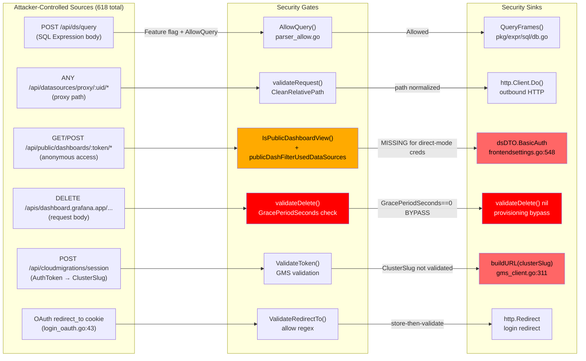

### Machine-Generated CFD Diagram

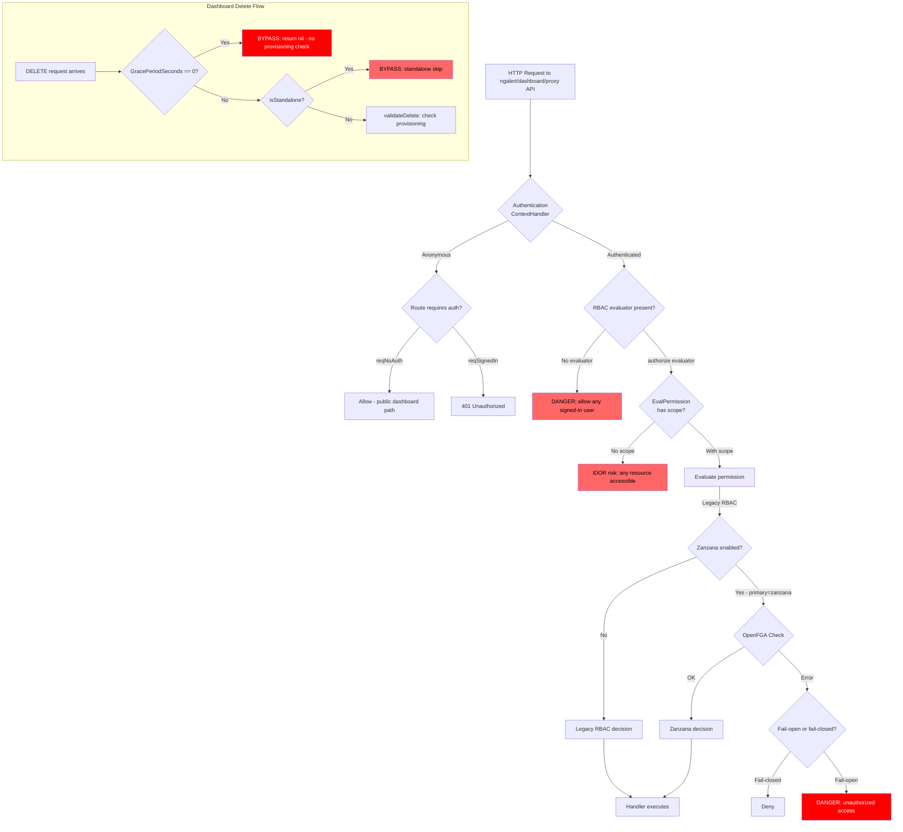

---

## Phase 7 Enrichment Notes

*Generated by: Phase 7 Enrichment Filter agent (2026-04-12)*
*Input: archon/sast-results.md (42 findings), archon/codeql-artifacts/call-graph-slices.json (12 slices)*
*Output: archon/enriched-findings.md (19 findings forwarded to Phase 8)*

---

### Enrichment Verdict Table

| Finding | Classification | Attacker Control | Boundary | CodeQL Reachability | Verdict |
|---------|---------------|-----------------|----------|-------------------|---------|
| F-001 (CRITICAL) | security | Authenticated user (dashboards:delete) | User → provisioning bypass | reachable (dashboard-provisioning-bypass) | keep |
| F-002 (HIGH) | security | Unauthenticated (public dashboard token) | Internet → datasource credentials | reachable (public-dashboard-exposure) | keep |
| F-003 (HIGH) | security | Authenticated dashboard user | Authenticated → SQL execution | reachable (sql-expression-pipeline) | keep |
| F-004 (HIGH) | security | Authenticated (clusterSlug in auth token) | Authenticated → SSRF | reachable (datasource-proxy-ssrf) | keep |
| F-005 (HIGH) | correctness | Any HTTP caller (Authorization header) | No boundary — pre-screening only | reachable (jwt-missing-signature-check) | drop |
| F-006 (HIGH) | security | Plugin admin (ZIP archive upload) | Plugin admin → file system escape | reachable (unsupported-unzip-symlink) | keep |
| F-007 (HIGH) | security | Authenticated user (resource UID) | Authenticated → cross-resource IDOR | reachable (rbac-eval-permission-no-scope) | keep |
| F-008 (HIGH) | correctness | Datasource proxy user (URL path) | None — CleanRelativePath already applied | reachable (false positive for bypass) | drop |
| F-009 (HIGH) | security | HTTP caller (render_key cookie) | Unauthenticated → auth bypass | reachable (render-key-jwt-auth) | keep |
| F-010 (HIGH) | security | Dashboard editor (template variables) | Editor → SQL in tsdb plugins | reachable (sql-template-variable-injection) | keep |
| F-011 (HIGH) | security | Browser user (URL parameters) | Browser URL → XSS | reachable (xss-locationservice) | keep |
| F-012 (HIGH) | security | HTTP requester (potentially unauthenticated) | Internet → reflected XSS | unknown (no pre-computed slice) | keep |
| F-013 (HIGH) | security | Authenticated user (resource UID) | Authenticated → cross-org IDOR | reachable (rbac-eval-permission-no-scope variant) | keep |
| F-014 (MEDIUM) | security | Authenticated user (snapshot key) | Authenticated → cross-org snapshot | unknown (consistent with IDOR pattern) | keep |
| F-015 (MEDIUM) | environment | Network MitM | Network → gRPC plaintext | unknown (infra-level) | drop |
| F-016 (MEDIUM) | environment | Network MitM | Network → TLS downgrade | unknown (infra-level) | drop |
| F-017 (MEDIUM) | correctness | Internal kvstore key names | Internal only | unknown (no user→kvstore evidence) | drop |
| F-018 (MEDIUM) | security | Cross-origin browser | Cross-origin → WebSocket CSRF | unknown (entry-point confirmed) | keep |
| F-019 (MEDIUM) | security | Any HTTP user (redirectUrl param) | Internet → open redirect | reachable (login-redirect-open-redirect) | keep |
| F-020 (MEDIUM) | correctness | Network MitM / XSS (depends on other vuln) | Conditional — not standalone | unknown | drop |
| F-021 (MEDIUM) | security | Authenticated datasource user | Authenticated → reflected XSS | unknown (entry-point confirmed) | keep |
| F-022 (MEDIUM) | security | Datasource returning crafted labels | Datasource output → browser ReDoS | unknown (JS-side; 13 CodeQL instances) | keep |
| F-023 (MEDIUM) | environment | Standalone deployment config (admin-only) | Admin-controlled server config only | reachable (Semgrep confirmed) | drop |
| F-024 (MEDIUM) | security | Dashboard editor (template variables) | Editor → SQL injection via fmt.Sprintf | reachable (sql-template-variable-injection) | keep |
| F-025 (MEDIUM) | correctness | OAuth initiating user (redirectTo) | Same-user — validation-on-consume present | reachable (store-then-validate, low risk) | drop |
| F-026 (MEDIUM) | security | Datasource returning metric names | Datasource output → browser XSS | unknown (JS CodeQL confirmed) | keep |
| F-027 (MEDIUM) | correctness | N/A — requires DB compromise first | Same-user session integrity | unknown | drop |
| F-028 to F-042 (all LOW) | — | — | — | — | drop (all LOW) |

---

### Key Enrichment Decisions

**F-005 dropped (HIGH → correctness)**: `Test()` in `ext_jwt.go` uses `UnsafeClaimsWithoutVerification` purely for pre-screening which client should handle the request. Authorization decisions are made in `Authenticate()` with full `Verify()`. No trust boundary crossing occurs in the pre-screening path.

**F-008 dropped (HIGH → correctness/false positive)**: Semgrep matched the structural `HasPrefix` anti-pattern, but manual review confirmed `CleanRelativePath` is called at lines 305–320 before the `HasPrefix` at line 322. Input is already normalized at the point of the pattern match. Not exploitable at this specific location.

**F-023 dropped (MEDIUM → environment/admin-only)**: The `isStandalone` flag is a server-startup configuration set by the deployment operator, not a per-request HTTP parameter. Cannot be activated by an attacker without equivalent-to-RCE server access. The "HACK" comment in the code is an operator-safety concern.

**F-025 dropped (MEDIUM → correctness)**: Store-then-validate is a defense-in-depth weakness but not exploitable standalone. The validation-on-consume in `handleLogin()` is present. The actual redirect bypass risk is captured more precisely in F-019 (subpath_redirect.go). Dropping to avoid duplicating the same attack class.

---

### Entry Points in entry-points.json Not Covered by Phase 3 DFD Slices

The following entry points appear in `archon/codeql-artifacts/entry-points.json` but were not modeled in any of the 12 confirmed DFD slices:

| Entry Point | Gap Description | Mapped Finding |
|------------|-----------------|----------------|
| `pkg/registry/apis/dashboard/snapshot/routes.go` | Snapshot routes not in DFD-8 model | F-014 |
| `pkg/services/live/pushws/push_pipeline.go` (WebSocket ReadCloser) | Grafana Live WebSocket pipeline not modeled | F-018 |
| `pkg/tsdb/cloudwatch/resource_handler.go` (URL source) | CloudWatch resource handler not in DFD XSS slices | F-021 |
| `pkg/services/cloudmigration/gmsclient/gms_client.go` (Header sources) | clusterSlug URL construction not modeled as SSRF path | F-004 |
| `pkg/services/apiserver/builder/request_handler.go` (PathParameters) | Kubernetes-style API path parameters not in DFD | Future research |
| `pkg/services/ngalert/api/api_convert_prometheus.go` (14 Header sources) | Prometheus conversion API not in alerting slice | Future research |

---

### High-Risk Sinks in sinks.json Not Mapped to DFD Slices

| Sink Kind | Count | Unmodeled Risk |
|-----------|-------|----------------|
| `http-redirect` (Redirect calls) | 94 | Multiple redirect sinks in `subpath_redirect.go`, `org_redirect.go` not traced to full source-to-sink in any slice |
| `command-execution` (exec.Command/CommandContext) | 13 | Remaining command sinks post-CVE-2024-9264 DuckDB removal need enumeration; none carried forward in any slice |
| `file-access` (os.WriteFile/Create) | 43 | WriteFile sinks in provisioning paths not fully traced |
| `http-request` (RoundTrip, Get, Post) | 65 | Cloud migration SSRF (F-004) partially traced; other outbound HTTP sinks with user-controlled URLs may exist |

**Priority action for Phase 8**: The 13 remaining `command-execution` sinks should be enumerated and traced. After CVE-2024-9264 removed the DuckDB-based SQL expression engine, the legitimacy of all remaining `exec.Command/CommandContext` calls in `pkg/` must be verified. Any that accept user-controlled input represent potential command injection.

---

### Phase 8 Chamber Assignments

| Chamber | Assigned Findings | Priority |
|---------|------------------|---------|
| Authorization / IDOR Hunt | F-001, F-007, F-013, F-014 | P0 (F-001 CRITICAL, F-007 systemic HIGH) |
| Information Disclosure Hunt | F-002 | P0 (unauthenticated credential exposure) |
| SQL / Template Injection Hunt | F-003, F-010, F-024 | P0 (SQL injection across multiple datasource plugins) |
| XSS Hunt | F-011, F-012, F-021, F-026 | P1 (browser XSS confirmed by CodeQL) |
| SSRF / Network Security | F-004, F-018 | P1 |
| Plugin / File System Security | F-006 | P1 |
| Authentication / Auth Bypass | F-009 | P1 |
| Client-Side DoS / ReDoS | F-022 | P2 (13 instances, systemic) |
| Redirect / Phishing Chain | F-019 | P1 (adjacent to CVE-2025-6023/6197) |

